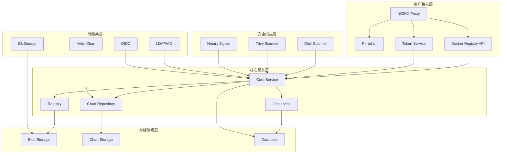

# Harbor企业级容器镜像仓库深度实践

> **作者**: 容器镜像管理专家 | **版本**: v1.0 | **更新时间**: 2026-02-07
> **适用场景**: 企业级镜像仓库架构 | **复杂度**: ⭐⭐⭐⭐⭐

## 🎯 摘要

本文档深入探讨了Harbor企业级容器镜像仓库的架构设计、安全管理和运维实践，基于大规模生产环境的部署经验，提供从镜像存储到分发的完整技术指南，帮助企业构建安全、高效的容器镜像管理体系。

## 1. Harbor架构深度解析

### 1.1 核心组件架构



### 1.2 组件功能详解

```yaml
Harbor组件说明:
  Core Service:
    功能: 核心业务逻辑处理
    职责:
      - 用户认证授权
      - 项目管理
      - 镜像元数据管理
      - 策略执行
    端口: 8080
  
  Portal UI:
    功能: Web管理界面
    特性:
      - 图形化管理
      - 多语言支持
      - 响应式设计
      - RBAC权限控制
    端口: 8080
  
  Registry:
    功能: Docker Registry V2实现
    特性:
      - OCI镜像规范兼容
      - 分布式存储支持
      - 内容寻址存储
      - 增量同步机制
    端口: 5000
  
  Jobservice:
    功能: 异步任务处理
    职责:
      - 镜像复制任务
      - 垃圾回收
      - 扫描任务调度
      - Webhook推送
    端口: 8080
  
  Clair/Trivy:
    功能: 安全漏洞扫描
    特性:
      - CVE漏洞检测
      - 多层扫描支持
      - 自动更新漏洞库
      - 详细报告生成
    端口: Clair(6060), Trivy(8080)
```

## 2. 企业级高可用部署

### 2.1 Harbor Helm部署配置

```yaml
# harbor-values.yaml
expose:
  type: ingress
  tls:
    enabled: true
    certSource: secret
    secret:
      secretName: harbor-tls-secret
  ingress:
    hosts:
      core: harbor.example.com
      notary: notary.example.com
    annotations:
      kubernetes.io/ingress.class: nginx
      nginx.ingress.kubernetes.io/proxy-body-size: "0"
      cert-manager.io/cluster-issuer: "letsencrypt-prod"

externalURL: https://harbor.example.com

harborAdminPassword: "StrongAdminPassword123!"

# 数据库配置
database:
  type: external
  external:
    host: postgresql.example.com
    port: 5432
    username: harbor
    password: "DBPassword123!"
    coreDatabase: registry
    clairDatabase: clair
    notaryServerDatabase: notary_server
    notarySignerDatabase: notary_signer
    sslmode: require

# Redis配置
redis:
  type: external
  external:
    addr: redis.example.com:6379
    password: "RedisPassword123!"

# 存储配置
persistence:
  persistentVolumeClaim:
    registry:
      existingClaim: ""
      storageClass: "fast-ssd"
      subPath: ""
      accessMode: ReadWriteOnce
      size: 100Gi
    chartmuseum:
      existingClaim: ""
      storageClass: "fast-ssd"
      subPath: ""
      accessMode: ReadWriteOnce
      size: 20Gi
    jobservice:
      existingClaim: ""
      storageClass: "fast-ssd"
      subPath: ""
      accessMode: ReadWriteOnce
      size: 10Gi
    database:
      existingClaim: ""
      storageClass: "fast-ssd"
      subPath: ""
      accessMode: ReadWriteOnce
      size: 20Gi
    redis:
      existingClaim: ""
      storageClass: "fast-ssd"
      subPath: ""
      accessMode: ReadWriteOnce
      size: 10Gi

# 安全扫描配置
clair:
  enabled: true
  replicas: 2
  resources:
    requests:
      memory: "512Mi"
      cpu: "250m"
    limits:
      memory: "1Gi"
      cpu: "500m"

trivy:
  enabled: true
  replicas: 2
  resources:
    requests:
      memory: "1Gi"
      cpu: "500m"
    limits:
      memory: "2Gi"
      cpu: "1"

notary:
  enabled: true
  server:
    replicas: 2
  signer:
    replicas: 2

# 高可用配置
core:
  replicas: 3
  resources:
    requests:
      memory: "1Gi"
      cpu: "500m"
    limits:
      memory: "2Gi"
      cpu: "1"

portal:
  replicas: 3
  resources:
    requests:
      memory: "256Mi"
      cpu: "100m"
    limits:
      memory: "512Mi"
      cpu: "200m"

registry:
  replicas: 2
  resources:
    requests:
      memory: "1Gi"
      cpu: "500m"
    limits:
      memory: "2Gi"
      cpu: "1"

jobservice:
  replicas: 2
  resources:
    requests:
      memory: "512Mi"
      cpu: "250m"
    limits:
      memory: "1Gi"
      cpu: "500m"
```

### 2.2 外部数据库部署

```yaml
# PostgreSQL主从部署
apiVersion: apps/v1
kind: StatefulSet
metadata:
  name: harbor-postgresql
  namespace: harbor
spec:
  serviceName: harbor-postgresql
  replicas: 3
  selector:
    matchLabels:
      app: harbor-postgresql
  template:
    metadata:
      labels:
        app: harbor-postgresql
    spec:
      containers:
      - name: postgresql
        image: postgres:14
        env:
        - name: POSTGRES_DB
          value: "harbor"
        - name: POSTGRES_USER
          value: "harbor"
        - name: POSTGRES_PASSWORD
          valueFrom:
            secretKeyRef:
              name: harbor-db-secret
              key: password
        - name: PGDATA
          value: /var/lib/postgresql/data/pgdata
        ports:
        - containerPort: 5432
        volumeMounts:
        - name: postgresql-data
          mountPath: /var/lib/postgresql/data
        resources:
          requests:
            memory: "1Gi"
            cpu: "500m"
          limits:
            memory: "2Gi"
            cpu: "1"
        livenessProbe:
          exec:
            command:
            - pg_isready
            - -U
            - harbor
          initialDelaySeconds: 30
          periodSeconds: 10
        readinessProbe:
          exec:
            command:
            - pg_isready
            - -U
            - harbor
          initialDelaySeconds: 5
          periodSeconds: 5
  volumeClaimTemplates:
  - metadata:
      name: postgresql-data
    spec:
      accessModes: [ "ReadWriteOnce" ]
      storageClassName: "fast-ssd"
      resources:
        requests:
          storage: 50Gi
---
# Redis集群部署
apiVersion: apps/v1
kind: StatefulSet
metadata:
  name: harbor-redis
  namespace: harbor
spec:
  serviceName: harbor-redis
  replicas: 6
  selector:
    matchLabels:
      app: harbor-redis
  template:
    metadata:
      labels:
        app: harbor-redis
    spec:
      containers:
      - name: redis
        image: redis:7-alpine
        command:
        - redis-server
        - /redis.conf
        ports:
        - containerPort: 6379
        volumeMounts:
        - name: redis-conf
          mountPath: /redis.conf
          subPath: redis.conf
        - name: redis-data
          mountPath: /data
        resources:
          requests:
            memory: "256Mi"
            cpu: "100m"
          limits:
            memory: "512Mi"
            cpu: "200m"
      volumes:
      - name: redis-conf
        configMap:
          name: harbor-redis-config
  volumeClaimTemplates:
  - metadata:
      name: redis-data
    spec:
      accessModes: [ "ReadWriteOnce" ]
      storageClassName: "fast-ssd"
      resources:
        requests:
          storage: 10Gi
```

## 3. 镜像安全扫描管理

### 3.1 漏洞扫描配置

```yaml
# Trivy扫描器配置
trivy:
  # 扫描间隔配置
  scan:
    timeout: "15m"
    workers: 10
    skip_update: false
    
  # 漏洞数据库配置
  github_token: ""  # 可选，提高API限制
  insecure: false
  ignore_unfixed: true
  severity: "UNKNOWN,LOW,MEDIUM,HIGH,CRITICAL"
  
  # 忽略特定漏洞配置
  ignore_policy: |
    # 忽略特定CVE
    vulnerability:
    - id: CVE-2023-12345
      package: openssl
      version: "< 1.1.1"
    - id: CVE-2023-67890
      package: curl
      version: "< 7.85.0"

# Clair扫描器配置
clair:
  updater:
    interval: "2h"
    enabled_updaters:
      - alpine
      - aws
      - debian
      - oracle
      - rhel
      - suse
      - ubuntu
  
  notifier:
    attempts: 3
    renotify_interval: "2h"
    http:
      endpoint: "http://harbor-core:8080/service/notifications/clair"
```

### 3.2 镜像签名与验证

```yaml
# Notary签名配置
notary:
  server:
    trust_service:
      type: remote
      hostname: notary-signer
      port: 7899
      tls_ca_file: /etc/ssl/notary/ca.crt
      key_algorithm: ecdsa
      lazy_regen: true
  
  signer:
    trust_service:
      type: local
      key_algorithm: ecdsa
      lazy_regen: true
    
    crypto_service:
      - type: pkcs11
        lib: /usr/lib/x86_64-linux-gnu/softhsm/libsofthsm2.so
        slot: 0
        pin: "1234"
```

## 4. 镜像复制与分发

### 4.1 复制策略配置

```yaml
# 镜像复制规则
replication:
  policies:
    - name: "production-to-dr"
      src_registry: harbor.example.com
      dest_registry: harbor-dr.example.com
      dest_namespace: "production"
      trigger:
        type: "scheduled"
        trigger_settings:
          cron: "0 2 * * *"
      filters:
        - type: "name"
          value: "library/**"
        - type: "tag"
          value: "latest,v*.*.*"
      deletion: false
      override: true
      speed: 0  # 无限制
    
    - name: "dev-to-staging"
      src_registry: harbor.example.com
      dest_registry: harbor-staging.example.com
      dest_namespace: "staging"
      trigger:
        type: "event_based"
      filters:
        - type: "resource"
          value: "artifact"
      deletion: true
      override: false
      speed: 1000  # 1000KB/s
```

### 4.2 多地域分发配置

```yaml
# 多地域Harbor集群配置
multi_region:
  regions:
    - name: "beijing"
      endpoint: "harbor-beijing.example.com"
      priority: 1
      weight: 50
    
    - name: "shanghai"
      endpoint: "harbor-shanghai.example.com"
      priority: 2
      weight: 30
    
    - name: "guangzhou"
      endpoint: "harbor-guangzhou.example.com"
      priority: 3
      weight: 20
  
  load_balancing:
    algorithm: "weighted_round_robin"
    health_check:
      interval: "30s"
      timeout: "5s"
      healthy_threshold: 2
      unhealthy_threshold: 3
```

## 5. 权限管理与RBAC

### 5.1 项目权限配置

```yaml
# 项目权限模型
projects:
  - name: "public-library"
    public: true
    content_trust: false
    vulnerability_scanning: true
    prevent_vul: false
    severity: "high"
    auto_scan: true
    
  - name: "private-apps"
    public: false
    owner: "app-team"
    members:
      - name: "developer-group"
        role: "developer"
      - name: "qa-group"
        role: "guest"
      - name: "ops-group"
        role: "maintainer"
    
    # 机器人账户
    robots:
      - name: "ci-pipeline"
        permissions:
          - resource: "repository"
            action: "push"
          - resource: "artifact"
            action: "pull"
        duration: "90d"
    
    # Webhook配置
    webhooks:
      - name: "scan-completed"
        target: "https://ci.example.com/webhook/harbor"
        event_types:
          - "SCANNING_COMPLETED"
          - "ARTIFACT_PUSHED"
        enabled: true
```

### 5.2 LDAP集成配置

```yaml
# LDAP认证配置
ldap:
  url: "ldaps://ldap.example.com:636"
  search_dn: "cn=admin,dc=example,dc=com"
  search_password: "ldap_password"
  base_dn: "ou=people,dc=example,dc=com"
  uid: "uid"
  filter: "(&(objectClass=person)(memberOf=cn=harbor-users,ou=groups,dc=example,dc=com))"
  scope: 2  # subtree
  connection_timeout: 5
  verify_cert: true
  
  # 属性映射
  user_attribute_mapping:
    email: "mail"
    realname: "displayName"
    phone: "telephoneNumber"
```

## 6. 存储优化与管理

### 6.1 对象存储集成

```yaml
# S3存储配置
storage_service:
  s3:
    bucket: "harbor-registry"
    region: "cn-north-1"
    regionendpoint: "https://s3.cn-north-1.amazonaws.com.cn"
    encrypt: false
    keyid: "your-key-id"
    secure: true
    v4auth: true
    chunksize: "5242880"
    rootdirectory: "/harbor"
    storage_class: "STANDARD"
    
    # 访问凭证
    accesskey: "your-access-key"
    secretkey: "your-secret-key"
    
    # 多区域冗余
    redirect:
      disable: false
      host: "harbor-registry.s3.cn-north-1.amazonaws.com.cn"

# 存储清理策略
storage_cleanup:
  garbage_collection:
    schedule: "0 2 * * 0"  # 每周日凌晨2点
    delete_untagged: true
    dry_run: false
    
  retention_policy:
    - project: "*"
      retention:
        rules:
          - tag_selectors:
              - kind: "doublestar"
                pattern: "latest"
            scope_selectors:
              repository:
                - kind: "doublestar"
                  pattern: "*"
            template: "always"
          - tag_selectors:
              - kind: "doublestar"
                pattern: "v*.*.*"
            scope_selectors:
              repository:
                - kind: "doublestar"
                  pattern: "*"
            template: "nDaysSinceLastPush"
            params:
              nDaysSinceLastPush: 90
```

## 7. 监控与告警

### 7.1 系统监控配置

```yaml
# Prometheus监控配置
monitoring:
  prometheus:
    enabled: true
    scrape_interval: "30s"
    metrics_path: "/metrics"
    
    # 监控目标
    targets:
      - job_name: "harbor-core"
        static_configs:
          - targets: ["harbor-core:8080"]
      
      - job_name: "harbor-registry"
        static_configs:
          - targets: ["harbor-registry:5000"]
      
      - job_name: "harbor-jobservice"
        static_configs:
          - targets: ["harbor-jobservice:8080"]
  
  # 告警规则
  alerting:
    rules:
      - alert: HarborRegistryDown
        expr: up{job="harbor-registry"} == 0
        for: "2m"
        labels:
          severity: "critical"
        annotations:
          summary: "Harbor Registry服务不可用"
          description: "Harbor Registry服务在 {{ $labels.instance }} 上不可访问"
      
      - alert: HighVulnerabilityImages
        expr: harbor_vulnerable_artifacts{severity="high"} > 10
        for: "5m"
        labels:
          severity: "warning"
        annotations:
          summary: "高危漏洞镜像过多"
          description: "发现 {{ $value }} 个高危漏洞镜像"
      
      - alert: LowDiskSpace
        expr: harbor_disk_space_available_bytes / harbor_disk_space_total_bytes * 100 < 10
        for: "5m"
        labels:
          severity: "critical"
        annotations:
          summary: "磁盘空间不足"
          description: "Harbor存储空间剩余 {{ $value }}%"
```

### 7.2 日志收集配置

```yaml
# Fluentd日志收集配置
<source>
  @type tail
  path /var/log/harbor/*.log
  pos_file /var/log/fluentd-harbor.pos
  tag harbor.*
  <parse>
    @type json
    time_key time
    time_format %Y-%m-%dT%H:%M:%S.%NZ
  </parse>
</source>

<filter harbor.**>
  @type record_transformer
  <record>
    hostname "#{Socket.gethostname}"
    service ${tag_suffix[1]}
  </record>
</filter>

<match harbor.core>
  @type elasticsearch
  host elasticsearch.example.com
  port 9200
  logstash_format true
  logstash_prefix harbor-core
  include_tag_key true
  tag_key @log_name
  flush_interval 10s
</match>

<match harbor.registry>
  @type elasticsearch
  host elasticsearch.example.com
  port 9200
  logstash_format true
  logstash_prefix harbor-registry
  include_tag_key true
  tag_key @log_name
  flush_interval 10s
</match>
```

## 8. 备份与灾难恢复

### 8.1 自动备份策略

```bash
#!/bin/bash
# harbor_backup.sh

BACKUP_DIR="/backup/harbor"
DATE=$(date +%Y%m%d_%H%M%S)
BACKUP_NAME="harbor_backup_${DATE}"

# 创建备份目录
mkdir -p ${BACKUP_DIR}/${BACKUP_NAME}

# 1. 备份数据库
echo "Backing up database..."
pg_dump -h postgresql.example.com -U harbor registry > ${BACKUP_DIR}/${BACKUP_NAME}/registry.sql
pg_dump -h postgresql.example.com -U harbor clair > ${BACKUP_DIR}/${BACKUP_NAME}/clair.sql
pg_dump -h postgresql.example.com -U harbor notary_server > ${BACKUP_DIR}/${BACKUP_NAME}/notary_server.sql
pg_dump -h postgresql.example.com -U harbor notary_signer > ${BACKUP_DIR}/${BACKUP_NAME}/notary_signer.sql

# 2. 备份配置文件
echo "Backing up configurations..."
kubectl get configmap -n harbor -o yaml > ${BACKUP_DIR}/${BACKUP_NAME}/configmaps.yaml
kubectl get secret -n harbor -o yaml > ${BACKUP_DIR}/${BACKUP_NAME}/secrets.yaml

# 3. 备份持久卷数据
echo "Backing up persistent volumes..."
kubectl get pvc -n harbor -o yaml > ${BACKUP_DIR}/${BACKUP_NAME}/pvcs.yaml

# 4. 备份镜像数据（如果使用本地存储）
if [ -d "/harbor_storage" ]; then
    tar -czf ${BACKUP_DIR}/${BACKUP_NAME}/storage.tar.gz -C / harbor_storage
fi

# 5. 创建备份清单
cat > ${BACKUP_DIR}/${BACKUP_NAME}/manifest.json << EOF
{
  "backup_name": "${BACKUP_NAME}",
  "created_at": "$(date -Iseconds)",
  "harbor_version": "$(helm get notes harbor | grep "Version:" | cut -d: -f2 | tr -d ' ')",
  "components": ["database", "configurations", "storage"],
  "checksum": "$(sha256sum ${BACKUP_DIR}/${BACKUP_NAME}/* | sha256sum | cut -d' ' -f1)"
}
EOF

# 6. 压缩备份
tar -czf ${BACKUP_DIR}/${BACKUP_NAME}.tar.gz -C ${BACKUP_DIR} ${BACKUP_NAME}

# 7. 清理临时目录
rm -rf ${BACKUP_DIR}/${BACKUP_NAME}

# 8. 上传到远程存储
if [ -n "$REMOTE_STORAGE" ]; then
    echo "Uploading to remote storage..."
    aws s3 cp ${BACKUP_DIR}/${BACKUP_NAME}.tar.gz s3://$REMOTE_STORAGE/backups/
fi

echo "Backup completed: ${BACKUP_DIR}/${BACKUP_NAME}.tar.gz"
```

### 8.2 灾难恢复流程

```yaml
# 灾难恢复计划
disaster_recovery:
  rto: "4h"  # 恢复时间目标
  rpo: "24h" # 恢复点目标
  
  recovery_steps:
    1:
      name: "环境准备"
      actions:
        - 部署新的Kubernetes集群
        - 配置网络和存储
        - 部署外部依赖（数据库、Redis）
    
    2:
      name: "数据恢复"
      actions:
        - 从备份恢复数据库
        - 恢复配置文件
        - 恢复镜像存储数据
    
    3:
      name: "服务部署"
      actions:
        - 部署Harbor组件
        - 验证服务连通性
        - 恢复SSL证书
    
    4:
      name: "验证测试"
      actions:
        - 功能测试
        - 性能测试
        - 安全扫描验证
    
    5:
      name: "切换上线"
      actions:
        - DNS切换
        - 监控告警启用
        - 用户通知

  rollback_plan:
    conditions:
      - 恢复失败
      - 数据不一致
      - 性能不达标
    actions:
      - 回滚到原环境
      - 分析失败原因
      - 更新恢复流程
```

## 9. 最佳实践与安全建议

### 9.1 安全配置最佳实践

```markdown
## 🔐 Harbor安全最佳实践

### 1. 访问控制
- 启用HTTPS加密传输
- 配置严格的RBAC权限
- 定期轮换访问凭证
- 实施多因素认证

### 2. 镜像安全管理
- 强制执行漏洞扫描
- 启用内容信任签名
- 设置镜像保留策略
- 定期清理无用镜像

### 3. 网络安全
- 限制管理接口访问
- 配置防火墙规则
- 启用网络策略隔离
- 监控异常访问行为

### 4. 合规性要求
- 定期安全审计
- 符合行业标准（如SOC2）
- 实施数据保护措施
- 保持系统更新补丁
```

### 9.2 性能优化建议

```yaml
性能优化建议:
  存储优化:
    - 使用高性能对象存储
    - 启用存储压缩
    - 配置合适的缓存策略
    - 定期清理垃圾数据
  
  网络优化:
    - 启用HTTP/2支持
    - 配置CDN加速
    - 优化TLS设置
    - 实施负载均衡
  
  数据库优化:
    - 定期维护和优化
    - 配置连接池
    - 索引优化
    - 读写分离
```

## 10. 未来发展与趋势

### 10.1 容器镜像技术演进

```yaml
容器镜像技术发展趋势:
  1. OCI标准深化:
     - 镜像格式标准化
     - 分发协议优化
     - 安全规范完善
     - 工具链统一
  
  2. 安全增强:
     - SBOM物料清单
     - 签名验证强化
     - 运行时安全
     - 零信任架构
  
  3. 性能提升:
     - 增量拉取优化
     - 并行下载支持
     - 智能缓存机制
     - 边缘分发网络
```

---
*本文档基于企业级容器镜像管理实践经验编写，持续更新最新技术和最佳实践。*