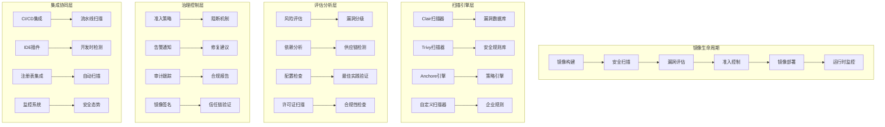

# Harbor企业级镜像安全扫描深度实践

> **作者**: 企业级容器安全专家 | **版本**: v1.0 | **更新时间**: 2026-02-07
> **适用场景**: 企业级容器镜像安全扫描与治理 | **复杂度**: ⭐⭐⭐⭐⭐

## 🎯 摘要

本文档深入探讨Harbor企业级镜像安全扫描系统的架构设计、漏洞检测实践和安全治理策略，基于金融、医疗、政府等高度监管行业的实践经验，提供从镜像构建到部署的全生命周期安全管控技术指南。

## 1. 企业级安全扫描架构

### 1.1 安全扫描体系设计



### 1.2 多层防御体系

#### 1.2.1 安全扫描层级

```yaml
# security-scanning-layers.yaml
security_layers:
  build_time_scanning:
    scope: "镜像构建阶段"
    tools:
      - hadolint: "Dockerfile静态分析"
      - docker-scan: "构建时安全检查"
      - snyk: "依赖漏洞扫描"
    checks:
      - 基础镜像安全性
      - Dockerfile最佳实践
      - 依赖包漏洞检测
      - 敏感信息泄露检查
      
  registry_scanning:
    scope: "镜像仓库阶段"
    tools:
      - clair: "CVE漏洞扫描"
      - trivy: "多层漏洞检测"
      - anchore: "深度安全分析"
    checks:
      - 操作系统漏洞
      - 应用程序漏洞
      - 配置安全检查
      - 许可证合规性
      
  deployment_scanning:
    scope: "部署前检查"
    tools:
      - opa: "策略即代码"
      - kube-bench: "K8s安全基准"
      - falco: "运行时异常检测"
    checks:
      - 部署策略验证
      - 资源限制检查
      - 网络策略审查
      - 安全上下文验证
      
  runtime_monitoring:
    scope: "运行时监控"
    tools:
      - falco: "异常行为检测"
      - sysdig: "系统调用监控"
      - aqua: "容器安全平台"
    checks:
      - 运行时攻击检测
      - 异常行为识别
      - 数据泄露监控
      - 权限滥用检测

scanning_pipeline:
  trigger_events:
    - image_push: "镜像推送到仓库"
    - scheduled_scan: "定时扫描策略"
    - manual_trigger: "手动触发扫描"
    - ci_cd_integration: "CI/CD流水线集成"
    
  scan_stages:
    stage_1_preparation:
      tasks:
        - 下载镜像层
        - 提取文件系统
        - 初始化扫描环境
      timeout: "300s"
      
    stage_2_static_analysis:
      tasks:
        - 操作系统包扫描
        - 应用依赖分析
        - 配置文件检查
        - 敏感数据检测
      timeout: "600s"
      
    stage_3_dynamic_analysis:
      tasks:
        - 模拟运行环境
        - 行为模式分析
        - 网络连接检查
        - 文件系统监控
      timeout: "900s"
      
    stage_4_policy_evaluation:
      tasks:
        - 漏洞严重性评估
        - 业务影响分析
        - 合规性检查
        - 准入决策
      timeout: "120s"
      
  result_processing:
    vulnerability_classification:
      critical: "CVSS >= 9.0"
      high: "CVSS 7.0-8.9"
      medium: "CVSS 4.0-6.9"
      low: "CVSS 0.1-3.9"
      negligible: "CVSS = 0.0"
      
    remediation_advice:
      immediate_action: "严重漏洞需立即修复"
      planned_fix: "高危漏洞需制定修复计划"
      monitoring_required: "中低风险漏洞持续监控"
      accepted_risk: "可接受风险需文档记录"
```

## 2. Harbor安全扫描深度集成

### 2.1 企业级Harbor部署

#### 2.1.1 高可用Harbor集群

```yaml
# harbor-ha-deployment.yaml
apiVersion: v1
kind: Namespace
metadata:
  name: harbor-system

---
# PostgreSQL主从集群
apiVersion: apps/v1
kind: StatefulSet
metadata:
  name: harbor-database
  namespace: harbor-system
spec:
  serviceName: "harbor-db"
  replicas: 3
  selector:
    matchLabels:
      app: harbor-database
  template:
    metadata:
      labels:
        app: harbor-database
    spec:
      containers:
      - name: postgresql
        image: postgres:13-alpine
        env:
        - name: POSTGRES_DB
          value: "registry"
        - name: POSTGRES_USER
          valueFrom:
            secretKeyRef:
              name: harbor-database-secret
              key: username
        - name: POSTGRES_PASSWORD
          valueFrom:
            secretKeyRef:
              name: harbor-database-secret
              key: password
        - name: PG_REPLICATION
          value: "true"
        ports:
        - containerPort: 5432
        volumeMounts:
        - name: postgres-storage
          mountPath: /var/lib/postgresql/data
        livenessProbe:
          exec:
            command: ["pg_isready", "-U", "postgres"]
          initialDelaySeconds: 30
          periodSeconds: 10
        readinessProbe:
          exec:
            command: ["pg_isready", "-U", "postgres"]
          initialDelaySeconds: 5
          periodSeconds: 5
  volumeClaimTemplates:
  - metadata:
      name: postgres-storage
    spec:
      accessModes: ["ReadWriteOnce"]
      resources:
        requests:
          storage: 100Gi

---
# Redis集群
apiVersion: apps/v1
kind: StatefulSet
metadata:
  name: harbor-redis
  namespace: harbor-system
spec:
  serviceName: "harbor-redis"
  replicas: 3
  selector:
    matchLabels:
      app: harbor-redis
  template:
    metadata:
      labels:
        app: harbor-redis
    spec:
      containers:
      - name: redis
        image: redis:6-alpine
        command: ["redis-server", "--appendonly", "yes", "--cluster-enabled", "yes"]
        ports:
        - containerPort: 6379
        volumeMounts:
        - name: redis-storage
          mountPath: /data
  volumeClaimTemplates:
  - metadata:
      name: redis-storage
    spec:
      accessModes: ["ReadWriteOnce"]
      resources:
        requests:
          storage: 50Gi

---
# Harbor核心组件
apiVersion: apps/v1
kind: Deployment
metadata:
  name: harbor-core
  namespace: harbor-system
spec:
  replicas: 3
  selector:
    matchLabels:
      app: harbor-core
  template:
    metadata:
      labels:
        app: harbor-core
    spec:
      containers:
      - name: core
        image: goharbor/harbor-core:v2.8.0
        env:
        - name: CORE_SECRET
          valueFrom:
            secretKeyRef:
              name: harbor-core-secret
              key: secret
        - name: JOBSERVICE_SECRET
          valueFrom:
            secretKeyRef:
              name: harbor-jobservice-secret
              key: secret
        - name: DATABASE_TYPE
          value: "postgresql"
        - name: DATABASE_HOST
          value: "harbor-database.harbor-system.svc.cluster.local"
        - name: DATABASE_PORT
          value: "5432"
        - name: DATABASE_USERNAME
          valueFrom:
            secretKeyRef:
              name: harbor-database-secret
              key: username
        - name: DATABASE_PASSWORD
          valueFrom:
            secretKeyRef:
              name: harbor-database-secret
              key: password
        - name: DATABASE_NAME
          value: "registry"
        ports:
        - containerPort: 8080
        readinessProbe:
          httpGet:
            path: /api/v2.0/ping
            port: 8080
          initialDelaySeconds: 30
          periodSeconds: 10
```

#### 2.1.2 安全扫描器集成配置

```yaml
# harbor-security-scanner.yaml
apiVersion: v1
kind: ConfigMap
metadata:
  name: harbor-scanner-config
  namespace: harbor-system
data:
  scanner-config.yaml: |
    scanners:
      clair:
        enabled: true
        url: "http://clair-scanner.harbor-system.svc.cluster.local:6060"
        timeout: "300s"
        skip_tls_verify: false
        
      trivy:
        enabled: true
        url: "http://trivy-scanner.harbor-system.svc.cluster.local:8080"
        timeout: "600s"
        skip_tls_verify: false
        github_token: "${TRIVY_GITHUB_TOKEN}"
        
      anchore:
        enabled: false  # 企业版功能
        url: "https://anchore-enterprise.harbor-system.svc.cluster.local"
        timeout: "900s"
        
    scan_policies:
      default_policy:
        reject_vulnerabilities:
          - severity: "critical"
            fix_available: true
          - severity: "high"
            age_days: 30
            fix_available: true
            
        allow_vulnerabilities:
          - severity: "medium"
            justification_required: true
          - severity: "low"
            auto_approve: true
            
        grace_periods:
          critical: "0h"
          high: "72h"
          medium: "168h"
          low: "720h"
          
    notification_settings:
      webhook_urls:
        - "https://security-notifications.company.internal/webhook"
        - "https://slack-webhook.company.internal/security"
        
      email_recipients:
        - "security-team@company.com"
        - "devops-team@company.com"
        
      notification_levels:
        - "critical"
        - "high"
        - "policy_violation"
```

### 2.2 漏洞管理与修复

#### 2.2.1 自动化漏洞修复流程

```python
# vulnerability-auto-remediation.py
import requests
import json
import time
from datetime import datetime, timedelta
from typing import Dict, List, Optional
import subprocess
import logging

class VulnerabilityAutoRemediator:
    def __init__(self, harbor_api_url: str, api_token: str):
        self.harbor_url = harbor_api_url
        self.headers = {
            'Authorization': f'Bearer {api_token}',
            'Content-Type': 'application/json'
        }
        self.logger = logging.getLogger(__name__)
        
    def scan_image_for_vulnerabilities(self, project_name: str, 
                                     repository_name: str, 
                                     tag: str) -> Dict:
        """扫描镜像漏洞"""
        scan_url = f"{self.harbor_url}/api/v2.0/projects/{project_name}/repositories/{repository_name}/artifacts/{tag}/scan"
        
        try:
            # 触发扫描
            response = requests.post(scan_url, headers=self.headers)
            if response.status_code != 202:
                raise Exception(f"扫描触发失败: {response.status_code}")
                
            # 等待扫描完成
            max_wait_time = 300  # 5分钟
            start_time = time.time()
            
            while time.time() - start_time < max_wait_time:
                scan_status = self.get_scan_status(project_name, repository_name, tag)
                if scan_status.get('scan_status') == 'Success':
                    break
                elif scan_status.get('scan_status') == 'Error':
                    raise Exception("扫描过程中发生错误")
                time.sleep(10)
            else:
                raise Exception("扫描超时")
                
            # 获取扫描结果
            return self.get_vulnerability_report(project_name, repository_name, tag)
            
        except Exception as e:
            self.logger.error(f"镜像扫描失败: {e}")
            return {}
    
    def get_scan_status(self, project_name: str, repository_name: str, tag: str) -> Dict:
        """获取扫描状态"""
        status_url = f"{self.harbor_url}/api/v2.0/projects/{project_name}/repositories/{repository_name}/artifacts/{tag}"
        
        response = requests.get(status_url, headers=self.headers)
        if response.status_code == 200:
            artifact_info = response.json()
            return {
                'scan_status': artifact_info.get('scan_overview', {}).get('scan_status', 'Unknown'),
                'severity_summary': artifact_info.get('scan_overview', {}).get('summary', {})
            }
        return {'scan_status': 'Error'}
    
    def get_vulnerability_report(self, project_name: str, repository_name: str, tag: str) -> Dict:
        """获取漏洞报告"""
        report_url = f"{self.harbor_url}/api/v2.0/projects/{project_name}/repositories/{repository_name}/artifacts/{tag}/additions/vulnerabilities"
        
        response = requests.get(report_url, headers=self.headers)
        if response.status_code == 200:
            return response.json()
        return {}
    
    def prioritize_vulnerabilities(self, vulnerabilities: List[Dict]) -> List[Dict]:
        """漏洞优先级排序"""
        severity_weights = {
            'Critical': 5,
            'High': 4,
            'Medium': 3,
            'Low': 2,
            'Negligible': 1
        }
        
        # 添加优先级分数
        for vuln in vulnerabilities:
            severity = vuln.get('severity', 'Unknown')
            cvss_score = vuln.get('vendor_attributes', {}).get('CVSS', {}).get('Score', 0)
            
            # 计算优先级分数
            base_score = severity_weights.get(severity, 0)
            age_factor = self._calculate_age_factor(vuln.get('published_date'))
            exploit_factor = 1.5 if vuln.get('exploit_available', False) else 1.0
            fix_factor = 1.3 if vuln.get('fix_version') else 0.7
            
            priority_score = base_score * cvss_score * age_factor * exploit_factor * fix_factor
            vuln['priority_score'] = round(priority_score, 2)
        
        # 按优先级排序
        return sorted(vulnerabilities, key=lambda x: x['priority_score'], reverse=True)
    
    def _calculate_age_factor(self, published_date: str) -> float:
        """计算漏洞年龄因子"""
        if not published_date:
            return 1.0
            
        try:
            pub_date = datetime.fromisoformat(published_date.replace('Z', '+00:00'))
            age_days = (datetime.now() - pub_date).days
            
            if age_days <= 30:
                return 2.0  # 新漏洞，高优先级
            elif age_days <= 90:
                return 1.5  # 较新漏洞
            elif age_days <= 365:
                return 1.2  # 一年内漏洞
            else:
                return 1.0  # 老漏洞
        except:
            return 1.0
    
    def generate_remediation_plan(self, prioritized_vulns: List[Dict]) -> Dict:
        """生成修复计划"""
        plan = {
            'immediate_actions': [],      # 立即修复
            'short_term_fixes': [],       # 短期计划
            'long_term_improvements': [], # 长期改进
            'accepted_risks': []          # 可接受风险
        }
        
        for vuln in prioritized_vulns:
            severity = vuln['severity']
            priority_score = vuln['priority_score']
            fix_version = vuln.get('fix_version')
            
            remediation_item = {
                'vulnerability_id': vuln['id'],
                'package_name': vuln['package'],
                'severity': severity,
                'cvss_score': vuln.get('vendor_attributes', {}).get('CVSS', {}).get('Score'),
                'description': vuln['description'][:100] + '...' if len(vuln['description']) > 100 else vuln['description'],
                'fix_available': bool(fix_version),
                'fix_version': fix_version,
                'priority_score': priority_score
            }
            
            if severity == 'Critical' or (severity == 'High' and priority_score > 20):
                plan['immediate_actions'].append(remediation_item)
            elif severity == 'High' or (severity == 'Medium' and priority_score > 15):
                plan['short_term_fixes'].append(remediation_item)
            elif severity == 'Medium' or severity == 'Low':
                plan['long_term_improvements'].append(remediation_item)
            else:
                plan['accepted_risks'].append(remediation_item)
        
        return plan
    
    def auto_patch_image(self, project_name: str, repository_name: str, 
                        current_tag: str, fix_plan: Dict) -> Optional[str]:
        """自动修复镜像"""
        try:
            # 构建新的Dockerfile
            new_dockerfile = self._generate_patched_dockerfile(
                project_name, repository_name, current_tag, fix_plan
            )
            
            # 构建新镜像
            new_tag = f"{current_tag}-patched-{datetime.now().strftime('%Y%m%d%H%M%S')}"
            build_result = self._build_patched_image(
                project_name, repository_name, new_tag, new_dockerfile
            )
            
            if build_result:
                # 扫描新镜像
                new_scan_result = self.scan_image_for_vulnerabilities(
                    project_name, repository_name, new_tag
                )
                
                # 验证修复效果
                if self._verify_patches_effective(new_scan_result, fix_plan):
                    self.logger.info(f"镜像修复成功: {new_tag}")
                    return new_tag
                else:
                    self.logger.warning(f"修复验证失败: {new_tag}")
                    return None
            else:
                self.logger.error("镜像构建失败")
                return None
                
        except Exception as e:
            self.logger.error(f"自动修复过程失败: {e}")
            return None
    
    def _generate_patched_dockerfile(self, project_name: str, repository_name: str,
                                   current_tag: str, fix_plan: Dict) -> str:
        """生成修复后的Dockerfile"""
        # 获取原始镜像信息
        image_info = self._get_image_info(project_name, repository_name, current_tag)
        
        dockerfile_lines = [
            f"FROM {image_info.get('digest', f'{project_name}/{repository_name}:{current_tag}')}",
            "",
            "# 安全补丁更新"
        ]
        
        # 添加包更新命令
        critical_fixes = [item for item in fix_plan['immediate_actions'] 
                         if item['fix_available']]
        
        if critical_fixes:
            packages_to_update = [item['package_name'] for item in critical_fixes]
            dockerfile_lines.extend([
                "RUN apt-get update && apt-get upgrade -y \\",
                f"    {' '.join(packages_to_update)} \\",
                "    && apt-get clean \\",
                "    && rm -rf /var/lib/apt/lists/*"
            ])
        
        # 添加安全配置
        dockerfile_lines.extend([
            "",
            "# 安全强化配置",
            "USER nobody",
            "WORKDIR /app",
            'ENV NODE_ENV="production"'
        ])
        
        return "\n".join(dockerfile_lines)
    
    def _build_patched_image(self, project_name: str, repository_name: str, 
                           new_tag: str, dockerfile_content: str) -> bool:
        """构建修复后的镜像"""
        try:
            # 写入Dockerfile
            with open('/tmp/Dockerfile.patched', 'w') as f:
                f.write(dockerfile_content)
            
            # 构建镜像
            build_cmd = [
                'docker', 'build',
                '-f', '/tmp/Dockerfile.patched',
                '-t', f'{project_name}/{repository_name}:{new_tag}',
                '.'
            ]
            
            result = subprocess.run(build_cmd, capture_output=True, text=True, cwd='/tmp')
            
            if result.returncode == 0:
                # 推送镜像到Harbor
                push_cmd = ['docker', 'push', f'{project_name}/{repository_name}:{new_tag}']
                push_result = subprocess.run(push_cmd, capture_output=True, text=True)
                
                return push_result.returncode == 0
            else:
                self.logger.error(f"镜像构建失败: {result.stderr}")
                return False
                
        except Exception as e:
            self.logger.error(f"构建过程异常: {e}")
            return False
    
    def _verify_patches_effective(self, new_scan_result: Dict, fix_plan: Dict) -> bool:
        """验证修复是否有效"""
        if not new_scan_result:
            return False
            
        # 检查关键漏洞是否已修复
        immediate_fixes = {item['vulnerability_id'] for item in fix_plan['immediate_actions']}
        remaining_critical = set()
        
        for scanner_result in new_scan_result.values():
            if 'vulnerabilities' in scanner_result:
                for vuln in scanner_result['vulnerabilities']:
                    if vuln['id'] in immediate_fixes and vuln['severity'] in ['Critical', 'High']:
                        remaining_critical.add(vuln['id'])
        
        # 如果没有剩余的关键漏洞，认为修复有效
        return len(remaining_critical) == 0

# 使用示例
remediator = VulnerabilityAutoRemediator(
    "https://harbor.company.internal",
    "harbor-api-token"
)

# 扫描镜像
vulns = remediator.scan_image_for_vulnerabilities("myproject", "myapp", "v1.2.3")

# 优先级排序
prioritized = remediator.prioritize_vulnerabilities(vulns.get('application/vnd.security.vulnerability.report', []))

# 生成修复计划
fix_plan = remediator.generate_remediation_plan(prioritized)

# 自动修复
new_tag = remediator.auto_patch_image("myproject", "myapp", "v1.2.3", fix_plan)
if new_tag:
    print(f"修复成功，新标签: {new_tag}")
```

## 3. 企业级安全策略

### 3.1 镜像准入控制策略

#### 3.1.1 动态准入策略引擎

```yaml
# admission-control-policies.yaml
apiVersion: v1
kind: ConfigMap
metadata:
  name: harbor-admission-policies
  namespace: harbor-system
data:
  policies.json: |
    {
      "policy_sets": {
        "production_policy": {
          "name": "生产环境准入策略",
          "description": "严格的生产环境镜像准入控制",
          "rules": [
            {
              "name": "基础镜像检查",
              "condition": "artifact.base_image.trusted == true",
              "action": "allow",
              "severity": "block"
            },
            {
              "name": "严重漏洞阻断",
              "condition": "vulnerabilities.critical.count > 0",
              "action": "deny",
              "severity": "block"
            },
            {
              "name": "高危漏洞检查",
              "condition": "vulnerabilities.high.count > 3 AND vulnerabilities.high.fix_available == true",
              "action": "deny",
              "severity": "block"
            },
            {
              "name": "许可证合规检查",
              "condition": "licenses.restricted.contains(['GPL', 'AGPL'])",
              "action": "deny",
              "severity": "warn"
            },
            {
              "name": "镜像年龄检查",
              "condition": "artifact.age_days > 90",
              "action": "warn",
              "severity": "warn"
            }
          ],
          "exceptions": [
            {
              "name": "紧急修复例外",
              "condition": "request.emergency_patch == true AND request.approver.role == 'security_admin'",
              "expires_in_hours": 24
            }
          ]
        },
        
        "development_policy": {
          "name": "开发环境准入策略",
          "description": "相对宽松的开发环境镜像准入控制",
          "rules": [
            {
              "name": "基础安全检查",
              "condition": "vulnerabilities.critical.count == 0",
              "action": "allow",
              "severity": "block"
            },
            {
              "name": "高危漏洞限制",
              "condition": "vulnerabilities.high.count > 10",
              "action": "deny",
              "severity": "block"
            },
            {
              "name": "恶意软件检查",
              "condition": "malware.detected == true",
              "action": "deny",
              "severity": "block"
            }
          ]
        }
      },
      
      "global_settings": {
        "default_policy": "development_policy",
        "scan_timeout_seconds": 300,
        "retry_attempts": 3,
        "notification_channels": ["webhook", "email", "slack"],
        "audit_logging": true
      }
    }
```

### 3.2 供应链安全治理

#### 3.2.1 软件物料清单(SBOM)管理

```python
# sbom-supply-chain-security.py
import json
import hashlib
from datetime import datetime
from typing import Dict, List, Optional
import requests
from cryptography.hazmat.primitives import hashes
from cryptography.hazmat.primitives.asymmetric import rsa, padding
from cryptography.hazmat.backends import default_backend
from cryptography.x509 import load_pem_x509_certificate
from cryptography.hazmat.primitives import serialization

class SBOMSupplyChainManager:
    def __init__(self, harbor_api_url: str, private_key_path: str):
        self.harbor_url = harbor_api_url
        self.private_key = self._load_private_key(private_key_path)
        self.sbom_store = {}  # 简化的SBOM存储
        
    def _load_private_key(self, key_path: str) -> rsa.RSAPrivateKey:
        """加载私钥用于签名"""
        with open(key_path, 'rb') as key_file:
            private_key = serialization.load_pem_private_key(
                key_file.read(),
                password=None,
                backend=default_backend()
            )
        return private_key
    
    def generate_sbom(self, image_digest: str, components: List[Dict]) -> Dict:
        """生成软件物料清单"""
        sbom = {
            'sbom_format': 'CycloneDX',
            'spec_version': '1.4',
            'version': '1',
            'serial_number': f"urn:uuid:{self._generate_uuid()}",
            'timestamp': datetime.now().isoformat(),
            'metadata': {
                'timestamp': datetime.now().isoformat(),
                'tools': [
                    {
                        'vendor': 'Harbor',
                        'name': 'SBOM Generator',
                        'version': '1.0.0'
                    }
                ],
                'component': {
                    'type': 'container',
                    'name': 'container-image',
                    'version': image_digest,
                    'hashes': [
                        {
                            'alg': 'SHA-256',
                            'content': image_digest.replace('sha256:', '')
                        }
                    ]
                }
            },
            'components': self._normalize_components(components),
            'dependencies': self._analyze_dependencies(components)
        }
        
        return sbom
    
    def _normalize_components(self, components: List[Dict]) -> List[Dict]:
        """标准化组件信息"""
        normalized = []
        for component in components:
            normalized_component = {
                'type': component.get('type', 'library'),
                'name': component.get('name', 'unknown'),
                'version': component.get('version', 'unknown'),
                'purl': component.get('purl', ''),
                'licenses': component.get('licenses', []),
                'hashes': self._generate_component_hashes(component),
                'supplier': component.get('supplier', {}),
                'external_references': component.get('external_references', [])
            }
            normalized.append(normalized_component)
        return normalized
    
    def _generate_component_hashes(self, component: Dict) -> List[Dict]:
        """生成组件哈希值"""
        content = json.dumps(component, sort_keys=True)
        sha256_hash = hashlib.sha256(content.encode()).hexdigest()
        
        return [
            {
                'alg': 'SHA-256',
                'content': sha256_hash
            }
        ]
    
    def _analyze_dependencies(self, components: List[Dict]) -> List[Dict]:
        """分析组件依赖关系"""
        dependencies = []
        component_map = {comp['name']: comp for comp in components}
        
        for component in components:
            deps = component.get('dependencies', [])
            if deps:
                dependency_entry = {
                    'ref': component['name'],
                    'depends_on': [dep for dep in deps if dep in component_map]
                }
                dependencies.append(dependency_entry)
                
        return dependencies
    
    def sign_sbom(self, sbom: Dict) -> Dict:
        """对SBOM进行数字签名"""
        # 序列化SBOM
        sbom_json = json.dumps(sbom, indent=2, sort_keys=True)
        
        # 生成签名
        signature = self.private_key.sign(
            sbom_json.encode('utf-8'),
            padding.PSS(
                mgf=padding.MGF1(hashes.SHA256()),
                salt_length=padding.PSS.MAX_LENGTH
            ),
            hashes.SHA256()
        )
        
        # 创建签名包装
        signed_sbom = {
            'sbom': sbom,
            'signature': signature.hex(),
            'signing_algorithm': 'RSASSA-PSS',
            'timestamp': datetime.now().isoformat(),
            'signer': 'Harbor Supply Chain Security'
        }
        
        return signed_sbom
    
    def verify_sbom_signature(self, signed_sbom: Dict, public_key_pem: str) -> bool:
        """验证SBOM签名"""
        try:
            # 加载公钥
            public_key = serialization.load_pem_public_key(
                public_key_pem.encode('utf-8'),
                backend=default_backend()
            )
            
            # 验证签名
            sbom_json = json.dumps(signed_sbom['sbom'], indent=2, sort_keys=True)
            signature_bytes = bytes.fromhex(signed_sbom['signature'])
            
            public_key.verify(
                signature_bytes,
                sbom_json.encode('utf-8'),
                padding.PSS(
                    mgf=padding.MGF1(hashes.SHA256()),
                    salt_length=padding.PSS.MAX_LENGTH
                ),
                hashes.SHA256()
            )
            
            return True
        except Exception as e:
            print(f"签名验证失败: {e}")
            return False
    
    def store_sbom(self, image_digest: str, signed_sbom: Dict):
        """存储SBOM到注册表"""
        self.sbom_store[image_digest] = signed_sbom
        
        # 同时存储到Harbor
        sbom_url = f"{self.harbor_url}/api/v2.0/sbom/{image_digest}"
        headers = {'Content-Type': 'application/json'}
        
        try:
            response = requests.post(
                sbom_url,
                headers=headers,
                data=json.dumps(signed_sbom),
                timeout=30
            )
            if response.status_code == 201:
                print(f"SBOM已存储: {image_digest}")
            else:
                print(f"SBOM存储失败: {response.status_code}")
        except Exception as e:
            print(f"SBOM存储异常: {e}")
    
    def retrieve_sbom(self, image_digest: str) -> Optional[Dict]:
        """检索SBOM"""
        # 首先从本地缓存查找
        if image_digest in self.sbom_store:
            return self.sbom_store[image_digest]
        
        # 从Harbor检索
        sbom_url = f"{self.harbor_url}/api/v2.0/sbom/{image_digest}"
        try:
            response = requests.get(sbom_url, timeout=30)
            if response.status_code == 200:
                sbom = response.json()
                self.sbom_store[image_digest] = sbom
                return sbom
        except Exception as e:
            print(f"SBOM检索异常: {e}")
        
        return None
    
    def analyze_supply_chain_risk(self, sbom: Dict) -> Dict:
        """分析供应链风险"""
        risk_analysis = {
            'total_components': len(sbom['components']),
            'vulnerable_components': [],
            'license_risks': [],
            'dependency_depth': 0,
            'risk_score': 0.0
        }
        
        # 分析漏洞组件
        for component in sbom['components']:
            if 'vulnerabilities' in component:
                risk_analysis['vulnerable_components'].append({
                    'name': component['name'],
                    'version': component['version'],
                    'vulnerability_count': len(component['vulnerabilities'])
                })
        
        # 分析许可证风险
        restricted_licenses = ['GPL', 'AGPL', 'LGPL']
        for component in sbom['components']:
            licenses = component.get('licenses', [])
            for license_info in licenses:
                license_name = license_info.get('license', {}).get('id', '')
                if license_name in restricted_licenses:
                    risk_analysis['license_risks'].append({
                        'component': component['name'],
                        'license': license_name,
                        'risk_level': 'high'
                    })
        
        # 计算风险评分
        vulnerability_risk = len(risk_analysis['vulnerable_components']) / max(risk_analysis['total_components'], 1)
        license_risk = len(risk_analysis['license_risks']) / max(risk_analysis['total_components'], 1)
        risk_analysis['risk_score'] = round((vulnerability_risk * 0.7 + license_risk * 0.3) * 100, 2)
        
        return risk_analysis
    
    def generate_supply_chain_report(self, image_digest: str) -> Dict:
        """生成供应链安全报告"""
        sbom = self.retrieve_sbom(image_digest)
        if not sbom:
            return {'error': 'SBOM not found'}
        
        risk_analysis = self.analyze_supply_chain_risk(sbom['sbom'])
        
        report = {
            'image_digest': image_digest,
            'generated_at': datetime.now().isoformat(),
            'sbom_metadata': sbom['sbom']['metadata'],
            'supply_chain_analysis': risk_analysis,
            'recommendations': self._generate_recommendations(risk_analysis)
        }
        
        return report
    
    def _generate_recommendations(self, risk_analysis: Dict) -> List[str]:
        """生成风险缓解建议"""
        recommendations = []
        
        if risk_analysis['risk_score'] > 70:
            recommendations.append("供应链风险较高，建议进行全面安全审查")
        
        if risk_analysis['vulnerable_components']:
            recommendations.append(f"发现{len(risk_analysis['vulnerable_components'])}个存在漏洞的组件，建议优先修复")
        
        if risk_analysis['license_risks']:
            recommendations.append(f"发现{len(risk_analysis['license_risks'])}个许可证风险，建议法律合规审查")
            
        if risk_analysis['total_components'] > 100:
            recommendations.append("组件数量较多，建议优化依赖关系")
        
        return recommendations

# 使用示例
sbom_manager = SBOMSupplyChainManager(
    "https://harbor.company.internal",
    "/secure/keys/sbom-private.key"
)

# 生成SBOM
components = [
    {
        'name': 'express',
        'version': '4.18.2',
        'type': 'framework',
        'licenses': [{'license': {'id': 'MIT'}}],
        'dependencies': ['accepts', 'array-flatten']
    },
    {
        'name': 'lodash',
        'version': '4.17.21',
        'type': 'library',
        'licenses': [{'license': {'id': 'MIT'}}],
        'dependencies': []
    }
]

sbom = sbom_manager.generate_sbom("sha256:abcd1234...", components)
signed_sbom = sbom_manager.sign_sbom(sbom)
sbom_manager.store_sbom("sha256:abcd1234...", signed_sbom)

# 生成供应链报告
report = sbom_manager.generate_supply_chain_report("sha256:abcd1234...")
print(json.dumps(report, indent=2, ensure_ascii=False))
```

通过以上企业级镜像安全扫描深度实践，企业可以建立完整的容器镜像安全治理体系，实现从镜像构建、扫描、准入到运行时监控的全生命周期安全管理。