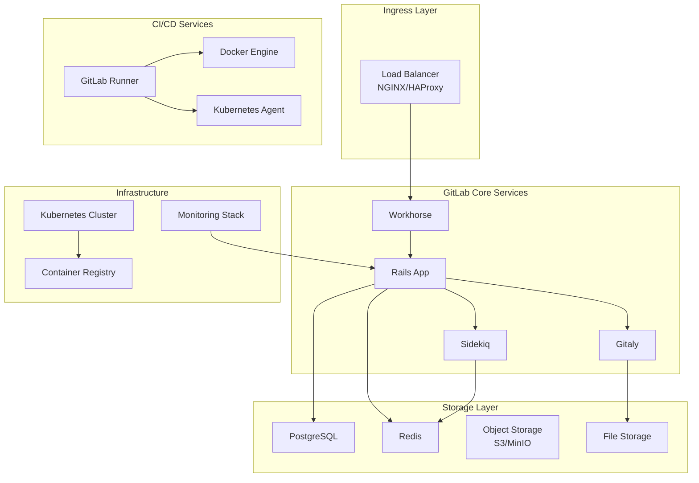

# GitLab CI/CD Enterprise Pipeline Automation Platform

## 概述 (Overview)

GitLab CI/CD 是一体化的 DevOps 平台，提供从代码管理到持续交付的完整解决方案。本文档详细介绍 GitLab 企业级 CI/CD 架构设计、流水线优化和大规模部署实践。

GitLab CI/CD is an integrated DevOps platform that provides a complete solution from code management to continuous delivery. This document details GitLab enterprise CI/CD architecture design, pipeline optimization, and large-scale deployment practices.

## 架构设计 (Architecture Design)

### 企业级架构 (Enterprise Architecture)

```yaml
# GitLab 企业级部署架构
apiVersion: v1
kind: Namespace
metadata:
  name: gitlab-system
---
apiVersion: v1
kind: ConfigMap
metadata:
  name: gitlab-config
  namespace: gitlab-system
data:
  gitlab.yml: |
    production: &base
      gitlab:
        host: gitlab.example.com
        port: 443
        https: true
        ssh_port: 22
        max_request_duration_seconds: 55
        impersonation_enabled: true
        usage_ping_enabled: false
        
      gitlab_ci:
        builds_enabled: true
        registry.enabled: true
        shared_runners_enabled: true
        max_number_of_builds: 100
        
      runners:
        registration_token: ${RUNNER_REGISTRATION_TOKEN}
        concurrent: 20
        check_interval: 0
        log_level: info
        
      prometheus:
        enabled: true
        server: http://prometheus-operated:9090
        
      redis:
        host: redis-master.gitlab-system.svc.cluster.local
        port: 6379
        password: ${REDIS_PASSWORD}
        database: 0
        
      postgresql:
        host: postgresql-primary.gitlab-system.svc.cluster.local
        port: 5432
        username: gitlab
        password: ${POSTGRESQL_PASSWORD}
        database: gitlabhq_production
        prepared_statements: false
        
      gitaly:
        client_path: "/home/git/gitaly/bin"
        token: ${GITALY_TOKEN}
        
      monitoring:
        ip_whitelist:
          - 127.0.0.0/8
          - ::1/128
        web_listen_address: localhost:8080
```

### 微服务架构 (Microservices Architecture)



## 部署配置 (Deployment Configuration)

### Kubernetes 部署 (Kubernetes Deployment)

```yaml
# GitLab 主服务部署
apiVersion: apps/v1
kind: StatefulSet
metadata:
  name: gitlab
  namespace: gitlab-system
spec:
  serviceName: gitlab
  replicas: 3
  selector:
    matchLabels:
      app: gitlab
  template:
    metadata:
      labels:
        app: gitlab
    spec:
      initContainers:
      - name: configure
        image: busybox:1.35
        command: ['sh', '-c', 'chown -R 1000:1000 /var/opt/gitlab']
        volumeMounts:
        - name: gitlab-data
          mountPath: /var/opt/gitlab
          
      containers:
      - name: gitlab
        image: gitlab/gitlab-ce:16.7.0-ce.0
        env:
        - name: GITLAB_OMNIBUS_CONFIG
          valueFrom:
            configMapKeyRef:
              name: gitlab-config
              key: gitlab.rb
        - name: POSTGRES_USER
          value: "gitlab"
        - name: POSTGRES_PASSWORD
          valueFrom:
            secretKeyRef:
              name: postgres-secrets
              key: password
        ports:
        - containerPort: 80
          name: http
        - containerPort: 22
          name: ssh
        readinessProbe:
          httpGet:
            path: /-/readiness
            port: 80
          initialDelaySeconds: 60
          periodSeconds: 10
        livenessProbe:
          httpGet:
            path: /-/health
            port: 80
          initialDelaySeconds: 120
          periodSeconds: 30
        volumeMounts:
        - name: gitlab-data
          mountPath: /var/opt/gitlab
        - name: gitlab-config
          mountPath: /etc/gitlab
        - name: gitlab-logs
          mountPath: /var/log/gitlab
        resources:
          requests:
            cpu: "2"
            memory: "4Gi"
          limits:
            cpu: "4"
            memory: "8Gi"
          
      volumes:
      - name: gitlab-config
        configMap:
          name: gitlab-config
      - name: gitlab-logs
        emptyDir: {}
          
  volumeClaimTemplates:
  - metadata:
      name: gitlab-data
    spec:
      accessModes: ["ReadWriteOnce"]
      storageClassName: fast-ssd
      resources:
        requests:
          storage: 200Gi
```

### Runner 配置 (Runner Configuration)

```toml
# GitLab Runner 配置文件
concurrent = 20
check_interval = 0

[session_server]
  session_timeout = 1800

[[runners]]
  name = "kubernetes-runner"
  url = "https://gitlab.example.com/"
  token = "${RUNNER_TOKEN}"
  executor = "kubernetes"
  [runners.kubernetes]
    host = ""
    bearer_token_overwrite_allowed = true
    image = "ubuntu:22.04"
    namespace = "gitlab-runner"
    privileged = true
    poll_timeout = 180
    service_account = "gitlab-runner"
    [runners.kubernetes.pod_annotations]
      prometheus.io/scrape = "true"
      prometheus.io/port = "9102"
    [runners.kubernetes.node_selector]
      gitlab-runner = "true"
    [[runners.kubernetes.volumes.empty_dir]]
      name = "docker-certs"
      mount_path = "/certs/client"
      medium = "Memory"

[[runners]]
  name = "docker-runner"
  url = "https://gitlab.example.com/"
  token = "${RUNNER_TOKEN}"
  executor = "docker"
  [runners.docker]
    tls_verify = false
    image = "docker:24.0.5"
    privileged = true
    disable_entrypoint_overwrite = false
    oom_kill_disable = false
    disable_cache = false
    volumes = [
      "/cache",
      "/var/run/docker.sock:/var/run/docker.sock",
      "/certs/client"
    ]
    shm_size = 0
    pull_policy = "if-not-present"
```

## 流水线设计 (Pipeline Design)

### 高级流水线配置 (Advanced Pipeline Configuration)

```yaml
# .gitlab-ci.yml - 企业级流水线配置
stages:
  - security-scan
  - build
  - test
  - deploy-staging
  - e2e-test
  - deploy-production
  - cleanup

variables:
  DOCKER_DRIVER: overlay2
  DOCKER_TLS_CERTDIR: "/certs"
  KUBE_NAMESPACE: ${CI_PROJECT_PATH_SLUG}-${CI_COMMIT_REF_SLUG}
  HELM_RELEASE: ${CI_PROJECT_NAME}-${CI_COMMIT_REF_SLUG}

# 模板定义
.docker-build-template: &docker-build-template
  image: docker:24.0.5
  services:
    - docker:24.0.5-dind
  before_script:
    - docker login -u $CI_REGISTRY_USER -p $CI_REGISTRY_PASSWORD $CI_REGISTRY
  script:
    - docker build --pull -t $CI_REGISTRY_IMAGE:$CI_COMMIT_SHA .
    - docker push $CI_REGISTRY_IMAGE:$CI_COMMIT_SHA
    - |
      if [[ "$CI_COMMIT_BRANCH" == "$CI_DEFAULT_BRANCH" ]]; then
        docker tag $CI_REGISTRY_IMAGE:$CI_COMMIT_SHA $CI_REGISTRY_IMAGE:latest
        docker push $CI_REGISTRY_IMAGE:latest
      fi

.security-scan-template: &security-scan-template
  image: aquasec/trivy:latest
  script:
    - trivy fs --exit-code 1 --severity HIGH,CRITICAL .

# 安全扫描阶段
security-scan:
  stage: security-scan
  <<: *security-scan-template
  rules:
    - if: $CI_PIPELINE_SOURCE == "merge_request_event"
    - if: $CI_COMMIT_BRANCH == $CI_DEFAULT_BRANCH

# 构建阶段
build-app:
  stage: build
  <<: *docker-build-template
  artifacts:
    paths:
      - build/
    expire_in: 1 week
  rules:
    - if: $CI_PIPELINE_SOURCE == "push"
    - if: $CI_PIPELINE_SOURCE == "web"
    - if: $CI_PIPELINE_SOURCE == "schedule"

# 单元测试阶段
unit-test:
  stage: test
  image: node:18-alpine
  script:
    - npm ci
    - npm run test:coverage
  coverage: '/Statements\s*:\s*(\d+\.\d+)%/'
  artifacts:
    reports:
      coverage_report:
        coverage_format: cobertura
        path: coverage/cobertura-coverage.xml
    paths:
      - coverage/
    expire_in: 1 week

# 集成测试阶段
integration-test:
  stage: test
  image: python:3.11-slim
  services:
    - postgres:15-alpine
    - redis:7-alpine
  variables:
    POSTGRES_DB: test_db
    POSTGRES_USER: test_user
    POSTGRES_PASSWORD: test_password
  script:
    - pip install -r requirements.txt
    - pytest -v --tb=short tests/integration/

# 部署到预发布环境
deploy-staging:
  stage: deploy-staging
  image: bitnami/kubectl:latest
  environment:
    name: staging
    url: https://staging.${CI_PROJECT_NAME}.example.com
  script:
    - kubectl config use-context staging
    - |
      helm upgrade --install ${HELM_RELEASE} ./helm/chart \
        --namespace ${KUBE_NAMESPACE} \
        --create-namespace \
        --set image.tag=${CI_COMMIT_SHA} \
        --set ingress.host=staging.${CI_PROJECT_NAME}.example.com \
        --atomic \
        --timeout 10m
  rules:
    - if: $CI_COMMIT_BRANCH == $CI_DEFAULT_BRANCH

# 端到端测试
e2e-test:
  stage: e2e-test
  image: cypress/included:13.0.0
  variables:
    CYPRESS_baseUrl: https://staging.${CI_PROJECT_NAME}.example.com
  script:
    - npm ci
    - npx cypress run --record --key $CYPRESS_RECORD_KEY
  artifacts:
    when: always
    paths:
      - cypress/screenshots/
      - cypress/videos/
    expire_in: 1 week
  rules:
    - if: $CI_COMMIT_BRANCH == $CI_DEFAULT_BRANCH

# 生产部署
deploy-production:
  stage: deploy-production
  image: bitnami/kubectl:latest
  environment:
    name: production
    url: https://${CI_PROJECT_NAME}.example.com
  script:
    - kubectl config use-context production
    - |
      helm upgrade --install ${HELM_RELEASE} ./helm/chart \
        --namespace ${KUBE_NAMESPACE} \
        --set image.tag=${CI_COMMIT_SHA} \
        --set ingress.host=${CI_PROJECT_NAME}.example.com \
        --atomic \
        --timeout 15m
  rules:
    - if: $CI_COMMIT_TAG =~ /^v\d+\.\d+\.\d+$/
  when: manual
  allow_failure: false

# 清理阶段
cleanup:
  stage: cleanup
  image: docker:24.0.5
  services:
    - docker:24.0.5-dind
  script:
    - docker login -u $CI_REGISTRY_USER -p $CI_REGISTRY_PASSWORD $CI_REGISTRY
    - |
      # 清理旧的镜像标签
      OLD_TAGS=$(curl -s -u $CI_REGISTRY_USER:$CI_REGISTRY_PASSWORD \
        "$CI_REGISTRY_API/v2/$CI_PROJECT_PATH/tags/list" | \
        jq -r '.tags[]' | \
        grep -v latest | \
        head -n -10)
      
      for tag in $OLD_TAGS; do
        curl -s -u $CI_REGISTRY_USER:$CI_REGISTRY_PASSWORD \
          -X DELETE "$CI_REGISTRY_API/v2/$CI_PROJECT_PATH/manifests/$tag"
      done
  rules:
    - if: $CI_PIPELINE_SOURCE == "schedule"
```

## 性能优化 (Performance Optimization)

### 流水线优化 (Pipeline Optimization)

```yaml
# 流水线性能优化配置
include:
  - template: Jobs/Dependency-Scanning.gitlab-ci.yml
  - template: Jobs/Secret-Detection.gitlab-ci.yml
  - template: Jobs/SAST.gitlab-ci.yml

# 并行构建配置
.parallel-build-template: &parallel-build-template
  parallel:
    matrix:
      - NODE_VERSION: ["18", "20"]
        OS: ["alpine", "slim"]
  script:
    - docker build 
      --build-arg NODE_VERSION=$NODE_VERSION 
      --build-arg BASE_IMAGE=node:$NODE_VERSION-$OS 
      -t $CI_REGISTRY_IMAGE:$CI_COMMIT_SHA-node$NODE_VERSION-$OS .

# 缓存优化
cache:
  key: ${CI_COMMIT_REF_SLUG}
  paths:
    - node_modules/
    - .m2/repository/
    - .gradle/
    - vendor/
  policy: pull-push

# 工件优化
artifacts:
  paths:
    - dist/
    - build/
  expire_in: 2 weeks
  when: on_success
```

### 资源管理 (Resource Management)

```yaml
# Runner 资源限制配置
[[runners]]
  [runners.kubernetes]
    [runners.kubernetes.resources]
      limits:
        cpu: "2"
        memory: "4Gi"
      requests:
        cpu: "500m"
        memory: "1Gi"
        
    [runners.kubernetes.resources.requests]
      ephemeral_storage: "2Gi"
      
    [runners.kubernetes.resources.limits]
      ephemeral_storage: "10Gi"

# 不同阶段的资源配置
build-resources:
  variables:
    KUBERNETES_CPU_REQUEST: "1"
    KUBERNETES_CPU_LIMIT: "2"
    KUBERNETES_MEMORY_REQUEST: "2Gi"
    KUBERNETES_MEMORY_LIMIT: "4Gi"

test-resources:
  variables:
    KUBERNETES_CPU_REQUEST: "500m"
    KUBERNETES_CPU_LIMIT: "1"
    KUBERNETES_MEMORY_REQUEST: "1Gi"
    KUBERNETES_MEMORY_LIMIT: "2Gi"
```

## 监控告警 (Monitoring and Alerting)

### 关键指标监控 (Key Metrics Monitoring)

```yaml
# Prometheus 监控规则
groups:
- name: gitlab-ci.rules
  rules:
  # 流水线成功率监控
  - alert: GitLabPipelineFailureRateHigh
    expr: rate(gitlab_ci_pipeline_duration_seconds_count{status="failed"}[5m]) / rate(gitlab_ci_pipeline_duration_seconds_count[5m]) * 100 > 10
    for: 10m
    labels:
      severity: warning
    annotations:
      summary: "High pipeline failure rate"
      description: "Pipeline failure rate is above 10% in the last 5 minutes."

  # Runner 健康监控
  - alert: GitLabRunnerOffline
    expr: gitlab_runner_up == 0
    for: 5m
    labels:
      severity: critical
    annotations:
      summary: "GitLab Runner is offline"
      description: "Runner {{ $labels.instance }} has been offline for more than 5 minutes."

  # 构建队列监控
  - alert: GitLabBuildQueueBacklog
    expr: gitlab_ci_pending_jobs > 50
    for: 15m
    labels:
      severity: warning
    annotations:
      summary: "High build queue backlog"
      description: "There are more than 50 pending jobs in the build queue."

  # 存储使用监控
  - alert: GitLabStorageUsageHigh
    expr: (node_filesystem_size_bytes{mountpoint="/var/opt/gitlab"} - node_filesystem_free_bytes{mountpoint="/var/opt/gitlab"}) / node_filesystem_size_bytes{mountpoint="/var/opt/gitlab"} * 100 > 85
    for: 10m
    labels:
      severity: critical
    annotations:
      summary: "High storage usage in GitLab"
      description: "Storage usage is above 85% on {{ $labels.instance }}."

  # API 响应时间监控
  - alert: GitLabAPIHighLatency
    expr: histogram_quantile(0.99, rate(gitlab_http_request_duration_seconds_bucket[5m])) > 2
    for: 10m
    labels:
      severity: warning
    annotations:
      summary: "High API latency in GitLab"
      description: "99th percentile API response time is above 2 seconds."
```

### 可视化仪表板 (Visualization Dashboard)

```json
{
  "dashboard": {
    "title": "GitLab CI/CD Enterprise Monitoring",
    "panels": [
      {
        "title": "Pipeline Success Rate",
        "type": "gauge",
        "targets": [
          {
            "expr": "sum(rate(gitlab_ci_pipeline_duration_seconds_count{status=\"success\"}[1h])) / sum(rate(gitlab_ci_pipeline_duration_seconds_count[1h])) * 100",
            "legendFormat": "Success Rate %"
          }
        ]
      },
      {
        "title": "Build Queue Length",
        "type": "graph",
        "targets": [
          {
            "expr": "gitlab_ci_pending_jobs",
            "legendFormat": "Pending Jobs"
          }
        ]
      },
      {
        "title": "Runner Utilization",
        "type": "heatmap",
        "targets": [
          {
            "expr": "avg(gitlab_runner_concurrent) by (runner)",
            "legendFormat": "{{runner}}"
          }
        ]
      }
    ]
  }
}
```

## 安全配置 (Security Configuration)

### 安全扫描集成 (Security Scanning Integration)

```yaml
# 安全扫描配置
security-sast:
  stage: security-scan
  image: 
    name: gitlab/gitlab-runner-helper:x86_64-latest
    entrypoint: [""]
  variables:
    SECURE_ANALYZERS_PREFIX: "registry.gitlab.com/security-products"
    SAST_EXCLUDED_PATHS: "spec, test, tests, tmp"
  script:
    - /analyze -t sast
  artifacts:
    reports:
      sast: gl-sast-report.json
    paths:
      - gl-sast-report.json
  rules:
    - if: $CI_PIPELINE_SOURCE == "merge_request_event"
    - if: $CI_COMMIT_BRANCH == $CI_DEFAULT_BRANCH

security-dependency-scanning:
  stage: security-scan
  image: 
    name: gitlab/gitlab-runner-helper:x86_64-latest
    entrypoint: [""]
  variables:
    DS_EXCLUDED_PATHS: "vendor, node_modules"
  script:
    - /analyze -t dependency_scanning
  artifacts:
    reports:
      dependency_scanning: gl-dependency-scanning-report.json
  rules:
    - if: $CI_PIPELINE_SOURCE == "merge_request_event"
    - if: $CI_COMMIT_BRANCH == $CI_DEFAULT_BRANCH

security-container-scanning:
  stage: security-scan
  image: 
    name: gitlab/gitlab-runner-helper:x86_64-latest
    entrypoint: [""]
  variables:
    CS_IMAGE: $CI_REGISTRY_IMAGE:$CI_COMMIT_SHA
    CS_REGISTRY_USER: $CI_REGISTRY_USER
    CS_REGISTRY_PASSWORD: $CI_REGISTRY_PASSWORD
  script:
    - /analyze -t container_scanning
  artifacts:
    reports:
      container_scanning: gl-container-scanning-report.json
  rules:
    - if: $CI_PIPELINE_SOURCE == "push"
    - if: $CI_COMMIT_BRANCH == $CI_DEFAULT_BRANCH
```

### 访问控制 (Access Control)

```yaml
# 项目权限配置
project_settings:
  visibility: private
  merge_requests_access_level: enabled
  issues_access_level: enabled
  repository_access_level: enabled
  wiki_access_level: disabled
  snippets_access_level: disabled
  
  # 分支保护规则
  protected_branches:
    - name: main
      push_access_levels:
        - user: maintainers
      merge_access_levels:
        - user: developers
      unprotect_access_levels:
        - user: owners
        
    - name: release/*
      push_access_levels:
        - user: maintainers
      merge_access_levels:
        - user: developers
      
  # 部署密钥管理
  deploy_keys:
    - title: production-deploy-key
      key: ${PRODUCTION_DEPLOY_KEY_PUBLIC}
      can_push: false
      
    - title: staging-deploy-key
      key: ${STAGING_DEPLOY_KEY_PUBLIC}
      can_push: true
```

## 故障排除 (Troubleshooting)

### 常见问题诊断 (Common Issue Diagnosis)

```bash
#!/bin/bash
# GitLab CI/CD 故障排除工具

# 流水线状态检查
check_pipeline_status() {
    echo "=== Pipeline Status Check ==="
    
    # 检查最近的流水线
    curl -s -H "PRIVATE-TOKEN: $GITLAB_TOKEN" \
      "https://gitlab.example.com/api/v4/projects/$PROJECT_ID/pipelines?per_page=10" | \
      jq '.[] | {id: .id, status: .status, ref: .ref, created_at: .created_at}'
    echo ""
    
    # 检查运行中的作业
    curl -s -H "PRIVATE-TOKEN: $GITLAB_TOKEN" \
      "https://gitlab.example.com/api/v4/projects/$PROJECT_ID/jobs?scope=running" | \
      jq '.[] | {id: .id, name: .name, stage: .stage, started_at: .started_at}'
}

# Runner 健康检查
check_runner_health() {
    echo "=== Runner Health Check ==="
    
    # 检查 Runner 状态
    curl -s -H "PRIVATE-TOKEN: $GITLAB_TOKEN" \
      "https://gitlab.example.com/api/v4/runners?scope=active" | \
      jq '.[] | {id: .id, name: .name, status: .status, active: .active}'
    echo ""
    
    # 检查 Runner 资源使用
    kubectl top pods -n gitlab-runner
}

# 性能诊断
performance_diagnostics() {
    echo "=== Performance Diagnostics ==="
    
    # 检查 GitLab 服务状态
    kubectl exec -n gitlab-system sts/gitlab -c gitlab -- \
      gitlab-ctl status
    echo ""
    
    # 检查数据库性能
    kubectl exec -n gitlab-system sts/postgresql -c postgresql -- \
      pg_isready -h localhost -p 5432
    echo ""
    
    # 检查 Redis 连接
    kubectl exec -n gitlab-system sts/redis -c redis -- \
      redis-cli ping
}
```

## 最佳实践 (Best Practices)

### 流水线最佳实践 (Pipeline Best Practices)

1. **阶段划分**
   ```yaml
   stages:
     - security-scan    # 安全扫描
     - build            # 构建
     - test             # 测试
     - deploy-staging   # 预发布部署
     - e2e-test         # 端到端测试
     - deploy-production # 生产部署
   ```

2. **缓存策略**
   ```yaml
   cache:
     key: ${CI_COMMIT_REF_SLUG}
     paths:
       - node_modules/
       - .m2/repository/
     policy: pull-push
   ```

3. **工件管理**
   ```yaml
   artifacts:
     paths:
       - dist/
     expire_in: 2 weeks
     when: on_success
   ```

### 运维最佳实践 (Operations Best Practices)

1. **监控覆盖**
   - 流水线成功率监控
   - Runner 健康检查
   - 资源使用率监控
   - 安全扫描结果跟踪

2. **安全加固**
   - 启用所有安全扫描
   - 配置分支保护规则
   - 定期轮换访问令牌
   - 实施最小权限原则

3. **性能优化**
   - 合理配置 Runner 资源
   - 使用并行构建
   - 优化缓存策略
   - 定期清理历史数据

---

**文档版本**: v1.0  
**最后更新**: 2024年  
**适用版本**: GitLab 16.7+