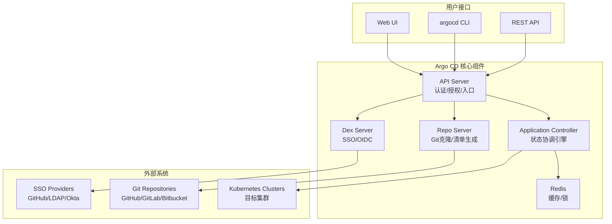

# Argo CD 企业级 GitOps 实践指南

> **适用版本**: Argo CD v3.3.8 / Helm Chart v7.8.0
> **最后更新**: 2026-04-24
> **难度**: 中级 → 高级

---

## 📋 目录

- [一、概述](#一概述)
- [二、架构设计](#二架构设计)
- [三、Helm 部署](#三helm-部署)
- [四、核心配置](#四核心配置)
- [五、安全与合规](#五安全与合规)
- [六、多环境管理策略](#六多环境管理策略)
- [七、监控与回滚](#七监控与回滚)
- [八、最佳实践](#八最佳实践)
- [九、故障排查](#九故障排查)

---

## 一、概述

本指南是 Argo CD GitOps 实践的操作手册，提供从安装部署到生产运维的完整技术方案。Argo CD 是 CNCF 毕业的 GitOps 持续交付工具，它将 Git 仓库作为 Kubernetes 应用定义的唯一事实来源，自动检测并收敛集群状态到 Git 中声明的期望状态。

Argo CD 的核心优势包括：丰富的 Web UI 提供应用拓扑可视化；ApplicationSet 支持声明式的多环境/多集群应用生成；AppProject 实现项目级权限隔离；支持 Helm、Kustomize、Jsonnet 等多种清单生成工具；与 Argo Rollouts 深度集成实现渐进式交付；内置通知系统支持 Slack、Email、Webhook 等多种通知渠道。

在企业级场景中，Argo CD 已被证明可以单实例管理 1000+ 应用，支持 50+ 目标集群，日处理数千次同步操作。Red Hat OpenShift GitOps 产品即基于 Argo CD 构建，进一步验证了其在企业市场的成熟度。

---

## 二、架构设计

### 2.1 组件架构



### 2.2 单实例架构

```
┌──────────────────────────────────────────────┐
│                Ingress / LB                   │
├──────────────────────────────────────────────┤
│              Argo CD Server (x2)              │
├──────────────────────────────────────────────┤
│         Application Controller (x1)          │
│         (状态机，只能单实例运行)                 │
├──────────────────────────────────────────────┤
│           Repo Server (x2)                   │
├──────────────────────────────────────────────┤
│             Redis (x1)                       │
│          (生产环境建议外部 HA)                  │
├──────────────────────────────────────────────┤
│              Dex Server (x1)                 │
└──────────────────────────────────────────────┘
```

### 2.3 高可用架构

```
┌──────────────────────────────────────────────┐
│             Ingress (Active-Active)           │
├──────────────┬───────────────────────────────┤
│  Server (x2) │  Server (x2)                  │
├──────────────┴───────────────────────────────┤
│        Application Controller (x1)           │
│        Leader Election via Redis             │
├──────────────────────────────────────────────┤
│  Repo Server (x2)    │  Repo Server (x2)     │
├──────────────────────┴───────────────────────┤
│        Redis Sentinel (x3) / HA              │
│        (外部 Redis Cluster 推荐)              │
└──────────────────────────────────────────────┘
```

---

## 三、Helm 部署

### 3.1 生产级 Values

```yaml
# values-argo-cd-production.yaml
global:
  domain: argocd.example.com

configs:
  cm:
    # 默认资源排除 (Argo CD v3.0+)
    resource.exclusions: |
      - apiGroups:
        - ""
        kinds:
        - Endpoints
        - EndpointSlice
        - Lease
        - SelfSubjectReview
        clusters:
        - "*"
      - apiGroups:
        - cilium.io
        kinds:
        - CiliumIdentity
        - CiliumEndpoint
        clusters:
        - "*"

    # 自定义资源健康检查
    resource.customizations: |
      cert-manager.io/Certificate:
        health.lua: |
          hs = {}
          if obj.status ~= nil then
            if obj.status.conditions ~= nil then
              for i, condition in ipairs(obj.status.conditions) do
                if condition.type == "Ready" and condition.status == "True" then
                  hs.status = "Healthy"
                  return hs
                end
              end
            end
          end
          hs.status = "Progressing"
          hs.message = "Certificate is not ready"
          return hs

  rbac:
    policy.default: role:readonly
    policy.csv: |
      p, role:org-admin, applications, *, */*, allow
      p, role:org-admin, clusters, get, *, allow
      p, role:org-admin, repositories, *, *, allow
      p, role:org-admin, projects, *, *, allow
      g, your-org:admin-team, role:org-admin

  secret:
    extra:
      argocd.secretkey: "<base64-encoded-32-byte-key>"

dex:
  enabled: true

server:
  replicas: 2
  resources:
    requests:
      memory: 256Mi
      cpu: 100m
    limits:
      memory: 512Mi
      cpu: 500m
  ingress:
    enabled: true
    ingressClassName: nginx
    annotations:
      cert-manager.io/cluster-issuer: "letsencrypt-prod"
      nginx.ingress.kubernetes.io/ssl-redirect: "true"
    tls: true

repoServer:
  replicas: 2
  resources:
    requests:
      memory: 256Mi
      cpu: 100m
    limits:
      memory: 1Gi
      cpu: 1000m
  volumes:
    - name: custom-tools
      emptyDir: {}
  volumeMounts:
    - name: custom-tools
      mountPath: /usr/local/bin/ksops
  initContainers:
    - name: download-tools
      image: alpine:3.19
      command: [sh, -c]
      args:
        - wget -O /custom-tools/ksops https://github.com/viaduct-ai/kustomize-sops/releases/download/v4.3.3/ksops_4.3.3_Linux_x86_64.tar.gz &&
          tar -xzf /custom-tools/ksops -C /custom-tools &&
          chmod +x /custom-tools/ksops
      volumeMounts:
        - name: custom-tools
          mountPath: /custom-tools

controller:
  replicas: 1
  resources:
    requests:
      memory: 512Mi
      cpu: 250m
    limits:
      memory: 2Gi
      cpu: 2000m
  args:
    - --repo-server-timeout-seconds=120
    - --status-processors=20
    - --operation-processors=10

redis:
  enabled: true
```

### 3.2 部署命令

```bash
helm repo add argo https://argoproj.github.io/argo-helm
helm install argocd argo/argo-cd \
  --namespace argocd \
  --create-namespace \
  --values values-argo-cd-production.yaml \
  --version 7.8.0

# 获取初始密码
kubectl -n argocd get secret argocd-initial-admin-secret \
  -o jsonpath="{.data.password}" | base64 -d

# 安装 argocd CLI
brew install argocd
argocd login argocd.example.com

# 验证
argocd version
kubectl get pods -n argocd
```

---

## 四、核心配置

### 4.1 多租户 AppProject

```yaml
apiVersion: argoproj.io/v1alpha1
kind: AppProject
metadata:
  name: team-alpha
  namespace: argocd
spec:
  description: "Team Alpha Production Environment"
  sourceRepos:
    - "https://github.com/company/team-alpha-apps.git"
    - "https://github.com/company/helm-charts.git"
  destinations:
    - namespace: "team-alpha-*"
      server: https://kubernetes.default.svc
  clusterResourceWhitelist:
    - group: ""
      kind: Namespace
    - group: rbac.authorization.k8s.io
      kind: ClusterRole
  namespaceResourceBlacklist:
    - group: ''
      kind: ResourceQuota
  roles:
    - name: admin
      description: "Team Alpha Admin"
      policies:
        - p, proj:team-alpha:admin, applications, *, team-alpha/*, allow
      groups:
        - "github-org:team-alpha-admin"
    - name: readonly
      description: "Team Alpha Read Only"
      policies:
        - p, proj:team-alpha:readonly, applications, get, team-alpha/*, allow
      groups:
        - "github-org:team-alpha"
  syncWindows:
    - kind: allow
      schedule: '10 1 * * *'
      duration: 1h
      applications:
        - '*'
      manualSync: true
```

### 4.2 Application 定义

```yaml
apiVersion: argoproj.io/v1alpha1
kind: Application
metadata:
  name: team-alpha-api
  namespace: argocd
  finalizers:
    - resources-finalizer.argocd.argoproj.io
spec:
  project: team-alpha
  source:
    repoURL: https://github.com/company/team-alpha-apps.git
    targetRevision: main
    path: apps/api/overlays/production
    helm:
      valueFiles:
        - values-production.yaml
      parameters:
        - name: replicaCount
          value: "3"
  destination:
    server: https://kubernetes.default.svc
    namespace: team-alpha-production
  syncPolicy:
    automated:
      prune: true
      selfHeal: true
      allowEmpty: false
    syncOptions:
      - CreateNamespace=true
      - PrunePropagationPolicy=foreground
      - PruneLast=true
      - ServerSideApply=true
    retry:
      limit: 5
      backoff:
        duration: 5s
        factor: 2
        maxDuration: 3m
  revisionHistoryLimit: 10
```

### 4.3 ApplicationSet 多环境管理

```yaml
# Git 目录生成器
apiVersion: argoproj.io/v1alpha1
kind: ApplicationSet
metadata:
  name: microservices
  namespace: argocd
spec:
  generators:
    - git:
        repoURL: https://github.com/company/gitops.git
        revision: main
        directories:
          - path: apps/*/overlays/*
  template:
    metadata:
      name: '{{path[1]}}-{{path[3]}}'
    spec:
      project: default
      source:
        repoURL: https://github.com/company/gitops.git
        targetRevision: main
        path: '{{path}}'
      destination:
        server: https://kubernetes.default.svc
        namespace: '{{path[1]}}-{{path[3]}}'
      syncPolicy:
        automated:
          prune: true
          selfHeal: true
        syncOptions:
          - CreateNamespace=true
```

```yaml
# 集群生成器 (多集群)
apiVersion: argoproj.io/v1alpha1
kind: ApplicationSet
metadata:
  name: cluster-addons
  namespace: argocd
spec:
  generators:
    - clusters:
        selector:
          matchLabels:
            environment: production
  template:
    metadata:
      name: 'addons-{{name}}'
    spec:
      project: infrastructure
      source:
        repoURL: https://github.com/company/infrastructure.git
        targetRevision: main
        path: addons/base
      destination:
        server: '{{server}}'
        namespace: kube-system
```

---

## 五、安全与合规

### 5.1 密钥管理集成

```yaml
# External Secrets Operator (推荐)
apiVersion: external-secrets.io/v1beta1
kind: ExternalSecret
metadata:
  name: api-secrets
  namespace: team-alpha-production
spec:
  refreshInterval: 1h
  secretStoreRef:
    kind: ClusterSecretStore
    name: vault-backend
  target:
    name: api-secrets
    creationPolicy: Owner
  data:
    - secretKey: DATABASE_URL
      remoteRef:
        key: secret/data/team-alpha/api
        property: database_url
    - secretKey: API_KEY
      remoteRef:
        key: secret/data/team-alpha/api
        property: api_key
```

### 5.2 Sealed Secrets

```bash
# 安装 Sealed Secrets 控制器
helm install sealed-secrets sealed-secrets/sealed-secrets \
  --namespace kube-system

# 客户端加密
kubeseal --controller-namespace=kube-system \
  --controller-name=sealed-secrets \
  < secret.yaml > sealed-secret.yaml

# sealed-secret.yaml 可安全提交到 Git
```

### 5.3 RBAC 配置

```yaml
# ConfigMap: argocd-rbac-cm
policy.csv: |
  p, role:org-admin, applications, *, */*, allow
  p, role:org-admin, clusters, *, *, allow
  p, role:developer, applications, get, */*, allow
  p, role:developer, applications, sync, dev/*, allow
  g, your-org:admin-team, role:org-admin
  g, your-org:dev-team, role:developer

policy.default: role:readonly
scopes: '[groups]'
```

---

## 六、多环境管理策略

### 6.1 推荐目录结构

```
gitops-repo/
├── apps/
│   ├── base/                    # 基础 Kustomize 配置
│   │   ├── api/
│   │   │   ├── kustomization.yaml
│   │   │   ├── deployment.yaml
│   │   │   └── service.yaml
│   │   └── frontend/
│   ├── overlays/
│   │   ├── development/
│   │   │   ├── kustomization.yaml
│   │   │   └── patches/
│   │   │       └── replicas.yaml
│   │   ├── staging/
│   │   │   └── kustomization.yaml
│   │   └── production/
│   │       ├── kustomization.yaml
│   │       └── patches/
│   │           ├── replicas.yaml
│   │           └── resources.yaml
├── infrastructure/
│   ├── base/
│   └── overlays/
└── clusters/
    ├── production/
    │   └── apps.yaml
    └── staging/
        └── apps.yaml
```

### 6.2 环境晋升流程

```yaml
# Kustomize overlay 示例 - production
# apps/overlays/production/kustomization.yaml
apiVersion: kustomize.config.k8s.io/v1beta1
kind: Kustomization
resources:
  - ../../base/api
patches:
  - target:
      kind: Deployment
      name: api
    patch: |
      - op: replace
        path: /spec/replicas
        value: 3
      - op: replace
        path: /spec/template/spec/containers/0/resources/requests/memory
        value: 512Mi
      - op: replace
        path: /spec/template/spec/containers/0/resources/limits/memory
        value: 1Gi
```

---

## 七、监控与回滚

### 7.1 Prometheus 监控

```yaml
apiVersion: monitoring.coreos.com/v1
kind: ServiceMonitor
metadata:
  name: argocd-metrics
  namespace: monitoring
spec:
  selector:
    matchLabels:
      app.kubernetes.io/part-of: argocd
  namespaceSelector:
    matchNames:
      - argocd
  endpoints:
  - port: metrics
    interval: 30s
```

### 7.2 关键告警规则

```yaml
- alert: ArgoCDAppSyncFailed
  expr: argocd_app_info{sync_status="OutOfSync"} == 1
  for: 15m
  labels:
    severity: warning
  annotations:
    summary: "Argo CD Application 同步失败"

- alert: ArgoCDAppDegraded
  expr: argocd_app_info{health_status="Degraded"} == 1
  for: 5m
  labels:
    severity: critical
  annotations:
    summary: "Argo CD Application 处于降级状态"

- alert: ArgoCDControllerReconcileSlow
  expr: |
    rate(argocd_app_reconcile_duration_seconds_sum[5m]) /
    rate(argocd_app_reconcile_duration_seconds_count[5m]) > 30
  for: 10m
  labels:
    severity: warning
  annotations:
    summary: "Controller 协调延迟过高"
```

### 7.3 回滚操作

```bash
# 方式一: CLI 回滚
argocd app rollback <app-name> <revision>

# 方式二: Git revert (推荐)
git revert <commit-hash>
git push origin main

# 方式三: UI 回滚
# Application → History and Rollback → 选择版本

# 方式四: 备份恢复
argocd admin export > argocd-backup.yaml
argocd admin import < argocd-backup.yaml
```

---

## 八、最佳实践

```yaml
1. 仓库设计:
   - 基础设施与应用仓库分离
   - 使用 Kustomize Overlay 实现环境差异化
   - ApplicationSet 自动发现应用

2. 同步策略:
   - dev/staging: automated + selfHeal
   - production: 手动触发或 syncWindows 限制
   - 所有关键应用设置 revisionHistoryLimit

3. 安全:
   - AppProject 限制源仓库和目标集群
   - RBAC 细粒度权限
   - Secret 使用 External Secrets Operator
   - 启用审计日志

4. 性能:
   - 配置 resource.exclusions 排除高变动资源
   - 使用 Server-Side Apply
   - 增加 Controller workers
   - 使用 Webhook 替代轮询

5. 升级:
   - 先在 staging 验证升级
   - 备份后升级
   - 跟随 N-1 升级路径
```

---

## 九、故障排查

### 9.1 常用排查命令

```bash
# 应用状态检查
argocd app get <app> --refresh
argocd app diff <app>
argocd app logs <app>

# Controller 日志
kubectl logs -n argocd deploy/argocd-application-controller -f

# Repo Server 日志
kubectl logs -n argocd deploy/argocd-repo-server -f

# 强制刷新
argocd app get <app> --refresh --hard

# 资源事件
kubectl describe application <app> -n argocd
```

### 9.2 常见问题

```yaml
同步失败:
  - 检查 Git 仓库连接和凭证
  - 检查 Helm/Kustomize 模板渲染错误
  - 检查目标集群权限
  - 检查 AppProject 权限配置
  - 使用 argocd app manifest get 查看生成清单

性能问题:
  - 增加 status-processors 和 operation-processors
  - 配置 resource.exclusions
  - 增加 Repo Server 资源
  - 使用外部 Redis HA

应用卡在 Progressing:
  - 检查 Pod 状态和 Events
  - 检查镜像拉取
  - 检查资源配额
  - 检查 Readiness/Liveness Probe

Secret 管理问题:
  - 确保 ESO/Sealed Secrets 控制器正常运行
  - 检查 Vault/AWS Secrets Manager 连接
  - 验证 ExternalSecret 配置
```

---

## 十、Argo CD 高级运维

### 10.1 大规模部署优化

当管理 500+ 应用时，Argo CD Controller 的性能优化变得至关重要。主要的优化手段包括：增加状态处理器（status-processors）和操作处理器（operation-processors）的并发数、配置资源排除规则减少不必要的监控、启用 Server-Side Apply 减少 API Server 负载。

```yaml
# 大规模优化 Controller 配置
controller:
  args:
    - --repo-server-timeout-seconds=300
    - --status-processors=50
    - --operation-processors=20
    - --kubectl-parallelism-limit=20
    - --redis-compress=true
    - --server-side-diff=true
  resources:
    requests:
      memory: 2Gi
      cpu: 1000m
    limits:
      memory: 4Gi
      cpu: 4000m
```

### 10.2 Resource Hook 深度实践

Resource Hook 是 Argo CD 在同步过程中执行自定义逻辑的机制。PreSync Hook 在同步前执行（如数据库迁移），Sync Hook 在同步过程中执行（如通知），PostSync Hook 在同步完成后执行（如冒烟测试），SyncFail Hook 在同步失败时执行（如告警通知）。

```yaml
# PreSync Hook: 数据库迁移
apiVersion: batch/v1
kind: Job
metadata:
  name: db-migration
  annotations:
    argocd.argoproj.io/hook: PreSync
    argocd.argoproj.io/hook-delete-policy: HookSucceeded
spec:
  template:
    spec:
      containers:
      - name: migrate
        image: myapp-migrate:latest
        command: ["./migrate", "up"]
      restartPolicy: Never
---
# PostSync Hook: 冒烟测试
apiVersion: batch/v1
kind: Job
metadata:
  name: smoke-test
  annotations:
    argocd.argoproj.io/hook: PostSync
    argocd.argoproj.io/hook-delete-policy: HookSucceeded
spec:
  template:
    spec:
      containers:
      - name: test
        image: curlimages/curl:latest
        command:
          - /bin/sh
          - -c
          - |
            for i in $(seq 1 10); do
              STATUS=$(curl -s -o /dev/null -w "%{http_code}" https://app.example.com/health)
              if [ "$STATUS" = "200" ]; then exit 0; fi
              sleep 5
            done
            exit 1
      restartPolicy: Never
```

### 10.3 升级与维护

Argo CD 的升级遵循 N-1 路径，即可以从前一个 minor 版本直接升级到当前版本。建议在升级前备份配置，在 staging 环境验证升级结果后再升级生产环境。

```bash
# 升级步骤
# 1. 备份
argocd admin export > argocd-backup.yaml

# 2. 升级 Helm Chart
helm upgrade argocd argo/argo-cd \
  --namespace argocd \
  --values values-argo-cd-production.yaml \
  --version <new-version>

# 3. 验证
argocd version
kubectl get applications -n argocd
```

---

## 十一、Argo CD 多集群管理

### 11.1 集群注册与生命周期

Argo CD 支持管理多个 Kubernetes 集群，通过集群注册机制将目标集群添加到 Argo CD 的管理范围。集群注册方式包括：通过 `argocd cluster add` 命令自动配置 ServiceAccount 和 RBAC、手动导入 kubeconfig 文件、以及通过 GitOps 方式管理集群 Secret。

```bash
# 注册集群
argocd cluster add production-cluster \
  --name production \
  --label environment=production \
  --label region=us-east-1

# 查看已注册集群
argocd cluster list

# 通过标签选择集群 (ApplicationSet 使用)
argocd cluster list -l environment=production
```

### 11.2 ApplicationSet 集群生成器

ApplicationSet 的 Cluster Generator 可以自动为每个注册的集群生成 Application，实现"一次定义，多集群部署"的模式。结合集群标签，可以实现精细化的部署目标选择。

```yaml
# 基于集群标签的自动部署
apiVersion: argoproj.io/v1alpha1
kind: ApplicationSet
metadata:
  name: myapp-all-clusters
  namespace: argocd
spec:
  generators:
    - clusters:
        selector:
          matchLabels:
            environment: production
  template:
    metadata:
      name: '{{name}}-myapp'
    spec:
      project: default
      source:
        repoURL: https://github.com/org/gitops-manifests.git
        targetRevision: main
        path: apps/myapp/overlays/production
      destination:
        server: '{{server}}'
        namespace: myapp
      syncPolicy:
        automated:
          prune: true
          selfHeal: true
```

### 11.3 集群权限隔离

在多租户环境中，不同团队只能部署到特定的集群和命名空间。Argo CD 通过 Project 的 cluster 资源白名单实现权限隔离，确保团队 A 无法将应用部署到团队 B 的集群。

```yaml
# Project 权限隔离
apiVersion: argoproj.io/v1alpha1
kind: AppProject
metadata:
  name: team-a
  namespace: argocd
spec:
  description: "Team A 的项目"
  sourceRepos:
    - "https://github.com/team-a/*"
  destinations:
    - server: https://production-cluster
      namespace: "team-a-*"
    - server: https://staging-cluster
      namespace: "team-a-*"
  clusterResourceWhitelist:
    - group: ""
      kind: Namespace
  namespaceResourceBlacklist:
    - group: ""
      kind: ResourceQuota
```

---

## 十二、Argo CD 与 Helm 深度集成

### 12.1 Helm Chart 管理策略

Argo CD 原生支持 Helm Chart 的部署和管理。在企业环境中，Helm Chart 的版本管理、Value 文件组织和多环境差异化配置是关键挑战。推荐使用"Chart + Overlay"模式：基础 Chart 定义在独立仓库中，环境差异通过 Argo CD 的 `helm.parameters` 或 Kustomize `patchesStrategicMerge` 实现。

```yaml
# Argo CD Helm 部署 Application
apiVersion: argoproj.io/v1alpha1
kind: Application
metadata:
  name: myapp-helm
  namespace: argocd
spec:
  project: default
  source:
    chart: myapp
    repoURL: https://charts.example.com/
    targetRevision: "1.2.*"
    helm:
      releaseName: myapp
      valueFiles:
        - values.yaml
        - values-production.yaml
      parameters:
        - name: image.tag
          value: "v1.2.3"
        - name: replicaCount
          value: "3"
        - name: resources.limits.memory
          value: "512Mi"
      fileParameters:
        - name: customConfig
          path: config/custom.json
  destination:
    server: https://kubernetes.default.svc
    namespace: myapp
```

### 12.2 Helm Hook 与 Argo CD Sync Hook 协调

Helm 的 Hook 机制（如 `helm.sh/hook`）和 Argo CD 的 Resource Hook（如 `argocd.argoproj.io/hook`）可能产生冲突。推荐的最佳实践是：在 Argo CD 管理的 Chart 中，使用 Argo CD 的 Resource Hook 替代 Helm Hook，避免两者同时触发导致不可预期的行为。

```yaml
# 使用 Argo CD Resource Hook 替代 Helm Hook
apiVersion: batch/v1
kind: Job
metadata:
  name: db-init
  annotations:
    argocd.argoproj.io/hook: PreSync
    argocd.argoproj.io/hook-delete-policy: BeforeHookCreation
spec:
  template:
    spec:
      containers:
        - name: init
          image: postgres:15
          command: ["psql", "-f", "/sql/init.sql"]
      restartPolicy: Never
```

---

## 十三、Argo CD 与 Service Mesh 集成

Argo CD 可以与多种 Service Mesh 集成，实现更精细的流量管理和安全控制。与 Istio 集成时，Argo CD 管理 VirtualService 和 DestinationRule 配置，Argo Rollouts 控制金丝雀流量的切换。与 Linkerd 集成时，Argo CD 管理 Service Profile 和 Traffic Split 配置。与 AWS App Mesh 集成时，Argo CD 管理 Virtual Router 和 Virtual Node 配置。所有这些配置都通过 GitOps 流程管理，确保变更可追踪、可回滚。

### 13.1 Istio 流量管理

```yaml
# Argo Rollouts + Istio 流量管理
apiVersion: argoproj.io/v1alpha1
kind: Rollout
metadata:
  name: myapp
spec:
  strategy:
    canary:
      trafficRouting:
        istio:
          virtualService:
            name: myapp-vsvc
          destinationRule:
            name: myapp-destrule
            canarySubsetName: canary
            stableSubsetName: stable
      steps:
        - setWeight: 10
        - pause: {duration: 5m}
        - setWeight: 20
        - pause: {duration: 5m}
        - analysis:
            templates:
              - templateName: istio-metrics
        - setWeight: 50
        - pause: {duration: 10m}
        - setWeight: 100
```

### 13.2 Argo CD Notifications Controller

Argo CD Notifications Controller 可以在 Application 状态变化时自动发送通知到多种渠道。通过配置 Trigger 和 Template，可以精确控制通知内容和触发条件，确保团队及时了解部署状态。

```yaml
# 通知触发器配置
apiVersion: argocd-notifications.argoproj.io/v1alpha1
kind: Trigger
metadata:
  name: on-deployed
spec:
  conditions:
    - when: app.status.operationState.phase in [Succeeded]
      oncePer: app.status.operationState.finishedAt
  template:
    slack:
      message: |
        Application {{.app.metadata.name}} deployed successfully.
        Sync Status: {{.app.status.sync.status}}
        Health Status: {{.app.status.health.status}}
```

---

## 十四、Argo CD 最佳实践总结

### 14.1 生产环境 Checklist

```yaml
Argo CD 生产环境部署检查清单:
  
  基础架构:
    - 高可用模式部署 (3 副本 Controller, 2 副本 Server)
    - Redis HA (Sentinel 模式)
    - RepoServer 独立扩缩容
    - 配置 Resource Exclusions 减少不必要的监控
  
  安全配置:
    - SSO 集成 (OIDC/SAML/LDAP)
    - RBAC 最小权限配置
    - 启用 Strict TLS
    - 配置 NetworkPolicy 限制组件间通信
    - 使用 External Secrets Operator 管理敏感数据
  
  运维配置:
    - 配置合理的 Sync Interval (3-5 分钟)
    - 启用 Self-Heal 和 Prune
    - 配置 Resource Hook (PreSync/PostSync)
    - 设置合理的 Resource Limits
    - 配置日志级别和审计日志
```

### 14.2 常见错误与解决方案

```yaml
常见问题:
  Application 始终 OutOfSync:
    原因: Helm values 动态生成、随机标签、时间戳
    解决: 使用 ignoreDifferences 配置忽略动态字段
    
  同步超时:
    原因: 镜像拉取慢、资源配额不足、依赖未就绪
    解决: 增加 timeout、配置 Readiness Probe、使用 dependsOn
    
  RepoServer 内存溢出:
    原因: 大型 Helm Chart 或 Kustomize 覆盖
    解决: 增加 RepoServer 内存、使用 Helm Chart OCI Registry
```

---

## 参考链接

- [Argo CD 官方文档](https://argo-cd.readthedocs.io/)
- [Argo CD Helm Chart](https://github.com/argoproj/argo-helm/tree/main/charts/argo-cd)
- [ApplicationSet 文档](https://argo-cd.readthedocs.io/en/stable/operator-manual/applicationset/)
- [Argo CD 安全最佳实践](https://argo-cd.readthedocs.io/en/stable/operator-manual/security/)
- [Argo Rollouts](https://argoproj.github.io/argo-rollouts/)
- [External Secrets Operator](https://external-secrets.io/)
- [Argo CD Notifications](https://argocd-notifications.readthedocs.io/)
- [Argo CD Operator (OpenShift)](https://argocd-operator.readthedocs.io/)
- [ApplicationSet Controller](https://argo-cd.readthedocs.io/en/stable/operator-manual/applicationset/)
- [Argo CD Image Updater](https://argocd-image-updater.readthedocs.io/)
- [Argo CD Diff Helper](https://argocd-image-updater.readthedocs.io/en/stable/)
- [Argo CD User Projects](https://argo-cd.readthedocs.io/en/stable/user-guide/projects/)
- [Argo CD Sync Phases](https://argo-cd.readthedocs.io/en/stable/user-guide/sync-options/)
