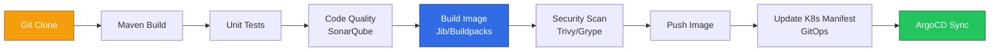

# Tekton Java CI/CD 流水线实践指南

> **适用版本**: Tekton Pipelines v0.60+ / Maven 3.9+ / Gradle 8.x  
> **最后更新**: 2026-04-30  
> **难度**: 中级

---

## 📋 目录

- [一、Tekton Java 流水线架构](#一tekton-java-流水线架构)
- [二、Maven Task 定义](#二maven-task-定义)
- [三、Gradle Task 定义](#三gradle-task-定义)
- [四、容器构建 Task (Jib/Buildpacks)](#四容器构建-task-jibbuildpacks)
- [五、完整 Pipeline 模板](#五完整-pipeline-模板)
- [六、Workspace 与缓存策略](#六workspace-与缓存策略)
- [七、安全扫描集成](#七安全扫描集成)
- [八、GitOps 集成](#八gitops-集成)
- [九、多环境流水线](#九多环境流水线)
- [十、PipelineRun 生产模板](#十pipelinerun-生产模板)

---

## 一、Tekton Java 流水线架构



---

## 二、Maven Task 定义

### 2.1 通用 Maven Task

```yaml
apiVersion: tekton.dev/v1
kind: Task
metadata:
  name: maven
  labels:
    app.kubernetes.io/version: "1.0"
  annotations:
    tekton.dev/pipelines.minVersion: "0.60"
    tekton.dev/displayName: "Maven Build"
spec:
  description: "Maven 构建任务"
  params:
    - name: GOALS
      description: "Maven 目标"
      default: "package"
      type: string
    - name: MAVEN_OPTS
      description: "JVM 参数"
      default: "-XX:+UseContainerSupport -XX:MaxRAMPercentage=75.0"
      type: string
    - name: SETTINGS_PATH
      description: "settings.xml 路径"
      default: ""
      type: string
    - name: CONTEXT_DIR
      description: "构建上下文目录"
      default: "."
      type: string
  workspaces:
    - name: source
      description: "源代码工作区"
    - name: maven-repo
      description: "Maven 本地仓库缓存"
    - name: settings
      description: "Maven settings.xml (可选)"
      optional: true
  results:
    - name: IMAGE_DIGEST
      description: "镜像 Digest"
    - name: JAR_PATH
      description: "JAR 文件路径"
  steps:
    - name: mvn-goals
      image: eclipse-temurin:21-jdk
      workingDir: $(workspaces.source.path)/$(params.CONTEXT_DIR)
      args:
        - $(params.GOALS)
      env:
        - name: MAVEN_OPTS
          value: $(params.MAVEN_OPTS)
        - name: MAVEN_CONFIG
          value: "/workspace/maven-repo/.m2"
      script: |
        #!/bin/sh
        SETTINGS_ARG=""
        if [ -n "$(params.SETTINGS_PATH)" ] && [ -f "$(params.SETTINGS_PATH)" ]; then
          SETTINGS_ARG="-s $(params.SETTINGS_PATH)"
        elif [ -f "$(workspaces.settings.path)/settings.xml" ]; then
          SETTINGS_ARG="-s $(workspaces.settings.path)/settings.xml"
        fi

        ./mvnw $SETTINGS_ARG \
          -Dmaven.repo.local=$(workspaces.maven-repo.path)/.m2/repository \
          -B \
          $(params.GOALS)

        JAR_FILE=$(find target -name "*.jar" ! -name "*-sources*" ! -name "*-javadoc*" | head -1)
        if [ -n "$JAR_FILE" ]; then
          echo -n "$JAR_FILE" > $(results.JAR_PATH.path)
          echo "Built JAR: $JAR_FILE"
        fi
      volumeMounts:
        - name: maven-settings
          mountPath: /workspace/settings
  volumes:
    - name: maven-settings
      configMap:
        name: maven-settings
        optional: true
```

### 2.2 Maven Unit Test Task

```yaml
apiVersion: tekton.dev/v1
kind: Task
metadata:
  name: maven-test
spec:
  params:
    - name: CONTEXT_DIR
      default: "."
    - name: MAVEN_OPTS
      default: "-XX:+UseContainerSupport -XX:MaxRAMPercentage=75.0"
  workspaces:
    - name: source
    - name: maven-repo
  steps:
    - name: test
      image: eclipse-temurin:21-jdk
      workingDir: $(workspaces.source.path)/$(params.CONTEXT_DIR)
      script: |
        #!/bin/sh
        ./mvnw \
          -Dmaven.repo.local=$(workspaces.maven-repo.path)/.m2/repository \
          -B \
          verify \
          -DskipITs \
          -Dmaven.test.failure.ignore=false
      env:
        - name: MAVEN_OPTS
          value: $(params.MAVEN_OPTS)
```

---

## 三、Gradle Task 定义

### 3.1 通用 Gradle Task

```yaml
apiVersion: tekton.dev/v1
kind: Task
metadata:
  name: gradle
spec:
  description: "Gradle 构建任务"
  params:
    - name: TASKS
      description: "Gradle 任务"
      default: "build"
      type: string
    - name: GRADLE_OPTS
      description: "JVM 参数"
      default: "-XX:+UseContainerSupport -XX:MaxRAMPercentage=75.0"
      type: string
    - name: CONTEXT_DIR
      default: "."
      type: string
  workspaces:
    - name: source
    - name: gradle-cache
      description: "Gradle 缓存目录"
  steps:
    - name: gradle-build
      image: eclipse-temurin:21-jdk
      workingDir: $(workspaces.source.path)/$(params.CONTEXT_DIR)
      script: |
        #!/bin/sh
        export GRADLE_USER_HOME=$(workspaces.gradle-cache.path)/.gradle
        ./gradlew --no-daemon \
          --gradle-user-home $GRADLE_USER_HOME \
          $(params.TASKS)
      env:
        - name: GRADLE_OPTS
          value: $(params.GRADLE_OPTS)
        - name: JAVA_OPTS
          value: $(params.GRADLE_OPTS)
```

---

## 四、容器构建 Task (Jib/Buildpacks)

### 4.1 Jib Maven Task

```yaml
apiVersion: tekton.dev/v1
kind: Task
metadata:
  name: jib-maven
spec:
  description: "使用 Jib 构建并推送 Java 容器镜像"
  params:
    - name: IMAGE
      description: "目标镜像地址"
      type: string
    - name: CONTEXT_DIR
      default: "."
    - name: INSECURE_REGISTRY
      default: "false"
  workspaces:
    - name: source
    - name: maven-repo
    - name: dockerconfig
      description: "Docker config.json (registry 认证)"
      optional: true
  results:
    - name: IMAGE_DIGEST
      description: "镜像 Digest"
  steps:
    - name: build-and-push
      image: eclipse-temurin:21-jdk
      workingDir: $(workspaces.source.path)/$(params.CONTEXT_DIR)
      script: |
        #!/bin/sh
        DOCKER_CONFIG=""
        if [ -d "$(workspaces.dockerconfig.path)" ]; then
          DOCKER_CONFIG="-Djib.dockerConfig=$(workspaces.dockerconfig.path)"
        fi

        ./mvnw \
          -Dmaven.repo.local=$(workspaces.maven-repo.path)/.m2/repository \
          -B \
          compile \
          com.google.cloud.tools:jib-maven-plugin:3.4.4:build \
          -Dimage=$(params.IMAGE) \
          $DOCKER_CONFIG \
          -Djib.to.auth.username=$(cat /tekton/registry-auth/username) \
          -Djib.to.auth.password=$(cat /tekton/registry-auth/password) \
          -Djib.serialize=true \
          -Djib.outputPaths.digest=$(results.IMAGE_DIGEST.path)
      volumeMounts:
        - name: registry-auth
          mountPath: /tekton/registry-auth
          readOnly: true
  volumes:
    - name: registry-auth
      secret:
        secretName: registry-credentials
        items:
          - key: username
            path: username
          - key: password
            path: password
```

### 4.2 Buildpacks Task

```yaml
apiVersion: tekton.dev/v1
kind: Task
metadata:
  name: buildpacks-java
spec:
  description: "使用 Paketo Buildpacks 构建 Java 镜像"
  params:
    - name: IMAGE
      type: string
    - name: BUILDER_IMAGE
      default: "paketobuildpacks/builder-jammy-base:latest"
    - name: SOURCE_SUBPATH
      default: "."
  workspaces:
    - name: source
    - name: dockerconfig
      optional: true
  results:
    - name: IMAGE_DIGEST
  steps:
    - name: build
      image: buildpacksio/pack:latest
      args:
        - build
        - $(params.IMAGE)
        - --builder
        - $(params.BUILDER_IMAGE)
        - --path
        - $(workspaces.source.path)/$(params.SOURCE_SUBPATH)
        - --env
        - BP_JVM_VERSION=21
        - --env
        - BP_SPRING_CLOUD_BINDINGS_ENABLED=true
        - --digest-file
        - $(results.IMAGE_DIGEST.path)
      volumeMounts:
        - name: docker-config
          mountPath: /home/cnb/.docker
          readOnly: true
  volumes:
    - name: docker-config
      secret:
        secretName: registry-credentials
        items:
          - key: .dockerconfigjson
            path: config.json
        optional: true
```

---

## 五、完整 Pipeline 模板

### 5.1 Spring Boot CI/CD Pipeline

```yaml
apiVersion: tekton.dev/v1
kind: Pipeline
metadata:
  name: spring-boot-ci
spec:
  description: "Spring Boot 完整 CI/CD 流水线"
  params:
    - name: git-url
      type: string
    - name: git-revision
      default: "main"
    - name: image
      type: string
    - name: context-dir
      default: "."
    - name: sonar-project-key
      default: ""
  workspaces:
    - name: shared-workspace
    - name: maven-repo
    - name: dockerconfig
    - name: settings
      optional: true
  results:
    - name: image-digest
      value: $(tasks.build-image.results.IMAGE_DIGEST)
  tasks:
    - name: fetch-repository
      taskRef:
        name: git-clone
        kind: ClusterTask
      params:
        - name: url
          value: $(params.git-url)
        - name: revision
          value: $(params.git-revision)
      workspaces:
        - name: output
          workspace: shared-workspace

    - name: maven-build
      runAfter:
        - fetch-repository
      taskRef:
        name: maven
      params:
        - name: GOALS
          value: "clean compile -DskipTests"
        - name: CONTEXT_DIR
          value: $(params.context-dir)
      workspaces:
        - name: source
          workspace: shared-workspace
        - name: maven-repo
          workspace: maven-repo
        - name: settings
          workspace: settings

    - name: maven-test
      runAfter:
        - maven-build
      taskRef:
        name: maven-test
      params:
        - name: CONTEXT_DIR
          value: $(params.context-dir)
      workspaces:
        - name: source
          workspace: shared-workspace
        - name: maven-repo
          workspace: maven-repo

    - name: build-image
      runAfter:
        - maven-test
      taskRef:
        name: jib-maven
      params:
        - name: IMAGE
          value: $(params.image)
        - name: CONTEXT_DIR
          value: $(params.context-dir)
      workspaces:
        - name: source
          workspace: shared-workspace
        - name: maven-repo
          workspace: maven-repo
        - name: dockerconfig
          workspace: dockerconfig

    - name: security-scan
      runAfter:
        - build-image
      taskRef:
        name: trivy-scanner
        kind: ClusterTask
      params:
        - name: IMAGE
          value: "$(params.image)@$(tasks.build-image.results.IMAGE_DIGEST)"
        - name: SEVERITY
          value: "HIGH,CRITICAL"
```

---

## 六、Workspace 与缓存策略

### 6.1 Maven 缓存 PVC

```yaml
apiVersion: v1
kind: PersistentVolumeClaim
metadata:
  name: maven-repo-cache
spec:
  accessModes:
    - ReadWriteMany
  resources:
    requests:
      storage: 10Gi
  storageClassName: standard
```

### 6.2 PipelineRun Workspace 绑定

```yaml
workspaces:
  - name: shared-workspace
    volumeClaimTemplate:
      spec:
        accessModes:
          - ReadWriteOnce
        resources:
          requests:
            storage: 1Gi
  - name: maven-repo
    persistentVolumeClaim:
      claimName: maven-repo-cache
  - name: dockerconfig
    secret:
      secretName: registry-credentials
```

### 6.3 Maven settings.xml ConfigMap

```yaml
apiVersion: v1
kind: ConfigMap
metadata:
  name: maven-settings
data:
  settings.xml: |
    <?xml version="1.0" encoding="UTF-8"?>
    <settings xmlns="http://maven.apache.org/SETTINGS/1.2.0"
              xmlns:xsi="http://www.w3.org/2001/XMLSchema-instance"
              xsi:schemaLocation="http://maven.apache.org/SETTINGS/1.2.0
              https://maven.apache.org/xsd/settings-1.2.0.xsd">
      <mirrors>
        <mirror>
          <id>aliyun-maven</id>
          <mirrorOf>central</mirrorOf>
          <name>Aliyun Maven Mirror</name>
          <url>https://maven.aliyun.com/repository/public</url>
        </mirror>
      </mirrors>
      <profiles>
        <profile>
          <id>tekton</id>
          <properties>
            <maven.compiler.source>21</maven.compiler.source>
            <maven.compiler.target>21</maven.compiler.target>
            <project.build.sourceEncoding>UTF-8</project.build.sourceEncoding>
          </properties>
        </profile>
      </profiles>
      <activeProfiles>
        <activeProfile>tekton</activeProfile>
      </activeProfiles>
    </settings>
```

---

## 七、安全扫描集成

### 7.1 Trivy 漏洞扫描

```yaml
apiVersion: tekton.dev/v1
kind: Task
metadata:
  name: java-security-scan
spec:
  params:
    - name: IMAGE
      type: string
    - name: CONTEXT_DIR
      default: "."
  workspaces:
    - name: source
  steps:
    - name: trivy-image-scan
      image: aquasec/trivy:latest
      script: |
        #!/bin/sh
        trivy image --severity HIGH,CRITICAL \
          --exit-code 1 \
          --format table \
          $(params.IMAGE)
    - name: trivy-fs-scan
      image: aquasec/trivy:latest
      workingDir: $(workspaces.source.path)/$(params.CONTEXT_DIR)
      script: |
        #!/bin/sh
        trivy fs --severity HIGH,CRITICAL \
          --scanners vuln,secret \
          --exit-code 1 \
          .
```

---

## 八、GitOps 集成

### 8.1 更新 Kustomize 镜像

```yaml
apiVersion: tekton.dev/v1
kind: Task
metadata:
  name: update-kustomize-image
spec:
  params:
    - name: git-url
      type: string
    - name: git-revision
      default: "main"
    - name: image
      type: string
    - name: image-digest
      type: string
    - name: kustomize-dir
      default: "overlays/production"
  workspaces:
    - name: source
  steps:
    - name: update-and-push
      image: alpine/git:latest
      workingDir: $(workspaces.source.path)
      script: |
        #!/bin/sh
        git clone --branch $(params.git-revision) --depth 1 $(params.git-url) .

        cd $(params.kustomize-dir)

        # 更新镜像
        kustomize edit set image \
          app=$(params.image)@$(params.image-digest)

        git config user.name "tekton-bot"
        git config user.email "tekton-bot@example.com"
        git add .
        git commit -m "chore: update image to $(params.image)@$(params.image-digest)"
        git push origin $(params.git-revision)
```

---

## 九、多环境流水线

### 9.1 多环境 Pipeline

```yaml
apiVersion: tekton.dev/v1
kind: Pipeline
metadata:
  name: spring-boot-cd
spec:
  params:
    - name: image
      type: string
    - name: image-digest
      type: string
    - name: environments
      default: "staging,production"
  tasks:
    - name: deploy-staging
      params:
        - name: image
          value: "$(params.image)@$(params.image-digest)"
        - name: environment
          value: "staging"
      taskRef:
        name: kubectl-deploy

    - name: integration-test
      runAfter:
        - deploy-staging
      taskRef:
        name: integration-test

    - name: deploy-production
      runAfter:
        - integration-test
      when:
        - input: "$(params.environments)"
          operator: in
          values: ["production"]
      params:
        - name: image
          value: "$(params.image)@$(params.image-digest)"
        - name: environment
          value: "production"
      taskRef:
        name: kubectl-deploy
```

---

## 十、PipelineRun 生产模板

```yaml
apiVersion: tekton.dev/v1
kind: PipelineRun
metadata:
  name: spring-boot-ci-run-001
  annotations:
    tekton.dev/git-url: "https://github.com/org/spring-app"
spec:
  pipelineRef:
    name: spring-boot-ci
  params:
    - name: git-url
      value: "https://github.com/org/spring-app"
    - name: git-revision
      value: "main"
    - name: image
      value: "registry.example.com/spring-app:$(context.pipelineRun.uid)"
    - name: context-dir
      value: "."
  workspaces:
    - name: shared-workspace
      volumeClaimTemplate:
        spec:
          accessModes:
            - ReadWriteOnce
          resources:
            requests:
              storage: 1Gi
    - name: maven-repo
      persistentVolumeClaim:
        claimName: maven-repo-cache
    - name: dockerconfig
      secret:
        secretName: registry-credentials
    - name: settings
      configMap:
        name: maven-settings
  podTemplate:
    securityContext:
      runAsNonRoot: true
      runAsUser: 1001
      fsGroup: 1001
```

---

## 🔗 相关文档

- [Tekton CI/CD 指南](./99-tekton-cicd-guide.md) — Tekton 基础概念
- [ArgoCD GitOps 指南](./99-argo-cd-gitops-guide.md) — GitOps 工作流
- [Java 容器化](../domain-13-docker/12-java-containerization-guide.md) — Jib/Buildpacks 详细配置
- [Java 安全加固](../domain-25-cloud-native-security/99-java-security-kubernetes-guide.md) — 安全扫描实践
- [Jenkins CI/CD](./02-jenkins-enterprise-cicd.md) — Jenkins Java 流水线
