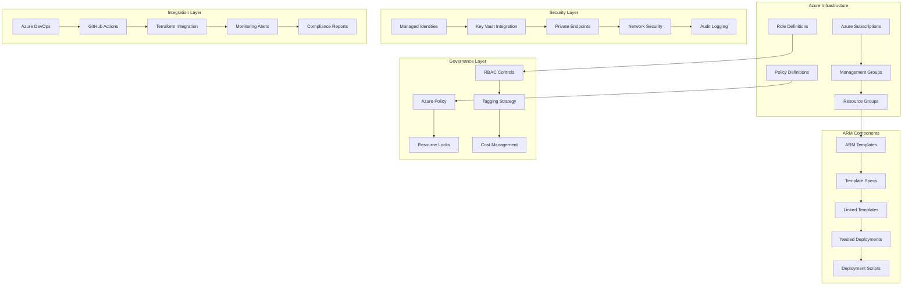

# Azure Resource Manager (ARM) Enterprise 深度实践

> **Author**: Cloud Infrastructure Architect | **Version**: v1.0 | **Update Time**: 2026-02-07
> **Scenario**: Enterprise-grade infrastructure automation on Azure | **Complexity**: ⭐⭐⭐⭐

## 🎯 Abstract

This document provides comprehensive exploration of Azure Resource Manager enterprise deployment architecture, security practices, and operational management. Based on large-scale production environment experience, it offers complete technical guidance from template design to governance implementation, helping enterprises build secure, scalable infrastructure automation platforms on Azure with integrated policy management and cost optimization capabilities.

## 1. Azure Resource Manager Enterprise Architecture

### 1.1 Core Component Architecture



### 1.2 Enterprise Management Group Hierarchy

```json
{
  "managementGroups": {
    "root": {
      "name": "company-root",
      "displayName": "Company Root Management Group",
      "children": [
        {
          "name": "landing-zones",
          "displayName": "Landing Zones",
          "policyAssignments": [
            "enforce-encryption",
            "allow-only-approved-regions",
            "require-tags"
          ],
          "subscriptions": [
            {
              "name": "prod-landing-zone",
              "purpose": "Production workloads",
              "resourceGroups": [
                "prod-networking",
                "prod-compute",
                "prod-storage",
                "prod-security"
              ]
            },
            {
              "name": "nonprod-landing-zone",
              "purpose": "Development and testing",
              "resourceGroups": [
                "dev-networking",
                "dev-compute",
                "dev-storage"
              ]
            }
          ]
        },
        {
          "name": "platform",
          "displayName": "Platform Services",
          "subscriptions": [
            {
              "name": "platform-connectivity",
              "purpose": "Hub and spoke networking",
              "resourceGroups": [
                "hub-network",
                "firewall",
                "vpn"
              ]
            },
            {
              "name": "platform-identity",
              "purpose": "Identity and access management",
              "resourceGroups": [
                "aad",
                "key-vault",
                "managed-identity"
              ]
            }
          ]
        },
        {
          "name": "sandbox",
          "displayName": "Sandbox Environments",
          "policyAssignments": [
            "cost-alerts",
            "auto-shutdown",
            "resource-limits"
          ]
        }
      ]
    }
  }
}
```

## 2. Advanced ARM Template Design

### 2.1 Enterprise Template Structure

```json
{
  "$schema": "https://schema.management.azure.com/schemas/2019-04-01/deploymentTemplate.json#",
  "contentVersion": "1.0.0.0",
  "parameters": {
    "environment": {
      "type": "string",
      "allowedValues": [
        "dev",
        "test",
        "staging",
        "prod"
      ],
      "metadata": {
        "description": "Target environment"
      }
    },
    "location": {
      "type": "string",
      "defaultValue": "[resourceGroup().location]",
      "metadata": {
        "description": "Azure region for deployment"
      }
    },
    "applicationName": {
      "type": "string",
      "metadata": {
        "description": "Application name for resource naming"
      }
    },
    "adminUsername": {
      "type": "string",
      "metadata": {
        "description": "Administrator username"
      }
    },
    "adminPassword": {
      "type": "securestring",
      "metadata": {
        "description": "Administrator password"
      }
    }
  },
  "variables": {
    "namingConvention": {
      "prefix": "[concat(parameters('applicationName'), '-', parameters('environment'))]",
      "virtualNetworkName": "[concat(variables('namingConvention').prefix, '-vnet')]",
      "subnetName": "[concat(variables('namingConvention').prefix, '-subnet')]",
      "nsgName": "[concat(variables('namingConvention').prefix, '-nsg')]",
      "storageAccountName": "[concat('st', uniqueString(resourceGroup().id))]"
    },
    "networkSettings": {
      "addressPrefix": "10.0.0.0/16",
      "subnetPrefix": "10.0.0.0/24",
      "bastionSubnetPrefix": "10.0.1.0/24"
    }
  },
  "resources": [
    {
      "type": "Microsoft.Network/virtualNetworks",
      "apiVersion": "2022-01-01",
      "name": "[variables('namingConvention').virtualNetworkName]",
      "location": "[parameters('location')]",
      "tags": {
        "Environment": "[parameters('environment')]",
        "Application": "[parameters('applicationName')]",
        "CostCenter": "IT-Infrastructure",
        "Owner": "PlatformTeam"
      },
      "properties": {
        "addressSpace": {
          "addressPrefixes": [
            "[variables('networkSettings').addressPrefix]"
          ]
        },
        "subnets": [
          {
            "name": "[variables('namingConvention').subnetName]",
            "properties": {
              "addressPrefix": "[variables('networkSettings').subnetPrefix]",
              "networkSecurityGroup": {
                "id": "[resourceId('Microsoft.Network/networkSecurityGroups', variables('namingConvention').nsgName)]"
              }
            }
          },
          {
            "name": "AzureBastionSubnet",
            "properties": {
              "addressPrefix": "[variables('networkSettings').bastionSubnetPrefix]"
            }
          }
        ]
      }
    },
    {
      "type": "Microsoft.Network/networkSecurityGroups",
      "apiVersion": "2022-01-01",
      "name": "[variables('namingConvention').nsgName]",
      "location": "[parameters('location')]",
      "properties": {
        "securityRules": [
          {
            "name": "AllowSSH",
            "properties": {
              "protocol": "Tcp",
              "sourcePortRange": "*",
              "destinationPortRange": "22",
              "sourceAddressPrefix": "[if(equals(parameters('environment'), 'prod'), 'VirtualNetwork', '*')]",
              "destinationAddressPrefix": "*",
              "access": "Allow",
              "priority": 1000,
              "direction": "Inbound"
            }
          },
          {
            "name": "AllowHTTP",
            "properties": {
              "protocol": "Tcp",
              "sourcePortRange": "*",
              "destinationPortRange": "80",
              "sourceAddressPrefix": "*",
              "destinationAddressPrefix": "*",
              "access": "Allow",
              "priority": 1010,
              "direction": "Inbound"
            }
          }
        ]
      }
    }
  ],
  "outputs": {
    "virtualNetworkId": {
      "type": "string",
      "value": "[resourceId('Microsoft.Network/virtualNetworks', variables('namingConvention').virtualNetworkName)]"
    },
    "subnetId": {
      "type": "string",
      "value": "[resourceId('Microsoft.Network/virtualNetworks/subnets', variables('namingConvention').virtualNetworkName, variables('namingConvention').subnetName)]"
    }
  }
}
```

### 2.2 Linked Template Implementation

```json
{
  "$schema": "https://schema.management.azure.com/schemas/2019-04-01/deploymentTemplate.json#",
  "contentVersion": "1.0.0.0",
  "parameters": {
    "environment": {
      "type": "string",
      "allowedValues": ["dev", "test", "staging", "prod"]
    },
    "location": {
      "type": "string",
      "defaultValue": "[resourceGroup().location]"
    }
  },
  "variables": {
    "templateBaseUrl": "https://raw.githubusercontent.com/company/azure-templates/main/enterprise/",
    "networkTemplateUrl": "[concat(variables('templateBaseUrl'), 'networking.json')]",
    "computeTemplateUrl": "[concat(variables('templateBaseUrl'), 'compute.json')]",
    "storageTemplateUrl": "[concat(variables('templateBaseUrl'), 'storage.json')]"
  },
  "resources": [
    {
      "type": "Microsoft.Resources/deployments",
      "apiVersion": "2022-09-01",
      "name": "[concat('networking-', parameters('environment'))]",
      "properties": {
        "mode": "Incremental",
        "templateLink": {
          "uri": "[variables('networkTemplateUrl')]",
          "contentVersion": "1.0.0.0"
        },
        "parameters": {
          "environment": {
            "value": "[parameters('environment')]"
          },
          "location": {
            "value": "[parameters('location')]"
          }
        }
      }
    },
    {
      "type": "Microsoft.Resources/deployments",
      "apiVersion": "2022-09-01",
      "name": "[concat('compute-', parameters('environment'))]",
      "dependsOn": [
        "[resourceId('Microsoft.Resources/deployments', concat('networking-', parameters('environment')))]"
      ],
      "properties": {
        "mode": "Incremental",
        "templateLink": {
          "uri": "[variables('computeTemplateUrl')]",
          "contentVersion": "1.0.0.0"
        },
        "parameters": {
          "environment": {
            "value": "[parameters('environment')]"
          },
          "location": {
            "value": "[parameters('location')]"
          },
          "subnetId": {
            "value": "[reference(concat('networking-', parameters('environment'))).outputs.subnetId.value]"
          }
        }
      }
    }
  ]
}
```

## 3. Azure Policy and Governance

### 3.1 Custom Policy Definitions

```json
{
  "mode": "All",
  "policyRule": {
    "if": {
      "allOf": [
        {
          "field": "type",
          "equals": "Microsoft.Compute/virtualMachines"
        },
        {
          "anyOf": [
            {
              "field": "Microsoft.Compute/virtualMachines/storageProfile.osDisk.managedDisk.storageAccountType",
              "notEquals": "Premium_LRS"
            },
            {
              "field": "Microsoft.Compute/virtualMachines/storageProfile.osDisk.managedDisk.storageAccountType",
              "exists": false
            }
          ]
        }
      ]
    },
    "then": {
      "effect": "deny"
    }
  },
  "parameters": {},
  "metadata": {
    "category": "Compute",
    "version": "1.0.0",
    "description": "Enforces use of Premium SSD disks for all virtual machines"
  }
}
```

### 3.2 Initiative Definition

```json
{
  "properties": {
    "displayName": "Enterprise Security Baseline",
    "description": "Comprehensive security policies for enterprise Azure environments",
    "parameters": {
      "allowedLocations": {
        "type": "Array",
        "metadata": {
          "description": "List of allowed Azure regions",
          "displayName": "Allowed locations"
        },
        "defaultValue": ["eastus", "westus2", "centralus"]
      }
    },
    "policyDefinitions": [
      {
        "policyDefinitionId": "/providers/Microsoft.Authorization/policyDefinitions/e56962a6-4747-49cd-b67b-bf8b01975c4c",
        "parameters": {
          "listOfAllowedLocations": {
            "value": "[parameters('allowedLocations')]"
          }
        }
      },
      {
        "policyDefinitionId": "/providers/Microsoft.Authorization/policyDefinitions/6134c3db-786f-471e-87bc-8f479dc890f6",
        "parameters": {}
      },
      {
        "policyDefinitionReferenceId": "enforce-https",
        "policyDefinitionId": "/providers/Microsoft.Authorization/policyDefinitions/a4af4a39-4135-47fb-b175-47fbdf85311d",
        "parameters": {}
      }
    ]
  }
}
```

## 4. Security and Compliance

### 4.1 Managed Identity Integration

```json
{
  "type": "Microsoft.Compute/virtualMachines",
  "apiVersion": "2022-03-01",
  "name": "[variables('vmName')]",
  "location": "[parameters('location')]",
  "identity": {
    "type": "SystemAssigned"
  },
  "properties": {
    "storageProfile": {
      "imageReference": {
        "publisher": "Canonical",
        "offer": "UbuntuServer",
        "sku": "18.04-LTS",
        "version": "latest"
      }
    },
    "osProfile": {
      "computerName": "[variables('vmName')]",
      "adminUsername": "[parameters('adminUsername')]",
      "adminPassword": "[parameters('adminPassword')]"
    }
  }
}
```

### 4.2 Key Vault Integration

```bash
#!/bin/bash
# azure_key_vault_integration.sh

# 1. 创建Key Vault
az keyvault create \
  --name "enterprise-keyvault" \
  --resource-group "security-rg" \
  --location "eastus" \
  --enable-soft-delete true \
  --enable-purge-protection true \
  --sku standard

# 2. 设置访问策略
az keyvault set-policy \
  --name "enterprise-keyvault" \
  --object-id $(az ad sp show --id $(az deployment group show --name "vm-deployment" --resource-group "compute-rg" --query "properties.outputs.managedIdentityObjectId.value" -o tsv) --query "id" -o tsv) \
  --secret-permissions get list \
  --key-permissions get list sign

# 3. 存储密钥
az keyvault secret set \
  --vault-name "enterprise-keyvault" \
  --name "vm-admin-password" \
  --value "SecurePassword123!"

# 4. 在ARM模板中引用
cat > vm_template.json << 'EOF'
{
  "$schema": "https://schema.management.azure.com/schemas/2019-04-01/deploymentTemplate.json#",
  "contentVersion": "1.0.0.0",
  "parameters": {
    "adminUsername": {
      "type": "string"
    }
  },
  "variables": {
    "adminPassword": "[listSecrets(resourceId('Microsoft.KeyVault/vaults/secrets', 'enterprise-keyvault', 'vm-admin-password'), '2019-09-01').value]"
  },
  "resources": [
    {
      "type": "Microsoft.Compute/virtualMachines",
      "apiVersion": "2022-03-01",
      "name": "my-vm",
      "properties": {
        "osProfile": {
          "computerName": "myvm",
          "adminUsername": "[parameters('adminUsername')]",
          "adminPassword": "[variables('adminPassword')]"
        }
      }
    }
  ]
}
EOF
```

## 5. Monitoring and Cost Optimization

### 5.1 Azure Monitor Integration

```json
{
  "type": "Microsoft.Insights/diagnosticSettings",
  "apiVersion": "2021-05-01-preview",
  "name": "[concat('diagnostics-', variables('storageAccountName'))]",
  "scope": "[resourceId('Microsoft.Storage/storageAccounts', variables('storageAccountName'))]",
  "properties": {
    "workspaceId": "[resourceId('Microsoft.OperationalInsights/workspaces', variables('logAnalyticsWorkspaceName'))]",
    "logs": [
      {
        "category": "StorageRead",
        "enabled": true
      },
      {
        "category": "StorageWrite",
        "enabled": true
      },
      {
        "category": "StorageDelete",
        "enabled": true
      }
    ],
    "metrics": [
      {
        "category": "Transaction",
        "enabled": true,
        "retentionPolicy": {
          "days": 0,
          "enabled": false
        }
      }
    ]
  }
}
```

### 5.2 Cost Management Queries

```kql
// Azure成本分析查询示例

// 1. 按资源组分析成本
Resources
| where type == "microsoft.consumption/budgets"
| project 
    ResourceGroup = tostring(tags['resourceGroup']),
    Cost = todouble(properties.amount),
    Currency = tostring(properties.currency),
    TimeGrain = tostring(properties.timeGrain)

// 2. 虚拟机成本分析
Resources
| where type == "microsoft.compute/virtualmachines"
| join (
    Usage
    | where meterCategory == "Virtual Machines"
    | summarize TotalCost = sum(preTaxCost) by 
        ResourceId,
        MeterSubCategory,
        UsageDate
) on $left.id == $right.ResourceId
| project 
    VMName = name,
    Size = tostring(properties.hardwareProfile.vmSize),
    TotalCost,
    UsageDate

// 3. 存储账户成本优化
Resources
| where type == "microsoft.storage/storageaccounts"
| extend StorageType = tostring(properties.sku.name)
| join (
    Usage
    | where meterCategory == "Storage"
    | summarize StorageCost = sum(preTaxCost) by 
        ResourceId,
        MeterSubCategory
) on $left.id == $right.ResourceId
| where StorageCost > 100  // 高成本存储账户
| order by StorageCost desc
```

## 6. CI/CD Integration

### 6.1 Azure DevOps Pipeline

```yaml
# azure-pipelines.yml
trigger:
  branches:
    include:
      - main
      - releases/*
  paths:
    include:
      - infrastructure/arm-templates/*

pool:
  vmImage: 'ubuntu-latest'

variables:
  - group: 'azure-credentials'
  - name: 'location'
    value: 'eastus'
  - name: 'templateFile'
    value: 'main.json'

stages:
  - stage: Validate
    displayName: 'Validate ARM Templates'
    jobs:
      - job: Validation
        steps:
          - task: AzureResourceManagerTemplateDeployment@3
            displayName: 'Validate ARM Template'
            inputs:
              deploymentScope: 'Resource Group'
              azureResourceManagerConnection: 'AzureServiceConnection'
              subscriptionId: '$(subscriptionId)'
              action: 'Create Or Update Resource Group'
              resourceGroupName: '$(resourceGroupName)'
              location: '$(location)'
              templateLocation: 'Linked artifact'
              csmFile: '$(templateFile)'
              deploymentMode: 'Validation'
              deploymentName: 'validation-$(Build.BuildId)'

  - stage: Deploy
    displayName: 'Deploy to Environment'
    dependsOn: Validate
    condition: and(succeeded(), eq(variables['Build.SourceBranch'], 'refs/heads/main'))
    jobs:
      - deployment: Deployment
        environment: 'production'
        strategy:
          runOnce:
            deploy:
              steps:
                - task: AzureResourceManagerTemplateDeployment@3
                  displayName: 'Deploy ARM Template'
                  inputs:
                    deploymentScope: 'Resource Group'
                    azureResourceManagerConnection: 'AzureServiceConnection'
                    subscriptionId: '$(subscriptionId)'
                    action: 'Create Or Update Resource Group'
                    resourceGroupName: '$(resourceGroupName)'
                    location: '$(location)'
                    templateLocation: 'Linked artifact'
                    csmFile: '$(templateFile)'
                    deploymentMode: 'Incremental'
                    deploymentName: 'deployment-$(Build.BuildId)'
                    overrideParameters: >
                      -environment production
                      -adminUsername $(adminUsername)
                      -adminPassword $(adminPassword)
```

### 6.2 GitHub Actions Integration

```yaml
# .github/workflows/azure-deploy.yml
name: Deploy to Azure

on:
  push:
    branches: [ main ]
  pull_request:
    branches: [ main ]

env:
  AZURE_RESOURCE_GROUP: production-rg
  AZURE_LOCATION: eastus

jobs:
  validate:
    runs-on: ubuntu-latest
    steps:
      - uses: actions/checkout@v4
      
      - name: Azure Login
        uses: azure/login@v1
        with:
          creds: ${{ secrets.AZURE_CREDENTIALS }}
      
      - name: Validate ARM Template
        uses: azure/arm-deploy@v1
        with:
          resourceGroupName: ${{ env.AZURE_RESOURCE_GROUP }}
          template: ./infrastructure/main.json
          parameters: >
            environment=production
            location=${{ env.AZURE_LOCATION }}
          deploymentMode: Validate

  deploy:
    needs: validate
    runs-on: ubuntu-latest
    if: github.ref == 'refs/heads/main'
    steps:
      - uses: actions/checkout@v4
      
      - name: Azure Login
        uses: azure/login@v1
        with:
          creds: ${{ secrets.AZURE_CREDENTIALS }}
      
      - name: Deploy ARM Template
        uses: azure/arm-deploy@v1
        with:
          resourceGroupName: ${{ env.AZURE_RESOURCE_GROUP }}
          template: ./infrastructure/main.json
          parameters: >
            environment=production
            location=${{ env.AZURE_LOCATION }}
            adminUsername=${{ secrets.ADMIN_USERNAME }}
            adminPassword=${{ secrets.ADMIN_PASSWORD }}
          deploymentName: github-action-deployment-${{ github.run_number }}
```

## 7. Best Practices and Troubleshooting

### 7.1 Template Best Practices

```json
{
  "$schema": "https://schema.management.azure.com/schemas/2019-04-01/deploymentTemplate.json#",
  "contentVersion": "1.0.0.0",
  "metadata": {
    "_generator": {
      "name": "bicep",
      "version": "0.12.40.15287",
      "templateHash": "1234567890"
    }
  },
  "parameters": {
    "tagsByEnv": {
      "type": "object",
      "defaultValue": {
        "dev": {
          "Environment": "Development",
          "Project": "Enterprise-Platform",
          "Owner": "DevOps-Team"
        },
        "prod": {
          "Environment": "Production",
          "Project": "Enterprise-Platform",
          "Owner": "Platform-Team",
          "Compliance": "SOC2"
        }
      }
    }
  },
  "functions": [
    {
      "namespace": "enterprise",
      "members": {
        "getResourceName": {
          "parameters": [
            {
              "name": "resourceType",
              "type": "string"
            },
            {
              "name": "suffix",
              "type": "string"
            }
          ],
          "output": {
            "type": "string",
            "value": "[concat(parameters('applicationName'), '-', parameters('environment'), '-', parameters('suffix'))]"
          }
        }
      }
    }
  ]
}
```

### 7.2 Common Troubleshooting Commands

```bash
#!/bin/bash
# arm_troubleshooting.sh

# 1. 查看部署状态
az deployment group list \
  --resource-group "my-resource-group" \
  --query "[].{Name:name, Status:properties.provisioningState, Timestamp:properties.timestamp}" \
  -o table

# 2. 获取部署详细信息
az deployment group show \
  --name "my-deployment" \
  --resource-group "my-resource-group"

# 3. 查看部署操作详情
az deployment operation group list \
  --name "my-deployment" \
  --resource-group "my-resource-group" \
  --query "[].{Operation:properties.targetResource.resourceName, Status:properties.provisioningState, ErrorCode:properties.statusMessage.error.code}" \
  -o table

# 4. 验证模板语法
az deployment group validate \
  --resource-group "my-resource-group" \
  --template-file "main.json" \
  --parameters "@parameters.json"

# 5. 导出现有资源组为模板
az group export \
  --name "my-resource-group" \
  --include-parameter-default-value \
  --output-file "exported-template.json"
```

---
*This document is based on enterprise-level Azure Resource Manager practice experience and continuously updated with the latest technologies and best practices.*