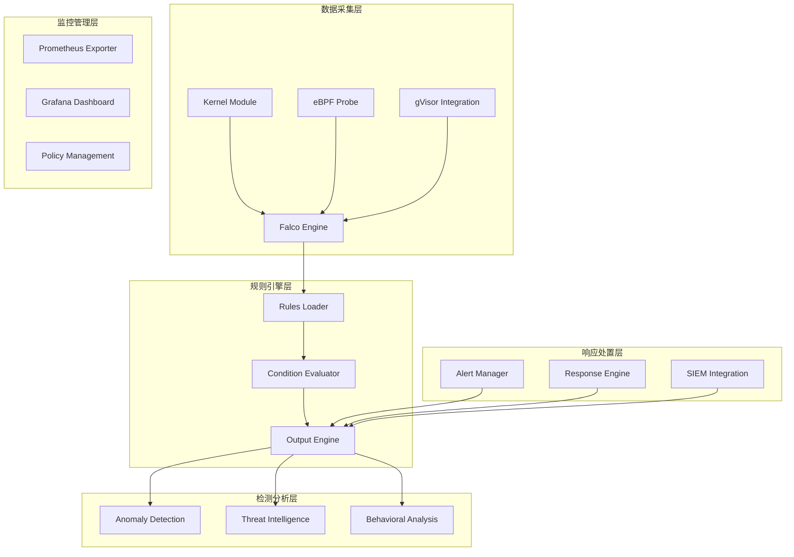

# Falco云原生安全监控深度实践

> **作者**: 云原生安全专家 | **版本**: v1.0 | **更新时间**: 2026-02-07
> **适用场景**: 企业级容器安全防护 | **复杂度**: ⭐⭐⭐⭐⭐

## 🎯 摘要

本文档深入探讨了Falco云原生安全监控系统的架构设计、规则配置和威胁检测实践，基于大规模生产环境的安全防护经验，提供从运行时保护到威胁响应的完整技术指南，帮助企业构建主动防御的容器安全体系。

## 1. Falco架构深度解析

### 1.1 核心组件架构



### 1.2 工作原理详解

```yaml
falco_operation_principle:
  syscall_interception:
    kernel_module:
      description: "内核模块方式拦截系统调用"
      advantages:
        - 性能开销最小
        - 兼容性好
        - 功能完整
      limitations:
        - 需要内核头文件
        - 安全风险考虑
    
    ebpf_probe:
      description: "eBPF探针方式拦截"
      advantages:
        - 无需修改内核
        - 安全性更好
        - 现代内核支持
      limitations:
        - 性能略低
        - 内核版本要求
    
    gvisor_integration:
      description: "gVisor沙箱集成"
      advantages:
        - 零信任安全模型
        - 完全隔离
        - 细粒度控制
      limitations:
        - 性能影响较大
        - 兼容性限制

  event_processing:
    phases:
      capture: "捕获系统调用和事件"
      parsing: "解析事件结构和参数"
      matching: "匹配安全规则条件"
      alerting: "生成告警和响应动作"
      logging: "记录安全事件日志"
```

## 2. 企业级部署架构

### 2.1 Falco DaemonSet部署

```yaml
# falco-daemonset.yaml
apiVersion: apps/v1
kind: DaemonSet
metadata:
  name: falco
  namespace: falco
  labels:
    app: falco
spec:
  selector:
    matchLabels:
      app: falco
  template:
    metadata:
      labels:
        app: falco
    spec:
      hostPID: true
      hostNetwork: true
      dnsPolicy: ClusterFirstWithHostNet
      tolerations:
        - effect: NoSchedule
          operator: Exists
        - effect: NoExecute
          operator: Exists
        - key: CriticalAddonsOnly
          operator: Exists
      containers:
        - name: falco
          image: falcosecurity/falco-no-driver:0.37.0
          imagePullPolicy: IfNotPresent
          resources:
            requests:
              cpu: 100m
              memory: 512Mi
            limits:
              cpu: 1000m
              memory: 1Gi
          securityContext:
            privileged: true
          env:
            - name: FALCO_BPF_PROBE
              value: ""
            - name: FALCO_FRONTEND
              value: "noninteractive"
            - name: HOME
              value: "/root"
          volumeMounts:
            - name: falco-config
              mountPath: /etc/falco
            - name: falco-rules
              mountPath: /etc/falco/rules.d
            - name: falco-certs
              mountPath: /etc/falco/certs
            - name: dev-fs
              mountPath: /host/dev
              readOnly: true
            - name: proc-fs
              mountPath: /host/proc
              readOnly: true
            - name: boot-fs
              mountPath: /host/boot
              readOnly: true
            - name: lib-modules
              mountPath: /lib/modules
              readOnly: true
            - name: usr-fs
              mountPath: /host/usr
              readOnly: true
            - name: etc-fs
              mountPath: /host/etc
              readOnly: true
            - name: var-fs
              mountPath: /host/var
              readOnly: true
          livenessProbe:
            exec:
              command:
                - /bin/grpc_health_probe
                - -addr=localhost:5060
            initialDelaySeconds: 60
            periodSeconds: 15
            timeoutSeconds: 3
          readinessProbe:
            exec:
              command:
                - /bin/grpc_health_probe
                - -addr=localhost:5060
            initialDelaySeconds: 30
            periodSeconds: 15
            timeoutSeconds: 3
      volumes:
        - name: falco-config
          configMap:
            name: falco-config
        - name: falco-rules
          configMap:
            name: falco-rules
        - name: falco-certs
          secret:
            secretName: falco-certs
        - name: dev-fs
          hostPath:
            path: /dev
        - name: proc-fs
          hostPath:
            path: /proc
        - name: boot-fs
          hostPath:
            path: /boot
        - name: lib-modules
          hostPath:
            path: /lib/modules
        - name: usr-fs
          hostPath:
            path: /usr
        - name: etc-fs
          hostPath:
            path: /etc
        - name: var-fs
          hostPath:
            path: /var
---
# Falco配置文件
apiVersion: v1
kind: ConfigMap
metadata:
  name: falco-config
  namespace: falco
data:
  falco.yaml: |
    # 日志配置
    log_level: info
    log_stderr: true
    log_syslog: true
    
    # 规则配置
    rules_file:
      - /etc/falco/falco_rules.yaml
      - /etc/falco/falco_rules.local.yaml
      - /etc/falco/k8s_audit_rules.yaml
      - /etc/falco/rules.d
    
    # 输出配置
    stdout_output:
      enabled: true
    
    syslog_output:
      enabled: true
    
    file_output:
      enabled: false
      keep_alive: false
      filename: ./events.txt
    
    http_output:
      enabled: true
      url: http://falcosidekick:2801/
    
    # gRPC配置
    grpc:
      enabled: true
      bind_address: "0.0.0.0:5060"
      threadiness: 8
    
    grpc_output:
      enabled: true
    
    # 容器引擎配置
    container_engines:
      docker:
        enabled: true
      cri:
        enabled: true
        cri_unix_socket_paths:
          - /run/containerd/containerd.sock
          - /run/crio/crio.sock
    
    # Kubernetes配置
    kubernetes:
      enabled: true
      api_user_agent: "falco"
      node_name_env_var: "NODE_NAME"
    
    # 容器元数据缓存
    metadata_download:
      max_mb: 100
      chunk_wait_us: 1000
      watch_freq_sec: 1
```

### 2.2 Falco Sidekick集成

```yaml
# falcosidekick-deployment.yaml
apiVersion: apps/v1
kind: Deployment
metadata:
  name: falcosidekick
  namespace: falco
spec:
  replicas: 2
  selector:
    matchLabels:
      app: falcosidekick
  template:
    metadata:
      labels:
        app: falcosidekick
    spec:
      containers:
        - name: falcosidekick
          image: falcosecurity/falcosidekick:2.28.0
          ports:
            - containerPort: 2801
          env:
            # Slack配置
            - name: SLACK_WEBHOOKURL
              valueFrom:
                secretKeyRef:
                  name: falco-secrets
                  key: slack-webhook-url
            
            # Prometheus指标
            - name: PROMETHEUS_EXPOSEMETRICS
              value: "true"
            - name: PROMETHEUS_METRICSENDPOINT
              value: "/metrics"
            
            # Elasticsearch输出
            - name: ELASTICSEARCH_HOSTPORT
              value: "elasticsearch.logging:9200"
            - name: ELASTICSEARCH_INDEX
              value: "falco-events"
            
            # AWS S3输出
            - name: AWS_S3_BUCKET
              value: "falco-security-logs"
            - name: AWS_REGION
              value: "us-west-2"
            
            # Kafka输出
            - name: KAFKA_HOSTPORT
              value: "kafka.kafka:9092"
            - name: KAFKA_TOPIC
              value: "falco-alerts"
          
          resources:
            requests:
              memory: "64Mi"
              cpu: "25m"
            limits:
              memory: "128Mi"
              cpu: "50m"
          
          livenessProbe:
            httpGet:
              path: /ping
              port: 2801
            initialDelaySeconds: 30
            periodSeconds: 10
          
          readinessProbe:
            httpGet:
              path: /ping
              port: 2801
            initialDelaySeconds: 5
            periodSeconds: 5

---
# Falco Sidekick Service
apiVersion: v1
kind: Service
metadata:
  name: falcosidekick
  namespace: falco
spec:
  selector:
    app: falcosidekick
  ports:
    - protocol: TCP
      port: 2801
      targetPort: 2801
```

## 3. 安全规则体系设计

### 3.1 核心安全规则

```yaml
# falco_rules.local.yaml
- rule: Terminal shell in container
  desc: A shell was used as the entrypoint/exec point into a container with an attached terminal.
  condition: >
    spawned_process and container
    and shell_procs and proc.tty != 0
    and container_entrypoint
  output: >
    Terminal shell opened in container (user=%user.name container_id=%container.id container_name=%container.name shell=%proc.name parent=%proc.pname cmdline=%proc.cmdline terminal=%proc.tty)
  priority: WARNING
  tags: [container, shell, mitre_execution]

- rule: Contact K8s API Server From Container
  desc: Detect attempts to contact the K8s API Server from a container
  condition: >
    outbound and evt.type=connect and fd.type=ipv4
    and container and fd.ip.addr=%ka.api.server.ip%
    and not ka.user.name in (ka.allowed.users)
  output: >
    Container contacting K8s API Server (user=%ka.user.name command=%proc.cmdline connection=%fd.name container=%container.name image=%container.image.repository)
  priority: NOTICE
  tags: [k8s, network, mitre_discovery]

- rule: Unexpected outbound connection destination
  desc: Detect outbound connections to unexpected destinations
  condition: >
    outbound and evt.type=connect and fd.type=ipv4
    and container and fd.ip.addr in (blacklisted.ips)
  output: >
    Outbound connection to blacklisted IP (command=%proc.cmdline connection=%fd.name container=%container.name image=%container.image.repository)
  priority: WARNING
  tags: [network, security, mitre_command_and_control]

- rule: Write below etc
  desc: a process wrote to the etc directory
  condition: >
    write_etc_common and container
  output: >
    File below /etc opened for writing (user=%user.name command=%proc.cmdline file=%fd.name parent=%proc.pname container_id=%container.id container_name=%container.name image=%container.image.repository)
  priority: ERROR
  tags: [filesystem, mitre_persistence]

- rule: Create hidden file or directory
  desc: Hidden file or directory created
  condition: >
    mkdir and evt.arg.path contains "." and container
  output: >
    Hidden file or directory created (user=%user.name command=%proc.cmdline file=%evt.arg.path container_id=%container.id container_name=%container.name image=%container.image.repository)
  priority: WARNING
  tags: [filesystem, mitre_defense_evasion]

- rule: Detect crypto miners
  desc: Detection of cryptocurrency miners
  condition: >
    spawned_process and container
    and (proc.name in (cgminer, ethminer, nicehash, stratum, xmrig)
    or proc.cmdline contains "stratum+tcp"
    or proc.cmdline contains "pool.minexmr.com"
    or proc.cmdline contains "xmr.pool.minergate.com")
  output: >
    Cryptocurrency miner detected (user=%user.name command=%proc.cmdline container_id=%container.id container_name=%container.name image=%container.image.repository)
  priority: CRITICAL
  tags: [malware, mining, security]
```

### 3.2 Kubernetes审计规则

```yaml
# k8s_audit_rules.yaml
- rule: K8s Serviceaccount Created
  desc: Detect any attempt to create a serviceaccount
  condition: kevt and ka.verb=create and ka.resource=serviceaccounts
  output: >
    K8s Serviceaccount created (user=%ka.user.name ns=%ka.namespace name=%ka.resource.name reason=%ka.response.reason)
  priority: INFO
  source: k8s_audit
  tags: [k8s, sa, mitre_persistence]

- rule: K8s Role/ClusterRole Created
  desc: Detect any attempt to create a role or clusterrole
  condition: >
    kevt and ka.verb=create and ka.resource in (roles, clusterroles)
  output: >
    K8s Role/ClusterRole created (user=%ka.user.name ns=%ka.namespace name=%ka.resource.name resource=%ka.resource verb=%ka.verb reason=%ka.response.reason)
  priority: WARNING
  source: k8s_audit
  tags: [k8s, rbac, mitre_privilege_escalation]

- rule: K8s Secret Modified
  desc: Detect any attempt to modify a secret
  condition: >
    kevt and ka.verb in (update, patch) and ka.resource=secrets
  output: >
    K8s Secret modified (user=%ka.user.name ns=%ka.namespace name=%ka.resource.name reason=%ka.response.reason)
  priority: WARNING
  source: k8s_audit
  tags: [k8s, secret, mitre_credential_access]

- rule: K8s Pod Exec
  desc: Detect any attempt to exec into a pod
  condition: >
    kevt and ka.verb=exec and ka.resource=pods
  output: >
    K8s Pod exec (user=%ka.user.name ns=%ka.namespace name=%ka.resource.name pod=%ka.target.name container=%ka.target.subresource reason=%ka.response.reason)
  priority: NOTICE
  source: k8s_audit
  tags: [k8s, pod, mitre_execution]

- rule: K8s Network Policy Modified
  desc: Detect any attempt to modify network policies
  condition: >
    kevt and ka.verb in (update, patch, delete) and ka.resource=networkpolicies
  output: >
    K8s Network Policy modified (user=%ka.user.name ns=%ka.namespace name=%ka.resource.name verb=%ka.verb reason=%ka.response.reason)
  priority: WARNING
  source: k8s_audit
  tags: [k8s, network, mitre_impact]
```

## 4. 威胁检测与响应

### 4.1 威胁情报集成

```python
#!/usr/bin/env python3
# threat_intelligence_feeds.py

import requests
import json
import time
from typing import Dict, List, Set
import logging

class ThreatIntelligenceFeeds:
    def __init__(self):
        self.feeds = {
            'alienvault': {
                'url': 'https://reputation.alienvault.com/reputation.generic',
                'format': 'txt'
            },
            'emerging_threats': {
                'url': 'https://rules.emergingthreats.net/blockrules/compromised-ips.txt',
                'format': 'txt'
            },
            'spamhaus': {
                'url': 'https://www.spamhaus.org/drop/drop.txt',
                'format': 'txt'
            }
        }
        self.blacklisted_ips: Set[str] = set()
        self.logger = logging.getLogger(__name__)
    
    def fetch_feed(self, feed_name: str, feed_config: Dict) -> List[str]:
        """获取威胁情报feed"""
        try:
            response = requests.get(feed_config['url'], timeout=30)
            response.raise_for_status()
            
            ips = []
            if feed_config['format'] == 'txt':
                for line in response.text.splitlines():
                    line = line.strip()
                    if line and not line.startswith('#'):
                        # 解析IP地址
                        if '/' in line:  # CIDR格式
                            ip = line.split('/')[0]
                        elif ' ' in line:  # 带注释的格式
                            ip = line.split()[0]
                        else:
                            ip = line
                        
                        if self.is_valid_ip(ip):
                            ips.append(ip)
            
            self.logger.info(f"Fetched {len(ips)} IPs from {feed_name}")
            return ips
            
        except Exception as e:
            self.logger.error(f"Failed to fetch {feed_name}: {e}")
            return []
    
    def is_valid_ip(self, ip: str) -> bool:
        """验证IP地址格式"""
        import ipaddress
        try:
            ipaddress.ip_address(ip)
            return True
        except ValueError:
            return False
    
    def update_blacklist(self) -> None:
        """更新黑名单"""
        all_ips = set()
        
        for feed_name, feed_config in self.feeds.items():
            ips = self.fetch_feed(feed_name, feed_config)
            all_ips.update(ips)
        
        self.blacklisted_ips = all_ips
        self.logger.info(f"Updated blacklist with {len(self.blacklisted_ips)} unique IPs")
    
    def generate_falco_rules(self) -> str:
        """生成Falco规则"""
        if not self.blacklisted_ips:
            self.update_blacklist()
        
        # 生成IP列表
        ip_list = ', '.join([f'"{ip}"' for ip in list(self.blacklisted_ips)[:1000]])
        
        rule_template = f'''
- rule: Connection to malicious IP
  desc: Detect connections to known malicious IPs
  condition: >
    outbound and evt.type=connect and fd.type=ipv4
    and fd.ip.addr in ({ip_list})
  output: >
    Connection to malicious IP detected (connection=%fd.name process=%proc.name container=%container.name)
  priority: WARNING
  tags: [network, threat_intel, security]
'''
        
        return rule_template
    
    def save_rules(self, filepath: str) -> None:
        """保存规则到文件"""
        rules = self.generate_falco_rules()
        with open(filepath, 'w') as f:
            f.write(rules)
        self.logger.info(f"Rules saved to {filepath}")

# 定期更新任务
def scheduled_update():
    ti_feeds = ThreatIntelligenceFeeds()
    
    while True:
        try:
            ti_feeds.update_blacklist()
            ti_feeds.save_rules('/etc/falco/rules.d/threat_intel_rules.yaml')
            
            # 通知Falco重新加载规则
            import subprocess
            subprocess.run(['kill', '-1', '1'], check=False)
            
        except Exception as e:
            logging.error(f"Scheduled update failed: {e}")
        
        # 每小时更新一次
        time.sleep(3600)

if __name__ == "__main__":
    scheduled_update()
```

### 4.2 自动化响应机制

```yaml
# automated_response.yaml
apiVersion: apps/v1
kind: Deployment
metadata:
  name: falco-response-engine
  namespace: falco
spec:
  replicas: 1
  selector:
    matchLabels:
      app: falco-response-engine
  template:
    metadata:
      labels:
        app: falco-response-engine
    spec:
      containers:
        - name: response-engine
          image: falco-response-engine:latest
          env:
            - name: ALERT_ENDPOINT
              value: "http://falcosidekick:2801"
            - name: KUBECONFIG
              value: "/etc/kubernetes/admin.conf"
            - name: RESPONSE_POLICIES
              value: "/etc/response/policies.yaml"
          volumeMounts:
            - name: kubeconfig
              mountPath: /etc/kubernetes
            - name: policies
              mountPath: /etc/response
          resources:
            requests:
              memory: "128Mi"
              cpu: "50m"
            limits:
              memory: "256Mi"
              cpu: "100m"
      volumes:
        - name: kubeconfig
          secret:
            secretName: admin-kubeconfig
        - name: policies
          configMap:
            name: response-policies
---
# 响应策略配置
apiVersion: v1
kind: ConfigMap
metadata:
  name: response-policies
  namespace: falco
data:
  policies.yaml: |
    response_policies:
      - name: "container_shell_access"
        rule: "Terminal shell in container"
        actions:
          - type: "kill_container"
            enabled: true
            grace_period: 30
          - type: "notify_slack"
            enabled: true
            channel: "#security-alerts"
          - type: "quarantine_pod"
            enabled: false
        
      - name: "crypto_mining_detection"
        rule: "Detect crypto miners"
        actions:
          - type: "kill_container"
            enabled: true
            grace_period: 0
          - type: "notify_slack"
            enabled: true
            channel: "#critical-alerts"
          - type: "block_image"
            enabled: true
            duration: "24h"
        
      - name: "malicious_network_activity"
        rule: "Connection to malicious IP"
        actions:
          - type: "network_isolate"
            enabled: true
          - type: "notify_slack"
            enabled: true
            channel: "#network-security"
          - type: "log_forensics"
            enabled: true
            retention_days: 30
```

## 5. 监控与告警体系

### 5.1 Prometheus监控配置

```yaml
# prometheus-monitor.yaml
apiVersion: monitoring.coreos.com/v1
kind: ServiceMonitor
metadata:
  name: falco-monitor
  namespace: falco
spec:
  selector:
    matchLabels:
      app: falcosidekick
  endpoints:
    - port: http
      path: /metrics
      interval: 30s
      metricRelabelings:
        - sourceLabels: [__name__]
          regex: 'falco_(.*)'
          targetLabel: __name__
---
# Prometheus告警规则
apiVersion: monitoring.coreos.com/v1
kind: PrometheusRule
metadata:
  name: falco-alerts
  namespace: falco
spec:
  groups:
    - name: falco.rules
      rules:
        # 高优先级告警
        - alert: FalcoCriticalAlert
          expr: rate(falco_events_total{priority="Critical"}[5m]) > 0
          for: 1m
          labels:
            severity: critical
          annotations:
            summary: "Falco检测到严重安全威胁"
            description: "在过去5分钟内检测到{{ $value }}个严重安全事件"
        
        # 中优先级告警
        - alert: FalcoWarningAlert
          expr: rate(falco_events_total{priority="Warning"}[10m]) > 5
          for: 5m
          labels:
            severity: warning
          annotations:
            summary: "Falco检测到多个警告事件"
            description: "在过去10分钟内检测到{{ $value }}个警告事件"
        
        # 系统健康告警
        - alert: FalcoEngineDown
          expr: up{job="falco"} == 0
          for: 2m
          labels:
            severity: critical
          annotations:
            summary: "Falco引擎不可用"
            description: "Falco安全监控引擎已停止运行"
        
        # 性能告警
        - alert: FalcoHighDropRate
          expr: rate(falco_evts_drop_total[5m]) > 100
          for: 1m
          labels:
            severity: warning
          annotations:
            summary: "Falco事件丢弃率过高"
            description: "事件丢弃率超过阈值，可能影响检测效果"
```

### 5.2 Grafana仪表板配置

```json
{
  "dashboard": {
    "id": null,
    "title": "Falco Security Monitoring",
    "timezone": "browser",
    "schemaVersion": 16,
    "version": 0,
    "refresh": "30s",
    "panels": [
      {
        "type": "graph",
        "title": "安全事件趋势",
        "gridPos": {
          "h": 8,
          "w": 12,
          "x": 0,
          "y": 0
        },
        "targets": [
          {
            "expr": "rate(falco_events_total[5m])",
            "legendFormat": "{{priority}}"
          }
        ],
        "alert": {
          "conditions": [
            {
              "evaluator": {
                "params": [10],
                "type": "gt"
              },
              "operator": {
                "type": "and"
              },
              "query": {
                "params": ["A", "5m", "now"]
              },
              "reducer": {
                "params": [],
                "type": "avg"
              },
              "type": "query"
            }
          ]
        }
      },
      {
        "type": "stat",
        "title": "今日严重事件",
        "gridPos": {
          "h": 4,
          "w": 6,
          "x": 12,
          "y": 0
        },
        "targets": [
          {
            "expr": "increase(falco_events_total{priority=\"Critical\"}[24h])",
            "instant": true
          }
        ]
      },
      {
        "type": "piechart",
        "title": "事件类型分布",
        "gridPos": {
          "h": 8,
          "w": 6,
          "x": 18,
          "y": 0
        },
        "targets": [
          {
            "expr": "falco_events_total",
            "legendFormat": "{{rule}}"
          }
        ]
      },
      {
        "type": "table",
        "title": "最近安全事件",
        "gridPos": {
          "h": 8,
          "w": 24,
          "x": 0,
          "y": 8
        },
        "targets": [
          {
            "expr": "falco_events_total",
            "format": "table"
          }
        ]
      }
    ]
  }
}
```

## 6. 合规性与审计

### 6.1 CIS基准规则

```yaml
# cis_benchmark_rules.yaml
- rule: CIS 1.1.1 - Ensure that the API server pod specification file permissions are set to 644 or more restrictive
  desc: Check API server file permissions
  condition: >
    spawned_process and proc.name = "kube-apiserver"
    and (open_write or open_read)
    and fd.name = "/etc/kubernetes/manifests/kube-apiserver.yaml"
    and not (evt.arg.flags contains "O_RDONLY" or evt.arg.flags contains "O_WRONLY")
  output: >
    CIS 1.1.1 violation - API server config file accessed with inappropriate permissions (process=%proc.name file=%fd.name)
  priority: WARNING
  tags: [cis, k8s, compliance]

- rule: CIS 1.2.1 - Ensure that the anonymous-auth argument is set to false
  desc: Check for anonymous authentication
  condition: >
    spawned_process and proc.name = "kube-apiserver"
    and proc.cmdline contains "anonymous-auth=true"
  output: >
    CIS 1.2.1 violation - Anonymous authentication enabled (process=%proc.name cmdline=%proc.cmdline)
  priority: CRITICAL
  tags: [cis, k8s, compliance, authentication]

- rule: CIS 1.2.2 - Ensure that the --basic-auth-file argument is not set
  desc: Check for basic authentication file
  condition: >
    spawned_process and proc.name = "kube-apiserver"
    and proc.cmdline contains "basic-auth-file"
  output: >
    CIS 1.2.2 violation - Basic authentication file configured (process=%proc.name cmdline=%proc.cmdline)
  priority: CRITICAL
  tags: [cis, k8s, compliance, authentication]

- rule: CIS 4.1.1 - Ensure that the kubelet service file permissions are set to 644 or more restrictive
  desc: Check kubelet service file permissions
  condition: >
    open_write and fd.name startswith "/etc/systemd/system/kubelet.service"
  output: >
    CIS 4.1.1 violation - Kubelet service file modified (process=%proc.name file=%fd.name)
  priority: WARNING
  tags: [cis, k8s, compliance, kubelet]
```

### 6.2 审计日志配置

```yaml
# audit_logging.yaml
apiVersion: v1
kind: ConfigMap
metadata:
  name: falco-audit-config
  namespace: falco
data:
  audit_rules.yaml: |
    # 审计日志规则
    - rule: Audit Log Access
      desc: Monitor access to audit logs
      condition: >
        open_read and fd.name startswith "/var/log/audit/"
      output: >
        Audit log accessed (user=%user.name process=%proc.name file=%fd.name)
      priority: NOTICE
      tags: [audit, compliance]
    
    - rule: Configuration File Modification
      desc: Monitor critical configuration file changes
      condition: >
        open_write and fd.name in ("/etc/passwd", "/etc/shadow", "/etc/group")
      output: >
        Critical configuration file modified (user=%user.name process=%proc.name file=%fd.name)
      priority: WARNING
      tags: [audit, compliance, filesystem]
    
    - rule: Sudo Usage
      desc: Monitor sudo command usage
      condition: >
        spawned_process and proc.name = "sudo"
      output: >
        Sudo command executed (user=%user.name command=%proc.cmdline)
      priority: INFO
      tags: [audit, privilege]
```

## 7. 性能优化与调优

### 7.1 Falco性能配置

```yaml
# falco_performance_tuning.yaml
apiVersion: v1
kind: ConfigMap
metadata:
  name: falco-performance-config
  namespace: falco
data:
  falco.yaml: |
    # 性能优化配置
    syscall_event_drops:
      actions:
        - log
        - alert
      rate: 0.03333
      max_burst: 1000
    
    # 缓冲区配置
    syscall_buf_size_preset: 4
    
    # 线程配置
    thread_table_size: 131072
    snaplen: 256
    
    # 事件处理配置
    modern_bpf:
      enabled: true
      cpus_for_each_buffer: 2
    
    # 输出缓冲配置
    outputs:
      rate: 100
      max_events_per_output: 1000
    
    # 日志轮转
    log_rotation:
      enabled: true
      max_files: 10
      max_file_size_mb: 100
```

### 7.2 资源监控脚本

```python
#!/usr/bin/env python3
# falco_resource_monitor.py

import psutil
import time
import json
import logging
from kubernetes import client, config

class FalcoResourceMonitor:
    def __init__(self):
        config.load_incluster_config()
        self.v1 = client.CoreV1Api()
        self.namespace = "falco"
        self.logger = logging.getLogger(__name__)
    
    def get_falco_pods(self):
        """获取Falco Pod列表"""
        try:
            pods = self.v1.list_namespaced_pod(
                namespace=self.namespace,
                label_selector="app=falco"
            )
            return [pod.metadata.name for pod in pods.items]
        except Exception as e:
            self.logger.error(f"Failed to get Falco pods: {e}")
            return []
    
    def monitor_pod_resources(self, pod_name):
        """监控Pod资源使用"""
        try:
            # 获取Pod详细信息
            pod = self.v1.read_namespaced_pod(pod_name, self.namespace)
            
            # 获取资源使用情况
            cpu_usage = self.get_pod_cpu_usage(pod_name)
            memory_usage = self.get_pod_memory_usage(pod_name)
            
            return {
                'pod_name': pod_name,
                'cpu_usage': cpu_usage,
                'memory_usage': memory_usage,
                'status': pod.status.phase,
                'restarts': sum(cs.restart_count for cs in pod.status.container_statuses or [])
            }
        except Exception as e:
            self.logger.error(f"Failed to monitor pod {pod_name}: {e}")
            return None
    
    def get_pod_cpu_usage(self, pod_name):
        """获取Pod CPU使用率"""
        try:
            # 这里可以集成Prometheus查询或其他监控系统
            # 简化示例使用psutil
            process = psutil.Process()
            return process.cpu_percent(interval=1)
        except:
            return 0
    
    def get_pod_memory_usage(self, pod_name):
        """获取Pod内存使用"""
        try:
            process = psutil.Process()
            return process.memory_info().rss / 1024 / 1024  # MB
        except:
            return 0
    
    def check_performance_thresholds(self, metrics):
        """检查性能阈值"""
        alerts = []
        
        if metrics['cpu_usage'] > 80:
            alerts.append({
                'type': 'CPU_USAGE_HIGH',
                'severity': 'WARNING',
                'message': f"CPU usage high: {metrics['cpu_usage']:.1f}%"
            })
        
        if metrics['memory_usage'] > 800:  # 800MB
            alerts.append({
                'type': 'MEMORY_USAGE_HIGH',
                'severity': 'WARNING',
                'message': f"Memory usage high: {metrics['memory_usage']:.1f}MB"
            })
        
        if metrics['restarts'] > 5:
            alerts.append({
                'type': 'FREQUENT_RESTARTS',
                'severity': 'CRITICAL',
                'message': f"Frequent restarts: {metrics['restarts']}"
            })
        
        return alerts
    
    def generate_performance_report(self):
        """生成性能报告"""
        pods = self.get_falco_pods()
        report = {
            'timestamp': time.time(),
            'pods': [],
            'alerts': []
        }
        
        for pod_name in pods:
            metrics = self.monitor_pod_resources(pod_name)
            if metrics:
                report['pods'].append(metrics)
                alerts = self.check_performance_thresholds(metrics)
                report['alerts'].extend(alerts)
        
        return report
    
    def run_monitoring_loop(self):
        """运行监控循环"""
        while True:
            try:
                report = self.generate_performance_report()
                
                # 输出报告
                print(json.dumps(report, indent=2))
                
                # 如果有严重告警，发送通知
                critical_alerts = [a for a in report['alerts'] if a['severity'] == 'CRITICAL']
                if critical_alerts:
                    self.send_alerts(critical_alerts)
                
                time.sleep(60)  # 每分钟检查一次
                
            except KeyboardInterrupt:
                break
            except Exception as e:
                self.logger.error(f"Monitoring loop error: {e}")
                time.sleep(10)
    
    def send_alerts(self, alerts):
        """发送告警"""
        # 这里可以集成到告警系统
        for alert in alerts:
            self.logger.critical(f"ALERT: {alert['message']}")

if __name__ == "__main__":
    monitor = FalcoResourceMonitor()
    monitor.run_monitoring_loop()
```

## 8. 最佳实践与经验总结

### 8.1 云原生安全最佳实践

```markdown
## 🔐 云原生安全最佳实践

### 1. 运行时保护
- 实施零信任安全模型
- 持续监控容器行为
- 实时威胁检测响应
- 最小权限原则执行

### 2. 规则管理
- 定期更新安全规则
- 基于威胁情报调整
- 误报率优化平衡
- 规则版本控制管理

### 3. 合规性要求
- 遵循CIS基准标准
- 实施安全审计日志
- 定期合规性检查
- 自动化合规报告

### 4. 性能优化
- 合理配置资源限制
- 优化事件处理性能
- 实施智能告警过滤
- 监控系统健康状态
```

### 8.2 常见问题解决方案

```yaml
常见问题及解决方案:
  高CPU使用率:
    原因: 
      - 规则过于复杂
      - 事件量过大
      - 配置不当
    解决方案:
      - 优化规则条件
      - 调整采样率
      - 增加资源限制
  
  事件丢失问题:
    原因:
      - 缓冲区溢出
      - 处理速度不足
      - 系统负载过高
    解决方案:
      - 增加缓冲区大小
      - 启用事件丢弃告警
      - 优化规则匹配性能
  
  误报率过高:
    原因:
      - 规则条件宽松
      - 正常行为被标记
      - 缺乏上下文信息
    解决方案:
      - 精细化规则条件
      - 增加上下文判断
      - 实施白名单机制
  
  集成困难:
    原因:
      - 系统兼容性问题
      - 网络配置复杂
      - 权限配置不当
    解决方案:
      - 使用标准集成方式
      - 简化网络配置
      - 明确权限要求
```

## 9. 未来发展与趋势

### 9.1 云原生安全技术演进

```yaml
云原生安全发展趋势:
  1. 智能化威胁检测:
     - AI驱动的行为分析
     - 机器学习异常检测
     - 自适应安全策略
     - 预测性威胁防护
  
  2. 零信任架构:
     - 持续身份验证
     - 动态访问控制
     - 微隔离技术
     - 安全服务网格
  
  3. 统一安全平台:
     - 多工具集成统一
     - 跨云安全管控
     - 自动化安全运维
     - 智能威胁响应
```

---
*本文档基于企业级云原生安全实践经验编写，持续更新最新技术和最佳实践。*