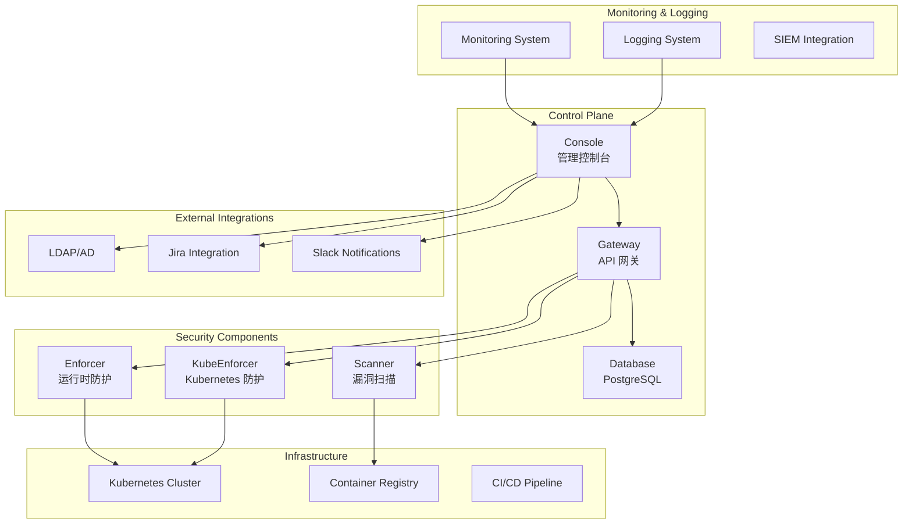

# Aqua Security Enterprise Container Security Platform

## 概述 (Overview)

Aqua Security 是企业级容器安全平台，提供从镜像构建到运行时的全生命周期安全防护。本文档详细介绍 Aqua 企业级部署架构、安全策略管理和合规性保障实践。

Aqua Security is an enterprise-grade container security platform that provides full lifecycle security protection from image build to runtime. This document details Aqua enterprise deployment architecture, security policy management, and compliance assurance practices.

## 架构设计 (Architecture Design)

### 企业级架构 (Enterprise Architecture)

```yaml
# Aqua Security 企业级部署架构
apiVersion: v1
kind: Namespace
metadata:
  name: aqua-system
---
apiVersion: v1
kind: ConfigMap
metadata:
  name: aqua-config
  namespace: aqua-system
data:
  aqua.conf: |
    {
      "version": "6.5",
      "console":
      {
        "port": 443,
        "tls": true,
        "certificate": "/etc/aqua/certs/tls.crt",
        "key": "/etc/aqua/certs/tls.key"
      },
      "database":
      {
        "type": "postgres",
        "host": "postgresql-aqua.aqua-system.svc.cluster.local",
        "port": 5432,
        "name": "aqua",
        "username": "aqua",
        "sslmode": "require"
      },
      "gateway":
      {
        "port": 8443,
        "tls": true
      },
      "enforcer":
      {
        "image_assurance": true,
        "runtime_protection": true,
        "network_protection": true,
        "host_protection": true
      },
      "scanner":
      {
        "concurrent_scans": 5,
        "scan_timeout": 3600,
        "vulnerability_feed_url": "https://updates.aquasec.com/security-feed"
      }
    }
```

### 安全架构 (Security Architecture)



## 部署配置 (Deployment Configuration)

### Kubernetes 部署 (Kubernetes Deployment)

```yaml
# Aqua Console 部署
apiVersion: apps/v1
kind: StatefulSet
metadata:
  name: aqua-console
  namespace: aqua-system
spec:
  serviceName: aqua-console
  replicas: 1
  selector:
    matchLabels:
      app: aqua-console
  template:
    metadata:
      labels:
        app: aqua-console
    spec:
      containers:
      - name: console
        image: registry.aquasec.com/console:6.5.21032
        env:
        - name: SCALOCK_DBUSER
          value: "aqua"
        - name: SCALOCK_DBPASSWORD
          valueFrom:
            secretKeyRef:
              name: aqua-db-secret
              key: password
        - name: SCALOCK_DBNAME
          value: "aqua"
        - name: SCALOCK_DBHOST
          value: "postgresql-aqua.aqua-system.svc.cluster.local"
        - name: SCALOCK_DBPORT
          value: "5432"
        - name: ADMIN_PASSWORD
          valueFrom:
            secretKeyRef:
              name: aqua-admin-secret
              key: password
        - name: BATCH_INSTALL_GATEWAY
          value: "true"
        - name: BATCH_INSTALL_ENFORCER
          value: "true"
        ports:
        - containerPort: 443
          name: https
        - containerPort: 8080
          name: http
        volumeMounts:
        - name: config
          mountPath: /etc/aqua
        - name: certs
          mountPath: /etc/aqua/certs
        - name: logs
          mountPath: /var/log/aqua
        readinessProbe:
          httpGet:
            path: /healthz
            port: 8080
          initialDelaySeconds: 60
          periodSeconds: 10
        livenessProbe:
          httpGet:
            path: /healthz
            port: 8080
          initialDelaySeconds: 120
          periodSeconds: 30
        resources:
          requests:
            cpu: "1"
            memory: "2Gi"
          limits:
            cpu: "2"
            memory: "4Gi"
          
      volumes:
      - name: config
        configMap:
          name: aqua-config
      - name: certs
        secret:
          secretName: aqua-console-certs
      - name: logs
        emptyDir: {}
---
# Aqua Database 部署
apiVersion: apps/v1
kind: StatefulSet
metadata:
  name: postgresql-aqua
  namespace: aqua-system
spec:
  serviceName: postgresql-aqua
  replicas: 1
  selector:
    matchLabels:
      app: postgresql-aqua
  template:
    metadata:
      labels:
        app: postgresql-aqua
    spec:
      containers:
      - name: postgresql
        image: postgres:13.4
        env:
        - name: POSTGRES_DB
          value: "aqua"
        - name: POSTGRES_USER
          value: "aqua"
        - name: POSTGRES_PASSWORD
          valueFrom:
            secretKeyRef:
              name: aqua-db-secret
              key: password
        ports:
        - containerPort: 5432
        volumeMounts:
        - name: data
          mountPath: /var/lib/postgresql/data
        resources:
          requests:
            cpu: "500m"
            memory: "1Gi"
          limits:
            cpu: "1"
            memory: "2Gi"
  volumeClaimTemplates:
  - metadata:
      name: data
    spec:
      accessModes: ["ReadWriteOnce"]
      storageClassName: fast-ssd
      resources:
        requests:
          storage: 50Gi
```

### Enforcer 配置 (Enforcer Configuration)

```yaml
# Aqua Enforcer DaemonSet
apiVersion: apps/v1
kind: DaemonSet
metadata:
  name: aqua-enforcer
  namespace: aqua-system
spec:
  selector:
    matchLabels:
      app: aqua-enforcer
  template:
    metadata:
      labels:
        app: aqua-enforcer
    spec:
      hostPID: true
      hostIPC: true
      hostNetwork: true
      dnsPolicy: ClusterFirstWithHostNet
      containers:
      - name: enforcer
        image: registry.aquasec.com/enforcer:6.5.21032
        env:
        - name: AQUA_TOKEN
          valueFrom:
            secretKeyRef:
              name: aqua-enforcer-token
              key: token
        - name: AQUA_SERVER
          value: "aqua-gateway.aqua-system.svc.cluster.local:8443"
        - name: AQUA_TLS_VERIFY
          value: "false"
        securityContext:
          privileged: true
        volumeMounts:
        - name: var-run
          mountPath: /var/run
        - name: dev
          mountPath: /dev
        - name: sys
          mountPath: /sys
        - name: etc
          mountPath: /etc
        - name: aqua-tmp
          mountPath: /tmp/aqua
        - name: aqua-data
          mountPath: /data
        resources:
          requests:
            cpu: "100m"
            memory: "256Mi"
          limits:
            cpu: "500m"
            memory: "1Gi"
      volumes:
      - name: var-run
        hostPath:
          path: /var/run
      - name: dev
        hostPath:
          path: /dev
      - name: sys
        hostPath:
          path: /sys
      - name: etc
        hostPath:
          path: /etc
      - name: aqua-tmp
        hostPath:
          path: /tmp/aqua
          type: DirectoryOrCreate
      - name: aqua-data
        hostPath:
          path: /var/lib/aqua
          type: DirectoryOrCreate
```

## 安全策略管理 (Security Policy Management)

### 镜像安全策略 (Image Security Policy)

```yaml
# 镜像安全策略配置
apiVersion: v1
kind: ConfigMap
metadata:
  name: image-security-policies
  namespace: aqua-system
data:
  critical-vulnerabilities.yaml: |
    name: "Block Critical Vulnerabilities"
    description: "Block images with critical vulnerabilities"
    enabled: true
    enforcement_action: "block"
    criteria:
      - type: vulnerability
        severity: CRITICAL
        action: block
        max_age: 30d
        
  high-vulnerabilities.yaml: |
    name: "Alert High Vulnerabilities"
    description: "Alert on images with high vulnerabilities"
    enabled: true
    enforcement_action: "alert"
    criteria:
      - type: vulnerability
        severity: HIGH
        action: alert
        max_age: 7d
        
  malware-detection.yaml: |
    name: "Malware Detection"
    description: "Detect and block malicious content"
    enabled: true
    enforcement_action: "block"
    criteria:
      - type: malware
        action: block
        
  license-compliance.yaml: |
    name: "License Compliance"
    description: "Ensure license compliance"
    enabled: true
    enforcement_action: "alert"
    criteria:
      - type: license
        blacklisted:
          - GPL
          - AGPL
        action: alert
```

### 运行时安全策略 (Runtime Security Policy)

```yaml
# 运行时安全策略
runtime_policies:
  container_escape_prevention:
    name: "Prevent Container Escapes"
    description: "Prevent container escape techniques"
    enabled: true
    rules:
      - name: "Block Privileged Containers"
        condition: "container.privileged == true"
        action: "block"
        
      - name: "Block Host PID Namespace"
        condition: "container.host_pid == true"
        action: "block"
        
      - name: "Block Host Network Access"
        condition: "container.host_network == true"
        action: "block"
        
      - name: "Restrict Capabilities"
        condition: "container.capabilities.add contains 'SYS_ADMIN'"
        action: "block"

  network_security:
    name: "Network Security Controls"
    description: "Control network communications"
    enabled: true
    rules:
      - name: "Block External Connections"
        condition: "network.destination.ip not in ['10.0.0.0/8', '172.16.0.0/12', '192.168.0.0/16']"
        action: "alert"
        
      - name: "Monitor DNS Queries"
        condition: "dns.query contains 'malicious-domain.com'"
        action: "block"

  file_system_protection:
    name: "File System Protection"
    description: "Protect critical file system paths"
    enabled: true
    rules:
      - name: "Protect /etc/passwd"
        condition: "file.path == '/etc/passwd' and file.operation != 'read'"
        action: "block"
        
      - name: "Monitor /tmp Directory"
        condition: "file.path starts with '/tmp/' and file.operation == 'execute'"
        action: "alert"
```

### 应用行为学习 (Application Behavior Learning)

```yaml
# 行为学习配置
behavioral_learning:
  profiles:
    - name: "web-application-profile"
      application: "web-server"
      learning_period: "7d"
      monitored_activities:
        - file_operations:
            paths:
              - "/var/www/html"
              - "/tmp"
            operations: ["read", "write", "execute"]
            
        - network_connections:
            ports: [80, 443, 8080]
            protocols: ["tcp"]
            
        - process_execution:
            allowed_processes:
              - "/usr/sbin/apache2"
              - "/usr/bin/node"
              - "/bin/sh"
              
        - system_calls:
            baseline_calls:
              - "open"
              - "read"
              - "write"
              - "connect"
              - "bind"
              
      anomalies:
        - name: "Unexpected File Access"
          condition: "file.path not in learned_paths"
          severity: "medium"
          action: "alert"
          
        - name: "Suspicious Network Connection"
          condition: "network.destination.port not in learned_ports"
          severity: "high"
          action: "block"
```

## 合规性管理 (Compliance Management)

### 合规性检查 (Compliance Checks)

```yaml
# 合规性框架配置
compliance_frameworks:
  cis_docker_benchmark:
    name: "CIS Docker Benchmark"
    version: "1.6.0"
    enabled: true
    checks:
      - id: "1.1.1"
        description: "Ensure a separate partition for /var/lib/docker has been created"
        remediation: "Create a separate partition for /var/lib/docker"
        severity: "high"
        
      - id: "2.1"
        description: "Ensure network traffic is restricted between containers on the default bridge"
        remediation: "Configure iptables rules to restrict inter-container communication"
        severity: "medium"
        
      - id: "4.1"
        description: "Ensure a user for the container has been created"
        remediation: "Create a non-root user in the container image"
        severity: "high"

  nist_csf:
    name: "NIST Cybersecurity Framework"
    version: "1.1"
    enabled: true
    controls:
      - id: "PR.AC-3"
        description: "Access enforcement - Control network access to privileged functions"
        implementation: "Aqua Enforcer network controls"
        
      - id: "DE.CM-1"
        description: "Event detection - Establish and maintain detection capabilities"
        implementation: "Aqua runtime monitoring and alerts"

  pci_dss:
    name: "PCI DSS"
    version: "4.0"
    enabled: true
    requirements:
      - id: "2.2"
        description: "Develop configuration standards for all system components"
        implementation: "Aqua security policies and baselines"
        
      - id: "10.2"
        description: "Implement automated audit trails for all system components"
        implementation: "Aqua logging and monitoring"
```

### 合规性报告 (Compliance Reporting)

```python
# 合规性报告生成器
import json
from datetime import datetime, timedelta
from typing import Dict, List, Any

class ComplianceReporter:
    def __init__(self, aqua_client):
        self.client = aqua_client
        self.report_period = timedelta(days=30)
        
    def generate_compliance_report(self, framework: str) -> Dict[str, Any]:
        """生成合规性报告"""
        report = {
            "framework": framework,
            "generated_at": datetime.now().isoformat(),
            "period_start": (datetime.now() - self.report_period).isoformat(),
            "period_end": datetime.now().isoformat(),
            "summary": {},
            "details": {},
            "recommendations": []
        }
        
        # 获取合规性统计数据
        compliance_stats = self.client.get_compliance_statistics(framework)
        report["summary"] = {
            "total_checks": compliance_stats["total"],
            "passed_checks": compliance_stats["passed"],
            "failed_checks": compliance_stats["failed"],
            "compliance_percentage": compliance_stats["percentage"]
        }
        
        # 获取详细的合规性检查结果
        detailed_results = self.client.get_compliance_details(framework)
        report["details"] = detailed_results
        
        # 生成改进建议
        report["recommendations"] = self._generate_recommendations(detailed_results)
        
        return report
    
    def _generate_recommendations(self, compliance_results: Dict) -> List[str]:
        """基于合规性结果生成建议"""
        recommendations = []
        
        failed_checks = [check for check in compliance_results.get("checks", []) 
                        if check["status"] == "failed"]
        
        for check in failed_checks:
            if check["severity"] == "critical":
                recommendations.append(f"立即修复关键合规性问题: {check['description']}")
            elif check["severity"] == "high":
                recommendations.append(f"优先处理高风险合规性问题: {check['description']}")
                
        return recommendations
    
    def export_report(self, report: Dict[str, Any], format: str = "json") -> str:
        """导出报告"""
        if format.lower() == "json":
            return json.dumps(report, indent=2)
        elif format.lower() == "html":
            return self._generate_html_report(report)
        else:
            raise ValueError(f"Unsupported format: {format}")

# 使用示例
reporter = ComplianceReporter(aqua_api_client)
cis_report = reporter.generate_compliance_report("cis_docker_benchmark")
print(reporter.export_report(cis_report))
```

## 集成与自动化 (Integration and Automation)

### CI/CD 集成 (CI/CD Integration)

```yaml
# Jenkins Pipeline 集成示例
pipeline {
    agent any
    
    environment {
        AQUA_SERVER = 'https://aqua-console.example.com'
        AQUA_USER = credentials('aqua-username')
        AQUA_PASSWORD = credentials('aqua-password')
    }
    
    stages {
        stage('Build') {
            steps {
                sh 'docker build -t my-app:${BUILD_NUMBER} .'
            }
        }
        
        stage('Aqua Security Scan') {
            steps {
                script {
                    // 执行 Aqua 镜像扫描
                    sh """
                    curl -u ${AQUA_USER}:${AQUA_PASSWORD} \
                      -X POST "${AQUA_SERVER}/api/v2/images/my-app:${BUILD_NUMBER}/scan" \
                      -H "Content-Type: application/json" \
                      -d '{"registry":"docker.io","repository":"my-app","tag":"${BUILD_NUMBER}"}'
                    """
                    
                    // 等待扫描完成并获取结果
                    def scan_result = sh(
                        script: """
                        curl -s -u ${AQUA_USER}:${AQUA_PASSWORD} \
                          "${AQUA_SERVER}/api/v2/images/my-app:${BUILD_NUMBER}" | \
                        jq -r '.scan_result.status'
                        """,
                        returnStdout: true
                    ).trim()
                    
                    if (scan_result != "pass") {
                        error "Security scan failed with status: ${scan_result}"
                    }
                }
            }
        }
        
        stage('Deploy') {
            steps {
                sh 'kubectl set image deployment/my-app my-app=my-app:${BUILD_NUMBER}'
            }
        }
    }
}
```

### Kubernetes Admission Controller (Kubernetes 准入控制器)

```yaml
# Aqua KubeEnforcer 配置
apiVersion: admissionregistration.k8s.io/v1
kind: ValidatingWebhookConfiguration
metadata:
  name: aqua-kubeenforcer
webhooks:
- name: imageassurance.aquasec.com
  clientConfig:
    service:
      name: aqua-kubeenforcer
      namespace: aqua-system
      path: "/validate"
    caBundle: ${CA_BUNDLE}
  rules:
  - apiGroups: [""]
    apiVersions: ["v1"]
    operations: ["CREATE", "UPDATE"]
    resources: ["pods"]
  admissionReviewVersions: ["v1", "v1beta1"]
  sideEffects: None
  timeoutSeconds: 30
---
# KubeEnforcer 部署
apiVersion: apps/v1
kind: Deployment
metadata:
  name: aqua-kubeenforcer
  namespace: aqua-system
spec:
  replicas: 2
  selector:
    matchLabels:
      app: aqua-kubeenforcer
  template:
    metadata:
      labels:
        app: aqua-kubeenforcer
    spec:
      containers:
      - name: kube-enforcer
        image: registry.aquasec.com/kube-enforcer:6.5.21032
        env:
        - name: AQUA_TOKEN
          valueFrom:
            secretKeyRef:
              name: aqua-kubeenforcer-token
              key: token
        - name: AQUA_SERVER
          value: "aqua-gateway.aqua-system.svc.cluster.local:8443"
        ports:
        - containerPort: 8443
        volumeMounts:
        - name: certs
          mountPath: /etc/aqua/certs
        resources:
          requests:
            cpu: "200m"
            memory: "512Mi"
          limits:
            cpu: "1"
            memory: "2Gi"
      volumes:
      - name: certs
        secret:
          secretName: aqua-kubeenforcer-certs
```

## 监控告警 (Monitoring and Alerting)

### 关键指标监控 (Key Metrics Monitoring)

```yaml
# Prometheus 监控规则
groups:
- name: aqua-security.rules
  rules:
  # 安全事件监控
  - alert: AquaCriticalVulnerabilities
    expr: aqua_vulnerabilities_total{severity="critical"} > 0
    for: 5m
    labels:
      severity: critical
    annotations:
      summary: "Critical vulnerabilities detected"
      description: "Found {{ $value }} critical vulnerabilities in scanned images."

  # 运行时攻击监控
  - alert: AquaRuntimeAttacks
    expr: increase(aqua_runtime_attacks_total[5m]) > 0
    for: 1m
    labels:
      severity: critical
    annotations:
      summary: "Runtime attacks detected"
      description: "Detected {{ $value }} runtime attacks in the last 5 minutes."

  # 合规性违规监控
  - alert: AquaComplianceViolations
    expr: aqua_compliance_violations_total > 0
    for: 10m
    labels:
      severity: warning
    annotations:
      summary: "Compliance violations detected"
      description: "Found {{ $value }} compliance violations."

  # 服务健康监控
  - alert: AquaConsoleDown
    expr: up{job="aqua-console"} == 0
    for: 5m
    labels:
      severity: critical
    annotations:
      summary: "Aqua Console is down"
      description: "Aqua Console service is unavailable."

  # 扫描队列积压监控
  - alert: AquaScanQueueBacklog
    expr: aqua_scan_queue_length > 50
    for: 15m
    labels:
      severity: warning
    annotations:
      summary: "High scan queue backlog"
      description: "Scan queue has {{ $value }} pending items."
```

### 仪表板配置 (Dashboard Configuration)

```json
{
  "dashboard": {
    "title": "Aqua Security Enterprise Dashboard",
    "panels": [
      {
        "title": "Vulnerability Overview",
        "type": "piechart",
        "targets": [
          {
            "expr": "aqua_vulnerabilities_total",
            "legendFormat": "{{severity}}"
          }
        ]
      },
      {
        "title": "Runtime Security Events",
        "type": "graph",
        "targets": [
          {
            "expr": "rate(aqua_runtime_events_total[5m])",
            "legendFormat": "{{event_type}}"
          }
        ]
      },
      {
        "title": "Compliance Score",
        "type": "gauge",
        "targets": [
          {
            "expr": "aqua_compliance_score",
            "legendFormat": "Compliance %"
          }
        ]
      },
      {
        "title": "Active Enforcers",
        "type": "stat",
        "targets": [
          {
            "expr": "count(aqua_enforcer_status == 1)",
            "legendFormat": "Healthy Enforcers"
          }
        ]
      }
    ]
  }
}
```

## 故障排除 (Troubleshooting)

### 常见问题诊断 (Common Issue Diagnosis)

```bash
#!/bin/bash
# Aqua Security 故障排除工具

# 系统健康检查
check_aqua_health() {
    echo "=== Aqua System Health Check ==="
    
    # 检查 Console 状态
    kubectl get pods -n aqua-system -l app=aqua-console
    echo ""
    
    # 检查 Enforcer 状态
    kubectl get daemonsets -n aqua-system aqua-enforcer
    echo ""
    
    # 检查 KubeEnforcer 状态
    kubectl get deployments -n aqua-system aqua-kubeenforcer
    echo ""
    
    # 检查数据库连接
    kubectl exec -n aqua-system sts/postgresql-aqua -- \
      pg_isready -h localhost -p 5432
}

# 安全日志分析
analyze_security_logs() {
    echo "=== Security Log Analysis ==="
    
    # 检查最近的安全事件
    kubectl logs -n aqua-system -l app=aqua-console --since=1h | \
      grep -i "security\|vulnerability\|attack" | \
      tail -20
    echo ""
    
    # 检查扫描失败记录
    kubectl logs -n aqua-system -l app=aqua-console --since=1h | \
      grep -i "scan.*failed" | \
      tail -10
}

# 性能诊断
performance_diagnostics() {
    echo "=== Performance Diagnostics ==="
    
    # 检查资源使用情况
    kubectl top pods -n aqua-system
    echo ""
    
    # 检查扫描队列长度
    kubectl exec -n aqua-system deploy/aqua-console -- \
      curl -s "http://localhost:8080/api/v1/scans/queue" | \
      jq '.length'
    echo ""
    
    # 检查数据库性能
    kubectl exec -n aqua-system sts/postgresql-aqua -- \
      psql -U aqua -d aqua -c "SELECT * FROM pg_stat_activity WHERE state = 'active';"
}
```

## 最佳实践 (Best Practices)

### 安全部署最佳实践 (Security Deployment Best Practices)

1. **网络隔离**
   ```yaml
   network_policies:
     - name: "aqua-console-isolation"
       namespace: aqua-system
       policy_types: ["Ingress", "Egress"]
       ingress:
         - from:
             - namespaceSelector:
                 matchLabels:
                   name: monitoring
         - ports:
             - protocol: TCP
               port: 443
       egress:
         - to:
             - namespaceSelector:
                 matchLabels:
                   name: kube-system
         - ports:
             - protocol: TCP
               port: 5432
   ```

2. **资源限制**
   ```yaml
   resources:
     requests:
       cpu: "500m"
       memory: "1Gi"
     limits:
       cpu: "2"
       memory: "4Gi"
   ```

3. **安全配置**
   ```yaml
   securityContext:
     runAsNonRoot: true
     runAsUser: 1000
     fsGroup: 2000
   ```

### 运维最佳实践 (Operations Best Practices)

1. **监控覆盖**
   - 安全事件实时监控
   - 合规性状态跟踪
   - 系统健康检查
   - 性能指标监控

2. **备份策略**
   ```bash
   # 数据库备份脚本
   BACKUP_DIR="/backup/aqua"
   DATE=$(date +%Y%m%d_%H%M%S)
   
   # 备份数据库
   kubectl exec -n aqua-system sts/postgresql-aqua -- \
     pg_dump -U aqua aqua > ${BACKUP_DIR}/aqua_backup_${DATE}.sql
   
   # 备份配置
   kubectl get configmaps -n aqua-system -o yaml > ${BACKUP_DIR}/aqua_config_${DATE}.yaml
   ```

3. **定期维护**
   - 漏洞数据库更新
   - 安全策略审查
   - 合规性检查
   - 系统性能优化

---

**文档版本**: v1.0  
**最后更新**: 2024年  
**适用版本**: Aqua Security 6.5+