# 容器镜像安全扫描深度实践

> **Author**: Cloud Native Security Architect | **Version**: v1.0 | **Update Time**: 2026-05-18
> **Scenario**: Container image security scanning, SBOM, and supply chain verification | **Complexity**: ⭐⭐⭐⭐

## 概述

容器镜像是云原生应用交付的基本单元，其安全性直接决定了运行时安全基线。据 Sysdig 2025 容器安全报告统计，生产环境中超过 75% 的镜像包含已知漏洞，其中约 10% 属于严重级别。镜像安全扫描是 DevSecOps 流程中的关键环节，通过在构建、存储和部署阶段持续检测漏洞、恶意代码和配置问题，建立从代码到运行的完整安全屏障。

本文深入探讨镜像安全扫描的完整技术栈，包括 Trivy 和 Grype 漏洞扫描工具、SBOM（软件物料清单）生成与管理、Cosign 镜像签名验证，以及基于准入控制器的自动安全门禁，帮助企业在 CI/CD 管道和 Kubernetes 集群中构建端到端的镜像安全防护体系。

### 威胁模型分析

**已知漏洞利用**：基础镜像和依赖包中的已知 CVE 是最常见的攻击面。攻击者利用公开披露的漏洞实现远程代码执行、权限提升或数据泄露。镜像扫描通过比对 CVE 数据库识别已知漏洞，并根据严重程度提供修复建议。

**供应链投毒**：攻击者在公共 Registry 或 npm/PyPI 等包管理器中发布恶意包，通过拼写错误（typosquatting）、依赖混淆（dependency confusion）等方式诱导开发者引入。SBOM 和镜像签名验证可帮助检测和防范此类攻击。

**配置缺陷**：镜像中以 root 用户运行、包含不必要的 setuid 二进制文件、暴露 SSH 服务、使用最新标签（latest）等配置问题增加了攻击面。安全策略可自动检测这些配置缺陷。

**敏感信息泄露**：开发人员在镜像中意外包含 API 密钥、数据库密码或 TLS 证书等敏感信息。密钥扫描工具可在构建阶段检测并阻止这类问题。

**镜像篡改**：在镜像传输过程中，中间人攻击者可能替换镜像内容。镜像签名和摘要验证确保镜像从构建到运行的完整性。

## 架构设计

### 镜像安全全生命周期架构

```mermaid
graph LR
    subgraph "Build Phase"
        SRC[Source Code] --> BUILD[CI/CD Build]
        BUILD --> SCAN1[Trivy/Grype 扫描]
        SCAN1 --> SBOM[SBOM 生成]
        SBOM --> SIGN[Cosign 签名]
    end

    subgraph "Registry Phase"
        SIGN --> PUSH[推送到 Registry]
        PUSH --> RSCAN[Registry 扫描]
        RSCAN --> STORE[镜像存储]
    end

    subgraph "Deploy Phase"
        STORE --> PULL[K8s 拉取镜像]
        PULL --> VERIFY[签名验证]
        VERIFY --> ADMIT[准入控制]
        ADMIT --> RUN[容器运行]
    end

    subgraph "Continuous Monitoring"
        RUN --> FSCAN[运行时扫描]
        FSCAN --> CVE[CVE 数据库]
        CVE --> ALERT[告警通知]
    end
```



### 技术栈总览

```yaml
image_security_stack:
  vulnerability_scanning:
    - trivy: "全面的漏洞/配置/密钥扫描"
    - grype: "Anchore 出品，SBOM 驱动"
    - clair: "Quay Registry 集成扫描"
    - snyk: "商业方案，IDE 集成"

  sbom_generation:
    - syft: "Anchore SBOM 生成工具"
    - trivy_sbom: "Trivy 内置 SBOM 功能"
    - cyclonedx_bom: "CycloneDX 多语言插件"

  image_signing:
    - cosign: "Sigstore 镜像签名工具"
    - notation: "Notary v2 签名方案"
    - skopeo: "镜像传输和验证"

  admission_control:
    - kyverno_verifyImages: "Kyverno 镜像验证"
    - gatekeeper_external_data: "Gatekeeper 外部数据"
    - cosigned: "Sigstore 准入控制器"
    - trivy_operator: "Trivy K8s Operator"

  compliance:
    - cis_benchmark: "CIS Docker/K8s 基准"
    - nist_sbom: "NIST SBOM 要求"
    - executive_order: "美国 EO 14028 SBOM 要求"
```

## 核心配置

### Trivy 全面扫描配置

Trivy 是目前最流行的开源容器漏洞扫描工具，支持漏洞检测、配置审计、密钥扫描和 SBOM 生成等多种功能。以下配置展示了 Trivy 在生产环境中的完整使用方式：

```yaml
# trivy.yaml - Trivy 配置文件
cache:
  backend: "redis"
  redis:
    addr: "redis:6370"
    password: "${REDIS_PASSWORD}"

db:
  skip_update: false

severity:
  - CRITICAL
  - HIGH

vulnerability:
  type:
    - os
    - library
  ignore_unfixed: false

scan:
  remove_tmp_files: true
  offline_scan: false

server:
  addr: "https://trivy-server.trivy.svc.cluster.local:4954"

registries:
  - name: "registry.company.com"
    username: "${REGISTRY_USER}"
    password: "${REGISTRY_PASSWORD}"
```

```bash
#!/bin/bash
# trivy_comprehensive_scan.sh

IMAGE="registry.company.com/myapp:v1.2.3"
REPORT_DIR="/tmp/trivy-reports"
DATE=$(date +%Y%m%d_%H%M%S)
mkdir -p "$REPORT_DIR/$DATE"

# 1. 漏洞扫描 - JSON 格式
trivy image --format json --output "$REPORT_DIR/$DATE/vulns.json" "$IMAGE"

# 2. 漏洞扫描 - 表格格式（终端可读）
trivy image --format table --severity CRITICAL,HIGH "$IMAGE"

# 3. 仅扫描严重漏洞并设置退出码
trivy image --severity CRITICAL --exit-code 1 "$IMAGE"

# 4. SBOM 生成 (CycloneDX 格式)
trivy image --format cyclonedx --output "$REPORT_DIR/$DATE/sbom.json" "$IMAGE"

# 5. 配置审计 (Dockerfile / K8s manifests)
trivy config --format json --output "$REPORT_DIR/$DATE/config-audit.json" ./kubernetes/

# 6. 密钥扫描
trivy image --scanners secret --format json --output "$REPORT_DIR/$DATE/secrets.json" "$IMAGE"

# 7. 使用 Trivy Server 模式（共享漏洞数据库）
trivy image --server "https://trivy-server.trivy.svc:4954" "$IMAGE"

# 8. 忽略特定 CVE
trivy image --ignorefile .trivyignore "$IMAGE"
```

```
# .trivyignore
# 已知误报或已接受的漏洞
CVE-2023-XXXXX
CVE-2024-XXXXX
```

### Trivy Operator (Kubernetes 集成)

Trivy Operator 以 Kubernetes Operator 形式运行，自动扫描集群中的镜像并生成 VulnerabilityReport 和 ConfigAuditReport 资源：

```yaml
# values-trivy-operator.yaml
operator:
  replicas: 1
  resources:
    requests:
      cpu: 100m
      memory: 256Mi
    limits:
      cpu: 500m
      memory: 1Gi

  scanner:
    scanJobTimeout: 300s
    scanJobsConcurrentLimit: 5

trivy:
  repository: ghcr.io/aquasecurity/trivy
  tag: 0.60.0
  mode: ClientServer
  serverURL: "https://trivy-server.trivy.svc:4954"

  resources:
    requests:
      cpu: 100m
      memory: 256Mi
    limits:
      cpu: 500m
      memory: 1Gi

  severity: CRITICAL,HIGH

compliance:
  reportType: all
  cron: "0 6 * * *"

serviceMonitor:
  enabled: true
  interval: 30s
```

```bash
# 安装 Trivy Operator
helm repo add aqua https://aquasecurity.github.io/helm-charts
helm repo update

helm install trivy-operator aqua/trivy-operator \
  --namespace trivy-system \
  --create-namespace \
  --values values-trivy-operator.yaml

# 查看漏洞报告
kubectl get vulnerabilityreports --all-namespaces
kubectl get configauditreports --all-namespaces

# 查看特定工作负载的漏洞
kubectl get vulnerabilityreport \
  -l app.kubernetes.io/name=myapp \
  -o jsonpath='{.items[0].report.summary}'

# 查看合规报告
kubectl get compliance.report -o yaml
```

### Grype 扫描配置

Grype 是 Anchore 公司开发的漏洞扫描工具，以 SBOM 为驱动进行漏洞匹配，与 Syft SBOM 生成工具配合使用：

```bash
#!/bin/bash
# grype_scan_workflow.sh

IMAGE="registry.company.com/myapp:v1.2.3"

# 1. 使用 Syft 生成 SBOM
syft "$IMAGE" -o cyclonedx-json > sbom.json
syft "$IMAGE" -o spdx-json > sbom-spdx.json

# 2. 基于 SBOM 扫描漏洞
grype sbom:./sbom.json --fail-on high

# 3. 直接扫描镜像
grype "$IMAGE" --severity critical,high

# 4. 输出 SARIF 格式（GitHub 集成）
grype "$IMAGE" -o sarif > grype-results.sarif

# 5. 使用自定义忽略规则
grype "$IMAGE" --ignore-file .grypeignore

# 6. 输出 JSON 报告
grype "$IMAGE" -o json > grype-report.json
```

```yaml
# .grypeignore
# 已接受的风险 CVE
CVE-2023-XXXXX
CVE-2024-XXXXX
```

### SBOM 生成与管理

SBOM（Software Bill of Materials）是软件组成成分的完整清单，记录了镜像中包含的所有软件包、版本和依赖关系。SBOM 对于漏洞管理、许可证合规和供应链安全至关重要：

```bash
#!/bin/bash
# sbom_management.sh

IMAGE="registry.company.com/myapp:v1.2.3"

# Syft: 生成多种格式 SBOM
syft "$IMAGE" -o cyclonedx-json > sbom-cyclonedx.json
syft "$IMAGE" -o spdx-json > sbom-spdx.json
syft "$IMAGE" -o syft-json > sbom-syft.json

# Trivy: 生成 CycloneDX SBOM
trivy image --format cyclonedx "$IMAGE" > trivy-sbom.json

# 验证 SBOM 完整性
syft convert sbom-cyclonedx.json -o syft-json | jq '.artifacts | length'

# 将 SBOM 附加到镜像 (OCI 兼容 Registry)
cosign attach sbom --sbom sbom-cyclonedx.json "$IMAGE"

# 验证附加的 SBOM
cosign download sbom "$IMAGE"
```

```yaml
# sbom-policy.yaml - Kyverno 策略要求 SBOM
apiVersion: kyverno.io/v1
kind: ClusterPolicy
metadata:
  name: require-sbom
  annotations:
    policies.kyverno.io/title: Require SBOM
    policies.kyverno.io/category: Supply Chain
spec:
  validationFailureAction: Audit
  background: false
  rules:
    - name: check-sbom-attached
      match:
        any:
          - resources:
              kinds:
                - Pod
      verifyImages:
        - imageReferences:
            - "registry.company.com/*"
          attestors:
            - entries:
                - keys:
                    publicKeys: |-
                      -----BEGIN PUBLIC KEY-----
                      MFkwEwYHKoZIzj0CAQYIKoZIzj0DAQcDQgAE...
                      -----END PUBLIC KEY-----
          attestations:
            - type: https://cyclonedx.org/bom
              conditions:
                - all:
                    - key: "{{ components[].name }}"
                      operator: NotEquals
                      value: ""
```

## 安全策略实战

### Cosign 镜像签名与验证

Cosign 是 Sigstore 项目提供的容器镜像签名工具，支持密钥对签名和 Keyless 签名（基于 OIDC 身份和 Rekor 透明日志），实现镜像来源验证和完整性保护：

```bash
#!/bin/bash
# cosign_signing_workflow.sh

IMAGE="registry.company.com/myapp:v1.2.3"

# ===== 方式 1: 密钥对签名 =====

# 生成签名密钥对
cosign generate-key-pair

# 签名镜像
cosign sign --key cosign.key "$IMAGE"

# 验证签名
cosign verify --key cosign.pub "$IMAGE"

# ===== 方式 2: Keyless 签名 (CI/CD 集成) =====

# 使用 GitHub Actions OIDC 身份签名
export COSIGN_EXPERIMENTAL=1
cosign sign "$IMAGE"

# Keyless 验证
cosign verify "$IMAGE" \
  --certificate-identity-regexp="https://github.com/company/.*" \
  --certificate-oidc-issuer="https://token.actions.githubusercontent.com"

# ===== 签名附带证明 (Attestation) =====

# 附加 SBOM 证明
cosign attest --predicate sbom-cyclonedx.json \
  --type cyclonedx "$IMAGE"

# 附加漏洞扫描结果
cosign attest --predicate trivy-results.json \
  --type vuln "$IMAGE"

# 附加 SLSA 证明
cosign attest --predicate slsa-provenance.json \
  --type slsaprovenance "$IMAGE"

# 验证证明
cosign verify-attestation --type cyclonedx "$IMAGE"
cosign verify-attestation --type vuln "$IMAGE"

# ===== 签名附件管理 =====

# 查看镜像所有签名和附件
cosign tree "$IMAGE"

# 复制签名到另一 Registry
cosign copy "$IMAGE" "harbor.company.com/myapp:v1.2.3"
```

### CI/CD 管道集成

```yaml
# .github/workflows/image-security.yml
name: Image Security Pipeline

on:
  push:
    branches: [main]
    paths:
      - 'Dockerfile'
      - 'src/**'
      - 'pom.xml'

env:
  REGISTRY: registry.company.com
  IMAGE_NAME: myapp

jobs:
  build-and-scan:
    runs-on: ubuntu-latest
    permissions:
      id-token: write
      packages: write
      security-events: write

    steps:
      - uses: actions/checkout@v4

      - name: Build Image
        run: |
          docker build -t ${{ env.REGISTRY }}/${{ env.IMAGE_NAME }}:${{ github.sha }} .

      - name: Trivy Vulnerability Scan
        uses: aquasecurity/trivy-action@master
        with:
          image-ref: '${{ env.REGISTRY }}/${{ env.IMAGE_NAME }}:${{ github.sha }}'
          format: 'sarif'
          output: 'trivy-results.sarif'
          severity: 'CRITICAL,HIGH'
          exit-code: '1'

      - name: Trivy Secret Scan
        uses: aquasecurity/trivy-action@master
        with:
          image-ref: '${{ env.REGISTRY }}/${{ env.IMAGE_NAME }}:${{ github.sha }}'
          scanners: 'secret'
          format: 'json'
          output: 'secret-results.json'
          severity: 'CRITICAL,HIGH'
          exit-code: '1'

      - name: Generate SBOM
        uses: anchore/sbom-action@v0
        with:
          image: '${{ env.REGISTRY }}/${{ env.IMAGE_NAME }}:${{ github.sha }}'
          format: cyclonedx-json
          output-file: sbom.json

      - name: Grype Vulnerability Scan
        uses: anchore/scan-action@v3
        with:
          image: '${{ env.REGISTRY }}/${{ env.IMAGE_NAME }}:${{ github.sha }}'
          fail-build: true
          severity-cutoff: high

      - name: Push Image
        run: |
          docker push ${{ env.REGISTRY }}/${{ env.IMAGE_NAME }}:${{ github.sha }}

      - name: Sign Image with Cosign
        uses: sigstore/cosign-installer@v3
      - run: |
          cosign sign --yes \
            ${{ env.REGISTRY }}/${{ env.IMAGE_NAME }}:${{ github.sha }}

      - name: Attach SBOM
        run: |
          cosign attest --yes \
            --predicate sbom.json \
            --type cyclonedx \
            ${{ env.REGISTRY }}/${{ env.IMAGE_NAME }}:${{ github.sha }}

      - name: Upload SARIF Results
        uses: github/codeql-action/upload-sarif@v3
        if: always()
        with:
          sarif_file: 'trivy-results.sarif'
```

### Kubernetes 准入控制

基于签名验证的准入控制确保只有经过签名和验证的镜像才能部署到集群中。以下展示使用 Kyverno 和 Trivy Operator 实现的安全门禁：

```yaml
# Kyverno: 强制镜像签名验证
apiVersion: kyverno.io/v1
kind: ClusterPolicy
metadata:
  name: verify-image-signatures
  annotations:
    policies.kyverno.io/title: Verify Image Signatures
    policies.kyverno.io/category: Supply Chain Security
    policies.kyverno.io/severity: critical
spec:
  validationFailureAction: Enforce
  background: false
  webhookTimeoutSeconds: 30
  failurePolicy: Fail
  rules:
    - name: verify-company-images
      match:
        any:
          - resources:
              kinds:
                - Pod
      verifyImages:
        - imageReferences:
            - "registry.company.com/*"
          mutateDigest: true
          attestors:
            - entries:
                - keyless:
                    subject: "https://github.com/company/app/.github/workflows/build.yml@refs/heads/main"
                    issuer: "https://token.actions.githubusercontent.com"
                    rekor:
                      url: https://rekor.sigstore.dev
        - imageReferences:
            - "harbor.company.com/*"
          mutateDigest: true
          attestors:
            - entries:
                - keys:
                    publicKeys: |-
                      -----BEGIN PUBLIC KEY-----
                      MFkwEwYHKoZIzj0CAQYIKoZIzj0DAQcDQgAE...
                      -----END PUBLIC KEY-----
---
# Kyverno: 禁止 latest 标签
apiVersion: kyverno.io/v1
kind: ClusterPolicy
metadata:
  name: disallow-latest-tag
spec:
  validationFailureAction: Enforce
  background: true
  rules:
    - name: require-version-tag
      match:
        any:
          - resources:
              kinds:
                - Pod
      validate:
        message: "禁止使用 :latest 标签，必须使用明确的版本号或摘要"
        pattern:
          spec:
            containers:
              - image: "!*:latest"
---
# Trivy Operator: 自动扫描策略
apiVersion: aquasecurity.github.io/v1alpha1
kind: ClusterPolicy
metadata:
  name: trivy-auto-scan
spec:
  scanJobsConcurrentLimit: 5
  vulnerabilityScan:
    enabled: true
    scanner: Trivy
    severity: CRITICAL,HIGH
```

## 合规与审计

### 许可证合规扫描

```bash
# Trivy 许可证扫描
trivy image --scanners license --license-full "$IMAGE"

# Syft 许可证报告
syft "$IMAGE" -o cyclonedx-json | jq '.components[] | {name, version, licenses}'

# Grype 许可证过滤
grype "$IMAGE" --only-fixed --severity critical
```

### 合规报告自动化

```bash
#!/bin/bash
# compliance_report.sh

CLUSTER="production-cluster"
REPORT_DATE=$(date +%Y-%m-%d)
REPORT_FILE="/tmp/image-compliance-report-${REPORT_DATE}.md"

echo "# 镜像安全合规报告" > "$REPORT_FILE"
echo "**集群**: $CLUSTER" >> "$REPORT_FILE"
echo "**日期**: $REPORT_DATE" >> "$REPORT_FILE"
echo "" >> "$REPORT_FILE"

echo "## 镜像漏洞摘要" >> "$REPORT_FILE"
kubectl get vulnerabilityreports --all-namespaces -o json | \
  jq -r '.items[] |
    "| \(.metadata.namespace) | \(.report.artifact.repository):\(.report.artifact.tag) |
       \(.report.summary.criticalCount) Critical /
       \(.report.summary.highCount) High |
       \(.report.summary.mediumCount) Medium |
       \(.report.summary.lowCount) Low |"' | \
  sort -t'|' -k3 -rn >> "$REPORT_FILE"

echo "" >> "$REPORT_FILE"
echo "## 未签名镜像" >> "$REPORT_FILE"
kubectl get pods --all-namespaces -o json | \
  jq -r '.items[] | .spec.containers[].image' | sort -u | while read img; do
    if ! cosign verify "$img" 2>/dev/null; then
        echo "- $img (未签名)" >> "$REPORT_FILE"
    fi
done

echo "" >> "$REPORT_FILE"
echo "## 使用 latest 标签的镜像" >> "$REPORT_FILE"
kubectl get pods --all-namespaces -o json | \
  jq -r '.items[] | .spec.containers[] | select(.image | endswith(":latest")) |
    "- \(.image) in \(.metadata.namespace // "unknown")"' >> "$REPORT_FILE"
```

## 监控与告警

### Trivy Operator Prometheus 指标

```yaml
apiVersion: monitoring.coreos.com/v1
kind: PrometheusRule
metadata:
  name: image-security-alerts
  namespace: trivy-system
spec:
  groups:
    - name: image-security.rules
      rules:
        - alert: CriticalVulnerabilityDetected
          expr: trivy_vulnerability_id{severity="Critical"} > 0
          for: 5m
          labels:
            severity: critical
          annotations:
            summary: "镜像中发现严重漏洞"
            description: "镜像 {{ $labels.image }} 中发现严重漏洞 {{ $labels.vuln_id }}"

        - alert: HighVulnerabilityCount
          expr: sum by (namespace, image) (trivy_vulnerability_id{severity="High"}) > 10
          for: 15m
          labels:
            severity: warning
          annotations:
            summary: "镜像高危漏洞数量过多"
            description: "命名空间 {{ $labels.namespace }} 中镜像 {{ $labels.image }} 有 {{ $value }} 个高危漏洞"

        - alert: UnsignedImageDeployed
          expr: |
            sum by (namespace, image) (trivy_image_availability{
              image_repository!="", signed="false"
            }) > 0
          for: 5m
          labels:
            severity: warning
          annotations:
            summary: "未签名镜像被部署"
            description: "命名空间 {{ $labels.namespace }} 中存在未签名镜像"

        - alert: ImageWithExcessiveAge
          expr: |
            (time() - trivy_image_created_timestamp) / 86400 > 90
          for: 1h
          labels:
            severity: info
          annotations:
            summary: "镜像构建时间超过 90 天"
            description: "镜像 {{ $labels.image }} 已超过 90 天未更新"
```

### Grafana Dashboard

```json
{
  "dashboard": {
    "title": "Container Image Security Dashboard",
    "panels": [
      {
        "title": "Vulnerabilities by Severity",
        "type": "piechart",
        "gridPos": {"h": 8, "w": 8, "x": 0, "y": 0},
        "targets": [
          {
            "expr": "sum by (severity) (trivy_vulnerability_id)",
            "legendFormat": "{{severity}}"
          }
        ]
      },
      {
        "title": "Top Vulnerable Images",
        "type": "barchart",
        "gridPos": {"h": 8, "w": 16, "x": 8, "y": 0},
        "targets": [
          {
            "expr": "sum by (image) (trivy_vulnerability_id{severity=~\"Critical|High\"})",
            "legendFormat": "{{image}}"
          }
        ]
      },
      {
        "title": "Scan Status Over Time",
        "type": "graph",
        "gridPos": {"h": 8, "w": 12, "x": 0, "y": 8},
        "targets": [
          {
            "expr": "rate(trivy_image_scanned_total[5m])",
            "legendFormat": "Scanned"
          },
          {
            "expr": "rate(trivy_image_scan_errors_total[5m])",
            "legendFormat": "Errors"
          }
        ]
      },
      {
        "title": "Unsigned Images by Namespace",
        "type": "stat",
        "gridPos": {"h": 8, "w": 12, "x": 12, "y": 8},
        "targets": [
          {
            "expr": "count by (namespace) (trivy_image_signed{signed=\"false\"})",
            "legendFormat": "{{namespace}}"
          }
        ]
      }
    ]
  }
}
```

## 最佳实践

### 镜像安全基线

**选择最小化基础镜像**：使用 distroless 或 Alpine 等最小化基础镜像，减少攻击面。Distroless 镜像不包含 shell 和包管理器，显著降低漏洞风险。

**固定镜像版本**：始终使用明确的版本标签或摘要引用镜像，避免使用 `latest`、`stable` 等浮动标签。在签名验证的基础上使用摘要引用可确保镜像不可变性。

**多阶段构建**：使用多阶段构建将编译环境和运行环境分离，最终镜像仅包含运行时必要的文件。这减少了镜像体积和潜在漏洞。

**非 root 用户运行**：在 Dockerfile 中创建非 root 用户，使用 `USER` 指令切换。配合 Kubernetes SecurityContext 的 `runAsNonRoot: true` 双重保障。

**定期重建镜像**：即使应用代码没有变化，也应定期重建镜像以获取基础镜像的安全更新。建议至少每周重建一次。

### 扫描策略分级

```yaml
# 扫描策略分级配置
scan_policy:
  # P0 - 构建阶段阻断
  build_gate:
    tools: [trivy, cosign]
    severity: CRITICAL
    action: block
    checks:
      - critical_vulnerabilities
      - secret_leaks
      - image_signing

  # P1 - Registry 阶段扫描
  registry_gate:
    tools: [trivy_operator]
    severity: CRITICAL,HIGH
    action: alert
    schedule: "0 */6 * * *"
    checks:
      - new_vulnerabilities
      - base_image_updates
      - sbom_completeness

  # P2 - 部署阶段验证
  deploy_gate:
    tools: [kyverno, trivy_operator]
    severity: CRITICAL
    action: block
    checks:
      - signature_verification
      - vulnerability_threshold
      - allowed_registries
      - disallowed_tags
```

### SBOM 管理最佳实践

SBOM 应作为镜像构建流程的标准产出物，与镜像一同存储在 OCI 兼容的 Registry 中。通过 Cosign 将 SBOM 附加到镜像，并使用签名确保 SBOM 完整性。定期检查 SBOM 中组件的漏洞状态，当新 CVE 发布时快速定位受影响的镜像版本。

## 故障排查

### 常见问题

**扫描超时**：大型镜像或网络不稳定可能导致扫描超时。增大 Trivy 的超时参数 `--timeout 10m`，使用 Trivy Server 模式共享漏洞数据库减少下载时间。

**漏洞数据库更新失败**：检查网络连接和代理配置。离线环境可使用 `trivy image --download-db-only` 预先下载漏洞数据库，然后通过 `--skip-db-update` 离线扫描。

**签名验证失败**：确认签名密钥是否正确配置。Keyless 签名需要检查 OIDC issuer 和 subject 是否匹配。使用 `cosign tree` 查看镜像的所有签名和附件。

**准入控制阻止合法部署**：临时使用 `audit` 模式观察策略影响。检查排除列表是否包含必要系统组件。使用 `kyverno apply` 或 `conftest` 在本地测试策略。

```bash
#!/bin/bash
# image_security_diagnostics.sh

echo "=== Trivy Operator Status ==="
kubectl get pods -n trivy-system
kubectl get vulnerabilityreports --all-namespaces | head -20
echo ""

echo "=== Recent Scan Errors ==="
kubectl logs -n trivy-system -l app=trivy-operator --tail=30 | grep -i error
echo ""

echo "=== Critical Vulnerabilities ==="
kubectl get vulnerabilityreports --all-namespaces -o json | \
  jq -r '.items[] | select(.report.summary.criticalCount > 0) |
    "\(.metadata.namespace)/\(.metadata.name): \(.report.summary.criticalCount) critical"'
echo ""

echo "=== Unsigned Images ==="
kubectl get pods --all-namespaces -o json | \
  jq -r '.items[] | .spec.containers[].image' | sort -u | while read img; do
    result=$(cosign verify "$img" 2>&1)
    if [ $? -ne 0 ]; then
        echo "UNSIGNED: $img"
    fi
done
echo ""

echo "=== Images Using :latest ==="
kubectl get pods --all-namespaces -o json | \
  jq -r '.items[] | .spec.containers[] | select(.image | test ":latest$|^[^:]+$") |
    "- \(.image)"' | sort -u
```

---

*本文档基于容器镜像安全扫描实践经验编写，持续更新最新技术和最佳实践。*
