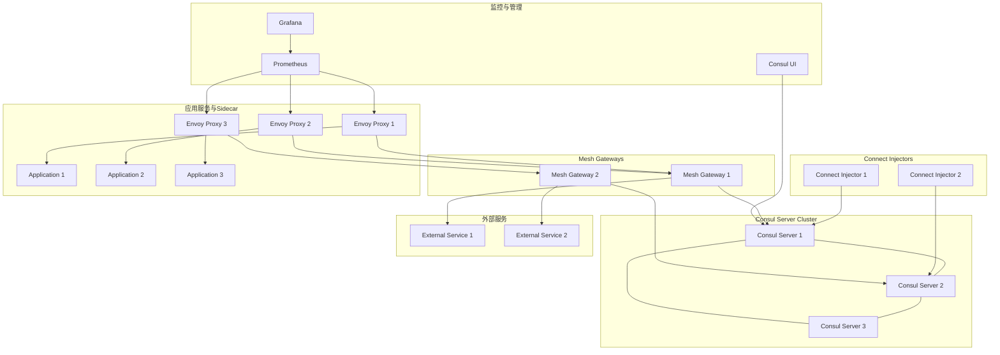

# Consul Connect 企业级服务网格管理

## 概述 (Overview)

Consul Connect 是 HashiCorp Consul 提供的服务网格解决方案，集成了服务发现、配置管理和服务网格功能。它提供了基于意图的网络控制、自动mTLS加密和细粒度的访问控制。本文档详细介绍 Consul Connect 的企业级部署架构、安全特性和运维管理最佳实践。

Consul Connect is HashiCorp Consul's service mesh solution that integrates service discovery, configuration management, and service mesh capabilities. It provides intent-based network control, automatic mTLS encryption, and fine-grained access control. This document details Consul Connect's enterprise deployment architecture, security features, and operational management best practices.

## 架构设计 (Architecture Design)

### 企业级部署架构 (Enterprise Deployment Architecture)

```hcl
# Consul Helm 部署配置
resource "helm_release" "consul" {
  name       = "consul"
  repository = "https://helm.releases.hashicorp.com"
  chart      = "consul"
  version    = "1.0.2"
  namespace  = "consul"

  values = [
    yamlencode({
      global = {
        name = "consul"
        datacenter = "dc1"
        tls = {
          enabled = true
          enableAutoEncrypt = true
        }
        acls = {
          manageSystemACLs = true
        }
      }
      
      server = {
        replicas = 3
        bootstrapExpect = 3
        disruptionBudget = {
          enabled = true
          maxUnavailable = 1
        }
        resources = {
          requests = {
            memory = "100Mi"
            cpu    = "100m"
          }
          limits = {
            memory = "200Mi"
            cpu    = "200m"
          }
        }
      }
      
      connectInject = {
        enabled = true
        default = true
        replicas = 2
        resources = {
          requests = {
            memory = "50Mi"
            cpu    = "50m"
          }
          limits = {
            memory = "100Mi"
            cpu    = "100m"
          }
        }
      }
      
      ui = {
        enabled = true
        service = {
          type = "LoadBalancer"
        }
      }
      
      meshGateway = {
        enabled = true
        replicas = 2
        resources = {
          requests = {
            memory = "100Mi"
            cpu    = "100m"
          }
          limits = {
            memory = "200Mi"
            cpu    = "200m"
          }
        }
      }
    })
  ]
}
```

### Consul Connect 架构图 (Consul Connect Architecture Diagram)



## 核心功能配置 (Core Functionality Configuration)

### 服务注册与发现 (Service Registration and Discovery)

```hcl
# Consul 服务定义
service {
  name = "web-service"
  id = "web-service-1"
  address = "10.0.1.10"
  port = 8080
  
  tags = ["primary", "v1.2.3"]
  
  meta = {
    version = "1.2.3"
    environment = "production"
  }
  
  check {
    id = "web-service-health"
    name = "HTTP API on port 8080"
    http = "http://10.0.1.10:8080/health"
    interval = "10s"
    timeout = "1s"
    deregister_critical_service_after = "1m"
  }
  
  connect {
    sidecar_service {
      proxy {
        upstreams = [
          {
            destination_name = "database-service"
            local_bind_port = 9100
          },
          {
            destination_name = "cache-service"
            local_bind_port = 9200
          }
        ]
        
        config {
          envoy_prometheus_bind_addr = "0.0.0.0:9102"
        }
      }
    }
  }
}
```

### 意图配置 (Intentions Configuration)

```hcl
# Consul 意图定义 - 访问控制策略
Kind = "service-intentions"
Name = "web-service"

Sources = [
  {
    Name   = "api-gateway"
    Action = "allow"
  },
  {
    Name   = "mobile-app"
    Action = "allow"
    Permissions = [
      {
        Action = "read"
        HTTP {
          PathExact  = "/api/users"
          Methods    = ["GET"]
        }
      },
      {
        Action = "write"
        HTTP {
          PathPrefix = "/api/users"
          Methods    = ["POST", "PUT", "DELETE"]
        }
      }
    ]
  },
  {
    Name   = "*"
    Action = "deny"
  }
]

---
# 使用CLI管理意图
# 允许web-service访问database-service
consul intention create web-service database-service

# 拒绝所有其他访问
consul intention create '*' database-service -deny

# 查看当前意图
consul intention list
```

### 配置入口配置 (Config Entries Configuration)

```hcl
# Service Router - 服务路由配置
Kind = "service-router"
Name = "api-service"

Routes = [
  {
    Match {
      HTTP {
        PathPrefix = "/v2/"
      }
    }
    
    Destination {
      Service = "api-v2"
      PrefixRewrite = "/"
    }
  },
  {
    Match {
      HTTP {
        Header = [
          {
            Name  = "x-version"
            Exact = "v1"
          }
        ]
      }
    }
    
    Destination {
      Service = "api-v1"
    }
  }
]

---
# Service Splitter - 流量分割配置
Kind = "service-splitter"
Name = "frontend-service"

Splits = [
  {
    Weight = 90
    Service = "frontend-v1"
  },
  {
    Weight = 10
    Service = "frontend-canary"
  }
]

---
# Service Resolver - 服务解析配置
Kind = "service-resolver"
Name = "backend-service"

DefaultSubset = "v1"

Subsets = {
  "v1" = {
    Filter = "Service.Meta.version == v1"
  }
  "v2" = {
    Filter = "Service.Meta.version == v2"
  }
}
```

## 安全特性 (Security Features)

### mTLS 配置 (mTLS Configuration)

```hcl
# Consul TLS 配置
resource "consul_keys" "tls_config" {
  key {
    path   = "connect/ca_config"
    value  = jsonencode({
      Provider = "consul"
      Config = {
        LeafCertTTL = "72h"
        RotationPeriod = "2160h"
        IntermediateCertTTL = "8760h"
      }
    })
  }
}

# 服务特定的TLS配置
Kind = "proxy-defaults"
Name = "global"

Config {
  protocol = "http"
  
  envoy_prometheus_bind_addr = "0.0.0.0:9102"
  
  envoy_extra_static_clusters_json = jsonencode([
    {
      name = "jaeger_collector"
      connect_timeout = "5s"
      type = "STRICT_DNS"
      lb_policy = "ROUND_ROBIN"
      load_assignment = {
        cluster_name = "jaeger_collector"
        endpoints = [
          {
            lb_endpoints = [
              {
                endpoint = {
                  address = {
                    socket_address = {
                      address = "jaeger-collector.jaeger"
                      port_value = 14250
                    }
                  }
                }
              }
            ]
          }
        ]
      }
    }
  ])
}
```

### ACL 策略配置 (ACL Policy Configuration)

```hcl
# Consul ACL 策略定义
resource "consul_acl_policy" "service_mesh_policy" {
  name        = "service-mesh-policy"
  description = "Policy for service mesh operations"
  rules       = <<-RULE
    service_prefix "" {
      policy = "read"
    }
    
    service "consul" {
      policy = "write"
    }
    
    node_prefix "" {
      policy = "read"
    }
    
    agent_prefix "" {
      policy = "read"
    }
    
    session_prefix "" {
      policy = "read"
    }
    
    # Connect specific permissions
    service_prefix "" {
      intentions = "read"
    }
    
    # KV store for configuration
    key_prefix "service-config/" {
      policy = "read"
    }
  RULE
}

# Token绑定策略
resource "consul_acl_token" "service_token" {
  description = "Token for service mesh applications"
  policies    = [consul_acl_policy.service_mesh_policy.name]
  local       = true
}
```

## 性能监控 (Performance Monitoring)

### 监控集成配置 (Monitoring Integration Configuration)

```yaml
# Prometheus 监控配置
scrape_configs:
  - job_name: 'consul-connect'
    consul_sd_configs:
      - server: 'consul-server:8500'
        services: ['connect-proxy']
    relabel_configs:
      - source_labels: [__meta_consul_service]
        target_label: job
      - source_labels: [__meta_consul_service_metadata_connect_service]
        target_label: service
      - source_labels: [__meta_consul_service_metadata_connect_instance]
        target_label: instance

  - job_name: 'consul-server'
    static_configs:
      - targets: ['consul-server:8500']
    metrics_path: '/v1/agent/metrics'
    params:
      format: ['prometheus']

# 告警规则配置
groups:
- name: consul-connect.rules
  rules:
  - alert: ConsulConnectHighErrorRate
    expr: rate(envoy_cluster_upstream_rq_5xx[5m]) / rate(envoy_cluster_upstream_rq_total[5m]) > 0.05
    for: 2m
    labels:
      severity: warning
    annotations:
      summary: "High error rate in Consul Connect proxy"
      description: "Error rate above 5% for service {{ $labels.service }}"
      
  - alert: ConsulConnectHighLatency
    expr: histogram_quantile(0.99, rate(envoy_cluster_upstream_rq_time_bucket[5m])) > 1000
    for: 2m
    labels:
      severity: warning
    annotations:
      summary: "High latency in Consul Connect"
      description: "99th percentile latency above 1 second for service {{ $labels.service }}"
```

### 关键性能指标 (Key Performance Metrics)

```promql
# 服务网格健康指标
# 请求成功率
sum(rate(envoy_cluster_upstream_rq_2xx[1m])) by (service) /
sum(rate(envoy_cluster_upstream_rq_total[1m])) by (service)

# 99百分位延迟
histogram_quantile(0.99, sum(rate(envoy_cluster_upstream_rq_time_bucket[1m])) by (le, service))

# 活跃连接数
sum(envoy_cluster_upstream_cx_active) by (service)

# 内存使用情况
container_memory_working_set_bytes{container="consul-dataplane"} /
container_spec_memory_limit_bytes{container="consul-dataplane"} * 100

# CPU使用率
rate(container_cpu_usage_seconds_total{container="consul-dataplane"}[1m]) /
container_spec_cpu_quota{container="consul-dataplane"} * 100

# 证书到期时间
consul_connect_leaf_cert_expiry - time()
```

## 运维管理 (Operational Management)

### 故障排查命令 (Troubleshooting Commands)

```bash
#!/bin/bash
# Consul Connect 故障排查工具

# 检查Consul集群状态
echo "=== Checking Consul Cluster Status ==="
consul members
echo ""
consul operator raft list-peers
echo ""

# 检查Connect代理状态
echo "=== Checking Connect Proxy Status ==="
kubectl get pods -n consul -l component=connect-injector
echo ""
consul connect envoy -proxy-id=web-service-sidecar-proxy -admin-bind=localhost:19000
echo ""

# 查看服务意图
echo "=== Viewing Service Intentions ==="
consul intention list
echo ""
consul intention check web-service database-service
echo ""

# 检查证书状态
echo "=== Checking Certificate Status ==="
consul connect ca get-config
echo ""
consul connect ca list
echo ""

# 网络连通性测试
echo "=== Network Connectivity Test ==="
consul catalog services
echo ""
# 测试服务到服务的连接
curl -s http://localhost:8500/v1/connect/ca/leaf/web-service | jq '.SerialNumber'
```

### 日常运维脚本 (Daily Operations Scripts)

```bash
#!/bin/bash
# Consul Connect 日常运维脚本

# 自动健康检查
perform_health_check() {
    echo "Performing Consul Connect health check..."
    
    # 检查Consul服务器健康
    if ! consul members | grep -q "alive"; then
        echo "ERROR: Some Consul members are not alive"
        return 1
    fi
    
    # 检查Connect代理状态
    unhealthy_proxies=$(kubectl get pods -n consul -l component=connect-proxy \
        --field-selector=status.phase!=Running --no-headers | wc -l)
    
    if [ "$unhealthy_proxies" -gt 0 ]; then
        echo "WARNING: $unhealthy_proxies Connect proxies are not healthy"
    fi
    
    # 检查关键服务连通性
    check_service_connectivity() {
        local services=("web-service" "api-service" "database-service")
        for service in "${services[@]}"; do
            if ! consul catalog services | grep -q "$service"; then
                echo "WARNING: Service $service not found in catalog"
            fi
        done
    }
    
    check_service_connectivity
    echo "Health check completed"
}

# 证书管理
manage_certificates() {
    echo "Managing Consul certificates..."
    
    # 检查证书到期时间
    local expiry_threshold=604800  # 7天
    local current_time=$(date +%s)
    
    consul connect ca list | while read line; do
        local cert_serial=$(echo "$line" | awk '{print $1}')
        local cert_expiry=$(consul connect ca get-cert "$cert_serial" | jq -r '.ValidAfter')
        local expiry_time=$(date -d "$cert_expiry" +%s)
        local time_diff=$((expiry_time - current_time))
        
        if [ "$time_diff" -lt "$expiry_threshold" ]; then
            echo "WARNING: Certificate $cert_serial expires soon"
        fi
    done
    
    # 自动轮换即将到期的证书
    consul connect ca rotate
}

# 性能优化
optimize_performance() {
    echo "Optimizing Consul Connect performance..."
    
    # 调整Envoy资源配置
    kubectl patch configmap consul-connect-injector-config -n consul -p '{
        "data": {
            "default-sidecar-proxy-cpu-limit": "200m",
            "default-sidecar-proxy-memory-limit": "100Mi",
            "default-sidecar-proxy-cpu-request": "50m",
            "default-sidecar-proxy-memory-request": "50Mi"
        }
    }'
    
    # 重启受影响的Pods
    kubectl rollout restart deploy -n default
}
```

## 最佳实践 (Best Practices)

### 部署最佳实践 (Deployment Best Practices)

1. **高可用配置**
   ```hcl
   # 服务器集群配置
   server {
     replicas = 3
     bootstrap_expect = 3
     disruption_budget {
       enabled = true
       max_unavailable = 1
     }
   }
   
   # Connect注入器配置
   connect_inject {
     replicas = 2
     disruption_budget {
       enabled = true
       max_unavailable = 1
     }
   }
   ```

2. **资源优化**
   ```yaml
   # Sidecar代理资源限制
   resources:
     requests:
       cpu: "50m"
       memory: "50Mi"
     limits:
       cpu: "200m"
       memory: "100Mi"
   ```

3. **网络配置**
   ```hcl
   # 网格网关配置
   mesh_gateway {
     replicas = 2
     service {
       type = "LoadBalancer"
       ports {
         wan = 8443
       }
     }
   }
   ```

### 安全最佳实践 (Security Best Practices)

1. **TLS配置**
   ```hcl
   # 强制启用TLS
   tls {
     enabled = true
     enable_auto_encrypt = true
     verify_incoming = true
     verify_outgoing = true
   }
   
   # ACL配置
   acls {
     manage_system_acls = true
     create_replication_token = true
   }
   ```

2. **访问控制**
   ```hcl
   # 最小权限原则
   intention {
     source      = "frontend"
     destination = "backend"
     action      = "allow"
   }
   
   intention {
     source      = "*"
     destination = "database"
     action      = "deny"
   }
   ```

3. **证书管理**
   ```bash
   # 定期证书轮换
   consul connect ca rotate
   
   # 监控证书状态
   consul connect ca list
   
   # 备份CA证书
   consul snapshot save consul-backup.snap
   ```

### 监控最佳实践 (Monitoring Best Practices)

1. **关键指标监控**
   - 服务连通性 > 99.9%
   - 请求延迟 P99 < 500ms
   - 证书有效期内
   - 集群成员健康状态

2. **告警配置**
   ```yaml
   # 关键告警规则
   - alert: ConsulClusterDegraded
     expr: consul_serf_lan_members != consul_autopilot_healthy_nodes
     for: 2m
     labels:
       severity: critical
     
   - alert: ConsulConnectProxyDown
     expr: up{job="consul-connect-proxy"} == 0
     for: 1m
     labels:
       severity: warning
   ```

3. **日志管理**
   ```hcl
   # 日志配置
   log_level = "INFO"
   log_json = true
   
   # 审计日志
   audit {
     enabled = true
     sink {
       type = "file"
       path = "/var/log/consul/audit.log"
     }
   }
   ```

---

**文档版本**: v1.0  
**最后更新**: 2024年2月7日  
**适用版本**: Consul 1.16+