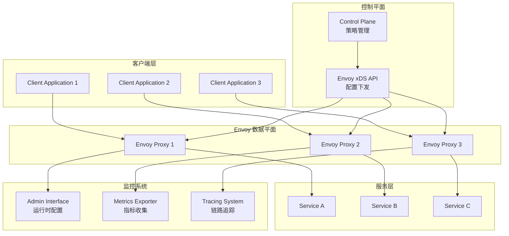

# Envoy Proxy 企业级服务网格数据平面深度实践

## 概述 (Overview)

Envoy Proxy 是由 Lyft 开发的高性能边缘和服务代理，现已成为云原生服务网格的事实标准数据平面。本文档从企业级运维专家角度，深入探讨 Envoy 的架构设计、配置管理、性能调优和生产运维最佳实践。

Envoy Proxy is a high-performance edge and service proxy developed by Lyft, now serving as the de facto standard data plane for cloud-native service meshes. This document explores Envoy's architecture design, configuration management, performance tuning, and production operations best practices from an enterprise operations expert perspective.

## 架构设计 (Architecture Design)

### Envoy 核心架构组件 (Envoy Core Architecture Components)

```yaml
# Envoy 高可用部署配置
static_resources:
  listeners:
  - name: service_listener
    address:
      socket_address:
        address: 0.0.0.0
        port_value: 80
    filter_chains:
    - filters:
      - name: envoy.filters.network.http_connection_manager
        typed_config:
          "@type": type.googleapis.com/envoy.extensions.filters.network.http_connection_manager.v3.HttpConnectionManager
          stat_prefix: ingress_http
          route_config:
            name: local_route
            virtual_hosts:
            - name: backend
              domains: ["*"]
              routes:
              - match: { prefix: "/" }
                route: { cluster: service_backend }
          http_filters:
          - name: envoy.filters.http.router
            typed_config:
              "@type": type.googleapis.com/envoy.extensions.filters.http.router.v3.Router
          access_log:
          - name: envoy.access_loggers.file
            typed_config:
              "@type": type.googleapis.com/envoy.extensions.access_loggers.file.v3.FileAccessLog
              path: "/dev/stdout"

  clusters:
  - name: service_backend
    connect_timeout: 0.25s
    type: STRICT_DNS
    lb_policy: LEAST_REQUEST
    load_assignment:
      cluster_name: service_backend
      endpoints:
      - lb_endpoints:
        - endpoint:
            address:
              socket_address:
                address: service-backend
                port_value: 8080
    circuit_breakers:
      thresholds:
      - priority: DEFAULT
        max_connections: 1024
        max_pending_requests: 1024
        max_requests: 1024
        max_retries: 3
    outlier_detection:
      consecutive_5xx: 5
      interval: 10s
      base_ejection_time: 30s
      max_ejection_percent: 10
```

### Envoy 架构图 (Envoy Architecture Diagram)



## 核心功能配置 (Core Functionality Configuration)

### HTTP 连接管理器配置 (HTTP Connection Manager Configuration)

```yaml
# 高级HTTP连接管理器配置
typed_config:
  "@type": type.googleapis.com/envoy.extensions.filters.network.http_connection_manager.v3.HttpConnectionManager
  stat_prefix: ingress_http
  route_config:
    name: local_route
    virtual_hosts:
    - name: backend_services
      domains: ["*"]
      routes:
      - match:
          prefix: "/api/v1/"
          headers:
          - name: ":method"
            exact_match: "GET"
        route:
          cluster: api_backend
          timeout: 30s
          retry_policy:
            retry_on: "5xx,gateway-error,connect-failure,refused-stream"
            num_retries: 3
            per_try_timeout: 10s
      - match:
          prefix: "/health"
        direct_response:
          status: 200
          body:
            inline_string: "OK"
          
  # HTTP过滤器链
  http_filters:
  - name: envoy.filters.http.fault
    typed_config:
      "@type": type.googleapis.com/envoy.extensions.filters.http.fault.v3.HTTPFault
      abort:
        http_status: 503
        percentage:
          numerator: 1
          denominator: HUNDRED
          
  - name: envoy.filters.http.cors
    typed_config:
      "@type": type.googleapis.com/envoy.extensions.filters.http.cors.v3.Cors
      
  - name: envoy.filters.http.jwt_authn
    typed_config:
      "@type": type.googleapis.com/envoy.extensions.filters.http.jwt_authn.v3.JwtAuthentication
      providers:
        jwt_provider:
          issuer: "https://auth.company.com"
          audiences: ["api.company.com"]
          remote_jwks:
            http_uri:
              uri: "https://auth.company.com/.well-known/jwks.json"
              cluster: auth_service
              timeout: 5s
            cache_duration: 300s
            
  - name: envoy.filters.http.router
    typed_config:
      "@type": type.googleapis.com/envoy.extensions.filters.http.router.v3.Router
```

### 高级负载均衡配置 (Advanced Load Balancing Configuration)

```yaml
# 智能负载均衡策略
clusters:
- name: intelligent_lb_cluster
  connect_timeout: 1s
  type: EDS  # Endpoint Discovery Service
  lb_policy: LEAST_REQUEST
  lb_subset_config:
    fallback_policy: ANY_ENDPOINT
    subset_selectors:
    - keys: ["version"]
    - keys: ["zone", "hardware"]
    
  # 健康检查配置
  health_checks:
  - timeout: 5s
    interval: 10s
    unhealthy_threshold: 3
    healthy_threshold: 2
    http_health_check:
      path: "/health"
      expected_statuses:
      - start: 200
        end: 299
        
  # 连接池配置
  circuit_breakers:
    thresholds:
    - priority: DEFAULT
      max_connections: 2048
      max_pending_requests: 2048
      max_requests: 2048
      max_retries: 5
      retry_budget:
        budget_percent: 20
        min_retry_concurrency: 5
        
  # 异常检测
  outlier_detection:
    split_external_local_origin_errors: true
    consecutive_5xx: 5
    consecutive_gateway_failure: 3
    consecutive_local_origin_failure: 5
    base_ejection_time: 30s
    max_ejection_percent: 50
    enforcing_consecutive_5xx: 100
    enforcing_consecutive_gateway_failure: 0
    enforcing_consecutive_local_origin_failure: 100
```

## 性能优化 (Performance Optimization)

### 内存管理优化 (Memory Management Optimization)

```yaml
# Envoy 资源限制和优化配置
overload_manager:
  refresh_interval: 0.25s
  resource_monitors:
  - name: "envoy.resource_monitors.fixed_heap"
    typed_config:
      "@type": type.googleapis.com/envoy.extensions.resource_monitors.fixed_heap.v3.FixedHeapConfig
      max_heap_size_bytes: 2147483648  # 2GB
      
  actions:
  - name: "envoy.overload_actions.shrink_heap"
    triggers:
    - name: "envoy.resource_monitors.fixed_heap"
      threshold:
        value: 0.95
        
  - name: "envoy.overload_actions.stop_accepting_requests"
    triggers:
    - name: "envoy.resource_monitors.fixed_heap"
      threshold:
        value: 0.98

# 内存池配置
stats_config:
  stats_tags:
  - tag_name: "cluster_name"
    regex: "^cluster\.((.+?)\.)"
  - tag_name: "listener_address"
    regex: "^listener\.(((?:[0-9]{1,3}\.){3}[0-9]{1,3}):[0-9]{1,5})"
    
buffer_limits:
  http2_protocol_options:
    initial_stream_window_size: 65536
    initial_connection_window_size: 1048576
```

### 连接和线程优化 (Connection and Thread Optimization)

```bash
#!/bin/bash
# Envoy 性能调优脚本

# CPU亲和性设置
setup_cpu_affinity() {
    echo "Setting up CPU affinity for Envoy..."
    
    # 获取可用CPU核心数
    local cpu_count=$(nproc)
    local envoy_pid=$(pgrep envoy)
    
    # 设置CPU亲和性（避免跨NUMA节点）
    taskset -cp 0-$((cpu_count/2-1)) $envoy_pid
    
    # 启用IRQ平衡优化
    echo "Disabling IRQ balance for better performance..."
    systemctl stop irqbalance
}

# 内核参数优化
optimize_kernel_params() {
    echo "Optimizing kernel parameters..."
    
    # 网络参数优化
    sysctl -w net.core.rmem_max=134217728
    sysctl -w net.core.wmem_max=134217728
    sysctl -w net.ipv4.tcp_rmem="4096 87380 134217728"
    sysctl -w net.ipv4.tcp_wmem="4096 65536 134217728"
    sysctl -w net.ipv4.tcp_congestion_control=bbr
    sysctl -w net.core.netdev_max_backlog=5000
    
    # 文件描述符限制
    ulimit -n 1048576
    
    # 内存参数优化
    sysctl -w vm.swappiness=1
    sysctl -w vm.dirty_ratio=15
    sysctl -w vm.dirty_background_ratio=5
}

# Envoy启动参数优化
start_envoy_optimized() {
    local config_file=$1
    local log_level=${2:-info}
    
    exec envoy \
        --config-path $config_file \
        --log-level $log_level \
        --concurrency 4 \
        --disable-hot-restart \
        --cpuset-threads \
        --socket-path /var/run/envoy \
        --mode serve \
        --drain-time-s 60 \
        --parent-shutdown-time-s 90
}
```

## 监控告警 (Monitoring and Alerting)

### 指标收集配置 (Metrics Collection Configuration)

```yaml
# Prometheus 监控配置
stats_sinks:
- name: envoy.stat_sinks.metrics_service
  typed_config:
    "@type": type.googleapis.com/envoy.config.metrics.v3.MetricsServiceConfig
    transport_api_version: V3
    grpc_service:
      envoy_grpc:
        cluster_name: metrics_service
        
- name: envoy.stat_sinks.statsd
  typed_config:
    "@type": type.googleapis.com/envoy.config.metrics.v3.StatsdSink
    address:
      socket_address:
        address: 127.0.0.1
        port_value: 8125

# 自定义指标配置
stats_config:
  use_all_default_tags: true
  stats_tags:
  - tag_name: "service"
    regex: "^cluster\.([^.]+)\."
  - tag_name: "response_code"
    regex: "\.response_code:(\d{3})"
  - tag_name: "request_method"
    regex: "\.request_method:([^\.]+)"
    
  histogram_bucket_settings:
  - match:
      prefix: "http."
    buckets:
      - 0.5
      - 1.0
      - 5.0
      - 10.0
      - 25.0
      - 50.0
      - 100.0
      - 250.0
      - 500.0
      - 1000.0
      - 2500.0
      - 5000.0
      - 10000.0
```

### 关键监控指标 (Key Monitoring Metrics)

```promql
# Envoy 关键性能指标
# 请求成功率
envoy_cluster_upstream_rq_2xx_total / envoy_cluster_upstream_rq_total

# 99百分位延迟
histogram_quantile(0.99, rate(envoy_cluster_upstream_rq_time_bucket[5m]))

# 活跃连接数
envoy_cluster_upstream_cx_active

# 熔断器触发次数
rate(envoy_cluster_upstream_rq_pending_overflow[5m])

# 内存使用率
envoy_server_memory_allocated / envoy_server_memory_heap_size

# CPU使用率
rate(envoy_server_total_connections[5m])

# 健康检查失败率
rate(envoy_cluster_health_check_failure[5m]) / rate(envoy_cluster_health_check_attempt[5m])
```

## 安全配置 (Security Configuration)

### mTLS 配置 (mTLS Configuration)

```yaml
# 上游集群mTLS配置
clusters:
- name: secure_backend
  connect_timeout: 1s
  type: STRICT_DNS
  transport_socket:
    name: envoy.transport_sockets.tls
    typed_config:
      "@type": type.googleapis.com/envoy.extensions.transport_sockets.tls.v3.UpstreamTlsContext
      common_tls_context:
        tls_certificates:
        - certificate_chain:
            filename: "/etc/envoy/certs/client.crt"
          private_key:
            filename: "/etc/envoy/certs/client.key"
        validation_context:
          trusted_ca:
            filename: "/etc/envoy/certs/ca.crt"
          verify_subject_alt_name: ["backend.service.consul"]
        alpn_protocols: ["h2", "http/1.1"]
      sni: "backend.service.consul"
```

### 访问控制配置 (Access Control Configuration)

```yaml
# RBAC访问控制策略
http_filters:
- name: envoy.filters.http.rbac
  typed_config:
    "@type": type.googleapis.com/envoy.extensions.filters.http.rbac.v3.RBAC
    rules:
      action: ALLOW
      policies:
        "admin-access":
          permissions:
          - header:
              name: ":path"
              exact_match: "/admin"
          principals:
          - source_ip:
              address_prefix: "10.0.0.0"
              prefix_len: 8
              
        "api-access":
          permissions:
          - and_rules:
              rules:
              - header:
                  name: ":method"
                  exact_match: "POST"
              - header:
                  name: ":path"
                  prefix_match: "/api/"
          principals:
          - authenticated:
              principal_name:
                exact: "api-client"
```

## 运维管理 (Operational Management)

### 故障排查工具 (Troubleshooting Tools)

```bash
#!/bin/bash
# Envoy 故障排查工具集

# 配置验证
validate_config() {
    local config_file=$1
    echo "Validating Envoy configuration..."
    
    envoy --mode validate --config-path $config_file
    if [ $? -eq 0 ]; then
        echo "✓ Configuration is valid"
    else
        echo "✗ Configuration validation failed"
        return 1
    fi
}

# 运行时诊断
runtime_diagnostics() {
    echo "=== Envoy Runtime Diagnostics ==="
    
    # 检查监听器状态
    curl -s http://localhost:9901/listeners | jq '.listener_statuses[] | {name: .name, local_address: .local_address}'
    echo ""
    
    # 检查集群健康状态
    curl -s http://localhost:9901/clusters?format=json | jq '.cluster_statuses[] | {name: .name, healthy: .health_status.eds_health_status}'
    echo ""
    
    # 检查服务器状态
    curl -s http://localhost:9901/server_info | jq '.'
    echo ""
    
    # 检查内存使用
    curl -s http://localhost:9901/memory | jq '.'
}

# 性能分析
performance_analysis() {
    echo "=== Performance Analysis ==="
    
    # 收集关键指标
    local metrics=$(curl -s http://localhost:9901/stats/prometheus)
    
    # 分析请求延迟
    echo "Request latency analysis:"
    echo "$metrics" | grep "upstream_rq_time_bucket" | tail -10
    
    # 分析连接数
    echo "Connection analysis:"
    echo "$metrics" | grep "upstream_cx_active"
    
    # 分析错误率
    echo "Error rate analysis:"
    local total_reqs=$(echo "$metrics" | grep "upstream_rq_total" | awk '{sum+=$2} END {print sum}')
    local error_reqs=$(echo "$metrics" | grep "upstream_rq_5xx" | awk '{sum+=$2} END {print sum}')
    if [ "$total_reqs" -gt 0 ]; then
        local error_rate=$(echo "scale=2; $error_reqs*100/$total_reqs" | bc)
        echo "Error rate: ${error_rate}%"
    fi
}
```

### 日常运维脚本 (Daily Operations Scripts)

```bash
#!/bin/bash
# Envoy 日常运维自动化脚本

# 自动配置热重载
hot_reload_config() {
    local new_config=$1
    local admin_port=${2:-9901}
    
    echo "Performing hot reload of Envoy configuration..."
    
    # 验证新配置
    if ! validate_config $new_config; then
        echo "Configuration validation failed, aborting reload"
        return 1
    fi
    
    # 执行热重载
    curl -X POST http://localhost:$admin_port/config_dump > /tmp/current_config.json
    curl -X POST http://localhost:$admin_port/hot_restart_version
    
    # 监控重载状态
    for i in {1..30}; do
        local status=$(curl -s http://localhost:$admin_port/server_info | jq -r '.state')
        if [ "$status" = "LIVE" ]; then
            echo "✓ Hot reload completed successfully"
            return 0
        fi
        sleep 1
    done
    
    echo "✗ Hot reload timed out"
    return 1
}

# 证书轮换
rotate_certificates() {
    echo "Rotating Envoy certificates..."
    
    local cert_dir="/etc/envoy/certs"
    local backup_dir="/backup/envoy-certs-$(date +%Y%m%d-%H%M%S)"
    
    # 备份当前证书
    cp -r $cert_dir $backup_dir
    
    # 部署新证书
    # 这里应该集成具体的证书管理工具
    
    # 触发证书重载
    curl -X POST http://localhost:9901/certs
    
    # 验证新证书
    curl -s http://localhost:9901/certs | jq '.certificates[] | {path: .path, expiration_time: .expiration_time}'
}
```

## 最佳实践 (Best Practices)

### 部署最佳实践 (Deployment Best Practices)

1. **资源规划**
   ```yaml
   # 推荐的资源分配
   resources:
     requests:
       cpu: "500m"
       memory: "512Mi"
     limits:
       cpu: "2"
       memory: "2Gi"
   
   # 启动探针配置
   startup_probe:
     http_get:
       path: /ready
       port: 9901
     failure_threshold: 30
     period_seconds: 10
   ```

2. **配置管理**
   ```bash
   # 配置版本控制最佳实践
   # 使用Git管理配置文件
   # 实施配置变更审批流程
   # 建立配置回滚机制
   ```

3. **网络优化**
   ```yaml
   # 网络性能优化
   listener_filters:
   - name: envoy.listener.tls_inspector
     typed_config:
       "@type": type.googleapis.com/envoy.extensions.filters.listener.tls_inspector.v3.TlsInspector
       
   socket_options:
   - level: 1  # SOL_SOCKET
     name: 9   # SO_KEEPALIVE
     int_value: 1
   - level: 6  # IPPROTO_TCP
     name: 1   # TCP_NODELAY
     int_value: 1
   ```

### 安全最佳实践 (Security Best Practices)

1. **零信任网络**
   ```yaml
   # 实施零信任安全模型
   rbac:
     action: ALLOW
     policies:
       default_deny:
         permissions:
         - any: true
         principals:
         - deny: true
   ```

2. **证书管理**
   ```bash
   # 自动化证书管理
   # 集成Vault或Cert Manager
   # 实施证书生命周期管理
   # 定期证书轮换
   ```

3. **访问控制**
   ```yaml
   # 细粒度访问控制
   authorization:
     providers:
     - name: jwt_auth
       typed_config:
         "@type": type.googleapis.com/envoy.extensions.filters.http.jwt_authn.v3.JwtAuthentication
         providers:
           oidc_provider:
             issuer: "https://auth.company.com"
             audiences: ["service.company.com"]
   ```

### 监控最佳实践 (Monitoring Best Practices)

1. **多维度监控**
   - 基础设施监控：CPU、内存、网络
   - 应用性能监控：延迟、错误率、吞吐量
   - 业务监控：关键业务指标

2. **告警策略**
   ```yaml
   # 分层告警策略
   alerting:
     critical: 影响业务连续性
     warning:  性能下降趋势
     info:     常规状态更新
   ```

3. **日志管理**
   ```yaml
   # 结构化日志配置
   access_log:
   - name: envoy.access_loggers.http_grpc
     typed_config:
       "@type": type.googleapis.com/envoy.extensions.access_loggers.grpc.v3.HttpGrpcAccessLogConfig
       common_config:
         log_name: "envoy_access_log"
         grpc_service:
           envoy_grpc:
             cluster_name: accesslog_service
   ```

---

**文档版本**: v1.0  
**最后更新**: 2024年2月7日  
**适用版本**: Envoy 1.28+