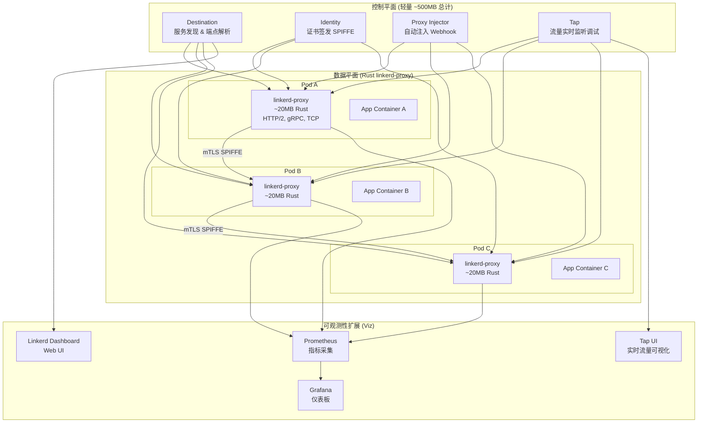

# Linkerd 轻量级服务网格实践指南

> **适用版本**: Linkerd v2.18 (stable) / Linkerd v2.19 (edge)
> **最后更新**: 2026-04-24
> **难度**: 初级 → 中级

---

## 概述

Linkerd 是 CNCF 第二个毕业的服务网格项目（2021年），以极简主义设计哲学著称。其 Rust 编写的 linkerd-proxy 仅消耗约 20MB 内存，P99 延迟增加低于 1ms，是资源敏感场景和快速落地需求的最佳选择。Linkerd 的核心理念是"做得更少但做得更好"——不追求功能大而全，而是将服务网格最核心的能力（安全、可靠性、可观测性）做到极致简单和可靠。

Linkerd 2026年的发展重点包括：持续优化 Rust 代理的性能和资源效率、增强策略（Policy）系统的表达能力、改进多集群连接的用户体验，以及探索与 Gateway API 的深度集成。Linkerd 社区保持着活跃的发布节奏，每季度发布一个稳定版本，edge 版本则保持每周更新。

本指南从安装到生产配置，覆盖 Linkerd 的所有核心功能，包括自动 mTLS、流量管理、可观测性、多集群连接、安全策略和故障排查。所有配置均基于 Linkerd v2.18+，可直接用于生产环境。

### 架构图



---

## 一、架构与设计理念

### 核心设计原则

| 原则 | 说明 | 与 Istio 对比 |
|:---|:---|:---|
| 极简主义 | 最小配置集，核心功能开箱即用 | Istio ~50 CRD vs Linkerd ~15 |
| 零配置安全 | mTLS 默认启用，无需任何配置 | Istio 需要显式配置 PeerAuthentication |
| 性能优先 | Rust 代理，亚毫秒延迟 | Istio Envoy C++ 1-3ms P99 |
| 渐进式采用 | 按命名空间逐步接入，无侵入 | 与 Istio 相同 |
| 可组合性 | 独立组件（Viz, Multicluster）可按需安装 | Istio 扩展较重 |
| 安全默认 | 最小权限、自动证书轮换、默认加密 | Istio 需要额外配置 |

### Linkerd 控制平面组件详解

| 组件 | 功能 | 默认资源 |
|:---|:---|:---|
| destination | 服务发现、端点解析、负载均衡信息提供 | 100m CPU / 128Mi 内存 |
| identity | SPIFFE 身份证书签发与轮换 | 100m CPU / 128Mi 内存 |
| proxy-injector | Mutating Webhook，自动注入 Sidecar | 100m CPU / 128Mi 内存 |
| tap | 实时流量监听和调试 | 100m CPU / 128Mi 内存 |

---

## 二、安装部署

### 2.1 CLI 安装

```bash
# macOS
brew install linkerd

# Linux
curl --proto '=https' --tlsv1.2 -sSfL https://run.linkerd.io/install | sh
export PATH=$PATH:$HOME/.linkerd2/bin

# 验证安装
linkerd version
# Client version: stable-2.18.0
# Server version: unavailable (not installed yet)

# 预检 (检查K8s集群是否满足安装条件)
linkerd check --pre
# kubernetes-api: can initialize the client .................................. [ok]
# kubernetes-api: can query the Kubernetes API ............................. [ok]
# kubernetes-version: is running the minimum Kubernetes API version ....... [ok]
# pre-kubernetes-setup: has necessary namespaces ........................... [ok]
# pre-kubernetes-setup: has CRD access ..................................... [ok]
```

### 2.2 控制平面安装

```bash
# 开发/测试环境
linkerd install | kubectl apply -f -
linkerd check

# 生产环境 (HA 模式)
linkerd install \
  --ha \
  --controller-replicas 3 \
  --identity-issuer-certificate-expiry 87600h \
  --set proxyInit.runAsRoot=true \
  --set proxy.resources.cpu.limit=500m \
  --set proxy.resources.memory.limit=128Mi \
  --set proxy.resources.cpu.request=100m \
  --set proxy.resources.memory.request=64Mi \
  --set identity.issuer.crtExpiry=87600h \
  --set highAvailability=true \
  --set imagePullPolicy=IfNotPresent \
  | kubectl apply -f -

# 验证安装
linkerd check
# linkerd-existence: Linkerd core CRDs ..................................... [ok]
# linkerd-existence: Linkerd core control plane namespace .................. [ok]
# linkerd-existence: Linkerd control plane proxy ready ..................... [ok]
# linkerd-identity: certificate config is valid ............................ [ok]
# linkerd-identity: trust anchors are valid ................................ [ok]
# linkerd-api: control plane pods are ready ................................ [ok]
```

### 2.3 生产级 Helm 安装

```bash
helm repo add linkerd https://helm.linkerd.io/stable
helm repo update

# 生成 CA 证书和签发者证书
step certificate create root.linkerd.cluster.local ca.crt ca.key \
  --profile root-ca --no-password --insecure

step certificate create identity.linkerd.cluster.local issuer.crt issuer.key \
  --ca ca.crt --ca-key ca.key \
  --profile intermediate-ca --not-after 87600h --no-password --insecure

# 创建命名空间和密钥
kubectl create namespace linkerd
kubectl create secret tls linkerd-identity-issuer \
  --namespace linkerd \
  --cert=issuer.crt --key=issuer.key

# Helm 安装
helm install linkerd-crds linkerd/linkerd-crds -n linkerd
helm install linkerd-control-plane linkerd/linkerd-control-plane \
  -n linkerd \
  --set identity.issuer.scheme=kubernetes.io/tls \
  --set highAvailability=true \
  --set proxy.resources.cpu.limit=500m \
  --set proxy.resources.memory.limit=128Mi \
  --wait
```

### 2.4 Viz 扩展 (监控)

```bash
linkerd viz install | kubectl apply -f -
linkerd viz check
linkerd viz dashboard

# 验证 Viz 组件
kubectl get pods -n linkerd-viz
# NAME                            READY   STATUS    RESTARTS   AGE
# linkerd-grafana-xxx             2/2     Running   0          1m
# linkerd-prometheus-xxx          2/2     Running   0          1m
# linkerd-tap-xxx                 2/2     Running   0          1m
# linkerd-web-xxx                 2/2     Running   0          1m
```

### 2.5 多集群扩展

```bash
# Cluster A (east)
linkerd multicluster install | kubectl apply -f -
linkerd multicluster check

# Cluster B (west)
linkerd multicluster install | kubectl apply -f -
linkerd multicluster link --cluster-name east | kubectl apply -f -

# 验证
linkerd multicluster check
linkerd multicluster gateways
```

---

## 三、自动 mTLS

### 默认行为

Linkerd 安装后自动启用 mTLS，无需任何配置。Identity Controller 为每个 Pod 签发 SPIFFE 标准身份证书（24h TTL，自动轮换）。证书的格式为 `spiffe://<trust.domain>/<namespace>/<serviceaccount>`，为每个工作负载提供唯一的加密身份标识。

```bash
# 验证 mTLS 状态
linkerd identity deployment/myapp -n production
# POD                      IDENTITY                                    NOT_AFTER
# myapp-5f8b7c6d4d-abc12   myapp.production.serviceaccount.identi...   2026-04-25T10:00:00Z

linkerd viz stat deployment -n production
# NAME        MESHED   SUCCESS      RPS   LATENCY_P50   LATENCY_P95   LATENCY_P99   TCP_CONN   SECURED
# myapp          3/3   100.00%   10.5rps          15ms          45ms          89ms          5     100%
# orders         5/5    99.95%    8.2rps          22ms          68ms         120ms          8     100%
# users          2/2   100.00%    5.1rps          12ms          35ms          72ms          3     100%

# 检查证书链
kubectl -n linkerd exec deploy/linkerd-identity -- \
  openssl x509 -in /var/run/linkerd/identity/issuer.crt -text -noout | head -20
```

### 外部 CA (cert-manager)

```yaml
apiVersion: linkerd.io/v1alpha2
kind: Issuer
metadata:
  name: linkerd-identity-issuer
  namespace: linkerd
spec:
  certManager:
    issuerRef:
      kind: ClusterIssuer
      name: myorg-ca
---
apiVersion: cert-manager.io/v1
kind: ClusterIssuer
metadata:
  name: myorg-ca
spec:
  ca:
    secretName: myorg-ca-secret
---
apiVersion: cert-manager.io/v1
kind: Certificate
metadata:
  name: linkerd-identity-issuer
  namespace: linkerd
spec:
  issuerRef:
    kind: ClusterIssuer
    name: myorg-ca
  secretName: linkerd-identity-issuer
  duration: 87600h
  renewBefore: 720h
  dnsNames:
    - identity.linkerd.cluster.local
  isCA: true
  usages:
    - signing
    - key encipherment
    - cert sign
    - server auth
    - client auth
```

### STRICT mTLS 模式

```yaml
apiVersion: policy.linkerd.io/v1alpha1
kind: MeshTLS
metadata:
  name: default
  namespace: linkerd
spec:
  mode: STRICT
---
apiVersion: policy.linkerd.io/v1alpha1
kind: MeshTLS
metadata:
  name: legacy-permissive
  namespace: legacy
spec:
  mode: PERMISSIVE
```

---

## 四、流量管理

### 4.1 自动负载均衡

Linkerd 自动使用 EWMA (Exponential Weighted Moving Average) 算法进行基于延迟感知的负载均衡，无需任何配置。这种算法会根据每个端点的历史延迟数据动态调整权重，将更多流量分配给响应更快的服务实例。相比传统的轮询（Round Robin）或最少连接（Least Connections）算法，EWMA 能够更快地感知后端服务的性能变化，实现更精确的负载分配。

### 4.2 重试与超时

```yaml
apiVersion: linkerd.io/v1alpha2
kind: ServiceProfile
metadata:
  name: myapp.production.svc.cluster.local
  namespace: production
spec:
  routes:
  - name: GET /api/users
    condition:
      method: GET
      pathRegex: /api/users
    timeout: 300ms
    retryBudget:
      retryRatio: 0.2
      minRetriesPerSecond: 10
      ttl: 10s
    isRetryable: true
    responseClasses:
      - condition:
          status:
            min: 500
            max: 599
        isFailure: true
  - name: GET /api/users/{id}
    condition:
      method: GET
      pathRegex: /api/users/\d+
    timeout: 500ms
    isRetryable: true
  - name: POST /api/users
    condition:
      method: POST
      pathRegex: /api/users
    timeout: 5s
    isRetryable: false
  - name: GET /health
    condition:
      method: GET
      pathRegex: /health
    timeout: 3s
    isRetryable: false
```

### 4.3 流量分割 (金丝雀发布)

```yaml
apiVersion: split.smi-spec.io/v1alpha4
kind: TrafficSplit
metadata:
  name: myapp-canary
  namespace: production
spec:
  service: myapp
  backends:
  - service: myapp-stable
    weight: 90
  - service: myapp-canary
    weight: 10
---
apiVersion: v1
kind: Service
metadata:
  name: myapp-stable
  namespace: production
spec:
  selector:
    app: myapp
    version: stable
  ports:
    - name: http
      port: 80
      targetPort: 8080
---
apiVersion: v1
kind: Service
metadata:
  name: myapp-canary
  namespace: production
spec:
  selector:
    app: myapp
    version: canary
  ports:
    - name: http
      port: 80
      targetPort: 8080
---
apiVersion: apps/v1
kind: Deployment
metadata:
  name: myapp-stable
  namespace: production
spec:
  replicas: 5
  selector:
    matchLabels:
      app: myapp
      version: stable
  template:
    metadata:
      annotations:
        linkerd.io/inject: enabled
      labels:
        app: myapp
        version: stable
    spec:
      containers:
        - name: myapp
          image: myapp:v1.0.0
          ports:
            - containerPort: 8080
---
apiVersion: apps/v1
kind: Deployment
metadata:
  name: myapp-canary
  namespace: production
spec:
  replicas: 1
  selector:
    matchLabels:
      app: myapp
      version: canary
  template:
    metadata:
      annotations:
        linkerd.io/inject: enabled
      labels:
        app: myapp
        version: canary
    spec:
      containers:
        - name: myapp
          image: myapp:v2.0.0
          ports:
            - containerPort: 8080
```

### 4.4 故障注入

```yaml
apiVersion: policy.linkerd.io/v1alpha1
kind: FaultInjection
metadata:
  name: myapp-fault-delay
  namespace: production
spec:
  targetRef:
    group: ""
    kind: Service
    name: myapp
  requestDelay:
    latency: 500ms
    percentage: 10
---
apiVersion: policy.linkerd.io/v1alpha1
kind: FaultInjection
metadata:
  name: myapp-fault-abort
  namespace: production
spec:
  targetRef:
    group: ""
    kind: Service
    name: myapp
  requestAbort:
    httpStatus: 503
    percentage: 1
```

---

## 五、可观测性

### 5.1 黄金指标

```bash
# 服务级黄金指标
linkerd viz stat deployment -n production
# NAME        MESHED   SUCCESS      RPS   LATENCY_P50   LATENCY_P95   LATENCY_P99   TCP_CONN
# myapp          3/3   100.00%   10.5rps          15ms          45ms          89ms          5
# orders         5/5    99.95%    8.2rps          22ms          68ms         120ms          8
# users          2/2   100.00%    5.1rps          12ms          35ms          72ms          3

# 实时流量监控
linkerd viz top deployment/myapp -n production
# ROUTE          SUCCESS      RPS   LATENCY_P50   LATENCY_P95   LATENCY_P99
# GET /api/users   100%   5.2rps          12ms          35ms          72ms
# POST /api/users   98%   1.5rps          45ms         120ms         250ms

# 服务依赖拓扑
linkerd viz edges deployment -n production
# SRC          DST          SRC_NS        DST_NS        SECURED
# myapp-abc12  orders-def34 production    production    √
# myapp-abc12  users-ghi56  production    production    √
# orders-def34 users-ghi56  production    production    √

# 实时流量 Tap (调试利器)
linkerd viz tap deployment/myapp -n production --duration 10s
# req id=0:1 proxy=in  src=10.0.0.1:38422 dst=10.0.0.2:8080 :method=GET :path=/api/users :authority=myapp:80
# rsp id=0:1 proxy=in  src=10.0.0.1:38422 dst=10.0.0.2:8080 :status=200 latency=12ms
```

### 5.2 Prometheus 集成

```yaml
apiVersion: monitoring.coreos.com/v1
kind: ServiceMonitor
metadata:
  name: linkerd-proxy
  namespace: linkerd-viz
spec:
  selector:
    matchExpressions:
      - key: linkerd.io/control-plane-ns
        operator: DoesNotExist
  namespaceSelector:
    any: true
  endpoints:
    - port: linkerd-admin
      path: /metrics
      interval: 15s
---
apiVersion: monitoring.coreos.com/v1
kind: ServiceMonitor
metadata:
  name: linkerd-control-plane
  namespace: linkerd
spec:
  selector:
    matchLabels:
      linkerd.io/control-plane-component: controller
  namespaceSelector:
    matchNames:
      - linkerd
  endpoints:
    - port: admin-http
      path: /metrics
      interval: 15s
```

### 5.3 关键 PromQL 查询

```promql
# 服务成功率
sum(rate(response_total{classification="success"}[1m])) by (dst) /
sum(rate(response_total[1m])) by (dst)

# P99 延迟
histogram_quantile(0.99, sum(rate(response_latency_ms_bucket[1m])) by (le, dst))

# 请求吞吐量
sum(rate(request_total[1m])) by (dst)

# TCP 连接数
sum(tcp_open_total{direction="inbound"}) by (dst)

# 代理内存使用率
container_memory_working_set_bytes{container="linkerd-proxy"} /
container_spec_memory_limit_bytes{container="linkerd-proxy"}
```

### 5.4 Prometheus 告警规则

```yaml
apiVersion: monitoring.coreos.com/v1
kind: PrometheusRule
metadata:
  name: linkerd-alerts
  namespace: linkerd-viz
spec:
  groups:
    - name: linkerd.rules
      rules:
        - alert: LinkerdHighErrorRate
          expr: |
            sum(rate(response_total{classification="failure"}[5m])) by (dst) /
            sum(rate(response_total[5m])) by (dst) > 0.01
          for: 2m
          labels:
            severity: warning
          annotations:
            summary: "High error rate for {{ $labels.dst }}"
            description: "Error rate above 1% for service {{ $labels.dst }}"

        - alert: LinkerdHighLatency
          expr: |
            histogram_quantile(0.99, sum(rate(response_latency_ms_bucket[5m])) by (le, dst)) > 1000
          for: 5m
          labels:
            severity: warning
          annotations:
            summary: "P99 latency above 1s for {{ $labels.dst }}"

        - alert: LinkerdProxyOOM
          expr: |
            container_memory_working_set_bytes{container="linkerd-proxy"} /
            container_spec_memory_limit_bytes{container="linkerd-proxy"} > 0.9
          for: 5m
          labels:
            severity: critical
          annotations:
            summary: "Linkerd proxy approaching OOM for {{ $labels.pod }}"

        - alert: LinkerdControlPlaneDown
          expr: up{job="linkerd-control-plane"} == 0
          for: 1m
          labels:
            severity: critical
          annotations:
            summary: "Linkerd control plane component {{ $labels.instance }} is down"

        - alert: LinkerdCertificateExpiringSoon
          expr: linkerd_identity_tls_valid_until_seconds < 86400
          for: 1h
          labels:
            severity: warning
          annotations:
            summary: "Linkerd certificate expiring in less than 24h"
```

---

## 六、多集群连接

### 架构

```
Cluster A (east)                              Cluster B (west)
├── linkerd-control-plane                     ├── linkerd-control-plane
├── linkerd-gateway (LoadBalancer)            ├── linkerd-gateway (LoadBalancer)
├── linkerd-multicluster-link                 ├── linkerd-multicluster-link
├── Service: myapp                            ├── Service: myapp
├── ServiceExport: myapp (exported=true)      └── ServiceImport: myapp-east (auto-created)
└── Pods with linkerd-proxy                       └── Pods with linkerd-proxy
```

### 连接配置

```bash
# Cluster A: 安装多集群组件并导出服务
linkerd multicluster install | kubectl apply -f -
linkerd multicluster check

# 标记服务为可导出
kubectl label svc myapp mirror.linkerd.io/exported=true -n production

# Cluster B: 连接到 Cluster A
linkerd multicluster link --cluster-name east | kubectl apply -f -

# Cluster B: 自动发现远程服务
kubectl get svc -n production
# NAME              TYPE        CLUSTER-IP      EXTERNAL-IP   PORT(S)   AGE
# myapp             ClusterIP   10.96.1.100     <none>        80/TCP    5d
# myapp-east        ClusterIP   10.96.2.200     <none>        80/TCP    1m

# 验证跨集群通信
kubectl exec -n production deploy/test-client -- curl -s http://myapp-east/health
```

---

## 七、Linkerd vs Istio 对比

### 功能与性能对比

| 维度 | Linkerd | Istio |
|:---|:---|:---|
| **控制平面** | ~500MB (4组件) | ~2GB+ (istiod 单体) |
| **数据平面** | Rust ~20MB/代理 | Envoy C++ ~100MB+/代理 |
| **延迟开销** | < 1ms P99 | 1-3ms P99 |
| **功能覆盖** | 核心服务网格能力 | 完整 + 网关 + WASM |
| **配置复杂度** | 极简 (~15 CRD) | 丰富但复杂 (~50 CRD) |
| **Ambient** | 无 (仅 Sidecar) | Ambient + Sidecar |
| **多集群** | 基础 (服务镜像) | 完整 (多网络多控制面) |
| **WASM** | 不支持 | 支持自定义过滤器 |
| **学习曲线** | 低 (1-2天) | 高 (1-2周) |
| **CNCF** | Graduated (2021) | Graduated (2023) |
| **流量分割** | SMI TrafficSplit | VirtualService weight |
| **故障注入** | FaultInjection CRD | VirtualService fault |
| **Gateway API** | 实验性 | 完整支持 |
| **商业支持** | Buoyant Enterprise | Google, Solo.io |

### 选型决策

```yaml
选择 Linkerd 的场景:
  - 追求极简和低运维成本
  - 资源受限环境 (边缘计算, IoT, 小集群)
  - 团队服务网格经验有限
  - 快速落地需求 (1-2天完成部署)
  - 核心需求仅为 mTLS + 负载均衡 + 可观测性

选择 Istio 的场景:
  - 需要复杂流量管理 (A/B测试, 流量镜像, 故障注入)
  - 大规模多集群部署
  - 需要 WASM 自定义扩展
  - 需要 Ambient Mesh (无Sidecar模式)
  - 需要 Gateway API 完整支持
  - 已有 Envoy/Google/Solo 商业支持合同
```

---

## 八、生产级配置

### 8.1 命名空间注入控制

```yaml
apiVersion: v1
kind: Namespace
metadata:
  name: production
  annotations:
    linkerd.io/inject: enabled
---
apiVersion: v1
kind: Namespace
metadata:
  name: monitoring
  annotations:
    linkerd.io/inject: disabled
---
apiVersion: apps/v1
kind: Deployment
metadata:
  name: legacy-app
  namespace: production
spec:
  template:
    metadata:
      annotations:
        linkerd.io/inject: disabled
    spec:
      containers:
        - name: legacy-app
          image: legacy-app:v1.0
---
apiVersion: apps/v1
kind: Deployment
metadata:
  name: modern-app
  namespace: production
spec:
  template:
    metadata:
      annotations:
        linkerd.io/inject: enabled
        config.linkerd.io/proxy-await: enabled
        config.linkerd.io/proxy-cpu-request: "100m"
        config.linkerd.io/proxy-memory-request: "64Mi"
        config.linkerd.io/proxy-cpu-limit: "500m"
        config.linkerd.io/proxy-memory-limit: "128Mi"
    spec:
      containers:
        - name: modern-app
          image: modern-app:v2.0
```

### 8.2 Proxy 资源限制

```bash
linkerd install \
  --set proxy.resources.cpu.limit=500m \
  --set proxy.resources.memory.limit=128Mi \
  --set proxy.resources.cpu.request=100m \
  --set proxy.resources.memory.request=64Mi \
  --set proxy.await=true
```

### 8.3 高可用反亲和

```yaml
apiVersion: apps/v1
kind: Deployment
metadata:
  name: linkerd-destination
  namespace: linkerd
spec:
  replicas: 3
  selector:
    matchLabels:
      linkerd.io/control-plane-component: destination
  template:
    spec:
      affinity:
        podAntiAffinity:
          requiredDuringSchedulingIgnoredDuringExecution:
            - labelSelector:
                matchLabels:
                  linkerd.io/control-plane-component: destination
              topologyKey: kubernetes.io/hostname
          preferredDuringSchedulingIgnoredDuringExecution:
            - weight: 100
              podAffinityTerm:
                labelSelector:
                  matchLabels:
                    linkerd.io/control-plane-component: destination
                topologyKey: topology.kubernetes.io/zone
```

### 8.4 授权策略

```yaml
apiVersion: policy.linkerd.io/v1alpha1
kind: Server
metadata:
  name: myapp-server
  namespace: production
spec:
  podSelector:
    matchLabels:
      app: myapp
  port: 8080
  proxyProtocol: HTTP/1
---
apiVersion: policy.linkerd.io/v1alpha1
kind: Server
metadata:
  name: myapp-admin-server
  namespace: production
spec:
  podSelector:
    matchLabels:
      app: myapp
  port: 9090
  proxyProtocol: HTTP/1
---
apiVersion: policy.linkerd.io/v1alpha1
kind: Authorization
metadata:
  name: myapp-authz
  namespace: production
spec:
  server:
    name: myapp-server
  client:
    meshTLS:
      identities:
        - "api-gateway.ingress.serviceaccount.identity.linkerd.cluster.local"
        - "web-client.production.serviceaccount.identity.linkerd.cluster.local"
  http:
    - pathRegex: /api/.*
      method: GET
    - pathRegex: /api/.*
      method: POST
    - pathRegex: /health
      method: GET
---
apiVersion: policy.linkerd.io/v1alpha1
kind: Authorization
metadata:
  name: myapp-admin-authz
  namespace: production
spec:
  server:
    name: myapp-admin-server
  client:
    meshTLS:
      identities:
        - "admin-tool.ops.serviceaccount.identity.linkerd.cluster.local"
  http:
    - pathRegex: /admin/.*
      method: GET
---
apiVersion: policy.linkerd.io/v1alpha1
kind: Authorization
metadata:
  name: deny-all-default
  namespace: production
spec:
  server:
    selector:
      matchLabels:
        app: myapp
  client:
    unauthenticated: false
```

### 8.5 网络策略

```yaml
apiVersion: networking.k8s.io/v1
kind: NetworkPolicy
metadata:
  name: linkerd-proxy-policy
  namespace: production
spec:
  podSelector:
    matchLabels:
      linkerd.io/proxy-deployment: myapp
  policyTypes:
    - Ingress
    - Egress
  ingress:
    - from:
        - namespaceSelector:
            matchLabels:
              kubernetes.io/metadata.name: production
      ports:
        - port: 8080
          protocol: TCP
        - port: 4190
          protocol: TCP
    - from:
        - namespaceSelector:
            matchLabels:
              kubernetes.io/metadata.name: linkerd
        - podSelector:
            matchLabels:
              linkerd.io/control-plane-component: destination
      ports:
        - port: 4190
          protocol: TCP
  egress:
    - to:
        - namespaceSelector: {}
      ports:
        - port: 443
          protocol: TCP
        - port: 80
          protocol: TCP
```

---

## 九、故障排查

### 9.1 诊断命令

```bash
#!/bin/bash

echo "=== 1. 安装检查 ==="
linkerd check
linkerd check --proxy

echo "=== 2. 控制平面状态 ==="
kubectl get pods -n linkerd -o wide
kubectl top pods -n linkerd

echo "=== 3. 数据平面状态 ==="
linkerd viz stat pods -n production
linkerd viz stat deployment -n production

echo "=== 4. 实时流量 ==="
linkerd viz tap deployment/myapp -n production --duration 10s

echo "=== 5. 服务依赖拓扑 ==="
linkerd viz edges deployment -n production
linkerd viz edges pod -n production

echo "=== 6. 证书状态 ==="
linkerd identity -n production deployment/myapp

echo "=== 7. 代理日志 ==="
kubectl logs -n production deployment/myapp -c linkerd-proxy --tail=100
kubectl logs -n production deployment/myapp -c linkerd-proxy --tail=50 | grep -iE "error|warn"

echo "=== 8. 代理资源使用 ==="
kubectl top pods -n production -l linkerd.io/proxy-deployment

echo "=== 9. 策略检查 ==="
kubectl get server -n production
kubectl get authorization -n production
kubectl get mesh-tls -n production

echo "=== 10. 性能分析 ==="
linkerd viz top deployment/myapp -n production --max-rps 100
linkerd diagnostics policy -n production pod/myapp-xxxxx

echo "=== 11. 控制平面日志 ==="
kubectl logs -n linkerd deploy/linkerd-destination --tail=50
kubectl logs -n linkerd deploy/linkerd-identity --tail=50
kubectl logs -n linkerd deploy/linkerd-proxy-injector --tail=50
```

### 9.2 常见问题

| 问题 | 原因 | 解决 |
|:---|:---|:---|
| Pod 无法启动 | init 容器失败 (NET_ADMIN) | 检查 proxy-init 权限，设置 `runAsRoot=true` |
| mTLS 未生效 | 注入未启用 | 确认 namespace/pod annotation `linkerd.io/inject: enabled` |
| 延迟增加 | 代理资源不足 | 增加 proxy CPU/memory limit |
| 流量不统计 | viz 扩展未安装 | `linkerd viz install \| kubectl apply -f -` |
| 证书过期 | identity 异常 | 重启 identity / 检查 cert-manager / 重新签发 |
| 金丝雀不生效 | TrafficSplit 配置错误 | 检查 service 名称和 weight 总和 |
| 授权拒绝 | Server/Authorization 缺失 | 创建对应 Server 和 Authorization 资源 |
| DNS 解析慢 | CoreDNS 性能瓶颈 | 增加 CoreDNS 副本或部署 NodeLocal DNS |
| 多集群不通 | gateway 未就绪 | `linkerd multicluster check` 检查网关状态 |
| Sidecar 崩溃 | 资源限制过低 | 增加 proxy memory limit 到 128Mi+ |
| Viz Dashboard 无法访问 | tap 组件异常 | `linkerd viz check` 诊断 |

---

## 十、性能基准

### Linkerd vs Istio vs 无网格性能对比

```yaml
测试环境:
  Kubernetes: v1.31
  节点数: 3
  测试工具: fortio / wrk2
  测试场景: 100 并发, 1000 RPS, 60秒持续
  服务链路: client → gateway → service-a → service-b → service-c

无网格基线:
  P50: 1.2ms
  P95: 2.8ms
  P99: 5.1ms
  内存/Pod: 0MB (无代理)

Linkerd Sidecar:
  P50: 1.5ms (+0.3ms)
  P95: 3.5ms (+0.7ms)
  P99: 5.8ms (+0.7ms)
  内存/代理: ~20MB
  CPU/代理: ~20m (idle)

Istio Sidecar:
  P50: 2.8ms (+1.6ms)
  P95: 5.2ms (+2.4ms)
  P99: 8.3ms (+3.2ms)
  内存/代理: ~120MB
  CPU/代理: ~80m (idle)

Istio Ambient (L4 only):
  P50: 1.6ms (+0.4ms)
  P95: 3.8ms (+1.0ms)
  P99: 6.2ms (+1.1ms)
  内存/节点: ~50MB (ztunnel)
```

---

## 参考链接

- [Linkerd 官方文档](https://linkerd.io/2/overview/)
- [Linkerd GitHub](https://github.com/linkerd/linkerd2)
- [Linkerd 性能基准](https://linkerd.io/2021/05/27/linkerd-vs-istio-benchmarks/)
- [SMI (Service Mesh Interface)](https://smi-spec.io/)
- [Buoyant Enterprise](https://buoyant.io/)
- [Linkerd Argo Rollouts 集成](https://linkerd.io/2/tasks/canary-rollouts/)
- [Linkerd 多集群文档](https://linkerd.io/2/features/multicluster/)
