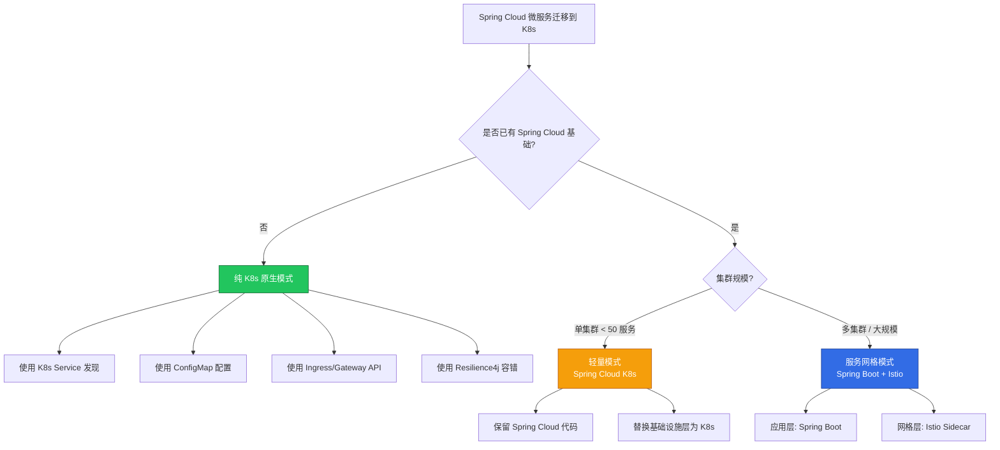
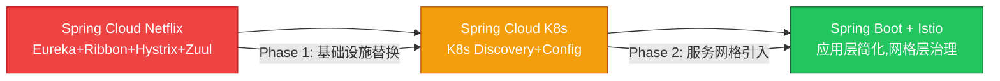

# Spring Cloud Kubernetes 与服务网格集成指南

> **适用版本**: Spring Cloud 2024.0+ / Spring Cloud Kubernetes 3.x / Istio 1.22+  
> **最后更新**: 2026-04-30  
> **难度**: 高级

---

## 📋 目录

- [一、Spring Cloud 与 K8s 原生能力映射](#一spring-cloud-与-k8s-原生能力映射)
- [二、Spring Cloud Kubernetes 配置](#二spring-cloud-kubernetes-配置)
- [三、服务发现集成](#三服务发现集成)
- [四、配置管理集成](#四配置管理集成)
- [五、Spring Cloud Gateway on K8s](#五spring-cloud-gateway-on-k8s)
- [六、Spring Cloud 与 Istio 对比与迁移](#六spring-cloud-与-istio-对比与迁移)
- [七、混合模式最佳实践](#七混合模式最佳实践)
- [八、Resilience4j 容错](#八resilience4j-容错)
- [九、分布式事务 (Seata)](#九分布式事务-seata)
- [十、微服务可观测性集成](#十微服务可观测性集成)

---

## 一、Spring Cloud 与 K8s 原生能力映射

### 1.1 能力映射表

| Spring Cloud 组件 | K8s 原生替代 | 推荐策略 |
|------------------|-------------|---------|
| Eureka (服务发现) | K8s Service + DNS | **使用 K8s 原生** |
| Spring Cloud Config | K8s ConfigMap + Secret | **使用 K8s 原生** |
| Ribbon/LoadBalancer | K8s Service (kube-proxy) | **使用 K8s 原生** |
| Zuul/Spring Cloud Gateway | K8s Ingress / Gateway API | 按需选择 |
| Hystrix (熔断) | Resilience4j / Istio | Resilience4j (应用级) |
| Spring Cloud Sleuth | OpenTelemetry | **使用 OTel** |
| Spring Cloud Bus | K8s Event / ConfigMap Watch | 按需选择 |
| Spring Cloud Stream | Kafka / RabbitMQ on K8s | 保留 (消息中间件不可替代) |
| Spring Cloud Security | K8s RBAC + Istio mTLS | 按需组合 |

### 1.2 架构决策树



---

## 二、Spring Cloud Kubernetes 配置

### 2.1 依赖配置

```xml
<dependencyManagement>
    <dependencies>
        <dependency>
            <groupId>org.springframework.cloud</groupId>
            <artifactId>spring-cloud-dependencies</artifactId>
            <version>2024.0.1</version>
            <type>pom</type>
            <scope>import</scope>
        </dependency>
    </dependencies>
</dependencyManagement>

<dependencies>
    <dependency>
        <groupId>org.springframework.cloud</groupId>
        <artifactId>spring-cloud-starter-kubernetes-fabric8</artifactId>
    </dependency>
    <dependency>
        <groupId>org.springframework.cloud</groupId>
        <artifactId>spring-cloud-starter-kubernetes-fabric8-config</artifactId>
    </dependency>
    <dependency>
        <groupId>org.springframework.cloud</groupId>
        <artifactId>spring-cloud-starter-loadbalancer</artifactId>
    </dependency>
    <dependency>
        <groupId>org.springframework.cloud</groupId>
        <artifactId>spring-cloud-starter-openfeign</artifactId>
    </dependency>
</dependencies>
```

### 2.2 核心配置

```yaml
# application.yml
spring:
  application:
    name: order-service
  cloud:
    kubernetes:
      discovery:
        enabled: true
        all-namespaces: false
        service-labels:
          app-type: spring-boot
      config:
        enabled: true
        name: ${spring.application.name}-config
        namespace: ${KUBERNETES_NAMESPACE:default}
      secrets:
        enabled: true
        name: ${spring.application.name}-secrets
        namespace: ${KUBERNETES_NAMESPACE:default}
      reload:
        enabled: true
        mode: event
        strategy: refresh
```

### 2.3 RBAC 配置

```yaml
apiVersion: v1
kind: ServiceAccount
metadata:
  name: spring-app-sa
  namespace: production
---
apiVersion: rbac.authorization.k8s.io/v1
kind: Role
metadata:
  name: spring-app-config-reader
  namespace: production
rules:
  - apiGroups: [""]
    resources: ["configmaps", "secrets"]
    verbs: ["get", "list", "watch"]
  - apiGroups: [""]
    resources: ["services", "endpoints", "pods"]
    verbs: ["get", "list", "watch"]
---
apiVersion: rbac.authorization.k8s.io/v1
kind: RoleBinding
metadata:
  name: spring-app-config-reader-binding
  namespace: production
roleRef:
  apiGroup: rbac.authorization.k8s.io
  kind: Role
  name: spring-app-config-reader
subjects:
  - kind: ServiceAccount
    name: spring-app-sa
```

---

## 三、服务发现集成

### 3.1 K8s Service 替代 Eureka

```java
@Configuration
public class ServiceDiscoveryConfig {

    @LoadBalanced
    @Bean
    public RestTemplate restTemplate() {
        return new RestTemplate();
    }

    @Bean
    @Primary
    public RestTemplate normalRestTemplate() {
        return new RestTemplate();
    }
}

// 使用 K8s DNS 名称直接调用
// 格式: <service-name>.<namespace>.svc.cluster.local:<port>
@Service
public class OrderService {
    @LoadBalanced
    private final RestTemplate restTemplate;

    public UserDto getUser(Long userId) {
        return restTemplate.getForObject(
            "http://user-service/api/users/" + userId,
            UserDto.class
        );
    }
}
```

### 3.2 OpenFeign 集成

```java
@FeignClient(name = "user-service", url = "http://user-service.production.svc.cluster.local:8080")
public interface UserClient {
    @GetMapping("/api/users/{id}")
    UserDto getUser(@PathVariable("id") Long id);

    @GetMapping("/api/users")
    List<UserDto> listUsers();
}
```

### 3.3 K8s Service 定义

```yaml
apiVersion: v1
kind: Service
metadata:
  name: user-service
  labels:
    app: user-service
    app-type: spring-boot
spec:
  selector:
    app: user-service
  ports:
    - name: http
      port: 8080
      targetPort: 8080
  type: ClusterIP
---
apiVersion: v1
kind: Service
metadata:
  name: order-service
  labels:
    app: order-service
    app-type: spring-boot
spec:
  selector:
    app: order-service
  ports:
    - name: http
      port: 8080
      targetPort: 8080
```

---

## 四、配置管理集成

### 4.1 ConfigMap 配置中心

```yaml
apiVersion: v1
kind: ConfigMap
metadata:
  name: order-service-config
  namespace: production
data:
  application.yml: |
    server:
      port: 8080
    spring:
      datasource:
        hikari:
          maximum-pool-size: 15
          minimum-idle: 3
    resilience4j:
      circuitbreaker:
        instances:
          user-service:
            sliding-window-size: 10
            failure-rate-threshold: 50
            wait-duration-in-open-state: 30s
    feign:
      client:
        config:
          default:
            connect-timeout: 5000
            read-timeout: 10000
```

### 4.2 Secret 管理

```yaml
apiVersion: v1
kind: Secret
metadata:
  name: order-service-secrets
  namespace: production
type: Opaque
stringData:
  SPRING_DATASOURCE_USERNAME: "app_user"
  SPRING_DATASOURCE_PASSWORD: "s3cur3P@ssw0rd"
  SPRING_REDIS_PASSWORD: "r3disP@ss"
```

### 4.3 配置热更新

```java
@RestController
@RefreshScope
public class DynamicConfigController {

    @Value("${app.feature.enabled:false}")
    private boolean featureEnabled;

    @Value("${app.max-retries:3}")
    private int maxRetries;

    @GetMapping("/config")
    public Map<String, Object> getConfig() {
        return Map.of(
            "featureEnabled", featureEnabled,
            "maxRetries", maxRetries
        );
    }
}
```

---

## 五、Spring Cloud Gateway on K8s

### 5.1 Gateway 部署

```yaml
# application.yml (Spring Cloud Gateway)
server:
  port: 8080

spring:
  cloud:
    gateway:
      discovery:
        locator:
          enabled: true
          lower-case-service-id: true
      routes:
        - id: user-service
          uri: http://user-service.production.svc.cluster.local:8080
          predicates:
            - Path=/api/users/**
          filters:
            - StripPrefix=0
            - name: CircuitBreaker
              args:
                name: user-service-cb
                fallbackUri: forward:/fallback/users
        - id: order-service
          uri: http://order-service.production.svc.cluster.local:8080
          predicates:
            - Path=/api/orders/**
          filters:
            - name: RequestRateLimiter
              args:
                redis-rate-limiter.replenishRate: 100
                redis-rate-limiter.burstCapacity: 200
                key-resolver: "#{@ipKeyResolver}"
```

### 5.2 K8s 部署

```yaml
apiVersion: apps/v1
kind: Deployment
metadata:
  name: spring-cloud-gateway
spec:
  replicas: 2
  selector:
    matchLabels:
      app: spring-cloud-gateway
  template:
    metadata:
      labels:
        app: spring-cloud-gateway
    spec:
      containers:
        - name: gateway
          image: registry.example.com/spring-cloud-gateway:v1.0.0
          ports:
            - containerPort: 8080
          resources:
            requests:
              memory: "512Mi"
              cpu: "200m"
            limits:
              memory: "1Gi"
              cpu: "1000m"
          env:
            - name: JAVA_OPTS
              value: "-XX:+UseContainerSupport -XX:MaxRAMPercentage=75.0"
---
apiVersion: v1
kind: Service
metadata:
  name: spring-cloud-gateway
spec:
  selector:
    app: spring-cloud-gateway
  ports:
    - port: 80
      targetPort: 8080
  type: ClusterIP
```

### 5.3 Spring Cloud Gateway vs K8s Gateway API

| 特性 | Spring Cloud Gateway | K8s Ingress | K8s Gateway API |
|------|---------------------|-------------|----------------|
| **路由能力** | 强 (代码级) | 中 (注解级) | 强 (CRD 级) |
| **限流** | 内置 Redis RateLimiter | 需 Ingress Controller 支持 | 支持 (扩展) |
| **熔断** | Resilience4j 集成 | 不支持 | 不支持 |
| **协议** | HTTP/WebSocket | HTTP/HTTPS | HTTP/HTTPS/gRPC/TCP |
| **语言耦合** | Java 生态 | 语言无关 | 语言无关 |
| **运维复杂度** | 需维护 Java 应用 | 声明式配置 | 声明式配置 |
| **适用场景** | Java 微服务架构 | 通用入口 | 多团队多网关 |

---

## 六、Spring Cloud 与 Istio 对比与迁移

### 6.1 能力对比

| 能力 | Spring Cloud 方案 | Istio 方案 | 建议 |
|------|-----------------|-----------|------|
| **服务发现** | Spring Cloud K8s Discovery | Istio Pilot + K8s Service | K8s 原生 |
| **负载均衡** | Spring Cloud LoadBalancer | Istio Envoy Sidecar | Istio (透明) |
| **熔断** | Resilience4j | Istio DestinationRule OutlierDetection | 两者皆可 |
| **限流** | Redis RateLimiter | Envoy RateLimit / Redis | Istio (全局) |
| **重试** | Spring Retry | Istio VirtualService Retries | Istio (透明) |
| **超时** | Feign Timeout | Istio VirtualService Timeout | 两者配合 |
| **流量分割** | Spring Cloud Gateway | Istio VirtualService Weighted | Istio (精细) |
| **mTLS** | Spring Security | Istio 自动 mTLS | Istio (零代码) |
| **链路追踪** | Micrometer Tracing | Istio Envoy 自动注入 | OTel Agent |
| **灰度发布** | 自定义 | Istio + Argo Rollouts | Istio (成熟) |
| **故障注入** | Chaos Mesh | Istio FaultInjection | 两者皆可 |

### 6.2 迁移路径



### 6.3 Phase 1: 移除 Eureka/Ribbon

```yaml
# 移除
# spring-cloud-starter-netflix-eureka-client
# spring-cloud-starter-netflix-ribbon

# 添加
# spring-cloud-starter-kubernetes-fabric8
# spring-cloud-starter-loadbalancer

# application.yml 移除
# eureka.client.service-url.defaultZone=...
# 移除 @EnableEurekaClient / @EnableDiscoveryClient
```

### 6.4 Phase 2: 引入 Istio Sidecar

```yaml
apiVersion: apps/v1
kind: Deployment
metadata:
  name: user-service
  annotations:
    sidecar.istio.io/inject: "true"
spec:
  template:
    metadata:
      annotations:
        sidecar.istio.io/inject: "true"
        traffic.sidecar.istio.io/includeInboundPorts: "8080"
        proxy.istio.io/config: |
          proxyStatsMatcher:
            inclusionRegexps:
              - ".*outbound.*"
```

---

## 七、混合模式最佳实践

### 7.1 分层治理模型

```
┌─────────────────────────────────────────┐
│         流量管理层 (Istio)                │
│  流量分割 / 灰度发布 / mTLS / 故障注入    │
├─────────────────────────────────────────┤
│         应用治理层 (Spring Boot)          │
│  业务逻辑 / 数据访问 / API 设计           │
├─────────────────────────────────────────┤
│         弹性层 (Resilience4j + Istio)    │
│  应用级熔断 + 网格级重试/超时             │
├─────────────────────────────────────────┤
│         可观测性层 (OTel + Prometheus)    │
│  链路追踪 / 指标监控 / 日志聚合           │
└─────────────────────────────────────────┘
```

### 7.2 避免双重重试

```yaml
# 问题: Istio 和 Spring 同时配置重试, 导致请求放大

# 方案一: Istio 管理重试, Spring 不重试
# application.yml
resilience4j:
  retry:
    instances:
      user-service:
        max-attempts: 1  # 不重试, 交给 Istio

# Istio VirtualService
apiVersion: networking.istio.io/v1beta1
kind: VirtualService
metadata:
  name: user-service
spec:
  hosts:
    - user-service
  http:
    - route:
        - destination:
            host: user-service
      retries:
        attempts: 3
        perTryTimeout: 2s
        retryOn: 5xx,reset,connect-failure

# 方案二: Spring 管理重试, Istio 不重试
# Istio 不配置 retries
# Spring Resilience4j 配置重试
```

---

## 八、Resilience4j 容错

### 8.1 配置

```yaml
resilience4j:
  circuitbreaker:
    instances:
      user-service:
        sliding-window-type: COUNT_BASED
        sliding-window-size: 10
        failure-rate-threshold: 50
        slow-call-duration-threshold: 3s
        slow-call-rate-threshold: 80
        wait-duration-in-open-state: 30s
        permitted-number-of-calls-in-half-open-state: 3
        minimum-number-of-calls: 5
  ratelimiter:
    instances:
      user-service:
        limit-for-period: 100
        limit-refresh-period: 1s
        timeout-duration: 5s
  retry:
    instances:
      user-service:
        max-attempts: 3
        wait-duration: 1s
        retry-exceptions:
          - java.io.IOException
          - java.util.concurrent.TimeoutException
  timelimiter:
    instances:
      user-service:
        timeout-duration: 5s
```

### 8.2 使用

```java
@Service
public class OrderService {
    private final UserClient userClient;

    @CircuitBreaker(name = "user-service", fallbackMethod = "getUserFallback")
    @Retry(name = "user-service")
    @RateLimiter(name = "user-service")
    @TimeLimiter(name = "user-service")
    public CompletableFuture<UserDto> getUser(Long userId) {
        return CompletableFuture.supplyAsync(() -> userClient.getUser(userId));
    }

    private CompletableFuture<UserDto> getUserFallback(Long userId, Exception e) {
        return CompletableFuture.completedFuture(
            UserDto.builder()
                .id(userId)
                .name("Unknown")
                .source("fallback")
                .build()
        );
    }
}
```

---

## 九、分布式事务 (Seata)

### 9.1 Seata on K8s 部署

```yaml
apiVersion: apps/v1
kind: Deployment
metadata:
  name: seata-server
spec:
  replicas: 3
  selector:
    matchLabels:
      app: seata-server
  template:
    metadata:
      labels:
        app: seata-server
    spec:
      containers:
        - name: seata-server
          image: apache/seata-server:2.2.0
          ports:
            - containerPort: 8091
            - containerPort: 7091
          env:
            - name: SEATA_CONFIG_NAME
              value: "file:/seata-server/config/application"
          resources:
            requests:
              memory: "512Mi"
              cpu: "250m"
            limits:
              memory: "1Gi"
              cpu: "1000m"
```

---

## 十、微服务可观测性集成

### 10.1 Spring Boot + OTel + Prometheus

```yaml
# application.yml
management:
  endpoints:
    web:
      exposure:
        include: health,info,prometheus,metrics
  metrics:
    tags:
      application: ${spring.application.name}
    distribution:
      percentiles-histogram:
        http.server.requests: true
        resilience4j.circuitbreaker.calls: true

# OTel Java Agent
# JAVA_TOOL_OPTIONS="-javaagent:/opt/opentelemetry-javaagent.jar"
# OTEL_SERVICE_NAME=order-service
# OTEL_EXPORTER_OTLP_ENDPOINT=http://otel-collector.observability:4317
```

### 10.2 K8s ServiceMonitor

```yaml
apiVersion: monitoring.coreos.com/v1
kind: ServiceMonitor
metadata:
  name: spring-app-metrics
  labels:
    release: prometheus
spec:
  selector:
    matchLabels:
      app-type: spring-boot
  namespaceSelector:
    matchNames:
      - production
  endpoints:
    - port: management
      path: /actuator/prometheus
      interval: 15s
      scrapeTimeout: 10s
```

---

## 🔗 相关文档

- [Spring Boot on K8s](../domain-4-workloads/99-spring-boot-kubernetes-guide.md) — Spring Boot K8s 基础
- [Istio 服务网格指南](./99-istio-service-mesh-guide.md) — Istio 深度实践
- [Java 可观测性](../domain-8-observability/99-java-observability-kubernetes-guide.md) — 完整可观测性方案
- [Java 安全加固](../domain-25-cloud-native-security/99-java-security-kubernetes-guide.md) — 安全实践
