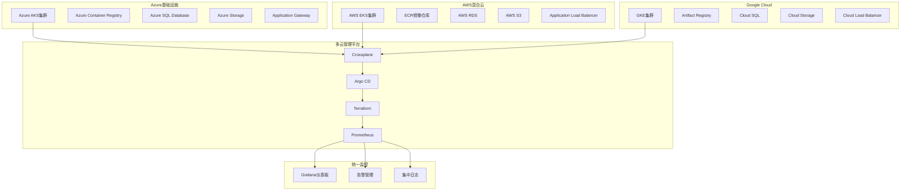

# Azure AKS 企业级多云管理平台

## 概述 (Overview)

Azure Kubernetes Service (AKS) 是微软Azure提供的托管Kubernetes服务，提供企业级的安全性、可扩展性和管理功能。本文档从生产环境运维专家角度，深入探讨AKS的企业级部署架构、多云集成策略和运维管理最佳实践。

Azure Kubernetes Service (AKS) is Microsoft Azure's managed Kubernetes service that provides enterprise-grade security, scalability, and management capabilities. This document explores AKS's enterprise deployment architecture, multi-cloud integration strategies, and operational management best practices from a production environment operations expert perspective.

## 架构设计 (Architecture Design)

### 企业级AKS集群架构 (Enterprise AKS Cluster Architecture)

```hcl
# Azure AKS Terraform 部署配置
resource "azurerm_kubernetes_cluster" "enterprise_aks" {
  name                = "enterprise-aks-cluster"
  location            = var.azure_region
  resource_group_name = azurerm_resource_group.main.name
  dns_prefix          = "enterprise-aks"
  kubernetes_version  = "1.28.3"
  
  default_node_pool {
    name                = "systempool"
    node_count          = 3
    vm_size             = "Standard_D4s_v3"
    os_disk_size_gb     = 128
    type                = "VirtualMachineScaleSets"
    availability_zones  = ["1", "2", "3"]
    max_pods            = 110
    vnet_subnet_id      = azurerm_subnet.aks_nodes.id
    enable_auto_scaling = true
    min_count           = 3
    max_count           = 20
    node_labels = {
      "nodepool-type" = "system"
      "environment"   = "production"
    }
  }
  
  identity {
    type = "SystemAssigned"
  }
  
  oidc_issuer_enabled       = true
  workload_identity_enabled = true
  
  azure_policy_enabled = true
  http_application_routing_enabled = false
  
  network_profile {
    network_plugin     = "azure"
    network_policy     = "calico"
    dns_service_ip     = "10.2.0.10"
    service_cidr       = "10.2.0.0/16"
    docker_bridge_cidr = "172.17.0.1/16"
  }
  
  role_based_access_control_enabled = true
  
  microsoft_defender {
    log_analytics_workspace_id = azurerm_log_analytics_workspace.main.id
  }
  
  oms_agent {
    log_analytics_workspace_id = azurerm_log_analytics_workspace.main.id
  }
  
  tags = {
    Environment = "Production"
    Department  = "Engineering"
    CostCenter  = "Kubernetes"
  }
}

# 应用节点池配置
resource "azurerm_kubernetes_cluster_node_pool" "app_pool" {
  name                  = "apppool"
  kubernetes_cluster_id = azurerm_kubernetes_cluster.enterprise_aks.id
  vm_size               = "Standard_D8s_v3"
  node_count            = 5
  max_pods              = 110
  vnet_subnet_id        = azurerm_subnet.aks_nodes.id
  enable_auto_scaling   = true
  min_count             = 3
  max_count             = 30
  node_labels = {
    "nodepool-type" = "application"
    "gpu"           = "false"
  }
  node_taints = [
    "sku=gpu:NoSchedule"
  ]
}

# GPU节点池配置
resource "azurerm_kubernetes_cluster_node_pool" "gpu_pool" {
  name                  = "gpupool"
  kubernetes_cluster_id = azurerm_kubernetes_cluster.enterprise_aks.id
  vm_size               = "Standard_NC6s_v3"
  node_count            = 2
  max_pods              = 30
  vnet_subnet_id        = azurerm_subnet.aks_nodes.id
  enable_auto_scaling   = true
  min_count             = 1
  max_count             = 10
  node_labels = {
    "nodepool-type" = "gpu"
    "accelerator"   = "nvidia"
  }
  node_taints = [
    "sku=gpu:NoSchedule"
  ]
}
```

### 多云架构集成图 (Multi-cloud Architecture Integration)



## 核心组件配置 (Core Component Configuration)

### 网络安全配置 (Network Security Configuration)

```hcl
# Azure网络安全性配置
resource "azurerm_network_security_group" "aks_nsg" {
  name                = "aks-nsg"
  location            = var.azure_region
  resource_group_name = azurerm_resource_group.main.name

  security_rule {
    name                       = "allow-https"
    priority                   = 100
    direction                  = "Inbound"
    access                     = "Allow"
    protocol                   = "Tcp"
    source_port_range          = "*"
    destination_port_range     = "443"
    source_address_prefix      = "Internet"
    destination_address_prefix = "*"
  }

  security_rule {
    name                       = "allow-kube-api"
    priority                   = 101
    direction                  = "Inbound"
    access                     = "Allow"
    protocol                   = "Tcp"
    source_port_range          = "*"
    destination_port_range     = "6443"
    source_address_prefix      = "AzureCloud"
    destination_address_prefix = "*"
  }

  security_rule {
    name                       = "deny-all-other"
    priority                   = 4096
    direction                  = "Inbound"
    access                     = "Deny"
    protocol                   = "*"
    source_port_range          = "*"
    destination_port_range     = "*"
    source_address_prefix      = "*"
    destination_address_prefix = "*"
  }
}

# 网络策略配置
resource "kubernetes_network_policy" "default_deny" {
  metadata {
    name      = "default-deny-all"
    namespace = "production"
  }

  spec {
    pod_selector {}
    policy_types = ["Ingress", "Egress"]
  }
}

resource "kubernetes_network_policy" "allow_backend_to_db" {
  metadata {
    name      = "allow-backend-to-database"
    namespace = "production"
  }

  spec {
    pod_selector {
      match_labels = {
        app = "database"
      }
    }

    ingress {
      from {
        pod_selector {
          match_labels = {
            app = "backend"
          }
        }
      }
      ports {
        protocol = "TCP"
        port     = 5432
      }
    }

    policy_types = ["Ingress"]
  }
}
```

### 存储类配置 (Storage Class Configuration)

```yaml
# Azure Disk CSI Driver 配置
apiVersion: storage.k8s.io/v1
kind: StorageClass
metadata:
  name: azure-disk-premium
  annotations:
    storageclass.kubernetes.io/is-default-class: "true"
provisioner: disk.csi.azure.com
volumeBindingMode: WaitForFirstConsumer
allowVolumeExpansion: true
parameters:
  skuName: Premium_LRS
  kind: Managed
  cachingMode: ReadOnly
  fsType: ext4
---
apiVersion: storage.k8s.io/v1
kind: StorageClass
metadata:
  name: azure-file-standard
provisioner: file.csi.azure.com
volumeBindingMode: WaitForFirstConsumer
allowVolumeExpansion: true
parameters:
  skuName: Standard_LRS
  shareName: k8s-shares
mountOptions:
  - dir_mode=0777
  - file_mode=0777
  - uid=0
  - gid=0
  - mfsymlinks
  - cache=strict
```

## 安全配置 (Security Configuration)

### Azure AD集成配置 (Azure AD Integration Configuration)

```hcl
# Azure AD身份验证配置
resource "azurerm_kubernetes_cluster" "aks_with_aad" {
  # ... 其他配置 ...
  
  azure_active_directory_role_based_access_control {
    managed                = true
    admin_group_object_ids = [var.aks_admin_group_id]
    azure_rbac_enabled     = true
  }
}

# Kubernetes RBAC角色绑定
resource "kubernetes_role_binding" "aks_admins" {
  metadata {
    name      = "aks-admins"
    namespace = "kube-system"
  }

  role_ref {
    api_group = "rbac.authorization.k8s.io"
    kind      = "ClusterRole"
    name      = "cluster-admin"
  }

  subject {
    kind      = "Group"
    name      = var.aks_admin_group_object_id
    api_group = "rbac.authorization.k8s.io"
  }
}
```

### 密钥管理配置 (Key Management Configuration)

```yaml
# Azure Key Vault CSI Driver 配置
apiVersion: secrets-store.csi.x-k8s.io/v1
kind: SecretProviderClass
metadata:
  name: azure-kv-secrets
  namespace: production
spec:
  provider: azure
  parameters:
    usePodIdentity: "true"
    keyvaultName: "enterprise-keyvault"
    objects: |
      array:
        - |
          objectName: database-connection-string
          objectType: secret
          objectAlias: db-connection-string
        - |
          objectName: api-key
          objectType: secret
          objectAlias: api-key
    tenantId: ${AZURE_TENANT_ID}
---
apiVersion: v1
kind: Pod
metadata:
  name: app-with-secrets
  namespace: production
spec:
  containers:
  - name: app
    image: myapp:latest
    volumeMounts:
    - name: secrets-store-inline
      mountPath: "/mnt/secrets-store"
      readOnly: true
  volumes:
  - name: secrets-store-inline
    csi:
      driver: secrets-store.csi.k8s.io
      readOnly: true
      volumeAttributes:
        secretProviderClass: azure-kv-secrets
```

## 监控告警 (Monitoring and Alerting)

### Azure Monitor集成配置 (Azure Monitor Integration Configuration)

```hcl
# Azure Monitor工作区配置
resource "azurerm_log_analytics_workspace" "main" {
  name                = "enterprise-aks-logs"
  location            = var.azure_region
  resource_group_name = azurerm_resource_group.main.name
  sku                 = "PerGB2018"
  retention_in_days   = 30
}

# 容器Insights配置
resource "azurerm_monitor_diagnostic_setting" "aks_diagnostics" {
  name                       = "aks-diagnostics"
  target_resource_id         = azurerm_kubernetes_cluster.enterprise_aks.id
  log_analytics_workspace_id = azurerm_log_analytics_workspace.main.id

  enabled_log {
    category = "kube-apiserver"
  }

  enabled_log {
    category = "kube-controller-manager"
  }

  enabled_log {
    category = "kube-scheduler"
  }

  enabled_log {
    category = "kube-audit"
  }

  metric {
    category = "AllMetrics"
  }
}
```

### Prometheus监控配置 (Prometheus Monitoring Configuration)

```yaml
# ServiceMonitor配置
apiVersion: monitoring.coreos.com/v1
kind: ServiceMonitor
metadata:
  name: aks-cluster-monitoring
  namespace: monitoring
  labels:
    app: prometheus-operator
spec:
  selector:
    matchLabels:
      app: aks-monitoring
  namespaceSelector:
    matchNames:
    - kube-system
    - monitoring
  endpoints:
  - port: metrics
    interval: 30s
    path: /metrics
    relabelings:
    - sourceLabels: [__meta_kubernetes_pod_name]
      targetLabel: pod
    - sourceLabels: [__meta_kubernetes_namespace]
      targetLabel: namespace

# 告警规则配置
apiVersion: monitoring.coreos.com/v1
kind: PrometheusRule
metadata:
  name: aks-alert-rules
  namespace: monitoring
spec:
  groups:
  - name: aks.rules
    rules:
    - alert: AKSClusterUnhealthy
      expr: azure_aks_cluster_status{status!="Ready"} == 1
      for: 5m
      labels:
        severity: critical
      annotations:
        summary: "AKS cluster is unhealthy"
        description: "AKS cluster {{ $labels.cluster }} is not in ready state"
        
    - alert: NodeNotReady
      expr: kube_node_status_condition{condition="Ready",status="false"} == 1
      for: 5m
      labels:
        severity: warning
      annotations:
        summary: "Kubernetes node is not ready"
        description: "Node {{ $labels.node }} has been not ready for more than 5 minutes"
```

## 运维管理 (Operational Management)

### 故障排查工具 (Troubleshooting Tools)

```bash
#!/bin/bash
# AKS故障排查脚本

# 集群健康检查
check_cluster_health() {
    echo "=== AKS Cluster Health Check ==="
    
    # 检查集群状态
    az aks show --resource-group $RESOURCE_GROUP --name $CLUSTER_NAME --query provisioningState
    
    # 检查节点状态
    kubectl get nodes -o wide
    
    # 检查核心组件
    kubectl get pods -n kube-system
    
    # 检查节点池状态
    az aks nodepool list --resource-group $RESOURCE_GROUP --cluster-name $CLUSTER_NAME -o table
}

# 网络诊断
network_diagnostics() {
    echo "=== Network Diagnostics ==="
    
    # 检查网络策略
    kubectl get networkpolicies -A
    
    # 检查服务端点
    kubectl get endpoints -A
    
    # 测试Pod间连通性
    kubectl run debug-pod --image=busybox --rm -it -- sh -c "ping -c 4 8.8.8.8"
    
    # 检查Azure CNI状态
    kubectl get daemonset -n kube-system azure-cni-networkmonitor
}

# 性能分析
performance_analysis() {
    echo "=== Performance Analysis ==="
    
    # 检查资源使用情况
    kubectl top nodes
    kubectl top pods -A
    
    # 检查Pod重启次数
    kubectl get pods -A --sort-by='.status.containerStatuses[0].restartCount'
    
    # 检查事件日志
    kubectl get events --sort-by='.lastTimestamp' | tail -20
    
    # 检查Azure监控指标
    az monitor metrics list --resource $CLUSTER_ID --metric-names "node_cpu_usage_percentage"
}
```

### 日常运维脚本 (Daily Operations Scripts)

```bash
#!/bin/bash
# AKS日常运维脚本

# 自动扩缩容管理
manage_autoscaling() {
    echo "Managing auto-scaling..."
    
    # 检查HPA状态
    kubectl get hpa -A
    
    # 检查集群自动扩缩容状态
    az aks nodepool show --resource-group $RESOURCE_GROUP --cluster-name $CLUSTER_NAME --name systempool --query enableAutoScaling
    
    # 根据CPU使用率调整节点池大小
    local avg_cpu=$(kubectl top nodes | awk 'NR>1 {sum+=$3} END {print sum/NR}')
    
    if (( $(echo "$avg_cpu > 70" | bc -l) )); then
        echo "CPU usage high, considering scale up"
        # 实施扩缩容逻辑
    fi
}

# 安全扫描
security_scan() {
    echo "Performing security scan..."
    
    # 检查过期证书
    kubectl get secrets -A -o json | jq '.items[] | select(.type=="kubernetes.io/tls") | .metadata.name'
    
    # 扫描不安全的Pod配置
    kubectl get pods -A -o json | jq '.items[] | select(.spec.containers[].securityContext == null)'
    
    # 检查RBAC权限
    kubectl get clusterroles,clusterrolebindings -o wide
    
    # Azure安全中心检查
    az security assessment list --scope $CLUSTER_ID
}

# 备份管理
manage_backups() {
    echo "Managing backups..."
    
    # etcd备份
    az aks command invoke \
        --resource-group $RESOURCE_GROUP \
        --name $CLUSTER_NAME \
        --command "kubectl exec -n kube-system etcd-aks -c etcd -- etcdctl snapshot save /backup/etcd-snapshot-$(date +%Y%m%d-%H%M%S)"
    
    # 资源清单备份
    kubectl get all -A -o yaml > /backup/k8s-resources-$(date +%Y%m%d-%H%M%S).yaml
    
    # Azure配置备份
    az aks export --resource-group $RESOURCE_GROUP --name $CLUSTER_NAME --output-folder /backup/aks-config
}
```

## 最佳实践 (Best Practices)

### 部署最佳实践 (Deployment Best Practices)

1. **基础设施即代码**
   ```hcl
   # 使用Terraform管理AKS基础设施
   module "aks" {
     source  = "Azure/aks/azurerm"
     version = "~> 5.0"
     
     cluster_name         = "production-aks"
     resource_group_name  = azurerm_resource_group.main.name
     kubernetes_version   = "1.28"
     
     default_node_pool = {
       name       = "system"
       node_count = 3
       vm_size    = "Standard_D4s_v3"
     }
     
     identity = {
       type = "SystemAssigned"
     }
   }
   ```

2. **资源优化**
   ```yaml
   # Pod资源请求和限制
   resources:
     requests:
       cpu: "100m"
       memory: "128Mi"
     limits:
       cpu: "500m"
       memory: "512Mi"
   ```

3. **标签策略**
   ```yaml
   # 标准化标签
   metadata:
     labels:
       app: my-app
       version: v1.0.0
       environment: production
       team: backend
       cost-center: engineering
   ```

### 安全最佳实践 (Security Best Practices)

1. **网络隔离**
   ```yaml
   # 网络策略实施
   networkPolicy:
     enabled: true
     allowExternal: false
   ```

2. **镜像安全**
   ```yaml
   # 镜像扫描和策略
   image:
     repository: my-app
     tag: v1.0.0
     pullPolicy: Always
     securityContext:
       runAsNonRoot: true
       readOnlyRootFilesystem: true
   ```

3. **密钥管理**
   ```bash
   # 使用Azure Key Vault
   az keyvault secret set \
     --vault-name enterprise-keyvault \
     --name database-connection-string \
     --value "your-connection-string"
   ```

### 监控最佳实践 (Monitoring Best Practices)

1. **多维度监控**
   - 基础设施层面：CPU、内存、磁盘、网络
   - 应用层面：请求率、错误率、延迟
   - 业务层面：关键业务指标、用户体验

2. **告警分级**
   ```yaml
   # 告警严重程度分级
   severity: 
     critical: 影响业务连续性
     warning:  潜在问题
     info:     信息性通知
   ```

3. **日志管理**
   ```yaml
   # 结构化日志配置
   logging:
     format: json
     level: info
     destination: azure-monitor
   ```

---

**文档版本**: v1.0  
**最后更新**: 2024年2月7日  
**适用版本**: AKS 1.28+