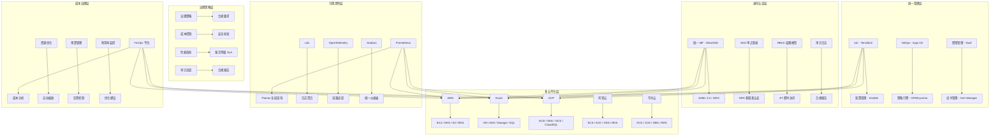
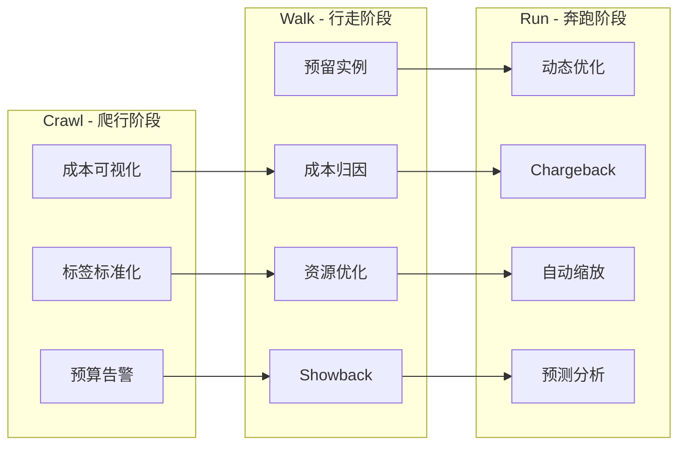

# 企业级多云治理与成本优化深度实践

## 概述

多云治理是企业数字化转型过程中的核心挑战。随着云平台数量的增加，资源管理的复杂性呈指数级增长，缺乏统一治理的多云环境会导致资源浪费、安全漏洞、合规风险和成本失控。企业级多云治理需要从战略层面建立统一的治理框架，涵盖身份认证、资源管理、安全合规、成本优化和运维自动化等多个维度。

本文档深入探讨企业级多云治理架构、统一身份认证体系、FinOps 成本优化策略和自动化运维管理，基于大型企业多云环境的实践经验，提供从云资源管理到成本控制的完整技术指南。内容覆盖 AWS、Azure、Google Cloud、阿里云等主流云平台的治理最佳实践，帮助企业建立成熟的多云运营体系。

### 多云治理核心目标

- **统一身份管理**: 建立跨云统一身份认证和权限管理体系
- **资源标准化**: 统一资源命名、标签、配额等管理标准
- **安全合规**: 跨云安全策略执行和持续合规审计
- **成本可控**: FinOps 驱动的成本可视化和优化
- **运维自动化**: 基础设施即代码和 GitOps 驱动的自动化运维
- **可观测性**: 统一监控、日志、链路追踪的跨云可观测体系

## 架构设计

### 统一治理框架



### FinOps 成熟度模型



### 云资源统一管理配置

```yaml
apiVersion: v1
kind: ConfigMap
metadata:
  name: multicloud-governance-config
  namespace: governance
data:
  governance-policy.yaml: |
    cloud_management_framework:
      infrastructure_as_code:
        terraform:
          backend: "s3"
          state_encryption: true
          workspaces:
            - name: "production-aws"
              provider: "aws"
              region: "us-east-1"
              account_id: "123456789012"
            - name: "production-azure"
              provider: "azure"
              region: "eastus"
              subscription_id: "xxxxxxxx-xxxx-xxxx-xxxx"
            - name: "production-gcp"
              provider: "gcp"
              region: "us-central1"
              project_id: "production-project"
            - name: "production-alibaba"
              provider: "alibaba"
              region: "cn-hangzhou"
              account_id: "1234567890"

        module_structure:
          networking:
            description: "统一网络架构模块"
            providers: ["aws", "azure", "gcp", "alibaba"]
            variables:
              - cidr_block
              - availability_zones
              - environment
              - vpn_gateway

          compute:
            description: "计算资源管理模块"
            providers: ["aws", "azure", "gcp"]
            variables:
              - instance_type
              - image_id
              - disk_size
              - autoscaling_config

          storage:
            description: "存储资源管理模块"
            providers: ["aws", "azure", "gcp", "alibaba"]
            variables:
              - storage_class
              - replication
              - encryption
              - lifecycle_policy

          kubernetes:
            description: "Kubernetes 集群管理模块"
            providers: ["aws", "azure", "gcp", "alibaba"]
            variables:
              - cluster_version
              - node_pool_config
              - network_policy
              - addons

      unified_monitoring:
        metrics_collection:
          cloudwatch:
            enabled: true
            regions: ["us-east-1", "us-west-2"]
          azure_monitor:
            enabled: true
            subscriptions: ["sub-prod-001", "sub-prod-002"]
          stackdriver:
            enabled: true
            projects: ["prod-project-1", "prod-project-2"]

        alerting_system:
          severity_levels:
            critical:
              response_time: "15 分钟"
              notification: ["pagerduty", "phone", "slack"]
              escalation: "自动升级到 L2"
            high:
              response_time: "1 小时"
              notification: ["pagerduty", "slack"]
              escalation: "2 小时后升级"
            medium:
              response_time: "4 小时"
              notification: ["slack", "email"]
              escalation: "24 小时后升级"
            low:
              response_time: "24 小时"
              notification: ["email"]
              escalation: "周报汇总"

          notification_channels:
            - slack: "#cloud-ops-critical"
            - slack: "#cloud-ops-warnings"
            - email: "cloud-ops-team@company.com"
            - pagerduty: "cloud-incident-response"

      cost_governance:
        budget_alerts:
          monthly_budget: 500000
          warning_threshold: 80
          critical_threshold: 95
          notify_channels: ["slack", "email"]

        resource_lifecycle:
          idle_resource_detection: true
          idle_threshold_days: 30
          retirement_policy: "30 天无使用自动标记，45 天自动删除"
          rightsizing_recommendations: true
          rightsizing_check_interval: "weekly"

        tag_compliance:
          required_tags:
            - "Environment"
            - "Team"
            - "CostCenter"
            - "Application"
            - "Owner"
            - "ExpiryDate"
          compliance_check: "daily"
          non_compliance_action: "alert"
```

## 核心组件配置

### 统一身份认证体系

```yaml
apiVersion: v1
kind: ConfigMap
metadata:
  name: sso-configuration
  namespace: governance
data:
  sso-config.yaml: |
    sso_architecture:
      identity_provider:
        type: "Okta"
        version: "Latest"
        high_availability: true
        mfa_enforced: true
        password_policy:
          min_length: 16
          require_uppercase: true
          require_lowercase: true
          require_numbers: true
          require_special: true
          rotation_days: 90

      service_providers:
        cloud_platforms:
          - name: "AWS"
            integration: "SAML 2.0"
            federation_type: "role-based"
            role_mapping:
              - group: "AWS-Admins"
                role: "AdministratorAccess"
                account: "production"
              - group: "AWS-Developers"
                role: "PowerUserAccess"
                account: "production"
              - group: "AWS-ReadOnly"
                role: "ReadOnlyAccess"
                account: "all"

          - name: "Azure"
            integration: "OIDC"
            federation_type: "group-based"
            role_mapping:
              - group: "Azure-Contributors"
                role: "Contributor"
                scope: "/subscriptions/xxx"
              - group: "Azure-ReadOnly"
                role: "Reader"
                scope: "/subscriptions/xxx"

          - name: "GCP"
            integration: "OIDC / SAML 2.0"
            federation_type: "attribute-based"
            role_mapping:
              - group: "GCP-Admins"
                role: "roles/owner"
                project: "production"
              - group: "GCP-Developers"
                role: "roles/editor"
                project: "production"

      access_management:
        just_in_time_access:
          enabled: true
          max_duration: "8h"
          approval_required: true
          approvers:
            - "platform-lead@company.com"
            - "security-team@company.com"
          auto_revoke: true

        privilege_access_management:
          session_recording: true
          access_approval_workflow: true
          emergency_access:
            enabled: true
            break_glass_accounts: 2
            audit_all_access: true

        access_review:
          frequency: "quarterly"
          scope: "all_privileged_roles"
          action_on_non_response: "revoke"
```

### Terraform 多云工作空间

```hcl
terraform {
  backend "s3" {
    bucket         = "company-terraform-state"
    key            = "multicloud/terraform.tfstate"
    region         = "us-east-1"
    encrypt        = true
    dynamodb_table = "terraform-locks"
    kms_key_id     = "arn:aws:kms:us-east-1:123456789012:key/xxx"
  }
}

provider "aws" {
  region = "us-east-1"
  assume_role {
    role_arn = "arn:aws:iam::123456789012:role/TerraformAdminRole"
  }
  default_tags {
    tags = {
      Environment = var.environment
      ManagedBy   = "Terraform"
      Team        = var.team
      CostCenter  = var.cost_center
    }
  }
}

provider "azurerm" {
  features {}
  subscription_id = var.azure_subscription_id
  tenant_id       = var.azure_tenant_id
}

provider "google" {
  project = var.gcp_project_id
  region  = "us-central1"
}

module "aws_networking" {
  source = "./modules/networking/aws"

  vpc_cidr          = "10.0.0.0/16"
  availability_zones = ["us-east-1a", "us-east-1b", "us-east-1c"]
  environment       = var.environment

  tags = local.common_tags
}

module "azure_networking" {
  source = "./modules/networking/azure"

  vnet_cidr          = "10.1.0.0/16"
  location           = "East US"
  environment        = var.environment

  tags = local.common_tags
}

module "gcp_networking" {
  source = "./modules/networking/gcp"

  vpc_cidr    = "10.2.0.0/16"
  region      = "us-central1"
  environment = var.environment
}
```

### Kyverno 多云策略引擎

```yaml
apiVersion: kyverno.io/v1
kind: ClusterPolicy
metadata:
  name: require-resource-limits
  annotations:
    policies.kyverno.io/title: "Require Resource Limits"
    policies.kyverno.io/category: "Multi-cloud Governance"
    policies.kyverno.io/severity: "medium"
spec:
  validationFailureAction: Enforce
  background: true
  rules:
  - name: validate-resources
    match:
      any:
      - resources:
          kinds:
          - Pod
          namespaces:
          - "production"
          - "staging"
    validate:
      message: "所有容器必须设置 CPU 和内存的 requests 和 limits"
      pattern:
        spec:
          containers:
          - resources:
              requests:
                cpu: "?*"
                memory: "?*"
              limits:
                cpu: "?*"
                memory: "?*"
---
apiVersion: kyverno.io/v1
kind: ClusterPolicy
metadata:
  name: require-labels
spec:
  validationFailureAction: Enforce
  rules:
  - name: check-for-labels
    match:
      any:
      - resources:
          kinds:
          - Pod
          - Deployment
          - Service
    validate:
      message: "资源必须包含 app, team, environment 标签"
      pattern:
        metadata:
          labels:
            app: "?*"
            team: "?*"
            environment: "?*"
---
apiVersion: kyverno.io/v1
kind: ClusterPolicy
metadata:
  name: block-privileged-containers
spec:
  validationFailureAction: Enforce
  rules:
  - name: prevent-privileged
    match:
      any:
      - resources:
          kinds:
          - Pod
    validate:
      message: "禁止使用特权容器"
      pattern:
        spec:
          containers:
          - securityContext:
              privileged: false
---
apiVersion: kyverno.io/v1
kind: ClusterPolicy
metadata:
  name: limit-nodeport-services
spec:
  validationFailureAction: Enforce
  rules:
  - name: prevent-nodeport
    match:
      any:
      - resources:
          kinds:
          - Service
    validate:
      message: "禁止使用 NodePort 类型 Service"
      pattern:
        spec:
          type: "!NodePort"
```

## 安全配置

### 跨云安全审计配置

```yaml
apiVersion: v1
kind: ConfigMap
metadata:
  name: security-audit-config
  namespace: governance
data:
  audit-rules.yaml: |
    security_audit:
      schedule: "daily"
      scope: "all_cloud_accounts"

      checks:
        identity_and_access:
          - name: "iam-mfa-enforcement"
            description: "检查所有 IAM 用户是否启用了 MFA"
            severity: "critical"
            remediation: "为未启用 MFA 的用户强制启用"
          - name: "unused-credentials"
            description: "检查 90 天未使用的访问密钥"
            severity: "high"
            remediation: "禁用或删除未使用的访问密钥"
          - name: "over-privileged-roles"
            description: "检查具有 AdministratorAccess 的角色"
            severity: "high"
            remediation: "遵循最小权限原则"

        network_security:
          - name: "open-security-groups"
            description: "检查对 0.0.0.0/0 开放的安全组规则"
            severity: "critical"
            remediation: "限制入站规则到特定 IP 范围"
          - name: "unencrypted-transit"
            description: "检查未启用传输加密的资源"
            severity: "high"
            remediation: "启用 TLS 加密"

        data_protection:
          - name: "unencrypted-storage"
            description: "检查未启用加密的存储资源"
            severity: "critical"
            remediation: "启用存储加密"
          - name: "public-storage-access"
            description: "检查公开可访问的存储桶"
            severity: "critical"
            remediation: "设置存储桶策略为私有"

        compliance:
          - name: "kubernetes-pod-security"
            description: "检查 Kubernetes Pod 安全标准"
            severity: "high"
            remediation: "应用 Pod 安全标准 Restricted 配置"
          - name: "network-policy-enforcement"
            description: "检查命名空间是否配置了默认拒绝网络策略"
            severity: "medium"
            remediation: "部署默认拒绝网络策略"

      reporting:
        format: "pdf"
        distribution:
          - "security-team@company.com"
          - "compliance-team@company.com"
        dashboard: true
        retention_days: 365
```

## 监控告警

### 跨云成本监控告警

```yaml
apiVersion: monitoring.coreos.com/v1
kind: PrometheusRule
metadata:
  name: multicloud-cost-alerts
  namespace: monitoring
spec:
  groups:
  - name: multicloud.cost.rules
    rules:
    - alert: CloudCostOverBudget
      expr: cloud_cost_monthly_total > cloud_cost_monthly_budget * 0.95
      for: 1h
      labels:
        severity: critical
        team: finops
      annotations:
        summary: "云成本超过预算 95%"
        description: "当前月度云成本 {{ $value }} 已超过预算的 95%"

    - alert: CloudCostAnomalyDetected
      expr: deriv(cloud_cost_daily_total[7d]) > 0.1
      for: 2h
      labels:
        severity: warning
        team: finops
      annotations:
        summary: "云成本异常增长"
        description: "云成本在过去 7 天内增长率超过 10%"

    - alert: IdleResourcesDetected
      expr: cloud_idle_resources_count > 10
      for: 24h
      labels:
        severity: warning
        team: finops
      annotations:
        summary: "检测到闲置云资源"
        description: "当前检测到 {{ $value }} 个闲置资源，建议清理"
```

### 统一监控仪表板配置

```yaml
apiVersion: v1
kind: ConfigMap
metadata:
  name: grafana-multicloud-dashboard
  namespace: monitoring
data:
  multicloud-overview.json: |
    {
      "dashboard": {
        "title": "Multi-Cloud Governance Overview",
        "panels": [
          {
            "title": "Cost by Cloud Provider",
            "type": "piechart",
            "targets": [
              {"expr": "cloud_cost_monthly_by_provider"}
            ]
          },
          {
            "title": "Resource Utilization",
            "type": "gauge",
            "targets": [
              {"expr": "avg(cloud_resource_utilization_percent)"}
            ]
          },
          {
            "title": "Security Compliance Score",
            "type": "stat",
            "targets": [
              {"expr": "cloud_security_compliance_score"}
            ]
          },
          {
            "title": "Active Alerts by Severity",
            "type": "barchart",
            "targets": [
              {"expr": "count by (severity) (ALERTS)"}
            ]
          }
        ]
      }
    }
```

## 运维管理

### FinOps 成本优化自动化

```python
import boto3
import json
from datetime import datetime, timedelta
from typing import Dict, List

class MultiCloudCostOptimizer:
    def __init__(self):
        self.aws_ce = boto3.client('ce')
        self.aws_ec2 = boto3.client('ec2')
        self.aws_rds = boto3.client('rds')

    def analyze_monthly_costs(self, months_back: int = 3) -> Dict:
        end_date = datetime.now()
        start_date = end_date - timedelta(days=30 * months_back)

        response = self.aws_ce.get_cost_and_usage(
            TimePeriod={
                'Start': start_date.strftime('%Y-%m-%d'),
                'End': end_date.strftime('%Y-%m-%d')
            },
            Granularity='MONTHLY',
            Metrics=['UNBLENDEDCOST'],
            GroupBy=[
                {'Type': 'DIMENSION', 'Key': 'SERVICE'},
                {'Type': 'DIMENSION', 'Key': 'USAGE_TYPE'}
            ]
        )

        cost_analysis = {
            'period': f"{start_date.strftime('%Y-%m')} to {end_date.strftime('%Y-%m')}",
            'total_cost': 0,
            'service_breakdown': {},
            'trend_analysis': {}
        }

        for result in response['ResultsByTime']:
            month_total = float(result['Total']['UnblendedCost']['Amount'])
            cost_analysis['total_cost'] += month_total

            for group in result['Groups']:
                service = group['Keys'][0]
                cost = float(group['Metrics']['UnblendedCost']['Amount'])

                if service not in cost_analysis['service_breakdown']:
                    cost_analysis['service_breakdown'][service] = 0
                cost_analysis['service_breakdown'][service] += cost

        return cost_analysis

    def identify_savings_opportunities(self) -> List[Dict]:
        opportunities = []

        idle_instances = self._detect_idle_ec2_instances()
        opportunities.extend(idle_instances)

        unused_volumes = self._detect_unused_ebs_volumes()
        opportunities.extend(unused_volumes)

        old_snapshots = self._detect_old_snapshots()
        opportunities.extend(old_snapshots)

        ri_recommendations = self._generate_ri_recommendations()
        opportunities.extend(ri_recommendations)

        return opportunities

    def _detect_idle_ec2_instances(self) -> List[Dict]:
        instances = self.aws_ec2.describe_instances(
            Filters=[{'Name': 'instance-state-name', 'Values': ['running']}]
        )
        idle = []
        cw = boto3.client('cloudwatch')

        for reservation in instances['Reservations']:
            for instance in reservation['Instances']:
                try:
                    metrics = cw.get_metric_statistics(
                        Namespace='AWS/EC2',
                        MetricName='CPUUtilization',
                        Dimensions=[{'Name': 'InstanceId', 'Value': instance['InstanceId']}],
                        StartTime=datetime.now() - timedelta(days=14),
                        EndTime=datetime.now(),
                        Period=86400,
                        Statistics=['Average']
                    )
                    if metrics['Datapoints']:
                        avg_cpu = sum(dp['Average'] for dp in metrics['Datapoints']) / len(metrics['Datapoints'])
                        if avg_cpu < 5:
                            idle.append({
                                'type': 'idle_ec2',
                                'resource_id': instance['InstanceId'],
                                'instance_type': instance['InstanceType'],
                                'avg_cpu': round(avg_cpu, 2),
                                'estimated_monthly_savings': self._estimate_ec2_cost(instance['InstanceType']),
                                'recommendation': '终止或降级实例'
                            })
                except Exception:
                    continue
        return idle

    def _detect_unused_ebs_volumes(self) -> List[Dict]:
        volumes = self.aws_ec2.describe_volumes(
            Filters=[{'Name': 'status', 'Values': ['available']}]
        )
        unused = []
        for vol in volumes['Volumes']:
            unused.append({
                'type': 'unused_ebs',
                'resource_id': vol['VolumeId'],
                'size_gb': vol['Size'],
                'volume_type': vol['VolumeType'],
                'estimated_monthly_savings': round(vol['Size'] * 0.1, 2),
                'recommendation': '删除未使用的 EBS 卷'
            })
        return unused

    def _detect_old_snapshots(self, max_age_days: int = 90) -> List[Dict]:
        snapshots = self.aws_ec2.describe_snapshots(OwnerIds=['self'])
        old = []
        for snap in snapshots['Snapshots']:
            age = (datetime.now(tz=snap['StartTime'].tzinfo) - snap['StartTime']).days
            if age > max_age_days:
                old.append({
                    'type': 'old_snapshot',
                    'resource_id': snap['SnapshotId'],
                    'age_days': age,
                    'volume_size_gb': snap['VolumeSize'],
                    'recommendation': f'删除 {age} 天前的快照'
                })
        return old

    def _generate_ri_recommendations(self) -> List[Dict]:
        try:
            response = self.aws_ce.get_reservation_purchase_recommendations(
                Service='Amazon Elastic Compute Cloud - Compute',
                TermInYears=['ONE_YEAR', 'THREE_YEAR'],
                PaymentOptions=['ALL_UPFRONT', 'PARTIAL_UPFRONT', 'NO_UPFRONT']
            )
            recommendations = []
            for rec in response.get('Recommendations', []):
                recommendations.append({
                    'type': 'ri_recommendation',
                    'instance_type': rec.get('instanceDetails', {}).get('instanceType', 'unknown'),
                    'recommended_count': rec.get('recommendedNumberOfInstancesToPurchase', 0),
                    'estimated_savings': rec.get('estimatedMonthlySavings', '0'),
                    'recommendation': '考虑购买预留实例'
                })
            return recommendations
        except Exception:
            return []

    def _estimate_ec2_cost(self, instance_type: str) -> float:
        pricing = {
            't3.micro': 7.6, 't3.small': 15.2, 't3.medium': 30.4,
            'm5.large': 61.0, 'm5.xlarge': 122.0, 'c5.large': 53.0,
            'r5.large': 75.0, 'r5.xlarge': 150.0
        }
        return pricing.get(instance_type, 50.0)

    def generate_cost_report(self) -> Dict:
        cost_analysis = self.analyze_monthly_costs()
        savings = self.identify_savings_opportunities()

        total_savings = sum(s.get('estimated_monthly_savings', 0) for s in savings if isinstance(s.get('estimated_monthly_savings'), (int, float)))

        return {
            'timestamp': datetime.now().isoformat(),
            'monthly_cost': cost_analysis['total_cost'],
            'service_breakdown': cost_analysis['service_breakdown'],
            'savings_opportunities': savings,
            'total_potential_monthly_savings': total_savings,
            'recommendations_count': len(savings)
        }

if __name__ == '__main__':
    optimizer = MultiCloudCostOptimizer()
    report = optimizer.generate_cost_report()
    print(json.dumps(report, indent=2, ensure_ascii=False))
```

### 资源标签合规检查脚本

```bash
#!/bin/bash
set -euo pipefail

REQUIRED_TAGS=("Environment" "Team" "CostCenter" "Application" "Owner")
ACCOUNT_ID=$(aws sts get-caller-identity --query Account --output text)

echo "=== AWS 资源标签合规检查 ==="
echo "账户: $ACCOUNT_ID"
echo "时间: $(date)"

check_ec2_tags() {
    echo -e "\n--- EC2 实例标签检查 ---"
    instances=$(aws ec2 describe-instances --filters Name=instance-state-name,Values=running \
      --query 'Reservations[*].Instances[*].[InstanceId,Tags]' --output json)

    echo "$instances" | jq -c '.[][]' | while read -r instance; do
        id=$(echo "$instance" | jq '.[0]')
        tags=$(echo "$instance" | jq '.[1] // [] | map(.Key)')

        for tag in "${REQUIRED_TAGS[@]}"; do
            if ! echo "$tags" | jq -e ". | index(\"$tag\")" > /dev/null 2>&1; then
                echo "NON-COMPLIANT: EC2 $id 缺少标签: $tag"
            fi
        done
    done
}

check_s3_tags() {
    echo -e "\n--- S3 存储桶标签检查 ---"
    buckets=$(aws s3api list-buckets --query 'Buckets[*].Name' --output text)

    for bucket in $buckets; do
        tags=$(aws s3api get-bucket-tagging --bucket "$bucket" --query 'TagSet[*].Key' --output text 2>/dev/null || echo "")

        for tag in "${REQUIRED_TAGS[@]}"; do
            if [[ "$tags" != *"$tag"* ]]; then
                echo "NON-COMPLIANT: S3 $bucket 缺少标签: $tag"
            fi
        done
    done
}

check_rds_tags() {
    echo -e "\n--- RDS 实例标签检查 ---"
    instances=$(aws rds describe-db-instances --query 'DBInstances[*].DBInstanceIdentifier' --output text)

    for instance in $instances; do
        tags=$(aws rds list-tags-for-resource --resource-name "arn:aws:rds:us-east-1:$ACCOUNT_ID:db:$instance" \
          --query 'TagList[*].Key' --output text 2>/dev/null || echo "")

        for tag in "${REQUIRED_TAGS[@]}"; do
            if [[ "$tags" != *"$tag"* ]]; then
                echo "NON-COMPLIANT: RDS $instance 缺少标签: $tag"
            fi
        done
    done
}

check_ec2_tags
check_s3_tags
check_rds_tags

echo -e "\n=== 标签合规检查完成 ==="
```

## 最佳实践

### 治理最佳实践

1. **标签标准化**: 建立企业级标签策略，所有资源必须包含 Environment、Team、CostCenter、Application、Owner 标签
2. **最小权限原则**: 所有云平台采用最小权限 IAM 策略，启用 JIT 即时访问
3. **基础设施即代码**: 所有资源通过 Terraform 管理，禁止手动创建资源
4. **GitOps 工作流**: 通过 Argo CD / Flux 实现声明式资源管理，审计所有变更
5. **合规自动化**: 使用 OPA/Kyverno 策略引擎自动执行合规检查

### 成本优化最佳实践

1. **FinOps 文化**: 建立 Finance、Operations、Development 三方协作的 FinOps 文化
2. **Showback/Chargeback**: 建立成本分摊机制，让每个团队了解自己的云资源消耗
3. **预留实例/ Savings Plans**: 对长期稳定工作负载购买预留实例或 Savings Plans
4. **自动缩放**: 启用自动缩放策略，非工作时段缩减资源
5. **闲置资源清理**: 建立自动化闲置资源检测和清理流程

## 故障排查

### 常见治理问题

| 问题 | 原因 | 解决方案 |
|:---|:---|:---|
| 标签不一致 | 缺少强制标签策略 | 使用 Service Control Policies + Kyverno 强制执行 |
| IAM 权限过大 | 缺少权限审计流程 | 定期执行 IAM 权限审计，启用 Last Accessed 分析 |
| 成本超预算 | 缺少实时成本监控 | 部署 FinOps 工具，设置预算告警 |
| 资源孤岛 | 手动创建资源 | 强制 IaC，禁止手动资源创建 |
| 合规违规 | 缺少自动化检查 | 部署 OPA/Kyverno 策略引擎 |

## 参考资源

- [FinOps Foundation](https://www.finops.org/)
- [AWS Well-Architected Framework](https://aws.amazon.com/architecture/well-architected/)
- [Azure Governance](https://learn.microsoft.com/en-us/azure/governance/)
- [Google Cloud Governance](https://cloud.google.com/resource-manager)
- [Kyverno Policy Engine](https://kyverno.io/)
- [OPA Gatekeeper](https://open-policy-agent.github.io/gatekeeper/)

---

**文档版本**: v2.0
**最后更新**: 2026年5月17日
