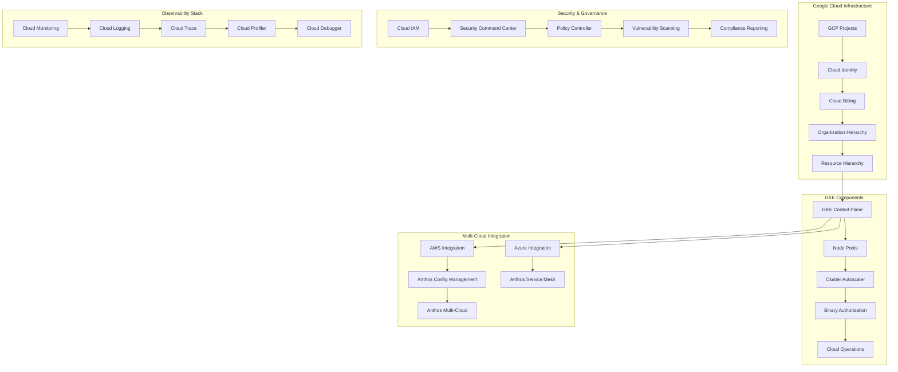

# Google GKE (Google Kubernetes Engine) Enterprise Multi-Cloud Management 深度实践

> **Author**: Multi-Cloud Platform Architect | **Version**: v1.0 | **Update Time**: 2026-02-07
> **Scenario**: Enterprise-grade multi-cloud Kubernetes management with Google GKE | **Complexity**: ⭐⭐⭐⭐

## 🎯 Abstract

This document provides comprehensive exploration of Google GKE enterprise deployment architecture, multi-cloud management practices, and hybrid cloud integration strategies. Based on large-scale production environment experience, it offers complete technical guidance from cluster setup to cross-cloud governance, helping enterprises build unified, scalable Kubernetes platforms across Google Cloud, AWS, and Azure with integrated security, monitoring, and cost optimization capabilities.

## 1. GKE Enterprise Architecture

### 1.1 Core Component Architecture



### 1.2 Enterprise Deployment Architecture

```yaml
gke_enterprise_deployment:
  organization_structure:
    organization_id: "123456789012"
    folders:
      - name: "production"
        display_name: "Production Environment"
        billing_account: "billingAccounts/AAAAAA-BBBBBB-CCCCCC"
        
      - name: "non-production"
        display_name: "Non-Production Environments"
        billing_account: "billingAccounts/XXXXXX-YYYYYY-ZZZZZZ"
        
      - name: "platform"
        display_name: "Platform Services"
        billing_account: "billingAccounts/AAAAAA-BBBBBB-CCCCCC"
  
  project_organization:
    projects:
      - name: "gke-production"
        folder: "production"
        services:
          - "container.googleapis.com"
          - "compute.googleapis.com"
          - "cloudresourcemanager.googleapis.com"
          - "iam.googleapis.com"
          - "monitoring.googleapis.com"
          - "logging.googleapis.com"
        
      - name: "gke-staging"
        folder: "non-production"
        services:
          - "container.googleapis.com"
          - "compute.googleapis.com"
          - "cloudresourcemanager.googleapis.com"
        
      - name: "gke-platform"
        folder: "platform"
        services:
          - "anthos.googleapis.com"
          - "gkehub.googleapis.com"
          - "cloudasset.googleapis.com"
  
  cluster_configuration:
    production_cluster:
      name: "prod-gke-cluster"
      location: "us-central1"
      release_channel: "REGULAR"
      initial_node_count: 3
      autoscaling:
        enabled: true
        min_node_count: 3
        max_node_count: 50
      node_config:
        machine_type: "n1-standard-4"
        disk_size_gb: 100
        disk_type: "pd-ssd"
        image_type: "COS_CONTAINERD"
        service_account: "gke-node@project-id.iam.gserviceaccount.com"
        oauth_scopes:
          - "https://www.googleapis.com/auth/cloud-platform"
        labels:
          environment: "production"
          team: "platform"
        taints:
          - key: "dedicated"
            value: "production"
            effect: "NO_SCHEDULE"
      
      master_authorized_networks:
        enabled: true
        cidr_blocks:
          - cidr_block: "10.0.0.0/8"
            display_name: "Corporate Network"
          - cidr_block: "172.16.0.0/12"
            display_name: "VPN Network"
      
      private_cluster_config:
        enable_private_nodes: true
        enable_private_endpoint: false
        master_ipv4_cidr_block: "172.16.0.0/28"
      
      addons_config:
        http_load_balancing:
          disabled: false
        horizontal_pod_autoscaling:
          disabled: false
        network_policy_config:
          disabled: false
        cloud_run_config:
          disabled: true
```

## 2. Advanced Cluster Management

### 2.1 Multi-Region Cluster Setup

```bash
#!/bin/bash
# gke_multi_region_setup.sh

PROJECT_ID="gke-production"
CLUSTER_NAME="multi-region-cluster"

# 1. 创建多区域集群
gcloud container clusters create-auto $CLUSTER_NAME \
    --project=$PROJECT_ID \
    --region=us-central1 \
    --release-channel=regular \
    --enable-master-authorized-networks \
    --master-authorized-networks=10.0.0.0/8,172.16.0.0/12 \
    --enable-private-nodes \
    --enable-private-endpoint \
    --master-ipv4-cidr=172.16.0.0/28 \
    --enable-ip-alias \
    --network=default \
    --subnetwork=default \
    --cluster-secondary-range-name=pods \
    --services-secondary-range-name=services \
    --enable-autoscaling \
    --min-nodes=3 \
    --max-nodes=20 \
    --num-nodes=3 \
    --enable-autorepair \
    --enable-autoupgrade \
    --enable-shielded-nodes \
    --enable-binary-authorization \
    --enable-cloud-logging \
    --enable-cloud-monitoring \
    --workload-pool=$PROJECT_ID.svc.id.goog

# 2. 创建节点池
gcloud container node-pools create compute-pool \
    --project=$PROJECT_ID \
    --cluster=$CLUSTER_NAME \
    --region=us-central1 \
    --machine-type=n1-standard-4 \
    --disk-size=100 \
    --disk-type=pd-ssd \
    --image-type=COS_CONTAINERD \
    --num-nodes=3 \
    --enable-autoscaling \
    --min-nodes=3 \
    --max-nodes=15 \
    --enable-autorepair \
    --enable-autoupgrade \
    --shielded-secure-boot \
    --labels=environment=production,pool=compute

# 3. 创建专用节点池
gcloud container node-pools create high-memory-pool \
    --project=$PROJECT_ID \
    --cluster=$CLUSTER_NAME \
    --region=us-central1 \
    --machine-type=n1-highmem-8 \
    --disk-size=200 \
    --num-nodes=2 \
    --enable-autoscaling \
    --min-nodes=2 \
    --max-nodes=10 \
    --labels=environment=production,pool=memory-intensive
```

### 2.2 Cluster Configuration Management

```yaml
# cluster_config.yaml
apiVersion: container.cnrm.cloud.google.com/v1beta1
kind: ContainerCluster
metadata:
  name: production-cluster
  namespace: config-control
spec:
  location: us-central1
  initialNodeCount: 3
  releaseChannel:
    channel: REGULAR
  networkRef:
    name: default
  subnetworkRef:
    name: default
  ipAllocationPolicy:
    clusterSecondaryRangeName: pods
    servicesSecondaryRangeName: services
  privateClusterConfig:
    enablePrivateEndpoint: false
    enablePrivateNodes: true
    masterIpv4CidrBlock: 172.16.0.0/28
  masterAuthorizedNetworksConfig:
    cidrBlocks:
      - cidrBlock: 10.0.0.0/8
        displayName: Corporate Network
      - cidrBlock: 172.16.0.0/12
        displayName: VPN Network
  binaryAuthorization:
    evaluationMode: PROJECT_SINGLETON_POLICY_ENFORCE
  databaseEncryption:
    state: ENCRYPTED
    keyName: projects/project-id/locations/us-central1/keyRings/gke-keyring/cryptoKeys/gke-key
  defaultSnatStatus:
    disabled: true
  enableAutopilot: false
  enableBinaryAuthorization: true
  enableIntranodeVisibility: true
  enableKubernetesAlpha: false
  enableL4IlbSubsetting: true
  enableLegacyAbac: false
  enableShieldedNodes: true
  enableTpu: false
  loggingConfig:
    enableComponents:
      - SYSTEM_COMPONENTS
      - WORKLOADS
  monitoringConfig:
    enableComponents:
      - SYSTEM_COMPONENTS
  networkPolicy:
    enabled: true
    provider: CALICO
  notificationConfig:
    pubsub:
      enabled: true
      topic: projects/project-id/topics/gke-notifications
  resourceUsageExportConfig:
    bigqueryDestination:
      datasetId: gke_usage_dataset
    enableNetworkEgressMetering: true
    enableResourceConsumptionMetering: true
```

## 3. Multi-Cloud Integration

### 3.1 Anthos Multi-Cloud Setup

```bash
#!/bin/bash
# anthos_multicloud_setup.sh

PROJECT_ID="anthos-platform"
AWS_REGION="us-west-2"
AZURE_REGION="eastus"

# 1. 启用Anthos API
gcloud services enable \
    anthos.googleapis.com \
    gkemulticloud.googleapis.com \
    gkeconnect.googleapis.com \
    connectgateway.googleapis.com \
    cloudresourcemanager.googleapis.com

# 2. AWS多云集群配置
gcloud container aws clusters create aws-cluster \
    --project=$PROJECT_ID \
    --location=$AWS_REGION \
    --aws-region=$AWS_REGION \
    --control-plane-version=1.25.7-gke.1000 \
    --fleet-project=$PROJECT_ID \
    --admin-user-arns="arn:aws:iam::123456789012:user/admin" \
    --networking-service-address-cidr-blocks=172.20.0.0/16 \
    --networking-pod-address-cidr-blocks=10.40.0.0/14 \
    --networking-service-load-balancer-subnet-ids=subnet-12345 \
    --aws-services-subnet-ids=subnet-67890 \
    --database-encryption-kms-key-arn="arn:aws:kms:us-west-2:123456789012:key/abcd1234" \
    --iam-instance-profile="arn:aws:iam::123456789012:instance-profile/gke-node"

# 3. Azure多云集群配置
gcloud container azure clusters create azure-cluster \
    --project=$PROJECT_ID \
    --location=$AZURE_REGION \
    --azure-region=$AZURE_REGION \
    --control-plane-version=1.25.7-gke.1000 \
    --fleet-project=$PROJECT_ID \
    --network-path="azure-network" \
    --azure-services-subnet-id="/subscriptions/12345678-1234-1234-1234-123456789012/resourceGroups/rg/providers/Microsoft.Network/virtualNetworks/vnet/subnets/services" \
    --pod-address-cidr-blocks=10.40.0.0/14 \
    --service-address-cidr-blocks=172.20.0.0/16 \
    --replica-placements=zone-failure-domain=1,subnet-id="/subscriptions/12345678-1234-1234-1234-123456789012/resourceGroups/rg/providers/Microsoft.Network/virtualNetworks/vnet/subnets/pods-zone1"
```

### 3.2 Cross-Cloud Service Mesh

```yaml
# anthos_service_mesh.yaml
apiVersion: mesh.cloud.google.com/v1beta1
kind: Mesh
metadata:
  name: enterprise-mesh
  namespace: istio-system
spec:
  mtls:
    mode: STRICT
  trustDomain: "company.com"
  meshMemberships:
    - name: "projects/gke-production/locations/us-central1/memberships/gke-cluster"
    - name: "projects/anthos-platform/locations/aws-region/memberships/aws-cluster"
    - name: "projects/anthos-platform/locations/azure-region/memberships/azure-cluster"
  controlPlane:
    managed:
      location: "us-central1"
  revision: "asm-managed"
  channel: "rapid"

---
apiVersion: security.istio.io/v1beta1
kind: PeerAuthentication
metadata:
  name: default
  namespace: istio-system
spec:
  mtls:
    mode: STRICT

---
apiVersion: networking.istio.io/v1beta1
kind: VirtualService
metadata:
  name: cross-cloud-routing
  namespace: production
spec:
  hosts:
    - "api.company.com"
  gateways:
    - istio-system/ingressgateway
  http:
    - match:
        - headers:
            cloud:
              exact: "gcp"
      route:
        - destination:
            host: gke-service.production.svc.cluster.local
            port:
              number: 80
    - match:
        - headers:
            cloud:
              exact: "aws"
      route:
        - destination:
            host: aws-service.production.svc.cluster.local
            port:
              number: 80
    - match:
        - headers:
            cloud:
              exact: "azure"
      route:
        - destination:
            host: azure-service.production.svc.cluster.local
            port:
              number: 80
```

## 4. Security and Compliance

### 4.1 Advanced Security Configuration

```bash
#!/bin/bash
# gke_security_hardening.sh

PROJECT_ID="gke-production"
CLUSTER_NAME="prod-cluster"

# 1. 启用二进制授权
gcloud container clusters update $CLUSTER_NAME \
    --project=$PROJECT_ID \
    --region=us-central1 \
    --enable-binauthz

# 2. 配置网络安全策略
cat > network_policy.yaml << 'EOF'
apiVersion: networking.k8s.io/v1
kind: NetworkPolicy
metadata:
  name: default-deny
  namespace: production
spec:
  podSelector: {}
  policyTypes:
    - Ingress
    - Egress
---
apiVersion: networking.k8s.io/v1
kind: NetworkPolicy
metadata:
  name: allow-dns
  namespace: production
spec:
  podSelector: {}
  policyTypes:
    - Egress
  egress:
    - to:
        - namespaceSelector:
            matchLabels:
              name: kube-system
      ports:
        - protocol: UDP
          port: 53
        - protocol: TCP
          port: 53
EOF

# 3. 配置Pod安全策略
cat > pod_security_policy.yaml << 'EOF'
apiVersion: policy/v1beta1
kind: PodSecurityPolicy
metadata:
  name: restricted
  annotations:
    seccomp.security.alpha.kubernetes.io/allowedProfileNames: 'docker/default,runtime/default'
    apparmor.security.beta.kubernetes.io/allowedProfileNames: 'runtime/default'
    seccomp.security.alpha.kubernetes.io/defaultProfileName:  'runtime/default'
    apparmor.security.beta.kubernetes.io/defaultProfileName:  'runtime/default'
spec:
  privileged: false
  allowPrivilegeEscalation: false
  requiredDropCapabilities:
    - ALL
  volumes:
    - 'configMap'
    - 'emptyDir'
    - 'projected'
    - 'secret'
    - 'downwardAPI'
    - 'persistentVolumeClaim'
  hostNetwork: false
  hostIPC: false
  hostPID: false
  runAsUser:
    rule: 'MustRunAsNonRoot'
  seLinux:
    rule: 'RunAsAny'
  supplementalGroups:
    rule: 'MustRunAs'
    ranges:
      - min: 1
        max: 65535
  fsGroup:
    rule: 'MustRunAs'
    ranges:
      - min: 1
        max: 65535
  readOnlyRootFilesystem: true
EOF
```

### 4.2 Compliance and Audit Setup

```yaml
# compliance_config.yaml
apiVersion: securitycenter.googleapis.com/v1
kind: SecurityHealthAnalyticsCustomConfig
metadata:
  name: gke-compliance-rules
  namespace: security
spec:
  rules:
    - name: "require-private-clusters"
      description: "All GKE clusters must be private"
      severity: "HIGH"
      expression: "resource.type == 'gke_cluster' && resource.data.private_cluster_config.enable_private_nodes == false"
    
    - name: "require-master-authorized-networks"
      description: "Master authorized networks must be enabled"
      severity: "HIGH"
      expression: "resource.type == 'gke_cluster' && resource.data.master_authorized_networks_config.enabled == false"
    
    - name: "require-shielded-nodes"
      description: "Shielded nodes must be enabled"
      severity: "MEDIUM"
      expression: "resource.type == 'gke_cluster' && resource.data.shielded_nodes.enabled == false"
    
    - name: "require-binary-authorization"
      description: "Binary authorization must be enabled"
      severity: "HIGH"
      expression: "resource.type == 'gke_cluster' && resource.data.binary_authorization.enabled == false"

---
apiVersion: v1
kind: ConfigMap
metadata:
  name: compliance-audit-config
  namespace: audit
data:
  audit-policy.yaml: |
    apiVersion: audit.k8s.io/v1
    kind: Policy
    rules:
      - level: Metadata
        resources:
          - group: ""
            resources: ["pods", "services", "namespaces"]
      
      - level: Request
        resources:
          - group: "authorization.k8s.io"
            resources: ["subjectaccessreviews"]
      
      - level: RequestResponse
        resources:
          - group: ""
            resources: ["secrets"]
      
      - level: None
        users: ["system:kube-proxy"]
        verbs: ["watch"]
```

## 5. Cost Optimization and Management

### 5.1 Cost Monitoring Configuration

```bash
#!/bin/bash
# gke_cost_optimization.sh

PROJECT_ID="gke-production"

# 1. 启用计费导出
gcloud beta billing accounts link $PROJECT_ID \
    --billing-account="billingAccounts/AAAAAA-BBBBBB-CCCCCC"

# 2. 创建BigQuery数据集用于成本分析
bq mk --dataset $PROJECT_ID:gke_billing

# 3. 配置计费导出到BigQuery
gcloud beta billing accounts projects link $PROJECT_ID \
    --account-id="AAAAAA-BBBBBB-CCCCCC"

# 4. 创建成本优化策略
cat > cost_optimization_policy.yaml << 'EOF'
apiVersion: constraints.gatekeeper.sh/v1beta1
kind: K8sContainerRequests
metadata:
  name: container-cpu-memory-constraints
spec:
  match:
    kinds:
      - apiGroups: [""]
        kinds: ["Pod"]
  parameters:
    cpu: "500m"
    memory: "1Gi"
    limits:
      cpu: "2000m"
      memory: "4Gi"
EOF

# 5. 资源使用监控脚本
cat > resource_monitoring.sh << 'EOF'
#!/bin/bash

# 监控CPU和内存使用情况
monitor_resources() {
    echo "=== Resource Usage Report ==="
    echo "Timestamp: $(date)"
    
    # 节点资源使用
    echo -e "\nNode Resource Usage:"
    kubectl top nodes
    
    # Pod资源使用
    echo -e "\nTop Resource Consumers:"
    kubectl top pods --all-namespaces | head -20
    
    # 检查未使用的资源
    echo -e "\nPotentially Wasted Resources:"
    kubectl get pods --all-namespaces -o custom-columns=NAMESPACE:.metadata.namespace,NAME:.metadata.name,STATUS:.status.phase,CPU:.spec.containers[*].resources.requests.cpu,MEMORY:.spec.containers[*].resources.requests.memory | grep -E "(0m|0$|<none>)"
}

# 成本分析
analyze_costs() {
    echo -e "\n=== Cost Analysis ==="
    
    # 使用Cloud Billing API查询成本
    gcloud beta billing accounts get-iam-policy "AAAAAA-BBBBBB-CCCCCC" \
        --format="table(bindings.members, bindings.role)"
    
    # 查询最近的费用
    bq query --nouse_legacy_sql '
        SELECT 
            service.description as service,
            SUM(cost) as total_cost,
            SUM((SELECT SUM(amount) FROM UNNEST(credits))) as total_credit,
            SUM(cost) + SUM((SELECT SUM(amount) FROM UNNEST(credits))) as net_cost
        FROM `project-id.gke_billing.gcp_billing_export_v1_*`
        WHERE _TABLE_SUFFIX BETWEEN FORMAT_TIMESTAMP("%Y%m%d", DATE_SUB(CURRENT_DATE(), INTERVAL 30 DAY))
        AND FORMAT_TIMESTAMP("%Y%m%d", CURRENT_DATE())
        GROUP BY service
        ORDER BY net_cost DESC
        LIMIT 10
    '
}

monitor_resources
analyze_costs
EOF
```

### 5.2 Automated Scaling and Optimization

```yaml
# autoscaling_config.yaml
apiVersion: autoscaling.k8s.io/v1
kind: VerticalPodAutoscaler
metadata:
  name: app-vpa
  namespace: production
spec:
  targetRef:
    apiVersion: "apps/v1"
    kind: Deployment
    name: application-deployment
  updatePolicy:
    updateMode: "Auto"
  resourcePolicy:
    containerPolicies:
      - containerName: "application"
        minAllowed:
          cpu: "100m"
          memory: "256Mi"
        maxAllowed:
          cpu: "1000m"
          memory: "2Gi"
        controlledResources: ["cpu", "memory"]

---
apiVersion: autoscaling/v2
kind: HorizontalPodAutoscaler
metadata:
  name: application-hpa
  namespace: production
spec:
  scaleTargetRef:
    apiVersion: apps/v1
    kind: Deployment
    name: application-deployment
  minReplicas: 3
  maxReplicas: 50
  metrics:
    - type: Resource
      resource:
        name: cpu
        target:
          type: Utilization
          averageUtilization: 70
    - type: Resource
      resource:
        name: memory
        target:
          type: Utilization
          averageUtilization: 80
    - type: External
      external:
        metric:
          name: "queue_depth"
        target:
          type: Value
          value: "100"
```

## 6. Hybrid Cloud Networking

### 6.1 Cloud Interconnect Setup

```bash
#!/bin/bash
# hybrid_networking.sh

PROJECT_ID="gke-platform"

# 1. 创建Cloud Router
gcloud compute routers create hybrid-router \
    --project=$PROJECT_ID \
    --region=us-central1 \
    --network=default

# 2. 创建Cloud Interconnect附件
gcloud compute interconnects attachments partner create dc-interconnect \
    --project=$PROJECT_ID \
    --region=us-central1 \
    --router=hybrid-router \
    --mtu=1500 \
    --type=PARTNER

# 3. 配置BGP对等
cat > bgp_config.yaml << 'EOF'
apiVersion: compute.cnrm.cloud.google.com/v1beta1
kind: ComputeRouter
metadata:
  name: hybrid-router
  namespace: networking
spec:
  region: us-central1
  networkRef:
    name: default
  bgp:
    asn: 65001
    advertiseMode: CUSTOM
    advertisedGroups:
      - ALL_SUBNETS
    peers:
      - name: on-prem-router
        peerIpAddress: 169.254.0.1
        peerAsn: 65000
        interfaceName: if-google-1
        advertiseMode: CUSTOM
        advertisedRoutes:
          - prefix: 10.0.0.0/16
          - prefix: 172.16.0.0/16
EOF

# 4. 配置防火墙规则
gcloud compute firewall-rules create allow-hybrid-traffic \
    --project=$PROJECT_ID \
    --network=default \
    --allow=tcp:80,tcp:443,tcp:22 \
    --source-ranges=10.0.0.0/8,172.16.0.0/12 \
    --target-tags=gke-node
```

### 6.2 Multi-Cloud Load Balancing

```yaml
# multi_cloud_load_balancer.yaml
apiVersion: networking.gke.io/v1
kind: MultiClusterService
metadata:
  name: global-service
  namespace: production
spec:
  template:
    spec:
      selector:
        app: global-app
      ports:
        - name: http
          protocol: TCP
          port: 80
          targetPort: 8080

---
apiVersion: networking.gke.io/v1
kind: MultiClusterIngress
metadata:
  name: global-ingress
  namespace: production
spec:
  template:
    spec:
      rules:
        - host: "app.company.com"
          http:
            paths:
              - path: "/*"
                pathType: ImplementationSpecific
                backend:
                  service:
                    name: global-service
                    port:
                      number: 80
  clusters:
    - link: "projects/gke-production/locations/us-central1/clusters/prod-cluster"
    - link: "projects/anthos-platform/locations/aws-region/clusters/aws-cluster"
    - link: "projects/anthos-platform/locations/azure-region/clusters/azure-cluster"
```

## 7. Disaster Recovery and Backup

### 7.1 Backup Configuration

```bash
#!/bin/bash
# gke_backup_restore.sh

PROJECT_ID="gke-production"
CLUSTER_NAME="prod-cluster"
BACKUP_BUCKET="gke-backups-company"

# 1. 启用备份API
gcloud services enable gkebackup.googleapis.com

# 2. 创建备份计划
gcloud container backup-restore backup-plans create daily-backup \
    --project=$PROJECT_ID \
    --location=us-central1 \
    --cluster=$CLUSTER_NAME \
    --all-namespaces \
    --include-volume-data \
    --retention-period=30d \
    --cron-schedule="0 2 * * *"

# 3. 手动创建备份
gcloud container backup-restore backups create manual-backup-$(date +%Y%m%d) \
    --project=$PROJECT_ID \
    --location=us-central1 \
    --backup-plan=daily-backup

# 4. 验证备份
gcloud container backup-restore backups list \
    --project=$PROJECT_ID \
    --location=us-central1 \
    --backup-plan=daily-backup

# 5. 恢复脚本
cat > restore_cluster.sh << 'EOF'
#!/bin/bash

PROJECT_ID="gke-production"
LOCATION="us-central1"
BACKUP_NAME=$1
RESTORE_CLUSTER=$2

if [ -z "$BACKUP_NAME" ] || [ -z "$RESTORE_CLUSTER" ]; then
    echo "Usage: $0 <backup-name> <restore-cluster-name>"
    exit 1
fi

# 创建恢复操作
gcloud container backup-restore restores create restore-$(date +%Y%m%d-%H%M%S) \
    --project=$PROJECT_ID \
    --location=$LOCATION \
    --backup-plan=daily-backup \
    --backup=$BACKUP_NAME \
    --cluster=$RESTORE_CLUSTER \
    --namespaces="production,staging" \
    --volume-data-restore-policy=RESTORE_VOLUME_DATA_FROM_BACKUP

echo "Restore operation initiated for backup: $BACKUP_NAME"
echo "Restore cluster: $RESTORE_CLUSTER"
EOF
```

### 7.2 Cross-Region Failover

```yaml
# cross_region_failover.yaml
apiVersion: v1
kind: ConfigMap
metadata:
  name: failover-config
  namespace: disaster-recovery
data:
  failover-policy.yaml: |
    apiVersion: dr.backuprestore.gke.io/v1alpha1
    kind: FailoverPolicy
    metadata:
      name: cross-region-failover
    spec:
      primaryRegion: us-central1
      secondaryRegions:
        - us-west1
        - us-east1
      failoverConditions:
        - type: ClusterUnhealthy
          threshold: 5m
        - type: RegionOutage
          threshold: 10m
      recoveryTimeObjective: 15m
      recoveryPointObjective: 5m
      automatedFailover: true
      testSchedule: "0 0 * * 0"  # Weekly tests

---
apiVersion: batch/v1
kind: CronJob
metadata:
  name: failover-test
  namespace: disaster-recovery
spec:
  schedule: "0 0 * * 0"
  jobTemplate:
    spec:
      template:
        spec:
          containers:
            - name: failover-test
              image: gcr.io/google-samples/failover-tester:latest
              env:
                - name: PRIMARY_CLUSTER
                  value: "projects/gke-production/locations/us-central1/clusters/prod-cluster"
                - name: SECONDARY_CLUSTER
                  value: "projects/gke-production/locations/us-west1/clusters/backup-cluster"
              command:
                - "/bin/sh"
                - "-c"
                - |
                  echo "Starting failover test..."
                  # 执行故障转移测试逻辑
                  kubectl config use-context $SECONDARY_CLUSTER
                  kubectl apply -f test-workloads.yaml
                  sleep 300
                  kubectl delete -f test-workloads.yaml
                  echo "Failover test completed"
          restartPolicy: OnFailure
```

---
*This document is based on enterprise-level Google GKE practice experience and continuously updated with the latest technologies and best practices.*