# IBM Cloud Kubernetes Service (IKS) 企业级深度实践

## 概述

IBM Cloud Kubernetes Service (IKS) 是 IBM Cloud 握供的托管 Kubernetes 服务，结合了 IBM 在企业级计算领域的深厚积累与 Red Hat OpenShift 的开源生态优势。IKS 深度集成 IBM Watson AI 服务、Cloud Pak 数据平台和 Satellite 混合云架构，为金融、医疗、制造等受监管行业提供合规、安全的容器化平台。IBM 在 2024 年完成对 HashiCorp 的收购后，进一步强化了多云基础设施管理能力。

在多云架构中，IKS 通过 IBM Cloud Satellite 实现跨本地数据中心和其他云平台的统一管理，通过 Red Hat OpenShift 提供一致的开发者体验。IKS 的 VPC Gen2 基础设施基于 IBM 自研的网络虚拟化技术，提供高性能的软件定义网络。Key Protect 和 Secrets Manager 提供 FIPS 140-2 Level 3 密钥管理，Security and Compliance Center 提供持续合规监控和自动修复能力，满足金融和医疗等高合规行业的严格要求。

本文档从生产环境运维专家角度，深入探讨 IKS 的企业级部署架构、Watson AI 服务集成、Satellite 混合云和运维管理最佳实践。内容涵盖完整的 VPC 网络配置、存储类定义、安全策略、监控告警规则和运维自动化脚本，为企业构建基于 IBM Cloud 的生产级 Kubernetes 平台提供全面参考。

### IKS 核心特性

| 特性 | 说明 | 适用场景 |
|:---|:---|:---|
| IBM Cloud Satellite | 统一管理本地、边缘和其他云上的 Kubernetes 集群 | 混合云、边缘计算 |
| Watson AI 集成 | 原生集成 Watson Assistant、NLU、Speech 等 AI 服务 | AI 赋能应用 |
| Cloud Pak 支持 | 预集成 Cloud Pak for Data、Security、Integration | 企业级数据平台 |
| Key Protect 加密 | FIPS 140-2 Level 3 密钥管理 | 金融、医疗合规 |
| Security and Compliance Center | 持续合规监控和自动修复 | 监管合规 |
| VPC Gen2 基础设施 | 第二代虚拟私有云，SR-IOV 网络加速 | 高性能计算 |
| Red Hat OpenShift | 企业级 Kubernetes 发行版，含开发者工具链 | 企业 DevOps |
| Code Engine | 基于 Knative 的 Serverless 容器运行时 | 事件驱动、突发工作负载 |

## 架构设计

### IKS 企业架构总览

```mermaid
graph TB
    subgraph "IBM Cloud 基础设施"
        ACCOUNT[Cloud Account] --> RG[Resource Groups]
        RG --> VPC[VPC Gen2]
        VPC --> SUB_A[子网 AZ1]
        VPC --> SUB_B[子网 AZ2]
        VPC --> SUB_C[子网 AZ3]
        RG --> IKS_PROD[IKS Production Cluster]
        RG --> IKS_STG[IKS Staging Cluster]
        RG --> ICR[IBM Container Registry]
        RG --> KP[Key Protect]
        RG --> COS[Cloud Object Storage]
        RG --> LOGS[Log Analysis]
        RG --> MON[Cloud Monitoring]
        RG --> SM[Secrets Manager]
    end

    subgraph "IKS 集群组件"
        IKS_PROD --> MASTERS[Kubernetes Master<br/>IBM 管理 HA]
        IKS_PROD --> WORKERS[Worker Nodes<br/>VPC Gen2]
        IKS_PROD --> ALB[Application Load Balancer]
        IKS_PROD --> ISTIO[Managed Istio]
        IKS_PROD --> VOLUME[Storage Classes]
        IKS_PROD --> INGRESS[Ingress Controller]
    end

    subgraph "IBM Cloud 服务集成"
        WATSON[Watson AI Services]
        CLOUDDB[Cloud Databases<br/>PostgreSQL/Redis/MongoDB]
        EVENTSTREAMS[Event Streams<br/>Kafka]
        APPCONFIG[App Configuration]
        MESSAGEHub[Message Hub]
        CLOUDANT[Cloudant NoSQL]
    end

    subgraph "混合云 - Satellite"
        SAT[Satellite Location] --> ONPREM[On-Premises Hosts]
        SAT --> EDGE[Edge Locations]
        SAT --> AWS_HOST[AWS Hosts]
        SAT --> AZURE_HOST[Azure Hosts]
        SAT --> SAT_SVC[Satellite Services<br/>DB/MQ/Monitoring]
    end

    subgraph "Red Hat 集成"
        ROKS[Red Hat OpenShift]
        CLOUDPAK[Cloud Paks]
        QUAY[Quay Registry]
        OPENSHIFT[OpenShift GitOps]
    end

    subgraph "安全与治理"
        SCC[Security and<br/>Compliance Center]
        IAM[Cloud IAM]
        CERT[Certificate Manager]
        HPCS[HPCS 加密]
        ACTIVITY[Activity Tracker]
    end

    IKS_PROD --> WATSON
    IKS_PROD --> CLOUDDB
    IKS_PROD --> COS
    IKS_PROD --> SAT
    SAT --> ROKS
    ROKS --> CLOUDPAK
    IKS_PROD --> SCC
    IKS_PROD --> KP
    IKS_PROD --> SM
    MASTERS --> ALB
    WORKERS --> INGRESS
```



### Terraform 基础设施部署

```hcl
terraform {
  required_version = ">= 1.5"
  required_providers {
    ibm = {
      source  = "IBM-Cloud/ibm"
      version = "~> 1.70"
    }
  }

  backend "cos" {
    bucket     = "terraform-state-production"
    region     = "us-south"
    key        = "iks-infrastructure"
  }
}

variable "resource_group" {
  description = "Resource group name"
  type        = string
  default     = "production-rg"
}

variable "region" {
  description = "IBM Cloud region"
  type        = string
  default     = "us-south"
}

variable "cluster_name" {
  description = "IKS cluster name"
  type        = string
  default     = "prod-iks-cluster"
}

resource "ibm_resource_group" "production" {
  name = var.resource_group
}

resource "ibm_is_vpc" "production_vpc" {
  name           = "production-vpc"
  resource_group = ibm_resource_group.production.id
  region         = var.region

  address_prefix_management = "auto"
  default_network_acl_name  = "production-acl"
  default_security_group_name = "production-sg"
  default_routing_table_name  = "production-rt"
}

resource "ibm_is_subnet" "subnet_a" {
  name            = "prod-subnet-a"
  resource_group  = ibm_resource_group.production.id
  vpc             = ibm_is_vpc.production_vpc.id
  zone            = "${var.region}-1"
  ipv4_cidr_block = "10.0.1.0/24"
}

resource "ibm_is_subnet" "subnet_b" {
  name            = "prod-subnet-b"
  resource_group  = ibm_resource_group.production.id
  vpc             = ibm_is_vpc.production_vpc.id
  zone            = "${var.region}-2"
  ipv4_cidr_block = "10.0.2.0/24"
}

resource "ibm_is_subnet" "subnet_c" {
  name            = "prod-subnet-c"
  resource_group  = ibm_resource_group.production.id
  vpc             = ibm_is_vpc.production_vpc.id
  zone            = "${var.region}-3"
  ipv4_cidr_block = "10.0.3.0/24"
}

resource "ibm_is_security_group_rule" "allow_internal_tcp" {
  group     = ibm_is_vpc.production_vpc.default_security_group
  direction = "inbound"
  remote    = "10.0.0.0/8"

  tcp {
    port_min = 1
    port_max = 65535
  }
}

resource "ibm_is_security_group_rule" "allow_internal_udp" {
  group     = ibm_is_vpc.production_vpc.default_security_group
  direction = "inbound"
  remote    = "10.0.0.0/8"

  udp {
    port_min = 1
    port_max = 65535
  }
}

resource "ibm_is_security_group_rule" "allow_https" {
  group     = ibm_is_vpc.production_vpc.default_security_group
  direction = "inbound"
  remote    = "0.0.0.0/0"

  tcp {
    port_min = 443
    port_max = 443
  }
}

resource "ibm_is_security_group_rule" "allow_health_checks" {
  group     = ibm_is_vpc.production_vpc.default_security_group
  direction = "inbound"
  remote    = "161.26.0.0/16"

  tcp {
    port_min = 1
    port_max = 65535
  }
}

resource "ibm_container_cluster" "production" {
  name              = var.cluster_name
  resource_group_id = ibm_resource_group.production.id
  region            = var.region

  kube_version    = "1.30"
  flavor          = "bx2.4x16"
  workers_count   = 3

  vpc_id          = ibm_is_vpc.production_vpc.id
  worker_zones {
    id         = "${var.region}-1"
    subnet_id  = ibm_is_subnet.subnet_a.id
  }
  worker_zones {
    id         = "${var.region}-2"
    subnet_id  = ibm_is_subnet.subnet_b.id
  }
  worker_zones {
    id         = "${var.region}-3"
    subnet_id  = ibm_is_subnet.subnet_c.id
  }

  private_service_endpoint = true
  public_service_endpoint  = true

  disable_public_service_endpoint = false

  apiversion            = "v2"
  pod_subnet            = "172.30.0.0/16"
  service_subnet        = "172.21.0.0/16"

  wait_till             = "MasterNodeReady"
  force_delete_storage  = false

  tags = [
    "environment:production",
    "team:platform",
    "costcenter:engineering"
  ]
}

resource "ibm_container_worker_pool" "compute_pool" {
  cluster          = ibm_container_cluster.production.id
  worker_pool_name = "compute-pool"
  flavor           = "bx2.8x32"
  size_per_zone    = 3
  resource_group_id = ibm_resource_group.production.id

  labels = {
    "pool"        = "compute"
    "environment" = "production"
  }

  zones {
    name      = "${var.region}-1"
    subnet_id = ibm_is_subnet.subnet_a.id
  }
  zones {
    name      = "${var.region}-2"
    subnet_id = ibm_is_subnet.subnet_b.id
  }
  zones {
    name      = "${var.region}-3"
    subnet_id = ibm_is_subnet.subnet_c.id
  }

  autoscale {
    enabled     = true
    min         = 3
    max         = 30
  }
}

resource "ibm_container_worker_pool" "memory_pool" {
  cluster          = ibm_container_cluster.production.id
  worker_pool_name = "memory-pool"
  flavor           = "mx2.16x128"
  size_per_zone    = 2
  resource_group_id = ibm_resource_group.production.id

  labels = {
    "pool"        = "memory-intensive"
    "environment" = "production"
  }

  zones {
    name      = "${var.region}-1"
    subnet_id = ibm_is_subnet.subnet_a.id
  }
  zones {
    name      = "${var.region}-2"
    subnet_id = ibm_is_subnet.subnet_b.id
  }
  zones {
    name      = "${var.region}-3"
    subnet_id = ibm_is_subnet.subnet_c.id
  }

  autoscale {
    enabled     = true
    min         = 2
    max         = 15
  }
}

resource "ibm_container_worker_pool" "gpu_pool" {
  cluster          = ibm_container_cluster.production.id
  worker_pool_name = "gpu-pool"
  flavor           = "gx2.16x128x1v100"
  size_per_zone    = 1
  resource_group_id = ibm_resource_group.production.id

  labels = {
    "pool"        = "gpu"
    "accelerator" = "nvidia"
    "environment" = "production"
  }

  zones {
    name      = "${var.region}-1"
    subnet_id = ibm_is_subnet.subnet_a.id
  }

  autoscale {
    enabled     = true
    min         = 0
    max         = 10
  }
}

resource "ibm_container_bind_service" "watson_assistant_binding" {
  cluster_name                 = ibm_container_cluster.production.id
  resource_group_id            = ibm_resource_group.production.id
  service_instance_name        = "watson-assistant"
  namespace_id                 = "production"
  role                         = "Manager"
}

resource "ibm_container_bind_service" "cloud_logs_binding" {
  cluster_name                 = ibm_container_cluster.production.id
  resource_group_id            = ibm_resource_group.production.id
  service_instance_name        = "production-logs"
  namespace_id                 = "production"
  role                         = "Manager"
}

output "cluster_id" {
  value = ibm_container_cluster.production.id
}

output "cluster_name" {
  value = ibm_container_cluster.production.name
}

output "vpc_id" {
  value = ibm_is_vpc.production_vpc.id
}
```

### 企业级集群部署脚本

```bash
#!/bin/bash
set -euo pipefail

RESOURCE_GROUP="production-rg"
CLUSTER_NAME="prod-iks-cluster"
REGION="us-south"

echo "=== IBM Cloud IKS 企业级集群部署 ==="
echo "时间: $(date '+%Y-%m-%d %H:%M:%S')"

echo "[1] 登录 IBM Cloud"
ibmcloud login --apikey @${IBM_CLOUD_API_KEY} -r $REGION -g $RESOURCE_GROUP

echo "[2] 创建 VPC 基础设施"
VPC_ID=$(ibmcloud is vpc-create production-vpc --resource-group-name $RESOURCE_GROUP --output json | jq -r '.id')
echo "VPC ID: $VPC_ID"

echo "[3] 创建子网"
SUBNET_A_ID=$(ibmcloud is subnet-create prod-subnet-a $VPC_ID $REGION-1 --ipv4-cidr-block 10.0.1.0/24 --resource-group-name $RESOURCE_GROUP --output json | jq -r '.id')
SUBNET_B_ID=$(ibmcloud is subnet-create prod-subnet-b $VPC_ID $REGION-2 --ipv4-cidr-block 10.0.2.0/24 --resource-group-name $RESOURCE_GROUP --output json | jq -r '.id')
SUBNET_C_ID=$(ibmcloud is subnet-create prod-subnet-c $VPC_ID $REGION-3 --ipv4-cidr-block 10.0.3.0/24 --resource-group-name $RESOURCE_GROUP --output json | jq -r '.id')

echo "[4] 创建多区域 VPC 集群"
ibmcloud ks cluster create vpc-gen2 \
    --name $CLUSTER_NAME \
    --resource-group $RESOURCE_GROUP \
    --zone $REGION-1 \
    --zone $REGION-2 \
    --zone $REGION-3 \
    --vpc-id $VPC_ID \
    --subnet-id $SUBNET_A_ID \
    --subnet-id $SUBNET_B_ID \
    --subnet-id $SUBNET_C_ID \
    --kube-version 1.30 \
    --flavor bx2.4x16 \
    --workers 3 \
    --private-service-endpoint \
    --public-service-endpoint \
    --disable-auto-update \
    --enable-satellite-config

echo "[5] 等待集群就绪..."
while true; do
    STATE=$(ibmcloud ks cluster get --cluster $CLUSTER_NAME --output json | jq -r '.state')
    echo "集群状态: $STATE"
    if [[ "$STATE" == "normal" ]]; then
        break
    fi
    sleep 60
done

echo "[6] 创建计算节点池"
ibmcloud ks worker-pool create vpc-gen2 \
    --name compute-pool \
    --cluster $CLUSTER_NAME \
    --flavor bx2.8x32 \
    --size-per-zone 3 \
    --labels "pool=compute,environment=production"

echo "[7] 创建内存优化节点池"
ibmcloud ks worker-pool create vpc-gen2 \
    --name memory-pool \
    --cluster $CLUSTER_NAME \
    --flavor mx2.16x128 \
    --size-per-zone 2 \
    --labels "pool=memory-intensive,environment=production"

echo "[8] 创建 GPU 节点池"
ibmcloud ks worker-pool create vpc-gen2 \
    --name gpu-pool \
    --cluster $CLUSTER_NAME \
    --flavor gx2.16x128x1v100 \
    --size-per-zone 1 \
    --labels "pool=gpu,accelerator=nvidia,environment=production"

echo "[9] 启用集群附加组件"
ibmcloud ks cluster addon enable istio --cluster $CLUSTER_NAME --version 1.20
ibmcloud ks cluster addon enable alb --cluster $CLUSTER_NAME
ibmcloud ks cluster addon enable cloud-provider-storage --cluster $CLUSTER_NAME

echo "[10] 配置 kubectl"
ibmcloud ks cluster config --cluster $CLUSTER_NAME --admin

echo "[11] 验证集群"
ibmcloud ks cluster get --cluster $CLUSTER_NAME
ibmcloud ks workers --cluster $CLUSTER_NAME
kubectl get nodes -o wide

echo "=== IKS 集群部署完成 ==="
```

## 核心组件配置

### 存储类配置

```yaml
apiVersion: storage.k8s.io/v1
kind: StorageClass
metadata:
  name: ibmc-vpc-block-10iops-tier
  annotations:
    storageclass.kubernetes.io/is-default-class: "true"
provisioner: vpc.block.csi.ibm.io
volumeBindingMode: WaitForFirstConsumer
allowVolumeExpansion: true
reclaimPolicy: Retain
parameters:
    profile: "10iops-tier"
    encrypted: "true"
---
apiVersion: storage.k8s.io/v1
kind: StorageClass
metadata:
  name: ibmc-vpc-block-5iops-tier
provisioner: vpc.block.csi.ibm.io
volumeBindingMode: WaitForFirstConsumer
allowVolumeExpansion: true
parameters:
    profile: "5iops-tier"
    encrypted: "true"
---
apiVersion: storage.k8s.io/v1
kind: StorageClass
metadata:
  name: ibmc-vpc-block-custom
provisioner: vpc.block.csi.ibm.io
volumeBindingMode: WaitForFirstConsumer
allowVolumeExpansion: true
parameters:
    profile: "custom"
    iops: "5000"
    encrypted: "true"
---
apiVersion: storage.k8s.io/v1
kind: StorageClass
metadata:
  name: ibmc-vpc-file-standard
provisioner: vpc.file.csi.ibm.io
volumeBindingMode: WaitForFirstConsumer
parameters:
    profile: "tier1"
---
apiVersion: storage.k8s.io/v1
kind: StorageClass
metadata:
  name: ibmc-vpc-file-performance
provisioner: vpc.file.csi.ibm.io
volumeBindingMode: WaitForFirstConsumer
parameters:
    profile: "tier3"
    iops: "3000"
---
apiVersion: storage.k8s.io/v1
kind: StorageClass
metadata:
  name: ibmc-vpc-object
provisioner: s3f.csi.ibm.com
reclaimPolicy: Delete
parameters:
    accessKey: "${AWS_ACCESS_KEY_ID}"
    secretKey: "${AWS_SECRET_ACCESS_KEY}"
    endpoint: "s3.us.cloud-object-storage.appdomain.cloud"
    bucket: "production-object-bucket"
    region: "us-south"
```

### Watson AI 服务集成

```bash
#!/bin/bash
set -euo pipefail

RESOURCE_GROUP="platform-rg"
CLUSTER_NAME="prod-iks-cluster"

echo "=== Watson AI 服务集成 ==="
echo "时间: $(date '+%Y-%m-%d %H:%M:%S')"

echo "[1] 创建 Watson AI 服务实例"
ibmcloud resource service-instance-create watson-assistant \
    assistant standard $RESOURCE_GROUP \
    --service-endpoints public-and-private

ibmcloud resource service-instance-create watson-nlu \
    natural-language-understanding standard $RESOURCE_GROUP

ibmcloud resource service-instance-create watson-discovery \
    discovery standard $RESOURCE_GROUP

ibmcloud resource service-instance-create watson-speech-to-text \
    speech-to-text standard $RESOURCE_GROUP

ibmcloud resource service-instance-create watson-text-to-speech \
    text-to-speech standard $RESOURCE_GROUP

echo "[2] 创建服务凭证"
ibmcloud resource service-key-create watson-assistant-creds Manager \
    --instance-name watson-assistant

ibmcloud resource service-key-create watson-nlu-creds Manager \
    --instance-name watson-nlu

echo "[3] 绑定服务到集群"
ibmcloud ks cluster service bind --cluster $CLUSTER_NAME \
    --namespace production \
    --service watson-assistant

ibmcloud ks cluster service bind --cluster $CLUSTER_NAME \
    --namespace production \
    --service watson-nlu

ibmcloud ks cluster service bind --cluster $CLUSTER_NAME \
    --namespace production \
    --service watson-discovery

echo "[4] 验证服务绑定"
kubectl get secrets -n production -l 'service-binding in (watson-assistant,watson-nlu,watson-discovery)'

echo "=== Watson AI 服务集成完成 ==="
```

### AI 应用完整部署

```yaml
apiVersion: apps/v1
kind: Deployment
metadata:
  name: ai-chatbot
  namespace: production
  labels:
    app: ai-chatbot
    version: v2.0
spec:
  replicas: 3
  selector:
    matchLabels:
      app: ai-chatbot
  strategy:
    type: RollingUpdate
    rollingUpdate:
      maxSurge: 1
      maxUnavailable: 0
  template:
    metadata:
      labels:
        app: ai-chatbot
        version: v2.0
    spec:
      containers:
      - name: chatbot
        image: icr.io/namespace/ai-chatbot:v2.0
        env:
        - name: WATSON_ASSISTANT_APIKEY
          valueFrom:
            secretKeyRef:
              name: binding-watson-assistant
              key: apikey
        - name: WATSON_ASSISTANT_URL
          valueFrom:
            secretKeyRef:
              name: binding-watson-assistant
              key: url
        - name: WATSON_ASSISTANT_ID
          valueFrom:
            secretKeyRef:
              name: binding-watson-assistant
              key: assistant_id
        - name: WATSON_NLU_APIKEY
          valueFrom:
            secretKeyRef:
              name: binding-watson-nlu
              key: apikey
        - name: WATSON_NLU_URL
          valueFrom:
            secretKeyRef:
              name: binding-watson-nlu
              key: url
        - name: LOG_LEVEL
          value: "info"
        - name: APP_PORT
          value: "8080"
        resources:
          requests:
            cpu: "500m"
            memory: "1Gi"
          limits:
            cpu: "1000m"
            memory: "2Gi"
        ports:
        - containerPort: 8080
          protocol: TCP
        livenessProbe:
          httpGet:
            path: /healthz
            port: 8080
          initialDelaySeconds: 15
          periodSeconds: 10
          timeoutSeconds: 5
          failureThreshold: 3
        readinessProbe:
          httpGet:
            path: /readyz
            port: 8080
          initialDelaySeconds: 5
          periodSeconds: 5
          timeoutSeconds: 3
          failureThreshold: 3
        volumeMounts:
        - name: config-volume
          mountPath: /etc/app/config
      volumes:
      - name: config-volume
        configMap:
          name: chatbot-config
      topologySpreadConstraints:
      - maxSkew: 1
        topologyKey: topology.kubernetes.io/zone
        whenUnsatisfiable: DoNotSchedule
        labelSelector:
          matchLabels:
            app: ai-chatbot
---
apiVersion: v1
kind: ConfigMap
metadata:
  name: chatbot-config
  namespace: production
data:
  config.yaml: |
    watson:
      assistant:
        timeout: 30s
        retry_max: 3
      nlu:
        features:
          - sentiment
          - emotion
          - keywords
          - entities
    logging:
      level: info
      format: json
    server:
      port: 8080
      timeout: 60s
---
apiVersion: v1
kind: Service
metadata:
  name: ai-chatbot-service
  namespace: production
  annotations:
    service.kubernetes.io/ibm-load-balancer-cloud-provider-ip: "private"
spec:
  selector:
    app: ai-chatbot
  ports:
  - protocol: TCP
    port: 80
    targetPort: 8080
  type: ClusterIP
---
apiVersion: networking.k8s.io/v1
kind: Ingress
metadata:
  name: ai-chatbot-ingress
  namespace: production
  annotations:
    nginx.ingress.kubernetes.io/ssl-redirect: "true"
    nginx.ingress.kubernetes.io/proxy-body-size: "10m"
    nginx.ingress.kubernetes.io/proxy-read-timeout: "120"
    nginx.ingress.kubernetes.io/proxy-send-timeout: "120"
    nginx.ingress.kubernetes.io/websocket-services: "ai-chatbot-service"
spec:
  tls:
  - hosts:
    - chatbot.example.com
    secretName: chatbot-tls
  rules:
  - host: chatbot.example.com
    http:
      paths:
      - path: /
        pathType: Prefix
        backend:
          service:
            name: ai-chatbot-service
            port:
              number: 80
---
apiVersion: autoscaling/v2
kind: HorizontalPodAutoscaler
metadata:
  name: ai-chatbot-hpa
  namespace: production
spec:
  scaleTargetRef:
    apiVersion: apps/v1
    kind: Deployment
    name: ai-chatbot
  minReplicas: 3
  maxReplicas: 20
  metrics:
  - type: Resource
    resource:
      name: cpu
      target:
        type: Utilization
        averageUtilization: 70
  - type: Resource
    resource:
      name: memory
      target:
        type: Utilization
        averageUtilization: 80
---
apiVersion: policy/v1
kind: PodDisruptionBudget
metadata:
  name: ai-chatbot-pdb
  namespace: production
spec:
  minAvailable: "66%"
  selector:
    matchLabels:
      app: ai-chatbot
```

### Cloud Database 集成

```yaml
apiVersion: apps/v1
kind: Deployment
metadata:
  name: database-app
  namespace: production
spec:
  replicas: 3
  selector:
    matchLabels:
      app: database-app
  template:
    metadata:
      labels:
        app: database-app
    spec:
      containers:
      - name: app
        image: icr.io/namespace/database-app:latest
        env:
        - name: DB_USERNAME
          valueFrom:
            secretKeyRef:
              name: binding-databases-for-postgresql
              key: username
        - name: DB_PASSWORD
          valueFrom:
            secretKeyRef:
              name: binding-databases-for-postgresql
              key: password
        - name: DB_HOST
          valueFrom:
            secretKeyRef:
              name: binding-databases-for-postgresql
              key: host
        - name: DB_PORT
          valueFrom:
            secretKeyRef:
              name: binding-databases-for-postgresql
              key: port
        - name: DB_NAME
          valueFrom:
            secretKeyRef:
              name: binding-databases-for-postgresql
              key: database
        - name: DB_SSL_MODE
          value: "verify-full"
        - name: DB_CONNECTION_POOL_SIZE
          value: "20"
        resources:
          requests:
            cpu: "250m"
            memory: "512Mi"
          limits:
            cpu: "500m"
            memory: "1Gi"
        ports:
        - containerPort: 8080
        livenessProbe:
          httpGet:
            path: /healthz
            port: 8080
          initialDelaySeconds: 20
          periodSeconds: 10
        readinessProbe:
          httpGet:
            path: /readyz
            port: 8080
          initialDelaySeconds: 10
          periodSeconds: 5
```

## 安全配置

### Key Protect 加密集成

```bash
#!/bin/bash
set -euo pipefail

CLUSTER_NAME="prod-iks-cluster"
RESOURCE_GROUP="production-rg"

echo "=== Key Protect 安全配置 ==="

echo "[1] 创建 Key Protect 实例"
ibmcloud resource service-instance-create \
    enterprise-kp kms premium $RESOURCE_GROUP \
    --service-endpoints private

KP_INSTANCE_ID=$(ibmcloud resource service-instances --output json | \
    jq -r '.[] | select(.name=="enterprise-kp") | .guid')

echo "[2] 创建根密钥"
ibmcloud kp create \
    --instance-id $KP_INSTANCE_ID \
    --key-type root \
    --key-name iks-root-key \
    --algorithm AES_256

echo "[3] 创建数据加密密钥"
ibmcloud kp create \
    --instance-id $KP_INSTANCE_ID \
    --key-type standard \
    --key-name iks-data-key \
    --algorithm AES_256 \
    --root-key iks-root-key

echo "[4] 启用集群 etcd 加密"
ibmcloud ks cluster kms enable \
    --cluster $CLUSTER_NAME \
    --kms-instance-id $KP_INSTANCE_ID \
    --kms-name enterprise-kp \
    --key-id $(ibmcloud kp list --instance-id $KP_INSTANCE_ID --output json | jq -r '.[0].id')

echo "[5] 配置 Secrets Manager"
ibmcloud resource service-instance-create \
    enterprise-sm secrets-manager standard $RESOURCE_GROUP \
    --service-endpoints private

echo "[6] 验证加密状态"
ibmcloud ks cluster get --cluster $CLUSTER_NAME --output json | \
    jq '.kmsConfig'
```

### 网络安全策略

```yaml
apiVersion: networking.k8s.io/v1
kind: NetworkPolicy
metadata:
  name: default-deny-all
  namespace: production
spec:
  podSelector: {}
  policyTypes:
  - Ingress
  - Egress
---
apiVersion: networking.k8s.io/v1
kind: NetworkPolicy
metadata:
  name: allow-dns-egress
  namespace: production
spec:
  podSelector: {}
  policyTypes:
  - Egress
  egress:
  - to:
    - namespaceSelector:
        matchLabels:
          name: kube-system
    ports:
    - protocol: UDP
      port: 53
    - protocol: TCP
      port: 53
---
apiVersion: networking.k8s.io/v1
kind: NetworkPolicy
metadata:
  name: allow-frontend-to-backend
  namespace: production
spec:
  podSelector:
    matchLabels:
      app: backend
  policyTypes:
  - Ingress
  ingress:
  - from:
    - podSelector:
        matchLabels:
          app: frontend
    ports:
    - protocol: TCP
      port: 8080
---
apiVersion: networking.k8s.io/v1
kind: NetworkPolicy
metadata:
  name: allow-backend-to-db
  namespace: production
spec:
  podSelector:
    matchLabels:
      app: database
  policyTypes:
  - Ingress
  ingress:
  - from:
    - podSelector:
        matchLabels:
          app: backend
    ports:
    - protocol: TCP
      port: 5432
---
apiVersion: networking.k8s.io/v1
kind: NetworkPolicy
metadata:
  name: allow-egress-to-ibm-cloud
  namespace: production
spec:
  podSelector:
    matchLabels:
      app: backend
  policyTypes:
  - Egress
  egress:
  - to:
    - ipBlock:
        cidr: 161.26.0.0/16
    ports:
    - protocol: TCP
      port: 443
---
apiVersion: v1
kind: Namespace
metadata:
  name: production
  labels:
    pod-security.kubernetes.io/enforce: restricted
    pod-security.kubernetes.io/enforce-version: v1.30
    pod-security.kubernetes.io/audit: restricted
    pod-security.kubernetes.io/warn: restricted
    environment: production
```

### Security and Compliance Center 配置

```yaml
apiVersion: v1
kind: ConfigMap
metadata:
  name: compliance-config
  namespace: compliance
data:
  compliance-profile.yaml: |
    profiles:
      - name: "CIS IBM Cloud Kubernetes Service Benchmark"
        version: "1.3.0"
        scope: "cluster"
        controls:
          - id: "1.0"
            description: "Control Plane Security"
            severity: "high"
            automated: true
          - id: "2.0"
            description: "Worker Node Security"
            severity: "high"
            automated: true
          - id: "3.0"
            description: "Policies"
            severity: "medium"
            automated: true

      - name: "HIPAA"
        description: "Health Insurance Portability and Accountability Act"
        controls:
          - "164.308(a)(1)(i)"  # Security Management
          - "164.308(a)(3)(ii)" # Workforce Security
          - "164.308(a)(4)"     # Information Access Management
          - "164.312(a)(1)"     # Access Control
          - "164.312(a)(2)(iv)" # Encryption and Decryption
          - "164.312(e)(2)(i)"  # Transmission Security

      - name: "PCI-DSS v4.0"
        description: "Payment Card Industry Data Security Standard"
        controls:
          - "1.0"  # Network Security
          - "2.0"  # Secure Configurations
          - "3.0"  # Data Protection
          - "4.0"  # Strong Access Control
          - "5.0"  # Vulnerability Management
          - "6.0"  # Security Management

    schedule: "0 0 * * 0"
    notification:
      email: "security-team@company.com"
      slack: "#compliance-alerts"
      pagerduty: "compliance-service"
    remediation:
      autoFix: false
      approvalRequired: true
      notifyOnFix: true
    reporting:
      frequency: weekly
      format: pdf
      recipients:
        - "ciso@company.com"
        - "security-team@company.com"
```

## 监控告警

### Prometheus 告警规则

```yaml
apiVersion: monitoring.coreos.com/v1
kind: PrometheusRule
metadata:
  name: iks-alert-rules
  namespace: monitoring
spec:
  groups:
  - name: iks.infra.rules
    rules:
    - alert: IKSNodeNotReady
      expr: kube_node_status_condition{condition="Ready",status="false"} == 1
      for: 5m
      labels:
        severity: critical
        team: infrastructure
      annotations:
        summary: "IKS 节点不可用"
        description: "节点 {{ $labels.node }} 在 IKS 集群中 NotReady 已超过 5 分钟"
        runbook_url: "https://wiki.company.com/runbooks/iks-node-not-ready"

    - alert: IKSHighMemoryUsage
      expr: (1 - (node_memory_MemAvailable_bytes / node_memory_MemTotal_bytes)) * 100 > 90
      for: 10m
      labels:
        severity: warning
        team: infrastructure
      annotations:
        summary: "节点内存使用率过高"
        description: "节点 {{ $labels.instance }} 内存使用率超过 90%，当前值 {{ $value }}%"

    - alert: IKSHighCPUUsage
      expr: (1 - (node_cpu_seconds_total{mode="idle"} / node_cpu_seconds_total)) * 100 > 90
      for: 15m
      labels:
        severity: warning
        team: infrastructure
      annotations:
        summary: "节点 CPU 使用率过高"
        description: "节点 {{ $labels.instance }} CPU 使用率超过 90%"

    - alert: IKSHighErrorRate
      expr: rate(http_requests_total{status=~"5.."}[5m]) / rate(http_requests_total[5m]) > 0.05
      for: 10m
      labels:
        severity: critical
        team: application
      annotations:
        summary: "应用错误率过高"
        description: "服务 {{ $labels.job }} 的 5xx 错误率超过 5%，当前值 {{ $value | humanizePercentage }}"

    - alert: IKSHighLatency
      expr: histogram_quantile(0.95, rate(http_request_duration_seconds_bucket[5m])) > 2
      for: 10m
      labels:
        severity: warning
        team: application
      annotations:
        summary: "请求延迟过高"
        description: "服务 {{ $labels.job }} 的 P95 延迟超过 2 秒"

    - alert: IKSPVCAlmostFull
      expr: (kubelet_volume_stats_used_bytes / kubelet_volume_stats_capacity_bytes) * 100 > 85
      for: 5m
      labels:
        severity: warning
        team: infrastructure
      annotations:
        summary: "PVC 使用率接近满"
        description: "PVC {{ $labels.namespace }}/{{ $labels.persistentvolumeclaim }} 使用率超过 85%"

    - alert: IKSPVCCritical
      expr: (kubelet_volume_stats_used_bytes / kubelet_volume_stats_capacity_bytes) * 100 > 95
      for: 3m
      labels:
        severity: critical
        team: infrastructure
      annotations:
        summary: "PVC 即将写满"
        description: "PVC {{ $labels.namespace }}/{{ $labels.persistentvolumeclaim }} 使用率超过 95%"

    - alert: IKSALBUnhealthy
      expr: kube_pod_status_condition{condition="Ready",namespace="kube-system",pod=~"public-cr.*-alb.*"} == 0
      for: 5m
      labels:
        severity: critical
        team: infrastructure
      annotations:
        summary: "ALB 不健康"
        description: "ALB {{ $labels.pod }} 不健康，影响外部流量接入"

    - alert: IKSWorkerPoolAutoscalingMaxed
      expr: |
        kube_node_status_capacity{node=~"worker-pool.*"} 
        and on(node) 
        count(kube_node_info) by (node_pool) >= 30
      for: 30m
      labels:
        severity: warning
        team: infrastructure
      annotations:
        summary: "节点池已达自动缩放上限"
        description: "节点池已达最大节点数，可能需要调整上限"

    - alert: IKSWatsonServiceUnavailable
      expr: up{job="watson-assistant"} == 0 or up{job="watson-nlu"} == 0
      for: 5m
      labels:
        severity: critical
        team: application
      annotations:
        summary: "Watson AI 服务不可用"
        description: "Watson 服务 {{ $labels.job }} 不可用，影响 AI 功能"
```

## 运维管理

### Satellite 混合云部署

```bash
#!/bin/bash
set -euo pipefail

LOCATION_NAME="company-hybrid-location"
REGION="us-south"

echo "=== IBM Cloud Satellite 混合云部署 ==="
echo "时间: $(date '+%Y-%m-%d %H:%M:%S')"

echo "[1] 创建 Satellite 位置"
ibmcloud sat location create \
    --name $LOCATION_NAME \
    --managed-from $REGION \
    --description "企业混合云 Satellite 位置"

echo "[2] 等待位置就绪"
while true; do
    STATE=$(ibmcloud sat location get --location $LOCATION_NAME --output json | jq -r '.state')
    echo "位置状态: $STATE"
    if [[ "$STATE" == "actionRequired" ]]; then
        break
    fi
    sleep 30
done

echo "[3] 生成主机注册脚本"
for i in 1 2 3; do
    ibmcloud sat host attach --location $LOCATION_NAME \
        --host-id onprem-host-$i \
        --labels "env=onprem,rack=rack1,role=control-plane"
done

for i in 4 5 6 7 8; do
    ibmcloud sat host attach --location $LOCATION_NAME \
        --host-id onprem-host-$i \
        --labels "env=onprem,rack=rack2,role=worker"
done

echo "[4] 在本地主机执行注册脚本"
echo "请将注册脚本复制到本地主机并执行..."
echo "示例: ssh root@onprem-host-1 'bash <(curl -s <registration-script-url>)'"

echo "[5] 分配主机到控制平面"
for i in 1 2 3; do
    ibmcloud sat host assign --location $LOCATION_NAME \
        --host-id onprem-host-$i \
        --cluster control-plane \
        --zone ${REGION}-${i}
done

echo "[6] 创建 Satellite 集群"
ibmcloud sat cluster create \
    --name hybrid-production-cluster \
    --location $LOCATION_NAME \
    --kube-version 1.30 \
    --host-label "env=production" \
    --enable-config-reload

echo "[7] 添加 Worker 主机到集群"
for i in 4 5 6 7 8; do
    ibmcloud sat host assign --location $LOCATION_NAME \
        --host-id onprem-host-$i \
        --cluster hybrid-production-cluster
done

echo "[8] 配置 Satellite 服务"
ibmcloud sat service create \
    --location $LOCATION_NAME \
    --service-name redis \
    --service-plan standard \
    --service-namespace satellite-redis

echo "[9] 验证"
ibmcloud sat location get --location $LOCATION_NAME
ibmcloud sat cluster get --cluster hybrid-production-cluster
ibmcloud sat host ls --location $LOCATION_NAME

echo "=== Satellite 混合云部署完成 ==="
```

### 故障排查脚本

```bash
#!/bin/bash
set -euo pipefail

CLUSTER_NAME="${1:-prod-iks-cluster}"

echo "=== IKS 集群故障排查 ==="
echo "时间: $(date '+%Y-%m-%d %H:%M:%S')"
echo "集群: $CLUSTER_NAME"

echo -e "\n[1] 集群状态"
ibmcloud ks cluster get --cluster $CLUSTER_NAME --output json | \
    jq '{Name: .name, State: .state, Version: .masterKubeVersion, Workers: .workerCount, VPC: .vpcs[0].id}'

echo -e "\n[2] 节点池状态"
ibmcloud ks worker-pools --cluster $CLUSTER_NAME --output json | \
    jq '.[] | {Name: .poolName, Flavor: .flavor, WorkersPerZone: .workerCount, State: .state}'

echo -e "\n[3] Worker 节点详情"
ibmcloud ks workers --cluster $CLUSTER_NAME --output json | \
    jq '.[] | {ID: .id, State: .state, Version: .kubeVersion, PrivateIP: .privateIP, PublicIP: .publicIP}'

echo -e "\n[4] Kubernetes 节点"
kubectl get nodes -o wide

echo -e "\n[5] 异常 Pod"
kubectl get pods -A --field-selector=status.phase!=Running,status.phase!=Succeeded -o wide

echo -e "\n[6] 核心组件状态"
kubectl get pods -n kube-system -o wide

echo -e "\n[7] 资源使用 Top 20"
kubectl top nodes 2>/dev/null || echo "Metrics Server 未就绪"
kubectl top pods -A --sort-by=cpu 2>/dev/null | head -20 || echo "Metrics Server 未就绪"

echo -e "\n[8] ALB 状态"
ibmcloud ks alb ls --cluster $CLUSTER_NAME --output json | \
    jq '.[] | {ID: .id, Name: .name, Status: .status, Zone: .zone, LoadBalancerIP: .albIP}'

echo -e "\n[9] Addon 状态"
ibmcloud ks cluster addon ls --cluster $CLUSTER_NAME --output json | \
    jq '.[] | {Name: .name, Version: .version, State: .state}'

echo -e "\n[10] 最近事件"
kubectl get events -A --sort-by='.lastTimestamp' | tail -30

echo -e "\n[11] VPN/专线连通性"
kubectl run network-test --image=busybox --rm -it --restart=Never -- \
    wget -qO- --timeout=5 http://10.0.0.1:8080/healthz 2>/dev/null || echo "内网连通性测试失败"

echo -e "\n[12] 存储类检查"
kubectl get storageclass

echo "=== 故障排查完成 ==="
```

## 最佳实践

### 部署最佳实践

| 类别 | 最佳实践 | 说明 |
|:---|:---|:---|
| 基础设施 | VPC Gen2 | 使用 VPC 第二代基础设施，获得更好的网络性能和安全隔离 |
| 基础设施 | 多区域部署 | 跨 3 个区域部署 Worker 节点，确保高可用 |
| 网络 | Private Service Endpoint | 仅启用私有端点，通过 VPN 或 Direct Link 访问 |
| 网络 | VPC 安全组 | 配置严格的安全组规则，最小权限原则 |
| 安全 | ICR 镜像扫描 | 启用 IBM Container Registry 漏洞扫描 |
| 安全 | Key Protect | 使用 Key Protect 管理加密密钥，启用 etcd 和磁盘加密 |
| 安全 | Secrets Manager | 使用 IBM Secrets Manager 管理应用密钥 |
| 安全 | Image Security Enforcement | 限制镜像来源，只允许受信注册表 |
| 存储 | VPC Block CSI | 使用 VPC Block CSI Driver，支持动态卷扩展 |
| 运维 | 自动升级 | 启用 Worker 节点自动修复和自动升级 |
| 运维 | 集群自动缩放 | 启用节点池自动缩放，应对流量波动 |
| 成本 | Reserved Instances | 对长期工作负载购买预留实例 |
| 成本 | Auto Scaling | 启用节点池和 HPA 自动缩放 |

## 故障排查

### 常见问题

| 问题 | 原因 | 解决方案 | 诊断命令 |
|:---|:---|:---|:---|
| Worker NotReady | 磁盘满、网络问题 | `ibmcloud ks worker get` 检查状态 | `ibmcloud ks workers --cluster $CLUSTER` |
| ALB 不健康 | 后端 Pod 异常 | 检查后端 Pod 健康检查配置 | `ibmcloud ks alb ls --cluster $CLUSTER` |
| PVC 挂载失败 | CSI Driver 未安装 | 安装 VPC Block CSI Driver | `kubectl get csidriver` |
| 镜像拉取失败 | ICR 权限 | 配置 `registry-secret` 或 IAM 绑定 | `kubectl describe pod <name>` |
| Satellite 主机离线 | 网络连接中断 | 检查主机到 IBM Cloud 的网络连通性 | `ibmcloud sat host ls --location $LOC` |
| 服务绑定失败 | IAM 权限 | 检查服务实例的 IAM 访问策略 | `ibmcloud iam service-policies` |
| etcd 加密失败 | Key Protect 权限 | 检查 KMS 实例和密钥状态 | `ibmcloud ks cluster kms get --cluster $CLUSTER` |
| 节点自动缩放失败 | VPC 配额不足 | 检查 VPC 实例配额 | `ibmcloud is quotas` |

## 参考资源

- [IKS 官方文档](https://cloud.ibm.com/docs/containers)
- [IBM Cloud Satellite](https://cloud.ibm.com/docs/satellite)
- [Watson AI Services](https://cloud.ibm.com/docs/watson)
- [IBM Cloud Security](https://cloud.ibm.com/docs/security)
- [Key Protect](https://cloud.ibm.com/docs/key-protect)
- [VPC Infrastructure](https://cloud.ibm.com/docs/vpc)
- [IKS Storage](https://cloud.ibm.com/docs/containers?topic=containers-storage_planning)

---

**文档版本**: v2.0
**最后更新**: 2026年5月17日
