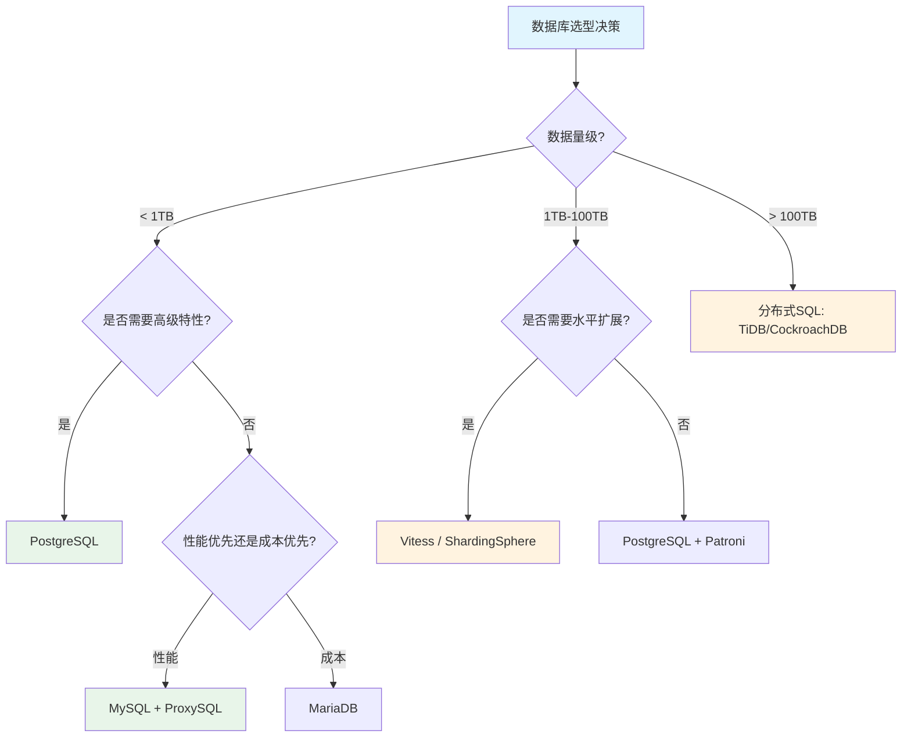

# Domain-28 企业数据库与中间件 — 开源项目索引

> **最后更新**: 2026-04-26  
> **适用版本**: 截至 2026 年 Q1 最新稳定版  
> **维护策略**: 每季度更新版本号与 CNCF 状态

---

## 概述

企业级数据库与中间件领域是现代基础设施的核心组成部分。随着云原生技术的成熟，传统数据库和中间件正在经历从物理机部署到容器化、从手动运维到 Operator 自动化的深刻变革。本文档汇总了该领域所有关键开源项目的最新状态、适用场景与选型建议，为企业架构决策提供参考依据。

开源数据库与中间件项目在过去几年经历了爆发式增长。CNCF 云原生 landscape 中数据库相关项目已超过 50 个，涵盖了关系型数据库、NoSQL、时序数据库、图数据库、消息队列等各个细分领域。企业选型时需要综合考虑数据模型适配性、社区活跃度、商业支持能力、运维复杂度、许可证合规性等多个维度。

本文档按照功能分类组织，每个项目均标注 CNCF 状态（Sandbox / Incubating / Graduated）、最新稳定版本、GitHub Stars 数量以及开源许可证信息。所有版本号基于 2026 年 Q1 的最新发布，实际使用时请以项目官方 GitHub Release 页面为准。

---

## 一、关系型数据库

### 1.1 MySQL 生态

| 项目 | 作用 | CNCF 状态 | 最新版本 | Stars | License |
|:---|:---|:---|:---|:---|:---|
| **MySQL Server** | 开源关系型数据库 | Oracle | v9.2.0 | 12k+ | GPL-2.0 |
| **Percona Server** | MySQL 增强版 | Percona | v8.4.0 | 1k+ | GPL-2.0 |
| **MariaDB Server** | MySQL 分支 | MariaDB Foundation | v11.4.0 | 5k+ | GPL-2.0 |
| **MySQL Operator** | K8s MySQL 运维 | Oracle / PressLabs | v9.2.0 | 1.5k+ | Apache-2.0 |
| **Percona XtraDB Operator** | MySQL/MariaDB K8s 运维 | Percona | v1.17.0 | 1k+ | Apache-2.0 |
| **Vitess** | MySQL 水平扩展 | CNCF Graduated | v21.0.0 | 18k+ | Apache-2.0 |
| **ProxySQL** | 数据库代理与读写分离 | ProxySQL | v2.7.0 | 6k+ | GPL-3.0 |
| **Orchestrator** | MySQL 复制拓扑管理 | GitHub | v3.2.6 | 5.5k+ | Apache-2.0 |
| **MHA** | MySQL 高可用故障转移 | Google Code Archive | v0.58 | 7k+ | GPL-2.0 |

#### MySQL 生态项目详解

MySQL 是全球使用最广泛的开源关系型数据库，由 Oracle 公司维护。在企业级场景中，MySQL 通常需要搭配多种工具来实现高可用、读写分离、备份恢复和性能监控。Percona Server 是 MySQL 的增强版本，提供了额外的性能监控和诊断工具（如 Performance Schema 增强、审计插件等），适合对性能有极致要求的场景。MariaDB 是 MySQL 的社区分支，由 MySQL 原始创始人 Michael Widenius 发起，提供了更多的存储引擎选择和性能优化。

在 Kubernetes 环境中，MySQL 的管理主要通过 Operator 实现。Oracle 官方的 MySQL Operator 和 Percona XtraDB Operator 是两个主流选择。Percona 的 Operator 功能更加丰富，支持自动备份、Point-in-Time Recovery、数据库拓扑管理（Primary/Replica、Group Replication）以及与 Prometheus 的集成。对于需要大规模 MySQL 水平扩展的场景，Vitess（CNCF Graduated 项目）提供了完整的分片解决方案。

ProxySQL 是 MySQL 生态中最流行的数据库代理，核心优势在于高性能的连接池（支持 transaction 级别的连接复用）和灵活的查询路由规则。在典型的企业架构中，应用通过 ProxySQL 连接数据库，ProxySQL 根据查询规则将 SELECT 语句路由到只读副本、将写操作路由到主库，实现了透明的读写分离。

Orchestrator 是 MySQL 复制拓扑管理工具，提供了 Web UI 来可视化管理 MySQL 的主从关系。它支持自动故障检测和恢复（Automatic Recovery），可以在主库故障时自动执行故障转移，并通过 raft 共识协议实现自身的 HA 部署。

### 1.2 PostgreSQL 生态

| 项目 | 作用 | CNCF 状态 | 最新版本 | Stars | License |
|:---|:---|:---|:---|:---|:---|
| **PostgreSQL** | 开源对象关系型数据库 | PGDG | v17.4 | 17k+ | PostgreSQL License |
| **CloudNativePG** | K8s PostgreSQL Operator | EDB / CNCF Sandbox | v1.25.0 | 5k+ | Apache-2.0 |
| **Zalando Postgres Operator** | PostgreSQL K8s 运维 | Zalando | v1.14.0 | 4k+ | MIT |
| **Crunchy Data PGO** | PostgreSQL K8s Operator | CrunchyData | v5.8.0 | 4k+ | Apache-2.0 |
| **Patroni** | PostgreSQL 高可用 | Zalando | v4.0.0 | 7k+ | MIT |
| **PgBouncer** | PostgreSQL 连接池 | PgBouncer | v1.23.0 | 3k+ | ISC |
| **PgPool-II** | PostgreSQL 连接池与负载均衡 | PgPool | v4.5.0 | 1.5k+ | BSD-like |
| **Barman** | PostgreSQL 备份管理 | EDB | v3.12.0 | 2k+ | GPL-3.0 |
| **WAL-G** | PostgreSQL WAL 归档备份 | WAL-G | v3.0.0 | 3k+ | Apache-2.0 |

#### PostgreSQL 生态项目详解

PostgreSQL 是功能最强大的开源关系型数据库，以其丰富的数据类型（JSON/JSONB、Array、Hstore、GIS）、强大的扩展能力（Extension 机制）和严格的 SQL 标准合规性著称。在企业级场景中，PostgreSQL 的选择通常不需要像 MySQL 那样依赖复杂的中间件层，因为 PostgreSQL 原生支持很多高级特性（如逻辑复制、分区表、并行查询、窗口函数等）。

在 Kubernetes 环境中，CloudNativePG（CNPG）是目前最活跃的 PostgreSQL Operator，由 EDB（EnterpriseDB）开发并捐赠给 CNCF。CNPG 的设计理念是"Kubernetes Native"——它不使用独立的配置管理工具（如 Patroni），而是直接利用 Kubernetes 的原生机制（Pod、Service、PVC、Job）来管理 PostgreSQL 集群的生命周期。CNPG 内建了 PgBouncer 连接池集成、基于 Barman 的备份管理、PITR（Point-in-Time Recovery）、滚动升级和监控告警等功能。

Patroni 是另一个重要的 PostgreSQL 高可用工具，由 Zalando 开发。它通过 etcd/Consul/ZooKeeper 等 DCS（Distributed Configuration Store）实现 Leader 选举和自动故障转移。Patroni 的优势在于与 Zalando Postgres Operator 的紧密集成，在 Kubernetes 上提供完整的 PostgreSQL 生命周期管理。

### 1.3 分布式 SQL 数据库

| 项目 | 作用 | CNCF 状态 | 最新版本 | Stars | License |
|:---|:---|:---|:---|:---|:---|
| **TiDB** | 分布式 HTAP 数据库 | PingCAP | v9.0.0 | 38k+ | Apache-2.0 |
| **TiKV** | 分布式 KV 存储 | CNCF Graduated | v8.5.0 | 15k+ | Apache-2.0 |
| **CockroachDB** | 云原生分布式 SQL | Cockroach Labs | v25.1.0 | 30k+ | BSL/Apache-2.0 |
| **YugabyteDB** | 云原生分布式 SQL | Yugabyte | v2024.2.0 | 9k+ | Apache-2.0 |
| **OceanBase** | 分布式关系数据库 | OceanBase | v4.3.0 | 12k+ | MulanPSL-2.0 |
| **PingCAP TiFlash** | HTAP 列存引擎 | PingCAP | v9.0.0 | 6k+ | Apache-2.0 |

---

## 二、NoSQL 数据库

### 2.1 文档型数据库

| 项目 | 作用 | CNCF 状态 | 最新版本 | Stars | License |
|:---|:---|:---|:---|:---|:---|
| **MongoDB** | 文档型数据库 | MongoDB Inc. | v8.0.0 | 26k+ | SSPL |
| **MongoDB Community Operator** | MongoDB K8s 运维 | MongoDB | v0.12.0 | 1k+ | Apache-2.0 |
| **FerretDB** | MongoDB 兼容的 PostgreSQL 前端 | CNCF Sandbox | v1.24.0 | 9k+ | Apache-2.0 |

### 2.2 键值存储

| 项目 | 作用 | CNCF 状态 | 最新版本 | Stars | License |
|:---|:---|:---|:---|:---|:---|
| **Redis** | 内存键值数据库 | Redis Ltd. | v8.0.0 | 68k+ | BSD-3-Clause |
| **Redis Operator** | Redis Cluster K8s 运维 | OT-CONTAINER-KIT | v0.19.0 | 2k+ | Apache-2.0 |
| **KeyDB** | Redis 多线程分支 | Snap Inc. | v6.3.4 | 8k+ | BSD-3-Clause |
| **Dragonfly** | Redis 替代品 | Dragonfly | v1.25.0 | 26k+ | BSL-1.1 |
| **Memcached** | 内存缓存 | Memcached | v1.6.36 | 13k+ | BSD-3-Clause |
| **Apache Cassandra** | 分布式宽列存储 | Apache | v5.0.0 | 9k+ | Apache-2.0 |
| **ScyllaDB** | Cassandra C++ 重写 | ScyllaDB | v6.2.0 | 13k+ | AGPL-3.0/BSL |

### 2.3 时序数据库

| 项目 | 作用 | CNCF 状态 | 最新版本 | Stars | License |
|:---|:---|:---|:---|:---|:---|
| **InfluxDB** | 时序数据库 | InfluxData | v3.0.0 | 29k+ | Apache-2.0/MIT |
| **TimescaleDB** | PostgreSQL 时序扩展 | Timescale | v2.17.0 | 18k+ | Apache-2.0/TSAL |
| **TDengine** | 物联网时序数据库 | TDengine | v3.3.0 | 23k+ | AGPL-3.0 |
| **VictoriaMetrics** | 监控时序数据库 | VictoriaMetrics | v1.105.0 | 13k+ | Apache-2.0 |
| **ClickHouse** | 列式分析数据库 | ClickHouse | v24.12.0 | 39k+ | Apache-2.0 |
| **ClickHouse Operator** | ClickHouse K8s 运维 | Altinity | v0.24.0 | 2k+ | Apache-2.0 |

---

## 三、消息队列与流处理

| 项目 | 作用 | CNCF 状态 | 最新版本 | Stars | License |
|:---|:---|:---|:---|:---|:---|
| **Apache Kafka** | 分布式消息队列 | Apache | v3.9.0 | 29k+ | Apache-2.0 |
| **Strimzi** | K8s Kafka Operator | CNCF Sandbox | v0.45.0 | 5k+ | Apache-2.0 |
| **Redpanda** | K8s-native Kafka 替代 | Redpanda | v24.3.0 | 10k+ | BSL/Apache-2.0 |
| **Apache Pulsar** | 云原生消息流 | Apache | v4.0.0 | 14k+ | Apache-2.0 |
| **Pulsar Operator** | Pulsar K8s 运维 | StreamNative | v0.22.0 | 500+ | Apache-2.0 |
| **RabbitMQ** | AMQP 消息代理 | VMware/Broadcom | v4.0.0 | 12k+ | MPL-2.0 |
| **RabbitMQ Cluster Operator** | RabbitMQ K8s 运维 | VMware | v2.12.0 | 600+ | MPL-2.0 |
| **NATS** | 轻量级消息系统 | CNCF Incubating | v2.11.0 | 15k+ | Apache-2.0 |
| **Apache RocketMQ** | 分布式消息队列 | Apache | v5.3.0 | 21k+ | Apache-2.0 |
| **RocketMQ Operator** | RocketMQ K8s 运维 | Apache | v0.3.0 | 1k+ | Apache-2.0 |
| **Apache Flink** | 流处理引擎 | Apache | v1.21.0 | 24k+ | Apache-2.0 |

---

## 四、数据集成与 CDC

| 项目 | 作用 | CNCF 状态 | 最新版本 | Stars | License |
|:---|:---|:---|:---|:---|:---|
| **Debezium** | CDC 变更数据捕获 | Red Hat / CNCF Incubating | v3.0.0 | 10k+ | Apache-2.0 |
| **Apache SeaTunnel** | 数据集成平台 | Apache | v2.3.9 | 8k+ | Apache-2.0 |
| **Airbyte** | EL(T) 数据集成 | Airbyte | v0.60.0 | 16k+ | MIT/ELv2 |
| **Apache NiFi** | 数据流管理 | Apache | v2.1.0 | 5k+ | Apache-2.0 |
| **Canal** | MySQL Binlog 增量订阅 | Alibaba | v1.1.8 | 28k+ | Apache-2.0 |
| **Dtle** | MySQL 数据迁移 | ActionSky | v3.22.0 | 1k+ | Apache-2.0 |

---

## 五、数据库中间件与代理

| 项目 | 作用 | CNCF 状态 | 最新版本 | Stars | License |
|:---|:---|:---|:---|:---|:---|
| **Apache ShardingSphere** | 分布式数据库中间件 | Apache | v5.5.0 | 20k+ | Apache-2.0 |
| **Vitess** | MySQL 水平扩展 | CNCF Graduated | v21.0.0 | 18k+ | Apache-2.0 |
| **ProxySQL** | 数据库代理与路由 | ProxySQL | v2.7.0 | 6k+ | GPL-3.0 |
| **MaxScale** | MariaDB 数据库代理 | MariaDB | v24.02.0 | 1k+ | BSL-1.1 |
| **MyCat** | MySQL 分布式中间件 | MyCat | v1.6.8 | 10k+ | Apache-2.0/GPL |
| **Mycat2** | MySQL 分布式中间件 v2 | MyCat | v1.22.0 | 2k+ | Apache-2.0 |

---

## 六、详细特性对比矩阵

### 6.1 关系型数据库功能矩阵

| 特性 | MySQL 9.2 | PostgreSQL 17.4 | MariaDB 11.4 | Percona Server 8.4 |
|:---|:---|:---|:---|:---|
| **JSON 支持** | JSON/JSON 全文索引 | JSONB + GIN 索引 + 路径查询 | JSON + 全文索引 | 同 MySQL |
| **分区表** | Range/List/Hash/Key | Range/List/Hash + 子分区 | Range/List/Hash | 同 MySQL |
| **并行查询** | 并行扫描 (有限) | 并行 Seq/Join/Agg (成熟) | 并行查询 | 同 MySQL |
| **全文搜索** | 内建 ngram | 内建 GIN/GiST + tsvector | Mroonga 引擎 | 同 MySQL |
| **窗口函数** | 支持 | 支持 (最完整) | 支持 | 同 MySQL |
| **CTE** | 非递归 + 递归 | 非递归 + 递归 + 物化 | 支持 | 同 MySQL |
| **逻辑复制** | 基于行 (限制) | 原生逻辑复制 + 发布订阅 | 支持 | 同 MySQL |
| **扩展机制** | 插件 (有限) | Extension (极丰富) | 插件 + Engine | 审计/加密插件 |
| **GIS** | 基础支持 | PostGIS (最强大) | 基础支持 | 同 MySQL |
| **分布式事务** | XA (两阶段提交) | 2PC + Prepared Transaction | 支持 | 同 MySQL |
| **连接池** | 需 ProxySQL | PgBouncer/PgPool-II | 需外部 | 需 ProxySQL |
| **K8s Operator** | Percona/Oracle | CNPG (最佳) | MariaDB Operator | Percona Operator |

### 6.2 NoSQL 数据库功能矩阵

| 特性 | Redis 8.0 | MongoDB 8.0 | Cassandra 5.0 | ScyllaDB 6.2 |
|:---|:---|:---|:---|:---|
| **数据模型** | 键值 (5种结构) | 文档 (BSON) | 宽列 (CQL) | 宽列 (CQL) |
| **ACID 事务** | 单命令原子/Lua | 4.0+ 多文档事务 | 轻量级事务 (LWT) | 轻量级事务 |
| **水平扩展** | Cluster 16384 slot | Sharded Cluster | 原生一致性哈希 | 原生一致性哈希 |
| **二级索引** | 不支持 | 支持 (丰富) | SASI/SAI | Materialized Views |
| **聚合查询** | 有限 | Aggregation Pipeline | 聚合有限 | 聚合有限 |
| **全文搜索** | RediSearch 模块 | Atlas Search | 需要 Solr/Elastic | 需要 Solr/Elastic |
| **Change Stream** | Pub/Sub + Streams | 原生 Change Streams | CDC (Debezium) | CDC (Scylla CDC) |
| **持久化** | RDB + AOF + Hybrid | WiredTiger + Oplog | SSTable + CommitLog | SSTable + CommitLog |
| **单集群规模** | 数百节点 | 数十 Shard | 数百节点 | 数百节点 |
| **延迟** | < 1ms | 1-5ms | 5-20ms | 1-5ms |
| **K8s Operator** | OT-CONTAINER-KIT | Community Operator | Cass Operator | Scylla Operator |

### 6.3 消息队列功能矩阵

| 特性 | Kafka 3.9 | Pulsar 4.0 | RabbitMQ 4.0 | NATS 2.11 | RocketMQ 5.3 |
|:---|:---|:---|:---|:---|:---|
| **消息模型** | Topic/Partition | Topic/Subscription | Exchange/Queue | Subject/Stream | Topic/Queue |
| **消息顺序** | 分区内有序 | Key 分区有序 | Queue 有序 | Stream 有序 | Queue 有序 |
| **Exactly-Once** | 支持 (事务/幂等) | 支持 | 不支持 | 不支持 | 支持 |
| **消息回溯** | 按 Offset/时间 | 按时间/位置 | 不支持 | Stream 支持 | 按时间 |
| **分层存储** | Tiered Storage | 原生 BookKeeper | 不支持 | Stream 持久化 | 不支持 |
| **多租户** | Topic 级 ACL | 原生多租户 | vhost | Account | Topic 级 ACL |
| **延迟消息** | 不支持 (需外部) | 原生延迟 | 原生延迟/插件 | 原生延迟 | 原生延迟 (18级) |
| **Schema 注册** | Schema Registry | 原生 Schema | 不支持 | 不支持 | 不支持 |
| **协议支持** | 自定义协议 | 自定义 + Kafka 兼容 | AMQP 0.9.1/1.0 | NATS/WS | 自定义协议 |
| **Geo-Replication** | MirrorMaker 2 | 原生 Geo-Rep | Federation | Leaf Node | 不支持 |
| **K8s Operator** | Strimzi | Pulsar Operator | Cluster Operator | Helm | RocketMQ Operator |
| **吞吐量** | 百万 TPS | 百万 TPS | 万级 TPS | 百万 TPS | 十万 TPS |

---

## 七、CNCF Landscape 映射

### 7.1 CNCF 项目全景

```yaml
CNCF_Graduated (毕业项目):
  数据库与存储:
    - TiKV: 分布式 KV 事务存储 (2018 Incubating → 2020 Graduated)
    - Vitess: MySQL 水平扩展中间件 (2018 Incubating → 2021 Graduated)
    - etcd: 分布式键值存储 (K8s 核心)
  
  应用定义与开发:
    - Helm: K8s 包管理
    - Argo CD: GitOps 持续交付

CNCF_Incubating (孵化项目):
  - Debezium: CDC 变更数据捕获 (2023)
  - NATS: 轻量级消息系统 (2022)
  - Sigstore/Cosign: 镜像签名 (2022)

CNCF_Sandbox (沙箱项目):
  - CloudNativePG: K8s PostgreSQL Operator (2024)
  - FerretDB: MongoDB 兼容 PostgreSQL 前端 (2023)
  - Strimzi: K8s Kafka Operator (2023)
```

### 7.2 CNCF 项目成熟度评估

| 项目 | CNCF 状态 | 进入年份 | 社区活跃度 | 生产就绪度 | 商业支持 |
|:---|:---|:---|:---|:---|:---|
| **TiKV** | Graduated | 2018 | 高 (1k+ contributors) | 高 | PingCAP |
| **Vitess** | Graduated | 2018 | 高 (700+ contributors) | 极高 (YouTube) | PlanetScale |
| **CloudNativePG** | Sandbox | 2024 | 高 (300+ contributors) | 高 | EDB |
| **Strimzi** | Sandbox | 2023 | 高 (400+ contributors) | 高 | Red Hat |
| **Debezium** | Incubating | 2023 | 高 (500+ contributors) | 极高 | Red Hat |
| **FerretDB** | Sandbox | 2023 | 中 (100+ contributors) | 中 | FerretDB Inc |
| **NATS** | Incubating | 2022 | 高 (200+ contributors) | 高 | Synadia |

---

## 八、项目成熟度综合评估

### 8.1 生产就绪度评分

以下评分基于社区活跃度、文档完善度、生产案例、商业支持、K8s 生态集成度五个维度（1-5 分，5 为最佳）。

| 项目 | 社区活跃 | 文档完善 | 生产案例 | 商业支持 | K8s 集成 | 综合评分 |
|:---|:---|:---|:---|:---|:---|:---|
| **MySQL Server** | 5 | 5 | 5 | 5 (Oracle) | 3 | 4.6 |
| **PostgreSQL** | 5 | 5 | 5 | 5 (EDB) | 4 | 4.8 |
| **CloudNativePG** | 4 | 5 | 4 | 4 (EDB) | 5 | 4.4 |
| **TiDB** | 5 | 4 | 5 | 5 (PingCAP) | 4 | 4.6 |
| **CockroachDB** | 5 | 4 | 4 | 5 (CRLabs) | 4 | 4.4 |
| **Vitess** | 4 | 4 | 5 | 4 (PlanetScale) | 5 | 4.4 |
| **Redis** | 5 | 5 | 5 | 5 (Redis Ltd) | 3 | 4.6 |
| **MongoDB** | 5 | 5 | 5 | 5 (MongoDB Inc) | 4 | 4.8 |
| **Kafka** | 5 | 4 | 5 | 4 (Confluent) | 4 | 4.4 |
| **Strimzi** | 4 | 4 | 4 | 4 (Red Hat) | 5 | 4.2 |
| **ShardingSphere** | 4 | 4 | 4 | 3 (SphereEx) | 3 | 3.6 |
| **ProxySQL** | 3 | 3 | 4 | 3 | 3 | 3.2 |
| **Debezium** | 4 | 4 | 5 | 4 (Red Hat) | 4 | 4.2 |
| **ClickHouse** | 5 | 4 | 4 | 5 (ClickHouse Inc) | 3 | 4.2 |

### 8.2 运维复杂度评估

| 项目 | 部署复杂度 | 配置复杂度 | 日常运维 | 故障排查 | 扩容难度 | 综合复杂度 |
|:---|:---|:---|:---|:---|:---|:---|
| **MySQL 主从** | 低 | 中 | 中 | 中 | 中 | 中 |
| **MySQL MHA** | 中 | 高 | 高 | 高 | 中 | 高 |
| **PostgreSQL + Patroni** | 中 | 高 | 中 | 中 | 中 | 中 |
| **CloudNativePG** | 低 | 低 | 低 | 中 | 低 | 低 |
| **TiDB** | 高 | 高 | 高 | 高 | 中 | 高 |
| **CockroachDB** | 中 | 中 | 中 | 中 | 低 | 中 |
| **Vitess** | 高 | 高 | 高 | 高 | 中 | 高 |
| **Redis Sentinel** | 低 | 低 | 低 | 低 | 中 | 低 |
| **Redis Cluster** | 中 | 中 | 中 | 中 | 中 | 中 |
| **MongoDB Replica Set** | 低 | 低 | 低 | 低 | 中 | 低 |
| **MongoDB Sharded** | 高 | 高 | 高 | 高 | 高 | 高 |
| **Kafka KRaft** | 中 | 中 | 中 | 高 | 中 | 中 |
| **Strimzi** | 低 | 中 | 低 | 中 | 低 | 低 |

---

## 九、选型决策矩阵

### 9.1 关系型数据库选型



### 9.2 选型决策树 (完整版)

```yaml
Step_1_确定数据模型:
  结构化数据 (表/行/列):
    → 进入 Step_2
  半结构化数据 (JSON/文档):
    → MongoDB (首选)
    → PostgreSQL JSONB (备选)
  键值缓存:
    → Redis (首选)
    → Dragonfly (高性能备选)
  时序数据:
    → TimescaleDB (PostgreSQL 兼容)
    → InfluxDB / TDengine
  宽列数据:
    → Cassandra / ScyllaDB
  图数据:
    → Neo4j / JanusGraph

Step_2_确定数据量级 (结构化数据):
  < 500GB:
    → 进入 Step_3 (单机方案)
  500GB - 10TB:
    → 进入 Step_4 (集群方案)
  > 10TB:
    → TiDB / CockroachDB (分布式 SQL)

Step_3_单机方案选择:
  需要高级特性 (GIS/全文/JSONB/Extension):
    → PostgreSQL + Patroni / CloudNativePG
  性能优先/团队MySQL经验:
    → MySQL + ProxySQL
  成本优先:
    → MariaDB

Step_4_集群方案选择:
  需要水平写扩展:
    → Vitess (MySQL 生态, CNCF Graduated)
    → ShardingSphere (多数据库支持)
    → Citus (PostgreSQL 扩展)
  只需读扩展:
    → MySQL + ProxySQL 读写分离
    → PostgreSQL + PgBouncer + 流复制
  需要分析能力 (HTAP):
    → TiDB + TiFlash
    → CockroachDB

Step_5_消息队列选型:
  超高吞吐量 (> 100K TPS):
    → Kafka / Redpanda
  事件驱动 + 多租户:
    → Apache Pulsar
  复杂路由 + AMQP:
    → RabbitMQ
  轻量级 + 低延迟:
    → NATS
  延迟消息 + 事务消息:
    → RocketMQ
```

### 9.3 缓存选型

| 场景 | 推荐方案 | 理由 | 替代方案 |
|:---|:---|:---|:---|
| 简单键值缓存 | Redis Standalone + Sentinel | 运维简单，满足大多数场景 | Memcached |
| 大规模缓存集群 | Redis Cluster 6 节点+ | 数据分片，水平扩展 | Dragonfly Cluster |
| 会话存储 | Redis + AOF 持久化 | 数据安全，低延迟 | KeyDB |
| 排行榜/计数器 | Redis Sorted Set | 原生支持，O(log N) 复杂度 | — |
| 超高性能缓存 | Dragonfly / KeyDB | 多线程架构，吞吐量更高 | Redis 8.0 (IO threads) |
| 发布订阅 | Redis Pub/Sub + Streams | 原生支持，持久化能力 | NATS, RabbitMQ |

### 9.4 消息队列选型

| 场景 | 推荐方案 | 理由 | 替代方案 |
|:---|:---|:---|:---|
| 高吞吐量日志流 | Kafka / Redpanda | 百万级 TPS，持久化保证 | Pulsar |
| 微服务异步通信 | RabbitMQ / NATS | 灵活路由，低延迟 | Kafka |
| 事件驱动架构 | Pulsar | 多租户，分层存储 | Kafka |
| 物联网数据采集 | EMQX / RocketMQ | MQTT 协议，海量连接 | Kafka + MQTT Bridge |
| Kafka 替代（简化运维） | Redpanda | 无 ZooKeeper，C++ 实现 | Strimzi + Kafka |

### 9.5 数据库中间件选型

| 场景 | 推荐方案 | 理由 | 数据库支持 |
|:---|:---|:---|:---|
| MySQL 大规模分片 | Vitess | YouTube 验证，自动分片 | MySQL only |
| 异构数据库统一代理 | ShardingSphere | 多数据库支持 | MySQL + PG + 异构 |
| MySQL 读写分离 | ProxySQL | 高性能连接池和查询路由 | MySQL + MariaDB |
| PostgreSQL K8s运维 | CloudNativePG | 原生K8s，功能最全 | PostgreSQL |
| MySQL K8s运维 | Percona Operator | 企业级功能，自动备份 | MySQL + MariaDB |

---

## 十、许可证合规说明

企业在采用开源数据库和中间件时，需要特别关注许可证合规问题。以下是需要重点注意的许可证类型：

| 许可证 | 特点 | 商业使用限制 | 代表项目 |
|:---|:---|:---|:---|
| Apache-2.0 | 宽松许可，可商用 | 无 | Kafka, TiDB, Vitess |
| MIT / BSD | 最宽松许可 | 无 | Patroni, Redis |
| GPL-2.0/3.0 | 衍生作品须开源 | 修改代码须开源 | MySQL Server, ProxySQL |
| SSPL | 服务端公共许可 | 云服务商须获取许可 | MongoDB |
| BSL | 商业源码许可 | 一定期限后转开源 | CockroachDB, ScyllaDB |
| MulanPSL-2.0 | 中国开源许可 | 无 | OceanBase |
| PostgreSQL License | 类BSD许可 | 无 | PostgreSQL |

### 许可证风险矩阵

| 风险等级 | 许可证类型 | 使用建议 | 审查频率 |
|:---|:---|:---|:---|
| **低风险** | Apache-2.0, MIT, BSD, ISC, PostgreSQL | 自由使用，无需特别审查 | 年度 |
| **中风险** | GPL-2.0, GPL-3.0, MPL-2.0 | 确认不修改源码或愿意开源修改 | 季度 |
| **高风险** | SSPL, BSL, AGPL-3.0 | 法务审查，确认使用方式合规 | 月度 |
| **待评估** | MulanPSL-2.0, ELv2 | 根据使用场景评估 | 按需 |

---

## 十一、版本生命周期

### 11.1 主要项目版本支持

| 项目 | 当前 LTS | 支持截止 | 下一 LTS | 升级建议 |
|:---|:---|:---|:---|:---|
| **MySQL** | 8.4 LTS | 2032-04 | — | 从 5.7 升级 (5.7 EOL 2023-10) |
| **PostgreSQL** | 17.x | 2029-11 | 18.x | 从 14 及以下升级 |
| **MariaDB** | 11.4 LTS | 2029-05 | — | 从 10.x 升级 |
| **Redis** | 8.0 | — | — | 从 6.x/7.x 升级 |
| **MongoDB** | 8.0 | — | — | 从 5.x/6.x 升级 |
| **Kafka** | 3.9 | — | 4.0 (KRaft only) | 移除 ZooKeeper |
| **TiDB** | 9.0 | — | — | 从 6.x/7.x 升级 |

### 11.2 已 EOL 版本警告

```yaml
已停止维护版本 (必须升级):
  MySQL 5.6: EOL 2021-02 → 升级到 8.4 LTS
  MySQL 5.7: EOL 2023-10 → 升级到 8.4 LTS
  PostgreSQL 12: EOL 2024-11 → 升级到 17.x
  PostgreSQL 13: EOL 2025-11 → 升级到 17.x
  MariaDB 10.6: EOL 2026-07 → 规划升级到 11.4
  Redis 6.x: 不再维护 → 升级到 8.0
  Kafka 2.x: 不再维护 → 升级到 3.9+ KRaft
  MongoDB 4.4: EOL 2024-02 → 升级到 8.0
```

---

## 十二、版本生命周期

企业

