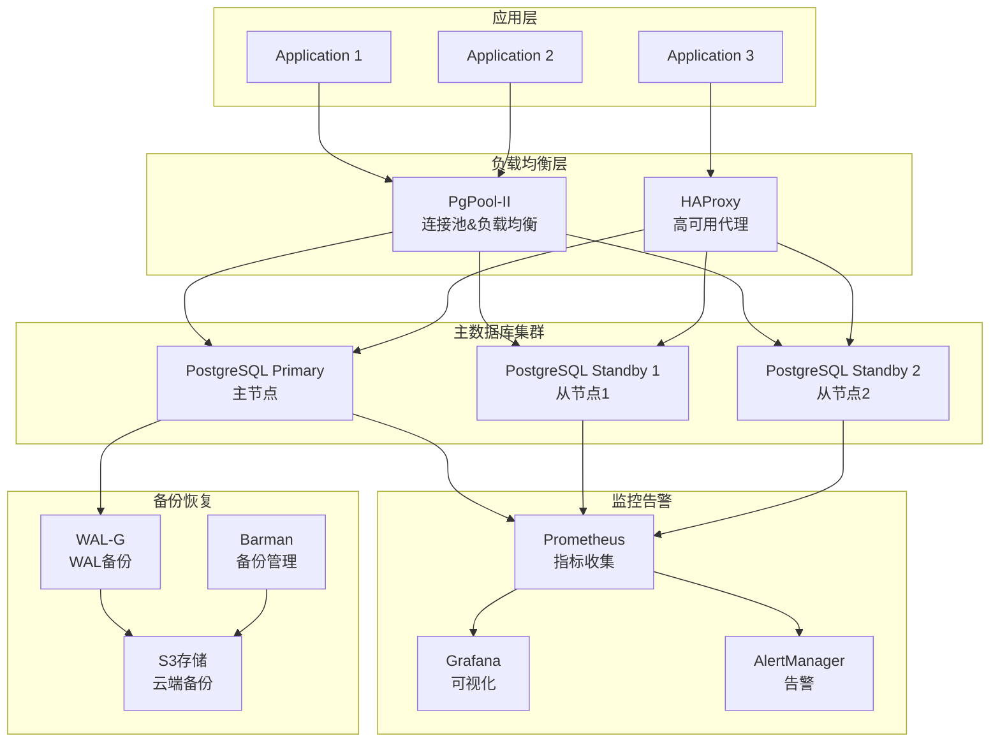

# PostgreSQL 企业级数据库高可用架构

## 概述 (Overview)

PostgreSQL是功能强大的开源对象关系型数据库系统，以其稳定性、可扩展性和丰富的功能而闻名。本文档从企业级数据库专家角度，深入探讨PostgreSQL的高可用架构设计、性能优化策略和生产运维最佳实践。

PostgreSQL is a powerful open-source object-relational database system known for its stability, scalability, and rich features. This document explores PostgreSQL's high availability architecture design, performance optimization strategies, and production operations best practices from an enterprise database expert perspective.

## 架构设计 (Architecture Design)

### 企业级PostgreSQL高可用架构 (Enterprise PostgreSQL High Availability Architecture)

```yaml
# PostgreSQL主从复制架构
version: '3.8'
services:
  postgres-primary:
    image: postgres:15-alpine
    container_name: postgres-primary
    environment:
      POSTGRES_DB: production_db
      POSTGRES_USER: postgres
      POSTGRES_PASSWORD: ${POSTGRES_PASSWORD}
      PGDATA: /var/lib/postgresql/data/pgdata
    volumes:
      - postgres-primary-data:/var/lib/postgresql/data
      - ./config/postgresql.conf:/etc/postgresql/postgresql.conf
      - ./config/pg_hba.conf:/etc/postgresql/pg_hba.conf
    ports:
      - "5432:5432"
    networks:
      - postgres-network
    command: >
      postgres
      -c config_file=/etc/postgresql/postgresql.conf
      -c hba_file=/etc/postgresql/pg_hba.conf

  postgres-standby-1:
    image: postgres:15-alpine
    container_name: postgres-standby-1
    environment:
      POSTGRES_PASSWORD: ${POSTGRES_PASSWORD}
    volumes:
      - postgres-standby-1-data:/var/lib/postgresql/data
      - ./config/standby.conf:/etc/postgresql/postgresql.conf
    ports:
      - "5433:5432"
    networks:
      - postgres-network
    depends_on:
      - postgres-primary
    command: >
      bash -c "
        pg_basebackup -h postgres-primary -D /var/lib/postgresql/data -U replicator -v -P -W &&
        touch /var/lib/postgresql/data/standby.signal &&
        postgres -c config_file=/etc/postgresql/postgresql.conf
      "

  postgres-standby-2:
    image: postgres:15-alpine
    container_name: postgres-standby-2
    environment:
      POSTGRES_PASSWORD: ${POSTGRES_PASSWORD}
    volumes:
      - postgres-standby-2-data:/var/lib/postgresql/data
      - ./config/standby.conf:/etc/postgresql/postgresql.conf
    ports:
      - "5434:5432"
    networks:
      - postgres-network
    depends_on:
      - postgres-primary
    command: >
      bash -c "
        pg_basebackup -h postgres-primary -D /var/lib/postgresql/data -U replicator -v -P -W &&
        touch /var/lib/postgresql/data/standby.signal &&
        postgres -c config_file=/etc/postgresql/postgresql.conf
      "

  pgpool:
    image: pgpool/pgpool-II:4.4
    container_name: pgpool-loadbalancer
    environment:
      PCP_USER: pgpool
      PCP_PASSWORD: ${PGPOOL_PASSWORD}
    volumes:
      - ./config/pgpool.conf:/etc/pgpool-II/pgpool.conf
      - ./config/pool_hba.conf:/etc/pgpool-II/pool_hba.conf
    ports:
      - "9999:9999"
      - "9898:9898"
    networks:
      - postgres-network
    depends_on:
      - postgres-primary
      - postgres-standby-1
      - postgres-standby-2

volumes:
  postgres-primary-data:
  postgres-standby-1-data:
  postgres-standby-2-data:

networks:
  postgres-network:
    driver: bridge
```

### PostgreSQL高可用架构图 (PostgreSQL High Availability Architecture)



## 核心配置优化 (Core Configuration Optimization)

### PostgreSQL主节点配置 (PostgreSQL Primary Configuration)

```ini
# postgresql.conf - 主节点优化配置
# 基础配置
listen_addresses = '*'
port = 5432
max_connections = 200
superuser_reserved_connections = 3

# 内存配置
shared_buffers = 2GB                    # 物理内存的25%
effective_cache_size = 6GB              # 物理内存的75%
work_mem = 64MB                         # 每个排序操作的内存
maintenance_work_mem = 512MB            # 维护操作内存
temp_buffers = 32MB                     # 临时表缓冲区

# WAL配置
wal_level = replica
wal_buffers = 64MB
checkpoint_completion_target = 0.9
checkpoint_timeout = 15min
max_wal_size = 4GB
min_wal_size = 1GB

# 复制配置
max_wal_senders = 10
max_replication_slots = 10
hot_standby = on
hot_standby_feedback = on
wal_receiver_status_interval = 10s
max_standby_archive_delay = 30s
max_standby_streaming_delay = 30s

# 性能优化
random_page_cost = 1.1                  # SSD存储优化
effective_io_concurrency = 200          # 并发I/O操作数
seq_page_cost = 1.0
cpu_tuple_cost = 0.01
cpu_index_tuple_cost = 0.005
cpu_operator_cost = 0.0025

# 查询优化
enable_bitmapscan = on
enable_hashagg = on
enable_hashjoin = on
enable_indexscan = on
enable_indexonlyscan = on
enable_material = on
enable_mergejoin = on
enable_nestloop = on
enable_seqscan = on
enable_sort = on
enable_tidscan = on

# 日志配置
logging_collector = on
log_destination = 'stderr'
log_directory = 'log'
log_filename = 'postgresql-%Y-%m-%d_%H%M%S.log'
log_rotation_age = 1d
log_rotation_size = 100MB
log_min_duration_statement = 1000       # 记录超过1秒的查询
log_checkpoints = on
log_connections = on
log_disconnections = on
log_lock_waits = on
log_temp_files = 0
log_autovacuum_min_duration = 0

# 自动清理配置
autovacuum = on
autovacuum_max_workers = 3
autovacuum_naptime = 1min
autovacuum_vacuum_threshold = 50
autovacuum_analyze_threshold = 50
autovacuum_vacuum_scale_factor = 0.2
autovacuum_analyze_scale_factor = 0.1
autovacuum_freeze_max_age = 200000000
autovacuum_multixact_freeze_max_age = 400000000
```

### 从节点配置 (Standby Configuration)

```ini
# standby.conf - 从节点配置
# 继承主节点大部分配置
include_dir = '/etc/postgresql/conf.d'

# 从节点特有配置
hot_standby = on
hot_standby_feedback = on
max_standby_archive_delay = 30s
max_standby_streaming_delay = 30s
wal_receiver_status_interval = 10s
```

### PgPool-II配置 (PgPool-II Configuration)

```ini
# pgpool.conf - PgPool配置
# 连接池配置
listen_addresses = '*'
port = 9999
socket_dir = '/tmp'
pcp_port = 9898
pcp_socket_dir = '/tmp'

# 池化配置
num_init_children = 100
max_pool = 4
child_life_time = 300
child_max_connections = 0
connection_life_time = 0
client_idle_limit = 0

# 负载均衡配置
load_balance_mode = on
ignore_leading_white_space = on
white_function_list = ''
black_function_list = 'nextval,setval,lastval,currval'
database_redirect_preference_list = ''
app_name_redirect_list = ''
allow_sql_comments = off

# 复制配置
replicate_select = off
insert_lock = on
lobj_lock_table = ''

# 健康检查配置
health_check_period = 10
health_check_timeout = 20
health_check_user = 'postgres'
health_check_password = ''
health_check_database = 'postgres'
health_check_max_retries = 3
health_check_retry_delay = 1

# 故障转移配置
failover_command = '/etc/pgpool-II/failover.sh %d %h %p %D %m %M %H %P %r %R'
failback_command = '/etc/pgpool-II/failback.sh %d %h %p %D %m %M %H %P %r %R'
follow_master_command = ''
recovery_user = 'postgres'
recovery_password = ''
recovery_1st_stage_command = 'recovery_1st_stage'
recovery_2nd_stage_command = ''
search_primary_node_timeout = 10
```

## 高可用方案 (High Availability Solutions)

### Patroni配置 (Patroni Configuration)

```yaml
# patroni.yml - Patroni高可用配置
scope: postgres-cluster
namespace: /db/
name: postgresql0

restapi:
  listen: 0.0.0.0:8008
  connect_address: 192.168.1.10:8008

etcd:
  hosts: etcd1:2379,etcd2:2379,etcd3:2379

bootstrap:
  dcs:
    ttl: 30
    loop_wait: 10
    retry_timeout: 10
    maximum_lag_on_failover: 1048576
    postgresql:
      use_pg_rewind: true
      use_slots: true
      parameters:
        wal_level: replica
        hot_standby: "on"
        max_connections: 200
        max_worker_processes: 8
        wal_keep_segments: 64
        max_wal_senders: 10
        max_replication_slots: 10
        checkpoint_timeout: 15min
        archive_mode: "on"
        archive_timeout: 1800s
        archive_command: "/etc/patroni/archive.sh %p"

  initdb:
  - encoding: UTF8
  - data-checksums

  pg_hba:
  - host replication replicator 127.0.0.1/32 md5
  - host all all 0.0.0.0/0 md5

  users:
    admin:
      password: admin_password
      options:
        - createrole
        - createdb

postgresql:
  listen: 0.0.0.0:5432
  connect_address: 192.168.1.10:5432
  data_dir: /var/lib/postgresql/15/main
  bin_dir: /usr/lib/postgresql/15/bin
  pgpass: /tmp/pgpass
  authentication:
    replication:
      username: replicator
      password: rep_password
    superuser:
      username: postgres
      password: postgres_password

watchdog:
  mode: automatic
  device: /dev/watchdog
```

### Barman备份配置 (Barman Backup Configuration)

```ini
# barman.conf - Barman配置
[barman]
barman_user = barman
configuration_files_directory = /etc/barman.d
barman_home = /var/lib/barman
log_file = /var/log/barman/barman.log
log_level = INFO

[production-postgres]
description = "Production PostgreSQL Server"
ssh_command = ssh postgres@192.168.1.10
conninfo = host=192.168.1.10 user=barman dbname=postgres
backup_method = rsync
reuse_backup = link
archiver = on
minimum_redundancy = 2
retention_policy = RECOVERY WINDOW OF 4 WEEKS
wal_retention_policy = main
```

## 性能监控 (Performance Monitoring)

### 监控指标配置 (Monitoring Metrics Configuration)

```yaml
# Prometheus PostgreSQL Exporter配置
scrape_configs:
  - job_name: 'postgresql-exporter'
    static_configs:
      - targets: ['postgresql-exporter:9187']
    metrics_path: /metrics
    params:
      collect[]:
        - pg_stat_bgwriter
        - pg_stat_database
        - pg_stat_user_tables
        - pg_statio_user_tables
        - pg_stat_replication
        - pg_stat_activity

# 关键监控指标
pg_stat_database_xact_commit{}        # 提交事务数
pg_stat_database_xact_rollback{}      # 回滚事务数
pg_stat_database_blks_read{}          # 块读取数
pg_stat_database_blks_hit{}           # 缓冲命中数
pg_stat_database_deadlocks{}          # 死锁数
pg_stat_replication_pg_wal_lsn_diff{} # 复制延迟
```

### 告警规则配置 (Alerting Rules Configuration)

```yaml
# Prometheus告警规则
groups:
- name: postgresql.rules
  rules:
  - alert: PostgreSQLDown
    expr: pg_up == 0
    for: 2m
    labels:
      severity: critical
    annotations:
      summary: "PostgreSQL instance is down"
      description: "PostgreSQL instance {{ $labels.instance }} is down for more than 2 minutes"

  - alert: PostgreSQLHighConnectionCount
    expr: pg_stat_database_numbackends > 150
    for: 2m
    labels:
      severity: warning
    annotations:
      summary: "High PostgreSQL connection count"
      description: "PostgreSQL instance {{ $labels.instance }} has {{ $value }} connections"

  - alert: PostgreSQLReplicationLag
    expr: pg_stat_replication_pg_wal_lsn_diff > 100*1024*1024
    for: 2m
    labels:
      severity: warning
    annotations:
      summary: "PostgreSQL replication lag"
      description: "PostgreSQL standby {{ $labels.instance }} is {{ $value }} bytes behind master"

  - alert: PostgreSQLSlowQueries
    expr: rate(pg_stat_statements_mean_time_ms[5m]) > 5000
    for: 2m
    labels:
      severity: warning
    annotations:
      summary: "High PostgreSQL query latency"
      description: "PostgreSQL instance {{ $labels.instance }} has average query time above 5 seconds"
```

## 运维管理 (Operational Management)

### 故障排查工具 (Troubleshooting Tools)

```bash
#!/bin/bash
# PostgreSQL故障排查脚本

# 数据库健康检查
check_postgres_health() {
    echo "=== PostgreSQL Health Check ==="
    
    # 检查PostgreSQL服务状态
    systemctl status postgresql | grep Active
    
    # 检查连接数
    psql -c "SELECT count(*) FROM pg_stat_activity;"
    
    # 检查锁等待
    psql -c "SELECT * FROM pg_locks WHERE NOT granted;"
    
    # 检查复制状态
    psql -c "SELECT client_addr, state, sync_state, pg_wal_lsn_diff(sent_lsn, replay_lsn) AS lag_bytes FROM pg_stat_replication;"
}

# 性能分析
performance_analysis() {
    echo "=== Performance Analysis ==="
    
    # 检查慢查询
    psql -c "SELECT query, mean_time, calls FROM pg_stat_statements ORDER BY mean_time DESC LIMIT 10;"
    
    # 检查缓存命中率
    psql -c "SELECT datname, blks_read, blks_hit, round(blks_hit::float/(blks_hit+blks_read)*100, 2) as cache_hit_ratio FROM pg_stat_database;"
    
    # 检查表膨胀
    psql -c "SELECT schemaname, tablename, pg_size_pretty(pg_total_relation_size(schemaname||'.'||tablename)) as size, (pgstatstuples.n_dead_tup::float / NULLIF(pgstatstuples.n_live_tup + pgstatstuples.n_dead_tup, 0) * 100)::numeric(5,2) as dead_tuple_percent FROM pg_stat_user_tables pgstatstuples ORDER BY dead_tuple_percent DESC LIMIT 10;"
}

# 备份验证
backup_verification() {
    echo "=== Backup Verification ==="
    
    # 检查WAL归档状态
    psql -c "SELECT * FROM pg_stat_archiver;"
    
    # 验证备份完整性
    barman check production-postgres
    
    # 检查备份历史
    barman list-backup production-postgres
}
```

### 日常运维脚本 (Daily Operations Scripts)

```bash
#!/bin/bash
# PostgreSQL日常运维脚本

# 自动备份
auto_backup() {
    echo "Performing automatic backup..."
    
    # WAL-G备份
    wal-g backup-push /var/lib/postgresql/15/main
    
    # Barman备份
    barman backup production-postgres
    
    # 清理旧备份
    wal-g delete retain 7 DAY
    barman cron
    
    # 验证备份
    wal-g backup-list
    barman check production-postgres
}

# 性能优化
performance_optimization() {
    echo "Optimizing PostgreSQL performance..."
    
    # 分析表统计信息
    psql -c "ANALYZE;"
    
    # 清理膨胀表
    psql -c "SELECT schemaname, tablename, pg_size_pretty(pg_total_relation_size(schemaname||'.'||tablename)) as size FROM pg_stat_user_tables WHERE (pgstatstuples.n_dead_tup::float / NULLIF(pgstatstuples.n_live_tup + pgstatstuples.n_dead_tup, 0) * 100) > 20;" | while read schema table size; do
        if [[ $schema != "schemaname" ]]; then
            echo "Vacuuming $schema.$table"
            psql -c "VACUUM ANALYZE $schema.$table;"
        fi
    done
    
    # 重建索引
    psql -c "SELECT schemaname, tablename, indexname FROM pg_stat_user_indexes WHERE idx_scan < 10;" | while read schema table index; do
        if [[ $schema != "schemaname" ]]; then
            echo "Rebuilding index $index on $schema.$table"
            psql -c "REINDEX INDEX CONCURRENTLY $schema.$index;"
        fi
    done
}

# 安全检查
security_audit() {
    echo "Performing security audit..."
    
    # 检查弱密码用户
    psql -c "SELECT usename FROM pg_shadow WHERE passwd !~ 'md5';"
    
    # 检查超级用户
    psql -c "SELECT usename FROM pg_shadow WHERE usesuper;"
    
    # 检查未使用的角色
    psql -c "SELECT rolname FROM pg_roles WHERE rolname NOT IN (SELECT DISTINCT usename FROM pg_shadow UNION SELECT 'postgres');"
    
    # 检查公共模式权限
    psql -c "SELECT nspname, relname, relacl FROM pg_class c JOIN pg_namespace n ON c.relnamespace = n.oid WHERE nspname = 'public';"
}
```

## 最佳实践 (Best Practices)

### 部署最佳实践 (Deployment Best Practices)

1. **硬件规划**
   ```bash
   # 内存分配建议
   shared_buffers = 物理内存的25%
   effective_cache_size = 物理内存的75%
   work_mem = 每个连接64-256MB
   
   # 存储配置
   # 使用SSD存储
   # RAID 10配置
   # LVM快照用于备份
   ```

2. **网络配置**
   ```ini
   # 网络优化参数
   listen_addresses = '*'
   tcp_keepalives_idle = 600
   tcp_keepalives_interval = 30
   tcp_keepalives_count = 3
   ```

3. **版本管理**
   ```bash
   # 使用最新的稳定版本
   # 定期应用安全补丁
   # 测试环境先行验证
   ```

### 安全最佳实践 (Security Best Practices)

1. **访问控制**
   ```sql
   -- 创建应用专用用户
   CREATE USER app_user WITH PASSWORD 'strong_password';
   GRANT CONNECT ON DATABASE production_db TO app_user;
   GRANT USAGE ON SCHEMA public TO app_user;
   GRANT SELECT, INSERT, UPDATE, DELETE ON ALL TABLES IN SCHEMA public TO app_user;
   
   -- 限制超级用户访问
   REVOKE ALL ON SCHEMA public FROM PUBLIC;
   GRANT ALL ON SCHEMA public TO postgres;
   ```

2. **数据加密**
   ```ini
   # 启用SSL连接
   ssl = on
   ssl_cert_file = '/etc/ssl/certs/postgresql.crt'
   ssl_key_file = '/etc/ssl/private/postgresql.key'
   ssl_ca_file = '/etc/ssl/certs/ca.crt'
   ```

3. **审计日志**
   ```sql
   -- 启用详细日志记录
   ALTER SYSTEM SET log_statement = 'all';
   ALTER SYSTEM SET log_duration = on;
   ALTER SYSTEM SET log_line_prefix = '%t [%p]: [%l-1] user=%u,db=%d,app=%a,client=%h ';
   SELECT pg_reload_conf();
   ```

### 监控最佳实践 (Monitoring Best Practices)

1. **关键指标监控**
   - 连接数使用率 < 80%
   - 缓存命中率 > 95%
   - 复制延迟 < 100MB
   - 死锁率 < 0.01%

2. **告警策略**
   ```yaml
   # 分级告警
   critical: 数据库宕机、复制中断
   warning: 连接数过高、性能下降
   info: 常规状态更新
   ```

3. **容量规划**
   ```sql
   -- 监控表增长趋势
   SELECT schemaname, tablename, 
          pg_size_pretty(pg_total_relation_size(schemaname||'.'||tablename)) as size,
          pg_stat_get_tuples_inserted(relid) as inserts,
          pg_stat_get_tuples_updated(relid) as updates
   FROM pg_stat_user_tables 
   ORDER BY pg_total_relation_size(schemaname||'.'||tablename) DESC;
   ```

---

**文档版本**: v1.0  
**最后更新**: 2024年2月7日  
**适用版本**: PostgreSQL 15+