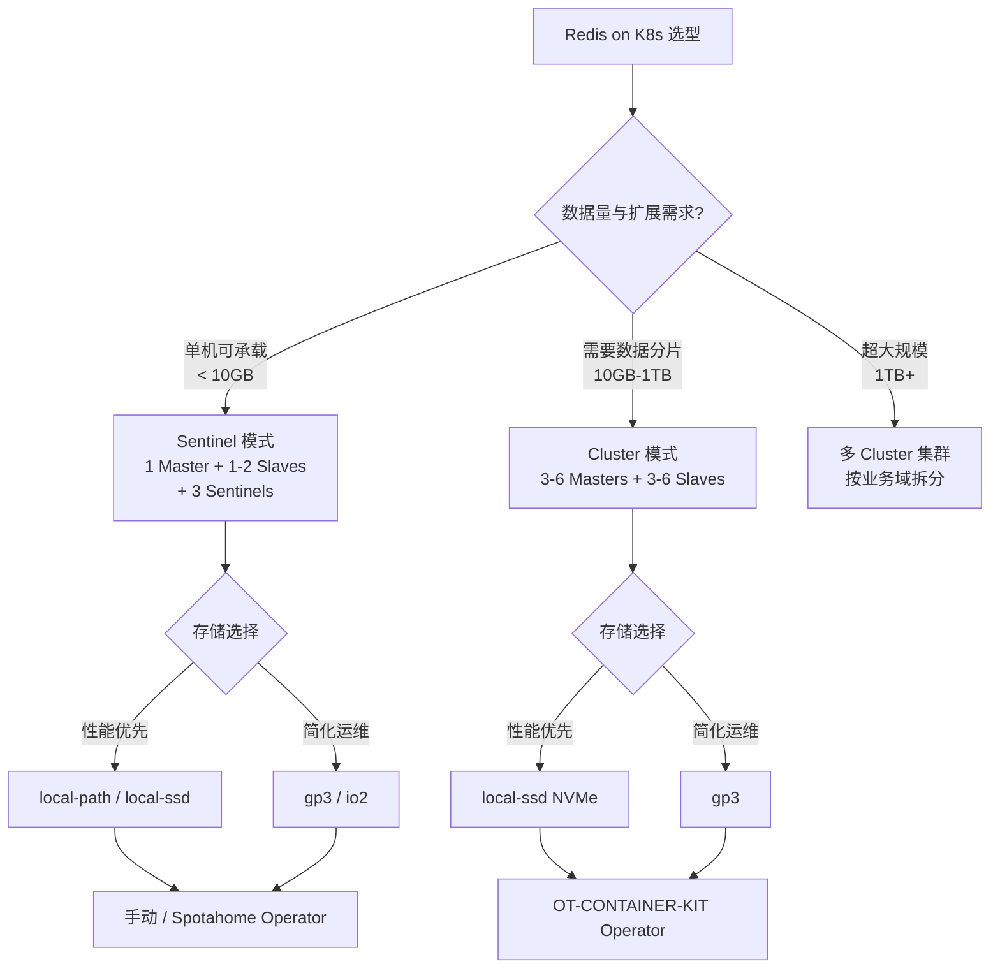
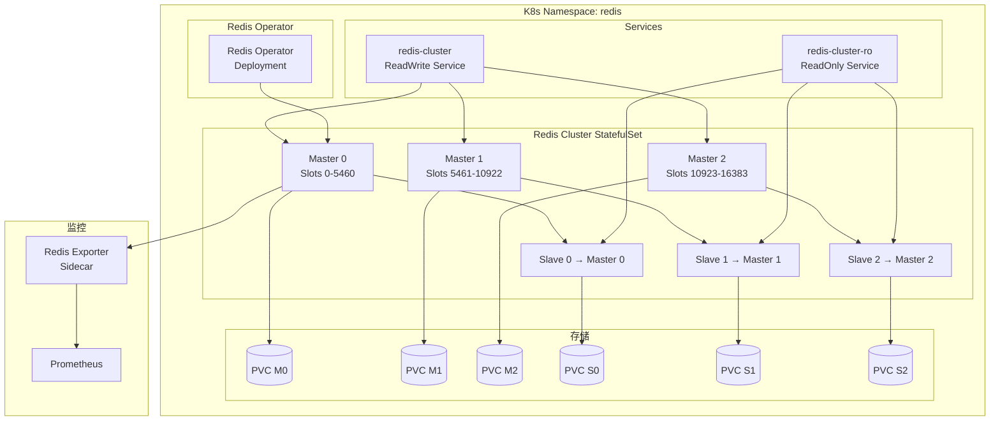

# Redis Kubernetes Operator 企业级实践

> **适用版本**: Redis 7.2 ~ 8.0 / Redis Operator v0.19  
> **最后更新**: 2026-04-26  
> **难度**: 中级 → 高级

---

## 概述

在 Kubernetes 环境中运行 Redis 是现代云原生架构的常见需求。相比传统的虚拟机或物理机部署，K8s 上的 Redis 面临独特的挑战：有状态数据管理（PVC 生命周期）、网络分区下的脑裂防护、持久化性能（网络存储 vs 本地存储）、以及 Operator 的选型与配置。

本文档深入探讨 Redis 在 K8s 上的三种主要部署模式：单实例 + Sentinel（适合中小规模）、Redis Cluster（适合大规模分片）、以及 Redis Operator 自动化管理。内容覆盖 Operator 选型、Sentinel vs Cluster 模式决策、内存规划、持久化策略、监控告警和故障排查。

### Redis on Kubernetes 的挑战与对策

将 Redis 部署在 Kubernetes 上并不是一个简单的任务。Redis 作为内存数据库，对性能、数据持久化和网络稳定性有着极高的要求，而这些在容器化环境中都面临挑战。

**存储性能问题**是 Redis on K8s 的首要挑战。Redis 的 RDB 快照和 AOF 重写需要大量的磁盘 I/O，而 K8s 的网络存储（如 EBS gp3、Ceph RBD）在延迟和吞吐量上远不如本地 NVMe SSD。对于持久化要求高的场景，建议使用 `local-ssd` StorageClass 或 hostPath 挂载本地 NVMe 磁盘。但使用本地存储意味着 Pod 不能自由迁移到其他节点，需要配合 Node Affinity 和 PodAntiAffinity 精心规划。

**内存管理**在容器环境中更为复杂。Redis 的 `maxmemory` 设置需要小于 Pod 的内存限制（memory limit），否则可能触发 OOM Kill。经验法则是 `maxmemory = pod_memory_limit × 70-80%`，留出 20-30% 给 RDB/AOF 子进程的 COW（Copy-On-Write）开销、连接缓冲区和 Exporter sidecar。

**网络分区与脑裂防护**是 Sentinel 和 Cluster 模式都需要面对的问题。在 K8s 中，网络分区可能因为 CNI 插件故障、Node NotReady 或网络策略（NetworkPolicy）误配而发生。Sentinel 模式下，建议至少部署 3 个 Sentinel 实例到不同的节点上，quorum 设置为 2。

**Pod 生命周期管理**是 Redis on K8s 的另一个关键问题。Redis 的数据存储在 PVC 中，Pod 重启后数据不会丢失（前提是使用了 ReadWriteOncePersistentVolumeClaim）。但是，StatefulSet 的 Pod 名称是固定的，Sentinel 和 Cluster 的配置依赖这些固定名称。在 K8s 集群升级或节点维护时，需要通过 PodDisruptionBudget 确保同时只有一个 Redis Pod 被驱逐。

---

## 架构设计

### Redis on K8s 架构选型



### Redis Cluster on K8s 架构



---

## 核心组件配置

### OT-CONTAINER-KIT Redis Operator 安装

```bash
# 安装 Redis Operator
kubectl apply -f https://raw.githubusercontent.com/OT-CONTAINER-KIT/redis-operator/v0.19.0/example/redis-operator/redis-operator.yaml

# 或使用 Helm
helm repo add ot-redis https://ot-container-kit.github.io/redis-operator
helm install redis-operator ot-redis/redis-operator \
  --namespace redis-operator \
  --create-namespace \
  --set image.tag=v0.19.0
```

### Redis Sentinel 模式部署

```yaml
apiVersion: redis.redis.opstreelabs.in/v1beta2
kind: Redis
metadata:
  name: redis-sentinel-master
  namespace: redis
spec:
  kubernetesConfig:
    image: redis:8.0-alpine
    imagePullPolicy: IfNotPresent
    resources:
      requests:
        cpu: "2"
        memory: "4Gi"
      limits:
        cpu: "4"
        memory: "8Gi"
    service:
      type: ClusterIP
      ports:
        - name: redis-client
          port: 6379
          targetPort: 6379
    redisSecret:
      name: redis-password
      key: password
  storage:
    volumeClaimTemplate:
      spec:
        accessModes: ["ReadWriteOnce"]
        storageClassName: local-ssd
        resources:
          requests:
            storage: 20Gi
  redisConfig:
    additionalRedisConfig:
      name: redis-custom-config
      key: redis.conf
  monitoring:
    enabled: true
    prometheus:
      redisExporter:
        image: quay.io/opstree/redis-exporter:v1.0.0
        resources:
          requests:
            cpu: "100m"
            memory: "128Mi"
          limits:
            cpu: "200m"
            memory: "256Mi"
  affinity:
    podAntiAffinity:
      requiredDuringSchedulingIgnoredDuringExecution:
        - labelSelector:
            matchLabels:
              app: redis-sentinel-master
          topologyKey: kubernetes.io/hostname
  tolerations:
    - key: "dedicated"
      operator: "Equal"
      value: "redis"
      effect: "NoSchedule"
---
apiVersion: redis.redis.opstreelabs.in/v1beta2
kind: RedisSentinel
metadata:
  name: redis-sentinel
  namespace: redis
spec:
  clusterSize: 3
  kubernetesConfig:
    image: redis:8.0-alpine
    imagePullPolicy: IfNotPresent
    resources:
      requests:
        cpu: "500m"
        memory: "512Mi"
      limits:
        cpu: "1"
        memory: "1Gi"
    redisSecret:
      name: redis-password
      key: password
    sentinelSecret:
      name: redis-password
      key: password
  redisSentinelConfig:
    redisReplicationName: redis-sentinel-master
    masterGroupName: mymaster
    quorum: 2
    downAfterMilliseconds: 5000
    failoverTimeout: 10000
    parallelSyncs: 1
  monitoring:
    enabled: true
  affinity:
    podAntiAffinity:
      preferredDuringSchedulingIgnoredDuringExecution:
        - weight: 100
          podAffinityTerm:
            labelSelector:
              matchLabels:
                app: redis-sentinel
            topologyKey: kubernetes.io/hostname
```

### Redis Cluster 模式部署

```yaml
apiVersion: redis.redis.opstreelabs.in/v1beta2
kind: RedisCluster
metadata:
  name: redis-cluster
  namespace: redis
spec:
  clusterSize: 3
  clusterVersion: v7
  persistenceEnabled: true

  kubernetesConfig:
    image: redis:8.0-alpine
    imagePullPolicy: IfNotPresent
    resources:
      requests:
        cpu: "4"
        memory: "8Gi"
      limits:
        cpu: "8"
        memory: "16Gi"
    redisSecret:
      name: redis-password
      key: password
    service:
      type: ClusterIP
      ports:
        - name: redis-client
          port: 6379
          targetPort: 6379
        - name: redis-bus
          port: 16379
          targetPort: 16379

  storage:
    volumeClaimTemplate:
      spec:
        accessModes: ["ReadWriteOnce"]
        storageClassName: local-ssd
        resources:
          requests:
            storage: 50Gi

  redisConfig:
    additionalRedisConfig:
      name: redis-cluster-custom-config
      key: redis.conf

  tls:
    enabled: true
    secret:
      name: redis-tls-certs
    caCertFile: /etc/redis/tls/ca.crt
    certFile: /etc/redis/tls/redis.crt
    keyFile: /etc/redis/tls/redis.key

  monitoring:
    enabled: true
    prometheus:
      redisExporter:
        image: quay.io/opstree/redis-exporter:v1.0.0
        env:
          - name: REDIS_EXPORTER_INCL_SYSTEM_MODULES
            value: "true"
          - name: REDIS_EXPORTER_CHECK_KEYS
            value: "db0=cache:*,db0=session:*"
        resources:
          requests:
            cpu: "100m"
            memory: "128Mi"
          limits:
            cpu: "200m"
            memory: "256Mi"

  affinity:
    podAntiAffinity:
      requiredDuringSchedulingIgnoredDuringExecution:
        - labelSelector:
            matchLabels:
              redis_setup_type: cluster
              redis_cluster_name: redis-cluster
          topologyKey: kubernetes.io/hostname
    topologySpreadConstraints:
      - maxSkew: 1
        topologyKey: topology.kubernetes.io/zone
        whenUnsatisfiable: DoNotSchedule
        labelSelector:
          matchLabels:
            redis_setup_type: cluster
            redis_cluster_name: redis-cluster
```

### 自定义 Redis 配置

```yaml
apiVersion: v1
kind: ConfigMap
metadata:
  name: redis-cluster-custom-config
  namespace: redis
data:
  redis.conf: |
    maxmemory 12gb
    maxmemory-policy allkeys-lru
    maxmemory-samples 5
    save 900 1
    save 300 10
    save 60 10000
    appendonly yes
    appendfsync everysec
    auto-aof-rewrite-percentage 100
    auto-aof-rewrite-min-size 64mb
    aof-use-rdb-preamble yes
    lazyfree-lazy-eviction yes
    lazyfree-lazy-expire yes
    lazyfree-lazy-server-del yes
    activedefrag yes
    active-defrag-threshold-lower 10
    active-defrag-threshold-upper 100
    slowlog-log-slower-than 10000
    slowlog-max-len 128
    latency-monitor-threshold 100
    notify-keyspace-events "Ex"
    io-threads 4
    io-threads-do-reads yes
    hz 100
    dynamic-hz yes
```

---

## 性能调优

### 内存规划

```yaml
Redis on K8s 内存规划（以 32GB Node 为例）:
  
  Pod内存分配:
    Redis Container Limit:   16GB
    maxmemory 设置:          12GB (limit 的 75%)
    OS / Sidecar 开销:       ~2GB
    Node 预留:               ~14GB
  
  maxmemory 计算公式:
    maxmemory = Pod memory limit × 70%~80%
    
    预留 20-30% 给:
      - AOF rewrite / RDB bgsave 子进程 (COW 开销)
      - Redis 连接缓冲区
      - Exporter sidecar
      - K8s 基础设施
  
  内存碎片率控制:
    target: 1.0 - 1.5
    触发 defrag: > 1.5
    activedefrag: yes
```

### 存储选型对比

| 存储类型 | 适用场景 | IOPS | 延迟 | 成本 | Pod迁移 |
|:---|:---|:---|:---|:---|:---|
| `local-ssd` NVMe | 高性能持久化 | 最高 (>100K) | 最低 (<0.1ms) | 中 | 不可 |
| `io2` (EBS) | 高 IOPS 需求 | 高 (64K) | 低 (~1ms) | 高 | 可以 |
| `gp3` (EBS) | 通用场景 | 中 (16K) | 中 (~2ms) | 低 | 可以 |
| `local-path` | 测试/开发 | 中 | 低 | 最低 | 不可 |

### 持久化策略选择

```yaml
策略一_纯缓存:
  描述: 允许数据丢失，不需要持久化
  配置:
    save: ""
    appendonly: no
  适用: 会话缓存、临时计算结果
  RPO: 全部丢失

策略二_轻度持久化:
  描述: 容忍秒级数据丢失
  配置:
    save: "900 1 300 10"
    appendonly: yes
    appendfsync: everysec
  适用: 排行榜、计数器
  RPO: < 1秒

策略三_强持久化:
  描述: 不能丢数据
  配置:
    save: "60 10000"
    appendonly: yes
    appendfsync: everysec
    aof-use-rdb-preamble: yes
  适用: 订单缓存、用户数据
  RPO: 接近0（配合复制）
```

---

## 高可用与容灾

### Sentinel vs Cluster 对比

| 维度 | Sentinel | Cluster |
|:---|:---|:---|
| 部署复杂度 | 低 | 中 |
| 数据分片 | 不支持 | 支持（16384 slots） |
| 故障转移 | Sentinel 选举 | Gossip + 选举 |
| 多 Key 操作 | 完全支持 | 限制（同 slot） |
| 内存上限 | 单机内存 | N × 单机内存 |
| 客户端要求 | 支持 Sentinel 协议 | 支持 Cluster 协议 |
| 适用场景 | 中小规模、简单 KV | 大规模、需要扩展 |
| K8s Operator | OT-CONTAINER-KIT / Spotahome | OT-CONTAINER-KIT |

### 跨可用区部署

```yaml
# 确保 Redis Pod 分布在不同可用区
spec:
  affinity:
    topologySpreadConstraints:
      - maxSkew: 1
        topologyKey: topology.kubernetes.io/zone
        whenUnsatisfiable: DoNotSchedule
        labelSelector:
          matchLabels:
            redis_cluster_name: redis-cluster
```

---

## 备份恢复

### K8s 环境下的备份策略

```bash
#!/bin/bash
# redis_k8s_backup.sh - Redis on K8s 备份脚本
set -euo pipefail

NAMESPACE="redis"
CLUSTER="redis-cluster"
S3_BUCKET="s3://company-redis-backup"
DATE=$(date +%Y%m%d_%H%M%S)

echo "=== Redis K8s 备份开始 ==="
echo "时间: $(date)"
echo "集群: $CLUSTER"

echo "[1/6] 触发 BGSAVE..."
for pod in $(kubectl get pods -n "$NAMESPACE" -l "redis_cluster_name=$CLUSTER" -o name); do
    kubectl exec -n "$NAMESPACE" "$pod" -- redis-cli -a "${REDIS_PASSWORD}" BGSAVE 2>/dev/null
done

echo "[2/6] 等待 BGSAVE 完成..."
sleep 30

echo "[3/6] 验证 RDB 文件..."
for pod in $(kubectl get pods -n "$NAMESPACE" -l "redis_cluster_name=$CLUSTER" -o jsonpath='{.items[*].metadata.name}'); do
    last_save=$(kubectl exec -n "$NAMESPACE" "$pod" -- redis-cli -a "${REDIS_PASSWORD}" LASTSAVE 2>/dev/null)
    echo "  $pod: LASTSAVE=$last_save"
done

echo "[4/6] 复制 RDB 文件到本地..."
for pod in $(kubectl get pods -n "$NAMESPACE" -l "redis_cluster_name=$CLUSTER" -o jsonpath='{.items[*].metadata.name}'); do
    kubectl cp "${NAMESPACE}/${pod}:/data/dump.rdb" "/tmp/redis_backup_${pod}_${DATE}.rdb"
    echo "  已复制: $pod"
done

echo "[5/6] 上传到 S3..."
for file in /tmp/redis_backup_*_${DATE}.rdb; do
    pod_name=$(echo "$file" | sed "s/\/tmp\/redis_backup_\(.*\)_${DATE}\.rdb/\1/")
    aws s3 cp "$file" \
        "${S3_BUCKET}/${CLUSTER}/${DATE}/${pod_name}.rdb" \
        --storage-class STANDARD_IA
    rm "$file"
    echo "  已上传: $pod_name"
done

echo "[6/6] 清理旧备份（保留7天）..."
aws s3 ls "${S3_BUCKET}/${CLUSTER}/" | while read -r line; do
    backup_date=$(echo "$line" | awk '{print $2}' | tr -d '/')
    if [ "$backup_date" != "$(date +%Y%m%d)" ]; then
        age=$(( ($(date +%s) - $(date -j -f "%Y%m%d" "$backup_date" +%s 2>/dev/null || echo 0)) / 86400 ))
        if [ "$age" -gt 7 ]; then
            echo "  删除: $backup_date (${age}天前)"
            aws s3 rm "${S3_BUCKET}/${CLUSTER}/${backup_date}/" --recursive
        fi
    fi
done

echo "=== 备份完成 ==="
echo "备份位置: ${S3_BUCKET}/${CLUSTER}/${DATE}/"
```

---

## 监控告警

### Prometheus 监控配置

```yaml
apiVersion: monitoring.coreos.com/v1
kind: ServiceMonitor
metadata:
  name: redis-cluster-monitor
  namespace: redis
  labels:
    release: prometheus
spec:
  selector:
    matchLabels:
      redis_cluster_name: redis-cluster
  endpoints:
    - port: redis-exporter
      interval: 15s
      path: /metrics
```

### 告警规则

```yaml
groups:
  - name: redis-k8s.rules
    rules:
      - alert: RedisPodNotReady
        expr: kube_pod_status_phase{namespace="redis",phase!="Running"} > 0
        for: 2m
        labels:
          severity: critical
        annotations:
          summary: "Redis Pod {{ $labels.pod }} 不在 Running 状态"

      - alert: RedisClusterSlotCoverage
        expr: redis_cluster_slots_ok < 16384
        for: 5m
        labels:
          severity: critical
        annotations:
          summary: "Redis Cluster slot 覆盖不完整"

      - alert: RedisMemoryUsageHigh
        expr: redis_memory_used_bytes / redis_memory_max_bytes > 0.85
        for: 5m
        labels:
          severity: warning
        annotations:
          summary: "Redis 内存使用率超过 85%"

      - alert: RedisMemoryCritical
        expr: redis_memory_used_bytes / redis_memory_max_bytes > 0.95
        for: 2m
        labels:
          severity: critical
        annotations:
          summary: "Redis 内存使用率超过 95%，即将触发淘汰或OOM"

      - alert: RedisReplicationBroken
        expr: redis_replication_connected_slaves < 1
        for: 5m
        labels:
          severity: critical
        annotations:
          summary: "Redis 主从复制断开"

      - alert: RedisClusterFailoverInProgress
        expr: redis_cluster_state != 1
        for: 5m
        labels:
          severity: warning
        annotations:
          summary: "Redis Cluster 状态异常"

      - alert: RedisPVCAlmostFull
        expr: |
          kubelet_volume_stats_used_bytes{namespace="redis"} /
          kubelet_volume_stats_capacity_bytes{namespace="redis"} > 0.85
        for: 10m
        labels:
          severity: warning
        annotations:
          summary: "Redis PVC 使用率超过 85%"

      - alert: RedisHighFragmentationRatio
        expr: redis_mem_fragmentation_ratio > 2.0
        for: 10m
        labels:
          severity: warning
        annotations:
          summary: "Redis 内存碎片率过高 (>2.0)"

      - alert: RedisTooManyConnections
        expr: redis_connected_clients / redis_config_maxclients > 0.8
        for: 5m
        labels:
          severity: warning
        annotations:
          summary: "Redis 连接数超过最大连接数的 80%"
```

---

## 运维管理

### 日常运维脚本

```bash
#!/bin/bash
# redis_k8s_ops.sh - Redis K8s 运维脚本
set -euo pipefail

NS="redis"
CLUSTER="redis-cluster"

status() {
    echo "=== Redis Cluster Status ==="
    kubectl get rediscluster "$CLUSTER" -n "$NS" -o yaml | grep -A 20 "status:" || true

    echo ""
    echo "--- Pods ---"
    kubectl get pods -n "$NS" -l "redis_cluster_name=$CLUSTER" -o wide

    echo ""
    echo "--- Cluster Info (first pod) ---"
    local first_pod=$(kubectl get pods -n "$NS" -l "redis_cluster_name=$CLUSTER" -o jsonpath='{.items[0].metadata.name}')
    kubectl exec -n "$NS" "$first_pod" -- redis-cli -a "${REDIS_PASSWORD}" cluster info 2>/dev/null
    echo ""
    echo "--- Cluster Nodes ---"
    kubectl exec -n "$NS" "$first_pod" -- redis-cli -a "${REDIS_PASSWORD}" cluster nodes 2>/dev/null
    echo ""
    echo "--- Memory Info ---"
    kubectl exec -n "$NS" "$first_pod" -- redis-cli -a "${REDIS_PASSWORD}" info memory 2>/dev/null | grep -E "used_memory_human|maxmemory_human|mem_fragmentation_ratio"
}

scale() {
    local new_size="${1:?New cluster size required (number of masters)}"
    echo "Scaling Redis cluster to $new_size masters..."
    kubectl patch rediscluster "$CLUSTER" -n "$NS" --type merge -p \
        "{\"spec\":{\"clusterSize\":$new_size}}"
}

restart_pod() {
    local pod="${1:?Pod name required}"
    echo "Restarting pod: $pod"
    kubectl delete pod "$pod" -n "$NS"
    echo "Waiting for pod to come back..."
    kubectl wait --for=condition=Ready "pod/$pod" -n "$NS" --timeout=300s 2>/dev/null || true
}

check_memory() {
    echo "=== Memory Usage per Pod ==="
    for pod in $(kubectl get pods -n "$NS" -l "redis_cluster_name=$CLUSTER" -o jsonpath='{.items[*].metadata.name}'); do
        used=$(kubectl exec -n "$NS" "$pod" -- redis-cli -a "${REDIS_PASSWORD}" info memory 2>/dev/null | grep "used_memory_human" | head -1 | awk -F: '{print $2}' | tr -d '\r')
        max=$(kubectl exec -n "$NS" "$pod" -- redis-cli -a "${REDIS_PASSWORD}" info memory 2>/dev/null | grep "maxmemory_human" | head -1 | awk -F: '{print $2}' | tr -d '\r')
        frag=$(kubectl exec -n "$NS" "$pod" -- redis-cli -a "${REDIS_PASSWORD}" info memory 2>/dev/null | grep "mem_fragmentation_ratio" | head -1 | awk -F: '{print $2}' | tr -d '\r')
        echo "  $pod: used=$used max=$max frag_ratio=$frag"
    done
}

case "${1:-status}" in
    status)    status ;;
    scale)     scale "${2:?}" ;;
    restart)   restart_pod "${2:?}" ;;
    memory)    check_memory ;;
    *)         echo "Usage: $0 {status|scale <n>|restart <pod>|memory}" ;;
esac
```

---

## 最佳实践

### Redis on K8s 生产部署检查清单

```yaml
资源规划:
  - Pod内存限制为maxmemory的1.3-1.5倍
  - CPU至少2核(Request)/4核(Limit)
  - PVC大小至少为maxmemory的2倍
  - 使用local-ssd StorageClass（持久化场景）

高可用配置:
  - Sentinel: 至少3个Sentinel，quorum=2
  - Cluster: 至少3M+3S，跨可用区分布
  - 配置PDB，确保同时只驱逐一个Pod
  - 设置min-replicas-to-write=1防脑裂

安全加固:
  - 启用requirepass和masterauth
  - 使用ACL为不同应用创建用户
  - 启用TLS加密通信
  - 禁用危险命令(FLUSHDB/FLUSHALL/CONFIG)
  - 密码通过K8s Secret管理

监控告警:
  - 部署Redis Exporter sidecar
  - 配置内存/连接/复制/集群告警
  - 建立Redis运维仪表盘
  - 监控PVC使用率

备份策略:
  - 持久化场景建立定期RDB备份
  - 使用CronJob执行bgsave并上传S3
  - 备份频率根据RPO要求确定
```

### 部署模式选择

| 场景 | 数据量 | 推荐模式 | 资源配置 |
|:---|:---|:---|:---|
| 简单缓存 | < 10GB | Sentinel | 2/4核, 4/8GB, 10GB gp3 |
| 业务缓存 | 10-500GB | Cluster 3M+3S | 4/8核, 8/16GB, 50GB gp3 |
| 大规模生产 | > 500GB | 多Cluster | 4/8核, 16/32GB, 100GB local-ssd |

### PDB 配置

```yaml
apiVersion: policy/v1
kind: PodDisruptionBudget
metadata:
  name: redis-cluster-pdb
  namespace: redis
spec:
  minAvailable: 66%
  selector:
    matchLabels:
      redis_cluster_name: redis-cluster
```

---

## 故障排查

### 常见故障速查表

| 故障现象 | 可能原因 | 排查方法 | 解决方案 |
|:---|:---|:---|:---|
| Pod Pending | PVC 无法绑定 / 资源不足 | `kubectl describe pod` | 检查 StorageClass / Node 资源 |
| Cluster slot 不完整 | 节点故障 / reshard 失败 | `cluster info` + `cluster nodes` | 修复故障节点 / 手动 fix |
| 复制断开 | 网络分区 / 密码错误 | `info replication` | 检查网络和 auth 配置 |
| 内存 OOM | maxmemory 设置不当 | `info memory` | 调整 maxmemory 和淘汰策略 |
| 持久化失败 | 磁盘满 / 权限错误 | Redis error log | 清理磁盘 / 修复 PVC |
| Operator 不响应 | RBAC 权限问题 | Operator 日志 | 检查 ClusterRole/Binding |
| Sentinel 无法故障转移 | quorum 配置错误 | Sentinel 日志 | 确保多数 Sentinel 可达 |
| RDB bgsave 失败 | 内存不足(COW) | `info memory` | 增大Pod内存限制 |
| AOF rewrite 慢 | 磁盘IO瓶颈 | `iostat` 检查 | 使用local-ssd存储 |
| 客户端连接超时 | 网络策略/Service问题 | `kubectl describe svc` | 检查NetworkPolicy和Service |

---

**文档版本**: v1.0  
**最后更新**: 2026-04-26  
**适用版本**: Redis 7.2 ~ 8.0 / Redis Operator v0.19
