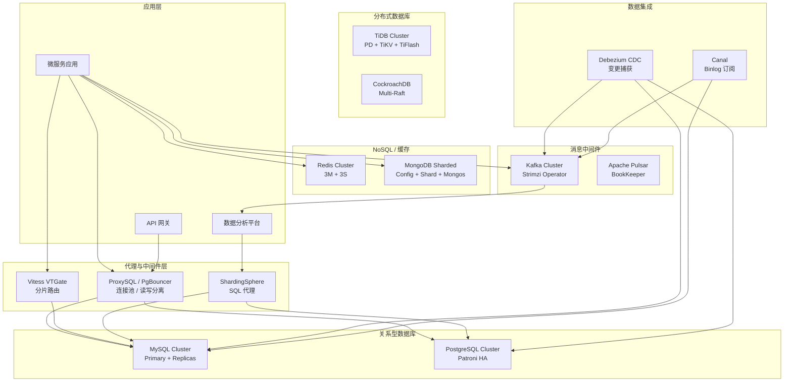
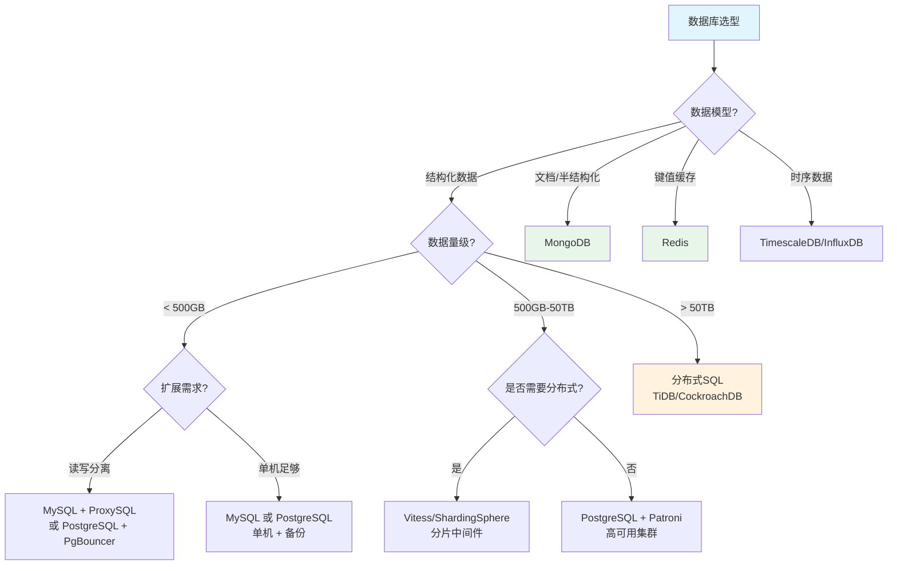

# Domain 28: 企业级数据库与中间件运维 (Enterprise Database & Middleware Operations)

> **领域定位**: 企业级数据库与中间件架构运维实践 | **文档数量**: 11篇 | **更新时间**: 2026-04-26

---

## 概述

企业级数据库与中间件运维是现代IT基础设施的核心领域。在企业数字化转型和云原生演进的过程中，数据存储层和消息中间件层的架构设计、部署实施和持续运维直接决定了业务系统的可用性、性能和数据安全。本领域涵盖了从传统关系型数据库到分布式数据库、从内存缓存到消息队列、从数据库代理到数据集成工具的完整技术栈，为企业在不同发展阶段和不同业务场景下提供专业的架构选型和运维指导。

数据库和中间件的运维管理是 IT 运维中最复杂、最关键的工作之一。数据库承载着企业最核心的业务数据，任何数据丢失或服务中断都可能导致严重的经济损失和声誉损害。中间件作为分布式系统的粘合层，负责服务间通信、数据路由和流量管理，其稳定性和性能直接影响整个系统的表现。随着微服务架构和云原生技术的普及，数据库和中间件的管理面临着新的挑战：如何在容器化环境中管理有状态服务、如何实现数据库的自动故障转移和弹性扩展、如何确保多租户场景下的数据隔离和资源公平分配。

本领域的文档体系覆盖了 MySQL、PostgreSQL、Redis、MongoDB、Kafka、TiDB、Vitess 等主流数据库和中间件的深度实践，每篇文档都包含架构设计、核心配置、性能调优、高可用部署、监控告警、故障排查和最佳实践等完整章节，确保读者能够从理论到实践全面掌握企业级数据库与中间件的运维技能。

### 核心技术挑战

企业级数据库与中间件运维面临以下核心技术挑战：

**数据一致性保障**是数据库运维的首要目标。在分布式环境中，网络分区、节点故障和并发写入都可能破坏数据一致性。MySQL 通过半同步复制（Semi-Synchronous Replication）和组复制（Group Replication）来保障数据安全；PostgreSQL 通过同步复制和逻辑复制来满足不同的数据一致性需求；TiDB 和 CockroachDB 通过 Raft 共识协议实现分布式事务的强一致性。运维人员需要深入理解每种一致性模型的原理和适用场景，根据业务的 RPO 和 RTO 要求选择合适的方案。

**高可用架构设计**是保障业务连续性的关键。数据库的高可用方案从简单的主从切换到复杂的分布式共识，技术复杂度差异巨大。MySQL MHA 实现秒级主从切换，Orchestrator 提供可视化的拓扑管理；PostgreSQL Patroni 基于 etcd 实现自动故障转移，CloudNativePG 在 Kubernetes 上提供声明式的高可用管理；Redis Sentinel 监控主从状态并自动执行故障转移，Redis Cluster 通过 Gossip 协议实现去中心化的集群管理。选择合适的高可用方案需要综合考虑故障检测时间、切换时间、数据丢失风险和运维复杂度。

**性能优化与容量规划**是数据库运维的持续工作。数据库性能问题通常表现为慢查询、高延迟和低吞吐量。MySQL 的性能优化涉及 InnoDB Buffer Pool 配置、查询索引优化、慢查询分析和连接池管理；PostgreSQL 的性能优化涉及 Shared Buffers 配置、查询计划分析和 Vacuum 管理；Redis 的性能优化涉及内存管理、持久化策略和大 Key 治理。容量规划需要基于业务增长趋势预估数据量、并发量和存储需求，提前做好扩容准备。

**云原生适配**是数据库和中间件面临的新课题。Kubernetes 的声明式管理和自动化运维能力为数据库管理带来了新的可能性，但也引入了新的复杂度。CloudNativePG、Strimzi、Redis Operator 等 Kubernetes Operator 将数据库的运维知识代码化，实现了数据库的自动化部署、扩容、备份和升级。但容器化环境中的网络存储性能、Pod 生命周期管理和资源隔离等问题仍然需要运维人员具备深厚的 Linux 和 Kubernetes 知识。

---

## 全部 11 篇文档概览

本领域共包含 11 篇文档，从开源项目索引到各专项技术的深度实践，形成完整的企业级数据库与中间件知识体系：

| 序号 | 文档 | 核心定位 | 关键技术点 | 难度 | 预计阅读 |
|:---:|:---|:---|:---|:---|:---|
| 00 | 开源项目索引 | 技术选型参考 | 50+ 开源项目分类索引、CNCF 状态、许可证合规 | 入门 | 45min |
| 01 | MySQL 企业级数据库 | 关系型数据库运维 | InnoDB 调优、ProxySQL 读写分离、MHA 高可用、XtraBackup | 中级→高级 | 90min |
| 02 | PostgreSQL 企业级数据库 | 关系型数据库运维 | Patroni HA、PgBouncer 连接池、WAL-G 备份、分区表 | 中级→高级 | 90min |
| 03 | 分布式数据库企业级 | NewSQL 深度实践 | TiDB HTAP、CockroachDB Multi-Raft、Vitess 分片 | 高级→专家 | 120min |
| 04 | 数据库中间件 K8s | 中间件云原生化 | Vitess Operator、ShardingSphere Proxy、ProxySQL on K8s | 高级→专家 | 120min |
| 05 | MongoDB 企业级数据库 | 文档数据库运维 | 副本集、分片集群、WiredTiger、Change Streams | 中级→高级 | 90min |
| 06 | Redis 企业级缓存 | 缓存架构实践 | Sentinel/Cluster、持久化、大 Key 治理、缓存一致性 | 中级→高级 | 90min |
| 07 | Redis K8s Operator | Redis 云原生化 | OT-CONTAINER-KIT、Sentinel vs Cluster 模式选型 | 中级→高级 | 60min |
| 08 | Kafka K8s Strimzi | 消息队列云原生化 | Strimzi Operator、KRaft 模式、Exactly-Once 语义 | 中级→高级 | 90min |
| 99 | CloudNativePG 企业指南 | PostgreSQL K8s | CNPG Operator、PITR、滚动升级、多租户 | 中级→高级 | 90min |

文档之间的依赖关系：00 为全局索引，01-02 为关系型数据库基础，03-04 为分布式和中间件进阶，05-06 为 NoSQL 基础，07-08 为 K8s Operator 实践，99 为 PostgreSQL K8s 专项。建议按索引顺序学习，但各文档也可独立阅读。

---

## 架构设计

### 企业级数据库与中间件总体架构



### 数据库选型决策流程



---

## 数据库选型矩阵

### MySQL vs PostgreSQL vs MongoDB vs Redis vs Kafka 深度对比

以下选型矩阵从 12 个关键维度对五大主流数据库/中间件进行横向对比，为企业架构决策提供量化参考。

| 维度 | MySQL | PostgreSQL | MongoDB | Redis | Kafka |
|:---|:---|:---|:---|:---|:---|
| **数据模型** | 关系型 (表) | 对象关系型 (表+JSON) | 文档型 (BSON) | 键值对 (String/Hash/List/Set/ZSet) | 事件流 (Topic/Partition) |
| **ACID** | 完整 ACID | 完整 ACID | 单文档 ACID / 4.0+ 多文档事务 | 单命令原子 / Lua 脚本 / 事务 | Exactly-Once 语义 |
| **水平扩展** | 需中间件 (Vitess/SS) | 需中间件 (Citus) | 原生分片 (Sharded Cluster) | 原生分片 (Cluster 16384 slot) | 原生分区 (Partition) |
| **读性能** | 高 (ProxySQL 分离) | 高 (PgBouncer 池化) | 极高 (WiredTiger 缓存) | 极高 (纯内存, 100K+ QPS) | 高 (顺序读写) |
| **写性能** | 高 (InnoDB Buffer) | 高 (WAL 批量提交) | 极高 (文档追加) | 极高 (单线程无锁) | 极高 (百万 TPS) |
| **数据量上限** | 单机 ~10TB | 单机 ~10TB | 分片无上限 | 受内存限制 (通常 < 500GB) | 无上限 (磁盘持久化) |
| **强一致性** | 半同步复制 | 同步复制 | WriteConcern majority | 不支持 | ISR 副本确认 |
| **高可用方案** | MHA/Orchestrator/Group Rep | Patroni/CloudNativePG | Replica Set (自动故障转移) | Sentinel/Cluster | KRaft/Strimzi |
| **K8s Operator** | Percona Operator | CloudNativePG (CNCF) | Community Operator | OT-CONTAINER-KIT | Strimzi (CNCF) |
| **查询灵活性** | SQL (成熟生态) | SQL (最丰富扩展) | MQL/Aggregation Pipeline | 有限 (仅按 Key/模式) | KSQL/kafkaStreams |
| **许可证** | GPL-2.0 | PostgreSQL License | SSPL | BSD-3-Clause | Apache-2.0 |
| **适用场景** | OLTP 交易系统 | OLTP + 复杂分析 | 内容管理 / IoT / 日志 | 缓存 / 会话 / 排行榜 | 事件流 / 数据管道 |

### 按业务场景推荐

| 业务场景 | 主库推荐 | 缓存层 | 消息层 | 理由 |
|:---|:---|:---|:---|:---|
| 电商交易 | MySQL + ProxySQL | Redis Cluster | Kafka | 事务强一致 + 高并发缓存 + 订单事件流 |
| 社交平台 | PostgreSQL + Patroni | Redis Cluster | Kafka | 复杂查询 + Feed 缓存 + 消息通知 |
| 内容管理 | MongoDB Sharded | Redis Sentinel | — | 文档灵活 schema + 高可用缓存 |
| 金融交易 | TiDB / CockroachDB | Redis Sentinel | Kafka | 分布式强一致 + 低延迟缓存 + 审计日志 |
| IoT 数据采集 | TimescaleDB | Redis | Kafka + Flink | 时序存储 + 实时聚合 |
| 日志分析 | ClickHouse | — | Kafka | 列式存储 + 高吞吐摄入 |
| 游戏排行榜 | MongoDB | Redis Cluster | — | 文档存储 + Sorted Set 原生排行 |
| 配置中心 | PostgreSQL | Redis | — | ACID 事务 + 缓存加速 |

---

## 部署模式对比

### 部署架构演进路径

企业数据库部署架构经历了从物理机到虚拟机、再到容器化和云原生的演进过程。不同部署模式在资源利用率、运维效率、弹性和成本方面差异显著。

| 部署模式 | 架构特点 | 优势 | 劣势 | 适用阶段 | 代表技术 |
|:---|:---|:---|:---|:---|:---|
| **物理机部署** | 独占硬件, 直接安装 | 性能极致, 延迟最低 | 资源利用率低, 扩容慢 | 传统企业, 合规要求 | 裸金属 + RAID 10 |
| **虚拟机部署** | VM 隔离, 模板化 | 资源池化, 快照备份 | 虚拟化损耗 (~5-10%) | 中型企业, 混合部署 | VMware / KVM |
| **容器化部署** | K8s Pod, StatefulSet | 声明式管理, 快速弹性 | 有状态管理复杂 | 云原生转型, DevOps | K8s + Operator |
| **云原生 Operator** | CRD 驱动, 自动化运维 | 全生命周期自动化, GitOps | 学习曲线, 锁定风险 | 云优先, 平台工程 | CNPG / Strimzi |
| **托管云服务** | 全托管, Serverless | 零运维, 自动扩展 | 成本高, 定制受限 | 初创公司, 快速上线 | RDS / Cloud SQL |

### 部署模式选型决策

```yaml
部署模式决策:
  物理机部署:
    适用条件:
      - 延迟敏感 (P99 < 1ms)
      - 合规要求 (金融/政务)
      - 数据量极大 (> 50TB 单实例)
      - 团队有专职 DBA
    典型架构: 主从 + VIP + MHA/Orchestrator

  虚拟机部署:
    适用条件:
      - 已有虚拟化平台
      - 中等规模 (< 20TB)
      - 需要快照和模板管理
      - 多租户隔离需求
    典型架构: VM + Patroni + PgBouncer

  K8s Operator:
    适用条件:
      - 已有 K8s 集群
      - 团队具备云原生技能
      - 需要 GitOps 自动化
      - 多集群多环境管理
    典型架构: CNPG / Strimzi + ArgoCD / Flux

  托管云服务:
    适用条件:
      - 无专职 DBA
      - 快速上线优先
      - 数据合规允许上云
      - 预算充裕
    典型架构: AWS RDS / GCP Cloud SQL / 阿里云 RDS
```

---

## 容量规划与 Sizing 指南

### 数据库规格 Sizing 表

| 业务规模 | QPS 目标 | 数据量 | MySQL 规格 | PostgreSQL 规格 | Redis 规格 |
|:---|:---|:---|:---|:---|:---|
| 小型 (< 1000 QPS) | 500-1K | < 100GB | 4C/16GB + 200GB SSD | 4C/16GB + 200GB SSD | 2C/8GB × 3 (Sentinel) |
| 中型 (1K-10K QPS) | 1K-10K | 100GB-1TB | 8C/32GB + 1TB SSD | 8C/32GB + 1TB SSD | 4C/16GB × 6 (Cluster) |
| 大型 (10K-50K QPS) | 10K-50K | 1TB-10TB | 16C/64GB × 2 + ProxySQL | 16C/64GB × 3 + PgBouncer | 8C/32GB × 9 (Cluster) |
| 超大型 (> 50K QPS) | 50K+ | > 10TB | Vitess 3+ Shard | CockroachDB 5+ Node | 16C/64GB × 15+ (Cluster) |

### Kafka Sizing 表

| 场景 | 吞吐量 | 消息大小 | 分区数 | Broker 规格 | 存储需求 |
|:---|:---|:---|:---|:---|:---|
| 日志采集 | 10K msg/s | 1KB | 12 | 4C/16GB × 3 | 500GB HDD/节点 |
| 事件流 | 100K msg/s | 500B | 24 | 8C/32GB × 5 | 2TB SSD/节点 |
| 数据管道 | 1M msg/s | 10KB | 60 | 16C/64GB × 7 | 10TB SSD/节点 |

### 容量规划公式

```yaml
容量规划核心公式:
  MySQL:
    innodb_buffer_pool_size = 总内存 × 0.7 (专用服务器)
    max_connections = (应用实例数 × 每实例连接数) × 1.5
    磁盘容量 = 数据量 × 2 (数据 + 索引 + binlog + 临时)
    
  PostgreSQL:
    shared_buffers = 总内存 × 0.25
    effective_cache_size = 总内存 × 0.75
    work_mem = (总内存 - shared_buffers) / (max_connections × 3)
    
  Redis:
    内存需求 = 数据量 × 2 (数据 + 内存碎片 + 复制缓冲)
    maxmemory = 物理内存 × 0.8 (预留系统和复制开销)
    
  Kafka:
    磁盘容量 = 吞吐量 × 保留天数 × 副本数 × 1.2 (压缩和索引开销)
    分区数 = 目标吞吐量 / 单分区吞吐量
    Broker数 = 总分区数 / (单Broker推荐分区数 1000-2000)
```

---

## 技术演进路线图

### 数据库技术演进时间线

```yaml
2015-2017_传统架构期:
  主流方案: MySQL主从 + Redis单机/哨兵
  运维模式: 手动运维 + 脚本化
  代表工具: MHA, mysqldump, Redis Sentinel

2018-2020_云原生起步期:
  主流方案: MySQL/PG + K8s StatefulSet
  运维模式: Operator 初步应用
  代表工具: Vitess CNCF毕业, Patroni, CloudNativePG 发布

2021-2023_云原生成熟期:
  主流方案: Operator 驱动, GitOps 管理
  运维模式: 声明式, 自动化运维
  代表工具: CloudNativePG CNCF Sandbox, Strimzi 成熟

2024-2026_智能化运维期:
  主流方案: AI辅助调优, Serverless 数据库
  运维模式: 平台工程, 自服务
  代表工具: TiDB Serverless, Redis 8.0 IO线程

2027+__下一代:
  趋势: 统一数据库 (HTAP), eBPF 监控, AI 自动修复
```

### 技术栈演进建议

```yaml
企业技术栈演进路线:
  阶段一_基础建设 (0-6个月):
    目标: 建立稳定可用的数据库基础设施
    行动:
      - MySQL/PG 主从高可用部署
      - Redis Sentinel 缓存层
      - 自动化备份恢复
      - 基础监控告警 (Prometheus + Grafana)
    产出: 生产级数据库集群, 99.9% 可用性

  阶段二_性能优化 (6-12个月):
    目标: 提升数据库性能和运维效率
    行动:
      - 引入 ProxySQL/PgBouncer 连接池
      - 慢查询优化和索引调优
      - Redis Cluster 扩展
      - 数据库中间件选型评估
    产出: QPS 提升 3-5x, P99 延迟降低 50%

  阶段三_云原生化 (12-18个月):
    目标: 数据库云原生化, GitOps 管理
    行动:
      - 引入 K8s Operator (CNPG/Strimzi/Redis Operator)
      - GitOps 部署流程
      - 自动化扩缩容
      - 多集群管理
    产出: 运维效率提升 5x, 自动化覆盖率 > 90%

  阶段四_分布式扩展 (18-24个月):
    目标: 应对超大规模数据和高并发
    行动:
      - 评估分布式数据库 (TiDB/CockroachDB)
      - 数据分片策略实施 (Vitess/ShardingSphere)
      - 跨机房容灾
      - HTAP 分析能力
    产出: 水平扩展能力, 99.99% 可用性
```

---

## 文档目录

### 核心数据库系统

| 文档 | 主题 | 难度 |
|:---|:---|:---|
| [00-开源项目索引](./00-open-source-projects-index.md) | 企业数据库与中间件领域开源项目选型索引 | 入门 |
| [01-MySQL企业级数据库](./01-mysql-enterprise-database.md) | MySQL 高可用架构、InnoDB 调优、ProxySQL 读写分离、XtraBackup 备份 | 中级→高级 |
| [02-PostgreSQL企业级数据库](./02-postgresql-enterprise-database.md) | PostgreSQL Patroni 高可用、PgBouncer 连接池、WAL-G 备份恢复 | 中级→高级 |
| [03-分布式数据库企业级](./03-distributed-database-enterprise.md) | TiDB/CockroachDB/Vitess 架构、数据分片、跨机房容灾 | 高级→专家 |
| [04-数据库中间件Kubernetes](./04-database-middleware-kubernetes.md) | Vitess/ShardingSphere/ProxySQL on K8s、连接池模式、分片策略 | 高级→专家 |
| [05-MongoDB企业级数据库](./05-mongodb-enterprise-database.md) | MongoDB 副本集/分片集群、WiredTiger 调优、Oplog 备份 | 中级→高级 |
| [06-Redis企业级缓存](./06-redis-enterprise-cache.md) | Redis Sentinel/Cluster、持久化策略、大Key治理、缓存一致性 | 中级→高级 |
| [07-Redis Kubernetes Operator](./07-redis-kubernetes-operator.md) | Redis on K8s、OT-CONTAINER-KIT Operator、Sentinel vs Cluster 模式 | 中级→高级 |
| [08-Kafka Kubernetes Strimzi](./08-kafka-kubernetes-strimzi.md) | Strimzi Operator、KRaft 模式、Topic 管理、Exactly-Once 语义 | 中级→高级 |
| [99-CloudNativePG企业指南](./99-cloudnativepg-enterprise-guide.md) | CNPG Operator、PITR、PgBouncer、滚动升级、多租户 | 中级→高级 |

### 学习路径建议

```
入门阶段:
  00-开源项目索引 → 01-MySQL → 02-PostgreSQL

进阶阶段:
  06-Redis → 05-MongoDB → 99-CloudNativePG → 07-Redis K8s → 08-Kafka Strimzi

专家阶段:
  03-分布式数据库 → 04-数据库中间件 K8s → 多数据库混合架构设计
```

---

## 核心技术栈

### 关系型数据库技术栈

```yaml
MySQL生态:
  核心组件:
    - MySQL Server v9.2 (GPL-2.0)
    - Percona Server v8.4 (增强版MySQL)
    - MariaDB Server v11.4 (MySQL分支)
  
  高可用方案:
    - MHA v0.58: 主从切换，RTO 30秒
    - Orchestrator v3.2: 拓扑管理，可视化操作
    - MySQL Group Replication: 原生多主方案
  
  代理与中间件:
    - ProxySQL v2.7: 读写分离 + 连接池 + 查询路由
    - Vitess v21.0: CNCF Graduated，MySQL水平扩展
    - ShardingSphere v5.5: 多数据库分片代理
  
  备份与恢复:
    - Percona XtraBackup: 热备份
    - MySQL Enterprise Backup: 官方备份
    - mydumper/myloader: 并行逻辑备份

PostgreSQL生态:
  核心组件:
    - PostgreSQL v17.4 (PostgreSQL License)
    - Patroni v4.0: 自动故障转移
    - PgBouncer v1.23: 连接池
    - PgPool-II v4.5: 负载均衡 + 连接池
  
  Kubernetes Operator:
    - CloudNativePG v1.25: EDB出品，CNCF Sandbox
    - Zalando Postgres Operator v1.14
    - Crunchy Data PGO v5.8
  
  备份与恢复:
    - Barman v3.12: 企业级备份管理
    - WAL-G v3.0: WAL归档备份
    - pgBackRest: 企业级备份方案
```

### 分布式数据库技术栈

```yaml
NewSQL分布式数据库:
  TiDB生态:
    - TiDB v9.0: HTAP数据库
    - TiKV v8.5: 分布式KV存储 (CNCF Graduated)
    - TiFlash v9.0: HTAP列存引擎
    - PD: 调度器，管理元数据和调度
    - TiCDC: 增量数据同步
  
  CockroachDB:
    - v25.1: 云原生分布式SQL
    - Multi-Raft共识协议
    - Geo-Partitioning: 地理分区
  
  Vitess:
    - v21.0: CNCF Graduated
    - VTGate: 查询路由和分片
    - VTTablet: MySQL实例管理
    - VReplication: 数据迁移
  
  OceanBase:
    - v4.3: 分布式关系数据库
    - MulanPSL-2.0许可证

NoSQL数据库:
  Redis:
    - v8.0: 内存键值数据库
    - Sentinel: 高可用监控
    - Cluster: 数据分片
    - RDB/AOF: 持久化
  
  MongoDB:
    - v8.0: 文档型数据库
    - Replica Set: 副本集
    - Sharded Cluster: 分片集群
    - Change Streams: 变更流
```

### 消息中间件技术栈

```yaml
Kafka生态:
  核心:
    - Apache Kafka v3.9: 分布式消息队列
    - KRaft模式: 无ZooKeeper
    - Cruise Control: 集群重平衡
  
  Kubernetes:
    - Strimzi v0.45: CNCF Sandbox Kafka Operator
    - Redpanda v24.3: K8s-native Kafka替代
  
  流处理:
    - Apache Flink v1.21: 流处理引擎
    - Kafka Streams: 轻量级流处理

其他消息队列:
  - Apache Pulsar v4.0: 云原生消息流
  - RabbitMQ v4.0: AMQP消息代理
  - NATS v2.11: 轻量级消息系统
  - Apache RocketMQ v5.3: 分布式消息队列
```

---

## 数据库运维核心理念

### 高可用与容灾

数据库高可用是保障业务连续性的基础。在设计高可用方案时，需要根据业务的 SLA 要求来确定 RPO 和 RTO 目标，然后选择合适的技术方案。

| 高可用等级 | RTO 目标 | RPO 目标 | 典型方案 | 适用场景 |
|:---|:---|:---|:---|:---|
| 同城双活 | < 30秒 | 0（零丢失） | MySQL半同步 + VIP切换 | 金融交易 |
| 同城主从 | 1-5分钟 | < 1秒 | MySQL异步复制 + MHA | 电商、社交 |
| 异地容灾 | 5-30分钟 | < 10秒 | TiDB跨机房同步 | 大型企业 |
| 逻辑备份 | 小时级 | 小时级 | mysqldump/pg_dump | 非关键业务 |

### 性能优化方法论

数据库性能优化遵循"监控-分析-优化-验证"的闭环方法论。首先通过监控系统发现性能瓶颈（慢查询、高CPU、高IO等），然后通过分析工具定位根因（执行计划、锁等待、缓冲池命中率等），接着实施优化措施（索引优化、参数调整、架构变更等），最后通过压测验证优化效果。

```yaml
性能优化关键指标:
  MySQL:
    - InnoDB Buffer Pool命中率: > 99%
    - 慢查询数量: < 10/小时
    - 连接池利用率: 60-80%
    - 主从复制延迟: < 1秒
  
  PostgreSQL:
    - Shared Buffers命中率: > 99%
    - Dead Tuples比例: < 5%
    - 活跃连接数: < max_connections的80%
    - WAL生成速率: 监控异常峰值
  
  Redis:
    - 命中率: > 95%
    - 内存碎片率: 1.0-1.5
    - 慢命令数量: < 5/分钟
    - 连接数: < maxclients的80%
```

### 备份与恢复策略

备份是数据安全的最后一道防线。企业级备份策略需要考虑备份类型（全量/增量/差异）、备份频率（小时级/天级/周级）、保留策略（7天/30天/1年）、存储位置（本地/异地/云端）和恢复验证（定期恢复测试）等多个维度。

| 备份类型 | 频率 | 保留时间 | 存储位置 | 验证频率 |
|:---|:---|:---|:---|:---|
| 全量物理备份 | 每日 | 30天 | 本地 + S3 | 每周 |
| 增量备份 | 每小时 | 7天 | 本地 | 每月 |
| Binlog/WAL归档 | 实时 | 7天 | 本地 + 异地 | 每季度 |
| 逻辑备份 | 每周 | 90天 | S3 (冷存储) | 每月 |
| 灾备快照 | 每月 | 1年 | 异地 | 每季度 |

### 监控告警体系

完善的监控告警体系是数据库稳定运行的基础保障。监控需要覆盖基础设施层（CPU、内存、磁盘、网络）、数据库层（连接数、QPS、延迟、复制状态）和业务层（慢查询、错误率、队列深度）三个层次。告警规则需要根据严重程度设置不同的响应级别和通知渠道。

```yaml
监控指标分级:
  Critical (立即响应):
    - 数据库实例宕机
    - 复制中断超过5分钟
    - 磁盘使用率超过95%
    - 内存使用率超过95%
  
  Warning (30分钟内响应):
    - 慢查询数量异常增加
    - 复制延迟超过10秒
    - 磁盘使用率超过85%
    - 连接数超过80%
  
  Info (关注即可):
    - 参数变更
    - 备份完成/失败
    - 自动故障转移事件
    - 滚动升级状态
```

---

## 最佳实践

### 数据库版本升级策略

数据库版本升级是企业运维中最敏感的操作之一。推荐采用滚动升级策略：先将所有从库升级到新版本，验证功能正常后执行一次 switchover 将新版本的从库提升为主库，最后升级旧主库。CloudNativePG 和 Patroni 都原生支持这种升级模式。

| 升级策略 | 停机时间 | 风险等级 | 复杂度 | 适用场景 |
|:---|:---|:---|:---|:---|
| 滚动升级 | 零 | 低 | 中 | 小版本升级 |
| 蓝绿部署 | 零 | 低 | 高 | 大版本升级 |
| 逻辑迁移 | 分钟级 | 中 | 中 | 跨版本升级 |
| 原地升级 | 分钟级 | 高 | 低 | 测试环境 |

### 连接池配置原则

```yaml
连接池容量规划:
  公式: pool_size = (平均查询时间ms × 目标QPS) / 1000
  
  MySQL ProxySQL配置:
    max_connections: 应用总连接数 × 1.5
    default_pool_size: max_connections / (hostgroup_count × 2)
    pool_mode: transaction
  
  PostgreSQL PgBouncer配置:
    max_client_conn: 应用总连接数 × 1.5
    default_pool_size: PostgreSQL max_connections / pooler_count × 0.8
    pool_mode: transaction
    reserve_pool_size: default_pool_size × 0.2
  
  Redis连接管理:
    maxclients: 根据内存和文件描述符限制
    timeout: 300 (空闲连接超时)
    tcp-keepalive: 60
```

### 安全加固清单

```yaml
数据库安全加固:
  访问控制:
    - 启用认证，禁止匿名访问
    - 使用最小权限原则分配用户权限
    - 定期审计用户权限
  
  网络安全:
    - 数据库仅监听内网地址
    - 使用TLS加密客户端连接
    - 配置防火墙规则限制访问源
  
  数据加密:
    - 启用透明数据加密 (TDE)
    - 备份文件加密存储
    - 敏感字段应用层加密
  
  审计日志:
    - 开启操作审计日志
    - 记录DDL操作和权限变更
    - 定期分析审计日志
  
  补丁管理:
    - 关注CVE漏洞公告
    - 及时应用安全补丁
    - 建立补丁测试流程
```

---

## 故障排查

### 数据库常见故障分类

| 故障类别 | 典型现象 | 排查方法 | 通用解决方案 |
|:---|:---|:---|:---|
| 连接问题 | 连接超时/拒绝 | 检查max_connections、网络连通性 | 调整连接池、增加max_connections |
| 性能问题 | 慢查询/高延迟 | EXPLAIN分析、慢查询日志 | 添加索引、优化查询、调整参数 |
| 复制问题 | 复制延迟/中断 | SHOW SLAVE STATUS、网络检查 | 修复网络、重建复制、优化大事务 |
| 存储问题 | 磁盘满/IO高 | df/iostat/vmstat | 扩容、清理、归档历史数据 |
| 内存问题 | OOM/内存泄漏 | 监控内存曲线、分析缓冲池 | 调整内存参数、优化查询 |
| 锁问题 | 死锁/锁等待 | SHOW ENGINE INNODB STATUS | 优化事务、缩短事务时间 |

### 数据库运维诊断脚本

```bash
#!/bin/bash
# db_health_check.sh - Database Health Check Script
set -euo pipefail

echo "=== Database Health Check Report ==="
echo "Check Time: $(date '+%Y-%m-%d %H:%M:%S')"
echo "Hostname: $(hostname)"
echo "Kernel: $(uname -r)"
echo ""

echo "[1] MySQL Status Check"
if mysqladmin ping -h 127.0.0.1 --silent 2>/dev/null; then
    echo "  MySQL Status: RUNNING"
    echo "  Threads Connected: $(mysql -N -e "SHOW GLOBAL STATUS LIKE 'Threads_connected'" 2>/dev/null | awk '{print $2}')"
    echo "  Slow Queries: $(mysql -N -e "SHOW GLOBAL STATUS LIKE 'Slow_queries'" 2>/dev/null | awk '{print $2}')"
    echo "  Queries Per Second: $(mysql -N -e "SHOW GLOBAL STATUS LIKE 'Queries'" 2>/dev/null | awk '{print $2}')"
    REPL_STATUS=$(mysql -e "SHOW SLAVE STATUS\G" 2>/dev/null | grep -E "Slave_IO_Running|Slave_SQL_Running|Seconds_Behind" || echo "  No replication configured")
    echo "  $REPL_STATUS"
else
    echo "  MySQL Status: NOT RUNNING"
fi

echo ""
echo "[2] PostgreSQL Status Check"
if pg_isready -q 2>/dev/null; then
    echo "  PostgreSQL Status: RUNNING"
    echo "  Active Connections: $(psql -t -c "SELECT count(*) FROM pg_stat_activity WHERE state='active';" 2>/dev/null | xargs)"
    echo "  Is In Recovery: $(psql -t -c "SELECT pg_is_in_recovery();" 2>/dev/null | xargs)"
    echo "  Database Size: $(psql -t -c "SELECT pg_size_pretty(pg_database_size(current_database()));" 2>/dev/null | xargs)"
else
    echo "  PostgreSQL Status: NOT RUNNING"
fi

echo ""
echo "[3] Redis Status Check"
if redis-cli ping > /dev/null 2>&1; then
    echo "  Redis Status: RUNNING"
    echo "  Used Memory: $(redis-cli info memory 2>/dev/null | grep used_memory_human | head -1 | cut -d: -f2 | tr -d '\r')"
    echo "  Max Memory: $(redis-cli info memory 2>/dev/null | grep maxmemory_human | head -1 | cut -d: -f2 | tr -d '\r')"
    echo "  Role: $(redis-cli info replication 2>/dev/null | grep '^role:' | cut -d: -f2 | tr -d '\r')"
    echo "  Connected Slaves: $(redis-cli info replication 2>/dev/null | grep connected_slaves | cut -d: -f2 | tr -d '\r')"
    echo "  Keyspace Hit Rate: $(redis-cli info stats 2>/dev/null | grep keyspace_hit_rate | cut -d: -f2 | tr -d '\r')"
else
    echo "  Redis Status: NOT RUNNING"
fi

echo ""
echo "[4] Kafka Status Check"
if command -v kafka-topics.sh &>/dev/null; then
    echo "  Kafka Topics: $(kafka-topics.sh --list --bootstrap-server localhost:9092 2>/dev/null | wc -l)"
    echo "  Under-Replicated Partitions: $(kafka-topics.sh --describe --under-replicated-partitions --bootstrap-server localhost:9092 2>/dev/null | grep -c 'Leader' || echo 0)"
else
    echo "  Kafka CLI not found, skipping"
fi

echo ""
echo "[5] Disk Usage Check"
df -h /var/lib/mysql /var/lib/postgresql /var/lib/redis /var/lib/kafka 2>/dev/null || df -h

echo ""
echo "[6] System Resources"
echo "  Load Average: $(uptime | awk -F'load average:' '{print $2}')"
echo "  Memory Usage:"
free -h | head -2
echo ""
echo "  Top CPU Processes:"
ps aux --sort=-%cpu | head -6

echo ""
echo "=== Health Check Complete ==="
```

---

## 适用场景

- 企业级数据库架构设计与选型
- 高可用数据库集群部署与运维
- 数据库性能优化与故障排查
- Kubernetes 上数据库和中间件管理
- 数据安全、备份恢复与灾难恢复
- 大规模数据水平扩展方案
- 实时数据流处理与消息队列
- 多数据库混合架构与数据治理

---

## 技术栈概览

```yaml
关系型数据库:
  MySQL: InnoDB、MHA、Orchestrator、ProxySQL
  PostgreSQL: Patroni、PgBouncer、Barman、WAL-G、CloudNativePG

NoSQL数据库:
  Redis: Sentinel、Cluster、RDB/AOF
  MongoDB: Replica Set、Sharded Cluster、WiredTiger

分布式数据库:
  TiDB: PD、TiKV、TiFlash
  CockroachDB: Multi-Raft
  Vitess: VTGate、VTTablet

消息中间件:
  Kafka: Strimzi Operator、KRaft、Cruise Control
  Pulsar: BookKeeper、Geo-Replication

数据库中间件:
  Vitess: CNCF Graduated MySQL 分片
  ShardingSphere: 多数据库分片代理
  ProxySQL: MySQL 读写分离/连接池

数据集成:
  Debezium: CDC 变更数据捕获
  Canal: MySQL Binlog 增量订阅
```

---

## 参考资源

- [CNCF Cloud Native Landscape - Database](https://landscape.cncf.io/guide#database)
- [Vitess 文档](https://vitess.io/docs/)
- [TiDB 文档](https://docs.pingcap.com/tidb/)
- [CloudNativePG 文档](https://cloudnative-pg.io/documentation/)
- [Strimzi 文档](https://strimzi.io/docs/)
- [DB-Engines 数据库排名](https://db-engines.com/en/ranking)
- [MySQL 官方文档](https://dev.mysql.com/doc/)
- [PostgreSQL 官方文档](https://www.postgresql.org/docs/)

---
*持续更新最新数据库和中间件运维技术*
