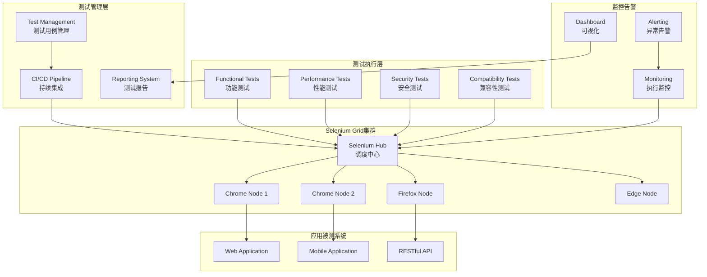

# Selenium 企业级自动化测试平台

## 概述 (Overview)

Selenium是业界领先的开源Web自动化测试框架，支持多种编程语言和浏览器。本文档从企业级测试专家角度，深入探讨Selenium的架构设计、测试策略、持续集成和运维管理最佳实践。

Selenium is the industry-leading open-source web automation testing framework that supports multiple programming languages and browsers. This document explores Selenium's architecture design, testing strategies, continuous integration, and operational management best practices from an enterprise testing expert perspective.

## 架构设计 (Architecture Design)

### 企业级测试架构 (Enterprise Testing Architecture)

```yaml
# Selenium Grid 4 高可用部署
version: '3.8'
services:
  selenium-hub:
    image: selenium/hub:4.15.0
    container_name: selenium-hub
    ports:
      - "4442:4442"
      - "4443:4443"
      - "4444:4444"
    environment:
      - SE_EVENT_BUS_HOST=selenium-hub
      - SE_EVENT_BUS_PUBLISH_PORT=4442
      - SE_EVENT_BUS_SUBSCRIBE_PORT=4443
      - JAVA_OPTS=-Xmx2g
    networks:
      - selenium-network

  chrome-node-1:
    image: selenium/node-chrome:4.15.0
    container_name: chrome-node-1
    depends_on:
      - selenium-hub
    environment:
      - SE_EVENT_BUS_HOST=selenium-hub
      - SE_EVENT_BUS_PUBLISH_PORT=4442
      - SE_EVENT_BUS_SUBSCRIBE_PORT=4443
      - SE_NODE_MAX_SESSIONS=4
      - SE_NODE_OVERRIDE_MAX_SESSIONS=true
      - JAVA_OPTS=-Xmx1g
    volumes:
      - /dev/shm:/dev/shm
    networks:
      - selenium-network

  chrome-node-2:
    image: selenium/node-chrome:4.15.0
    container_name: chrome-node-2
    depends_on:
      - selenium-hub
    environment:
      - SE_EVENT_BUS_HOST=selenium-hub
      - SE_EVENT_BUS_PUBLISH_PORT=4442
      - SE_EVENT_BUS_SUBSCRIBE_PORT=4443
      - SE_NODE_MAX_SESSIONS=4
      - SE_NODE_OVERRIDE_MAX_SESSIONS=true
      - JAVA_OPTS=-Xmx1g
    volumes:
      - /dev/shm:/dev/shm
    networks:
      - selenium-network

  firefox-node:
    image: selenium/node-firefox:4.15.0
    container_name: firefox-node
    depends_on:
      - selenium-hub
    environment:
      - SE_EVENT_BUS_HOST=selenium-hub
      - SE_EVENT_BUS_PUBLISH_PORT=4442
      - SE_EVENT_BUS_SUBSCRIBE_PORT=4443
      - SE_NODE_MAX_SESSIONS=4
      - SE_NODE_OVERRIDE_MAX_SESSIONS=true
      - JAVA_OPTS=-Xmx1g
    networks:
      - selenium-network

networks:
  selenium-network:
    driver: bridge
```

### 测试架构图 (Testing Architecture Diagram)



## 核心测试框架配置 (Core Testing Framework Configuration)

### 测试项目结构 (Test Project Structure)

```python
# 企业级Selenium测试项目结构
selenium_enterprise_tests/
├── src/
│   ├── main/
│   │   ├── java/com/company/testing/
│   │   │   ├── config/
│   │   │   │   ├── WebDriverFactory.java
│   │   │   │   ├── TestConfig.java
│   │   │   │   └── BrowserConfig.java
│   │   │   ├── pages/
│   │   │   │   ├── BasePage.java
│   │   │   │   ├── LoginPage.java
│   │   │   │   ├── DashboardPage.java
│   │   │   │   └── UserManagementPage.java
│   │   │   ├── tests/
│   │   │   │   ├── base/
│   │   │   │   │   ├── BaseTest.java
│   │   │   │   │   └── TestListener.java
│   │   │   │   ├── functional/
│   │   │   │   │   ├── LoginTests.java
│   │   │   │   │   ├── UserManagementTests.java
│   │   │   │   │   └── NavigationTests.java
│   │   │   │   ├── performance/
│   │   │   │   │   └── LoadTests.java
│   │   │   │   └── security/
│   │   │   │       └── SecurityTests.java
│   │   │   └── utils/
│   │   │       ├── TestDataGenerator.java
│   │   │       ├── ScreenshotHelper.java
│   │   │       ├── ReportGenerator.java
│   │   │       └── DriverManager.java
│   │   └── resources/
│   │       ├── testng.xml
│   │       ├── config.properties
│   │       └── log4j2.xml
├── pom.xml
└── README.md
```

### WebDriver工厂配置 (WebDriver Factory Configuration)

```java
// WebDriver工厂类
public class WebDriverFactory {
    private static final Logger logger = LoggerFactory.getLogger(WebDriverFactory.class);
    private static ThreadLocal<WebDriver> driverThreadLocal = new ThreadLocal<>();
    
    public static WebDriver createDriver(BrowserType browserType, DriverConfig config) {
        WebDriver driver = null;
        
        switch (browserType) {
            case CHROME:
                driver = createChromeDriver(config);
                break;
            case FIREFOX:
                driver = createFirefoxDriver(config);
                break;
            case EDGE:
                driver = createEdgeDriver(config);
                break;
            default:
                throw new IllegalArgumentException("Unsupported browser: " + browserType);
        }
        
        // 通用配置
        driver.manage().window().maximize();
        driver.manage().timeouts().implicitlyWait(Duration.ofSeconds(config.getImplicitWait()));
        driver.manage().timeouts().pageLoadTimeout(Duration.ofSeconds(config.getPageLoadTimeout()));
        
        driverThreadLocal.set(driver);
        return driver;
    }
    
    private static WebDriver createChromeDriver(DriverConfig config) {
        ChromeOptions options = new ChromeOptions();
        
        // 基础选项
        options.addArguments("--no-sandbox");
        options.addArguments("--disable-dev-shm-usage");
        options.addArguments("--disable-gpu");
        options.addArguments("--window-size=1920,1080");
        
        // 性能优化选项
        options.addArguments("--disable-extensions");
        options.addArguments("--disable-plugins");
        options.addArguments("--disable-images");
        
        // 安全选项
        options.addArguments("--disable-web-security");
        options.addArguments("--allow-running-insecure-content");
        
        // 日志配置
        LoggingPreferences logPrefs = new LoggingPreferences();
        logPrefs.enable(LogType.BROWSER, Level.ALL);
        options.setCapability(CapabilityType.LOGGING_PREFS, logPrefs);
        
        // 远程WebDriver配置
        if (config.isRemote()) {
            try {
                return new RemoteWebDriver(new URL(config.getGridUrl()), options);
            } catch (MalformedURLException e) {
                logger.error("Invalid Grid URL: " + config.getGridUrl(), e);
                throw new RuntimeException("Failed to create remote WebDriver", e);
            }
        } else {
            return new ChromeDriver(options);
        }
    }
}
```

## 测试策略与框架 (Testing Strategy and Framework)

### Page Object Model实现 (Page Object Model Implementation)

```java
// 基础页面类
public abstract class BasePage {
    protected WebDriver driver;
    protected WebDriverWait wait;
    
    public BasePage(WebDriver driver) {
        this.driver = driver;
        this.wait = new WebDriverWait(driver, Duration.ofSeconds(30));
    }
    
    protected WebElement waitForElement(By locator) {
        return wait.until(ExpectedConditions.presenceOfElementLocated(locator));
    }
    
    protected WebElement waitForClickable(By locator) {
        return wait.until(ExpectedConditions.elementToBeClickable(locator));
    }
    
    protected void waitForPageLoad() {
        wait.until(webDriver -> 
            ((JavascriptExecutor) webDriver)
                .executeScript("return document.readyState").equals("complete"));
    }
}

// 登录页面实现
public class LoginPage extends BasePage {
    // 页面元素定位器
    private By usernameField = By.id("username");
    private By passwordField = By.id("password");
    private By loginButton = By.id("login-btn");
    private By errorMessage = By.cssSelector(".error-message");
    
    public LoginPage(WebDriver driver) {
        super(driver);
    }
    
    // 页面操作方法
    public LoginPage enterUsername(String username) {
        waitForElement(usernameField).sendKeys(username);
        return this;
    }
    
    public LoginPage enterPassword(String password) {
        waitForElement(passwordField).sendKeys(password);
        return this;
    }
    
    public DashboardPage clickLogin() {
        waitForClickable(loginButton).click();
        return new DashboardPage(driver);
    }
    
    public LoginPage loginWithInvalidCredentials(String username, String password) {
        enterUsername(username);
        enterPassword(password);
        clickLogin();
        return this;
    }
    
    // 断言方法
    public boolean isErrorMessageDisplayed() {
        try {
            return waitForElement(errorMessage).isDisplayed();
        } catch (TimeoutException e) {
            return false;
        }
    }
    
    public String getErrorMessageText() {
        return waitForElement(errorMessage).getText();
    }
}
```

### 测试数据管理 (Test Data Management)

```java
// 测试数据生成器
public class TestDataGenerator {
    private static final Faker faker = new Faker();
    
    public static class User {
        private String username;
        private String password;
        private String email;
        private String firstName;
        private String lastName;
        
        // 构造函数和getter/setter方法
        public User() {
            this.username = faker.name().username();
            this.password = faker.internet().password(8, 16, true);
            this.email = faker.internet().emailAddress();
            this.firstName = faker.name().firstName();
            this.lastName = faker.name().lastName();
        }
        
        // getter和setter方法...
    }
    
    public static class TestData {
        public static User createValidUser() {
            return new User();
        }
        
        public static User createInvalidUser() {
            User user = new User();
            user.setPassword("123"); // 弱密码
            return user;
        }
        
        public static List<User> createMultipleUsers(int count) {
            List<User> users = new ArrayList<>();
            for (int i = 0; i < count; i++) {
                users.add(new User());
            }
            return users;
        }
    }
}
```

## 持续集成配置 (Continuous Integration Configuration)

### Jenkins Pipeline配置 (Jenkins Pipeline Configuration)

```groovy
// Jenkinsfile - Selenium测试流水线
pipeline {
    agent any
    
    environment {
        MAVEN_OPTS = '-Xmx2g -XX:MaxMetaspaceSize=512m'
        SELENIUM_GRID_URL = 'http://selenium-hub:4444/wd/hub'
        TEST_ENVIRONMENT = 'staging'
    }
    
    tools {
        maven 'Maven 3.8.6'
        jdk 'OpenJDK 11'
    }
    
    stages {
        stage('Checkout') {
            steps {
                git branch: 'main', url: 'https://github.com/company/selenium-tests.git'
            }
        }
        
        stage('Build') {
            steps {
                sh 'mvn clean compile'
            }
        }
        
        stage('Static Code Analysis') {
            steps {
                sh 'mvn sonar:sonar'
            }
        }
        
        stage('Unit Tests') {
            steps {
                sh 'mvn test -Dtest=*UnitTest'
            }
            post {
                always {
                    publishTestResults testResultsPattern: 'target/surefire-reports/*.xml'
                }
            }
        }
        
        stage('Selenium Tests') {
            parallel {
                stage('Functional Tests') {
                    steps {
                        sh '''
                            mvn test \
                            -Dtest=*FunctionalTest \
                            -Dselenium.grid.url=${SELENIUM_GRID_URL} \
                            -Denvironment=${TEST_ENVIRONMENT}
                        '''
                    }
                }
                stage('Regression Tests') {
                    steps {
                        sh '''
                            mvn test \
                            -Dtest=*RegressionTest \
                            -Dselenium.grid.url=${SELENIUM_GRID_URL} \
                            -Denvironment=${TEST_ENVIRONMENT}
                        '''
                    }
                }
            }
            post {
                always {
                    publishTestResults testResultsPattern: 'target/failsafe-reports/*.xml'
                    publishHTML([
                        allowMissing: false,
                        alwaysLinkToLastBuild: true,
                        keepAll: true,
                        reportDir: 'target/surefire-reports',
                        reportFiles: 'index.html',
                        reportName: 'Selenium Test Report'
                    ])
                }
            }
        }
        
        stage('Performance Tests') {
            steps {
                sh '''
                    mvn test \
                    -Dtest=*PerformanceTest \
                    -Dselenium.grid.url=${SELENIUM_GRID_URL} \
                    -Denvironment=${TEST_ENVIRONMENT}
                '''
            }
        }
        
        stage('Security Tests') {
            steps {
                sh '''
                    mvn test \
                    -Dtest=*SecurityTest \
                    -Dselenium.grid.url=${SELENIUM_GRID_URL} \
                    -Denvironment=${TEST_ENVIRONMENT}
                '''
            }
        }
    }
    
    post {
        always {
            archiveArtifacts artifacts: 'target/*.jar', fingerprint: true
            archiveArtifacts artifacts: 'target/test-classes/**/*.png', allowEmptyArchive: true
            archiveArtifacts artifacts: 'target/site/serenity/*.html', allowEmptyArchive: true
            
            script {
                def testResult = currentBuild.result ?: 'SUCCESS'
                if (testResult == 'FAILURE') {
                    emailext (
                        subject: "Selenium Tests FAILED - Build ${env.BUILD_NUMBER}",
                        body: """
                        Selenium test execution completed with status: ${testResult}
                        
                        Build URL: ${env.BUILD_URL}
                        Test Environment: ${TEST_ENVIRONMENT}
                        
                        Please check the test results and logs for details.
                        """,
                        to: 'qa-team@company.com',
                        mimeType: 'text/html'
                    )
                }
            }
        }
    }
}
```

## 监控与报告 (Monitoring and Reporting)

### 测试监控配置 (Test Monitoring Configuration)

```yaml
# Prometheus监控配置
scrape_configs:
  - job_name: 'selenium-grid'
    static_configs:
      - targets: ['selenium-hub:4444']
    metrics_path: '/metrics'
    
  - job_name: 'jenkins'
    static_configs:
      - targets: ['jenkins:8080']
    metrics_path: '/prometheus/'

# Grafana仪表板配置
dashboard:
  title: "Selenium Test Monitoring"
  panels:
    - title: "Test Execution Rate"
      type: "graph"
      targets:
        - expr: "rate(jenkins_job_duration_sum[5m])"
          legendFormat: "{{job}}"
    
    - title: "Grid Node Utilization"
      type: "gauge"
      targets:
        - expr: "selenium_grid_node_sessions"
          legendFormat: "Active Sessions"
    
    - title: "Test Failure Rate"
      type: "heatmap"
      targets:
        - expr: "increase(jenkins_job_failures[1h])"
          legendFormat: "Failures per hour"
```

### 测试报告生成 (Test Report Generation)

```java
// 测试监听器和报告生成
public class TestListener implements ITestListener {
    private static final Logger logger = LoggerFactory.getLogger(TestListener.class);
    private ExtentReports extent;
    private static ThreadLocal<ExtentTest> test = new ThreadLocal<>();
    
    @Override
    public void onStart(ITestContext context) {
        ExtentSparkReporter sparkReporter = new ExtentSparkReporter("target/extent-report.html");
        sparkReporter.config().setTheme(Theme.STANDARD);
        sparkReporter.config().setDocumentTitle("Selenium Test Report");
        sparkReporter.config().setReportName("Enterprise Selenium Tests");
        
        extent = new ExtentReports();
        extent.attachReporter(sparkReporter);
        extent.setSystemInfo("Environment", System.getProperty("test.environment", "QA"));
        extent.setSystemInfo("Browser", System.getProperty("test.browser", "Chrome"));
        extent.setSystemInfo("Selenium Version", "4.15.0");
    }
    
    @Override
    public void onTestStart(ITestResult result) {
        ExtentTest extentTest = extent.createTest(result.getMethod().getMethodName());
        test.set(extentTest);
    }
    
    @Override
    public void onTestSuccess(ITestResult result) {
        test.get().pass("Test passed");
        captureScreenshot(result);
    }
    
    @Override
    public void onTestFailure(ITestResult result) {
        test.get().fail(result.getThrowable());
        captureScreenshot(result);
    }
    
    @Override
    public void onTestSkipped(ITestResult result) {
        test.get().skip("Test skipped");
    }
    
    @Override
    public void onFinish(ITestContext context) {
        extent.flush();
    }
    
    private void captureScreenshot(ITestResult result) {
        try {
            WebDriver driver = DriverManager.getDriver();
            if (driver != null) {
                TakesScreenshot ts = (TakesScreenshot) driver;
                byte[] screenshot = ts.getScreenshotAs(OutputType.BYTES);
                test.get().addScreenCaptureFromBytes(screenshot, result.getMethod().getMethodName());
            }
        } catch (Exception e) {
            logger.error("Failed to capture screenshot", e);
        }
    }
}
```

## 运维管理 (Operational Management)

### 故障排查工具 (Troubleshooting Tools)

```bash
#!/bin/bash
# Selenium测试故障排查脚本

# 检查Selenium Grid状态
check_grid_status() {
    echo "=== Checking Selenium Grid Status ==="
    
    # 检查Hub状态
    curl -s http://localhost:4444/status | jq '.value.ready'
    
    # 检查节点状态
    curl -s http://localhost:4444/grid/api/hub/status | jq '.nodes'
    
    # 检查Docker容器状态
    docker ps | grep selenium
}

# 性能分析
performance_analysis() {
    echo "=== Performance Analysis ==="
    
    # 检查系统资源使用
    echo "CPU Usage:"
    top -bn1 | grep "Cpu(s)" | awk '{print $2}' | cut -d'%' -f1
    
    echo "Memory Usage:"
    free -h
    
    echo "Disk Usage:"
    df -h
    
    # 检查浏览器进程
    ps aux | grep -E "(chrome|firefox|geckodriver|chromedriver)" | wc -l
}

# 日志分析
log_analysis() {
    echo "=== Log Analysis ==="
    
    # 分析测试失败日志
    grep -i "fail\|error\|exception" target/surefire-reports/*.txt | tail -20
    
    # 分析浏览器控制台错误
    grep -i "console.error\|javascript error" target/logs/*.log
    
    # 分析网络错误
    grep -i "timeout\|connection refused\|50." target/logs/*.log
}
```

### 日常运维脚本 (Daily Operations Scripts)

```bash
#!/bin/bash
# Selenium测试日常运维脚本

# 自动清理和维护
maintenance_tasks() {
    echo "Performing maintenance tasks..."
    
    # 清理旧的测试截图
    find target/ -name "*.png" -mtime +7 -delete
    
    # 清理浏览器缓存
    docker exec chrome-node-1 rm -rf /tmp/.com.google.Chrome.*
    docker exec firefox-node rm -rf /tmp/rust*
    
    # 重启不健康的节点
    local unhealthy_nodes=$(curl -s http://localhost:4444/status | jq -r '.value.nodes[] | select(.availability != "UP") | .id')
    
    if [ ! -z "$unhealthy_nodes" ]; then
        echo "Restarting unhealthy nodes: $unhealthy_nodes"
        docker restart chrome-node-1 firefox-node
    fi
}

# 资源监控
resource_monitoring() {
    echo "Monitoring resources..."
    
    # 监控内存使用
    local memory_usage=$(free | grep Mem | awk '{printf("%.2f%%", $3/$2 * 100.0)}')
    echo "Memory usage: $memory_usage"
    
    # 监控CPU使用
    local cpu_usage=$(top -bn1 | grep "Cpu(s)" | awk '{print $2}' | cut -d'%' -f1)
    echo "CPU usage: ${cpu_usage}%"
    
    # 监控磁盘空间
    local disk_usage=$(df / | tail -1 | awk '{print $5}' | sed 's/%//')
    echo "Disk usage: ${disk_usage}%"
    
    # 发送告警
    if (( $(echo "$memory_usage > 85" | bc -l) )) || (( $(echo "$cpu_usage > 85" | bc -l) )) || [ "$disk_usage" -gt 85 ]; then
        echo "WARNING: Resource usage is high!"
        # 发送告警通知
    fi
}

# 测试环境健康检查
health_check() {
    echo "Performing health check..."
    
    # 检查测试应用可用性
    curl -f http://test-app.company.com/health || echo "Test application is down!"
    
    # 检查数据库连接
    nc -z database.company.com 3306 || echo "Database connection failed!"
    
    # 检查API网关
    curl -f http://api-gateway.company.com/health || echo "API gateway is down!"
}
```

## 最佳实践 (Best Practices)

### 测试设计最佳实践 (Test Design Best Practices)

1. **Page Object模式**
   ```java
   // 使用Page Object分离页面元素和测试逻辑
   public class LoginPage {
       private By usernameField = By.id("username");
       private By passwordField = By.id("password");
       private By loginButton = By.id("login-btn");
       
       public DashboardPage login(String username, String password) {
           driver.findElement(usernameField).sendKeys(username);
           driver.findElement(passwordField).sendKeys(password);
           driver.findElement(loginButton).click();
           return new DashboardPage(driver);
       }
   }
   ```

2. **数据驱动测试**
   ```java
   @DataProvider(name = "loginData")
   public Object[][] loginTestData() {
       return new Object[][] {
           {"valid_user", "valid_password", true},
           {"invalid_user", "wrong_password", false},
           {"", "password", false}
       };
   }
   
   @Test(dataProvider = "loginData")
   public void testLogin(String username, String password, boolean expected) {
       LoginPage loginPage = new LoginPage(driver);
       boolean result = loginPage.login(username, password).isLoggedIn();
       assertEquals(result, expected);
   }
   ```

3. **并行测试执行**
   ```xml
   <!-- testng.xml 配置并行执行 -->
   <suite name="ParallelSuite" parallel="methods" thread-count="5">
       <test name="FunctionalTests">
           <classes>
               <class name="com.company.tests.LoginTests"/>
               <class name="com.company.tests.UserManagementTests"/>
           </classes>
       </test>
   </suite>
   ```

### 基础设施最佳实践 (Infrastructure Best Practices)

1. **容器化部署**
   ```dockerfile
   # Selenium测试环境Dockerfile
   FROM selenium/standalone-chrome:4.15.0
   
   COPY test-artifacts/ /opt/tests/
   WORKDIR /opt/tests
   
   RUN apt-get update && apt-get install -y \
       maven \
       openjdk-11-jdk \
       && rm -rf /var/lib/apt/lists/*
   
   CMD ["mvn", "test"]
   ```

2. **资源配置优化**
   ```yaml
   # Kubernetes部署配置
   resources:
     requests:
       memory: "2Gi"
       cpu: "1"
     limits:
       memory: "4Gi"
       cpu: "2"
   
   # 节点亲和性
   affinity:
     nodeAffinity:
       requiredDuringSchedulingIgnoredDuringExecution:
         nodeSelectorTerms:
         - matchExpressions:
           - key: selenium-node
             operator: In
             values:
             - "true"
   ```

3. **监控告警**
   ```yaml
   # Prometheus告警规则
   groups:
   - name: selenium.rules
     rules:
     - alert: SeleniumNodeDown
       expr: selenium_grid_node_status == 0
       for: 2m
       labels:
         severity: critical
       annotations:
         summary: "Selenium node is down"
         description: "Selenium node {{ $labels.instance }} is not responding"
   ```

### 质量保证最佳实践 (Quality Assurance Best Practices)

1. **测试覆盖率目标**
   - 功能测试覆盖率: 90%+
   - 关键业务流程覆盖率: 100%
   - 边界条件测试覆盖率: 85%+

2. **执行频率策略**
   ```bash
   # 不同类型测试的执行频率
   # 冒烟测试: 每次提交
   # 回归测试: 每日构建
   # 性能测试: 每周执行
   # 安全测试: 每月执行
   ```

3. **报告和度量**
   - 测试通过率 > 95%
   - 平均修复时间 < 24小时
   - 测试执行时间 < 30分钟
   - 缺陷发现率逐版本提升

---

**文档版本**: v1.0  
**最后更新**: 2024年2月7日  
**适用版本**: Selenium 4.15+