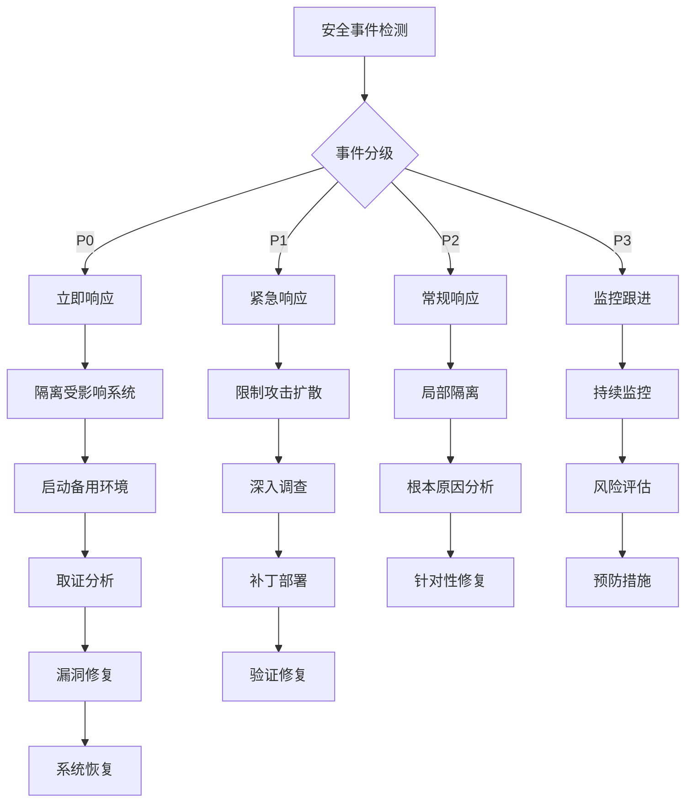

# 控制平面安全加固指南 (Control Plane Security Hardening Guide)

> **适用版本**: Kubernetes v1.25 - v1.32 | **最后更新**: 2026-02 | **文档类型**: 安全配置手册

---

## 目录

1. [安全架构设计](#1-安全架构设计)
2. [认证机制加固](#2-认证机制加固)
3. [授权控制强化](#3-授权控制强化)
4. [准入控制策略](#4-准入控制策略)
5. [网络安全防护](#5-网络安全防护)
6. [数据安全保护](#6-数据安全保护)
7. [审计日志配置](#7-审计日志配置)
8. [安全监控告警](#8-安全监控告警)
9. [合规性检查清单](#9-合规性检查清单)
10. [应急响应预案](#10-应急响应预案)

---

## 1. 安全架构设计

### 1.1 零信任安全模型

```
┌─────────────────────────────────────────────────────────────────────────────────┐
│                          Zero Trust Security Model                              │
├─────────────────────────────────────────────────────────────────────────────────┤
│                                                                                  │
│  核心原则: 永不信任，始终验证                                                   │
│                                                                                  │
│  1. 身份认证 (Authentication)                                                  │
│     ├── mTLS双向认证                                                            │
│     ├── OIDC集成                                                                │
│     ├── ServiceAccount令牌                                                      │
│     └── 证书轮换机制                                                            │
│                                                                                  │
│  2. 授权控制 (Authorization)                                                   │
│     ├── RBAC细粒度权限                                                          │
│     ├── Node授权模式                                                            │
│     ├── ABAC策略引擎                                                            │
│     └── Webhook外部授权                                                         │
│                                                                                  │
│  3. 访问控制 (Access Control)                                                  │
│     ├── 网络策略(NetworkPolicy)                                                 │
│     ├── Pod安全策略(PSP)                                                        │
│     ├── 命名空间隔离                                                            │
│     └── 资源配额限制                                                            │
│                                                                                  │
│  4. 数据保护 (Data Protection)                                                 │
│     ├── etcd加密存储                                                            │
│     ├── Secrets加密                                                             │
│     ├── TLS传输加密                                                             │
│     └── 审计日志                                                                │
│                                                                                  │
└─────────────────────────────────────────────────────────────────────────────────┘
```

### 1.2 安全边界划分

| 安全边界 | 防护措施 | 实施建议 | 风险等级 |
|----------|----------|----------|----------|
| **外部访问边界** | API Server准入控制 | NetworkPolicy + WAF | 高 |
| **集群内部边界** | Pod间网络隔离 | Calico/Cilium网络策略 | 中 |
| **控制平面边界** | 组件间mTLS | cert-manager自动签发 | 高 |
| **数据存储边界** | etcd加密 | AES-256-GCM加密 | 高 |
| **节点边界** | Kubelet认证 | Webhook认证模式 | 中 |

### 1.3 威胁模型分析

```
Kubernetes威胁矩阵:

┌─────────────────────────────────────────────────────────────────────────┐
│                           Threat Matrix                                  │
├─────────────────────────────────────────────────────────────────────────┤
│                                                                          │
│  初始访问 (Initial Access)                                              │
│  ├── 无效凭证攻击                                                        │
│  ├── 凭证窃取                                                            │
│  └── 社会工程学攻击                                                      │
│                                                                          │
│  执行 (Execution)                                                       │
│  ├── 恶意容器部署                                                        │
│  ├── 命令注入攻击                                                        │
│  └── 供应链攻击                                                          │
│                                                                          │
│  持久化 (Persistence)                                                   │
│  ├── 后门账户创建                                                        │
│  ├── 恶意调度器                                                          │
│  └── 控制平面篡改                                                        │
│                                                                          │
│  权限提升 (Privilege Escalation)                                        │
│  ├── RBAC权限滥用                                                        │
│  ├── Node权限提升                                                        │
│  └── 容器逃逸攻击                                                        │
│                                                                          │
│  防御规避 (Defense Evasion)                                             │
│  ├── 日志清理                                                            │
│  ├── Rootkit植入                                                         │
│  └── 加密混淆                                                            │
│                                                                          │
│  凭证访问 (Credential Access)                                           │
│  ├── Secret窃取                                                          │
│  ├── 令牌劫持                                                            │
│  └── 证书滥用                                                            │
│                                                                          │
│  横向移动 (Lateral Movement)                                            │
│  ├── 网络渗透                                                            │
│  ├── 节点跳跃                                                            │
│  └── 集群间传播                                                          │
│                                                                          │
│  影响 (Impact)                                                           │
│  ├── 数据销毁                                                            │
│  ├── 服务中断                                                            │
│  └── 数据加密勒索                                                        │
│                                                                          │
└─────────────────────────────────────────────────────────────────────────┘
```

---

## 2. 认证机制加固

### 2.1 API Server安全配置

```yaml
# API Server安全强化配置
apiVersion: v1
kind: Pod
metadata:
  name: kube-apiserver
  namespace: kube-system
spec:
  containers:
  - name: kube-apiserver
    image: registry.k8s.io/kube-apiserver:v1.30.0
    command:
    - kube-apiserver
    
    # 基础安全配置
    - --anonymous-auth=false                    # 禁用匿名访问
    - --authorization-mode=Node,RBAC           # 启用RBAC授权
    - --enable-admission-plugins=              # 启用安全准入插件
      NodeRestriction,PodSecurityPolicy,
      ResourceQuota,LimitRanger,
      ServiceAccount,DefaultStorageClass,
      DefaultTolerationSeconds,MutatingAdmissionWebhook,
      ValidatingAdmissionWebhook,Priority,
      PersistentVolumeClaimResize,RuntimeClass
    
    # TLS安全配置
    - --tls-cert-file=/etc/kubernetes/pki/apiserver.crt
    - --tls-private-key-file=/etc/kubernetes/pki/apiserver.key
    - --tls-cipher-suites=                     # 强制TLS加密套件
      TLS_ECDHE_RSA_WITH_AES_128_GCM_SHA256,
      TLS_ECDHE_RSA_WITH_AES_256_GCM_SHA384,
      TLS_ECDHE_ECDSA_WITH_AES_128_GCM_SHA256,
      TLS_ECDHE_ECDSA_WITH_AES_256_GCM_SHA384
    - --tls-min-version=VersionTLS12           # 最低TLS版本
    
    # 客户端认证
    - --client-ca-file=/etc/kubernetes/pki/ca.crt
    - --requestheader-client-ca-file=/etc/kubernetes/pki/front-proxy-ca.crt
    - --requestheader-allowed-names=front-proxy-client
    - --requestheader-extra-headers-prefix=X-Remote-Extra-
    - --requestheader-group-headers=X-Remote-Group
    - --requestheader-username-headers=X-Remote-User
    
    # ServiceAccount配置
    - --service-account-key-file=/etc/kubernetes/pki/sa.pub
    - --service-account-signing-key-file=/etc/kubernetes/pki/sa.key
    - --service-account-issuer=https://kubernetes.default.svc.cluster.local
    
    # 安全功能开关
    - --disable-admission-plugins=             # 禁用不安全插件
      AlwaysAllow,AlwaysDeny,DenyEscalatingExec
    - --profiling=false                        # 禁用性能分析
    - --enable-swagger-ui=false                # 禁用Swagger UI
    - --insecure-port=0                        # 禁用非安全端口
    - --insecure-bind-address=127.0.0.1        # 仅本地绑定
    
    # 审计配置
    - --audit-policy-file=/etc/kubernetes/audit/policy.yaml
    - --audit-log-path=/var/log/kubernetes/audit.log
    - --audit-log-maxage=30
    - --audit-log-maxbackup=10
    - --audit-log-maxsize=100
    - --audit-log-format=json
    
    # 特性门控
    - --feature-gates=                         # 安全相关特性
      AdvancedAuditing=true,
      RotateKubeletServerCertificate=true,
      SupportNodePidsLimit=true,
      SupportPodPidsLimit=true
```

### 2.2 客户端证书认证强化

```bash
#!/bin/bash
# 客户端证书生成和管理脚本

# 1. 生成客户端证书
generate_client_cert() {
    local username=$1
    local org=$2
    
    # 创建证书请求
    openssl req -new -newkey rsa:2048 -nodes \
        -keyout ${username}.key \
        -out ${username}.csr \
        -subj "/CN=${username}/O=${org}"
    
    # 创建证书签名配置
    cat > ${username}-csr.yaml << EOF
apiVersion: certificates.k8s.io/v1
kind: CertificateSigningRequest
metadata:
  name: ${username}-csr
spec:
  request: $(cat ${username}.csr | base64 | tr -d '\n')
  signerName: kubernetes.io/kube-apiserver-client
  usages:
  - client auth
EOF
    
    # 提交CSR并批准
    kubectl apply -f ${username}-csr.yaml
    kubectl certificate approve ${username}-csr
    
    # 获取签名证书
    kubectl get csr ${username}-csr -o jsonpath='{.status.certificate}' | \
        base64 --decode > ${username}.crt
}

# 2. 证书轮换策略
setup_cert_rotation() {
    # 创建证书监控cron job
    cat > cert-rotation-cron.yaml << EOF
apiVersion: batch/v1
kind: CronJob
metadata:
  name: certificate-rotation
  namespace: kube-system
spec:
  schedule: "0 2 * * *"  # 每天凌晨2点执行
  jobTemplate:
    spec:
      template:
        spec:
          containers:
          - name: cert-rotator
            image: busybox:latest
            command:
            - /bin/sh
            - -c
            - |
              # 检查证书有效期
              CERT_FILE="/etc/kubernetes/pki/apiserver.crt"
              EXPIRY_DATE=\$(openssl x509 -in \$CERT_FILE -noout -enddate | cut -d= -f2)
              DAYS_LEFT=\$(( (\$(date -d "\$EXPIRY_DATE" +%s) - \$(date +%s)) / 86400 ))
              
              if [ \$DAYS_LEFT -lt 30 ]; then
                echo "Certificate expires in \$DAYS_LEFT days, triggering rotation"
                # 调用证书轮换脚本
                /usr/local/bin/rotate-certificates.sh
              fi
          restartPolicy: OnFailure
          volumes:
          - name: certs
            hostPath:
              path: /etc/kubernetes/pki
EOF
}
```

### 2.3 ServiceAccount安全配置

```yaml
# ServiceAccount安全强化
apiVersion: v1
kind: ServiceAccount
metadata:
  name: restricted-sa
  namespace: production
automountServiceAccountToken: false  # 禁用自动挂载

---
# 限制性Role配置
apiVersion: rbac.authorization.k8s.io/v1
kind: Role
metadata:
  name: restricted-role
  namespace: production
rules:
- apiGroups: [""]
  resources: ["pods", "services"]
  verbs: ["get", "list", "watch"]
- apiGroups: ["apps"]
  resources: ["deployments"]
  verbs: ["get", "list"]

---
# RoleBinding配置
apiVersion: rbac.authorization.k8s.io/v1
kind: RoleBinding
metadata:
  name: restricted-binding
  namespace: production
subjects:
- kind: ServiceAccount
  name: restricted-sa
  namespace: production
roleRef:
  kind: Role
  name: restricted-role
  apiGroup: rbac.authorization.k8s.io
```

---

## 3. 授权控制强化

### 3.1 RBAC最佳实践

```yaml
# 最小权限原则RBAC配置
apiVersion: rbac.authorization.k8s.io/v1
kind: ClusterRole
metadata:
  name: pod-reader
rules:
- apiGroups: [""]
  resources: ["pods"]
  verbs: ["get", "list", "watch"]  # 仅读取权限

---
apiVersion: rbac.authorization.k8s.io/v1
kind: ClusterRole
metadata:
  name: deployment-manager
rules:
- apiGroups: ["apps"]
  resources: ["deployments"]
  verbs: ["get", "list", "watch", "update", "patch"]  # 有限写入权限

---
# 命名空间级别的权限控制
apiVersion: rbac.authorization.k8s.io/v1
kind: Role
metadata:
  name: namespace-admin
  namespace: development
rules:
- apiGroups: ["*"]
  resources: ["*"]
  verbs: ["*"]
  # 但仅限于development命名空间

---
# 用户组权限管理
apiVersion: rbac.authorization.k8s.io/v1
kind: ClusterRoleBinding
metadata:
  name: developer-group-access
subjects:
- kind: Group
  name: "system:authenticated"  # 所有认证用户
  apiGroup: rbac.authorization.k8s.io
roleRef:
  kind: ClusterRole
  name: pod-reader
  apiGroup: rbac.authorization.k8s.io
```

### 3.2 动态准入控制

```yaml
# ValidatingAdmissionWebhook配置
apiVersion: admissionregistration.k8s.io/v1
kind: ValidatingWebhookConfiguration
metadata:
  name: security-validator
webhooks:
- name: pod-security-validator.example.com
  clientConfig:
    service:
      name: webhook-service
      namespace: security-system
      path: "/validate-pods"
    caBundle: <CA_BUNDLE>
  rules:
  - operations: ["CREATE", "UPDATE"]
    apiGroups: [""]
    apiVersions: ["v1"]
    resources: ["pods"]
  admissionReviewVersions: ["v1"]
  sideEffects: None
  timeoutSeconds: 5

---
# MutatingAdmissionWebhook配置
apiVersion: admissionregistration.k8s.io/v1
kind: MutatingWebhookConfiguration
metadata:
  name: security-mutator
webhooks:
- name: pod-security-mutator.example.com
  clientConfig:
    service:
      name: webhook-service
      namespace: security-system
      path: "/mutate-pods"
    caBundle: <CA_BUNDLE>
  rules:
  - operations: ["CREATE"]
    apiGroups: [""]
    apiVersions: ["v1"]
    resources: ["pods"]
  admissionReviewVersions: ["v1"]
  sideEffects: None
  timeoutSeconds: 3
```

### 3.3 Pod安全策略(PSP)

```yaml
# PodSecurityPolicy配置示例
apiVersion: policy/v1beta1
kind: PodSecurityPolicy
metadata:
  name: restricted-psp
  annotations:
    seccomp.security.alpha.kubernetes.io/allowedProfileNames: 'docker/default,runtime/default'
    seccomp.security.alpha.kubernetes.io/defaultProfileName:  'runtime/default'
spec:
  privileged: false                # 禁止特权容器
  allowPrivilegeEscalation: false  # 禁止权限提升
  requiredDropCapabilities:        # 必须放弃的权限
  - ALL
  volumes:                         # 允许的卷类型
  - 'configMap'
  - 'emptyDir'
  - 'projected'
  - 'secret'
  - 'downwardAPI'
  - 'persistentVolumeClaim'
  hostNetwork: false               # 禁止主机网络
  hostIPC: false                   # 禁止主机IPC
  hostPID: false                   # 禁止主机PID
  runAsUser:
    rule: 'MustRunAsNonRoot'       # 必须以非root用户运行
  seLinux:
    rule: 'RunAsAny'
  supplementalGroups:
    rule: 'MustRunAs'
    ranges:
    - min: 1
      max: 65535
  fsGroup:
    rule: 'MustRunAs'
    ranges:
    - min: 1
      max: 65535
  readOnlyRootFilesystem: true     # 只读根文件系统
```

---

## 4. 网络安全防护

### 4.1 NetworkPolicy配置

```yaml
# 默认拒绝所有流量的网络策略
apiVersion: networking.k8s.io/v1
kind: NetworkPolicy
metadata:
  name: default-deny-all
  namespace: production
spec:
  podSelector: {}
  policyTypes:
  - Ingress
  - Egress

---
# 允许DNS查询的策略
apiVersion: networking.k8s.io/v1
kind: NetworkPolicy
metadata:
  name: allow-dns-access
  namespace: production
spec:
  podSelector: {}
  policyTypes:
  - Egress
  egress:
  - to:
    - namespaceSelector:
        matchLabels:
          name: kube-system
    ports:
    - protocol: UDP
      port: 53
    - protocol: TCP
      port: 53

---
# 应用间通信策略
apiVersion: networking.k8s.io/v1
kind: NetworkPolicy
metadata:
  name: frontend-backend-policy
  namespace: production
spec:
  podSelector:
    matchLabels:
      app: frontend
  policyTypes:
  - Egress
  egress:
  - to:
    - podSelector:
        matchLabels:
          app: backend
    ports:
    - protocol: TCP
      port: 8080
```

### 4.2 CNI插件安全配置

```yaml
# Calico网络安全配置
apiVersion: crd.projectcalico.org/v1
kind: NetworkPolicy
metadata:
  name: enhanced-security-policy
  namespace: production
spec:
  order: 100
  selector: all()
  types:
  - Ingress
  - Egress
  ingress:
  - action: Allow
    protocol: TCP
    source:
      nets:
      - 10.0.0.0/8
    destination:
      ports:
      - 80
      - 443
  egress:
  - action: Deny
    protocol: TCP
    destination:
      nets:
      - 0.0.0.0/0
      notNets:
      - 10.0.0.0/8
      - 172.16.0.0/12
      - 192.168.0.0/16
```

### 4.3 服务网格安全

```yaml
# Istio安全配置
apiVersion: security.istio.io/v1beta1
kind: PeerAuthentication
metadata:
  name: default
  namespace: istio-system
spec:
  mtls:
    mode: STRICT  # 强制mTLS

---
apiVersion: security.istio.io/v1beta1
kind: AuthorizationPolicy
metadata:
  name: allow-nothing
  namespace: production
spec:
  action: DENY
  rules:
  - from:
    - source:
        principals: ["cluster.local/ns/attacker/sa/default"]
```

---

## 5. 数据安全保护

### 5.1 etcd加密配置

```yaml
# etcd加密配置
apiVersion: apiserver.config.k8s.io/v1
kind: EncryptionConfiguration
resources:
  - resources:
    - secrets
    - configmaps
    - pandas
    providers:
    - aescbc:
        keys:
        - name: key1
          secret: <32-byte-base64-encoded-key>
    - identity: {}  # 明文后备

---
# etcd TLS配置
apiVersion: v1
kind: Pod
metadata:
  name: etcd
  namespace: kube-system
spec:
  containers:
  - name: etcd
    image: quay.io/coreos/etcd:v3.5.12
    command:
    - etcd
    # TLS配置
    - --cert-file=/etc/kubernetes/pki/etcd/server.crt
    - --key-file=/etc/kubernetes/pki/etcd/server.key
    - --trusted-ca-file=/etc/kubernetes/pki/etcd/ca.crt
    - --client-cert-auth=true
    - --peer-cert-file=/etc/kubernetes/pki/etcd/peer.crt
    - --peer-key-file=/etc/kubernetes/pki/etcd/peer.key
    - --peer-trusted-ca-file=/etc/kubernetes/pki/etcd/ca.crt
    - --peer-client-cert-auth=true
    # 加密配置
    - --cipher-suites=TLS_ECDHE_RSA_WITH_AES_128_GCM_SHA256,TLS_ECDHE_RSA_WITH_AES_256_GCM_SHA384
```

### 5.2 Secret管理安全

```yaml
# Secret加密存储
apiVersion: v1
kind: Secret
metadata:
  name: database-credentials
  namespace: production
type: Opaque
data:
  username: <base64-encoded-username>
  password: <base64-encoded-password>  # 应使用外部密钥管理系统

---
# 外部密钥管理集成
apiVersion: external-secrets.io/v1beta1
kind: ExternalSecret
metadata:
  name: database-credentials
  namespace: production
spec:
  secretStoreRef:
    name: aws-secrets-manager
    kind: ClusterSecretStore
  target:
    name: database-credentials
  data:
  - secretKey: username
    remoteRef:
      key: production/database
      property: username
  - secretKey: password
    remoteRef:
      key: production/database
      property: password
```

### 5.3 数据备份加密

```bash
#!/bin/bash
# 加密备份脚本

BACKUP_DIR="/backup/etcd"
ENCRYPTION_KEY="/etc/kubernetes/pki/backup-encryption.key"

# 创建加密备份
encrypt_backup() {
    local backup_file="$BACKUP_DIR/etcd-backup-$(date +%Y%m%d-%H%M%S).db"
    
    # 执行etcd备份
    ETCDCTL_API=3 etcdctl snapshot save $backup_file \
        --endpoints=https://127.0.0.1:2379 \
        --cacert=/etc/kubernetes/pki/etcd/ca.crt \
        --cert=/etc/kubernetes/pki/etcd/server.crt \
        --key=/etc/kubernetes/pki/etcd/server.key
    
    # 加密备份文件
    openssl enc -aes-256-cbc -salt -in $backup_file \
        -out ${backup_file}.enc \
        -kfile $ENCRYPTION_KEY
    
    # 删除明文备份
    rm $backup_file
    
    echo "Encrypted backup created: ${backup_file}.enc"
}

# 验证备份完整性
verify_backup() {
    local encrypted_backup=$1
    
    # 解密验证
    openssl enc -d -aes-256-cbc -in $encrypted_backup \
        -out /tmp/verify.db \
        -kfile $ENCRYPTION_KEY
    
    # 验证etcd快照
    ETCDCTL_API=3 etcdctl snapshot status /tmp/verify.db
    
    # 清理临时文件
    rm /tmp/verify.db
}
```

---

## 6. 审计日志配置

### 6.1 审计策略配置

```yaml
# 审计策略配置
apiVersion: audit.k8s.io/v1
kind: Policy
rules:
# 高风险操作详细记录
- level: RequestResponse
  verbs: ["create", "update", "delete", "patch"]
  resources:
  - group: ""
    resources: ["pods", "services", "deployments"]
  - group: "rbac.authorization.k8s.io"
    resources: ["roles", "rolebindings", "clusterroles", "clusterrolebindings"]
  - group: ""
    resources: ["secrets", "configmaps"]

# 中等风险操作记录请求
- level: Request
  verbs: ["list", "watch"]
  resources:
  - group: ""
    resources: ["pods", "services"]
  userGroups: ["system:authenticated"]

# 低风险操作元数据记录
- level: Metadata
  verbs: ["get"]
  resources:
  - group: ""
    resources: ["pods", "services", "nodes"]

# 忽略健康检查和指标端点
- level: None
  nonResourceURLs:
  - "/healthz*"
  - "/livez*"
  - "/readyz*"
  - "/metrics"
  - "/version"

# 默认策略：记录元数据
- level: Metadata
```

### 6.2 审计日志存储和轮转

```yaml
# 审计日志配置
apiVersion: v1
kind: Pod
metadata:
  name: kube-apiserver
  namespace: kube-system
spec:
  containers:
  - name: kube-apiserver
    image: registry.k8s.io/kube-apiserver:v1.30.0
    command:
    - kube-apiserver
    # 审计日志配置
    - --audit-policy-file=/etc/kubernetes/audit/policy.yaml
    - --audit-log-path=/var/log/kubernetes/audit.log
    - --audit-log-maxage=30          # 保留30天
    - --audit-log-maxbackup=10       # 保留10个备份
    - --audit-log-maxsize=100        # 每个文件100MB
    - --audit-log-format=json        # JSON格式便于解析
    - --audit-log-batch-buffer-size=10000  # 批量缓冲区大小
    - --audit-log-batch-max-size=100       # 批量最大大小
    - --audit-log-batch-max-wait=1s        # 批量最大等待时间
    - --audit-log-initial-backoff=1s       # 初始重试间隔

---
# 审计日志收集配置
apiVersion: v1
kind: ConfigMap
metadata:
  name: audit-log-collector
  namespace: logging
data:
  fluent-bit.conf: |
    [INPUT]
        Name              tail
        Tag               kube.audit.*
        Path              /var/log/kubernetes/audit.log
        Parser            json
        DB                /var/log/flb_kube_audit.db
        Mem_Buf_Limit     5MB
        Skip_Long_Lines   On
        Refresh_Interval  10

    [FILTER]
        Name              record_modifier
        Match             kube.audit.*
        Record cluster_name ${CLUSTER_NAME}
        Record source audit-log

    [OUTPUT]
        Name              es
        Match             kube.audit.*
        Host              ${ELASTICSEARCH_HOST}
        Port              ${ELASTICSEARCH_PORT}
        Logstash_Format   On
        Logstash_Prefix   k8s-audit
        Time_Key          @timestamp
```

### 6.3 审计日志分析规则

```yaml
# 审计日志分析规则
apiVersion: monitoring.coreos.com/v1
kind: PrometheusRule
metadata:
  name: audit-log-alerts
  namespace: monitoring
spec:
  groups:
  - name: audit-log.rules
    rules:
    # 异常访问模式检测
    - alert: HighVolumeUnauthorizedAccess
      expr: rate(audit_event_total{response_status="Forbidden"}[5m]) > 10
      for: 10m
      labels:
        severity: warning
      annotations:
        summary: "High volume of unauthorized access attempts detected"
        description: "{{ $value }} forbidden requests per second in the last 5 minutes"

    # 敏感资源访问监控
    - alert: SensitiveResourceAccess
      expr: audit_event_total{resource="secrets", verb=~"create|update|delete"} > 0
      for: 1m
      labels:
        severity: critical
      annotations:
        summary: "Sensitive resource access detected"
        description: "Access to secrets resource detected: {{ $labels.verb }} by {{ $labels.user }}"

    # 权限变更监控
    - alert: RBACChangesDetected
      expr: audit_event_total{resource=~"roles|rolebindings|clusterroles|clusterrolebindings", verb=~"create|update|delete"} > 0
      for: 1m
      labels:
        severity: warning
      annotations:
        summary: "RBAC configuration changes detected"
        description: "RBAC changes: {{ $labels.verb }} {{ $labels.resource }} by {{ $labels.user }}"
```

---

## 7. 安全监控告警

### 7.1 关键安全指标

```prometheus
# 安全监控指标
# 认证失败率
rate(authentication_attempts_total{result="failure"}[5m]) / 
rate(authentication_attempts_total[5m]) > 0.1

# API Server异常请求
increase(apiserver_request_total{code=~"5.."}[10m]) > 5

# etcd安全事件
increase(etcd_object_counts{resource="secrets"}[1h]) > 100

# 网络策略违规
increase(networkpolicy_violations_total[5m]) > 0

# 容器安全扫描
security_scan_vulnerabilities_critical > 0
```

### 7.2 Falco安全规则

```yaml
# Falco安全监控规则
- rule: Detect crypto miners
  desc: Detection of crypto mining activity
  condition: >
    spawned_process and proc.name in (xmrig, ccminer, cpuminer)
  output: >
    Crypto miner detected (user=%user.name command=%proc.cmdline)
  priority: CRITICAL

- rule: Detect privilege escalation
  desc: Detection of privilege escalation attempts
  condition: >
    spawned_process and proc.pname in (sudo, su) and user.name != "root"
  output: >
    Privilege escalation attempt detected (user=%user.name command=%proc.cmdline)
  priority: HIGH

- rule: Detect sensitive file access
  desc: Detection of access to sensitive files
  condition: >
    open_write and fd.name startswith /etc/kubernetes/ and not proc.name in (kubelet, kube-apiserver)
  output: >
    Sensitive file access detected (user=%user.name file=%fd.name)
  priority: HIGH
```

### 7.3 安全事件响应

```yaml
# 安全事件响应配置
apiVersion: security.kubesphere.io/v1alpha1
kind: SecurityPolicy
metadata:
  name: incident-response-policy
spec:
  responseActions:
  - type: Quarantine
    conditions:
      - metric: authentication_failure_rate
        threshold: "> 0.2"
        duration: "5m"
    action:
      isolateNamespace: true
      notifyAdmin: true
      
  - type: Block
    conditions:
      - metric: malicious_activity_score
        threshold: "> 0.8"
        duration: "1m"
    action:
      blockIP: true
      terminatePod: true
      alertSecurityTeam: true
```

---

## 8. 合规性检查清单

### 8.1 CIS Kubernetes Benchmark

```bash
#!/bin/bash
# CIS Kubernetes合规性检查脚本

echo "=== CIS Kubernetes Benchmark Compliance Check ==="

# 检查1.1.1: 确保API Server匿名认证已禁用
check_1_1_1() {
    if grep -q "anonymous-auth=false" /etc/kubernetes/manifests/kube-apiserver.yaml; then
        echo "✓ 1.1.1 PASS: Anonymous authentication disabled"
    else
        echo "✗ 1.1.1 FAIL: Anonymous authentication enabled"
    fi
}

# 检查1.2.1: 确保etcd数据目录权限正确
check_1_2_1() {
    local etcd_dir=$(grep -oP 'data-dir=\K[^ ]+' /etc/kubernetes/manifests/etcd.yaml)
    if [[ $(stat -c "%a" $etcd_dir) == "700" ]] && [[ $(stat -c "%U" $etcd_dir) == "etcd" ]]; then
        echo "✓ 1.2.1 PASS: etcd data directory permissions correct"
    else
        echo "✗ 1.2.1 FAIL: etcd data directory permissions incorrect"
    fi
}

# 检查2.1.1: 确保kubelet配置了适当的认证
check_2_1_1() {
    if grep -q "authentication.*webhook" /var/lib/kubelet/config.yaml; then
        echo "✓ 2.1.1 PASS: Kubelet webhook authentication configured"
    else
        echo "✗ 2.1.1 FAIL: Kubelet webhook authentication not configured"
    fi
}

# 运行所有检查
run_all_checks() {
    check_1_1_1
    check_1_2_1
    check_2_1_1
    # ... 更多检查项
}

run_all_checks
```

### 8.2 GDPR合规配置

```yaml
# GDPR数据保护配置
apiVersion: v1
kind: ConfigMap
metadata:
  name: gdpr-compliance-config
  namespace: compliance
data:
  data-retention-policy: |
    # 数据保留策略
    - category: personal_data
      retention_period: 30d
      deletion_method: secure_erase
    - category: audit_logs
      retention_period: 365d
      anonymization_required: true
      
  privacy-controls: |
    # 隐私控制配置
    consent_required: true
    data_minimization: true
    purpose_limitation: true
    storage_limitation: true
```

---

## 9. 应急响应预案

### 9.1 安全事件分级

| 级别 | 描述 | 响应时间 | 影响范围 |
|------|------|----------|----------|
| **P0** | 严重安全漏洞利用 | 15分钟 | 集群完全失陷 |
| **P1** | 大规模权限提升 | 1小时 | 多个命名空间 |
| **P2** | 单点权限滥用 | 4小时 | 单个命名空间 |
| **P3** | 潜在安全风险 | 24小时 | 监控告警 |

### 9.2 应急响应流程



### 9.3 恢复操作清单

```bash
#!/bin/bash
# 安全事件恢复脚本

# 1. 隔离受感染节点
isolate_compromised_nodes() {
    local compromised_nodes=("node-1" "node-2")
    
    for node in "${compromised_nodes[@]}"; do
        echo "Isolating node: $node"
        kubectl cordon $node
        kubectl drain $node --ignore-daemonsets --delete-emptydir-data
        
        # 应用网络隔离
        kubectl label node $node security/isolated=true
    done
}

# 2. 重建受损组件
rebuild_components() {
    echo "Rebuilding control plane components..."
    
    # 重建API Server
    kubectl delete pod -n kube-system -l component=kube-apiserver
    kubectl rollout status deployment/kube-apiserver -n kube-system
    
    # 重建etcd
    kubectl delete pod -n kube-system -l component=etcd
    kubectl rollout status statefulset/etcd -n kube-system
}

# 3. 证书轮换
rotate_certificates() {
    echo "Rotating certificates..."
    
    # 轮换所有证书
    kubeadm certs renew all
    
    # 重启相关组件
    systemctl restart kubelet
    kubectl delete pod -n kube-system -l tier=control-plane
}

# 4. 安全加固验证
verify_security_hardening() {
    echo "Verifying security hardening..."
    
    # 运行安全检查
    ./cis-kubernetes-benchmark.sh
    
    # 验证网络策略
    kubectl get networkpolicy --all-namespaces
    
    # 检查RBAC配置
    kubectl auth can-i --list
}
```

通过实施这些安全加固措施，可以显著提升Kubernetes控制平面的安全性，有效防范各种安全威胁和攻击。