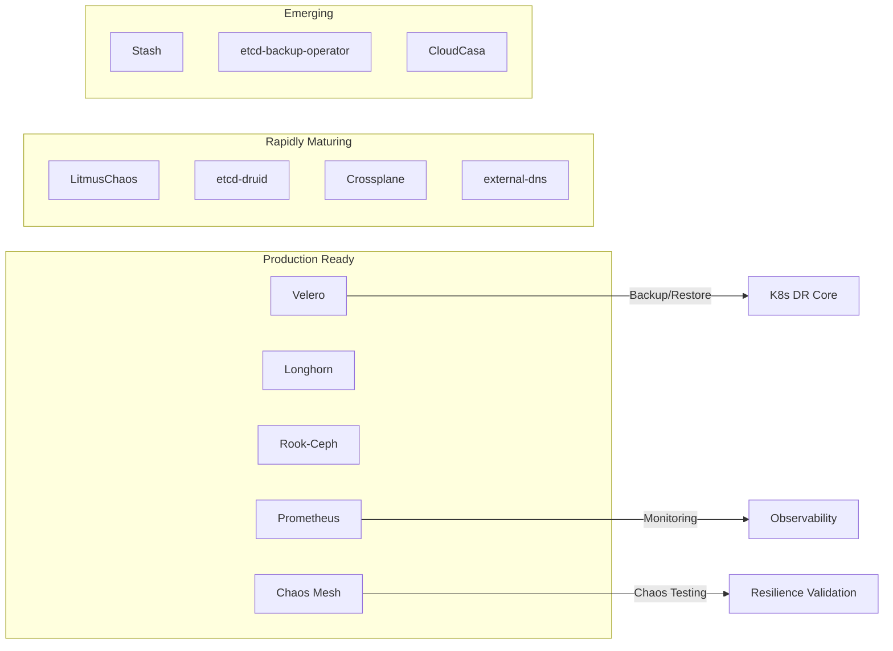

# Domain-30 灾备与业务连续性 — 开源项目索引

> **最后更新**: 2026-05-18

---

## 概述

灾难恢复（Disaster Recovery, DR）与业务连续性（Business Continuity, BC）是企业IT基础设施的核心命题。在云原生时代，开源工具已经能够覆盖从Kubernetes集群备份、混沌工程实验到跨区域流量管理的完整灾备链条。本文档汇总当前主流开源项目，并对每个项目的作用、成熟度和适用场景做出系统性评估，为企业在构建灾备方案时提供技术选型参考。

现代灾备体系不仅仅是工具的堆砌，更是架构设计、流程规范和组织协同的综合体现。一个成熟的企业灾备体系需要包含以下关键能力：数据保护能力（备份、快照、复制）、故障检测能力（监控、告警、自动发现）、故障恢复能力（自动切换、手动切换、数据恢复）和韧性验证能力（混沌工程、灾备演练、Game Day）。开源社区在这些领域都提供了优秀的解决方案，企业可以根据自身需求和预算选择合适的组合。

### 核心术语定义

| 术语 | 全称 | 含义 |
|:---|:---|:---|
| **RPO** | Recovery Point Objective | 恢复点目标，即允许丢失的最大数据量，以时间衡量 |
| **RTO** | Recovery Time Objective | 恢复时间目标，即从灾难发生到服务恢复的最大允许时间 |
| **MTTR** | Mean Time To Recovery | 平均恢复时间，衡量灾备方案的实际恢复效率 |
| **MTBF** | Mean Time Between Failures | 平均故障间隔时间，衡量系统可靠性 |
| **DR** | Disaster Recovery | 灾难恢复，从灾难中恢复IT服务的能力 |
| **BC** | Business Continuity | 业务连续性，确保关键业务在灾难中持续运行 |
| **HA** | High Availability | 高可用性，系统无中断运行的能力 |
| **BIA** | Business Impact Analysis | 业务影响分析，评估灾难对业务的影响 |

---

## 项目综合对比表

### 全部项目一览（含功能/成熟度/许可证）

| 项目 | 分类 | 核心功能 | CNCF 状态 | Stars | 最新版本 | License | 生产就绪度 | 学习曲线 | 社区活跃度 |
|:---|:---|:---|:---|:---|:---|:---|:---|:---|:---|
| **Velero** | K8s 备份恢复 | 集群资源备份、PV 快照、跨集群迁移 | — | 9k+ | v1.15.0 | Apache-2.0 | ★★★★★ | 低 | 高 |
| **Longhorn** | 存储复制 | 分布式块存储、跨区复制、定时快照 | Incubating | 6k+ | v1.8.0 | Apache-2.0 | ★★★★ | 中 | 高 |
| **Chaos Mesh** | 混沌工程 | Pod/Network/IO/Stress 故障注入 | Incubating | 6.5k+ | v2.7.0 | Apache-2.0 | ★★★★ | 中 | 高 |
| **LitmusChaos** | 混沌工程 | 云原生混沌平台、ChaosCenter GUI | Incubating | 4k+ | v3.12.0 | Apache-2.0 | ★★★★ | 中 | 高 |
| **Istio** | 流量管理 | 多集群流量、故障转移、mTLS | Graduated | 36k+ | v1.25 | Apache-2.0 | ★★★★★ | 高 | 极高 |
| **Argo CD** | GitOps | 声明式部署、配置恢复、多集群同步 | Graduated | 19k+ | v2.13.0 | Apache-2.0 | ★★★★★ | 低 | 极高 |
| **Flux** | GitOps | 自动化 Git 同步、K8s 配置恢复 | Graduated | 17k+ | v2.5.0 | Apache-2.0 | ★★★★★ | 低 | 高 |
| **Crossplane** | 基础设施编排 | 多云资源编排、灾备环境重建 | Graduated | 10k+ | v1.19.0 | Apache-2.0 | ★★★★ | 高 | 高 |
| **Rook-Ceph** | 存储编排 | Ceph 分布式存储、多副本、纠删码 | Graduated | 12.5k+ | v1.16.0 | Apache-2.0 | ★★★★ | 高 | 高 |
| **MinIO** | 对象存储 | S3 兼容、站点复制、生命周期管理 | — | 52k+ | v2025.4 | AGPL-3.0 | ★★★★★ | 低 | 极高 |
| **Vitess** | 数据库集群 | MySQL 分片、VReplication 跨区复制 | Graduated | 19k+ | v21.0 | Apache-2.0 | ★★★★★ | 极高 | 高 |
| **Prometheus** | 监控告警 | 指标采集、PromQL 告警规则 | Graduated | 58k+ | v3.3 | Apache-2.0 | ★★★★★ | 中 | 极高 |
| **Grafana** | 可视化 | 灾备仪表板、指标面板 | — | 67k+ | v12.0 | AGPL-3.0 | ★★★★★ | 低 | 极高 |
| **Envoy** | L4/L7 代理 | 流量故障转移、负载均衡、健康检查 | Graduated | 25k+ | v1.34 | Apache-2.0 | ★★★★★ | 高 | 极高 |
| **CoreDNS** | DNS | 服务发现、健康路由、联邦 DNS | Graduated | 13k+ | v1.12 | Apache-2.0 | ★★★★★ | 低 | 高 |
| **external-dns** | DNS 管理 | K8s DNS 记录自动管理 | — | 8k+ | v0.16 | Apache-2.0 | ★★★★ | 低 | 高 |
| **Stash** | K8s 备份 | Restic 后端备份、应用钩子 | — | 4k+ | v2024.12 | Apache-2.0 | ★★★ | 低 | 中 |
| **etcd-druid** | etcd 管理 | etcd 生命周期管理与备份编排 | — | 100+ | v0.27.0 | Apache-2.0 | ★★★ | 中 | 中 |
| **Toxiproxy** | 网络模拟 | 网络故障模拟代理 | — | 11k+ | v2.11.0 | MIT | ★★★★ | 低 | 中 |

---

## 核心项目索引

### Kubernetes 备份与恢复

| 项目 | 作用 | 归属 | 最新版本 | Stars | License |
|:---|:---|:---|:---|:---|:---|
| **Velero** | K8s 集群备份与恢复、跨集群迁移 | VMware (Tanzu) | v1.15.0 | 9k+ | Apache-2.0 |
| **Kasten K10** | K8s 数据保护与应用感知备份 | Veeva (Kasten) | v7.5.0 | — | 商业 |
| **TrilioVault** | K8s 备份恢复与多云数据保护 | Trilio | v4.0.0 | — | 商业 |
| **Stash** | K8s 备份恢复 (Restic 后端) | AppsCode | v2024.12.0 | 4k+ | Apache-2.0 |
| **CloudCasa** | SaaS K8s 备份与多集群管理 | Catalogic | — | — | 商业 |

#### Velero 深度解析

Velero（前身为 Heptio Ark）是 Kubernetes 生态中最成熟的开源备份与灾难恢复工具，由 VMware Tanzu 团队维护。Velero 能够备份 Kubernetes 集群的所有资源对象（Deployments、Services、ConfigMaps、Secrets、CRDs 等）以及持久卷（PV）数据，支持跨集群迁移和灾难恢复。

Velero 的核心架构包含以下组件：Velero Server（Deployment）负责处理备份和恢复请求；Backup Controller 监听 Backup CRD 并执行备份操作；Restore Controller 监听 Restore CRD 并执行恢复操作；Schedule Controller 管理定时备份计划；Node Agent（DaemonSet）负责文件系统级别的 PV 数据备份。

Velero 支持两种 PV 数据备份方式：CSI 快照（通过 CSI Driver 直接创建存储快照，速度极快）和文件系统备份（通过 Node Agent 使用 Kopia/Restic 在文件级别备份，支持 Pre/Post Hook 实现应用一致性）。企业通常同时使用两种方式：CSI 快照提供快速恢复点，文件系统备份配合数据库转储提供应用一致性保障。

```yaml
apiVersion: velero.io/v1
kind: Schedule
metadata:
  name: production-comprehensive-backup
  namespace: velero
spec:
  schedule: "0 2 * * *"
  template:
    includedNamespaces:
    - production
    - monitoring
    - ingress-nginx
    - cert-manager
    excludedResources:
    - events
    - podmetrics
    snapshotVolumes: true
    defaultVolumesToFsBackup: true
    ttl: 720h
    storageLocation: default
    hooks:
      pre:
      - name: mysql-dump
        labelSelector:
          matchLabels:
            app: mysql
        exec:
          container: mysql
          command:
          - /bin/bash
          - -c
          - "mysqldump --all-databases --single-transaction --quick > /tmp/pre-backup-dump.sql"
          onError: Fail
          timeout: 300s
      - name: postgres-dump
        labelSelector:
          matchLabels:
            app: postgresql
        exec:
          container: postgresql
          command:
          - /bin/bash
          - -c
          - "pg_dumpall -U postgres > /tmp/pre-backup-dump.sql"
          onError: Fail
          timeout: 600s
      post:
      - name: cleanup-dumps
        labelSelector:
          matchLabels:
            backup-hook: cleanup
        exec:
          container: app
          command:
          - /bin/bash
          - -c
          - "rm -f /tmp/pre-backup-dump.sql"
          onError: Continue
```

### etcd 生命周期管理

| 项目 | 作用 | 归属 | 最新版本 | Stars | License |
|:---|:---|:---|:---|:---|:---|
| **etcd-backup-operator** | etcd 自动化备份与定时快照 | K8s 社区 | v0.1.0 | 200+ | Apache-2.0 |
| **etcd-druid** | etcd 生命周期管理与备份编排 | Gardener (SAP) | v0.27.0 | 100+ | Apache-2.0 |

#### etcd 备份的重要性

etcd 是 Kubernetes 集群的大脑，所有集群状态（Pod、Service、ConfigMap、Secret、CRD 等）都存储在 etcd 中。Velero 备份的是通过 API Server 暴露的资源对象，但 etcd 本身包含更底层的集群状态。因此，etcd 备份是 Kubernetes 灾备体系中不可或缺的一环，必须独立配置。

企业级 etcd 备份应采用自动化 CronJob 方式，每 4-6 小时执行一次完整快照，并将快照文件上传到异地对象存储（S3/OSS）。同时建议保留最近 7 天的本地副本，以便快速恢复。

```yaml
apiVersion: batch/v1
kind: CronJob
metadata:
  name: etcd-backup
  namespace: kube-system
spec:
  schedule: "0 */4 * * *"
  concurrencyPolicy: Forbid
  successfulJobsHistoryLimit: 3
  failedJobsHistoryLimit: 3
  jobTemplate:
    spec:
      template:
        spec:
          nodeSelector:
            node-role.kubernetes.io/control-plane: ""
          tolerations:
            - key: node-role.kubernetes.io/control-plane
              effect: NoSchedule
          containers:
            - name: etcd-backup
              image: bitnami/etcd:3.5
              command:
                - /bin/bash
                - -c
                - |
                  ETCDCTL_API=3
                  ETCDCTL_CACERT=/etc/kubernetes/pki/etcd/ca.crt
                  ETCDCTL_CERT=/etc/kubernetes/pki/etcd/healthcheck-client.crt
                  ETCDCTL_KEY=/etc/kubernetes/pki/etcd/healthcheck-client.key
                  ENDPOINTS=https://127.0.0.1:2379
                  
                  TIMESTAMP=$(date +%Y%m%d_%H%M%S)
                  BACKUP_DIR="/backup/etcd/${TIMESTAMP}"
                  mkdir -p ${BACKUP_DIR}
                  
                  echo "=== etcd Backup Starting ==="
                  echo "Timestamp: ${TIMESTAMP}"
                  echo "Endpoints: ${ENDPOINTS}"
                  
                  etcdctl snapshot save ${BACKUP_DIR}/snapshot.db \
                    --endpoints=${ENDPOINTS} \
                    --cacert=${ETCDCTL_CACERT} \
                    --cert=${ETCDCTL_CERT} \
                    --key=${ETCDCTL_KEY}
                    
                  echo "=== Snapshot saved, verifying integrity ==="
                  etcdctl snapshot status ${BACKUP_DIR}/snapshot.db --write-table
                  
                  echo "=== Uploading to S3 ==="
                  aws s3 cp ${BACKUP_DIR}/snapshot.db \
                    s3://k8s-etcd-backups/$(hostname)/${TIMESTAMP}/snapshot.db
                    
                  echo "=== Cleaning up local copies older than 3 days ==="
                  find /backup/etcd -type d -mtime +3 -exec rm -rf {} +
                  
                  echo "=== etcd Backup Complete ==="
              volumeMounts:
                - name: etcd-certs
                  mountPath: /etc/kubernetes/pki/etcd
                  readOnly: true
                - name: backup-dir
                  mountPath: /backup
          volumes:
            - name: etcd-certs
              hostPath:
                path: /etc/kubernetes/pki/etcd
            - name: backup-dir
              hostPath:
                path: /var/lib/etcd-backup
                type: DirectoryOrCreate
          restartPolicy: OnFailure
```

### 混沌工程

| 项目 | 作用 | 归属 | 最新版本 | Stars | License |
|:---|:---|:---|:---|:---|:---|
| **LitmusChaos** | 云原生混沌工程平台 | CNCF Incubating | v3.12.0 | 4k+ | Apache-2.0 |
| **Chaos Mesh** | Kubernetes 混沌编排 | CNCF Incubating | v2.7.0 | 6.5k+ | Apache-2.0 |
| **PowerfulSeal** | K8s 混沌测试（已归档） | Bloomberg | v3.3.0 | 1k+ | Apache-2.0 |
| **Chaos Monkey** | Netflix 微服务随机终止 | Netflix | v2.5.0 | 15k+ | Apache-2.0 |
| **Toxiproxy** | 网络故障模拟代理 | Shopify | v2.11.0 | 11k+ | MIT |

#### LitmusChaos 与 Chaos Mesh 对比

| 维度 | LitmusChaos | Chaos Mesh |
|:---|:---|:---|
| **架构** | ChaosOperator + ChaosCenter | ChaosDashboard + ChaosController |
| **实验定义** | ChaosEngine CRD | ChaosExperiment + Schedule CRD |
| **故障类型** | Pod/Network/Storage/Node/Cloud | Pod/Network/IO/Time/Kernel/Stress |
| **调度能力** | 内建调度 | 内建 Schedule CRD |
| **Web UI** | ChaosCenter（功能丰富） | Chaos Dashboard（直观易用） |
| **CI/CD 集成** | Litmus SDK + GitHub Actions | 内建 Workflow 支持 |
| **多集群** | 支持（ChaosCenter） | 支持 |
| **社区活跃度** | CNCF Incubating，4k+ Stars | CNCF Incubating，6.5k+ Stars |
| **适用场景** | 企业级混沌工程平台 | 快速上手，功能全面 |

```yaml
apiVersion: chaos-mesh.org/v1alpha1
kind: PodChaos
metadata:
  name: pod-failure-test
  namespace: chaos-testing
spec:
  action: pod-failure
  mode: one
  selector:
    namespaces:
    - production
    labelSelectors:
      app: my-service
  scheduler:
    cron: "@every 30m"
  duration: "60s"
---
apiVersion: chaos-mesh.org/v1alpha1
kind: NetworkChaos
metadata:
  name: network-delay-test
  namespace: chaos-testing
spec:
  action: delay
  mode: all
  selector:
    namespaces:
    - production
    labelSelectors:
      app: my-service
  delay:
    latency: "100ms"
    correlation: "50"
    jitter: "20ms"
  duration: "5m"
---
apiVersion: chaos-mesh.org/v1alpha1
kind: StressChaos
metadata:
  name: cpu-stress-test
  namespace: chaos-testing
spec:
  mode: one
  selector:
    namespaces:
    - production
    labelSelectors:
      app: my-service
  stressors:
    cpu:
      workers: 2
      load: 80
  duration: "3m"
```

### 集群管理与基础设施灾备

| 项目 | 作用 | 归属 | 最新版本 | Stars | License |
|:---|:---|:---|:---|:---|:---|
| **Cluster API** | 声明式集群生命周期与灾备恢复 | K8s SIG | v1.9.0 | 3.5k+ | Apache-2.0 |
| **Crossplane** | 基础设施即代码与灾难恢复编排 | CNCF Graduated | v1.19.0 | 10k+ | Apache-2.0 |
| **ArgoCD** | GitOps 持续交付与配置恢复 | CNCF Graduated | v2.13.0 | 19k+ | Apache-2.0 |
| **Flux** | GitOps 自动化与集群状态同步 | CNCF Graduated | v2.5.0 | 17k+ | Apache-2.0 |

#### GitOps 在灾备中的关键作用

GitOps 工具（Argo CD 和 Flux）在灾备场景中扮演着关键角色：它们确保集群的期望状态存储在 Git 仓库中（唯一事实来源），当灾备集群需要恢复时，只需要在新的 Kubernetes 集群上安装 GitOps 控制器并指向同一个 Git 仓库，控制器会自动将集群状态收敛到 Git 中定义的期望状态。这种方式比传统的"备份-恢复"模式更加优雅和可靠，因为 Git 仓库本身就是一份完整的、可审查的、可回滚的配置备份。

在灾备切换场景中，GitOps 的工作流程如下：在灾备集群安装 Argo CD/Flux，指向与应用集群相同的 Git 仓库；GitOps 控制器自动检测到应用清单并开始同步部署；结合 External Secrets Operator 从 Vault 同步密钥；结合 Velero 恢复 PV 数据；最终实现完整的应用栈恢复。

### 存储与数据复制

| 项目 | 作用 | 归属 | 最新版本 | Stars | License |
|:---|:---|:---|:---|:---|:---|
| **Longhorn** | 分布式块存储、卷快照与跨区复制 | CNCF Incubating | v1.8.0 | 6k+ | Apache-2.0 |
| **Rook-Ceph** | 存储多副本与纠删码编排 | CNCF Graduated | v1.16.0 | 12.5k+ | Apache-2.0 |
| **MinIO** | S3 兼容对象存储与站点复制 | MinIO | v2025.4 | 52k+ | AGPL-3.0 |
| **Vitess** | MySQL 数据库集群与分片复制 | CNCF Graduated | v21.0 | 19k+ | Apache-2.0 |

#### Longhorn 跨区域复制配置

Longhorn 提供了 Kubernetes 原生的分布式块存储能力，支持跨可用区和跨集群的卷复制。在灾备场景中，Longhorn 的关键特性包括：同步复制（适合同城双活）、异步灾备复制（适合异地容灾）、定期快照和备份到 S3/NFS。

```yaml
apiVersion: longhorn.io/v1beta2
kind: RecurringJob
metadata:
  name: disaster-recovery-backup
  namespace: longhorn-system
spec:
  name: disaster-recovery-backup
  task: backup
  cron: "0 */2 * * *"
  retain: 12
  concurrency: 2
  labels:
    type: disaster-recovery
---
apiVersion: longhorn.io/v1beta2
kind: RecurringJob
metadata:
  name: disaster-recovery-snapshot
  namespace: longhorn-system
spec:
  name: disaster-recovery-snapshot
  task: snapshot
  cron: "0 */1 * * *"
  retain: 24
  concurrency: 4
  labels:
    type: disaster-recovery
---
apiVersion: storage.k8s.io/v1
kind: StorageClass
metadata:
  name: longhorn-replicated
provisioner: driver.longhorn.io
parameters:
  numberOfReplicas: "3"
  staleReplicaTimeout: "30"
  fromBackup: ""
  migratable: "true"
  dataLocality: "best-effort"
  replicaAutoBalance: "best-effort"
reclaimPolicy: Retain
allowVolumeExpansion: true
volumeBindingMode: WaitForFirstConsumer
```

### 流量管理与故障转移

| 项目 | 作用 | 归属 | 最新版本 | Stars | License |
|:---|:---|:---|:---|:---|:---|
| **Envoy** | L4/L7 代理与流量故障转移 | CNCF Graduated | v1.34 | 25k+ | Apache-2.0 |
| **Istio** | 服务网格与多集群流量管理 | CNCF Graduated | v1.25 | 36k+ | Apache-2.0 |
| **CoreDNS** | DNS 服务发现与健康路由 | CNCF Graduated | v1.12 | 13k+ | Apache-2.0 |
| **external-dns** | K8s DNS 记录自动管理 | K8s SIGs | v0.16 | 8k+ | Apache-2.0 |

#### Istio 多集群流量故障转移

Istio 在灾备场景中的核心价值是提供跨集群的流量管理和自动故障转移。通过配置 DestinationRule 的 outlierDetection 和 localityLbSetting，可以实现当主集群不可用时自动将流量切换到灾备集群。

```yaml
apiVersion: networking.istio.io/v1beta1
kind: DestinationRule
metadata:
  name: my-service-dr
spec:
  host: my-service
  trafficPolicy:
    connectionPool:
      tcp:
        maxConnections: 1000
      http:
        h2UpgradePolicy: DEFAULT
        http1MaxPendingRequests: 1024
        http2MaxRequests: 1024
    outlierDetection:
      consecutive5xxErrors: 3
      interval: 30s
      baseEjectionTime: 30s
      maxEjectionPercent: 50
      minHealthPercent: 25
    loadBalancer:
      localityLbSetting:
        enabled: true
        failover:
          - from: us-east-1
            to: us-west-2
---
apiVersion: networking.istio.io/v1beta1
kind: ServiceEntry
metadata:
  name: my-service-remote
spec:
  hosts:
    - my-service.remote
  location: MESH_INTERNAL
  ports:
    - number: 8080
      name: http
      protocol: HTTP
  resolution: DNS
  endpoints:
    - address: my-service.dr-cluster.svc.cluster.local
      locality: us-west-2/us-west-2a
```

### 监控与可观测性

| 项目 | 作用 | 归属 | 最新版本 | Stars | License |
|:---|:---|:---|:---|:---|:---|
| **Prometheus** | 指标采集与告警 | CNCF Graduated | v3.3 | 58k+ | Apache-2.0 |
| **Grafana** | 可视化仪表板与灾备监控 | Grafana Labs | v12.0 | 67k+ | AGPL-3.0 |
| **Alertmanager** | 告警路由、分组与静默 | Prometheus | v0.28 | 7k+ | Apache-2.0 |
| **Loki** | 日志聚合与故障分析 | Grafana Labs | v3.5 | 25k+ | AGPL-3.0 |

#### 灾备监控告警配置

```yaml
groups:
  - name: velero.rules
    rules:
      - alert: VeleroBackupFailed
        expr: increase(velero_backup_failure_total[24h]) > 0
        for: 5m
        labels:
          severity: critical
        annotations:
          summary: "Velero backup {{ $labels.schedule_name }} has failed"
          
      - alert: VeleroBackupTooOld
        expr: time() - velero_backup_last_successful_timestamp > 86400
        for: 1h
        labels:
          severity: warning
        annotations:
          summary: "No successful Velero backup in the last 24 hours"
          
      - alert: VeleroBSLUnavailable
        expr: velero_backup_storage_location_status == 0
        for: 5m
        labels:
          severity: critical
        annotations:
          summary: "Velero backup storage location is unavailable"

  - name: replication.rules
    rules:
      - alert: MySQLReplicationLag
        expr: mysql_slave_seconds_behind_master > 30
        for: 5m
        labels:
          severity: warning
        annotations:
          summary: "MySQL replication lag exceeds 30 seconds"
          
      - alert: MySQLReplicationStopped
        expr: mysql_slave_running == 0
        for: 2m
        labels:
          severity: critical
        annotations:
          summary: "MySQL replication has stopped"

      - alert: PostgreSQLReplicationLag
        expr: pg_replication_lag_seconds > 30
        for: 5m
        labels:
          severity: warning
        annotations:
          summary: "PostgreSQL replication lag exceeds 30 seconds"

      - alert: KafkaMirrorMakerLag
        expr: kafka_mirror_maker_lag_records > 1000
        for: 10m
        labels:
          severity: warning
        annotations:
          summary: "Kafka MirrorMaker lag exceeds 1000 records"

  - name: dr_site.rules
    rules:
      - alert: DRSiteUnreachable
        expr: up{job="dr-site-health"} == 0
        for: 5m
        labels:
          severity: critical
        annotations:
          summary: "DR site is unreachable"

      - alert: DRConfigDrift
        expr: dr_config_diff_count > 0
        for: 30m
        labels:
          severity: warning
        annotations:
          summary: "Configuration drift detected between primary and DR sites"

      - alert: DRResourceShortage
        expr: kube_node_status_allocatable{cluster="dr"} - kube_node_status_capacity{cluster="dr"} < 0.2
        for: 1h
        labels:
          severity: warning
        annotations:
          summary: "DR site has less than 20% resource headroom"
```

---

## 架构演进路径

### 灾备架构演进（从 Level 1 到 Level 5）

```
Level 1: Manual Backup
  ├── Tools: pg_dump, mysqldump, manual scripts
  ├── RPO: Days    | RTO: Days
  └── Cost: Lowest
       │
       ▼
Level 2: Automated Backup + GitOps
  ├── Tools: Velero + Argo CD + etcd CronJob
  ├── RPO: Hours   | RTO: Hours
  └── Cost: Low
       │
       ▼
Level 3: Pilot Light + Async Replication
  ├── Tools: Longhorn + Debezium CDC + Velero + external-dns
  ├── RPO: Minutes | RTO: Minutes-Hours
  └── Cost: Medium
       │
       ▼
Level 4: Warm Standby + Auto Failover
  ├── Tools: Karmada + Istio + Debezium + Chaos Mesh
  ├── RPO: Seconds-Minutes | RTO: Minutes
  └── Cost: High
       │
       ▼
Level 5: Multi-Active + Zero RPO/RTO
  ├── Tools: Multi-Active DB + Karmada + Istio + Chaos Mesh + AI Ops
  ├── RPO: ~0     | RTO: ~0
  └── Cost: Highest
```

### 技术栈组合演进路线

| 演进阶段 | 备份恢复 | 数据复制 | 配置管理 | 流量管理 | 韧性验证 |
|:---|:---|:---|:---|:---|:---|
| 阶段 1 | Velero + etcd backup | 定时快照 | Argo CD | 手动 DNS 切换 | 手动演练 |
| 阶段 2 | Velero + Longhorn snapshot | Longhorn 同步复制 | Argo CD + External Secrets | external-dns 自动 | Chaos Mesh 基础实验 |
| 阶段 3 | Velero + CSI snapshot | Debezium CDC + DB 复制 | Argo CD + Crossplane | Istio 多集群故障转移 | LitmusChaos Game Day |
| 阶段 4 | Velero + Kasten K10 | 同步双写 + 存储同步复制 | 全 GitOps + IaC | 全局 GSLB + Istio | 持续混沌 + 自动化演练 |

---

## 选型决策树

### 按场景推荐方案

| 场景 | 推荐方案 | RPO 能力 | RTO 能力 | 实施复杂度 | 预估工期 |
|:---|:---|:---|:---|:---|:---|
| K8s 集群级灾难恢复 | Velero + CSI 快照 | 分钟级 | 小时级 | 中 | 2-4 周 |
| etcd 数据保护 | etcd-druid + S3 | 秒级 (定时) | 分钟级 | 低 | 1 周 |
| 持久卷跨区复制 | Longhorn 双活复制 | 秒级 | 秒级 | 中 | 2-3 周 |
| 微服务韧性验证 | Chaos Mesh / Litmus | — | — | 中 | 2-4 周 |
| 多集群流量切换 | Istio + external-dns | 秒级 | 秒级 | 高 | 4-8 周 |
| 全局配置恢复 | ArgoCD / Flux (GitOps) | 秒级 (重新同步) | 分钟级 | 低 | 1-2 周 |
| MySQL 数据灾备 | Vitess VReplication | 秒级 | 分钟级 | 高 | 6-12 周 |
| 对象存储灾备 | MinIO 站点复制 | 秒级 | 分钟级 | 中 | 2-4 周 |
| PostgreSQL 灾备 | 逻辑复制 + pgBackRest | 秒级 | 分钟级 | 中 | 3-6 周 |

### 选择决策流程

```
START: What is your DR requirement?
  │
  ├─ Q1: What is your target RPO?
  │     ├─ < 1 minute  → Sync replication (Longhorn sync / DB sync replication)
  │     ├─ < 15 minutes → Async CDC (Debezium) + DB native async replication
  │     ├─ < 1 hour    → Periodic snapshots (Longhorn/CSI) + WAL archiving
  │     └─ < 24 hours  → Daily full backup (Velero/pg_dump/mysqldump)
  │
  ├─ Q2: What is your target RTO?
  │     ├─ < 5 minutes  → Multi-active (Karmada + Istio auto-failover)
  │     ├─ < 30 minutes → Warm standby (Karmada failover + pre-scaled DR)
  │     ├─ < 4 hours    → Pilot Light (Argo CD resync + Velero restore)
  │     └─ < 24 hours   → Cold standby (manual restore from backup)
  │
  ├─ Q3: What platform are you protecting?
  │     ├─ Kubernetes   → Velero + Longhorn + Argo CD
  │     ├─ Virtual Machines → Veeam / Commvault / Rubrik (commercial)
  │     ├─ Databases    → Native replication + Debezium CDC + pgBackRest
  │     └─ Mixed        → Combined approach per platform
  │
  └─ Q4: How do you validate DR readiness?
        ├─ Automated chaos → Chaos Mesh + LitmusChaos
        ├─ Periodic drills → Manual Game Day + scripts
        └─ Compliance audit → CIS Benchmark + Veeam SureBackup
```

---

## 项目成熟度评估



---

## 选型建议矩阵

| 场景 | 推荐方案 | RPO 能力 | RTO 能力 | 实施复杂度 |
|:---|:---|:---|:---|:---|
| K8s 集群级灾难恢复 | Velero + CSI 快照 | 分钟级 | 小时级 | 中 |
| etcd 数据保护 | etcd-druid + S3 | 秒级 (定时) | 分钟级 | 低 |
| 持久卷跨区复制 | Longhorn 双活复制 | 秒级 | 秒级 | 中 |
| 微服务韧性验证 | Chaos Mesh / Litmus | — | — | 中 |
| 多集群流量切换 | Istio + external-dns | 秒级 | 秒级 | 高 |
| 全局配置恢复 | ArgoCD / Flux (GitOps) | 秒级 (重新同步) | 分钟级 | 低 |
| MySQL 数据灾备 | Vitess VReplication | 秒级 | 分钟级 | 高 |
| 对象存储灾备 | MinIO 站点复制 | 秒级 | 分钟级 | 中 |

### 灾备工具组合方案（端到端）

| 灾备成熟度 | 备份工具 | 数据复制 | 配置管理 | 流量管理 | 韧性验证 | 预估成本 |
|:---|:---|:---|:---|:---|:---|:---|
| 入门级 | Velero + pg_dump | 定时快照 | Argo CD | 手动 DNS | 手动演练 | 10-50 万/年 |
| 标准级 | Velero + CSI snapshot | Longhorn 复制 | Argo CD + External Secrets | external-dns | Chaos Mesh 基础 | 50-200 万/年 |
| 企业级 | Velero + Longhorn + Debezium CDC | DB 原生复制 + CDC | Argo CD + Crossplane | Istio 多集群故障转移 | LitmusChaos Game Day | 200-800 万/年 |
| 极致级 | 全工具栈 + 商业方案 | 同步双写 + 存储同步 | 全 GitOps + IaC 自动化 | 全局 GSLB + 自动切换 | 持续混沌 + AI 预测 | 800 万+/年 |

### 各工具许可证影响分析

| 工具 | License | 商业使用限制 | 企业部署注意事项 |
|:---|:---|:---|:---|
| Velero | Apache-2.0 | 无限制 | 完全免费，可商用 |
| Longhorn | Apache-2.0 | 无限制 | 完全免费，Harvester 集成 |
| Chaos Mesh | Apache-2.0 | 无限制 | 完全免费，社区活跃 |
| MinIO | AGPL-3.0 | 修改需开源或购买许可 | 如需定制需购买商业许可 |
| Grafana | AGPL-3.0 | 修改需开源或购买许可 | 使用 Grafana Cloud 或购买企业版 |
| Rook-Ceph | Apache-2.0 | 无限制 | 完全免费，Ceph 社区成熟 |
| Vitess | Apache-2.0 | 无限制 | 完全免费，PlanetScale 提供商业支持 |

---

## 参考链接

- [Velero Documentation](https://velero.io/docs/)
- [Litmus Documentation](https://docs.litmuschaos.io/)
- [Chaos Mesh Documentation](https://chaos-mesh.org/docs/)
- [K8s Backup Best Practices](https://kubernetes.io/docs/tasks/administer-cluster/backup-restore/)
- [Longhorn Documentation](https://longhorn.io/docs/)
- [Rook Documentation](https://rook.io/docs/rook/latest/)
- [etcd Disaster Recovery Guide](https://etcd.io/docs/latest/op-guide/recovery/)
- [Istio Multi-Cluster Deployment](https://istio.io/latest/docs/setup/install/multicluster/)
- [Crossplane Documentation](https://docs.crossplane.io/)
- [Argo CD Documentation](https://argo-cd.readthedocs.io/)
- [Flux Documentation](https://fluxcd.io/docs/)
- [MinIO Site Replication](https://min.io/docs/minio/linux/operations/deploy-minio-multi-site-replication.html)

---

**文档版本**: v3.0  
**最后更新**: 2026-05-18  
**维护者**: Domain-30 灾备与业务连续性工作组
