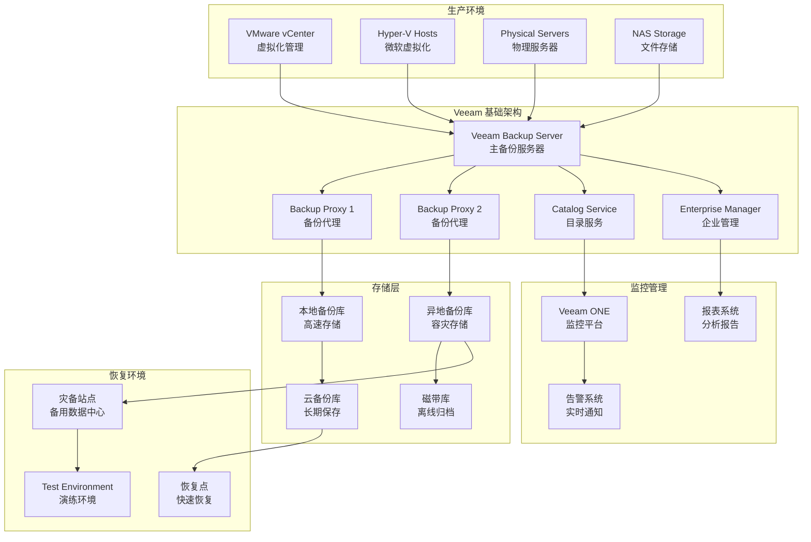

# Veeam Backup & Replication 企业级备份恢复解决方案

## 概述 (Overview)

Veeam Backup & Replication是业界领先的备份和灾难恢复解决方案，专为虚拟化、物理和云环境设计。本文档从企业级备份专家角度，深入探讨Veeam的架构设计、备份策略、恢复演练和运维管理最佳实践。

Veeam Backup & Replication is the industry-leading backup and disaster recovery solution designed for virtualized, physical, and cloud environments. This document explores Veeam's architecture design, backup strategies, recovery drills, and operational management best practices from an enterprise backup expert perspective.

## 架构设计 (Architecture Design)

### 企业级Veeam备份架构 (Enterprise Veeam Backup Architecture)

```powershell
# Veeam Backup & Replication PowerShell 部署脚本
# 企业级备份基础架构配置

# Veeam Backup Server 配置
$backupServer = @{
    ServerName = "VEEAM-BACKUP-SERVER"
    IPAddress = "192.168.1.100"
    MemoryGB = 32
    CPUCount = 8
    Storage = @{
        SystemDisk = "200GB SSD"
        BackupRepository = "2TB SAS"
        CacheDisk = "500GB SSD"
    }
}

# 备份存储库配置
$repositories = @(
    @{
        Name = "Primary-Backup-Repo"
        Path = "\\storage-array\veeam-backups"
        Type = "NFS"
        CapacityTB = 50
        RetentionPolicy = "14 days"
    },
    @{
        Name = "Offsite-Backup-Repo"
        Path = "\\offsite-storage\veeam-backups"
        Type = "SMB"
        CapacityTB = 30
        RetentionPolicy = "30 days"
    },
    @{
        Name = "Cloud-Backup-Repo"
        Type = "Amazon S3"
        Bucket = "company-veeam-backups"
        Region = "us-west-2"
        RetentionPolicy = "90 days"
    }
)

# 备份代理配置
$backupProxies = @(
    @{
        Name = "Proxy-01"
        Server = "BACKUP-PROXY-01"
        Cores = 8
        MaxTasks = 4
        Network = "10GbE"
    },
    @{
        Name = "Proxy-02"
        Server = "BACKUP-PROXY-02"
        Cores = 8
        MaxTasks = 4
        Network = "10GbE"
    }
)

# 存储优化配置
$storageOptimization = @{
    CompressionLevel = "DedupeFriendly"
    EnableDeduplication = $true
    EnableEncryption = $true
    EncryptionKey = "CompanyBackupKey2024"
    EnableImmutability = $true
    ImmutabilityPeriod = "14 days"
}
```

### Veeam 架构图 (Veeam Architecture Diagram)



## 核心功能配置 (Core Functionality Configuration)

### 备份作业配置 (Backup Job Configuration)

```powershell
# Veeam PowerShell 备份作业配置
Add-PSSnapin VeeamPSSnapin

# 创建备份作业
$jobName = "Production-VM-Backup-Daily"
$backupRepository = Get-VBRBackupRepository -Name "Primary-Backup-Repo"
$vms = Get-VBRViEntity -Name "Production-*"

# 配置备份作业参数
$jobOptions = New-VBRJobOptions
$jobOptions.GenerationPolicy.RetentionPolicyType = "Simple"
$jobOptions.GenerationPolicy.SimpleRetention.RestorePoints = 14
$jobOptions.Storage.InterruptQuickBackupOnError = $true
$jobOptions.Storage.EnableFullBackup = $true
$jobOptions.Storage.FullBackupDays = "Friday"
$jobOptions.Storage.TransformFullToSyntethic = $true

# 创建备份作业
Add-VBRViBackupJob -Name $jobName `
    -Entity $vms `
    -BackupRepository $backupRepository `
    -Options $jobOptions

# 配置备份窗口
$scheduleOptions = New-VBRJobScheduleOptions
$scheduleOptions.OptionsDaily.Enabled = $true
$scheduleOptions.OptionsDaily.Kind = "SelectedDays"
$scheduleOptions.OptionsDaily.Time = "02:00"
$scheduleOptions.OptionsDaily.Days = "Monday","Tuesday","Wednesday","Thursday","Friday"

Set-VBRJobSchedule -Job $jobName -Options $scheduleOptions

# 配置网络加速
$viProxy = Get-VBRViProxy -Name "Proxy-01"
Set-VBRJobAdvancedViOptions -Job $jobName -EnableVMProcessingOffloading $true
Set-VBRJobViProxy -Job $jobName -Proxy $viProxy
```

### 复制作业配置 (Replication Job Configuration)

```powershell
# 灾备复制作业配置
$replicaJobName = "Production-To-DR-Replication"
$sourceVms = Get-VBRViEntity -Name "Critical-*"
$targetHost = Get-VBRServer -Name "DR-HYPERVISOR-01"
$targetDatastore = Get-VBRViDatastore -Name "DR-Datastore-01"

# 复制作业选项
$replicaOptions = New-VBRJobOptions
$replicaOptions.FailoverToOriginalVmAfterFailback = $true
$replicaOptions.HighPriorityForAppAwareProcessing = $true

# 创建复制作业
Add-VBRViReplicaJob -Name $replicaJobName `
    -Entity $sourceVms `
    -Server $targetHost `
    -Datastore $targetDatastore `
    -Options $replicaOptions

# 配置复制计划
$replicaSchedule = New-VBRJobScheduleOptions
$replicaSchedule.OptionsContinuous.Enabled = $true
$replicaSchedule.OptionsContinuous.SyncIntervalStartTime = "03:00"
$replicaSchedule.OptionsContinuous.SyncIntervalType = "Hours"
$replicaSchedule.OptionsContinuous.SyncInterval = 4

Set-VBRJobSchedule -Job $replicaJobName -Options $replicaSchedule

# 配置应用感知处理
$appProcessingOptions = New-VBRApplicationProcessingOptions
$appProcessingOptions.MicrosoftSqlProcessingEnabled = $true
$appProcessingOptions.MicrosoftExchangeProcessingEnabled = $true
$appProcessingOptions.MicrosoftSharePointProcessingEnabled = $true

Set-VBRJobApplicationProcessingOptions -Job $replicaJobName -Options $appProcessingOptions
```

### 存储优化配置 (Storage Optimization Configuration)

```xml
<!-- Veeam 存储优化配置文件 -->
<VeeamBackupStorageOptimization>
    <Compression>
        <Level>DedupeFriendly</Level>
        <BlockSize>256KB</BlockSize>
        <EnableVariableBlockSizeMode>true</EnableVariableBlockSizeMode>
    </Compression>
    
    <Deduplication>
        <Enable>true</Enable>
        <HashAlgorithm>SHA256</HashAlgorithm>
        <GlobalDeduplication>true</GlobalDeduplication>
        <SourceSideDeduplication>true</SourceSideDeduplication>
    </Deduplication>
    
    <Encryption>
        <Enable>true</Enable>
        <Algorithm>AES256</Algorithm>
        <KeyLength>256</KeyLength>
        <EnableKeyExchange>true</EnableKeyExchange>
    </Encryption>
    
    <Immutability>
        <Enable>true</Enable>
        <PeriodDays>14</PeriodDays>
        <LockMode>Compliance</LockMode>
    </Immutability>
    
    <Performance>
        <ConcurrentTasks>8</ConcurrentTasks>
        <ThrottleKBps>0</ThrottleKBps>
        <EnableBackupStreams>true</EnableBackupStreams>
        <LimitProcessedVMConcurrency>true</LimitProcessedVMConcurrency>
    </Performance>
</VeeamBackupStorageOptimization>
```

## 灾难恢复方案 (Disaster Recovery Solutions)

### 完整恢复计划 (Complete Recovery Plan)

```yaml
# 灾难恢复计划配置
disaster_recovery_plan:
  plan_name: "Enterprise-DR-Plan-2024"
  rto: "4 hours"  # 恢复时间目标
  rpo: "2 hours"  # 恢复点目标
  
  recovery_scenarios:
    - scenario_name: "Data Center Outage"
      trigger_conditions:
        - primary_site_unavailable: true
        - network_connectivity_lost: true
        - power_outage_duration: "> 24 hours"
      
      recovery_steps:
        - step: 1
          action: "Activate DR site"
          responsible_team: "Infrastructure Team"
          estimated_time: "30 minutes"
          
        - step: 2
          action: "Restore critical systems from replicas"
          responsible_team: "Systems Team"
          estimated_time: "2 hours"
          
        - step: 3
          action: "Validate application functionality"
          responsible_team: "Application Team"
          estimated_time: "1 hour"
          
        - step: 4
          action: "Redirect user traffic to DR site"
          responsible_team: "Network Team"
          estimated_time: "30 minutes"

    - scenario_name: "Ransomware Attack"
      trigger_conditions:
        - malware_detected: true
        - files_encrypted: "> 50%"
        - backup_integrity_compromised: false
      
      recovery_steps:
        - step: 1
          action: "Isolate affected systems"
          responsible_team: "Security Team"
          estimated_time: "15 minutes"
          
        - step: 2
          action: "Identify clean restore point"
          responsible_team: "Backup Team"
          estimated_time: "30 minutes"
          
        - step: 3
          action: "Restore from air-gapped backups"
          responsible_team: "Systems Team"
          estimated_time: "3 hours"
          
        - step: 4
          action: "Rebuild compromised systems"
          responsible_team: "Infrastructure Team"
          estimated_time: "2 hours"
```

### 故障切换配置 (Failover Configuration)

```powershell
# Veeam 故障切换自动化脚本
Import-Module Veeam.Backup.PowerShell

function Start-Failover {
    param(
        [string]$PlanName,
        [string]$Reason,
        [switch]$Planned
    )
    
    Write-Host "Initiating failover for plan: $PlanName"
    Write-Host "Reason: $Reason"
    
    try {
        # 验证恢复计划
        $recoveryPlan = Get-VBRRecoveryPlan -Name $PlanName
        if (-not $recoveryPlan) {
            throw "Recovery plan '$PlanName' not found"
        }
        
        # 检查前提条件
        $preConditions = Test-VBRRecoveryPlan -Plan $recoveryPlan
        if (-not $preConditions.Result) {
            Write-Warning "Pre-conditions check failed: $($preConditions.Message)"
            return $false
        }
        
        # 启动故障切换
        if ($Planned) {
            Write-Host "Starting planned failover..."
            $result = Start-VBRPlannedFailover -Plan $recoveryPlan
        } else {
            Write-Host "Starting unplanned failover..."
            $result = Start-VBRUnplannedFailover -Plan $recoveryPlan
        }
        
        # 监控故障切换进度
        $sessionId = $result.Id
        do {
            Start-Sleep -Seconds 30
            $session = Get-VBRSession -Id $sessionId
            Write-Host "Failover progress: $($session.Progress)%"
        } while ($session.State -eq "Working")
        
        if ($session.State -eq "Stopped") {
            Write-Host "Failover completed successfully"
            return $true
        } else {
            Write-Error "Failover failed: $($session.Result)"
            return $false
        }
        
    } catch {
        Write-Error "Failover initiation failed: $_"
        return $false
    }
}

function Test-RecoveryPoint {
    param(
        [string]$VmName,
        [datetime]$RestorePointDate
    )
    
    Write-Host "Testing recovery point for VM: $VmName"
    
    try {
        $vm = Find-VBRViEntity -Name $VmName
        $restorePoint = Get-VBRRestorePoint -BackupObject $vm | 
            Where-Object { $_.CreationTime.Date -eq $RestorePointDate.Date } |
            Sort-Object CreationTime -Descending | Select-Object -First 1
            
        if (-not $restorePoint) {
            Write-Warning "No restore point found for date: $RestorePointDate"
            return $false
        }
        
        # 启动即时恢复测试
        $testVmName = "$($VmName)_Test_$(Get-Date -Format 'yyyyMMdd_HHmmss')"
        $testResult = Start-VBRInstantRecovery -RestorePoint $restorePoint `
            -Server (Get-VBRServer -Name "TEST-HYPERVISOR") `
            -VMName $testVmName `
            -PowerUp:$false
            
        if ($testResult) {
            Write-Host "Recovery point test successful for VM: $VmName"
            # 清理测试环境
            Stop-VBRInstantRecovery -InstantRecovery $testResult
            return $true
        } else {
            Write-Error "Recovery point test failed for VM: $VmName"
            return $false
        }
        
    } catch {
        Write-Error "Recovery point test failed: $_"
        return $false
    }
}
```

## 监控告警 (Monitoring and Alerting)

### 监控配置 (Monitoring Configuration)

```powershell
# Veeam 监控和告警配置
Add-PSSnapin VeeamPSSnapin

# 创建监控告警规则
$alertRules = @(
    @{
        Name = "Backup Job Failed"
        Type = "BackupJobStatus"
        Condition = "Status = 'Failed'"
        Notification = @{
            Email = $true
            SMTP = "smtp.company.com"
            Recipients = @("backup-team@company.com", "noc@company.com")
            Subject = "Veeam Backup Job Failure Alert"
        }
    },
    @{
        Name = "Low Storage Space"
        Type = "RepositoryFreeSpace"
        Condition = "FreeSpacePercentage < 15"
        Notification = @{
            Email = $true
            SNMP = $true
            Severity = "Warning"
        }
    },
    @{
        Name = "Replication Lag"
        Type = "ReplicaSyncStatus"
        Condition = "LagMinutes > 120"
        Notification = @{
            Email = $true
            SMS = $true
            Recipients = @("dr-team@company.com")
        }
    }
)

# 配置告警规则
foreach ($rule in $alertRules) {
    Add-VBRNotificationRule -Name $rule.Name `
        -Type $rule.Type `
        -Condition $rule.Condition `
        -EmailEnabled $rule.Notification.Email `
        -SNMPEnabled $rule.Notification.SNMP `
        -SMSEnabled $rule.Notification.SMS `
        -Recipients $rule.Notification.Recipients
}

# 性能监控配置
$performanceThresholds = @{
    BackupJobDurationThreshold = "8 hours"
    RestoreJobDurationThreshold = "4 hours"
    RepositoryWriteSpeedThreshold = "50 MB/s"
    NetworkThroughputThreshold = "100 MB/s"
}

# 创建性能报告
function New-PerformanceReport {
    param([datetime]$StartDate, [datetime]$EndDate)
    
    $jobs = Get-VBRJob | Where-Object { $_.LastResult -ne "None" }
    $reportData = foreach ($job in $jobs) {
        $sessions = Get-VBRJobSession -Job $job | 
            Where-Object { $_.CreationTime -between $StartDate -and $EndDate }
            
        [PSCustomObject]@{
            JobName = $job.Name
            TotalSessions = $sessions.Count
            SuccessRate = ($sessions | Where-Object { $_.Result -eq "Success" }).Count / $sessions.Count * 100
            AverageDuration = ($sessions | Measure-Object Duration -Average).Average
            LastRun = $job.LastRun
            NextRun = $job.NextRun
        }
    }
    
    $reportData | Export-Csv -Path "C:\Reports\Veeam_Performance_Report_$(Get-Date -Format 'yyyyMMdd').csv" -NoTypeInformation
    return $reportData
}
```

### 关键监控指标 (Key Monitoring Metrics)

```promql
# Veeam 关键性能指标 (Prometheus格式)
# 备份作业成功率
veeam_backup_job_success_rate{job_type="backup"} > 95

# 备份作业持续时间
veeam_backup_job_duration_seconds > 28800  # 8小时

# 存储库剩余空间
veeam_repository_free_space_percentage < 15

# 复制作业延迟
veeam_replica_sync_lag_minutes > 120

# 恢复点目标达成率
veeam_rpo_compliance_rate > 99

# 备份数据传输速率
veeam_data_transfer_rate_bytes_per_second < 52428800  # 50MB/s

# 存储节省率
veeam_storage_savings_ratio > 2.0
```

## 运维管理 (Operational Management)

### 故障排查工具 (Troubleshooting Tools)

```bash
#!/bin/bash
# Veeam 故障排查脚本

# 备份作业诊断
diagnose_backup_jobs() {
    echo "=== Backup Job Diagnosis ==="
    
    # 检查Veeam服务状态
    systemctl status veeambackup 2>/dev/null || echo "Veeam service not running"
    
    # 检查最近失败的作业
    veeamconfig session list --format json | jq '.[] | select(.status=="Failed")'
    
    # 检查存储库状态
    veeamconfig repository list --format json | jq '.[] | {name: .name, free_space: .free_space, status: .status}'
    
    # 检查许可证状态
    veeamconfig license info
    
    # 检查系统资源使用
    echo "CPU Usage: $(top -bn1 | grep "Cpu(s)" | awk '{print $2}' | cut -d'%' -f1)"
    echo "Memory Usage: $(free | grep Mem | awk '{printf("%.2f%%", $3/$2 * 100.0)}')"
    echo "Disk Usage: $(df -h / | tail -1 | awk '{print $5}')"
}

# 网络连接诊断
diagnose_network_connectivity() {
    echo "=== Network Connectivity Diagnosis ==="
    
    # 检查备份代理连接
    for proxy in $(veeamconfig proxy list | grep -v "Name" | awk '{print $1}'); do
        echo "Testing connectivity to proxy: $proxy"
        ping -c 3 $proxy
        nc -z $proxy 10001 && echo "✓ Port 10001 open" || echo "✗ Port 10001 closed"
    done
    
    # 检查存储库网络连接
    for repo in $(veeamconfig repository list | grep -v "Name" | awk '{print $3}'); do
        echo "Testing connectivity to repository: $repo"
        if [[ $repo == //* ]]; then
            # SMB/NFS路径
            mountpoint -q $(dirname $repo) && echo "✓ Repository accessible" || echo "✗ Repository not accessible"
        fi
    done
}

# 性能分析
performance_analysis() {
    echo "=== Performance Analysis ==="
    
    # 检查备份作业性能
    veeamconfig session list --format json | jq '
        .[] | 
        select(.status=="Success") | 
        {
            job_name: .job_name,
            duration: .duration,
            processed_size: .processed_size,
            throughput: (.processed_size / .duration)
        }
    ' | sort -k4 -nr | head -10
    
    # 检查瓶颈分析
    iostat -x 1 5 | tail -n +4 | awk '
        NR==1 {print "Device tps kB_read/s kB_wrtn/s avgrq-sz avgqu-sz await svctm %util"}
        NR>1 {
            printf "%s %8.2f %8.2f %8.2f %8.2f %8.2f %8.2f %8.2f %6.2f\n", 
            $1, $2, $3, $4, $5, $6, $7, $8, $9
        }
    '
}
```

### 日常运维脚本 (Daily Operations Scripts)

```powershell
# Veeam 日常运维PowerShell脚本
Import-Module Veeam.Backup.PowerShell

# 自动清理过期备份
function Invoke-BackupCleanup {
    param(
        [int]$RetentionDays = 30,
        [switch]$WhatIf
    )
    
    Write-Host "Starting backup cleanup process..."
    Write-Host "Retention period: $RetentionDays days"
    
    $cutOffDate = (Get-Date).AddDays(-$RetentionDays)
    $backupJobs = Get-VBRJob | Where-Object { $_.JobType -eq "Backup" }
    
    foreach ($job in $backupJobs) {
        Write-Host "Processing job: $($job.Name)"
        
        $restorePoints = Get-VBRRestorePoint -Backup $job.GetLastResult() |
            Where-Object { $_.CreationTime -lt $cutOffDate }
            
        if ($restorePoints) {
            Write-Host "Found $($restorePoints.Count) expired restore points"
            
            if (-not $WhatIf) {
                $restorePoints | Remove-VBRRestorePoint -Confirm:$false
                Write-Host "Cleaned up expired restore points"
            } else {
                Write-Host "[WHATIF] Would remove $($restorePoints.Count) restore points"
            }
        } else {
            Write-Host "No expired restore points found"
        }
    }
}

# 存储库健康检查
function Test-RepositoryHealth {
    param([string[]]$RepositoryNames)
    
    Write-Host "Performing repository health check..."
    
    if (-not $RepositoryNames) {
        $repositories = Get-VBRBackupRepository
    } else {
        $repositories = $RepositoryNames | ForEach-Object { Get-VBRBackupRepository -Name $_ }
    }
    
    $healthReport = foreach ($repo in $repositories) {
        $freeSpacePercent = ($repo.Info.CachedFreeSpace / $repo.Info.CachedTotalSpace) * 100
        $status = if ($freeSpacePercent -lt 10) { "Critical" }
                 elseif ($freeSpacePercent -lt 20) { "Warning" }
                 else { "Healthy" }
                 
        [PSCustomObject]@{
            RepositoryName = $repo.Name
            TotalSpaceGB = [math]::Round($repo.Info.CachedTotalSpace / 1GB, 2)
            FreeSpaceGB = [math]::Round($repo.Info.CachedFreeSpace / 1GB, 2)
            FreeSpacePercent = [math]::Round($freeSpacePercent, 2)
            Status = $status
            LastUpdate = $repo.Info.LastUpdate
        }
    }
    
    $healthReport | Format-Table -AutoSize
    return $healthReport
}

# 自动备份验证
function Invoke-BackupVerification {
    param([string]$BackupJobName)
    
    Write-Host "Starting backup verification for job: $BackupJobName"
    
    $job = Get-VBRJob -Name $BackupJobName
    if (-not $job) {
        Write-Error "Backup job '$BackupJobName' not found"
        return
    }
    
    # 获取最新的还原点
    $latestRestorePoint = Get-VBRRestorePoint -Backup $job.GetLastResult() |
        Sort-Object CreationTime -Descending | Select-Object -First 1
        
    if (-not $latestRestorePoint) {
        Write-Warning "No restore points found for job: $BackupJobName"
        return
    }
    
    Write-Host "Verifying restore point from: $($latestRestorePoint.CreationTime)"
    
    # 创建验证环境
    $verificationVmName = "VERIFY_$($BackupJobName)_$(Get-Date -Format 'yyyyMMdd_HHmmss')"
    $verificationResult = Start-VBRQuickBackupVerification -RestorePoint $latestRestorePoint `
        -VMName $verificationVmName `
        -PowerUp:$false
        
    if ($verificationResult) {
        Write-Host "✓ Backup verification successful"
        # 清理验证环境
        Stop-VBRQuickBackupVerification -Verification $verificationResult
    } else {
        Write-Error "✗ Backup verification failed"
    }
}

# 生成日报表
function New-DailyReport {
    param([datetime]$ReportDate = (Get-Date))
    
    Write-Host "Generating daily Veeam report for: $ReportDate"
    
    $startDate = $ReportDate.Date
    $endDate = $startDate.AddDays(1).AddSeconds(-1)
    
    # 收集作业统计数据
    $jobStats = Get-VBRJobSession | 
        Where-Object { $_.CreationTime -between $startDate -and $endDate } |
        Group-Object JobName | ForEach-Object {
            [PSCustomObject]@{
                JobName = $_.Name
                TotalRuns = $_.Count
                Successful = ($_.Group | Where-Object { $_.Result -eq "Success" }).Count
                Failed = ($_.Group | Where-Object { $_.Result -eq "Failed" }).Count
                Warning = ($_.Group | Where-Object { $_.Result -eq "Warning" }).Count
                SuccessRate = [math]::Round((($_.Group | Where-Object { $_.Result -eq "Success" }).Count / $_.Count) * 100, 2)
            }
        }
    
    # 收集存储库统计
    $repoStats = Get-VBRBackupRepository | ForEach-Object {
        [PSCustomObject]@{
            RepositoryName = $_.Name
            UsedSpaceGB = [math]::Round(($_.Info.CachedTotalSpace - $_.Info.CachedFreeSpace) / 1GB, 2)
            FreeSpaceGB = [math]::Round($_.Info.CachedFreeSpace / 1GB, 2)
            FreeSpacePercent = [math]::Round(($_.Info.CachedFreeSpace / $_.Info.CachedTotalSpace) * 100, 2)
        }
    }
    
    # 生成报告
    $report = [PSCustomObject]@{
        ReportDate = $ReportDate.ToString("yyyy-MM-dd")
        JobStatistics = $jobStats
        RepositoryStatistics = $repoStats
        GeneratedAt = Get-Date
    }
    
    $report | ConvertTo-Json -Depth 3 | Out-File "C:\Reports\Veeam_Daily_Report_$($ReportDate.ToString('yyyyMMdd')).json"
    Write-Host "Report generated: C:\Reports\Veeam_Daily_Report_$($ReportDate.ToString('yyyyMMdd')).json"
    
    return $report
}
```

## 最佳实践 (Best Practices)

### 备份策略最佳实践 (Backup Strategy Best Practices)

1. **3-2-1备份原则**
   ```powershell
   # 实施3-2-1备份策略
   $backupStrategy = @{
       Copies = 3          # 至少保留3个副本
       MediaTypes = 2      # 使用至少2种不同类型的存储介质
       Offsite = 1         # 至少1个副本存放在异地
   }
   
   # 配置多层备份存储
   $repositories = @(
       @{ Name = "Local-Disk"; Type = "DirectSAN"; Location = "On-site" },
       @{ Name = "NAS-Array"; Type = "NFS"; Location = "On-site" },
       @{ Name = "Cloud-Storage"; Type = "S3"; Location = "Off-site" }
   )
   ```

2. **备份频率规划**
   ```yaml
   # 基于业务需求的备份频率
   backup_schedule:
     critical_systems:
       frequency: "hourly"
       retention: "48 hours"
       rpo: "1 hour"
       
     important_data:
       frequency: "daily"
       retention: "30 days"
       rpo: "24 hours"
       
     archived_data:
       frequency: "weekly"
       retention: "1 year"
       rpo: "168 hours"
   ```

3. **增量备份优化**
   ```powershell
   # 配置合成全量备份
   $jobOptions = New-VBRJobOptions
   $jobOptions.Storage.TransformFullToSyntethic = $true
   $jobOptions.Storage.TransformIncrementsToSyntethic = $true
   $jobOptions.Storage.EnableFullBackup = $true
   $jobOptions.Storage.FullBackupDays = "Sunday"
   ```

### 安全最佳实践 (Security Best Practices)

1. **访问控制**
   ```xml
   <!-- Veeam 安全配置 -->
   <VeeamSecurity>
       <Authentication>
           <Mode>ActiveDirectory</Mode>
           <Domain>COMPANY</Domain>
           <Groups>
               <Group name="Backup Administrators" role="Administrator"/>
               <Group name="Backup Operators" role="Operator"/>
               <Group name="Backup Viewers" role="Viewer"/>
           </Groups>
       </Authentication>
       
       <Encryption>
           <BackupEncryption>true</BackupEncryption>
           <Algorithm>AES256</Algorithm>
           <KeyManagement>
               <Mode>External</Mode>
               <KeyServer>https://kmip.company.com</KeyServer>
           </KeyManagement>
       </Encryption>
       
       <Audit>
           <Enable>true</Enable>
           <LogRetention>90</LogRetention>
           <SyslogServer>syslog.company.com</SyslogServer>
       </Audit>
   </VeeamSecurity>
   ```

2. **网络安全**
   ```powershell
   # 配置防火墙规则
   $firewallRules = @(
       @{ Name = "Veeam Backup"; Port = 10001; Protocol = "TCP" },
       @{ Name = "Veeam Mount Server"; Port = 10002; Protocol = "TCP" },
       @{ Name = "Veeam Data Mover"; Port = 10003; Protocol = "TCP" }
   )
   
   foreach ($rule in $firewallRules) {
       New-NetFirewallRule -DisplayName $rule.Name -Direction Inbound `
           -Protocol $rule.Protocol -LocalPort $rule.Port -Action Allow
   }
   ```

3. **数据保护**
   ```powershell
   # 配置不可变备份
   $immutabilityConfig = @{
       Enable = $true
       PeriodDays = 14
       LockMode = "Compliance"
       OverridePassword = "SecureOverridePassword2024!"
   }
   
   # 启用防篡改保护
   Set-VBRImmutabilityOptions -Enable $true -PeriodDays 14
   ```

### 监控最佳实践 (Monitoring Best Practices)

1. **综合监控面板**
   ```json
   {
     "dashboard": "Veeam Enterprise Monitoring",
     "widgets": [
       {
         "type": "backup_success_rate",
         "threshold": 95,
         "refresh_interval": 300
       },
       {
         "type": "repository_capacity",
         "warning_threshold": 80,
         "critical_threshold": 90
       },
       {
         "type": "job_duration",
         "baseline_hours": 8,
         "alert_threshold": 12
       },
       {
         "type": "replication_lag",
         "warning_minutes": 60,
         "critical_minutes": 180
       }
     ]
   }
   ```

2. **主动告警策略**
   ```yaml
   # 分层告警配置
   alerting_strategy:
     immediate:
       channels: [email, sms, slack]
       conditions: [backup_failed, repository_full_critical]
       
     hourly:
       channels: [email, dashboard]
       conditions: [backup_warning, replication_lag_warning]
       
     daily:
       channels: [email, report]
       conditions: [performance_degradation, capacity_trends]
   ```

3. **定期演练计划**
   ```powershell
   # 灾备演练自动化
   $drillSchedule = @{
       MonthlyTest = @{
           Frequency = "Monthly"
           Scope = "Single_VM"
           Participants = @("BackupTeam", "AppTeam", "NetworkTeam")
       }
       QuarterlyTest = @{
           Frequency = "Quarterly"
           Scope = "Application_Group"
           Participants = @("AllTeams")
       }
       AnnualTest = @{
           Frequency = "Annual"
           Scope = "Full_Failover"
           Participants = @("ExecutiveTeam", "AllTechnicalTeams")
       }
   }
   ```

---

**文档版本**: v1.0  
**最后更新**: 2024年2月7日  
**适用版本**: Veeam Backup & Replication 12+