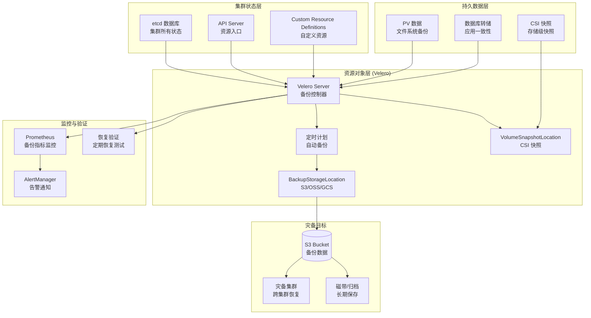

# Kubernetes 备份与恢复深度实践

> **作者**: Kubernetes 灾备架构师 | **版本**: v1.0 | **更新时间**: 2026-05-18
> **适用场景**: Kubernetes 集群级灾难恢复与数据保护 | **复杂度**: ⭐⭐⭐⭐⭐

---

## 概述

Kubernetes 已经成为企业应用部署的标准平台，但 Kubernetes 自身并不提供内置的备份与灾难恢复能力。当集群遭遇灾难性故障——无论是 etcd 数据损坏、整个集群不可用、还是误操作删除关键资源——如果没有完善的备份策略，将面临严重的数据丢失和业务中断。本文档全面探讨 Kubernetes 环境下的备份与恢复实践，涵盖 Velero 深度配置、etcd 备份恢复、持久卷（PV）数据保护、CSI 快照集成、集群迁移以及完整的灾难恢复编排。

### RPO 与 RTO 定义

- **RPO（Recovery Point Objective）**：在 Kubernetes 环境中，RPO 由三个层面决定：etcd 备份频率决定集群状态的 RPO；Velero 定时备份决定资源对象的 RPO；PV 快照频率决定持久数据的 RPO。企业应根据工作负载关键性，分层设定 RPO 目标。
- **RTO（Recovery Time Objective）**：Kubernetes 的 RTO 取决于恢复范围。单个命名空间恢复可在分钟级完成；完整集群重建通常需要 30 分钟到数小时；跨集群迁移恢复取决于数据量和网络带宽。

```yaml
k8s_backup_rpo_rto:
  etcd_backup:
    rpo: "1-6 小时（取决于备份频率）"
    rto: "10-30 分钟（etcd 恢复 + API Server 重启）"
    
  velero_resource_backup:
    rpo: "1-24 小时（取决于 Schedule 配置）"
    rto: "分钟级（资源对象恢复）"
    
  csi_volume_snapshot:
    rpo: "分钟-小时级"
    rto: "分钟级（快照恢复）"
    
  fs_backup_restic:
    rpo: "小时级"
    rto: "分钟-小时级（取决于数据量）"
    
  cross_cluster_migration:
    rpo: "取决于最后一次备份"
    rto: "30 分钟 - 数小时"
```

---

## 架构设计

### Kubernetes 多层备份架构



---

## 核心配置

### etcd 备份策略

etcd 是 Kubernetes 的"大脑"，存储了集群的所有状态数据。etcd 备份是 Kubernetes 灾备的基础。

```yaml
# etcd 自动备份 CronJob
apiVersion: batch/v1
kind: CronJob
metadata:
  name: etcd-backup
  namespace: kube-system
spec:
  schedule: "0 */4 * * *"    # 每 4 小时备份一次
  concurrencyPolicy: Forbid
  successfulJobsHistoryLimit: 3
  failedJobsHistoryLimit: 3
  jobTemplate:
    spec:
      template:
        spec:
          nodeSelector:
            node-role.kubernetes.io/control-plane: ""
          tolerations:
            - key: node-role.kubernetes.io/control-plane
              effect: NoSchedule
          containers:
            - name: etcd-backup
              image: bitnami/etcd:3.5
              command:
                - /bin/bash
                - -c
                - |
                  set -euo pipefail
                  
                  ETCDCTL_API=3
                  ETCDCTL_CACERT=/etc/kubernetes/pki/etcd/ca.crt
                  ETCDCTL_CERT=/etc/kubernetes/pki/etcd/healthcheck-client.crt
                  ETCDCTL_KEY=/etc/kubernetes/pki/etcd/healthcheck-client.key
                  ENDPOINTS=https://127.0.0.1:2379
                  
                  TIMESTAMP=$(date +%Y%m%d_%H%M%S)
                  BACKUP_DIR="/backup/etcd/${TIMESTAMP}"
                  
                  mkdir -p ${BACKUP_DIR}
                  
                  echo "开始 etcd 备份: ${TIMESTAMP}"
                  etcdctl snapshot save ${BACKUP_DIR}/etcd-snapshot.db \
                    --endpoints=${ENDPOINTS} \
                    --cacert=${ETCDCTL_CACERT} \
                    --cert=${ETCDCTL_CERT} \
                    --key=${ETCDCTL_KEY}
                  
                  etcdctl snapshot status ${BACKUP_DIR}/etcd-snapshot.db --write-table
                  
                  # 上传到 S3
                  aws s3 cp ${BACKUP_DIR}/etcd-snapshot.db \
                    s3://company-k8s-backups/etcd/$(hostname)/${TIMESTAMP}/etcd-snapshot.db
                    
                  echo "备份完成: s3://company-k8s-backups/etcd/$(hostname)/${TIMESTAMP}/"
                  
                  # 清理本地旧备份（保留 3 天）
                  find /backup/etcd -type d -mtime +3 -exec rm -rf {} +
                  
              volumeMounts:
                - name: etcd-certs
                  mountPath: /etc/kubernetes/pki/etcd
                  readOnly: true
                - name: backup-dir
                  mountPath: /backup
              env:
                - name: AWS_ACCESS_KEY_ID
                  valueFrom:
                    secretKeyRef:
                      name: etcd-backup-credentials
                      key: aws_access_key_id
                - name: AWS_SECRET_ACCESS_KEY
                  valueFrom:
                    secretKeyRef:
                      name: etcd-backup-credentials
                      key: aws_secret_access_key
                      
          volumes:
            - name: etcd-certs
              hostPath:
                path: /etc/kubernetes/pki/etcd
                type: Directory
            - name: backup-dir
              hostPath:
                path: /var/lib/etcd-backup
                type: DirectoryOrCreate
          restartPolicy: OnFailure
```

### etcd 恢复流程

```bash
#!/bin/bash
# etcd 灾难恢复脚本
# 警告：此操作会替换整个 etcd 数据，仅在集群完全不可用时使用

set -euo pipefail

ETCD_VERSION="3.5.16"
BACKUP_FILE="${1:?用法: $0 <etcd-snapshot.db>}"

echo "=== etcd 灾难恢复 ==="
echo "备份文件: $BACKUP_FILE"

# 步骤 1: 停止所有控制平面组件
echo "[1/6] 停止控制平面组件..."
ssh all-control-plane-nodes "
    systemctl stop kube-apiserver
    systemctl stop kube-controller-manager
    systemctl stop kube-scheduler
    systemctl stop etcd
"

# 步骤 2: 备份当前 etcd 数据（如果存在）
echo "[2/6] 备份当前 etcd 数据..."
ssh all-control-plane-nodes "
    if [ -d /var/lib/etcd ]; then
        mv /var/lib/etcd /var/lib/etcd.corrupted.$(date +%s)
    fi
"

# 步骤 3: 恢复 etcd 快照
echo "[3/6] 恢复 etcd 快照..."
ETCDCTL_API=3 etcdctl snapshot restore "$BACKUP_FILE" \
    --name=$(hostname) \
    --initial-cluster="etcd-01=https://10.0.0.1:2380,etcd-02=https://10.0.0.2:2380,etcd-03=https://10.0.0.3:2380" \
    --initial-advertise-peer-urls="https://$(hostname -I | awk '{print $1}'):2380" \
    --data-dir=/var/lib/etcd

# 步骤 4: 修复权限
echo "[4/6] 修复权限..."
chown -R etcd:etcd /var/lib/etcd
chmod 700 /var/lib/etcd

# 步骤 5: 启动 etcd
echo "[5/6] 启动 etcd..."
systemctl start etcd

# 等待 etcd 就绪
echo "等待 etcd 就绪..."
for i in $(seq 1 30); do
    if ETCDCTL_API=3 etcdctl endpoint health --cluster; then
        echo "etcd 集群健康"
        break
    fi
    echo "等待... ($i/30)"
    sleep 10
done

# 步骤 6: 启动控制平面
echo "[6/6] 启动控制平面..."
systemctl start kube-apiserver
sleep 10
systemctl start kube-controller-manager
systemctl start kube-scheduler

echo "=== etcd 恢复完成 ==="
echo "验证集群状态: kubectl get nodes"
```

### PV 持久卷备份策略

```yaml
# PV 数据保护 - CSI 快照策略
apiVersion: snapshot.storage.k8s.io/v1
kind: VolumeSnapshotClass
metadata:
  name: csi-snapclass-daily
  labels:
    velero.io/csi-volumesnapshot-class: "true"
driver: ebs.csi.aws.com
deletionPolicy: Retain
---
# 数据库 PV 定时快照（高 RPO 要求）
apiVersion: velero.io/v1
kind: Schedule
metadata:
  name: database-pv-snapshots
  namespace: velero
spec:
  schedule: "0 */4 * * *"    # 每 4 小时
  template:
    includedNamespaces:
      - database
    snapshotVolumes: true
    ttl: 24h
    volumeSnapshotLocations:
      - default
---
# 文件系统备份（适用于 CSI 不支持的场景）
apiVersion: velero.io/v1
kind: Schedule
metadata:
  name: production-fs-backup
  namespace: velero
spec:
  schedule: "0 2 * * *"
  template:
    includedNamespaces:
      - production
    defaultVolumesToFsBackup: true
    snapshotVolumes: false
    ttl: 168h
```

### 集群迁移方案

```yaml
# 跨集群迁移配置
migration_plan:
  source_cluster:
    name: "k8s-prod-v1.28"
    api_server: "https://api.k8s-prod.company.com"
    velero_namespace: "velero"
    
  target_cluster:
    name: "k8s-prod-v1.30"
    api_server: "https://api.k8s-new.company.com"
    velero_namespace: "velero"
    
  shared_storage:
    type: "S3"
    bucket: "company-k8s-migration"
    region: "us-east-1"
    
  migration_steps:
    - step: "源集群：冻结应用（可选）"
      command: "kubectl cordon <nodes>"
      
    - step: "源集群：创建最终备份"
      command: |
        velero backup create migration-final \
          --include-namespaces production \
          --snapshot-volumes \
          --default-volumes-to-fs-backup \
          --wait
          
    - step: "目标集群：安装 Velero（同一 BSL）"
      command: |
        velero install \
          --provider aws \
          --bucket company-k8s-migration \
          --backup-location-config region=us-east-1 \
          --use-node-agent
          
    - step: "目标集群：等待备份同步"
      command: "velero backup get"
      
    - step: "目标集群：执行恢复"
      command: |
        velero restore create migration-restore \
          --from-backup migration-final \
          --namespace-mappings production:production \
          --existing-resource-policy update \
          --wait
          
    - step: "验证恢复结果"
      command: |
        kubectl get all -n production
        kubectl get pvc -n production
        
    - step: "DNS 流量切换"
      command: "python3 update-dns.py --target new-cluster"
```

---

## 备份策略

### 多层备份策略矩阵

```yaml
k8s_backup_strategy:
  layer_1_etcd:
    method: "etcdctl snapshot"
    frequency: "每 4 小时"
    retention: "7 天"
    storage: "S3 + 本地"
    rpo: "4 小时"
    scope: "集群全部状态"
    
  layer_2_resources:
    method: "Velero 定时备份"
    frequency: "每日 02:00"
    retention: "7-90 天（分层）"
    storage: "S3"
    rpo: "24 小时"
    scope: "所有命名空间资源对象"
    
  layer_3_volume_data:
    method: "CSI 快照 + Velero FS Backup"
    frequency: "每 4 小时（CSI）/ 每日（FS）"
    retention: "24 小时（CSI）/ 7 天（FS）"
    rpo: "4 小时"
    scope: "持久卷数据"
    
  layer_4_application:
    method: "数据库转储（Pre Hook）"
    frequency: "每小时"
    retention: "7 天"
    rpo: "1 小时"
    scope: "数据库逻辑备份"
    
  layer_5_gitops:
    method: "Git 仓库（ArgoCD / Flux）"
    frequency: "实时"
    retention: "无限（Git 历史）"
    rpo: "接近零"
    scope: "声明式配置"
```

---

## 恢复流程

### 分级恢复操作手册

```yaml
k8s_recovery_procedures:
  level_1_resource_recovery:
    trigger: "误删除资源对象"
    rto_target: "5 分钟"
    steps:
      - "velero restore create --from-backup <latest> --include-resources <resource-type>"
      - "验证资源恢复"
      - "检查关联资源一致性"
      
  level_2_namespace_recovery:
    trigger: "整个命名空间被删除或损坏"
    rto_target: "15 分钟"
    steps:
      - "velero restore create --from-backup <latest> --include-namespaces <ns>"
      - "等待所有 Pod Running"
      - "验证 Service 和 Ingress"
      - "检查 PVC 挂载状态"
      - "执行应用健康检查"
      
  level_3_node_failure:
    trigger: "节点硬件故障"
    rto_target: "5 分钟（自动）"
    steps:
      - "Kubernetes 自动驱逐 Pod"
      - "Pod 在其他节点重建"
      - "对于 StatefulSet，等待 PVC 重新挂载"
      - "验证服务恢复"
      
  level_4_etcd_corruption:
    trigger: "etcd 数据损坏导致集群不可用"
    rto_target: "30 分钟"
    steps:
      - "停止所有控制平面组件"
      - "从 S3 下载最近的 etcd 快照"
      - "执行 etcdctl snapshot restore"
      - "重启 etcd 和控制平面"
      - "验证集群状态: kubectl get nodes"
      - "检查所有系统 Pod 状态"
      
  level_5_total_cluster_loss:
    trigger: "整个 Kubernetes 集群不可用"
    rto_target: "2-4 小时"
    steps:
      - "使用 Cluster API / IaC 重建基础设施"
      - "安装 Kubernetes（kubeadm / EKS / GKE）"
      - "安装 Velero（指向同一 BSL）"
      - "等待备份元数据同步"
      - "执行全集群恢复: velero restore create --from-backup <latest>"
      - "验证所有命名空间和资源"
      - "恢复 PV 数据（从快照或 FS 备份）"
      - "更新 DNS 和负载均衡器"
      - "全面业务验证"
```

---

## 容灾演练方案

```yaml
k8s_dr_drill:
  weekly_velero_restore:
    type: "Velero 恢复测试"
    scope: "随机命名空间恢复到测试环境"
    automation: "CI/CD Pipeline"
    steps:
      - "选择最近成功的备份"
      - "恢复到 test-restore 命名空间"
      - "执行应用健康检查"
      - "验证数据完整性"
      - "清理测试环境"
    success_criteria:
      - "所有 Pod Running"
      - "健康检查通过"
      - "数据校验和匹配"
      
  monthly_etcd_recovery:
    type: "etcd 恢复演练"
    scope: "在隔离环境验证 etcd 恢复流程"
    steps:
      - "搭建测试集群"
      - "模拟 etcd 故障"
      - "执行 etcd 恢复"
      - "验证集群功能"
      - "记录恢复时间"
      
  quarterly_cluster_rebuild:
    type: "完整集群重建演练"
    scope: "从零重建 Kubernetes 集群"
    steps:
      - "销毁测试集群"
      - "使用 IaC 重建基础设施"
      - "安装 Kubernetes 和 Velero"
      - "从备份恢复全部工作负载"
      - "执行全面业务验证"
      - "记录 RTO 实际值"
```

---

## 监控告警

```yaml
apiVersion: v1
kind: ConfigMap
metadata:
  name: k8s-backup-alerts
  namespace: monitoring
data:
  k8s-backup.yml: |
    groups:
      - name: k8s.backup
        rules:
          - alert: EtcdBackupFailed
            expr: increase(etcd_backup_failures_total[4h]) > 0
            for: 5m
            labels:
              severity: critical
            annotations:
              summary: "etcd 备份失败"
              description: "etcd 备份在过去 4 小时内失败，RPO 面临风险"
              
          - alert: EtcdNoBackupIn6Hours
            expr: time() - etcd_last_backup_timestamp > 21600
            for: 30m
            labels:
              severity: critical
            annotations:
              summary: "etcd 超过 6 小时无备份"
              
          - alert: VeleroBackupStale
            expr: time() - velero_backup_last_successful_timestamp > 86400
            for: 1h
            labels:
              severity: warning
            annotations:
              summary: "Velero 备份超过 24 小时未成功"
              
          - alert: PVSnapshotFailed
            expr: increase(velero_volume_snapshot_failure_total[4h]) > 0
            for: 5m
            labels:
              severity: warning
            annotations:
              summary: "PV 快照创建失败"
```

---

## 最佳实践

1. **多层备份**：etcd 备份 + Velero 资源备份 + PV 快照，三层互为补充
2. **GitOps 即备份**：使用 ArgoCD/Flux 管理所有声明式配置，Git 仓库本身就是最好的"备份"
3. **应用一致性**：对数据库使用 Velero Pre Hook 执行逻辑备份
4. **异地存储**：备份文件存储在与集群不同区域的 S3 Bucket 中
5. **定期恢复测试**：每周自动执行恢复测试，验证备份可用性
6. **灾备集群预热**：维护一个随时可用的灾备集群，配置 Velero 指向同一 BSL
7. **IaC 化**：使用 Cluster API 或 Terraform 管理集群基础设施，确保快速重建能力

---

## 故障排查

### 常见问题诊断

```bash
#!/bin/bash
# Kubernetes 备份系统诊断

echo "=== K8s 备份系统诊断 ==="

# 1. etcd 健康检查
echo "[1] etcd 集群健康"
ETCDCTL_API=3 etcdctl endpoint health --cluster \
  --cacert=/etc/kubernetes/pki/etcd/ca.crt \
  --cert=/etc/kubernetes/pki/etcd/healthcheck-client.crt \
  --key=/etc/kubernetes/pki/etcd/healthcheck-client.key

# 2. etcd 备份状态
echo "[2] 最近 etcd 备份"
aws s3 ls s3://company-k8s-backups/etcd/ --recursive | tail -5

# 3. Velero 状态
echo "[3] Velero 状态"
kubectl get pods -n velero
velero backup get | tail -10
velero backup-location get

# 4. CSI 快照状态
echo "[4] CSI 快照"
kubectl get volumesnapshot -A
kubectl get volumesnapshotcontent

# 5. PVC 绑定状态
echo "[5] PVC 状态"
kubectl get pvc -A | grep -v Bound
```

### 故障排查手册

| 故障现象 | 可能原因 | 排查步骤 | 解决方案 |
|:---|:---|:---|:---|
| etcd 恢复后 API Server 不启动 | 快照与集群配置不匹配 | 检查 etcd 恢复参数 | 确保initial-cluster参数正确 |
| Velero 备份卡在 InProgress | Node Agent 未运行 | 检查 DaemonSet 状态 | 重启 Node Agent |
| CSI 快照创建失败 | StorageClass 不支持快照 | 检查 CSI Driver 能力 | 安装支持快照的 CSI Driver |
| 恢复后 Pod CrashLoopBackOff | ConfigMap/Secret 未恢复 | 检查资源恢复顺序 | 确保依赖资源先恢复 |
| PV 数据丢失 | 未启用卷备份 | 检查备份配置 | 启用 snapshotVolumes 或 FS Backup |
| 跨集群恢复失败 | BSL 配置不一致 | 检查两端 BSL 配置 | 确保使用同一 Bucket 和 Region |

---

**文档版本**: v1.0  
**最后更新**: 2026-05-18  
**适用版本**: Kubernetes 1.28+ / Velero 1.15+

---

## Velero 高级配置

### 多 BackupStorageLocation 策略

在生产环境中，企业通常需要将备份数据存储在多个位置以满足合规和灾备要求。Velero 支持配置多个 BackupStorageLocation（BSL），可以将不同命名空间或不同类型的备份存储到不同的位置。

例如，关键数据库的备份可以存储在高可用的 S3 存储桶中，而开发环境的备份则存储在成本较低的归档存储中。通过为每个备份作业指定 `--storage-location` 参数，可以灵活控制备份数据的存储位置。

```yaml
# 多 BSL 配置
apiVersion: velero.io/v1
kind: BackupStorageLocation
metadata:
  name: primary-bsl
  namespace: velero
spec:
  provider: aws
  objectStorage:
    bucket: company-k8s-primary-backups
    prefix: production
  config:
    region: us-east-1
---
apiVersion: velero.io/v1
kind: BackupStorageLocation
metadata:
  name: dr-bsl
  namespace: velero
spec:
  provider: aws
  objectStorage:
    bucket: company-k8s-dr-backups
    prefix: disaster-recovery
  config:
    region: us-west-2
---
# 按命名空间分配不同 BSL 的 Schedule
apiVersion: velero.io/v1
kind: Schedule
metadata:
  name: production-to-primary
  namespace: velero
spec:
  schedule: "0 2 * * *"
  template:
    includedNamespaces: [production, monitoring]
    storageLocation: primary-bsl
    ttl: 168h
---
apiVersion: velero.io/v1
kind: Schedule
metadata:
  name: critical-to-dr
  namespace: velero
spec:
  schedule: "0 3 * * *"
  template:
    includedNamespaces: [production]
    storageLocation: dr-bsl
    ttl: 720h
```

### 备份 Hook 深度配置

Velero 的 Pre/Post Hook 是实现应用一致性备份的关键机制。对于数据库等有状态应用，直接备份文件系统可能导致数据不一致。通过 Pre Hook 在备份前执行数据库冻结或逻辑转储，Post Hook 在备份后清理临时文件，可以确保备份数据的完整性和一致性。

```yaml
# MySQL 应用一致性备份 Hook
apiVersion: velero.io/v1
kind: Backup
metadata:
  name: mysql-consistent-backup
  namespace: velero
spec:
  includedNamespaces: [database]
  hooks:
    resources:
      - name: mysql-backup-hook
        includedNamespaces: [database]
        labelSelector:
          matchLabels:
            app: mysql
        pre:
          - exec:
              command:
                - /bin/bash
                - -c
                - |
                  mysql -u root -e "FLUSH TABLES WITH READ LOCK; SYSTEM sync;"
                  mysqldump -u root --all-databases --single-transaction --flush-logs \
                    --delete-master-logs --master-data=2 > /tmp/mysql_backup.sql
                  mysql -u root -e "UNLOCK TABLES;"
              container: mysql
              timeout: 300s
              onError: Fail
        post:
          - exec:
              command:
                - /bin/bash
                - -c
                - "rm -f /tmp/mysql_backup.sql"
              container: mysql
              timeout: 30s
```

---

## Velero 插件生态

### 云提供商插件

Velero 通过插件机制支持多种云提供商和存储后端。每个插件负责与特定云平台的 API 交互，实现对象存储操作和卷快照管理。

| 插件 | 提供商 | 功能 | 安装命令 |
|:---|:---|:---|:---|
| velero-plugin-for-aws | AWS | S3 存储 + EBS 快照 | `velero plugin add velero/velero-plugin-for-aws:v1.11.0` |
| velero-plugin-for-csi | 通用 | CSI 快照支持 | `velero plugin add velero/velero-plugin-for-csi:v0.7.0` |
| velero-plugin-for-microsoft-azure | Azure | Blob 存储 + Azure Disk 快照 | `velero plugin add velero/velero-plugin-for-microsoft-azure:v1.10.0` |
| velero-plugin-for-gcp | GCP | GCS 存储 + PD 快照 | `velero plugin add velero/velero-plugin-for-gcp:v1.8.0` |
| velero-plugin-for-alibabacloud | 阿里云 | OSS 存储 + 云盘快照 | 社区维护 |

### 自定义插件开发

对于使用非标准存储后端的企业，可以开发自定义 Velero 插件。插件需要实现 `BackupItemAction`、`RestoreItemAction`、`ObjectStore` 和 `VolumeSnapshotter` 四个接口。

```go
// Velero 自定义 ObjectStore 插件示例
package main

import (
    "context"
    "io"
    
    "github.com/sirupsen/logrus"
    "github.com/vmware-tanzu/velero/pkg/plugin/velero"
)

type CustomObjectStore struct {
    log logrus.FieldLogger
}

func (s *CustomObjectStore) Init(config map[string]string) error {
    s.log.Info("初始化自定义 ObjectStore 插件")
    return nil
}

func (s *CustomObjectStore) PutObject(bucket, key string, body io.Reader) error {
    s.log.Infof("上传对象: bucket=%s, key=%s", bucket, key)
    return nil
}

func (s *CustomObjectStore) GetObject(bucket, key string) (io.ReadCloser, error) {
    s.log.Infof("下载对象: bucket=%s, key=%s", bucket, key)
    return nil, nil
}
```

---

## 灾备自动化编排

### 完整灾难恢复自动化脚本

以下脚本实现了从集群不可用到完整恢复的自动化流程。它假设已经有一个预配置的灾备集群，Velero 已经安装并指向同一 BSL。

```bash
#!/bin/bash
# Kubernetes 完整灾难恢复自动化脚本
set -euo pipefail

DR_CLUSTER_KUBECONFIG="${1:?用法: $0 <dr-cluster-kubeconfig>}"
BACKUP_NAME="${2:-$(velero backup get --kubeconfig $DR_CLUSTER_KUBECONFIG -o json | jq -r '[.items[] | select(.status.phase=="Completed")] | sort_by(.status.completionTimestamp) | reverse | .[0].metadata.name')}"

echo "=== Kubernetes 灾难恢复自动化 ==="
echo "目标集群: $DR_CLUSTER_KUBECONFIG"
echo "恢复备份: $BACKUP_NAME"

# 步骤 1: 验证灾备集群就绪
echo "[1/8] 验证灾备集群..."
kubectl --kubeconfig $DR_CLUSTER_KUBECONFIG get nodes
kubectl --kubeconfig $DR_CLUSTER_KUBECONFIG get pods -n velero

# 步骤 2: 验证备份同步
echo "[2/8] 验证备份同步..."
velero backup get --kubeconfig $DR_CLUSTER_KUBECONFIG | grep "$BACKUP_NAME"

# 步骤 3: 创建恢复
echo "[3/8] 创建恢复..."
velero restore create full-dr-recovery \
    --kubeconfig $DR_CLUSTER_KUBECONFIG \
    --from-backup "$BACKUP_NAME" \
    --exclude-namespaces kube-system,kube-public,kube-node-lease,velero \
    --wait

# 步骤 4: 验证资源恢复
echo "[4/8] 验证资源恢复..."
kubectl --kubeconfig $DR_CLUSTER_KUBECONFIG get namespaces
kubectl --kubeconfig $DR_CLUSTER_KUBECONFIG get pods -A | grep -v Running | grep -v Completed

# 步骤 5: 检查 PVC 绑定
echo "[5/8] 检查 PVC..."
kubectl --kubeconfig $DR_CLUSTER_KUBECONFIG get pvc -A | grep -v Bound

# 步骤 6: 执行应用健康检查
echo "[6/8] 执行健康检查..."
for ns in $(kubectl --kubeconfig $DR_CLUSTER_KUBECONFIG get ns -o jsonpath='{.items[*].metadata.name}' | grep -v kube); do
    echo "命名空间: $ns"
    kubectl --kubeconfig $DR_CLUSTER_KUBECONFIG get pods -n $ns --no-headers | awk '{print $3}' | sort | uniq -c
done

# 步骤 7: 更新 DNS
echo "[7/8] 更新 DNS 记录..."
echo "请手动确认后执行 DNS 更新"

# 步骤 8: 验证完成
echo "[8/8] 恢复完成"
echo "请执行应用层验证测试"
```

---

## 安全最佳实践

### Velero 安全加固

1. **对象存储加密**：所有备份存储桶启用 SSE-S3 或 SSE-KMS 加密
2. **网络隔离**：Velero 运行在独立命名空间，使用 NetworkPolicy 限制流量
3. **RBAC 最小权限**：Velero ServiceAccount 仅授予必要的 ClusterRole 权限
4. **凭证管理**：使用 External Secrets 或 Sealed Secrets 管理备份凭证
5. **审计日志**：记录所有备份和恢复操作

```yaml
# Velero 安全加固配置
apiVersion: networking.k8s.io/v1
kind: NetworkPolicy
metadata:
  name: velero-network-policy
  namespace: velero
spec:
  podSelector:
    matchLabels:
      app.kubernetes.io/name: velero
  policyTypes:
    - Ingress
    - Egress
  ingress:
    - from:
        - namespaceSelector:
            matchLabels:
              name: monitoring
      ports:
        - port: 8085
          protocol: TCP
  egress:
    - to:
        - namespaceSelector: {}
      ports:
        - port: 443
          protocol: TCP
    - to: []  # 允许访问外部 S3
```

---

**文档版本**: v1.0  
**最后更新**: 2026-05-18  
**适用版本**: Kubernetes 1.28+ / Velero 1.15+
