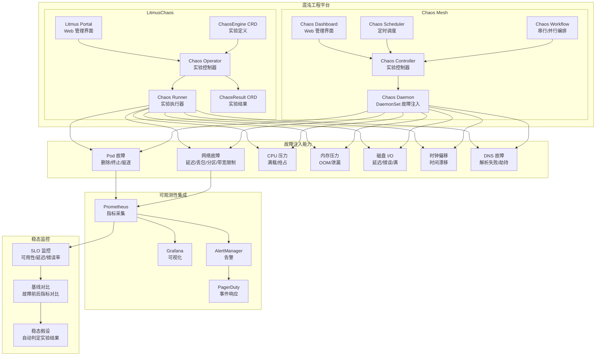

# 混沌工程平台实践：LitmusChaos 与 Chaos Mesh

> **作者**: SRE 架构师 | **版本**: v1.0 | **更新时间**: 2026-05-18
> **适用场景**: Kubernetes 混沌工程平台部署与演练 | **复杂度**: ⭐⭐⭐⭐⭐

---

## 概述

混沌工程（Chaos Engineering）是在分布式系统上进行实验的学科，目的是建立对系统抵御生产环境中失控条件能力的信心。与传统的被动式灾备不同，混沌工程主动向系统注入故障，在受控条件下发现系统的潜在弱点，从而在真实灾难发生之前修复问题。本文档深入探讨两大主流混沌工程平台——LitmusChaos（CNCF Incubating）和 Chaos Mesh（CNCF Incubating）——的部署、配置、实验设计和企业级实践，以及如何通过稳态假设（Steady State Hypothesis）和 Game Day 活动构建持续韧性验证体系。

### RPO 与 RTO 的混沌验证

混沌工程并非直接设定 RPO 和 RTO，而是**验证**这些目标是否可达：

- **RPO 验证**：通过注入数据同步组件故障（如数据库主从复制中断），测量实际的数据丢失量是否在 RPO 容忍范围内
- **RTO 验证**：通过注入基础设施故障（如节点宕机、可用区中断），测量系统自动恢复或人工介入恢复的实际时间是否满足 RTO 目标

```yaml
chaos_rpo_rto_validation:
  rpo_experiments:
    - name: "数据库主从切换数据丢失测试"
      hypothesis: "MySQL 主从切换导致数据丢失 < 10 条记录（RPO < 1秒）"
      fault: "kill mysql-primary pod"
      measurement: "对比切换前后数据行数差异"
      
    - name: "消息队列宕机消息丢失测试"
      hypothesis: "Kafka Broker 宕机不丢失已确认消息"
      fault: "kill kafka-broker pod"
      measurement: "生产者已确认消息数 vs 消费者接收消息数"
      
  rto_experiments:
    - name: "节点故障自动恢复时间"
      hypothesis: "K8s 节点宕机后 Pod 在 60 秒内恢复"
      fault: "network partition node"
      measurement: "从故障注入到 Pod Running 的时间"
      
    - name: "可用区故障切换时间"
      hypothesis: "AZ 故障后流量在 5 分钟内切换到备用 AZ"
      fault: "simulate AZ failure via network blackhole"
      measurement: "从 AZ 不可达到请求成功率恢复 > 99% 的时间"
```

---

## 架构设计

### 混沌工程平台架构



---

## 核心配置

### Chaos Mesh 部署

```yaml
# Chaos Mesh Helm values
# chaos-mesh-values.yaml
chaosDaemon:
  runtime: containerd
  socketPath: /run/containerd/containerd.sock
  podSecurityPolicy: false
  
dashboard:
  create: true
  replicaCount: 1
  persistentVolume:
    enabled: true
    size: 10Gi
    storageClassName: standard
    
controllerManager:
  replicaCount: 2
  resources:
    requests:
      cpu: 100m
      memory: 128Mi
    limits:
      cpu: 500m
      memory: 512Mi
      
webhook:
  replicaCount: 2
  
  # 仅对特定命名空间启用混沌
  namespaceSelector:
    matchLabels:
      chaos-mesh.org/inject: "enabled"

# 启用的故障类型
bpfki:
  enabled: true    # 内核级故障注入
  
dnsServer:
  create: true
  name: chaos-mesh-dns-server
```

```bash
# 安装 Chaos Mesh
helm repo add chaos-mesh https://charts.chaos-mesh.org
helm install chaos-mesh chaos-mesh/chaos-mesh \
  --namespace chaos-mesh \
  --create-namespace \
  --values chaos-mesh-values.yaml

# 为命名空间打标签（启用混沌注入）
kubectl label namespace production chaos-mesh.org/inject=enabled

# 验证安装
kubectl get pods -n chaos-mesh
kubectl port-forward -n chaos-mesh svc/chaos-dashboard 2333:2333
```

### LitmusChaos 部署

```bash
# 安装 LitmusChaos
kubectl apply -f https://raw.githubusercontent.com/litmuschaos/litmus/master/litmus-portal/litmus-portal-crds.yml
kubectl apply -f https://raw.githubusercontent.com/litmuschaos/litmus/master/litmus-portal/litmus-portal-namespaced.yml

# 安装 Chaos Operator
kubectl apply -f https://litmuschaos.github.io/litmus/litmus-operator-v3.12.0.yaml

# 验证
kubectl get pods -n litmus
```

### 稳态假设（Steady State Hypothesis）

稳态假设是混沌实验的核心概念：在注入故障前，定义系统"正常"行为可测量的指标；注入故障后，持续监控这些指标是否仍在可接受范围内。如果超出范围，说明假设被证伪——系统在故障条件下无法维持正常服务水平。

```yaml
# 稳态假设定义 - Prometheus 规则
apiVersion: v1
kind: ConfigMap
metadata:
  name: steady-state-hypothesis
  namespace: chaos-mesh
data:
  steady-state.yaml: |
    steady_state_probes:
      - name: "服务可用性 >= 99.9%"
        type: prometheus
        tolerance: 99.9
        query: |
          100 * sum(rate(http_requests_total{code!~"5.."}[1m])) 
          / sum(rate(http_requests_total[1m]))
          
      - name: "P99 延迟 < 500ms"
        type: prometheus
        tolerance:
          upper: 500
        query: |
          histogram_quantile(0.99, 
            sum(rate(http_request_duration_seconds_bucket[1m])) by (le))
            
      - name: "错误率 < 0.1%"
        type: prometheus
        tolerance: 0.1
        query: |
          100 * sum(rate(http_requests_total{code=~"5.."}[1m])) 
          / sum(rate(http_requests_total[1m]))
          
      - name: "数据库连接池利用率 < 80%"
        type: prometheus
        tolerance:
          upper: 80
        query: |
          100 * mysql_connection_pool_active / mysql_connection_pool_max
```

### Pod 故障实验

```yaml
# Chaos Mesh - Pod 故障实验
apiVersion: chaos-mesh.org/v1alpha1
kind: PodChaos
metadata:
  name: pod-kill-critical-service
  namespace: chaos-mesh
  labels:
    experiment: resilience-test
    severity: medium
spec:
  action: pod-kill
  mode: one          # 一次杀死一个 Pod
  selector:
    namespaces:
      - production
    labelSelectors:
      app: user-service
  scheduler:
    cron: "@every 10m"    # 每 10 分钟执行一次
  duration: "30s"
  
  # 稳态检查配置
  steadyState:
    probes:
      - name: "user-service 健康检查"
        url: "http://user-service.production.svc:8080/health"
        method:
          get:
            criteria: "== 200"
        mode: Continuous
        interval: 5s
        timeout: 3s
```

### 网络故障实验

```yaml
# Chaos Mesh - 网络延迟注入
apiVersion: chaos-mesh.org/v1alpha1
kind: NetworkChaos
metadata:
  name: network-delay-database
  namespace: chaos-mesh
spec:
  action: delay
  mode: all
  selector:
    namespaces:
      - production
    labelSelectors:
      app: api-server
  delay:
    latency: "500ms"     # 注入 500ms 延迟
    jitter: "100ms"      # ±100ms 抖动
    correlation: "25"    # 25% 相关性
  direction: to          # 出方向延迟
  target:
    selector:
      namespaces:
        - production
      labelSelectors:
        app: mysql-primary
  duration: "5m"
```

```yaml
# Chaos Mesh - 网络分区模拟
apiVersion: chaos-mesh.org/v1alpha1
kind: NetworkChaos
metadata:
  name: network-partition-az
  namespace: chaos-mesh
spec:
  action: partition
  mode: all
  selector:
    namespaces:
      - production
    labelSelectors:
      topology.kubernetes.io/zone: "us-east-1a"
  direction: both
  target:
    selector:
      namespaces:
        - production
      labelSelectors:
        topology.kubernetes.io/zone: "us-east-1b"
  duration: "10m"
```

### 资源压力实验

```yaml
# Chaos Mesh - CPU 压力
apiVersion: chaos-mesh.org/v1alpha1
kind: StressChaos
metadata:
  name: cpu-stress-api
  namespace: chaos-mesh
spec:
  mode: one
  selector:
    namespaces:
      - production
    labelSelectors:
      app: api-server
  stressors:
    cpu:
      workers: 4
      load: 80           # 80% CPU 负载
  duration: "5m"
```

### Chaos Workflow 编排

```yaml
# Chaos Mesh - 复合故障工作流
apiVersion: chaos-mesh.org/v1alpha1
kind: Schedule
metadata:
  name: resilience-test-workflow
  namespace: chaos-mesh
spec:
  schedule: "0 3 * * 6"    # 每周六凌晨 3 点
  historyLimit: 3
  concurrencyPolicy: Forbid
  type: Workflow
  workflow:
    entry: entry
    templates:
      - name: entry
        children:
          - check-baseline
          
      - name: check-baseline
        templateType: Serial
        deadline: 5m
        children:
          - verify-steady-state
        conditionalChildren:
          - target: pod-kill-test
            expression: "verify-steady-state:success"
            
      - name: verify-steady-state
        templateType: HTTP
        url: "http://prometheus.monitoring:9090/api/v1/query"
        method:
          get:
            query: "100 * sum(rate(http_requests_total{code!~'5..'}[1m])) / sum(rate(http_requests_total[1m]))"
            criteria: ">= 99.9"
            
      - name: pod-kill-test
        templateType: Serial
        deadline: 30m
        children:
          - inject-pod-kill
          - wait-recovery
          - verify-after-kill
          - cleanup
          
      - name: inject-pod-kill
        templateType: PodChaos
        podChaos:
          action: pod-kill
          mode: one
          selector:
            namespaces: [production]
            labelSelectors:
              app: user-service
              
      - name: wait-recovery
        templateType: Suspend
        deadline: 5m
        
      - name: verify-after-kill
        templateType: HTTP
        url: "http://prometheus.monitoring:9090/api/v1/query"
        method:
          get:
            query: "100 * sum(rate(http_requests_total{code!~'5..'}[1m])) / sum(rate(http_requests_total[1m]))"
            criteria: ">= 99.5"
            
      - name: cleanup
        templateType: Serial
        children: []
```

---

## 备份策略

### 混沌实验配置备份

```yaml
# 混沌实验 GitOps 管理（推荐）
chaos_experiment_gitops:
  repository: "git@github.com:company/chaos-experiments.git"
  structure: |
    chaos-experiments/
    ├── base/
    │   ├── steady-state-probes.yaml
    │   └── common-labels.yaml
    ├── experiments/
    │   ├── pod-kill-user-service.yaml
    │   ├── network-delay-database.yaml
    │   ├── cpu-stress-api.yaml
    │   └── az-partition-test.yaml
    ├── workflows/
    │   ├── weekly-resilience-test.yaml
    │   └── game-day-scenarios.yaml
    └── schedules/
        ├── daily-micro.yaml
        └── quarterly-infrastructure.yaml
        
  sync: "ArgoCD 自动同步"
  review: "所有实验变更需要 PR Review"
  rollback: "git revert 即可回滚"
```

---

## 恢复流程

### 混沌实验紧急中止

```bash
#!/bin/bash
# 混沌实验紧急中止脚本

echo "=== 紧急中止所有混沌实验 ==="

# Chaos Mesh
echo "[1] 中止 Chaos Mesh 实验"
kubectl delete podchaos --all -A 2>/dev/null
kubectl delete networkchaos --all -A 2>/dev/null
kubectl delete stresschaos --all -A 2>/dev/null
kubectl delete iochaos --all -A 2>/dev/null
kubectl delete timechaos --all -A 2>/dev/null
kubectl delete dnschaos --all -A 2>/dev/null
kubectl delete schedule --all -n chaos-mesh 2>/dev/null
kubectl delete workflow --all -n chaos-mesh 2>/dev/null

# LitmusChaos
echo "[2] 中止 LitmusChaos 实验"
kubectl delete chaosengine --all -A 2>/dev/null

# 验证
echo "[3] 验证清理状态"
kubectl get chaos -A 2>/dev/null || echo "无活跃混沌实验"

echo "所有混沌实验已中止"
echo "建议检查系统状态: kubectl get pods -A | grep -v Running"
```

---

## 容灾演练方案 (Game Day)

### Game Day 组织方案

```yaml
game_day_program:
  purpose: "通过模拟真实故障场景，验证系统韧性和灾备方案有效性"
  
  roles:
    facilitator: "实验主持人 - 负责推进流程和记录"
    observer: "观察员 - 监控系统指标和用户体验"
    injector: "故障注入员 - 执行混沌实验"
    responder: "应急响应员 - 在需要时介入恢复"
    stakeholder: "利益相关方 - 观察业务影响"
    
  schedule:
    preparation:
      duration: "1 周"
      tasks:
        - "确定实验范围和场景"
        - "准备监控仪表板"
        - "通知所有相关方"
        - "准备回滚计划"
        - "设定中止条件（abort criteria）"
        
    execution:
      duration: "4-8 小时"
      phases:
        - phase: "基线测量"
          duration: "30 分钟"
          action: "记录系统正常状态下的所有指标"
          
        - phase: "故障注入"
          duration: "1-2 小时"
          action: "按计划依次注入故障"
          
        - phase: "恢复观察"
          duration: "1 小时"
          action: "停止注入，观察系统自动恢复"
          
        - phase: "人工干预（如需要）"
          duration: "不定"
          action: "如果自动恢复失败，人工介入"
          
    retrospective:
      duration: "2 小时"
      tasks:
        - "分析实验数据"
        - "讨论发现的问题"
        - "制定改进计划"
        - "编写实验报告"
        
  abort_criteria:
    - "生产用户投诉超过阈值"
    - "关键指标无法恢复"
    - "发现预期外的级联故障"
    - "管理层决定中止"
```

### Game Day 场景库

```yaml
game_day_scenarios:
  scenario_1_cascading_failure:
    name: "级联故障模拟"
    description: "模拟微服务调用链中的级联故障"
    steps:
      - "注入 user-service 延迟 5s"
      - "观察 api-gateway 超时和重试"
      - "注入 order-service 故障"
      - "验证断路器是否正确打开"
      - "验证降级策略是否生效"
    expected_outcome: "断路器在 30s 内打开，降级策略生效"
    
  scenario_2_data_layer_failure:
    name: "数据层故障"
    description: "模拟数据库主节点故障"
    steps:
      - "kill mysql-primary pod"
      - "等待自动选举新主节点"
      - "验证应用自动重连"
      - "检查数据一致性"
    expected_outcome: "30s 内完成主从切换，零数据丢失"
    
  scenario_3_infrastructure_outage:
    name: "基础设施中断"
    description: "模拟可用区级别故障"
    steps:
      - "对整个 AZ 的 Pod 注入网络分区"
      - "验证跨 AZ 负载均衡"
      - "验证 HPA 自动扩缩容"
      - "恢复 AZ，验证流量回归"
    expected_outcome: "5 分钟内流量切换完成，用户无感知"
    
  scenario_4_ransomware_response:
    name: "勒索软件响应"
    description: "模拟数据被加密后的恢复流程"
    steps:
      - "检测异常数据修改（Radar/Prometheus 告警）"
      - "隔离受影响 Pod"
      - "从不可变备份恢复数据"
      - "验证数据完整性"
      - "恢复正常服务"
    expected_outcome: "30 分钟内完成恢复"
```

---

## 监控告警

```yaml
# 混沌实验监控配置
chaos_monitoring:
  experiment_status:
    - metric: "chaos_experiment_active"
      alert: "实验运行超过预期时间"
      threshold: "> 预定 duration * 1.5"
      
    - metric: "chaos_steady_state_breached"
      alert: "稳态违反"
      severity: "warning"
      
  system_resilience:
    - metric: "service_availability_percent"
      target: ">= 99.9%"
      alert_below: "99.5%"
      
    - metric: "request_latency_p99_ms"
      target: "< 500ms"
      alert_above: "2000ms"
      
    - metric: "error_rate_percent"
      target: "< 0.1%"
      alert_above: "1%"
```

---

## 最佳实践

1. **从小做起**：先在 staging 环境实验，再逐步扩展到生产环境
2. **定义稳态假设**：每个实验必须有明确的、可量化的稳态指标
3. **设定中止条件**：明确什么情况下必须立即停止实验
4. **爆炸半径控制**：使用 namespace/label selector 限制故障影响范围
5. **自动化优先**：使用 Schedule 和 Workflow 自动化实验执行
6. **GitOps 管理**：所有实验配置存储在 Git 仓库，变更通过 PR 审批
7. **持续执行**：混沌工程是持续验证过程，不是一次性活动

---

## 故障排查

### 常见问题诊断

```bash
#!/bin/bash
# 混沌工程故障排查

echo "=== 混沌实验诊断 ==="

# 1. 检查 Chaos Mesh 状态
echo "[1] Chaos Mesh 组件"
kubectl get pods -n chaos-mesh

# 2. 活跃实验
echo "[2] 活跃混沌实验"
kubectl get podchaos,networkchaos,stresschaos,iochaos,dnschaos,timechaos -A 2>/dev/null

# 3. 实验事件
echo "[3] 混沌实验事件"
kubectl get events -n chaos-mesh --sort-by='.lastTimestamp' | tail -20

# 4. 目标 Pod 状态
echo "[4] 受影响 Pod"
kubectl get pods -A -l chaos-mesh.org/inject=enabled | grep -v Running

# 5. Chaos Daemon 日志
echo "[5] Chaos Daemon 日志"
kubectl logs -n chaos-mesh daemonset/chaos-daemon --tail=50
```

### 故障排查手册

| 故障现象 | 可能原因 | 排查步骤 | 解决方案 |
|:---|:---|:---|:---|
| 实验未生效 | namespace 未打标签 | 检查 `chaos-mesh.org/inject` 标签 | 给目标 namespace 打标签 |
| 网络故障不生效 | containerd 配置问题 | 检查 Chaos Daemon 日志 | 确认 runtime 和 socket 路径 |
| Pod Kill 不执行 | RBAC 权限不足 | 检查 ServiceAccount 权限 | 添加必要的 ClusterRole |
| Dashboard 不可访问 | Service 未暴露 | 检查 Service 和 Ingress | 配置 port-forward 或 Ingress |
| 实验卡住不结束 | duration 配置错误 | 检查实验 spec | 手动删除 CR 资源 |
| 稳态检查失败 | 指标采集延迟 | 检查 Prometheus 采集间隔 | 调整查询时间窗口 |

---

**文档版本**: v1.0  
**最后更新**: 2026-05-18  
**适用版本**: Chaos Mesh 2.7 / LitmusChaos 3.12+

---

## LitmusChaos 深度实践

### LitmusChaos 实验定义

LitmusChaos 使用 ChaosEngine CRD 定义实验。每个 ChaosEngine 指定目标应用、故障类型、稳态假设和持续时间。与 Chaos Mesh 相比，LitmusChaos 的优势在于其 ChaosHub 生态系统——一个包含数百个预定义实验的公共仓库，覆盖了从 Pod 故障、网络延迟到云平台 API 模拟的广泛场景。

```yaml
# LitmusChaos - Pod 删除实验
apiVersion: litmuschaos.io/v1alpha1
kind: ChaosEngine
metadata:
  name: user-service-pod-kill
  namespace: production
  labels:
    app: user-service
    experiment: pod-kill
spec:
  appinfo:
    appns: production
    applabel: "app=user-service"
    appkind: deployment
  chaosServiceAccount: litmus-admin
  experiments:
    - name: pod-delete
      spec:
        components:
          env:
            - name: TOTAL_CHAOS_DURATION
              value: "30"
            - name: CHAOS_INTERVAL
              value: "10"
            - name: FORCE
              value: "false"
            - name: PODS_AFFECTED_PERC
              value: "50"
        probe:
          - name: check-user-service-health
            type: httpProbe
            httpProbe/inputs:
              url: "http://user-service.production.svc:8080/health"
              method:
                get:
                  criteria: "=="
                  responseCode: "200"
            mode: Continuous
            runProperties:
              probeTimeout: 5
              interval: 5
              attempts: 3
```

### LitmusChaos 稳态假设验证

LitmusChaos 的 Probe 机制是其区别于 Chaos Mesh 的重要特性。Probe 分为四种类型：HTTP 探针（检查 HTTP 端点响应）、命令探针（在目标 Pod 内执行命令）、Prometheus 探针（查询 Prometheus 指标）和 K8s 探针（检查 Kubernetes 资源状态）。每个探针可以配置为前置检查（Pre-Chaos）、持续检查（During-Chaos）或后置检查（Post-Chaos），从而全面验证系统在不同阶段的稳态。

```yaml
# LitmusChaos - Prometheus 稳态探针
apiVersion: litmuschaos.io/v1alpha1
kind: ChaosEngine
metadata:
  name: api-resilience-test
  namespace: production
spec:
  appinfo:
    appns: production
    applabel: "app=api-server"
  chaosServiceAccount: litmus-admin
  experiments:
    - name: pod-network-latency
      spec:
        components:
          env:
            - name: NETWORK_LATENCY
              value: "500"
            - name: TOTAL_CHAOS_DURATION
              value: "120"
        probe:
          # Prometheus 稳态探针 - 检查错误率
          - name: check-error-rate
            type: promProbe
            promProbe/inputs:
              endpoint: "http://prometheus.monitoring:9090"
              query: |
                100 * sum(rate(http_requests_total{code=~"5..",namespace="production"}[1m]))
                / sum(rate(http_requests_total{namespace="production"}[1m]))
              comparator:
                criteria: "<="
                value: "1"
            mode: Continuous
            runProperties:
              probeTimeout: 5
              interval: 10
              
          # HTTP 探针 - 检查服务可用性
          - name: check-availability
            type: httpProbe
            httpProbe/inputs:
              url: "http://api-server.production.svc:8080/ready"
              method:
                get:
                  criteria: "=="
                  responseCode: "200"
            mode: Continuous
            runProperties:
              probeTimeout: 3
              interval: 5
```

---

## Chaos Mesh 与 LitmusChaos 对比

### 平台选型指南

| 特性 | Chaos Mesh | LitmusChaos |
|:---|:---|:---|
| CNCF 状态 | Incubating | Incubating |
| 部署复杂度 | 低（单 Helm Chart） | 中（Portal + Agent） |
| 故障类型 | 全面（含 IO、时钟偏移） | 全面（含云平台故障） |
| 实验编排 | Workflow（串行/并行） | ChaosWorkflow（Argo Workflows） |
| 稳态验证 | 内置 Probe | Probe（HTTP/Prometheus/Cmd/K8s） |
| 调度能力 | Schedule（Cron） | Resilience Probe（定时+持续） |
| 可视化 | Dashboard | Portal |
| GitOps 友好 | 高（纯 CRD） | 高（纯 CRD） |
| 社区实验库 | 内置 | ChaosHub（100+ 实验模板） |
| 多集群支持 | 有限 | 原生支持 |
| 适用场景 | Kubernetes 深度混沌 | 企业级韧性管理平台 |

建议：如果团队主要使用 Kubernetes 且关注深度混沌实验（IO 故障、时钟偏移等），选择 Chaos Mesh；如果需要企业级韧性管理平台，包含多集群管理、预定义实验库和 SRE 工作流集成，选择 LitmusChaos。

---

## 混沌工程成熟度模型

### 企业级混沌工程演进路径

混沌工程的实施不是一蹴而就的。企业应按照成熟度模型逐步推进，从简单的 Pod 故障注入开始，逐步扩展到基础设施级和全系统级演练。

```yaml
chaos_engineering_maturity:
  level_1_ad_hoc:
    description: "随机手动测试"
    activities:
      - "手动 kill Pod 观察恢复"
      - "手动注入网络延迟"
      - "无系统性记录"
    team_involvement: "个别 SRE"
    
  level_2_structured:
    description: "结构化实验"
    activities:
      - "使用 Chaos Mesh/LitmusChaos 定义实验"
      - "定义稳态假设"
      - "记录实验结果"
      - "定期执行基础实验"
    team_involvement: "SRE 团队"
    
  level_3_automated:
    description: "自动化持续验证"
    activities:
      - "CI/CD 集成混沌测试"
      - "定时自动执行实验"
      - "自动生成韧性报告"
      - "稳态违反自动告警"
    team_involvement: "SRE + 开发团队"
    
  level_4_game_day:
    description: "Game Day 演练"
    activities:
      - "定期组织跨团队 Game Day"
      - "模拟复杂灾难场景"
      - "包含管理层和业务方"
      - "验证 RPO/RTO 目标"
    team_involvement: "全体 IT + 业务"
    
  level_5_continuous_resilience:
    description: "持续韧性工程"
    activities:
      - "混沌实验嵌入所有发布流程"
      - "韧性指标纳入 SLO"
      - "自动化恢复策略自愈"
      - "韧性预算管理"
    team_involvement: "全员"
```

---

## 混沌工程安全准则

### 安全实验原则

混沌工程实验涉及向生产系统注入故障，如果操作不当可能造成严重的业务影响。以下是企业级混沌工程的安全准则：

1. **明确中止条件**：每个实验必须定义清晰的终止条件（如错误率超过阈值、用户投诉超过阈值），一旦触发立即自动中止
2. **爆炸半径控制**：使用标签选择器、命名空间隔离和网络策略限制故障影响范围
3. **非生产优先**：新实验应先在 staging 环境验证，确认安全后再推广到生产
4. **人员就绪**：实验期间必须有足够的值班人员，确保可以快速介入
5. **回滚计划**：每个实验都应有预定义的回滚方案
6. **通知机制**：实验前通知所有相关方，包括监控团队、业务方和管理层

```yaml
# 实验安全策略配置
experiment_safety_policy:
  approval:
    production_experiments: "需要 SRE 负责人审批"
    infrastructure_experiments: "需要 SRE + 基础设施负责人审批"
    game_day_experiments: "需要 IT 总监审批"
    
  blast_radius:
    max_affected_pods: 5
    max_affected_namespaces: 1
    allowed_namespaces: ["staging", "production"]
    excluded_namespaces: ["kube-system", "velero", "cert-manager"]
    
  abort_conditions:
    - metric: "error_rate"
      threshold: "> 5%"
      action: "immediate_abort"
      
    - metric: "availability"
      threshold: "< 99%"
      action: "immediate_abort"
      
    - metric: "customer_complaints"
      threshold: "> 10/hour"
      action: "manual_review_required"
      
  monitoring:
    real_time_dashboard: true
    alert_on_steady_state_breach: true
    auto_rollback_on_failure: true
```

---

**文档版本**: v1.0  
**最后更新**: 2026-05-18  
**适用版本**: Chaos Mesh 2.7 / LitmusChaos 3.12+
