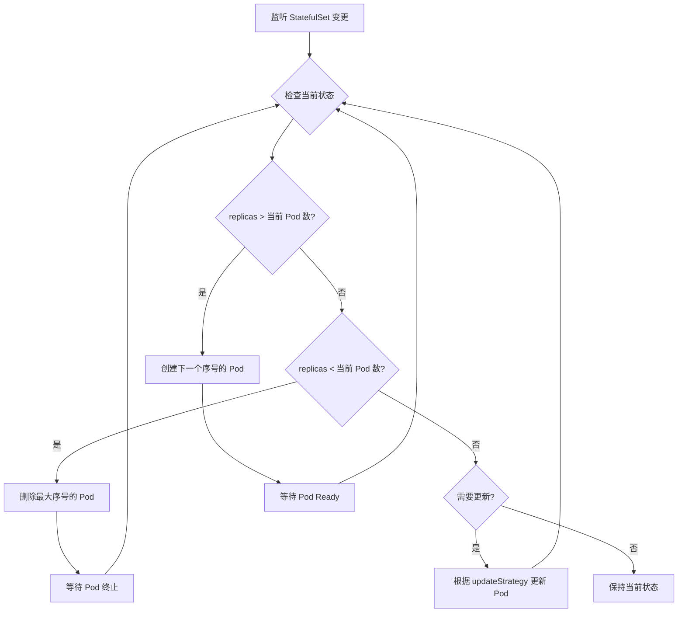

# 05 - StatefulSet YAML 配置参考

> **适用版本**: Kubernetes v1.25 - v1.32 | **最后更新**: 2026-02 | **难度**: 入门 → 专家全覆盖

---

## 📋 目录

- [概述](#概述)
- [API 信息](#api-信息)
- [完整字段规格表](#完整字段规格表)
- [最小配置示例](#最小配置示例)
- [生产级配置示例](#生产级配置示例)
- [高级特性](#高级特性)
- [内部原理](#内部原理)
- [版本兼容性](#版本兼容性)
- [最佳实践](#最佳实践)
- [常见问题 FAQ](#常见问题-faq)
- [生产案例](#生产案例)
- [相关资源](#相关资源)

---

## 概述

StatefulSet 是 Kubernetes 用于管理**有状态应用**的工作负载 API 对象。与 Deployment 不同,StatefulSet 为每个 Pod 提供:

- **稳定的网络标识** - Pod 名称和 DNS 记录不变
- **稳定的持久存储** - PVC 与 Pod 绑定,即使 Pod 重建也保持
- **有序的部署和扩缩容** - Pod 按顺序创建/删除
- **有序的滚动更新** - 支持分区更新和金丝雀发布

**典型应用场景**:
- 数据库集群 (MySQL, PostgreSQL, MongoDB)
- 消息队列 (Kafka, RabbitMQ)
- 分布式存储 (Ceph, Cassandra, Elasticsearch)
- 有状态缓存 (Redis Cluster)

---

## API 信息

```yaml
apiVersion: apps/v1
kind: StatefulSet
```

| 属性 | 值 |
|-----|-----|
| **API Group** | `apps` |
| **API Version** | `v1` (稳定版,自 Kubernetes v1.9) |
| **资源简称** | `sts` |
| **命名空间作用域** | 是 |
| **kubectl 命令** | `kubectl get statefulset`, `kubectl describe sts <name>` |

---

## 完整字段规格表

### 核心字段 (spec)

| 字段路径 | 类型 | 必需 | 默认值 | 说明 | 引入版本 |
|---------|------|------|--------|------|----------|
| `spec.serviceName` | string | ✅ | - | 用于稳定网络标识的 Headless Service 名称 | v1.5 |
| `spec.replicas` | integer | ❌ | 1 | Pod 副本数量 | v1.5 |
| `spec.selector` | object | ✅ | - | Pod 标签选择器 (必须匹配 template.labels) | v1.5 |
| `spec.template` | object | ✅ | - | Pod 模板定义 | v1.5 |
| `spec.volumeClaimTemplates[]` | array | ❌ | [] | PVC 模板数组,为每个 Pod 创建独立 PVC | v1.5 |
| `spec.podManagementPolicy` | string | ❌ | OrderedReady | Pod 管理策略: `OrderedReady` / `Parallel` | v1.7 |
| `spec.updateStrategy.type` | string | ❌ | RollingUpdate | 更新策略: `RollingUpdate` / `OnDelete` | v1.7 |
| `spec.updateStrategy.rollingUpdate.partition` | integer | ❌ | 0 | 分区更新:仅更新序号 >= partition 的 Pod | v1.7 |
| `spec.updateStrategy.rollingUpdate.maxUnavailable` | intstr | ❌ | 1 | 滚动更新时允许的最大不可用 Pod 数 | v1.24 |
| `spec.revisionHistoryLimit` | integer | ❌ | 10 | 保留的历史版本数量 | v1.7 |
| `spec.minReadySeconds` | integer | ❌ | 0 | Pod Ready 后等待的最小秒数 | v1.25 |
| `spec.persistentVolumeClaimRetentionPolicy` | object | ❌ | Retain | PVC 保留策略 (whenDeleted/whenScaled) | v1.27+ |
| `spec.ordinals.start` | integer | ❌ | 0 | Pod 序号起始值 | v1.27+ |

### PVC 保留策略字段 (v1.27+)

| 字段路径 | 可选值 | 说明 |
|---------|--------|------|
| `persistentVolumeClaimRetentionPolicy.whenDeleted` | `Retain` / `Delete` | StatefulSet 删除时的 PVC 处理策略 |
| `persistentVolumeClaimRetentionPolicy.whenScaled` | `Retain` / `Delete` | 缩容时的 PVC 处理策略 |

### volumeClaimTemplates[] 字段

```yaml
volumeClaimTemplates:
  - metadata:
      name: data              # PVC 名称前缀
      labels: {}              # PVC 标签
      annotations: {}         # PVC 注解
    spec:
      accessModes:            # 访问模式: ReadWriteOnce/ReadOnlyMany/ReadWriteMany
        - ReadWriteOnce
      storageClassName: ""    # StorageClass 名称
      resources:
        requests:
          storage: 10Gi       # 存储容量
      selector: {}            # PV 选择器 (可选)
```

---

## 最小配置示例

```yaml
# 最小 StatefulSet 配置 - 用于开发/测试环境
apiVersion: apps/v1
kind: StatefulSet
metadata:
  name: web
  namespace: default
spec:
  # 必需: 指定 Headless Service 名称
  serviceName: "nginx"
  
  # 副本数量
  replicas: 3
  
  # 必需: Pod 选择器
  selector:
    matchLabels:
      app: nginx
  
  # 必需: Pod 模板
  template:
    metadata:
      labels:
        app: nginx
    spec:
      containers:
      - name: nginx
        image: nginx:1.25
        ports:
        - containerPort: 80
          name: web
        
        # 挂载 PVC
        volumeMounts:
        - name: data
          mountPath: /usr/share/nginx/html
  
  # PVC 模板 - 为每个 Pod 创建独立 PVC
  volumeClaimTemplates:
  - metadata:
      name: data
    spec:
      accessModes: [ "ReadWriteOnce" ]
      resources:
        requests:
          storage: 1Gi
---
# 必需: Headless Service (用于稳定网络标识)
apiVersion: v1
kind: Service
metadata:
  name: nginx
  namespace: default
spec:
  clusterIP: None          # Headless Service 关键配置
  selector:
    app: nginx
  ports:
  - port: 80
    name: web
```

**部署结果**:
- Pod 名称: `web-0`, `web-1`, `web-2`
- DNS 记录: `web-0.nginx.default.svc.cluster.local`
- PVC 名称: `data-web-0`, `data-web-1`, `data-web-2`

---

## 生产级配置示例

```yaml
# 生产级 StatefulSet 配置 - MySQL 主从复制集群
apiVersion: apps/v1
kind: StatefulSet
metadata:
  name: mysql
  namespace: production
  labels:
    app: mysql
    tier: database
  annotations:
    # 配置说明文档
    description: "MySQL 5.7 主从复制集群 (1主2从)"
spec:
  # Headless Service 名称
  serviceName: "mysql-headless"
  
  # 副本数量: 1 主 + 2 从
  replicas: 3
  
  # Pod 管理策略: 有序部署 (默认)
  podManagementPolicy: OrderedReady
  
  # 滚动更新策略
  updateStrategy:
    type: RollingUpdate
    rollingUpdate:
      # 分区更新: 仅更新序号 >= 1 的 Pod (保护主库 mysql-0)
      partition: 1
      # v1.24+ 最大不可用 Pod 数
      maxUnavailable: 1
  
  # 最小就绪秒数 (v1.25+)
  minReadySeconds: 10
  
  # 保留历史版本数量
  revisionHistoryLimit: 10
  
  # v1.27+ PVC 保留策略
  persistentVolumeClaimRetentionPolicy:
    # StatefulSet 删除时保留 PVC (避免数据丢失)
    whenDeleted: Retain
    # 缩容时保留 PVC (方便重新扩容)
    whenScaled: Retain
  
  # v1.27+ Pod 序号起始值 (默认 0)
  ordinals:
    start: 0
  
  # Pod 选择器
  selector:
    matchLabels:
      app: mysql
  
  # Pod 模板
  template:
    metadata:
      labels:
        app: mysql
        tier: database
      annotations:
        # Prometheus 监控
        prometheus.io/scrape: "true"
        prometheus.io/port: "9104"
    spec:
      # 服务账号 (用于访问 Kubernetes API)
      serviceAccountName: mysql-sa
      
      # 亲和性配置: Pod 分散到不同节点
      affinity:
        podAntiAffinity:
          preferredDuringSchedulingIgnoredDuringExecution:
          - weight: 100
            podAffinityTerm:
              labelSelector:
                matchLabels:
                  app: mysql
              topologyKey: kubernetes.io/hostname
      
      # 初始化容器: 克隆数据 (从节点使用)
      initContainers:
      - name: init-mysql
        image: mysql:5.7
        command:
        - bash
        - "-c"
        - |
          set -ex
          # 根据 Pod 序号判断角色
          [[ $(hostname) =~ -([0-9]+)$ ]] || exit 1
          ordinal=${BASH_REMATCH[1]}
          echo [mysqld] > /mnt/conf.d/server-id.cnf
          # server-id 必须唯一
          echo server-id=$((100 + $ordinal)) >> /mnt/conf.d/server-id.cnf
          # mysql-0 为主库,其余为从库
          if [[ $ordinal -eq 0 ]]; then
            cp /mnt/config-map/master.cnf /mnt/conf.d/
          else
            cp /mnt/config-map/slave.cnf /mnt/conf.d/
          fi
        volumeMounts:
        - name: conf
          mountPath: /mnt/conf.d
        - name: config-map
          mountPath: /mnt/config-map
      
      - name: clone-mysql
        image: gcr.io/google-samples/xtrabackup:1.0
        command:
        - bash
        - "-c"
        - |
          set -ex
          # 跳过主库的数据克隆
          [[ $(hostname) =~ -([0-9]+)$ ]] || exit 1
          ordinal=${BASH_REMATCH[1]}
          [[ $ordinal -eq 0 ]] && exit 0
          # 从前一个 Pod 克隆数据
          ncat --recv-only mysql-$(($ordinal-1)).mysql-headless 3307 | xbstream -x -C /var/lib/mysql
          xtrabackup --prepare --target-dir=/var/lib/mysql
        volumeMounts:
        - name: data
          mountPath: /var/lib/mysql
        - name: conf
          mountPath: /etc/mysql/conf.d
      
      # 主容器
      containers:
      - name: mysql
        image: mysql:5.7
        env:
        - name: MYSQL_ROOT_PASSWORD
          valueFrom:
            secretKeyRef:
              name: mysql-secret
              key: root-password
        ports:
        - name: mysql
          containerPort: 3306
          protocol: TCP
        
        # 存活探测: 检查 MySQL 进程
        livenessProbe:
          exec:
            command:
            - mysqladmin
            - ping
            - -uroot
            - -p$(MYSQL_ROOT_PASSWORD)
          initialDelaySeconds: 30
          periodSeconds: 10
          timeoutSeconds: 5
          failureThreshold: 3
        
        # 就绪探测: 检查 MySQL 可接受连接
        readinessProbe:
          exec:
            command:
            - mysql
            - -uroot
            - -p$(MYSQL_ROOT_PASSWORD)
            - -e
            - "SELECT 1"
          initialDelaySeconds: 10
          periodSeconds: 5
          timeoutSeconds: 3
          successThreshold: 1
          failureThreshold: 3
        
        # 资源限制
        resources:
          requests:
            cpu: "500m"
            memory: "1Gi"
          limits:
            cpu: "2000m"
            memory: "4Gi"
        
        # 卷挂载
        volumeMounts:
        - name: data
          mountPath: /var/lib/mysql
          subPath: mysql
        - name: conf
          mountPath: /etc/mysql/conf.d
        - name: mysql-initdb
          mountPath: /docker-entrypoint-initdb.d
      
      # Sidecar 容器: 数据备份传输
      - name: xtrabackup
        image: gcr.io/google-samples/xtrabackup:1.0
        ports:
        - name: xtrabackup
          containerPort: 3307
        command:
        - bash
        - "-c"
        - |
          set -ex
          cd /var/lib/mysql
          # 从库启动 binlog 传输服务
          if [[ -f xtrabackup_slave_info ]]; then
            mv xtrabackup_slave_info change_master_to.sql.in
            sed -i "s/MASTER_LOG_FILE/CHANGE MASTER TO MASTER_LOG_FILE/g" change_master_to.sql.in
            rm -f xtrabackup_binlog_info
          elif [[ -f xtrabackup_binlog_info ]]; then
            # 主库初始化
            [[ $(cat xtrabackup_binlog_info) =~ ^(.*?)[[:space:]]+(.*?)$ ]] || exit 1
            echo "CHANGE MASTER TO MASTER_LOG_FILE='${BASH_REMATCH[1]}',\
              MASTER_LOG_POS=${BASH_REMATCH[2]}" > change_master_to.sql.in
          fi
          # 等待 mysqld 就绪
          until mysql -h 127.0.0.1 -uroot -p$MYSQL_ROOT_PASSWORD -e "SELECT 1"; do sleep 1; done
          # 启动 xtrabackup 传输服务
          exec ncat --listen --keep-open --send-only --max-conns=1 3307 -c \
            "xtrabackup --backup --slave-info --stream=xbstream --host=127.0.0.1 --user=root --password=$MYSQL_ROOT_PASSWORD"
        env:
        - name: MYSQL_ROOT_PASSWORD
          valueFrom:
            secretKeyRef:
              name: mysql-secret
              key: root-password
        volumeMounts:
        - name: data
          mountPath: /var/lib/mysql
          subPath: mysql
        - name: conf
          mountPath: /etc/mysql/conf.d
        resources:
          requests:
            cpu: "100m"
            memory: "100Mi"
          limits:
            cpu: "500m"
            memory: "500Mi"
      
      # Sidecar 容器: MySQL Exporter (Prometheus 监控)
      - name: mysqld-exporter
        image: prom/mysqld-exporter:v0.15.0
        ports:
        - name: metrics
          containerPort: 9104
        env:
        - name: DATA_SOURCE_NAME
          value: "root:$(MYSQL_ROOT_PASSWORD)@(localhost:3306)/"
        - name: MYSQL_ROOT_PASSWORD
          valueFrom:
            secretKeyRef:
              name: mysql-secret
              key: root-password
        resources:
          requests:
            cpu: "50m"
            memory: "50Mi"
          limits:
            cpu: "200m"
            memory: "200Mi"
      
      # 卷定义
      volumes:
      - name: conf
        emptyDir: {}
      - name: config-map
        configMap:
          name: mysql-config
      - name: mysql-initdb
        configMap:
          name: mysql-initdb
  
  # PVC 模板 - 为每个 Pod 创建独立的持久卷
  volumeClaimTemplates:
  - metadata:
      name: data
      labels:
        app: mysql
      annotations:
        # 快照策略
        snapshot.storage.kubernetes.io/policy: "daily"
    spec:
      accessModes:
      - ReadWriteOnce
      storageClassName: ssd-storage
      resources:
        requests:
          storage: 100Gi
---
# Headless Service (用于 StatefulSet 稳定网络标识)
apiVersion: v1
kind: Service
metadata:
  name: mysql-headless
  namespace: production
  labels:
    app: mysql
spec:
  clusterIP: None          # Headless Service
  selector:
    app: mysql
  ports:
  - port: 3306
    name: mysql
  - port: 9104
    name: metrics
---
# 客户端服务 (读写分离: 主库)
apiVersion: v1
kind: Service
metadata:
  name: mysql-write
  namespace: production
  labels:
    app: mysql
    service: write
spec:
  type: ClusterIP
  selector:
    app: mysql
    # 通过 StatefulSet Pod 名称选择主库 (mysql-0)
  ports:
  - port: 3306
    name: mysql
  # 使用 statefulset.kubernetes.io/pod-name 标签选择主库
  sessionAffinity: None
---
# 客户端服务 (读写分离: 从库)
apiVersion: v1
kind: Service
metadata:
  name: mysql-read
  namespace: production
  labels:
    app: mysql
    service: read
spec:
  type: ClusterIP
  selector:
    app: mysql
  ports:
  - port: 3306
    name: mysql
  # 排除主库 mysql-0 (需要配合 Endpoint 手动管理或使用 Service Mesh)
```

**配置说明**:
- **有序部署**: mysql-0 → mysql-1 → mysql-2
- **主从复制**: mysql-0 为主库,mysql-1/mysql-2 为从库
- **分区更新**: `partition: 1` 保护主库,仅更新从库
- **PVC 保留**: 删除/缩容时保留数据卷
- **读写分离**: `mysql-write` 指向主库,`mysql-read` 负载均衡到从库

---

## 高级特性

### 1. 有序部署与删除

```yaml
spec:
  podManagementPolicy: OrderedReady  # 默认: 有序部署
  # podManagementPolicy: Parallel    # 并行部署 (v1.7+)
```

**OrderedReady (默认)**:
- **创建**: Pod 按序号顺序创建 (0 → 1 → 2),每个 Pod Ready 后才创建下一个
- **删除**: Pod 按序号逆序删除 (2 → 1 → 0),每个 Pod 终止后才删除下一个
- **适用场景**: 主从复制、有依赖关系的集群

**Parallel (并行)**:
- **创建**: 所有 Pod 并行创建,不等待前序 Pod Ready
- **删除**: 所有 Pod 并行删除
- **适用场景**: 无依赖关系的分片集群 (如 Kafka)

### 2. PVC 保留策略 (v1.27+)

```yaml
spec:
  persistentVolumeClaimRetentionPolicy:
    # StatefulSet 删除时的 PVC 处理
    whenDeleted: Retain   # Retain (保留) / Delete (删除)
    # 缩容时的 PVC 处理
    whenScaled: Retain    # Retain (保留) / Delete (删除)
```

**策略组合**:

| 场景 | whenDeleted | whenScaled | 说明 |
|-----|-------------|------------|------|
| **生产推荐** | Retain | Retain | 最大化数据安全,手动清理 PVC |
| **开发测试** | Delete | Delete | 自动清理,节省存储成本 |
| **混合模式** | Retain | Delete | 删除保留,缩容自动清理 |

**注意事项**:
- 该功能在 v1.27 进入 Beta,v1.32 进入 GA
- 需要启用 Feature Gate: `StatefulSetAutoDeletePVC=true` (v1.27-v1.26)
- PVC 删除时会同时删除对应的 PV (取决于 PV reclaimPolicy)

### 3. 分区更新 (Partitioned Rolling Update)

```yaml
spec:
  updateStrategy:
    type: RollingUpdate
    rollingUpdate:
      partition: 2  # 仅更新序号 >= 2 的 Pod
```

**工作原理**:
- Pod 序号 >= `partition` 的会被更新
- Pod 序号 < `partition` 的保持原版本不变
- 通过逐步减小 partition 值实现金丝雀发布

**金丝雀发布示例**:

```bash
# 初始状态: 3 个 Pod 运行 v1 版本
kubectl get pods -l app=web
# web-0, web-1, web-2 (都是 v1)

# 步骤 1: 更新镜像并设置 partition=2 (仅更新 web-2)
kubectl patch sts web -p '{"spec":{"template":{"spec":{"containers":[{"name":"nginx","image":"nginx:1.26"}]}},"updateStrategy":{"rollingUpdate":{"partition":2}}}}'

# 验证 web-2 运行正常后,继续更新 web-1
kubectl patch sts web -p '{"spec":{"updateStrategy":{"rollingUpdate":{"partition":1}}}}'

# 最后更新 web-0
kubectl patch sts web -p '{"spec":{"updateStrategy":{"rollingUpdate":{"partition":0}}}}'
```

### 4. Pod 序号起始值 (v1.27+)

```yaml
spec:
  ordinals:
    start: 1  # Pod 序号从 1 开始 (默认 0)
  replicas: 3
```

**部署结果**:
- Pod 名称: `web-1`, `web-2`, `web-3` (而非 `web-0`, `web-1`, `web-2`)
- DNS 记录: `web-1.nginx.default.svc.cluster.local`
- PVC 名称: `data-web-1`, `data-web-2`, `data-web-3`

**使用场景**:
- 兼容传统应用 (要求节点 ID 从 1 开始)
- 避免序号 0 的特殊语义 (某些应用中 0 代表禁用)

### 5. 最大不可用 Pod 数 (v1.24+)

```yaml
spec:
  updateStrategy:
    type: RollingUpdate
    rollingUpdate:
      maxUnavailable: 1  # 整数或百分比 (如 "25%")
```

**工作原理**:
- 控制滚动更新时同时不可用的 Pod 数量上限
- 加快更新速度同时保持服务可用性
- 默认值: 1 (逐个更新)

---

## 内部原理

### 1. 稳定网络标识

**Pod 命名规则**:
```
{statefulset-name}-{ordinal}
```

**DNS 记录格式**:
```
{pod-name}.{service-name}.{namespace}.svc.cluster.local
```

**示例**:
```yaml
StatefulSet 名称: mysql
Headless Service: mysql-headless
Namespace: production

Pod 名称:
- mysql-0
- mysql-1
- mysql-2

DNS 记录:
- mysql-0.mysql-headless.production.svc.cluster.local
- mysql-1.mysql-headless.production.svc.cluster.local
- mysql-2.mysql-headless.production.svc.cluster.local
```

**特性**:
- Pod 重建后名称和 DNS 记录保持不变
- 即使 Pod 调度到不同节点,网络标识依然稳定
- 应用可以通过 DNS 发现集群成员

### 2. 有序创建与删除算法

**创建流程 (OrderedReady)**:
```
1. 创建 Pod 0 和 PVC 0
2. 等待 Pod 0 Running 且 Ready
3. 创建 Pod 1 和 PVC 1
4. 等待 Pod 1 Running 且 Ready
5. 创建 Pod 2 和 PVC 2
... 直到达到 replicas 数量
```

**删除流程**:
```
1. 删除 Pod N (序号最大的 Pod)
2. 等待 Pod N 完全终止
3. 删除 Pod N-1
4. 等待 Pod N-1 完全终止
... 直到删除 Pod 0
注意: PVC 不会自动删除 (除非配置 PVC 保留策略)
```

**扩容流程**:
```bash
kubectl scale sts mysql --replicas=5
# 创建 mysql-3 → mysql-4 (有序)
```

**缩容流程**:
```bash
kubectl scale sts mysql --replicas=2
# 删除 mysql-4 → mysql-3 (逆序)
# PVC data-mysql-3, data-mysql-4 保留 (需手动删除)
```

### 3. PVC 绑定与保留

**PVC 命名规则**:
```
{volumeClaimTemplate-name}-{pod-name}
```

**示例**:
```yaml
volumeClaimTemplates:
  - metadata:
      name: data

Pod 名称: mysql-0
PVC 名称: data-mysql-0
```

**PVC 生命周期**:
- **创建**: 与 Pod 同时创建,立即绑定到 PV
- **绑定**: PVC 与 Pod 强绑定,即使 Pod 删除 PVC 也保留
- **重建**: Pod 重建后会重新绑定到原 PVC (数据持久化)
- **删除**: 需要手动删除或配置 PVC 保留策略 (v1.27+)

### 4. StatefulSet Controller 工作流程



---

## 版本兼容性

| 功能特性 | 引入版本 | 稳定版本 | 说明 |
|---------|---------|---------|------|
| **StatefulSet (基础)** | v1.5 (Beta) | v1.9 (GA) | 核心功能: 稳定网络标识、有序部署、PVC 模板 |
| `podManagementPolicy: Parallel` | v1.7 (Beta) | v1.9 (GA) | 并行部署策略 |
| `updateStrategy.rollingUpdate` | v1.7 (Beta) | v1.9 (GA) | 滚动更新和分区更新 |
| `revisionHistoryLimit` | v1.7 (Beta) | v1.9 (GA) | 历史版本保留 |
| `maxUnavailable` | v1.24 (Alpha) | v1.32 (Beta) | 加速滚动更新 |
| `minReadySeconds` | v1.25 (Beta) | v1.29 (GA) | Pod 就绪等待时间 |
| `persistentVolumeClaimRetentionPolicy` | v1.23 (Alpha) | v1.27 (Beta) | PVC 自动删除策略 |
| `ordinals.start` | v1.26 (Alpha) | v1.27 (Beta) | 自定义 Pod 序号起始值 |

**Feature Gates** (按需启用):

| Feature Gate | 默认启用版本 | GA 版本 |
|-------------|-------------|---------|
| `StatefulSetAutoDeletePVC` | v1.27 (Beta) | v1.32 (GA) |
| `MaxUnavailableStatefulSet` | v1.24 (Alpha, 默认关闭) | v1.32 (Beta, 默认启用) |
| `StatefulSetStartOrdinal` | v1.27 (Beta) | 计划 v1.32 (GA) |

---

## 最佳实践

### 1. 网络配置

✅ **必须配置 Headless Service**:
```yaml
apiVersion: v1
kind: Service
metadata:
  name: mysql-headless
spec:
  clusterIP: None  # 必需: Headless Service
  selector:
    app: mysql
```

✅ **分离客户端服务**:
```yaml
# 读写分离: 主库服务
---
apiVersion: v1
kind: Service
metadata:
  name: mysql-write
spec:
  selector:
    app: mysql
    # 通过自定义标签或 Endpoint 选择主库
```

### 2. 存储配置

✅ **使用高性能 StorageClass**:
```yaml
volumeClaimTemplates:
  - spec:
      storageClassName: ssd-storage  # SSD 存储类
      accessModes: [ "ReadWriteOnce" ]
      resources:
        requests:
          storage: 100Gi
```

✅ **配置 PVC 保留策略** (v1.27+):
```yaml
persistentVolumeClaimRetentionPolicy:
  whenDeleted: Retain  # 生产环境推荐
  whenScaled: Retain
```

✅ **定期备份 PVC**:
```yaml
# 使用 VolumeSnapshot 定期备份
apiVersion: snapshot.storage.k8s.io/v1
kind: VolumeSnapshot
metadata:
  name: mysql-0-snapshot
spec:
  volumeSnapshotClassName: csi-snapshot-class
  source:
    persistentVolumeClaimName: data-mysql-0
```

### 3. 更新策略

✅ **生产环境使用分区更新**:
```yaml
updateStrategy:
  type: RollingUpdate
  rollingUpdate:
    partition: 1  # 保护主库 (Pod 0)
```

✅ **金丝雀发布流程**:
```bash
# 1. 更新镜像并设置高 partition (仅更新 1 个 Pod)
kubectl patch sts mysql --type='json' -p='[
  {"op": "replace", "path": "/spec/template/spec/containers/0/image", "value":"mysql:5.7.42"},
  {"op": "replace", "path": "/spec/updateStrategy/rollingUpdate/partition", "value":2}
]'

# 2. 验证 Pod 2 正常运行
kubectl logs mysql-2 -c mysql
kubectl exec mysql-2 -- mysql -uroot -p$PASSWORD -e "SELECT VERSION();"

# 3. 逐步降低 partition (更新更多 Pod)
kubectl patch sts mysql -p '{"spec":{"updateStrategy":{"rollingUpdate":{"partition":1}}}}'
kubectl patch sts mysql -p '{"spec":{"updateStrategy":{"rollingUpdate":{"partition":0}}}}'
```

### 4. 监控与可观测性

✅ **配置健康检查**:
```yaml
livenessProbe:
  exec:
    command: ["mysqladmin", "ping", "-uroot", "-p$(MYSQL_ROOT_PASSWORD)"]
  initialDelaySeconds: 30
  periodSeconds: 10
  timeoutSeconds: 5

readinessProbe:
  exec:
    command: ["mysql", "-uroot", "-p$(MYSQL_ROOT_PASSWORD)", "-e", "SELECT 1"]
  initialDelaySeconds: 10
  periodSeconds: 5
```

✅ **集成 Prometheus 监控**:
```yaml
# 添加 mysqld-exporter sidecar
containers:
- name: mysqld-exporter
  image: prom/mysqld-exporter:v0.15.0
  ports:
  - containerPort: 9104
    name: metrics
```

✅ **记录关键事件**:
```bash
# 监控 StatefulSet 事件
kubectl get events --field-selector involvedObject.name=mysql --sort-by='.lastTimestamp'

# 监控 Pod 状态变化
kubectl get pods -l app=mysql -w
```

### 5. 高可用配置

✅ **配置 Pod 反亲和性**:
```yaml
affinity:
  podAntiAffinity:
    requiredDuringSchedulingIgnoredDuringExecution:
    - labelSelector:
        matchLabels:
          app: mysql
      topologyKey: kubernetes.io/hostname
```

✅ **使用拓扑分布约束** (v1.19+):
```yaml
topologySpreadConstraints:
- maxSkew: 1
  topologyKey: topology.kubernetes.io/zone
  whenUnsatisfiable: DoNotSchedule
  labelSelector:
    matchLabels:
      app: mysql
```

### 6. 安全最佳实践

✅ **使用 Secret 管理密码**:
```yaml
env:
- name: MYSQL_ROOT_PASSWORD
  valueFrom:
    secretKeyRef:
      name: mysql-secret
      key: root-password
```

✅ **配置 Pod Security Standard**:
```yaml
securityContext:
  runAsNonRoot: true
  runAsUser: 999
  fsGroup: 999
  seccompProfile:
    type: RuntimeDefault
```

---

## 常见问题 FAQ

### Q1: StatefulSet 和 Deployment 的区别是什么?

| 特性 | StatefulSet | Deployment |
|-----|-------------|------------|
| **Pod 名称** | 稳定且唯一 (web-0, web-1) | 随机哈希 (web-7d9f8-kx2p9) |
| **DNS 记录** | 每个 Pod 独立 DNS | 无独立 DNS |
| **存储绑定** | PVC 与 Pod 强绑定 | PVC 共享或无状态 |
| **部署顺序** | 有序 (0→1→2) | 并行 |
| **更新策略** | 支持分区更新 | 滚动更新 |
| **使用场景** | 有状态应用 (数据库、消息队列) | 无状态应用 (Web 服务、API) |

### Q2: 如何访问 StatefulSet 中的特定 Pod?

**方法 1: 通过 DNS (推荐)**:
```bash
# 访问 Pod 0
mysql -h mysql-0.mysql-headless.production.svc.cluster.local -uroot -p

# 访问 Pod 1
mysql -h mysql-1.mysql-headless.production.svc.cluster.local -uroot -p
```

**方法 2: 通过 kubectl port-forward**:
```bash
kubectl port-forward mysql-0 3306:3306
mysql -h 127.0.0.1 -P 3306 -uroot -p
```

**方法 3: 创建针对特定 Pod 的 Service**:
```yaml
apiVersion: v1
kind: Service
metadata:
  name: mysql-0-svc
spec:
  selector:
    statefulset.kubernetes.io/pod-name: mysql-0
  ports:
  - port: 3306
```

### Q3: StatefulSet 缩容后 PVC 如何处理?

**v1.26 及之前**:
- PVC 不会自动删除,需要手动清理
- 重新扩容会重新绑定到原 PVC (数据保留)

**v1.27+ 配置 PVC 保留策略**:
```yaml
persistentVolumeClaimRetentionPolicy:
  whenScaled: Delete  # 缩容时自动删除 PVC
```

**手动清理 PVC**:
```bash
# 缩容到 2 个副本
kubectl scale sts mysql --replicas=2

# 手动删除多余的 PVC
kubectl delete pvc data-mysql-2 data-mysql-3
```

### Q4: 如何强制删除卡住的 Pod?

```bash
# 1. 尝试正常删除
kubectl delete pod mysql-2

# 2. 如果 Pod 卡在 Terminating,强制删除
kubectl delete pod mysql-2 --force --grace-period=0

# 3. 如果依然卡住,编辑 Pod 移除 finalizers
kubectl patch pod mysql-2 -p '{"metadata":{"finalizers":null}}'
```

**警告**: 强制删除可能导致数据不一致,仅用于紧急情况。

### Q5: StatefulSet 滚动更新失败如何回滚?

```bash
# 查看历史版本
kubectl rollout history sts mysql

# 回滚到上一个版本
kubectl rollout undo sts mysql

# 回滚到指定版本
kubectl rollout undo sts mysql --to-revision=3

# 查看回滚状态
kubectl rollout status sts mysql
```

### Q6: 如何临时停止 StatefulSet (保留 PVC)?

```bash
# 缩容到 0 副本
kubectl scale sts mysql --replicas=0

# PVC 保留,重新扩容会恢复数据
kubectl scale sts mysql --replicas=3
```

### Q7: StatefulSet Pod 启动顺序依赖如何处理?

**方法 1: 使用 initContainer 等待依赖**:
```yaml
initContainers:
- name: wait-for-master
  image: busybox
  command:
  - sh
  - -c
  - |
    # 从库等待主库就绪
    until nslookup mysql-0.mysql-headless; do
      echo "Waiting for mysql-0..."
      sleep 2
    done
```

**方法 2: 应用层实现重试逻辑**:
```go
// Go 示例: 从库连接主库时重试
func connectToMaster() {
    for i := 0; i < 30; i++ {
        conn, err := sql.Open("mysql", "root:password@tcp(mysql-0.mysql-headless:3306)/")
        if err == nil {
            return conn
        }
        time.Sleep(5 * time.Second)
    }
}
```

---

## 生产案例

### 案例 1: MySQL 主从复制集群

**架构**:
- 1 个主库 (mysql-0) + 2 个从库 (mysql-1, mysql-2)
- 自动主从复制配置
- 读写分离 (写主库,读从库)

**配置要点**:
```yaml
spec:
  replicas: 3
  podManagementPolicy: OrderedReady  # 主库优先启动
  updateStrategy:
    rollingUpdate:
      partition: 1  # 保护主库
  
  template:
    spec:
      initContainers:
      - name: init-mysql
        # 根据序号配置主从角色
        command: ["/scripts/init-mysql.sh"]
      - name: clone-mysql
        # 从库从前序 Pod 克隆数据
        command: ["/scripts/clone-data.sh"]
```

**运维操作**:
```bash
# 手动主从切换 (Failover)
# 1. 将 mysql-1 提升为主库 (应用层操作)
kubectl exec mysql-1 -- mysql -uroot -p$PASSWORD -e "STOP SLAVE; RESET MASTER;"

# 2. 更新应用配置指向新主库
kubectl patch svc mysql-write -p '{"spec":{"selector":{"statefulset.kubernetes.io/pod-name":"mysql-1"}}}'

# 3. 将旧主库降级为从库
kubectl exec mysql-0 -- mysql -uroot -p$PASSWORD -e "CHANGE MASTER TO MASTER_HOST='mysql-1.mysql-headless'..."
```

### 案例 2: Kafka 集群

**架构**:
- 3 节点 Kafka 集群
- ZooKeeper 作为协调服务
- 并行部署 (无依赖关系)

**配置要点**:
```yaml
spec:
  replicas: 3
  serviceName: kafka-headless
  podManagementPolicy: Parallel  # 并行部署加速启动
  
  template:
    spec:
      containers:
      - name: kafka
        env:
        - name: KAFKA_BROKER_ID
          # 从 Pod 名称提取 Broker ID
          valueFrom:
            fieldRef:
              fieldPath: metadata.name
        - name: KAFKA_ADVERTISED_LISTENERS
          value: "PLAINTEXT://$(POD_NAME).kafka-headless.default.svc.cluster.local:9092"
        command:
        - sh
        - -c
        - |
          # 从 Pod 名称提取序号作为 Broker ID
          export BROKER_ID=${HOSTNAME##*-}
          exec kafka-server-start.sh /etc/kafka/server.properties \
            --override broker.id=${BROKER_ID} \
            --override advertised.listeners=${KAFKA_ADVERTISED_LISTENERS}
  
  volumeClaimTemplates:
  - metadata:
      name: data
    spec:
      storageClassName: fast-ssd
      resources:
        requests:
          storage: 500Gi
```

**扩容操作**:
```bash
# Kafka 支持动态扩容
kubectl scale sts kafka --replicas=5

# 触发分区再平衡 (应用层操作)
kafka-reassign-partitions.sh --zookeeper zk:2181 --generate --topics-to-move-json-file topics.json
```

### 案例 3: Elasticsearch 集群

**架构**:
- 3 个 Master 节点 (master-0, master-1, master-2)
- 5 个 Data 节点 (data-0 ~ data-4)
- 分离 Master 和 Data 角色

**配置要点**:
```yaml
# Master StatefulSet
---
apiVersion: apps/v1
kind: StatefulSet
metadata:
  name: es-master
spec:
  replicas: 3
  serviceName: es-master-headless
  template:
    spec:
      containers:
      - name: elasticsearch
        env:
        - name: node.roles
          value: "master"
        - name: cluster.initial_master_nodes
          value: "es-master-0,es-master-1,es-master-2"
        - name: discovery.seed_hosts
          value: "es-master-headless"
  volumeClaimTemplates:
  - metadata:
      name: data
    spec:
      resources:
        requests:
          storage: 50Gi  # Master 节点存储较小
---
# Data StatefulSet
apiVersion: apps/v1
kind: StatefulSet
metadata:
  name: es-data
spec:
  replicas: 5
  serviceName: es-data-headless
  template:
    spec:
      containers:
      - name: elasticsearch
        env:
        - name: node.roles
          value: "data,ingest"
        - name: discovery.seed_hosts
          value: "es-master-headless"
        resources:
          requests:
            memory: "16Gi"
            cpu: "4"
  volumeClaimTemplates:
  - metadata:
      name: data
    spec:
      resources:
        requests:
          storage: 1Ti  # Data 节点存储较大
```

**滚动重启**:
```bash
# 禁用分片分配 (避免数据迁移)
kubectl exec es-master-0 -- curl -X PUT "localhost:9200/_cluster/settings" \
  -H 'Content-Type: application/json' -d'{"transient":{"cluster.routing.allocation.enable":"none"}}'

# 滚动重启 Data 节点
kubectl rollout restart sts es-data

# 恢复分片分配
kubectl exec es-master-0 -- curl -X PUT "localhost:9200/_cluster/settings" \
  -H 'Content-Type: application/json' -d'{"transient":{"cluster.routing.allocation.enable":"all"}}'
```

---

## 相关资源

### 官方文档
- [Kubernetes StatefulSet 文档](https://kubernetes.io/docs/concepts/workloads/controllers/statefulset/)
- [StatefulSet API 参考](https://kubernetes.io/docs/reference/kubernetes-api/workload-resources/stateful-set-v1/)
- [PVC 保留策略 KEP](https://github.com/kubernetes/enhancements/tree/master/keps/sig-apps/1847-autoremove-statefulset-pvcs)

### 相关配置参考
- [02 - Service YAML 配置参考](./02-service-reference.md) - Headless Service 配置
- [03 - PersistentVolume YAML 配置参考](./03-persistentvolume-reference.md) - 存储配置
- [04 - Deployment YAML 配置参考](./04-deployment-reference.md) - 对比无状态工作负载

### 工具与生态
- [Percona Operator](https://github.com/percona/percona-xtradb-cluster-operator) - MySQL 集群自动化
- [Strimzi Kafka Operator](https://strimzi.io/) - Kafka 集群管理
- [Elastic Cloud on Kubernetes](https://www.elastic.co/guide/en/cloud-on-k8s/current/index.html) - Elasticsearch 集群
- [Velero](https://velero.io/) - StatefulSet 备份与恢复

### 最佳实践文章
- [Running MySQL on Kubernetes](https://kubernetes.io/blog/2017/02/mysql-on-kubernetes/)
- [StatefulSet Best Practices](https://cloud.google.com/kubernetes-engine/docs/concepts/statefulset)

---

**贡献者**: Kubernetes 中文社区 | **许可证**: CC-BY-4.0
