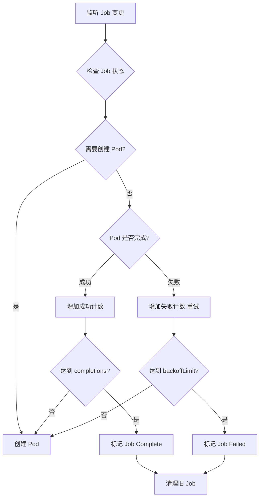
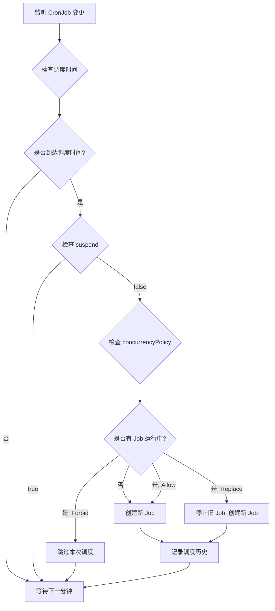

# 07 - Job / CronJob YAML 配置参考

> **适用版本**: Kubernetes v1.25 - v1.32 | **最后更新**: 2026-02 | **难度**: 入门 → 专家全覆盖

---

## 📋 目录

- [概述](#概述)
- [Job API 信息](#job-api-信息)
- [Job 完整字段规格表](#job-完整字段规格表)
- [Job 最小配置示例](#job-最小配置示例)
- [Job 生产级配置示例](#job-生产级配置示例)
- [CronJob API 信息](#cronjob-api-信息)
- [CronJob 完整字段规格表](#cronjob-完整字段规格表)
- [CronJob 最小配置示例](#cronjob-最小配置示例)
- [CronJob 生产级配置示例](#cronjob-生产级配置示例)
- [内部原理](#内部原理)
- [版本兼容性](#版本兼容性)
- [最佳实践](#最佳实践)
- [常见问题 FAQ](#常见问题-faq)
- [生产案例](#生产案例)
- [相关资源](#相关资源)

---

## 概述

### Job - 一次性任务

Job 创建一个或多个 Pod,并确保指定数量的 Pod 成功完成。Pod 成功完成后,Job 跟踪成功的次数。当成功次数达到指定值时,Job 本身完成。

**核心特性**:
- **运行至完成** - Pod 正常退出 (exit 0) 即为成功
- **失败重试** - Pod 失败时自动重启或重建
- **并行执行** - 支持并行运行多个 Pod
- **索引任务** - v1.24+ 支持索引式并行任务

**典型应用场景**:
- 批处理任务 (数据导入、ETL)
- 数据库备份/恢复
- 报表生成
- 一次性脚本执行
- CI/CD 构建任务

### CronJob - 定时任务

CronJob 按照指定的时间计划 (Cron 表达式) 定期创建 Job。相当于 Linux Cron 在 Kubernetes 中的实现。

**核心特性**:
- **定时执行** - 基于 Cron 表达式调度
- **时区支持** - v1.27+ 支持指定时区
- **并发控制** - 控制同时运行的 Job 数量
- **历史限制** - 自动清理旧 Job
- **暂停恢复** - 支持临时暂停调度

**典型应用场景**:
- 定期数据备份
- 定时报表生成
- 日志轮转清理
- 证书自动续期
- 健康检查任务

---

## Job API 信息

```yaml
apiVersion: batch/v1
kind: Job
```

| 属性 | 值 |
|-----|-----|
| **API Group** | `batch` |
| **API Version** | `v1` (稳定版,自 Kubernetes v1.21) |
| **资源简称** | 无 |
| **命名空间作用域** | 是 |
| **kubectl 命令** | `kubectl get job`, `kubectl describe job <name>` |

---

## Job 完整字段规格表

### 核心字段 (spec)

| 字段路径 | 类型 | 必需 | 默认值 | 说明 | 引入版本 |
|---------|------|------|--------|------|----------|
| `spec.template` | object | ✅ | - | Pod 模板定义 (必需) | v1.2 |
| `spec.completions` | integer | ❌ | 1 | 期望成功完成的 Pod 数量 | v1.2 |
| `spec.parallelism` | integer | ❌ | 1 | 并行运行的 Pod 数量上限 | v1.2 |
| `spec.completionMode` | string | ❌ | NonIndexed | 完成模式: `NonIndexed` / `Indexed` | v1.24+ |
| `spec.backoffLimit` | integer | ❌ | 6 | Pod 失败重试次数上限 | v1.2 |
| `spec.backoffLimitPerIndex` | integer | ❌ | - | 每个索引的失败重试次数 (仅 Indexed 模式) | v1.29+ |
| `spec.maxFailedIndexes` | integer | ❌ | - | 允许失败的索引数量上限 (仅 Indexed 模式) | v1.29+ |
| `spec.activeDeadlineSeconds` | integer | ❌ | - | Job 运行时间上限 (超时自动终止) | v1.2 |
| `spec.ttlSecondsAfterFinished` | integer | ❌ | - | Job 完成后的保留时间 (自动清理) | v1.12+ |
| `spec.suspend` | boolean | ❌ | false | 暂停 Job (不创建新 Pod) | v1.21+ |
| `spec.selector` | object | ❌ | 自动生成 | Pod 选择器 (通常自动生成,不需手动设置) | v1.2 |
| `spec.manualSelector` | boolean | ❌ | false | 是否手动管理 selector | v1.2 |
| `spec.podFailurePolicy` | object | ❌ | - | Pod 失败策略 (自定义失败处理) | v1.26+ |
| `spec.successPolicy` | object | ❌ | - | Job 成功策略 (满足条件即完成) | v1.31+ |
| `spec.managedBy` | string | ❌ | - | 外部控制器管理标识 | v1.30+ |
| `spec.podReplacementPolicy` | string | ❌ | TerminatingOrFailed | Pod 替换策略: `TerminatingOrFailed` / `Failed` | v1.29+ |

### completionMode 详细说明

| 模式 | 说明 | 使用场景 |
|-----|------|----------|
| **NonIndexed** (默认) | 非索引模式,Pod 无序号 | 并行任务无需区分身份 |
| **Indexed** (v1.24+) | 索引模式,每个 Pod 有唯一索引 (0 ~ completions-1) | 需要任务分片、Map-Reduce |

### podFailurePolicy 规则 (v1.26+)

```yaml
podFailurePolicy:
  rules:
  - action: FailJob          # 动作: FailJob / Ignore / Count
    onExitCodes:             # 根据退出码判断
      operator: In           # 操作符: In / NotIn
      values: [1, 42]        # 退出码列表
  - action: Ignore
    onPodConditions:         # 根据 Pod Condition 判断
    - type: DisruptionTarget
      status: "True"
```

### successPolicy 规则 (v1.31+)

```yaml
successPolicy:
  rules:
  - succeededIndexes: "0-2,5,7-9"  # 指定索引成功即可
    succeededCount: 5               # 或指定成功数量
```

---

## Job 最小配置示例

```yaml
# 最小 Job 配置 - 单次任务
apiVersion: batch/v1
kind: Job
metadata:
  name: hello-job
  namespace: default
spec:
  # Pod 模板 (必需)
  template:
    spec:
      # 重启策略: Never (失败后重建 Pod) 或 OnFailure (失败后重启容器)
      restartPolicy: Never
      
      containers:
      - name: hello
        image: busybox:1.36
        command:
        - sh
        - -c
        - |
          echo "Hello, Kubernetes Job!"
          echo "Current time: $(date)"
          sleep 10
          echo "Job completed successfully"
```

**执行结果**:
```bash
# 查看 Job 状态
kubectl get job hello-job
# NAME        COMPLETIONS   DURATION   AGE
# hello-job   1/1           15s        20s

# 查看 Pod 日志
kubectl logs job/hello-job
# Hello, Kubernetes Job!
# Current time: Mon Feb 10 10:00:00 UTC 2026
# Job completed successfully
```

---

## Job 生产级配置示例

### 示例 1: 数据库备份任务

```yaml
# 生产级 Job 配置 - PostgreSQL 数据库备份
apiVersion: batch/v1
kind: Job
metadata:
  name: postgres-backup
  namespace: production
  labels:
    app: postgres
    task: backup
  annotations:
    description: "PostgreSQL 数据库定期备份任务"
spec:
  # 期望完成数量: 1 次成功备份
  completions: 1
  
  # 并行度: 仅运行 1 个 Pod (备份任务不适合并行)
  parallelism: 1
  
  # 失败重试次数: 最多重试 3 次
  backoffLimit: 3
  
  # 运行时间上限: 1 小时 (防止备份卡死)
  activeDeadlineSeconds: 3600
  
  # 完成后保留 24 小时 (用于查看日志和调试)
  ttlSecondsAfterFinished: 86400
  
  # Pod 模板
  template:
    metadata:
      labels:
        app: postgres
        task: backup
    spec:
      # 重启策略: OnFailure (失败后重启容器,而非重建 Pod)
      restartPolicy: OnFailure
      
      # 服务账号 (用于访问 S3 存储)
      serviceAccountName: postgres-backup-sa
      
      # 初始化容器: 验证存储可用性
      initContainers:
      - name: check-storage
        image: amazon/aws-cli:2.15.0
        command:
        - sh
        - -c
        - |
          # 检查 S3 存储桶可访问性
          aws s3 ls s3://backup-bucket/ || exit 1
        env:
        - name: AWS_ACCESS_KEY_ID
          valueFrom:
            secretKeyRef:
              name: s3-credentials
              key: access-key-id
        - name: AWS_SECRET_ACCESS_KEY
          valueFrom:
            secretKeyRef:
              name: s3-credentials
              key: secret-access-key
      
      # 主容器
      containers:
      - name: backup
        image: postgres:15-alpine
        command:
        - sh
        - -c
        - |
          set -e
          
          # 生成备份文件名 (带时间戳)
          BACKUP_FILE="postgres-backup-$(date +%Y%m%d-%H%M%S).sql.gz"
          
          echo "开始备份数据库..."
          echo "备份文件: $BACKUP_FILE"
          
          # 执行 pg_dump 备份并压缩
          PGPASSWORD=$POSTGRES_PASSWORD pg_dump \
            -h $POSTGRES_HOST \
            -U $POSTGRES_USER \
            -d $POSTGRES_DB \
            --verbose \
            --format=plain \
            --no-owner \
            --no-privileges \
            | gzip > /tmp/$BACKUP_FILE
          
          # 验证备份文件
          if [ ! -f /tmp/$BACKUP_FILE ]; then
            echo "错误: 备份文件未生成"
            exit 1
          fi
          
          BACKUP_SIZE=$(du -h /tmp/$BACKUP_FILE | cut -f1)
          echo "备份文件大小: $BACKUP_SIZE"
          
          # 上传到 S3
          echo "上传到 S3..."
          aws s3 cp /tmp/$BACKUP_FILE s3://backup-bucket/postgres/$BACKUP_FILE
          
          # 验证上传成功
          aws s3 ls s3://backup-bucket/postgres/$BACKUP_FILE
          
          echo "备份完成: s3://backup-bucket/postgres/$BACKUP_FILE"
          
          # 清理旧备份 (保留最近 30 天)
          echo "清理旧备份..."
          aws s3 ls s3://backup-bucket/postgres/ | \
            awk '{print $4}' | \
            sort -r | \
            tail -n +31 | \
            xargs -I {} aws s3 rm s3://backup-bucket/postgres/{}
          
          echo "备份任务成功完成"
        
        env:
        # 数据库连接信息
        - name: POSTGRES_HOST
          value: "postgres.production.svc.cluster.local"
        - name: POSTGRES_DB
          value: "production_db"
        - name: POSTGRES_USER
          valueFrom:
            secretKeyRef:
              name: postgres-credentials
              key: username
        - name: POSTGRES_PASSWORD
          valueFrom:
            secretKeyRef:
              name: postgres-credentials
              key: password
        # S3 凭证
        - name: AWS_ACCESS_KEY_ID
          valueFrom:
            secretKeyRef:
              name: s3-credentials
              key: access-key-id
        - name: AWS_SECRET_ACCESS_KEY
          valueFrom:
            secretKeyRef:
              name: s3-credentials
              key: secret-access-key
        - name: AWS_DEFAULT_REGION
          value: "us-east-1"
        
        # 资源限制
        resources:
          requests:
            cpu: "500m"
            memory: "1Gi"
          limits:
            cpu: "2000m"
            memory: "4Gi"
        
        # 临时存储 (用于备份文件)
        volumeMounts:
        - name: backup-tmp
          mountPath: /tmp
      
      # 卷定义
      volumes:
      - name: backup-tmp
        emptyDir:
          sizeLimit: 10Gi  # 临时存储上限
```

### 示例 2: 索引式并行任务 (v1.24+)

```yaml
# 索引式并行任务 - 批量数据处理
apiVersion: batch/v1
kind: Job
metadata:
  name: batch-processing
  namespace: data
spec:
  # 完成模式: Indexed (每个 Pod 有唯一索引)
  completionMode: Indexed
  
  # 期望完成数量: 10 个分片
  completions: 10
  
  # 并行度: 最多同时运行 3 个 Pod
  parallelism: 3
  
  # 失败重试: 每个索引最多重试 2 次 (v1.29+)
  backoffLimitPerIndex: 2
  
  # 允许最多 2 个分片失败 (v1.29+)
  maxFailedIndexes: 2
  
  # Pod 模板
  template:
    spec:
      restartPolicy: OnFailure
      
      containers:
      - name: processor
        image: myapp/data-processor:v2.0
        command:
        - sh
        - -c
        - |
          # 获取当前 Pod 的索引 (环境变量 JOB_COMPLETION_INDEX)
          INDEX=${JOB_COMPLETION_INDEX}
          
          echo "处理分片: $INDEX (共 10 个分片)"
          
          # 计算分片范围
          TOTAL_RECORDS=10000
          SHARD_SIZE=$((TOTAL_RECORDS / 10))
          START=$((INDEX * SHARD_SIZE))
          END=$(((INDEX + 1) * SHARD_SIZE))
          
          echo "处理记录范围: $START - $END"
          
          # 执行数据处理 (调用业务逻辑)
          /app/process-data --start=$START --end=$END --shard-id=$INDEX
          
          echo "分片 $INDEX 处理完成"
        
        env:
        # JOB_COMPLETION_INDEX 由 Kubernetes 自动注入
        - name: DATABASE_URL
          valueFrom:
            secretKeyRef:
              name: db-credentials
              key: url
        
        resources:
          requests:
            cpu: "1000m"
            memory: "2Gi"
          limits:
            cpu: "2000m"
            memory: "4Gi"
```

**索引式任务特性**:
- 每个 Pod 通过环境变量 `JOB_COMPLETION_INDEX` 获取索引 (0 ~ 9)
- 适用于 Map-Reduce、数据分片处理
- Pod 名称格式: `{job-name}-{index}-{random-suffix}`

### 示例 3: Pod 失败策略 (v1.26+)

```yaml
# 自定义 Pod 失败处理策略
apiVersion: batch/v1
kind: Job
metadata:
  name: smart-retry-job
spec:
  completions: 5
  parallelism: 2
  backoffLimit: 10
  
  # Pod 失败策略 (v1.26+)
  podFailurePolicy:
    rules:
    # 规则 1: 退出码 1 (配置错误) - 立即失败,不重试
    - action: FailJob
      onExitCodes:
        operator: In
        values: [1]
    
    # 规则 2: 退出码 2 (临时错误) - 忽略,继续重试
    - action: Ignore
      onExitCodes:
        operator: In
        values: [2, 3]
    
    # 规则 3: Pod 被节点中断 (节点维护) - 忽略,不计入失败次数
    - action: Ignore
      onPodConditions:
      - type: DisruptionTarget
        status: "True"
    
    # 规则 4: OOMKilled - 计入失败,继续重试
    - action: Count
      onExitCodes:
        operator: In
        values: [137]  # SIGKILL (OOM)
  
  template:
    spec:
      restartPolicy: Never
      containers:
      - name: app
        image: myapp:v1.0
        command: ["/app/run"]
```

---

## CronJob API 信息

```yaml
apiVersion: batch/v1
kind: CronJob
```

| 属性 | 值 |
|-----|-----|
| **API Group** | `batch` |
| **API Version** | `v1` (稳定版,自 Kubernetes v1.21) |
| **资源简称** | `cj` |
| **命名空间作用域** | 是 |
| **kubectl 命令** | `kubectl get cronjob`, `kubectl describe cj <name>` |

---

## CronJob 完整字段规格表

### 核心字段 (spec)

| 字段路径 | 类型 | 必需 | 默认值 | 说明 | 引入版本 |
|---------|------|------|--------|------|----------|
| `spec.schedule` | string | ✅ | - | Cron 表达式 (必需) | v1.5 |
| `spec.timeZone` | string | ❌ | UTC | 时区 (IANA 时区数据库格式) | v1.27+ |
| `spec.jobTemplate` | object | ✅ | - | Job 模板定义 (必需) | v1.5 |
| `spec.concurrencyPolicy` | string | ❌ | Allow | 并发策略: `Allow` / `Forbid` / `Replace` | v1.5 |
| `spec.startingDeadlineSeconds` | integer | ❌ | - | 允许的启动延迟时间 (秒) | v1.5 |
| `spec.suspend` | boolean | ❌ | false | 暂停调度 (不创建新 Job) | v1.5 |
| `spec.successfulJobsHistoryLimit` | integer | ❌ | 3 | 保留的成功 Job 数量 | v1.5 |
| `spec.failedJobsHistoryLimit` | integer | ❌ | 1 | 保留的失败 Job 数量 | v1.5 |

### schedule - Cron 表达式格式

```
# 标准 Cron 表达式 (5 个字段)
# ┌─────────────── 分钟 (0 - 59)
# │ ┌───────────── 小时 (0 - 23)
# │ │ ┌─────────── 日期 (1 - 31)
# │ │ │ ┌───────── 月份 (1 - 12)
# │ │ │ │ ┌─────── 星期 (0 - 7) (0 和 7 都代表星期日)
# │ │ │ │ │
# * * * * *
```

**常用示例**:

| Cron 表达式 | 说明 |
|-----------|------|
| `0 0 * * *` | 每天午夜 (00:00) |
| `0 */6 * * *` | 每 6 小时 (00:00, 06:00, 12:00, 18:00) |
| `30 2 * * *` | 每天凌晨 2:30 |
| `0 9-17 * * *` | 每天 9:00-17:00 之间每小时 |
| `0 0 * * 0` | 每周日午夜 |
| `0 0 1 * *` | 每月 1 号午夜 |
| `*/15 * * * *` | 每 15 分钟 |
| `0 0 1 1 *` | 每年 1 月 1 日午夜 |

### concurrencyPolicy 详细说明

| 策略 | 说明 | 使用场景 |
|-----|------|----------|
| **Allow** (默认) | 允许并发运行多个 Job | 任务之间无冲突,可并行执行 |
| **Forbid** | 禁止并发,跳过新 Job | 任务互斥,不能同时运行 |
| **Replace** | 停止旧 Job,启动新 Job | 任务可取消,只需最新结果 |

---

## CronJob 最小配置示例

```yaml
# 最小 CronJob 配置 - 定时清理日志
apiVersion: batch/v1
kind: CronJob
metadata:
  name: log-cleanup
  namespace: default
spec:
  # Cron 表达式: 每天凌晨 2:00 执行
  schedule: "0 2 * * *"
  
  # Job 模板 (必需)
  jobTemplate:
    spec:
      template:
        spec:
          restartPolicy: OnFailure
          
          containers:
          - name: cleanup
            image: busybox:1.36
            command:
            - sh
            - -c
            - |
              echo "清理日志: $(date)"
              # 删除 7 天前的日志文件
              find /var/log -name "*.log" -mtime +7 -delete
              echo "清理完成"
            
            volumeMounts:
            - name: varlog
              mountPath: /var/log
          
          volumes:
          - name: varlog
            hostPath:
              path: /var/log
```

---

## CronJob 生产级配置示例

### 示例 1: 数据库定期备份

```yaml
# 生产级 CronJob 配置 - MySQL 每日备份
apiVersion: batch/v1
kind: CronJob
metadata:
  name: mysql-daily-backup
  namespace: production
  labels:
    app: mysql
    task: backup
  annotations:
    description: "MySQL 数据库每日凌晨 3:00 自动备份"
spec:
  # Cron 表达式: 每天凌晨 3:00 (Asia/Shanghai 时区)
  schedule: "0 3 * * *"
  
  # 时区: 中国标准时间 (v1.27+)
  timeZone: "Asia/Shanghai"
  
  # 并发策略: Forbid (禁止并发,防止备份冲突)
  concurrencyPolicy: Forbid
  
  # 允许的启动延迟: 10 分钟 (超过则跳过本次备份)
  startingDeadlineSeconds: 600
  
  # 历史 Job 保留数量
  successfulJobsHistoryLimit: 7   # 保留最近 7 次成功备份
  failedJobsHistoryLimit: 3       # 保留最近 3 次失败记录
  
  # 暂停调度 (用于临时停止备份)
  suspend: false
  
  # Job 模板
  jobTemplate:
    metadata:
      labels:
        app: mysql
        task: backup
    spec:
      # 失败重试次数
      backoffLimit: 2
      
      # 运行时间上限: 2 小时
      activeDeadlineSeconds: 7200
      
      # 完成后保留 7 天
      ttlSecondsAfterFinished: 604800
      
      # Pod 模板
      template:
        metadata:
          labels:
            app: mysql
            task: backup
        spec:
          restartPolicy: OnFailure
          serviceAccountName: mysql-backup-sa
          
          containers:
          - name: backup
            image: mysql:8.0
            command:
            - bash
            - -c
            - |
              set -e
              
              # 生成备份文件名
              TIMESTAMP=$(date +%Y%m%d-%H%M%S)
              BACKUP_FILE="mysql-backup-${TIMESTAMP}.sql.gz"
              
              echo "[$(date)] 开始备份 MySQL 数据库..."
              
              # 执行 mysqldump 备份
              mysqldump \
                -h $MYSQL_HOST \
                -u $MYSQL_USER \
                -p$MYSQL_PASSWORD \
                --all-databases \
                --single-transaction \
                --quick \
                --lock-tables=false \
                --routines \
                --triggers \
                --events \
                | gzip > /backup/$BACKUP_FILE
              
              # 验证备份文件
              if [ ! -f /backup/$BACKUP_FILE ]; then
                echo "[$(date)] 错误: 备份文件未生成"
                exit 1
              fi
              
              BACKUP_SIZE=$(du -h /backup/$BACKUP_FILE | cut -f1)
              echo "[$(date)] 备份文件大小: $BACKUP_SIZE"
              
              # 上传到对象存储
              echo "[$(date)] 上传到 S3..."
              aws s3 cp /backup/$BACKUP_FILE s3://$S3_BUCKET/mysql-backups/
              
              # 验证上传
              aws s3 ls s3://$S3_BUCKET/mysql-backups/$BACKUP_FILE
              
              echo "[$(date)] 备份成功: s3://$S3_BUCKET/mysql-backups/$BACKUP_FILE"
              
              # 清理本地备份文件
              rm -f /backup/$BACKUP_FILE
              
              # 清理 S3 旧备份 (保留 30 天)
              echo "[$(date)] 清理旧备份..."
              CUTOFF_DATE=$(date -d '30 days ago' +%Y%m%d)
              aws s3 ls s3://$S3_BUCKET/mysql-backups/ | \
                awk '{print $4}' | \
                grep -E "mysql-backup-[0-9]{8}" | \
                while read FILE; do
                  FILE_DATE=$(echo $FILE | grep -oP '\d{8}' | head -1)
                  if [ "$FILE_DATE" -lt "$CUTOFF_DATE" ]; then
                    echo "删除旧备份: $FILE"
                    aws s3 rm s3://$S3_BUCKET/mysql-backups/$FILE
                  fi
                done
              
              echo "[$(date)] 备份任务完成"
            
            env:
            - name: MYSQL_HOST
              value: "mysql.production.svc.cluster.local"
            - name: MYSQL_USER
              valueFrom:
                secretKeyRef:
                  name: mysql-credentials
                  key: username
            - name: MYSQL_PASSWORD
              valueFrom:
                secretKeyRef:
                  name: mysql-credentials
                  key: password
            - name: S3_BUCKET
              value: "my-backup-bucket"
            - name: AWS_ACCESS_KEY_ID
              valueFrom:
                secretKeyRef:
                  name: s3-credentials
                  key: access-key-id
            - name: AWS_SECRET_ACCESS_KEY
              valueFrom:
                secretKeyRef:
                  name: s3-credentials
                  key: secret-access-key
            
            resources:
              requests:
                cpu: "500m"
                memory: "1Gi"
              limits:
                cpu: "2000m"
                memory: "4Gi"
            
            volumeMounts:
            - name: backup-tmp
              mountPath: /backup
          
          volumes:
          - name: backup-tmp
            emptyDir:
              sizeLimit: 50Gi
```

### 示例 2: 定时报表生成

```yaml
# 每周一生成周报
apiVersion: batch/v1
kind: CronJob
metadata:
  name: weekly-report
  namespace: analytics
spec:
  # Cron 表达式: 每周一上午 9:00
  schedule: "0 9 * * 1"
  
  # 时区: 美国东部时间
  timeZone: "America/New_York"
  
  # 并发策略: Replace (停止旧任务,启动新任务)
  concurrencyPolicy: Replace
  
  # 允许启动延迟: 1 小时
  startingDeadlineSeconds: 3600
  
  # 保留历史
  successfulJobsHistoryLimit: 10
  failedJobsHistoryLimit: 5
  
  jobTemplate:
    spec:
      backoffLimit: 3
      activeDeadlineSeconds: 1800  # 30 分钟超时
      ttlSecondsAfterFinished: 86400  # 保留 24 小时
      
      template:
        spec:
          restartPolicy: OnFailure
          
          containers:
          - name: report-generator
            image: myapp/report-generator:v2.0
            command:
            - python
            - /app/generate_report.py
            args:
            - --type=weekly
            - --format=pdf
            - --email=team@example.com
            
            env:
            - name: DATABASE_URL
              valueFrom:
                secretKeyRef:
                  name: db-credentials
                  key: url
            - name: SMTP_HOST
              value: "smtp.example.com"
            - name: SMTP_USER
              valueFrom:
                secretKeyRef:
                  name: smtp-credentials
                  key: username
            - name: SMTP_PASSWORD
              valueFrom:
                secretKeyRef:
                  name: smtp-credentials
                  key: password
            
            resources:
              requests:
                cpu: "1000m"
                memory: "2Gi"
              limits:
                cpu: "2000m"
                memory: "4Gi"
```

### 示例 3: 证书自动续期

```yaml
# 每月检查并续期 TLS 证书
apiVersion: batch/v1
kind: CronJob
metadata:
  name: cert-renewal
  namespace: kube-system
spec:
  # Cron 表达式: 每月 1 号凌晨 2:00
  schedule: "0 2 1 * *"
  
  # 并发策略: Forbid (禁止并发)
  concurrencyPolicy: Forbid
  
  # 启动延迟: 6 小时
  startingDeadlineSeconds: 21600
  
  # 保留历史
  successfulJobsHistoryLimit: 12  # 保留一年记录
  failedJobsHistoryLimit: 6
  
  jobTemplate:
    spec:
      backoffLimit: 5
      activeDeadlineSeconds: 600  # 10 分钟超时
      
      template:
        spec:
          restartPolicy: OnFailure
          serviceAccountName: cert-manager
          
          containers:
          - name: cert-renewal
            image: certbot/certbot:v2.9.0
            command:
            - sh
            - -c
            - |
              set -e
              
              echo "[$(date)] 检查证书有效期..."
              
              # 检查证书剩余天数
              EXPIRY=$(openssl x509 -enddate -noout -in /etc/letsencrypt/live/example.com/cert.pem | cut -d= -f2)
              EXPIRY_EPOCH=$(date -d "$EXPIRY" +%s)
              NOW_EPOCH=$(date +%s)
              DAYS_LEFT=$(( ($EXPIRY_EPOCH - $NOW_EPOCH) / 86400 ))
              
              echo "[$(date)] 证书剩余天数: $DAYS_LEFT"
              
              # 剩余天数少于 30 天时续期
              if [ $DAYS_LEFT -lt 30 ]; then
                echo "[$(date)] 证书即将过期,开始续期..."
                certbot renew --force-renewal --quiet
                
                # 更新 Kubernetes Secret
                kubectl create secret tls example-tls \
                  --cert=/etc/letsencrypt/live/example.com/fullchain.pem \
                  --key=/etc/letsencrypt/live/example.com/privkey.pem \
                  --dry-run=client -o yaml | kubectl apply -f -
                
                echo "[$(date)] 证书续期成功"
              else
                echo "[$(date)] 证书仍然有效,无需续期"
              fi
            
            volumeMounts:
            - name: letsencrypt
              mountPath: /etc/letsencrypt
          
          volumes:
          - name: letsencrypt
            persistentVolumeClaim:
              claimName: letsencrypt-pvc
```

---

## 内部原理

### 1. Job Controller 工作流程



**关键行为**:
- **Pod 创建**: 根据 `parallelism` 并行创建 Pod
- **成功判断**: Pod 退出码为 0 (容器正常退出)
- **失败重试**: Pod 失败时根据 `restartPolicy` 重启容器或重建 Pod
- **退避重试**: 失败次数越多,重试间隔越长 (指数退避: 10s, 20s, 40s, ...)
- **完成判断**: 成功 Pod 数量达到 `completions` 时,Job 完成

### 2. CronJob Controller 工作流程



**关键行为**:
- **调度检查**: 每分钟检查一次是否需要创建 Job
- **时间计算**: 根据 `schedule` 和 `timeZone` 计算下次执行时间
- **启动延迟**: 如果错过调度时间且超过 `startingDeadlineSeconds`,跳过本次执行
- **历史清理**: 根据 `successfulJobsHistoryLimit` 和 `failedJobsHistoryLimit` 自动清理旧 Job

### 3. 索引式任务原理 (Indexed Mode)

**NonIndexed 模式** (默认):
- Pod 名称: `{job-name}-{random-suffix}`
- 无序号,适合无状态并行任务

**Indexed 模式** (v1.24+):
- Pod 名称: `{job-name}-{index}-{random-suffix}`
- 环境变量: `JOB_COMPLETION_INDEX=0` (0 ~ completions-1)
- Pod Annotation: `batch.kubernetes.io/job-completion-index: "0"`

**示例**:
```yaml
spec:
  completionMode: Indexed
  completions: 3
  parallelism: 2

# 生成的 Pod:
# my-job-0-abc123  (JOB_COMPLETION_INDEX=0)
# my-job-1-def456  (JOB_COMPLETION_INDEX=1)
# my-job-2-ghi789  (JOB_COMPLETION_INDEX=2)
```

---

## 版本兼容性

### Job 功能演进

| 功能特性 | 引入版本 | 稳定版本 | 说明 |
|---------|---------|---------|------|
| **Job (基础)** | v1.2 (Beta) | v1.8 (GA) | 一次性任务执行 |
| `ttlSecondsAfterFinished` | v1.12 (Alpha) | v1.23 (GA) | 自动清理完成的 Job |
| `suspend` | v1.21 (Beta) | v1.24 (GA) | 暂停 Job |
| `completionMode: Indexed` | v1.21 (Alpha) | v1.24 (Beta) | 索引式并行任务 |
| `podFailurePolicy` | v1.25 (Alpha) | v1.26 (Beta) | 自定义 Pod 失败策略 |
| `backoffLimitPerIndex` | v1.28 (Alpha) | v1.29 (Beta) | 每个索引独立重试计数 |
| `maxFailedIndexes` | v1.28 (Alpha) | v1.29 (Beta) | 允许部分索引失败 |
| `podReplacementPolicy` | v1.28 (Alpha) | v1.29 (Beta) | Pod 替换策略 |
| `managedBy` | v1.30 (Alpha) | v1.32 (Beta) | 外部控制器管理 |
| `successPolicy` | v1.31 (Alpha) | 计划 v1.33 (Beta) | 自定义成功策略 |

### CronJob 功能演进

| 功能特性 | 引入版本 | 稳定版本 | 说明 |
|---------|---------|---------|------|
| **CronJob (基础)** | v1.5 (Alpha) | v1.21 (GA) | 定时任务调度 |
| `concurrencyPolicy` | v1.5 (Alpha) | v1.21 (GA) | 并发控制策略 |
| `suspend` | v1.5 (Alpha) | v1.21 (GA) | 暂停调度 |
| `timeZone` | v1.24 (Alpha) | v1.27 (Beta) | 时区支持 |

**Feature Gates**:

| Feature Gate | 默认启用版本 | GA 版本 |
|-------------|-------------|---------|
| `TTLAfterFinished` | v1.23 (GA) | v1.23 (GA) |
| `SuspendJob` | v1.24 (GA) | v1.24 (GA) |
| `IndexedJob` | v1.24 (Beta) | 计划 v1.33 (GA) |
| `JobPodFailurePolicy` | v1.26 (Beta) | 计划 v1.33 (GA) |
| `CronJobTimeZone` | v1.27 (Beta) | 计划 v1.32 (GA) |
| `JobBackoffLimitPerIndex` | v1.29 (Beta) | 计划 v1.33 (GA) |
| `JobPodReplacementPolicy` | v1.29 (Beta) | 计划 v1.33 (GA) |

---

## 最佳实践

### 1. restartPolicy 选择

| restartPolicy | 行为 | 适用场景 |
|--------------|------|----------|
| **Never** | Pod 失败时重建新 Pod | 长时间运行任务,避免容器重启累积资源 |
| **OnFailure** | Pod 失败时重启容器 | 短时间任务,减少 Pod 重建开销 |

✅ **推荐配置**:
```yaml
# 长时间任务 (> 10 分钟)
restartPolicy: Never

# 短时间任务 (< 10 分钟)
restartPolicy: OnFailure
```

### 2. 资源与超时配置

✅ **设置合理的资源限制和超时时间**:
```yaml
spec:
  # 运行时间上限 (防止任务卡死)
  activeDeadlineSeconds: 3600  # 1 小时
  
  template:
    spec:
      containers:
      - name: task
        resources:
          requests:
            cpu: "500m"
            memory: "1Gi"
          limits:
            cpu: "2000m"
            memory: "4Gi"
```

### 3. 自动清理完成的 Job

✅ **使用 ttlSecondsAfterFinished 自动清理**:
```yaml
spec:
  # 完成后保留 24 小时
  ttlSecondsAfterFinished: 86400
```

✅ **CronJob 控制历史 Job 数量**:
```yaml
spec:
  successfulJobsHistoryLimit: 3  # 保留最近 3 次成功
  failedJobsHistoryLimit: 1      # 保留最近 1 次失败
```

### 4. 失败重试策略

✅ **设置合理的 backoffLimit**:
```yaml
spec:
  # 最多重试 5 次
  backoffLimit: 5
```

✅ **使用 podFailurePolicy 自定义重试** (v1.26+):
```yaml
spec:
  backoffLimit: 10
  podFailurePolicy:
    rules:
    # 配置错误 (退出码 1) - 立即失败
    - action: FailJob
      onExitCodes:
        operator: In
        values: [1]
    # 临时错误 (退出码 2) - 继续重试
    - action: Count
      onExitCodes:
        operator: In
        values: [2]
```

### 5. CronJob 并发控制

✅ **根据任务特性选择 concurrencyPolicy**:

| 任务类型 | 推荐策略 | 说明 |
|---------|---------|------|
| **数据库备份** | Forbid | 禁止并发,防止备份冲突 |
| **日志清理** | Replace | 停止旧任务,启动新任务 |
| **报表生成** | Allow | 允许并发,任务独立 |

```yaml
# 数据库备份 (禁止并发)
spec:
  concurrencyPolicy: Forbid
  startingDeadlineSeconds: 600  # 超时跳过

# 日志清理 (替换旧任务)
spec:
  concurrencyPolicy: Replace

# 报表生成 (允许并发)
spec:
  concurrencyPolicy: Allow
```

### 6. 时区配置 (v1.27+)

✅ **明确指定时区**:
```yaml
spec:
  schedule: "0 3 * * *"  # 凌晨 3:00
  timeZone: "Asia/Shanghai"  # 中国标准时间
```

**常用时区**:
- `UTC` (默认)
- `Asia/Shanghai` (中国标准时间)
- `America/New_York` (美国东部时间)
- `Europe/London` (英国时间)

### 7. 监控与告警

✅ **监控 Job 状态**:
```bash
# 查看 Job 状态
kubectl get job

# 查看 CronJob 调度历史
kubectl get cronjob
kubectl get jobs --selector=cronjob=mysql-backup

# 查看 Job 事件
kubectl describe job my-job

# 查看 Pod 日志
kubectl logs job/my-job
```

✅ **配置 Prometheus 告警**:
```yaml
# Prometheus Alert 规则
groups:
- name: kubernetes-jobs
  rules:
  # Job 失败告警
  - alert: JobFailed
    expr: kube_job_status_failed > 0
    for: 5m
    labels:
      severity: warning
    annotations:
      summary: "Job {{ $labels.job_name }} failed"
  
  # CronJob 错过调度告警
  - alert: CronJobMissedSchedule
    expr: time() - kube_cronjob_next_schedule_time > 300
    for: 5m
    labels:
      severity: warning
    annotations:
      summary: "CronJob {{ $labels.cronjob }} missed schedule"
```

---

## 常见问题 FAQ

### Q1: Job 和 CronJob 的区别?

| 特性 | Job | CronJob |
|-----|-----|---------|
| **执行时机** | 立即执行 (一次性) | 定时执行 (周期性) |
| **调度方式** | 手动创建 | 自动调度 (Cron 表达式) |
| **适用场景** | 临时任务、批处理 | 定期备份、报表生成 |

### Q2: 如何手动触发 CronJob?

```bash
# 方法 1: 从 CronJob 创建 Job (推荐)
kubectl create job my-manual-job --from=cronjob/my-cronjob

# 方法 2: 临时修改 schedule 触发
kubectl patch cronjob my-cronjob -p '{"spec":{"schedule":"*/1 * * * *"}}'  # 改为每分钟
# 等待执行后恢复
kubectl patch cronjob my-cronjob -p '{"spec":{"schedule":"0 3 * * *"}}'  # 恢复原调度
```

### Q3: 如何暂停 CronJob?

```bash
# 方法 1: 修改 suspend 字段
kubectl patch cronjob my-cronjob -p '{"spec":{"suspend":true}}'

# 恢复调度
kubectl patch cronjob my-cronjob -p '{"spec":{"suspend":false}}'

# 方法 2: 编辑 CronJob
kubectl edit cronjob my-cronjob
# 修改 spec.suspend: true
```

### Q4: 为什么 CronJob 没有按时执行?

**可能原因**:

1. **时区问题** (v1.26 及之前):
   - CronJob Controller 使用 UTC 时区
   - 解决: 调整 `schedule` 或升级到 v1.27+ 使用 `timeZone`

2. **错过调度时间**:
   - CronJob Controller 每分钟检查一次
   - 如果错过时间超过 `startingDeadlineSeconds`,跳过本次

3. **并发策略限制**:
   - `concurrencyPolicy: Forbid` 且上次 Job 仍在运行
   - 解决: 调整为 `Replace` 或优化任务执行时间

4. **CronJob Controller 未运行**:
   - 检查 kube-controller-manager
   ```bash
   kubectl get pods -n kube-system -l component=kube-controller-manager
   ```

### Q5: 如何查看 Job 失败原因?

```bash
# 1. 查看 Job 状态
kubectl describe job my-job

# 2. 查看 Pod 日志
kubectl logs job/my-job

# 3. 查看 Pod 状态
kubectl get pods -l job-name=my-job
kubectl describe pod my-job-xxx

# 4. 查看容器退出码
kubectl get pod my-job-xxx -o jsonpath='{.status.containerStatuses[0].state.terminated.exitCode}'
```

### Q6: 如何删除所有完成的 Job?

```bash
# 删除所有成功的 Job
kubectl delete jobs --field-selector status.successful=1

# 删除所有失败的 Job
kubectl delete jobs --field-selector status.failed=1

# 删除所有完成的 Job (成功或失败)
kubectl get jobs -o json | \
  jq -r '.items[] | select(.status.succeeded!=null or .status.failed!=null) | .metadata.name' | \
  xargs kubectl delete job
```

### Q7: 如何在 Job 中共享数据 (多 Pod 协作)?

**方法 1: 使用 PVC 共享存储**:
```yaml
spec:
  parallelism: 3
  template:
    spec:
      containers:
      - name: worker
        volumeMounts:
        - name: shared-data
          mountPath: /data
      volumes:
      - name: shared-data
        persistentVolumeClaim:
          claimName: shared-pvc
```

**方法 2: 使用外部存储 (S3, Redis, 数据库)**:
```yaml
containers:
- name: worker
  env:
  - name: REDIS_URL
    value: "redis://redis.default.svc.cluster.local:6379"
```

### Q8: 索引式任务如何处理失败的分片?

**使用 backoffLimitPerIndex** (v1.29+):
```yaml
spec:
  completionMode: Indexed
  completions: 10
  backoffLimitPerIndex: 2    # 每个分片最多重试 2 次
  maxFailedIndexes: 2        # 允许最多 2 个分片失败
```

**特性**:
- 每个分片独立重试计数
- 部分分片失败不影响其他分片
- 失败分片数量超过 `maxFailedIndexes` 时,整个 Job 失败

---

## 生产案例

### 案例 1: 数据库备份与恢复

**场景**: PostgreSQL 数据库每日自动备份,支持快速恢复

**CronJob 配置**:
```yaml
# 每日备份
apiVersion: batch/v1
kind: CronJob
metadata:
  name: postgres-backup
spec:
  schedule: "0 3 * * *"  # 每天凌晨 3:00
  timeZone: "Asia/Shanghai"
  concurrencyPolicy: Forbid
  successfulJobsHistoryLimit: 7
  failedJobsHistoryLimit: 3
  
  jobTemplate:
    spec:
      backoffLimit: 2
      activeDeadlineSeconds: 7200
      ttlSecondsAfterFinished: 604800
      
      template:
        spec:
          restartPolicy: OnFailure
          containers:
          - name: backup
            image: postgres:15-alpine
            command: ["/scripts/backup.sh"]
            volumeMounts:
            - name: backup-scripts
              mountPath: /scripts
          volumes:
          - name: backup-scripts
            configMap:
              name: backup-scripts
              defaultMode: 0755
```

**恢复任务 (手动触发)**:
```bash
# 创建一次性恢复 Job
kubectl create job postgres-restore-$(date +%s) --from=cronjob/postgres-backup -- /scripts/restore.sh s3://backup-bucket/postgres-backup-20260210.sql.gz
```

### 案例 2: 大规模数据处理 (索引式任务)

**场景**: 处理 100 万条记录,分为 100 个分片并行处理

**Job 配置**:
```yaml
apiVersion: batch/v1
kind: Job
metadata:
  name: data-processing
spec:
  completionMode: Indexed
  completions: 100      # 100 个分片
  parallelism: 10       # 同时运行 10 个 Pod
  backoffLimitPerIndex: 3
  maxFailedIndexes: 5   # 允许最多 5 个分片失败
  
  template:
    spec:
      restartPolicy: OnFailure
      containers:
      - name: processor
        image: myapp/processor:v1.0
        command:
        - python
        - /app/process.py
        args:
        - --shard-id=$(JOB_COMPLETION_INDEX)
        - --total-shards=100
        - --batch-size=10000
        
        env:
        - name: JOB_COMPLETION_INDEX
          valueFrom:
            fieldRef:
              fieldPath: metadata.annotations['batch.kubernetes.io/job-completion-index']
        
        resources:
          requests:
            cpu: "1000m"
            memory: "2Gi"
```

**Python 处理脚本**:
```python
import argparse

def process_shard(shard_id, total_shards, batch_size):
    # 计算分片范围
    total_records = 1000000
    records_per_shard = total_records // total_shards
    start = shard_id * records_per_shard
    end = start + records_per_shard
    
    print(f"处理分片 {shard_id}: 记录 {start} - {end}")
    
    # 批量处理
    for offset in range(start, end, batch_size):
        batch_end = min(offset + batch_size, end)
        process_batch(offset, batch_end)
    
    print(f"分片 {shard_id} 完成")

if __name__ == "__main__":
    parser = argparse.ArgumentParser()
    parser.add_argument("--shard-id", type=int, required=True)
    parser.add_argument("--total-shards", type=int, required=True)
    parser.add_argument("--batch-size", type=int, default=10000)
    args = parser.parse_args()
    
    process_shard(args.shard_id, args.total_shards, args.batch_size)
```

### 案例 3: 定时健康检查与告警

**场景**: 每 5 分钟检查外部服务健康状态,异常时发送告警

**CronJob 配置**:
```yaml
apiVersion: batch/v1
kind: CronJob
metadata:
  name: health-check
spec:
  schedule: "*/5 * * * *"  # 每 5 分钟
  concurrencyPolicy: Forbid
  successfulJobsHistoryLimit: 10
  failedJobsHistoryLimit: 10
  
  jobTemplate:
    spec:
      backoffLimit: 1
      activeDeadlineSeconds: 60
      ttlSecondsAfterFinished: 300
      
      template:
        spec:
          restartPolicy: Never
          containers:
          - name: health-check
            image: curlimages/curl:8.6.0
            command:
            - sh
            - -c
            - |
              set -e
              
              # 检查多个服务
              SERVICES="
                https://api.example.com/health
                https://web.example.com/health
                https://db.example.com/health
              "
              
              FAILED_SERVICES=""
              
              for SERVICE in $SERVICES; do
                echo "检查: $SERVICE"
                
                HTTP_CODE=$(curl -o /dev/null -s -w "%{http_code}" --max-time 10 $SERVICE)
                
                if [ "$HTTP_CODE" != "200" ]; then
                  echo "❌ 失败: $SERVICE (HTTP $HTTP_CODE)"
                  FAILED_SERVICES="$FAILED_SERVICES\n- $SERVICE (HTTP $HTTP_CODE)"
                else
                  echo "✅ 正常: $SERVICE"
                fi
              done
              
              # 发送告警 (如果有服务失败)
              if [ -n "$FAILED_SERVICES" ]; then
                echo "发送告警..."
                curl -X POST https://alerts.example.com/webhook \
                  -H "Content-Type: application/json" \
                  -d "{\"text\":\"健康检查失败:$FAILED_SERVICES\"}"
                exit 1
              fi
              
              echo "所有服务正常"
```

---

## 相关资源

### 官方文档
- [Kubernetes Job 文档](https://kubernetes.io/docs/concepts/workloads/controllers/job/)
- [Kubernetes CronJob 文档](https://kubernetes.io/docs/concepts/workloads/controllers/cron-jobs/)
- [Job API 参考](https://kubernetes.io/docs/reference/kubernetes-api/workload-resources/job-v1/)
- [CronJob API 参考](https://kubernetes.io/docs/reference/kubernetes-api/workload-resources/cron-job-v1/)

### 相关配置参考
- [01 - Pod YAML 配置参考](./01-pod-reference.md) - Pod 模板配置
- [08 - ConfigMap YAML 配置参考](./08-configmap-reference.md) - 任务脚本管理
- [09 - Secret YAML 配置参考](./09-secret-reference.md) - 敏感信息管理

### 工具与生态
- [Argo Workflows](https://argoproj.github.io/argo-workflows/) - 高级工作流引擎
- [Tekton Pipelines](https://tekton.dev/) - CI/CD 流水线
- [Kubeflow](https://www.kubeflow.org/) - 机器学习工作流
- [Velero](https://velero.io/) - 定期备份工具

### 最佳实践文章
- [Job Patterns in Kubernetes](https://kubernetes.io/docs/concepts/workloads/controllers/job/#job-patterns)
- [CronJob Best Practices](https://cloud.google.com/kubernetes-engine/docs/how-to/cronjobs)
- [Cron Expression Generator](https://crontab.guru/) - Cron 表达式在线工具

---

**贡献者**: Kubernetes 中文社区 | **许可证**: CC-BY-4.0
