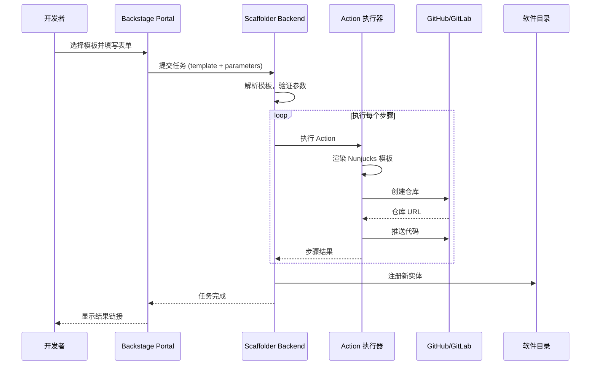
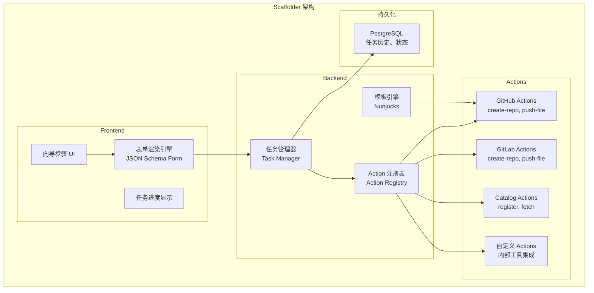

# Backstage 脚手架与模板系统
# Backstage Scaffolder and Template System

> **领域**: 平台工程 | Platform Engineering  
> **难度**: 中级到高级 | Intermediate to Advanced  
> **阅读时间**: 约 70 分钟 | ~70 min read  
> **最后更新**: 2026-03-04

---

## 目录 | Table of Contents

1. [Scaffolder 架构深度解析](#1-scaffolder-架构深度解析)
2. [template.yaml 完整语法指南](#2-templateyaml-完整语法指南)
3. [黄金路径模板库](#3-黄金路径模板库)
4. [内置 Action 完整参考](#4-内置-action-完整参考)
5. [GitHub 集成模板](#5-github-集成模板)
6. [GitLab 集成模板](#6-gitlab-集成模板)
7. [自定义 Action 开发](#7-自定义-action-开发)
8. [工作流自动化](#8-工作流自动化)
9. [模板测试与验证](#9-模板测试与验证)
10. [高级模板模式](#10-高级模板模式)
11. [模板版本管理](#11-模板版本管理)
12. [企业级模板治理](#12-企业级模板治理)

---

## 1. Scaffolder 架构深度解析

### 1.1 Scaffolder 工作原理

Backstage Scaffolder 是一个工作流执行引擎，允许平台团队定义标准化的创建流程（模板），开发者通过填写表单来触发这些流程：



### 1.2 Scaffolder 核心组件



### 1.3 模板执行生命周期

```
模板执行生命周期

1. 模板发现 (Template Discovery)
   └── 从软件目录读取 Template 类型的实体
   └── 提取 spec.parameters 用于表单渲染
   
2. 参数收集 (Parameter Collection)
   └── 渲染 JSON Schema 表单
   └── 实时验证用户输入
   └── 支持多步骤向导
   
3. 任务创建 (Task Creation)
   └── 将 template + parameters 提交为任务
   └── 返回任务 ID
   
4. 任务执行 (Task Execution)
   └── 按顺序执行每个步骤 (step)
   └── 每步执行对应的 Action
   └── 传递步骤间的输出数据
   
5. 错误处理 (Error Handling)
   └── 失败时记录错误信息
   └── 支持重试（不支持回滚，需 Action 实现幂等性）
   
6. 结果输出 (Output)
   └── 展示 output 定义的链接和信息
   └── 可跳转到新创建的仓库、Backstage 实体页面等
```

---

## 2. template.yaml 完整语法指南

### 2.1 模板基础结构

```yaml
# template.yaml 完整结构注解

apiVersion: scaffolder.backstage.io/v1beta3
kind: Template
metadata:
  # 模板唯一标识符（URL 友好格式）
  name: go-microservice-template
  
  # 显示名称（支持中文）
  title: "Go 微服务 - 黄金路径模板"
  
  # 详细描述（Markdown 格式支持）
  description: |
    创建一个符合公司平台标准的 Go 微服务，包含：
    - 标准项目结构和依赖管理
    - CI/CD 流水线配置
    - Kubernetes 部署文件
    - 监控和可观测性配置
    - TechDocs 文档框架
    - catalog-info.yaml
  
  # 标签（用于目录过滤和搜索）
  tags:
    - go
    - microservice
    - golden-path
    - recommended
  
  # 注解
  annotations:
    backstage.io/techdocs-ref: dir:.
  
  # 图标（Material Icons 名称）
  # icons: https://fonts.google.com/icons
  
  # 链接（模板页面上显示）
  links:
    - title: "模板文档"
      url: https://backstage.company.com/docs/default/component/platform-templates
    - title: "示例项目"
      url: https://github.com/company/go-microservice-example

spec:
  # 模板类型（影响在目录中的显示）
  type: service  # service | website | library | infrastructure
  
  # 模板所有者
  owner: group:default/platform-team
  
  ###############################################
  # 参数定义（生成表单）
  ###############################################
  parameters:
    # 参数可以是单个对象（单页表单）
    # 也可以是数组（多步骤向导）
    
    - title: "基础信息"
      required:
        - serviceName
        - description
        - owner
      properties:
        serviceName:
          title: "服务名称"
          description: "小写字母和连字符，例如: order-service"
          type: string
          pattern: "^[a-z][a-z0-9-]*[a-z0-9]$"
          maxLength: 50
          ui:autofocus: true  # 自动获取焦点
          ui:help: "服务名称将用作 GitHub 仓库名、Kubernetes 服务名等"
        
        description:
          title: "服务描述"
          description: "简要描述服务的功能和用途"
          type: string
          maxLength: 500
          ui:widget: textarea  # 使用多行文本框
          ui:options:
            rows: 4
        
        owner:
          title: "服务所有者"
          description: "负责此服务的团队"
          type: string
          ui:field: OwnerPicker  # 使用内置的 Owner 选择器
          ui:options:
            allowedKinds:
              - Group
        
        system:
          title: "所属系统"
          description: "此服务所属的系统"
          type: string
          ui:field: EntityPicker  # 使用实体选择器
          ui:options:
            allowedKinds:
              - System
            defaultKind: System
    
    - title: "技术配置"
      properties:
        goVersion:
          title: "Go 版本"
          description: "使用的 Go 版本"
          type: string
          default: "1.22"
          enum:
            - "1.22"
            - "1.21"
          enumNames:
            - "Go 1.22 (推荐)"
            - "Go 1.21"
        
        databaseType:
          title: "数据库类型"
          description: "服务使用的数据库类型"
          type: string
          default: "none"
          enum:
            - none
            - postgres
            - mysql
            - redis
            - mongodb
          enumNames:
            - "不需要数据库"
            - "PostgreSQL (关系型数据库)"
            - "MySQL (关系型数据库)"
            - "Redis (缓存/KV存储)"
            - "MongoDB (文档数据库)"
        
        # 条件显示：只有选择了数据库才显示此字段
        dbPoolSize:
          title: "数据库连接池大小"
          type: integer
          default: 10
          minimum: 1
          maximum: 100
          # 依赖关系：只有 databaseType 不是 none 时才显示
          ui:widget: hidden  # 通过自定义逻辑控制显示
        
        enableGRPC:
          title: "启用 gRPC"
          description: "是否生成 gRPC 服务代码"
          type: boolean
          default: false
        
        enableMetrics:
          title: "启用 Prometheus 指标"
          type: boolean
          default: true
          ui:widget: radio  # 使用单选按钮
        
        scalingTier:
          title: "扩缩容等级"
          description: "影响默认的副本数和资源配置"
          type: string
          default: "small"
          enum:
            - micro
            - small
            - medium
            - large
          enumNames:
            - "Micro (0.1 CPU, 128Mi, 1 replica)"
            - "Small (0.25 CPU, 256Mi, 2 replicas)"
            - "Medium (0.5 CPU, 512Mi, 3 replicas)"
            - "Large (1 CPU, 1Gi, 5 replicas)"
    
    - title: "GitHub 配置"
      required:
        - repoVisibility
        - defaultBranch
      properties:
        githubOrg:
          title: "GitHub 组织"
          description: "创建仓库的 GitHub 组织"
          type: string
          default: "company"
          enum:
            - "company"
            - "company-internal"
          ui:disabled: true  # 不允许修改
        
        repoVisibility:
          title: "仓库可见性"
          type: string
          default: "private"
          enum:
            - private
            - internal
            - public
          enumNames:
            - "私有（仅内部可见）"
            - "内部（GitHub 组织成员可见）"
            - "公开（谨慎使用）"
        
        defaultBranch:
          title: "默认分支名"
          type: string
          default: "main"
          enum:
            - main
            - master
          ui:widget: hidden  # 隐藏，使用默认值
  
  ###############################################
  # 步骤定义（具体执行的操作）
  ###############################################
  steps:
    # Step 1: 从模板目录拉取文件
    - id: fetch-base
      name: "获取基础模板文件"
      action: fetch:template
      input:
        url: ./skeleton  # 模板文件目录
        values:
          serviceName: ${{ parameters.serviceName }}
          description: ${{ parameters.description }}
          owner: ${{ parameters.owner }}
          system: ${{ parameters.system }}
          goVersion: ${{ parameters.goVersion }}
          databaseType: ${{ parameters.databaseType }}
          enableGRPC: ${{ parameters.enableGRPC }}
          enableMetrics: ${{ parameters.enableMetrics }}
          scalingTier: ${{ parameters.scalingTier }}
          githubOrg: ${{ parameters.githubOrg }}
          # 自动生成的值
          timestamp: "2026-03-04"
    
    # Step 2: 创建 GitHub 仓库
    - id: create-github-repo
      name: "在 GitHub 创建代码仓库"
      action: publish:github
      input:
        allowedHosts: ['github.com']
        description: ${{ parameters.description }}
        repoUrl: "github.com?owner=${{ parameters.githubOrg }}&repo=${{ parameters.serviceName }}"
        repoVisibility: ${{ parameters.repoVisibility }}
        defaultBranch: ${{ parameters.defaultBranch }}
        
        # 保护主分支
        protectDefaultBranch: true
        protectEnforceAdmins: false
        
        # 分支保护规则
        requireCodeOwnerReviews: false
        requiredStatusCheckContexts:
          - "ci/build"
          - "ci/test"
          - "ci/security-scan"
        
        # 仓库设置
        deleteBranchOnMerge: true
        squashMergeAllowed: true
        mergeCommitAllowed: false
        rebaseMergeAllowed: true
        
        # 主题标签
        topics:
          - backstage-enabled
          - ${{ parameters.scalingTier }}-service
    
    # Step 3: 初始化团队权限
    - id: setup-github-team
      name: "设置团队权限"
      action: github:repo:push
      input:
        repoUrl: "github.com?owner=${{ parameters.githubOrg }}&repo=${{ parameters.serviceName }}"
        # 不推送文件，只配置权限（需要自定义 Action）
    
    # Step 4: 注册到软件目录
    - id: register-catalog
      name: "注册到 Backstage 软件目录"
      action: catalog:register
      input:
        repoContentsUrl: ${{ steps['create-github-repo'].output.repoContentsUrl }}
        catalogInfoPath: '/catalog-info.yaml'
    
    # Step 5: 触发初始 CI 流水线
    - id: trigger-initial-ci
      name: "触发初始 CI 流水线"
      action: github:actions:dispatch
      input:
        repoUrl: "github.com?owner=${{ parameters.githubOrg }}&repo=${{ parameters.serviceName }}"
        workflowId: ci.yml
        branchOrTagName: main
    
    # Step 6: 创建 Jira 初始任务
    - id: create-jira-onboarding
      name: "创建 Jira Onboarding 任务"
      action: jira:create-issue
      input:
        projectKey: "PLAT"
        summary: "新服务 ${{ parameters.serviceName }} Onboarding 检查清单"
        description: |
          新服务 *${{ parameters.serviceName }}* 已创建。
          
          请完成以下 Onboarding 步骤：
          * [ ] 配置生产环境密钥 (Vault)
          * [ ] 设置 PagerDuty Oncall
          * [ ] 完成 TechDocs 文档初稿
          * [ ] 完成安全基线评估
          * [ ] 设置生产部署流水线
        issueType: "Task"
        assignee: ${{ parameters.owner }}
  
  ###############################################
  # 输出定义（完成后展示给用户）
  ###############################################
  output:
    links:
      - title: "GitHub 仓库"
        url: ${{ steps['create-github-repo'].output.remoteUrl }}
        icon: github
      
      - title: "Backstage 服务页面"
        url: ${{ steps['register-catalog'].output.entityRef | entityRefToUrl }}
        icon: catalog
      
      - title: "CI/CD 状态"
        url: "${{ steps['create-github-repo'].output.remoteUrl }}/actions"
        icon: link
      
      - title: "Jira 任务"
        url: ${{ steps['create-jira-onboarding'].output.issueUrl }}
        icon: jira
    
    text:
      - title: "下一步操作"
        content: |
          🎉 服务 **${{ parameters.serviceName }}** 创建成功！
          
          **立即开始开发：**
          ```bash
          git clone ${{ steps['create-github-repo'].output.remoteUrl }}
          cd ${{ parameters.serviceName }}
          make setup-dev  # 安装开发依赖
          make run-local  # 启动本地开发环境
          ```
          
          **下一步：**
          1. 完成服务的业务逻辑开发
          2. 在 Vault 配置所需密钥：`vault kv put secret/${{ parameters.serviceName }}/...`
          3. 触发首次部署到 staging 环境
```

### 2.2 JSON Schema 高级用法

```yaml
# 高级表单控件和验证

parameters:
  - title: "高级配置"
    properties:
      
      # 条件显示 (if/then/else)
      deploymentRegions:
        title: "部署区域"
        type: array
        items:
          type: string
          enum:
            - us-east-1
            - us-west-2
            - eu-west-1
            - ap-southeast-1
        uniqueItems: true
        ui:widget: checkboxes
      
      # 复杂对象
      resourceLimits:
        title: "资源配置"
        type: object
        properties:
          cpu:
            title: "CPU 限制"
            type: string
            default: "500m"
          memory:
            title: "内存限制"
            type: string
            default: "512Mi"
        ui:options:
          grid:
            sm: 6
      
      # 使用 Backstage 内置字段选择器
      repoUrl:
        title: "代码仓库地址"
        type: string
        ui:field: RepoUrlPicker
        ui:options:
          allowedHosts:
            - github.com
          allowedOrganizations:
            - company
            - company-internal
      
      # 实体选择器（从目录中选择现有实体）
      existingDatabase:
        title: "使用现有数据库"
        description: "选择现有的数据库资源（可选）"
        type: string
        ui:field: EntityPicker
        ui:options:
          allowedKinds:
            - Resource
          defaultKind: Resource
          catalogFilter:
            - kind: Resource
              spec.type: database
      
      # 自定义字段（需要注册自定义 FieldExtension）
      teamMembers:
        title: "团队成员"
        description: "搜索并选择团队成员"
        type: array
        ui:field: TeamMemberPicker  # 自定义字段
      
      # 密码字段（掩码显示）
      webhookSecret:
        title: "Webhook Secret"
        type: string
        ui:widget: password

  # 使用 if/else 条件逻辑
  - title: "数据库配置"
    # 只有在前一步选择了数据库时才显示这一步
    # （通过模板中的 if 条件控制）
    if: ${{ parameters.databaseType !== 'none' }}
    properties:
      dbSchemaName:
        title: "数据库 Schema 名称"
        type: string
        default: ${{ parameters.serviceName | replace('-', '_') }}
      
      dbMigrationsEnabled:
        title: "启用自动迁移"
        type: boolean
        default: true
```

---

## 3. 黄金路径模板库

### 3.1 模板库目录结构

```
backstage-templates/
├── templates/
│   ├── go-microservice/         # Go 微服务模板
│   │   ├── template.yaml        # 模板定义
│   │   └── skeleton/           # 模板文件骨架
│   │       ├── catalog-info.yaml
│   │       ├── README.md
│   │       ├── Makefile
│   │       ├── go.mod
│   │       ├── main.go
│   │       ├── cmd/
│   │       ├── internal/
│   │       ├── api/
│   │       ├── docs/
│   │       ├── .github/
│   │       │   └── workflows/
│   │       │       ├── ci.yml
│   │       │       └── release.yml
│   │       └── k8s/
│   │           ├── deployment.yaml
│   │           ├── service.yaml
│   │           └── kustomization.yaml
│   │
│   ├── python-fastapi/          # Python FastAPI 模板
│   ├── nodejs-express/          # Node.js Express 模板
│   ├── react-spa/               # React SPA 前端模板
│   ├── data-pipeline/           # 数据管道模板
│   ├── ml-service/              # 机器学习服务模板
│   ├── terraform-module/        # Terraform 模块模板
│   └── kubernetes-operator/     # Kubernetes Operator 模板
│
├── catalog/
│   └── all-templates.yaml       # 所有模板的 Location 入口
│
└── docs/
    └── template-development-guide.md
```

### 3.2 Go 微服务模板骨架

```
go-microservice/skeleton/ 目录结构:

├── ${{ values.serviceName }}/
│   ├── catalog-info.yaml
│   ├── README.md
│   ├── Makefile
│   ├── go.mod
│   ├── go.sum
│   ├── main.go
│   ├── cmd/
│   │   └── server/
│   │       └── main.go
│   ├── internal/
│   │   ├── config/
│   │   │   └── config.go
│   │   ├── handler/
│   │   │   ├── handler.go
│   │   │   └── handler_test.go
│   │   ├── service/
│   │   │   └── service.go
│   │   └── repository/
│   │       └── repository.go
│   ├── api/
│   │   └── openapi.yaml
│   ├── docs/
│   │   ├── mkdocs.yml
│   │   └── docs/
│   │       └── index.md
│   ├── .github/
│   │   └── workflows/
│   │       ├── ci.yml
│   │       └── release.yml
│   └── k8s/
│       ├── base/
│       │   ├── deployment.yaml
│       │   ├── service.yaml
│       │   └── kustomization.yaml
│       └── overlays/
│           ├── staging/
│           └── production/
```

### 3.3 模板骨架文件示例

```yaml
# skeleton/catalog-info.yaml
# 注意: ${{ values.xxx }} 是 Nunjucks 模板语法

apiVersion: backstage.io/v1alpha1
kind: Component
metadata:
  name: ${{ values.serviceName }}
  title: "${{ values.serviceName | title }}"
  description: "${{ values.description }}"
  tags:
    - go
    - ${{ values.scalingTier }}-service
    
    - ${{ values.databaseType }}
    
    
    - grpc
    
  annotations:
    backstage.io/techdocs-ref: dir:.
    github.com/project-slug: "${{ values.githubOrg }}/${{ values.serviceName }}"
  links:
    - url: "https://github.com/${{ values.githubOrg }}/${{ values.serviceName }}"
      title: GitHub 仓库
      icon: github
spec:
  type: service
  lifecycle: experimental  # 新创建的服务从 experimental 开始
  owner: ${{ values.owner }}
  
  system: ${{ values.system }}
  
  
  dependsOn:
    - resource:default/${{ values.serviceName }}-db
  
```

```go
// skeleton/cmd/server/main.go
// Go 微服务主入口模板

package main

import (
    "context"
    "fmt"
    "log/slog"
    "net/http"
    "os"
    "os/signal"
    "syscall"
    "time"

    "github.com/{{ values.githubOrg }}/{{ values.serviceName }}/internal/config"
    "github.com/{{ values.githubOrg }}/{{ values.serviceName }}/internal/handler"
    
    "github.com/prometheus/client_golang/prometheus/promhttp"
    
)

func main() {
    // 加载配置
    cfg, err := config.Load()
    if err != nil {
        slog.Error("failed to load config", "error", err)
        os.Exit(1)
    }

    // 初始化日志
    logLevel := slog.LevelInfo
    if cfg.Debug {
        logLevel = slog.LevelDebug
    }
    slog.SetDefault(slog.New(slog.NewJSONHandler(os.Stdout, &slog.HandlerOptions{
        Level: logLevel,
    })))

    slog.Info("starting {{ values.serviceName }}",
        "version", cfg.Version,
        "port", cfg.Port,
    )

    // 初始化 HTTP 路由
    mux := http.NewServeMux()

    // 注册业务路由
    h := handler.New(cfg)
    h.RegisterRoutes(mux)

    
    // Prometheus 指标端点
    mux.Handle("/metrics", promhttp.Handler())
    

    // 健康检查端点 (Kubernetes Liveness/Readiness Probe)
    mux.HandleFunc("/healthz", func(w http.ResponseWriter, r *http.Request) {
        w.WriteHeader(http.StatusOK)
        fmt.Fprintln(w, `{"status":"ok"}`)
    })

    mux.HandleFunc("/readyz", func(w http.ResponseWriter, r *http.Request) {
        // TODO: 添加依赖健康检查（数据库、外部服务等）
        w.WriteHeader(http.StatusOK)
        fmt.Fprintln(w, `{"status":"ready"}`)
    })

    // 启动 HTTP Server
    srv := &http.Server{
        Addr:         fmt.Sprintf(":%d", cfg.Port),
        Handler:      mux,
        ReadTimeout:  30 * time.Second,
        WriteTimeout: 30 * time.Second,
        IdleTimeout:  120 * time.Second,
    }

    // 优雅关闭
    quit := make(chan os.Signal, 1)
    signal.Notify(quit, syscall.SIGINT, syscall.SIGTERM)

    go func() {
        slog.Info("server started", "addr", srv.Addr)
        if err := srv.ListenAndServe(); err != nil && err != http.ErrServerClosed {
            slog.Error("server error", "error", err)
            os.Exit(1)
        }
    }()

    <-quit
    slog.Info("shutting down server...")

    ctx, cancel := context.WithTimeout(context.Background(), 30*time.Second)
    defer cancel()

    if err := srv.Shutdown(ctx); err != nil {
        slog.Error("server shutdown error", "error", err)
        os.Exit(1)
    }

    slog.Info("server stopped")
}
```

```yaml
# skeleton/.github/workflows/ci.yml
# CI 流水线模板

name: CI

on:
  push:
    branches: [main, develop]
  pull_request:
    branches: [main]

env:
  GO_VERSION: "${{ values.goVersion }}"
  SERVICE_NAME: "${{ values.serviceName }}"
  REGISTRY: registry.company.com

jobs:
  # 代码质量检查
  lint:
    name: 代码规范检查
    runs-on: ubuntu-latest
    steps:
      - uses: actions/checkout@v4
      - uses: actions/setup-go@v5
        with:
          go-version: ${{ env.GO_VERSION }}
      - name: golangci-lint
        uses: golangci/golangci-lint-action@v4
        with:
          version: latest
          args: --timeout 5m

  # 单元测试
  test:
    name: 单元测试
    runs-on: ubuntu-latest
    
    services:
      
      postgres:
        image: postgres:15-alpine
        env:
          POSTGRES_DB: ${{ env.SERVICE_NAME }}_test
          POSTGRES_USER: testuser
          POSTGRES_PASSWORD: testpass
        options: >-
          --health-cmd pg_isready
          --health-interval 10s
          --health-timeout 5s
          --health-retries 5
        ports:
          - 5432:5432
      
    
    steps:
      - uses: actions/checkout@v4
      - uses: actions/setup-go@v5
        with:
          go-version: ${{ env.GO_VERSION }}
          cache: true
      
      - name: 运行测试
        run: |
          go test -v -race -coverprofile=coverage.out ./...
          go tool cover -html=coverage.out -o coverage.html
        env:
          
          DB_HOST: localhost
          DB_PORT: 5432
          DB_USER: testuser
          DB_PASSWORD: testpass
          DB_NAME: ${{ env.SERVICE_NAME }}_test
          
      
      - name: 上传测试覆盖率
        uses: codecov/codecov-action@v4
        with:
          file: ./coverage.out

  # 安全扫描
  security:
    name: 安全扫描
    runs-on: ubuntu-latest
    steps:
      - uses: actions/checkout@v4
      
      - name: 依赖漏洞扫描 (GoSec)
        uses: securego/gosec@master
        with:
          args: ./...
      
      - name: 依赖漏洞扫描 (Nancy)
        run: |
          go list -json -m all | docker run --rm -i sonatypecommunity/nancy:latest sleuth

  # 构建和推送镜像
  build:
    name: 构建 Docker 镜像
    runs-on: ubuntu-latest
    needs: [lint, test, security]
    if: github.ref == 'refs/heads/main' || github.event_name == 'pull_request'
    
    permissions:
      id-token: write
      contents: read
    
    steps:
      - uses: actions/checkout@v4
      
      - name: 配置 AWS 凭证
        uses: aws-actions/configure-aws-credentials@v4
        with:
          role-to-assume: arn:aws:iam::123456789:role/GithubActionsCI
          aws-region: us-east-1
      
      - name: 登录 ECR
        id: ecr-login
        uses: aws-actions/amazon-ecr-login@v2
      
      - name: 设置 Docker Buildx
        uses: docker/setup-buildx-action@v3
      
      - name: 提取元数据
        id: meta
        uses: docker/metadata-action@v5
        with:
          images: ${{ env.REGISTRY }}/${{ env.SERVICE_NAME }}
          tags: |
            type=ref,event=branch
            type=ref,event=pr
            type=semver,pattern={{version}}
            type=sha,prefix=,suffix=,format=short
      
      - name: 构建并推送镜像
        uses: docker/build-push-action@v5
        with:
          context: .
          push: ${{ github.event_name != 'pull_request' }}
          tags: ${{ steps.meta.outputs.tags }}
          labels: ${{ steps.meta.outputs.labels }}
          cache-from: type=gha
          cache-to: type=gha,mode=max
          provenance: true  # 生成 SLSA 来源证明
          sbom: true        # 生成 SBOM
      
      - name: 签名镜像 (Cosign)
        if: github.event_name != 'pull_request'
        run: |
          cosign sign --yes ${{ env.REGISTRY }}/${{ env.SERVICE_NAME }}:${{ github.sha }}
      
      - name: 扫描镜像漏洞
        uses: aquasecurity/trivy-action@master
        with:
          image-ref: ${{ env.REGISTRY }}/${{ env.SERVICE_NAME }}:${{ github.sha }}
          format: 'table'
          exit-code: '1'
          severity: 'CRITICAL,HIGH'
```

---

## 4. 内置 Action 完整参考

### 4.1 文件操作 Actions

```yaml
# fetch:template - 从模板目录拉取文件并渲染变量
- id: fetch-template
  action: fetch:template
  input:
    url: ./skeleton           # 模板路径（相对于 template.yaml）
    targetPath: ./            # 渲染后的输出路径（默认当前目录）
    values:
      name: ${{ parameters.name }}
      # 所有 values 可以在 skeleton 文件中使用 ${{ values.xxx }}
    
    copyWithoutRender:        # 不渲染这些文件（直接复制）
      - "*.png"
      - "*.jpg"
      - ".github/CODEOWNERS"
    
    templateFileExtension: ".njk"  # 默认 .njk 扩展名的文件才渲染

---
# fetch:plain - 直接拷贝文件（不渲染变量）
- id: fetch-plain
  action: fetch:plain
  input:
    url: https://github.com/company/shared-configs/tree/main/eslint
    targetPath: ./config/eslint

---
# fs:rename - 重命名文件/目录
- id: rename-files
  action: fs:rename
  input:
    files:
      - from: ./template-service
        to: ./${{ parameters.serviceName }}
        overwrite: false

---
# fs:delete - 删除文件
- id: delete-files
  action: fs:delete
  input:
    files:
      - ./not-needed-file.txt
      - ./temp-directory/
```

### 4.2 GitHub Actions

```yaml
# publish:github - 创建 GitHub 仓库并推送代码
- id: publish-github
  action: publish:github
  input:
    allowedHosts: ['github.com']
    description: ${{ parameters.description }}
    repoUrl: "github.com?owner=${{ parameters.org }}&repo=${{ parameters.repoName }}"
    
    # 仓库设置
    repoVisibility: private
    defaultBranch: main
    deleteBranchOnMerge: true
    squashMergeAllowed: true
    mergeCommitAllowed: false
    
    # 分支保护
    protectDefaultBranch: true
    protectEnforceAdmins: false
    requiredStatusCheckContexts:
      - "ci/build"
      - "ci/test"
    requireBranchesToBeUpToDate: true
    
    # 团队权限
    # 需要在 GitHub 中预先创建团队
    access: ${{ parameters.teamName }}:push
    
    # 自动初始化仓库（当没有文件时需要）
    gitAuthorName: "Backstage Bot"
    gitAuthorEmail: "backstage@company.com"
    gitCommitMessage: "Initial commit from Backstage template"
    
    # 主题
    topics:
      - backstage-enabled
      - go
  
  # 输出: steps['publish-github'].output.remoteUrl
  # 输出: steps['publish-github'].output.repoContentsUrl

---
# github:actions:dispatch - 触发 GitHub Actions 工作流
- id: trigger-workflow
  action: github:actions:dispatch
  input:
    repoUrl: "github.com?owner=${{ parameters.org }}&repo=${{ parameters.repoName }}"
    workflowId: ci.yml
    branchOrTagName: main
    workflowInputs:
      environment: staging
      version: "1.0.0"

---
# github:repo:create-pull-request - 创建 PR
- id: create-pr
  action: github:repo:create-pull-request
  input:
    repoUrl: "github.com?owner=${{ parameters.org }}&repo=platform-config"
    branchName: "add-${{ parameters.serviceName }}-config"
    title: "Add ${{ parameters.serviceName }} configuration"
    description: |
      This PR adds Kubernetes configuration for the new service ${{ parameters.serviceName }}.
      
      Created by Backstage Scaffolder.
    targetBranchName: main
```

### 4.3 Catalog Actions

```yaml
# catalog:register - 注册实体到目录
- id: register-to-catalog
  action: catalog:register
  input:
    # 从 GitHub 仓库注册
    repoContentsUrl: ${{ steps['publish-github'].output.repoContentsUrl }}
    catalogInfoPath: '/catalog-info.yaml'
    
    # 或者直接指定 URL
    # catalogInfoUrl: https://github.com/org/repo/blob/main/catalog-info.yaml
    
    # 是否可选（不存在时不报错）
    optional: false

---
# catalog:fetch - 从目录获取实体信息（用于后续步骤）
- id: fetch-existing-system
  action: catalog:fetch
  input:
    entityRef: system:default/order-system
  # 输出: steps['fetch-existing-system'].output.entity

---
# catalog:write - 写入目录文件（不注册，只创建文件）
- id: write-catalog-info
  action: catalog:write
  input:
    filePath: catalog-info.yaml
    entity:
      apiVersion: backstage.io/v1alpha1
      kind: Component
      metadata:
        name: ${{ parameters.serviceName }}
      spec:
        type: service
        lifecycle: experimental
        owner: ${{ parameters.owner }}
```

### 4.4 其他内置 Actions

```yaml
# debug:log - 调试日志输出
- id: debug-log
  action: debug:log
  input:
    message: "当前参数: serviceName=${{ parameters.serviceName }}"
    listWorkspace: true  # 列出当前工作目录文件

---
# debug:wait - 等待指定时间（测试用）
- id: wait
  action: debug:wait
  input:
    milliseconds: 5000

---
# http:backstage:request - 调用 Backstage 内部 API
- id: call-internal-api
  action: http:backstage:request
  input:
    method: POST
    path: /api/platform-metrics/deployments
    headers:
      Content-Type: application/json
    body:
      service: ${{ parameters.serviceName }}
      event: scaffold_created
      timestamp: "2026-03-04T10:00:00Z"
```

---

## 5. GitHub 集成模板

### 5.1 完整 GitHub 微服务创建模板

```yaml
# templates/github-service/template.yaml
# 完整的 GitHub 集成服务创建模板

apiVersion: scaffolder.backstage.io/v1beta3
kind: Template
metadata:
  name: github-go-service-v2
  title: "Go 微服务（GitHub 黄金路径）"
  description: "在 GitHub 创建符合公司规范的 Go 微服务"
  tags:
    - go
    - github
    - golden-path
    - recommended

spec:
  type: service
  owner: group:default/platform-team
  
  parameters:
    - title: "服务基础信息"
      required: [serviceName, description, owner]
      properties:
        serviceName:
          title: "服务名称"
          type: string
          pattern: "^[a-z][a-z0-9-]{1,48}[a-z0-9]$"
          description: "小写字母、数字和连字符，2-50 个字符"
        
        description:
          title: "服务描述"
          type: string
          ui:widget: textarea
        
        owner:
          title: "所有者团队"
          type: string
          ui:field: OwnerPicker
          ui:options:
            allowedKinds: [Group]
        
        githubTeamSlug:
          title: "GitHub 团队 Slug"
          type: string
          description: "例如: ecommerce-team（自动赋予写权限）"
    
    - title: "技术选型"
      properties:
        goVersion:
          title: "Go 版本"
          type: string
          default: "1.22"
          enum: ["1.22", "1.21"]
        
        httpFramework:
          title: "HTTP 框架"
          type: string
          default: "stdlib"
          enum:
            - stdlib
            - gin
            - fiber
            - chi
          enumNames:
            - "标准库 net/http（推荐）"
            - "Gin（高性能路由框架）"
            - "Fiber（高性能，Express 风格）"
            - "Chi（轻量级，符合标准库风格）"
        
        databaseType:
          title: "数据库类型"
          type: string
          default: none
          enum: [none, postgres, redis, mongodb]
        
        messageQueue:
          title: "消息队列"
          type: string
          default: none
          enum: [none, kafka, rabbitmq, sqs]
        
        authMethod:
          title: "认证方式"
          type: string
          default: jwt
          enum: [none, jwt, mtls, apikey]
          enumNames:
            - "无认证（内部服务）"
            - "JWT Token（推荐）"
            - "mTLS 证书"
            - "API Key"
  
  steps:
    - id: fetch
      name: 获取模板
      action: fetch:template
      input:
        url: ./skeleton
        values:
          serviceName: ${{ parameters.serviceName }}
          description: ${{ parameters.description }}
          owner: ${{ parameters.owner }}
          goVersion: ${{ parameters.goVersion }}
          httpFramework: ${{ parameters.httpFramework }}
          databaseType: ${{ parameters.databaseType }}
          messageQueue: ${{ parameters.messageQueue }}
          authMethod: ${{ parameters.authMethod }}
    
    - id: publish
      name: 创建 GitHub 仓库
      action: publish:github
      input:
        allowedHosts: ['github.com']
        description: ${{ parameters.description }}
        repoUrl: "github.com?owner=company&repo=${{ parameters.serviceName }}"
        repoVisibility: private
        defaultBranch: main
        protectDefaultBranch: true
        requiredStatusCheckContexts:
          - "lint"
          - "test"
          - "security-scan"
          - "build"
        deleteBranchOnMerge: true
        squashMergeAllowed: true
        mergeCommitAllowed: false
        topics:
          - backstage-enabled
          - go
          - microservice
    
    - id: setup-team-access
      name: 配置团队权限
      if: ${{ parameters.githubTeamSlug }}
      action: github:repo:push  
      # 注意：内置 Action 不支持直接设置团队权限
      # 需要使用自定义 Action（见后文）
    
    - id: register
      name: 注册到软件目录
      action: catalog:register
      input:
        repoContentsUrl: ${{ steps.publish.output.repoContentsUrl }}
        catalogInfoPath: /catalog-info.yaml
    
    - id: create-k8s-namespace
      name: 申请 Kubernetes 命名空间
      action: platform:kubernetes:create-namespace
      input:
        name: "${{ parameters.serviceName }}-staging"
        environment: staging
        team: ${{ parameters.owner }}
        tier: tier-3  # 新服务默认 Tier-3
  
  output:
    links:
      - title: GitHub 仓库
        url: ${{ steps.publish.output.remoteUrl }}
      - title: Backstage 服务页面
        url: ${{ steps.register.output.entityRef | entityRefToUrl }}
    text:
      - title: 下一步
        content: |
          服务已创建！开始开发：
          ```bash
          git clone ${{ steps.publish.output.remoteUrl }}
          cd ${{ parameters.serviceName }}
          go mod tidy
          make run
          ```
```

---

## 6. GitLab 集成模板

### 6.1 GitLab 服务创建模板

```yaml
# GitLab 集成模板

apiVersion: scaffolder.backstage.io/v1beta3
kind: Template
metadata:
  name: gitlab-python-service
  title: "Python FastAPI 服务（GitLab）"
  description: "在 GitLab 创建 Python FastAPI 微服务"
  tags:
    - python
    - fastapi
    - gitlab

spec:
  type: service
  owner: group:default/platform-team
  
  parameters:
    - title: "服务信息"
      required: [serviceName, gitlabGroup]
      properties:
        serviceName:
          title: "服务名称"
          type: string
          pattern: "^[a-z][a-z0-9-]*$"
        
        gitlabGroup:
          title: "GitLab 群组"
          description: "创建仓库的 GitLab 群组路径"
          type: string
          default: "engineering"
          enum:
            - engineering
            - platform
            - data
        
        namespace:
          title: "GitLab 子群组"
          description: "子群组路径（可选）"
          type: string
  
  steps:
    - id: fetch
      name: 获取 Python 服务模板
      action: fetch:template
      input:
        url: ./skeleton-python
        values:
          serviceName: ${{ parameters.serviceName }}
    
    - id: publish-gitlab
      name: 创建 GitLab 仓库
      action: publish:gitlab
      input:
        allowedHosts: ['gitlab.company.com']
        description: ${{ parameters.description }}
        repoUrl: "gitlab.company.com?owner=${{ parameters.gitlabGroup }}&repo=${{ parameters.serviceName }}"
        
        # GitLab 特定配置
        repoVisibility: private
        defaultBranch: main
        
        # CI/CD 设置
        setUserAsOwner: false
        
        # 保护分支
        sourcePath: .
        commitAction: create  # create | update | delete
        
        # 标签
        topics:
          - backstage-enabled
          - python
          - fastapi
    
    - id: register
      name: 注册到软件目录
      action: catalog:register
      input:
        repoContentsUrl: ${{ steps['publish-gitlab'].output.repoContentsUrl }}
        catalogInfoPath: /catalog-info.yaml
  
  output:
    links:
      - title: GitLab 仓库
        url: ${{ steps['publish-gitlab'].output.remoteUrl }}
      - title: Backstage 服务页面
        url: ${{ steps.register.output.entityRef | entityRefToUrl }}
```

---

## 7. 自定义 Action 开发

### 7.1 自定义 Action 基础框架

```typescript
// plugins/scaffolder-backend-module-internal/src/actions/createK8sNamespace.ts
// 自定义 Action: 创建 Kubernetes 命名空间

import {
  createTemplateAction,
} from '@backstage/plugin-scaffolder-node';
import { z } from 'zod';
import { KubeConfig, CoreV1Api } from '@kubernetes/client-node';

// 定义 Action
export const createCreateK8sNamespaceAction = () => {
  return createTemplateAction<{
    name: string;
    environment: string;
    team: string;
    tier: string;
    labels?: Record<string, string>;
  }>({
    // Action ID: 在 template.yaml 中使用这个 ID
    id: 'platform:kubernetes:create-namespace',
    
    description: '在 Kubernetes 集群中创建新命名空间',
    
    // 输入 Schema 验证 (使用 Zod)
    schema: {
      input: z.object({
        name: z.string()
          .min(1)
          .max(63)
          .regex(/^[a-z][a-z0-9-]*[a-z0-9]$/, '命名空间名称格式不正确'),
        environment: z.enum(['dev', 'staging', 'production']),
        team: z.string(),
        tier: z.enum(['tier-1', 'tier-2', 'tier-3']).default('tier-3'),
        labels: z.record(z.string()).optional(),
        annotations: z.record(z.string()).optional(),
        resourceQuotaTier: z.enum(['small', 'medium', 'large']).default('small'),
      }),
      output: z.object({
        namespaceName: z.string(),
        clusterUrl: z.string(),
        status: z.string(),
      }),
    },
    
    // 执行函数
    async handler(ctx) {
      const { 
        name, environment, team, tier,
        labels = {}, annotations = {},
        resourceQuotaTier,
      } = ctx.input;
      
      ctx.logger.info(`Creating Kubernetes namespace: ${name}`);
      
      // 选择目标集群
      const clusterConfig = getClusterConfig(environment);
      
      const kc = new KubeConfig();
      kc.loadFromOptions({
        clusters: [{ name: clusterConfig.name, server: clusterConfig.url }],
        users: [{ name: 'backstage', token: clusterConfig.token }],
        contexts: [{ 
          name: 'default', 
          cluster: clusterConfig.name, 
          user: 'backstage' 
        }],
        currentContext: 'default',
      });
      
      const coreV1 = kc.makeApiClient(CoreV1Api);
      
      // 构建命名空间定义
      const namespace = {
        apiVersion: 'v1',
        kind: 'Namespace',
        metadata: {
          name,
          labels: {
            'kubernetes.io/metadata.name': name,
            'platform.company.com/team': team,
            'platform.company.com/environment': environment,
            'platform.company.com/tier': tier,
            'platform.company.com/managed': 'true',
            ...labels,
          },
          annotations: {
            'platform.company.com/created-by': 'backstage-scaffolder',
            'platform.company.com/created-at': new Date().toISOString(),
            ...annotations,
          },
        },
      };
      
      try {
        // 检查命名空间是否已存在
        try {
          await coreV1.readNamespace({ name });
          ctx.logger.info(`Namespace ${name} already exists, skipping creation`);
        } catch (e: any) {
          if (e.statusCode === 404) {
            // 创建命名空间
            await coreV1.createNamespace({ body: namespace });
            ctx.logger.info(`Namespace ${name} created successfully`);
          } else {
            throw e;
          }
        }
        
        // 等待命名空间就绪
        await waitForNamespaceReady(coreV1, name);
        
        // 应用 ResourceQuota
        await applyResourceQuota(kc, name, resourceQuotaTier, ctx.logger);
        
        // 应用 LimitRange
        await applyLimitRange(kc, name, ctx.logger);
        
        // 应用默认 NetworkPolicy
        await applyDefaultNetworkPolicy(kc, name, ctx.logger);
        
        ctx.logger.info(`Namespace ${name} is ready`);
        
        // 设置输出
        ctx.output('namespaceName', name);
        ctx.output('clusterUrl', clusterConfig.url);
        ctx.output('status', 'ready');
        
      } catch (error) {
        ctx.logger.error(`Failed to create namespace: ${error}`);
        throw error;
      }
    },
  });
};

// 辅助函数
function getClusterConfig(environment: string) {
  const configs: Record<string, {name: string; url: string; token: string}> = {
    dev: {
      name: 'dev-cluster',
      url: process.env.K8S_DEV_URL || '',
      token: process.env.K8S_DEV_TOKEN || '',
    },
    staging: {
      name: 'staging-cluster',
      url: process.env.K8S_STAGING_URL || '',
      token: process.env.K8S_STAGING_TOKEN || '',
    },
    production: {
      name: 'prod-cluster',
      url: process.env.K8S_PROD_URL || '',
      token: process.env.K8S_PROD_TOKEN || '',
    },
  };
  return configs[environment];
}

async function waitForNamespaceReady(
  coreV1: CoreV1Api, 
  name: string, 
  maxWaitMs = 30000
) {
  const start = Date.now();
  while (Date.now() - start < maxWaitMs) {
    const ns = await coreV1.readNamespace({ name });
    if (ns.status?.phase === 'Active') {
      return;
    }
    await new Promise(resolve => setTimeout(resolve, 1000));
  }
  throw new Error(`Namespace ${name} did not become active within ${maxWaitMs}ms`);
}
```

### 7.2 自定义 Action 注册

```typescript
// plugins/scaffolder-backend-module-internal/src/module.ts
// 注册所有自定义 Actions

import { createBackendModule } from '@backstage/backend-plugin-api';
import { scaffolderActionsExtensionPoint } from '@backstage/plugin-scaffolder-node/alpha';

// 导入所有自定义 Action
import { createCreateK8sNamespaceAction } from './actions/createK8sNamespace';
import { createVaultSecretAction } from './actions/createVaultSecret';
import { createJiraIssueAction } from './actions/createJiraIssue';
import { createDatadogMonitorAction } from './actions/createDatadogMonitor';
import { createPagerDutyServiceAction } from './actions/createPagerDutyService';
import { createGithubTeamAccessAction } from './actions/createGithubTeamAccess';
import { createArgocdAppAction } from './actions/createArgocdApp';
import { createSlackChannelAction } from './actions/createSlackChannel';

export const scaffolderModuleInternalActions = createBackendModule({
  pluginId: 'scaffolder',
  moduleId: 'internal-actions',
  register(reg) {
    reg.registerInit({
      deps: {
        scaffolderActions: scaffolderActionsExtensionPoint,
      },
      async init({ scaffolderActions }) {
        scaffolderActions.addActions(
          // 平台基础设施
          createCreateK8sNamespaceAction(),
          createVaultSecretAction(),
          createArgocdAppAction(),
          
          // 外部服务集成
          createJiraIssueAction(),
          createDatadogMonitorAction(),
          createPagerDutyServiceAction(),
          createGithubTeamAccessAction(),
          createSlackChannelAction(),
        );
      },
    });
  },
});
```

### 7.3 Vault 密钥创建 Action

```typescript
// plugins/scaffolder-backend-module-internal/src/actions/createVaultSecret.ts

import { createTemplateAction } from '@backstage/plugin-scaffolder-node';
import { z } from 'zod';
import vault from 'node-vault';

export const createVaultSecretAction = () => {
  return createTemplateAction<{
    path: string;
    data: Record<string, string>;
    mount?: string;
  }>({
    id: 'platform:vault:create-secret',
    description: '在 Vault 中创建初始密钥占位符',
    
    schema: {
      input: z.object({
        path: z.string().describe('Vault 路径，例如: secret/my-service/config'),
        data: z.record(z.string()).describe('密钥键值对（占位值）'),
        mount: z.string().default('secret').describe('Vault KV Mount 点'),
        createPolicy: z.boolean().default(true).describe('是否创建对应的访问策略'),
        policyName: z.string().optional().describe('策略名称（默认使用服务名）'),
      }),
      output: z.object({
        vaultPath: z.string(),
        policyName: z.string().optional(),
        kubernetesAuthRole: z.string().optional(),
      }),
    },
    
    async handler(ctx) {
      const { path, data, mount, createPolicy, policyName } = ctx.input;
      
      ctx.logger.info(`Creating Vault secret at: ${mount}/${path}`);
      
      // 初始化 Vault 客户端
      const vaultClient = vault({
        apiVersion: 'v1',
        endpoint: process.env.VAULT_ADDR,
        token: process.env.VAULT_TOKEN,
      });
      
      // 写入初始密钥（占位值）
      await vaultClient.write(`${mount}/data/${path}`, {
        data: {
          ...data,
          _backstage_created_at: new Date().toISOString(),
          _backstage_created_by: 'scaffolder',
          _note: '请将占位值替换为实际密钥',
        },
      });
      
      ctx.logger.info(`Secret created at ${mount}/data/${path}`);
      
      // 创建 Vault 策略
      if (createPolicy) {
        const serviceName = path.split('/')[0];
        const policy = policyName || `${serviceName}-policy`;
        
        const policyDocument = `
# 允许读取服务密钥
path "${mount}/data/${path}/*" {
  capabilities = ["read", "list"]
}

path "${mount}/metadata/${path}/*" {
  capabilities = ["read", "list"]
}
        `.trim();
        
        await vaultClient.addPolicy({
          name: policy,
          rules: policyDocument,
        });
        
        ctx.logger.info(`Vault policy created: ${policy}`);
        
        // 创建 Kubernetes Auth Role
        const k8sRole = `${serviceName}-role`;
        
        await vaultClient.write(`auth/kubernetes/role/${k8sRole}`, {
          bound_service_account_names: [serviceName],
          bound_service_account_namespaces: [
            `${serviceName}-dev`,
            `${serviceName}-staging`,
            `${serviceName}-production`,
          ],
          policies: [policy],
          ttl: '1h',
        });
        
        ctx.logger.info(`Kubernetes auth role created: ${k8sRole}`);
        
        ctx.output('vaultPath', `${mount}/data/${path}`);
        ctx.output('policyName', policy);
        ctx.output('kubernetesAuthRole', k8sRole);
      } else {
        ctx.output('vaultPath', `${mount}/data/${path}`);
      }
    },
  });
};
```

---

## 8. 工作流自动化

### 8.1 复杂工作流模板

```yaml
# 完整的企业级服务创建工作流
# 包含 K8s 命名空间、Vault 密钥、Datadog 监控、PagerDuty、Slack 频道

apiVersion: scaffolder.backstage.io/v1beta3
kind: Template
metadata:
  name: enterprise-service-complete
  title: "企业级完整服务创建（包含所有平台集成）"
  description: "一键创建包含完整平台集成的服务：代码仓库、CI/CD、K8s、监控、告警、文档"

spec:
  type: service
  owner: group:default/platform-team
  
  parameters:
    - title: "服务信息"
      required: [serviceName, description, owner, teamPagerDuty]
      properties:
        serviceName:
          title: "服务名称"
          type: string
          pattern: "^[a-z][a-z0-9-]+[a-z0-9]$"
        description:
          title: "服务描述"
          type: string
          ui:widget: textarea
        owner:
          title: "所有者团队"
          type: string
          ui:field: OwnerPicker
        serviceTier:
          title: "服务等级"
          type: string
          default: tier-3
          enum: [tier-1, tier-2, tier-3]
          enumNames:
            - "Tier-1 (99.99% SLA, 7x24 Oncall)"
            - "Tier-2 (99.9% SLA, 工作时间 Oncall)"
            - "Tier-3 (99.5% SLA, Best Effort)"
        teamPagerDuty:
          title: "PagerDuty Escalation Policy"
          type: string
          description: "告警升级策略 ID"
  
  steps:
    # 步骤 1: 准备模板文件
    - id: fetch
      name: "[1/8] 准备代码模板"
      action: fetch:template
      input:
        url: ./skeleton-enterprise
        values:
          serviceName: ${{ parameters.serviceName }}
          description: ${{ parameters.description }}
          owner: ${{ parameters.owner }}
          serviceTier: ${{ parameters.serviceTier }}
    
    # 步骤 2: 创建 GitHub 仓库
    - id: create-repo
      name: "[2/8] 创建 GitHub 仓库"
      action: publish:github
      input:
        allowedHosts: ['github.com']
        description: ${{ parameters.description }}
        repoUrl: "github.com?owner=company&repo=${{ parameters.serviceName }}"
        repoVisibility: private
        defaultBranch: main
        protectDefaultBranch: true
        deleteBranchOnMerge: true
        topics: [backstage-enabled, microservice, ${{ parameters.serviceTier }}]
    
    # 步骤 3: 创建 Kubernetes 命名空间
    - id: create-namespaces
      name: "[3/8] 创建 Kubernetes 命名空间"
      action: platform:kubernetes:create-namespace
      input:
        name: ${{ parameters.serviceName }}-staging
        environment: staging
        team: ${{ parameters.owner }}
        tier: ${{ parameters.serviceTier }}
    
    # 步骤 4: 初始化 Vault 密钥
    - id: init-vault
      name: "[4/8] 初始化 Vault 密钥路径"
      action: platform:vault:create-secret
      input:
        path: "apps/${{ parameters.serviceName }}"
        mount: secret
        data:
          database_url: "REPLACE_ME"
          api_key: "REPLACE_ME"
          jwt_secret: "REPLACE_ME"
        createPolicy: true
    
    # 步骤 5: 创建 Datadog 监控
    - id: create-datadog
      name: "[5/8] 创建 Datadog 监控"
      action: platform:datadog:create-monitor
      input:
        serviceName: ${{ parameters.serviceName }}
        tier: ${{ parameters.serviceTier }}
        team: ${{ parameters.owner }}
    
    # 步骤 6: 创建 PagerDuty 服务
    - id: create-pagerduty
      name: "[6/8] 创建 PagerDuty 告警服务"
      if: ${{ parameters.serviceTier === 'tier-1' || parameters.serviceTier === 'tier-2' }}
      action: platform:pagerduty:create-service
      input:
        name: ${{ parameters.serviceName }}
        description: ${{ parameters.description }}
        escalationPolicyId: ${{ parameters.teamPagerDuty }}
    
    # 步骤 7: 创建 Slack 频道
    - id: create-slack-channel
      name: "[7/8] 创建 Slack 告警频道"
      action: platform:slack:create-channel
      input:
        name: "${{ parameters.serviceName }}-alerts"
        description: "${{ parameters.serviceName }} 服务告警频道"
        isPrivate: false
    
    # 步骤 8: 注册到 Backstage 目录
    - id: register
      name: "[8/8] 注册到软件目录"
      action: catalog:register
      input:
        repoContentsUrl: ${{ steps['create-repo'].output.repoContentsUrl }}
        catalogInfoPath: /catalog-info.yaml
  
  output:
    links:
      - title: "🔗 GitHub 仓库"
        url: ${{ steps['create-repo'].output.remoteUrl }}
      - title: "📚 Backstage 服务页面"
        url: ${{ steps.register.output.entityRef | entityRefToUrl }}
      - title: "🔐 Vault 密钥"
        url: "https://vault.company.com/ui/vault/secrets/secret/show/apps/${{ parameters.serviceName }}"
      - title: "📊 Datadog 仪表板"
        url: "https://app.datadoghq.com/services/${{ parameters.serviceName }}"
    text:
      - title: "🎉 服务创建完成！"
        content: |
          **${{ parameters.serviceName }}** 已成功创建并完成所有平台集成！
          
          **已完成的集成：**
          - ✅ GitHub 仓库（含 CI/CD 配置）
          - ✅ Kubernetes 命名空间（staging）
          - ✅ Vault 密钥路径（需要填入实际值）
          - ✅ Datadog 监控（${{ parameters.serviceTier }} 配置）
          - ✅ PagerDuty 告警服务
          - ✅ Slack 告警频道 #${{ parameters.serviceName }}-alerts
          - ✅ Backstage 软件目录注册
          
          **⚠️ 需要手动完成：**
          1. 在 Vault 填入实际密钥值
          2. 配置生产环境部署
          3. 完善 TechDocs 文档
```

---

## 9. 模板测试与验证

### 9.1 模板单元测试

```typescript
// plugins/scaffolder-backend-module-internal/src/actions/createK8sNamespace.test.ts

import { createCreateK8sNamespaceAction } from './createK8sNamespace';
import { createMockActionContext } from '@backstage/plugin-scaffolder-node/testUtils';

jest.mock('@kubernetes/client-node');

describe('platform:kubernetes:create-namespace', () => {
  const action = createCreateK8sNamespaceAction();
  
  it('should create namespace with correct labels', async () => {
    const ctx = createMockActionContext({
      input: {
        name: 'my-service-staging',
        environment: 'staging',
        team: 'group:default/my-team',
        tier: 'tier-3',
      },
    });
    
    await action.handler(ctx);
    
    // 验证输出
    expect(ctx.output).toHaveBeenCalledWith('namespaceName', 'my-service-staging');
    expect(ctx.output).toHaveBeenCalledWith('status', 'ready');
    
    // 验证 K8s API 调用
    expect(mockCreateNamespace).toHaveBeenCalledWith(
      expect.objectContaining({
        body: expect.objectContaining({
          metadata: expect.objectContaining({
            name: 'my-service-staging',
            labels: expect.objectContaining({
              'platform.company.com/team': 'group:default/my-team',
              'platform.company.com/environment': 'staging',
              'platform.company.com/tier': 'tier-3',
            }),
          }),
        }),
      })
    );
  });
  
  it('should skip creation if namespace already exists', async () => {
    // 模拟命名空间已存在
    mockReadNamespace.mockResolvedValueOnce({
      status: { phase: 'Active' }
    });
    
    const ctx = createMockActionContext({
      input: {
        name: 'existing-namespace',
        environment: 'staging',
        team: 'my-team',
        tier: 'tier-3',
      },
    });
    
    await action.handler(ctx);
    
    // 不应该调用创建 API
    expect(mockCreateNamespace).not.toHaveBeenCalled();
    // 应该输出成功状态
    expect(ctx.output).toHaveBeenCalledWith('status', 'ready');
  });
  
  it('should validate input - invalid namespace name', async () => {
    const ctx = createMockActionContext({
      input: {
        name: 'Invalid_Namespace',  // 包含大写和下划线
        environment: 'staging',
        team: 'my-team',
        tier: 'tier-3',
      },
    });
    
    await expect(action.handler(ctx)).rejects.toThrow();
  });
});
```

### 9.2 模板集成测试

```typescript
// 模板集成测试

import { createRouter } from '@backstage/plugin-scaffolder-backend';
import { ScaffolderEntitiesProcessor } from '@backstage/plugin-catalog-backend';
import { DatabaseTaskStore } from '@backstage/plugin-scaffolder-backend';
import request from 'supertest';

describe('Go Microservice Template Integration Test', () => {
  let app: express.Express;
  
  beforeAll(async () => {
    app = await createTestApp();
  });
  
  it('should execute template and create all resources', async () => {
    // 1. 获取模板列表
    const templates = await request(app)
      .get('/api/scaffolder/v2/templates')
      .expect(200);
    
    const goTemplate = templates.body.find(
      (t: any) => t.metadata.name === 'go-microservice-template'
    );
    expect(goTemplate).toBeDefined();
    
    // 2. 提交任务
    const taskResponse = await request(app)
      .post('/api/scaffolder/v2/tasks')
      .send({
        templateRef: 'template:default/go-microservice-template',
        values: {
          serviceName: 'test-integration-service',
          description: 'Integration test service',
          owner: 'group:default/platform-team',
          goVersion: '1.22',
          databaseType: 'none',
          enableGRPC: false,
          enableMetrics: true,
          scalingTier: 'small',
          githubOrg: 'company',
          repoVisibility: 'private',
        },
      })
      .expect(201);
    
    const taskId = taskResponse.body.id;
    
    // 3. 等待任务完成
    let taskStatus;
    const maxWait = 60000; // 60 秒
    const start = Date.now();
    
    while (Date.now() - start < maxWait) {
      const statusResponse = await request(app)
        .get(`/api/scaffolder/v2/tasks/${taskId}`)
        .expect(200);
      
      taskStatus = statusResponse.body.status;
      
      if (taskStatus === 'completed' || taskStatus === 'failed') {
        break;
      }
      
      await new Promise(resolve => setTimeout(resolve, 2000));
    }
    
    // 4. 验证任务完成
    expect(taskStatus).toBe('completed');
    
    // 5. 验证 GitHub 仓库已创建（Mock 验证）
    expect(mockGitHubCreateRepo).toHaveBeenCalledWith(
      expect.objectContaining({
        name: 'test-integration-service',
        org: 'company',
        private: true,
      })
    );
    
    // 6. 验证目录已注册
    const entityResponse = await request(app)
      .get('/api/catalog/entities/by-ref/component:default/test-integration-service')
      .expect(200);
    
    expect(entityResponse.body.metadata.name).toBe('test-integration-service');
  });
});
```

---

## 10. 高级模板模式

### 10.1 条件步骤执行

```yaml
# 使用 if 条件控制步骤执行

steps:
  # 只有启用 gRPC 时才生成 proto 文件
  - id: fetch-grpc-templates
    name: "获取 gRPC 模板文件"
    if: ${{ parameters.enableGRPC === true }}
    action: fetch:plain
    input:
      url: ./grpc-skeleton
      targetPath: ./api/proto

  # 不同数据库使用不同模板
  - id: fetch-postgres-config
    name: "获取 PostgreSQL 配置"
    if: ${{ parameters.databaseType === 'postgres' }}
    action: fetch:template
    input:
      url: ./database-configs/postgres
      values:
        serviceName: ${{ parameters.serviceName }}
  
  - id: fetch-redis-config
    name: "获取 Redis 配置"
    if: ${{ parameters.databaseType === 'redis' }}
    action: fetch:template
    input:
      url: ./database-configs/redis
      values:
        serviceName: ${{ parameters.serviceName }}
  
  # Tier-1 服务需要额外的高可用配置
  - id: setup-ha-config
    name: "配置高可用参数"
    if: ${{ parameters.serviceTier === 'tier-1' }}
    action: fetch:template
    input:
      url: ./ha-config-skeleton
      values:
        serviceName: ${{ parameters.serviceName }}
        minReplicas: 5
        maxReplicas: 50
```

### 10.2 步骤间数据传递

```yaml
# 步骤间的输出引用

steps:
  - id: create-repo
    name: "创建仓库"
    action: publish:github
    input:
      repoUrl: "github.com?owner=company&repo=${{ parameters.serviceName }}"
  
  # 在下一步中使用上一步的输出
  - id: setup-environments
    name: "配置环境"
    action: platform:argocd:create-app
    input:
      # 使用 create-repo 步骤的输出
      repoUrl: ${{ steps['create-repo'].output.remoteUrl }}
      repoId: ${{ steps['create-repo'].output.repoId }}
      # output.repoContentsUrl 格式: https://github.com/org/repo/tree/main
      branch: ${{ steps['create-repo'].output.remoteUrl | split('tree/') | last }}
  
  - id: register
    name: "注册到目录"
    action: catalog:register
    input:
      repoContentsUrl: ${{ steps['create-repo'].output.repoContentsUrl }}
      catalogInfoPath: /catalog-info.yaml
  
  - id: create-jira
    name: "创建 Jira 任务"
    action: jira:create-issue
    input:
      projectKey: PLAT
      summary: "新服务 ${{ parameters.serviceName }} Onboarding"
      description: |
        服务已创建。
        
        - 仓库: ${{ steps['create-repo'].output.remoteUrl }}
        - Backstage: ${{ steps.register.output.entityRef }}
```

### 10.3 Nunjucks 模板高级用法

```yaml
# skeleton/catalog-info.yaml 中的高级 Nunjucks 用法

metadata:
  name: ${{ values.serviceName }}
  
  # 字符串操作
  title: "${{ values.serviceName | replace('-', ' ') | title }}"
  
  # 条件表达式
  description: |
    ${{ values.description }}
    
    使用 ${{ values.databaseType }} 作为持久化存储。
    
  
  tags:
    - go
    
    - grpc
    
    
    - ${{ values.databaseType }}
    
    
    - ${{ tag }}
    
  
  annotations:
    backstage.io/techdocs-ref: dir:.
    # 使用 if 决定注解值
    platform.company.com/tier: >-
      ${{ 'tier-1' if values.scalingTier === 'large' else 
          'tier-2' if values.scalingTier === 'medium' else 'tier-3' }}

spec:
  type: service
  lifecycle: experimental
  owner: ${{ values.owner }}
  
  system: ${{ values.system }}
  
  
  
  dependsOn:
    - resource:default/${{ values.serviceName }}-${{ values.databaseType }}-db
  
  
  
  providesApis:
    
    - api:default/${{ api }}
    
  
```

---

## 11. 模板版本管理

### 11.1 模板版本化策略

```yaml
# 模板版本化目录结构

templates/
├── go-microservice/
│   ├── v1/                    # 旧版本（维护中，将于 2026-09 废弃）
│   │   ├── template.yaml
│   │   └── skeleton/
│   ├── v2/                    # 当前推荐版本
│   │   ├── template.yaml
│   │   └── skeleton/
│   └── v3-beta/               # 下一个版本（Beta 测试）
│       ├── template.yaml
│       └── skeleton/

---
# v1 模板标记为废弃
apiVersion: scaffolder.backstage.io/v1beta3
kind: Template
metadata:
  name: go-microservice-v1
  title: "Go 微服务 v1（已废弃）"
  description: |
    ⚠️ **此模板已废弃，将于 2026-09-01 移除**
    
    请使用新版本模板: [go-microservice-v2](/create/templates/default/go-microservice-v2)
    
    迁移指南: https://wiki.company.com/platform/templates/v1-to-v2-migration
  tags:
    - go
    - deprecated
  annotations:
    platform.company.com/deprecated: "true"
    platform.company.com/deprecation-date: "2026-09-01"
    platform.company.com/replacement: "template:default/go-microservice-v2"
spec:
  type: service
  owner: group:default/platform-team
  # ... 模板内容
```

### 11.2 模板变更日志维护

```markdown
# 模板变更日志
# templates/go-microservice/CHANGELOG.md

## v2.3.0 (2026-03-04)

### 新增
- 支持 Go 1.22
- 添加 SBOM 生成到 CI 流水线
- 新增 OpenTelemetry 自动注入配置

### 修复
- 修复 Dockerfile 安全漏洞（升级基础镜像到 alpine:3.19）
- 修复 K8s 资源配额计算错误

### 变更
- 升级 golangci-lint 到 v1.56
- 默认 CPU request 从 100m 调整为 250m（更准确的资源估算）

---

## v2.2.0 (2026-01-15)

### 新增
- 添加 GitHub Dependabot 配置
- 新增 Cosign 镜像签名步骤

### 变更
- Kubernetes 部署使用 topology spread constraints

---

## v2.1.0 (2025-11-20)

### 新增
- 支持 Redis 作为缓存层
- 添加数据库连接池配置示例

### 弃用
- `dbPoolSize` 参数已弃用，使用 `database.pool.maxConnections` 代替
```

---

## 12. 企业级模板治理

### 12.1 模板审核流程

```yaml
# 新模板提交审核流程

template_review_process:
  
  submission:
    channel: "GitHub PR to backstage-templates repo"
    template: "PR 模板（checklist）"
    required_reviewers:
      - "platform-team 至少 2 人 approve"
      - "security-team 审核安全相关配置"
  
  review_checklist:
    code_quality:
      - "[ ] 模板符合 YAML 格式规范"
      - "[ ] 所有变量都有明确的描述"
      - "[ ] 必填字段都标记了 required"
      - "[ ] 正则验证合理（不过于严格或宽松）"
    
    security:
      - "[ ] 没有在模板中硬编码密钥"
      - "[ ] CI/CD 配置包含安全扫描"
      - "[ ] K8s 配置有合适的 SecurityContext"
      - "[ ] 容器镜像使用了签名验证"
    
    platform_standards:
      - "[ ] 生成的 catalog-info.yaml 包含所有必要字段"
      - "[ ] 包含 TechDocs 文档框架"
      - "[ ] CI/CD 流水线包含测试步骤"
      - "[ ] 生成的服务符合平台资源配额要求"
    
    usability:
      - "[ ] 在测试环境中端到端测试通过"
      - "[ ] 非平台工程师可以独立完成（<30分钟）"
      - "[ ] 错误信息清晰可操作"
      - "[ ] 输出包含用户需要的所有链接"
  
  approval:
    auto_merge_conditions:
      - "all_reviews_approved"
      - "ci_checks_passed"
      - "no_security_findings"
    
    deployment:
      - "合并后自动部署到开发环境"
      - "24 小时验证后部署到生产 Backstage"
      - "发送变更通知到 #platform-updates"
```

### 12.2 模板使用度量与改进

```typescript
// 模板使用度量收集

export interface TemplateUsageMetrics {
  templateId: string;
  templateVersion: string;
  usageCount: number;
  successRate: number;
  averageDurationMs: number;
  commonFailureReasons: string[];
  userSatisfactionScore?: number;
}

async function collectTemplateMetrics(
  taskStore: DatabaseTaskStore,
  period: { start: Date; end: Date },
): Promise<TemplateUsageMetrics[]> {
  const tasks = await taskStore.listTasks({
    createdAfter: period.start,
    createdBefore: period.end,
  });
  
  const templateGroups = tasks.reduce((acc, task) => {
    const templateId = task.spec.templateInfo?.entityRef || 'unknown';
    if (!acc[templateId]) {
      acc[templateId] = [];
    }
    acc[templateId].push(task);
    return acc;
  }, {} as Record<string, any[]>);
  
  return Object.entries(templateGroups).map(([templateId, templateTasks]) => {
    const completed = templateTasks.filter(t => t.status === 'completed');
    const failed = templateTasks.filter(t => t.status === 'failed');
    
    const durations = completed
      .map(t => new Date(t.lastHeartbeatAt).getTime() - new Date(t.createdAt).getTime())
      .filter(d => d > 0);
    
    return {
      templateId,
      templateVersion: 'latest',
      usageCount: templateTasks.length,
      successRate: completed.length / templateTasks.length,
      averageDurationMs: durations.length > 0
        ? durations.reduce((a, b) => a + b, 0) / durations.length
        : 0,
      commonFailureReasons: extractFailureReasons(failed),
    };
  });
}
```

### 12.3 模板自动化测试 CI

```yaml
# .github/workflows/test-templates.yml
# 模板自动化测试

name: Template Tests

on:
  pull_request:
    paths:
      - 'templates/**'
  push:
    branches: [main]

jobs:
  validate-templates:
    name: 验证模板 YAML 格式
    runs-on: ubuntu-latest
    steps:
      - uses: actions/checkout@v4
      
      - name: 安装工具
        run: npm install -g @backstage/cli
      
      - name: 验证所有模板格式
        run: |
          for template_dir in templates/*/; do
            echo "验证 $template_dir..."
            if [ -f "$template_dir/template.yaml" ]; then
              # 验证 YAML 格式
              python3 -c "
import yaml, sys
with open('$template_dir/template.yaml') as f:
    data = yaml.safe_load(f)
    
# 基础字段检查
assert data.get('apiVersion') == 'scaffolder.backstage.io/v1beta3', 'apiVersion 错误'
assert data.get('kind') == 'Template', 'kind 必须是 Template'
assert data['metadata'].get('name'), '缺少 metadata.name'
assert data['metadata'].get('title'), '缺少 metadata.title'
assert data['metadata'].get('description'), '缺少 metadata.description'
assert data['spec'].get('owner'), '缺少 spec.owner'
assert data['spec'].get('parameters'), '缺少 spec.parameters'
assert data['spec'].get('steps'), '缺少 spec.steps'
print(f'✅ $template_dir 格式验证通过')
              "
            fi
          done
  
  dry-run-templates:
    name: 模板空跑测试
    runs-on: ubuntu-latest
    needs: validate-templates
    
    services:
      postgres:
        image: postgres:15
        env:
          POSTGRES_DB: scaffolder_test
          POSTGRES_USER: test
          POSTGRES_PASSWORD: test
        ports:
          - 5432:5432
    
    steps:
      - uses: actions/checkout@v4
      - uses: actions/setup-node@v4
        with:
          node-version: '20'
          cache: 'yarn'
      
      - name: 安装依赖
        run: yarn install --frozen-lockfile
      
      - name: 运行模板测试
        run: yarn jest --testPathPattern="template.test.ts" --verbose
        env:
          POSTGRES_HOST: localhost
          POSTGRES_PORT: 5432
          POSTGRES_USER: test
          POSTGRES_PASSWORD: test
          POSTGRES_DB: scaffolder_test
          # Mock 外部服务
          MOCK_GITHUB: "true"
          MOCK_VAULT: "true"
          MOCK_K8S: "true"
```

---

## 总结 | Summary

Backstage Scaffolder 是平台工程中**黄金路径**的核心实现工具。通过精心设计的模板系统，可以：

### 核心收益

1. **统一标准**：所有新服务通过模板创建，天然遵循平台规范
2. **减少等待**：从"提交工单等待运维"到"自助创建，30分钟上线"
3. **内置最佳实践**：安全配置、监控、CI/CD 开箱即用
4. **降低错误**：模板化减少人工配置错误
5. **知识沉淀**：平台最佳实践以代码形式保存和传播

### 关键设计原则

```
模板设计黄金法则:

✅ 简单情况保持简单（5 分钟完成基本服务创建）
✅ 复杂情况支持定制（高级参数可选）
✅ 失败信息清晰可操作
✅ 幂等性设计（失败后可重新执行）
✅ 定期更新和维护（版本化管理）
✅ 充分测试（自动化测试 + 人工验证）
```

---

## 参考资料 | References

1. [Backstage Scaffolder Documentation](https://backstage.io/docs/features/software-templates/)
2. [Backstage Template Actions Reference](https://backstage.io/docs/features/software-templates/builtin-actions)
3. [Writing Custom Actions](https://backstage.io/docs/features/software-templates/writing-custom-actions)
4. [Backstage GitHub Plugin](https://backstage.io/docs/integrations/github/locations)
5. [Nunjucks Template Language](https://mozilla.github.io/nunjucks/templating.html)
6. [JSON Schema Forms Documentation](https://rjsf-team.github.io/react-jsonschema-form/)
7. [Backstage Scaffolder Examples](https://github.com/backstage/software-templates)
8. [Platform Engineering Templates Best Practices](https://platformengineering.org/blog/backstage-templates)

---

*文档版本: v1.0 | 最后更新: 2026-03-04 | 作者: Platform Engineering Team*
