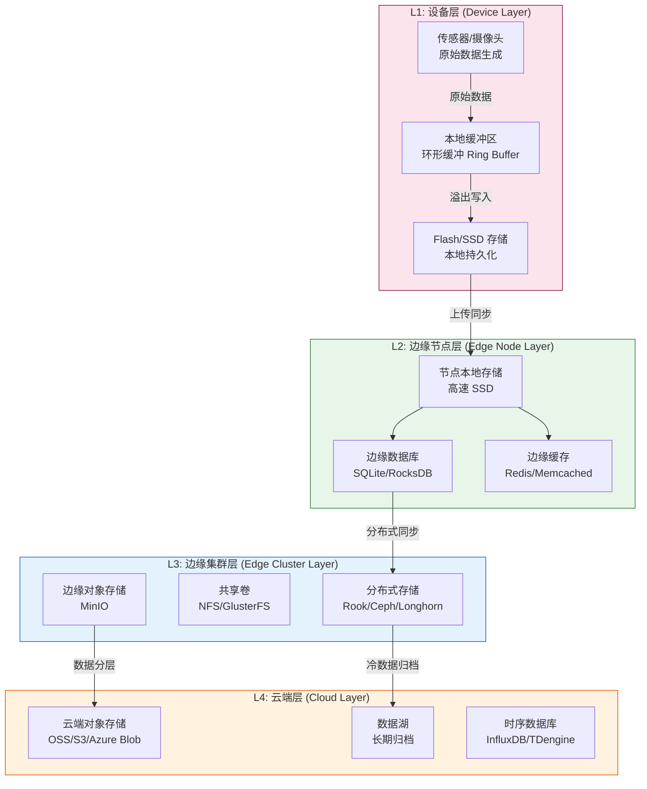
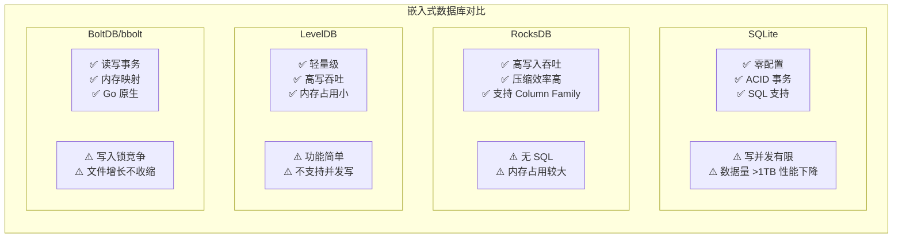
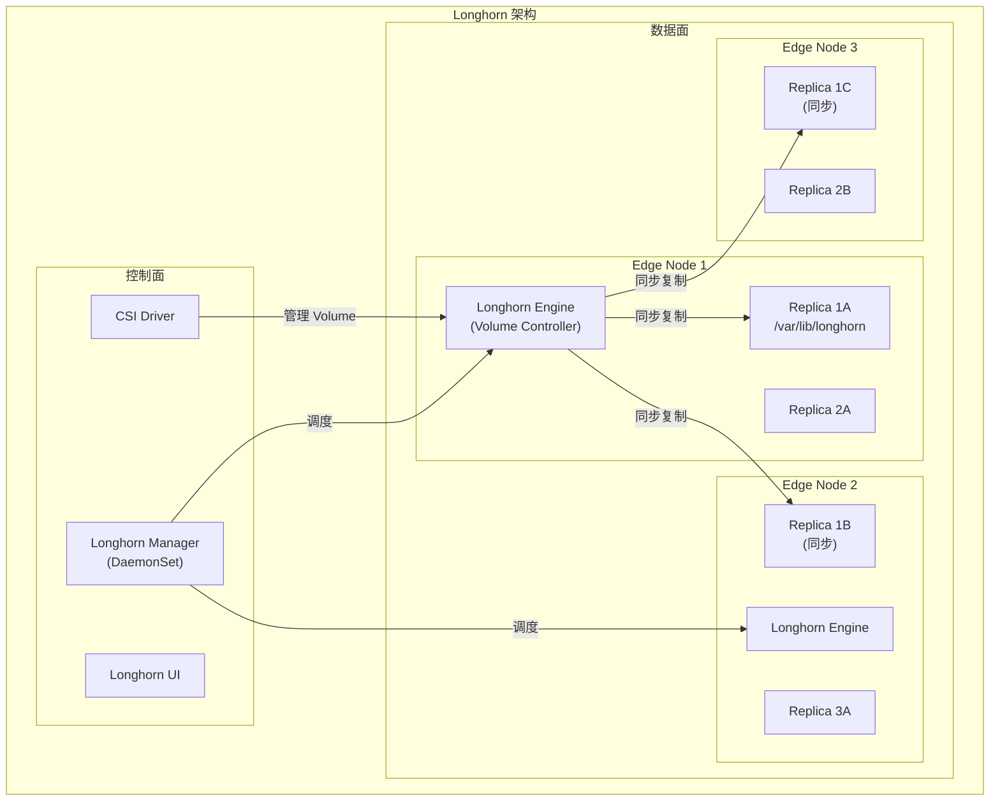
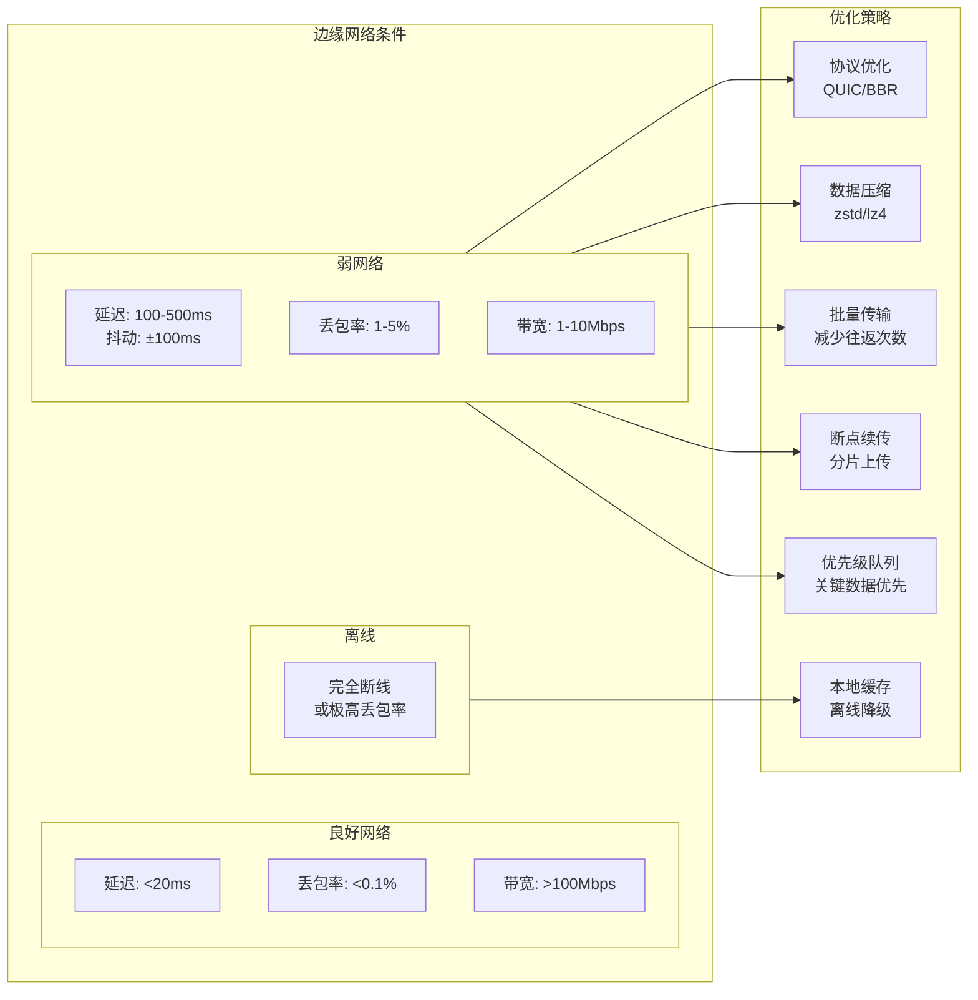
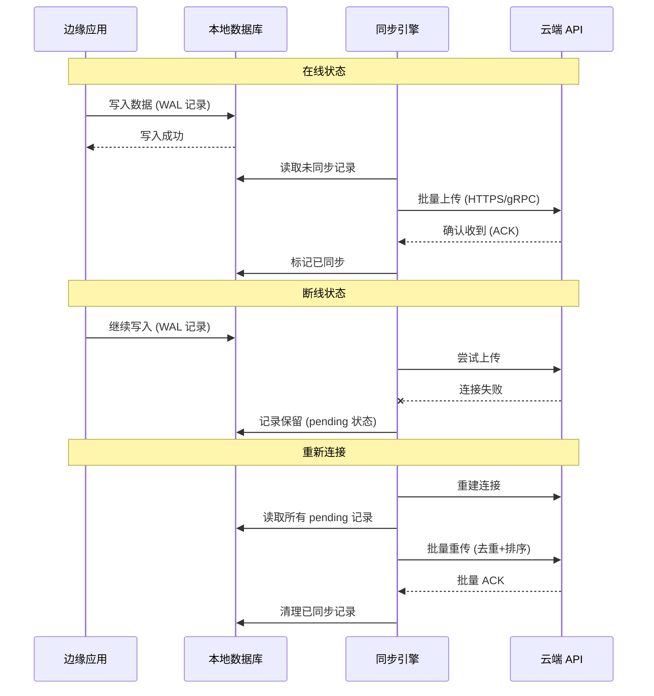
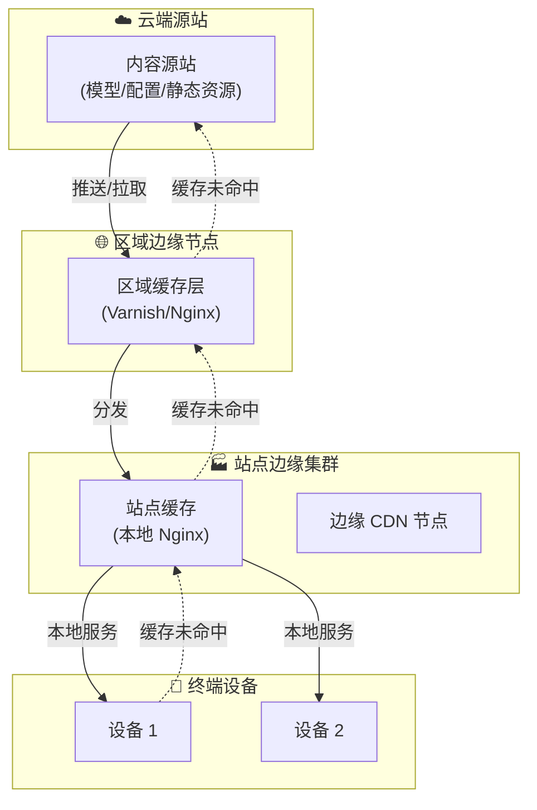
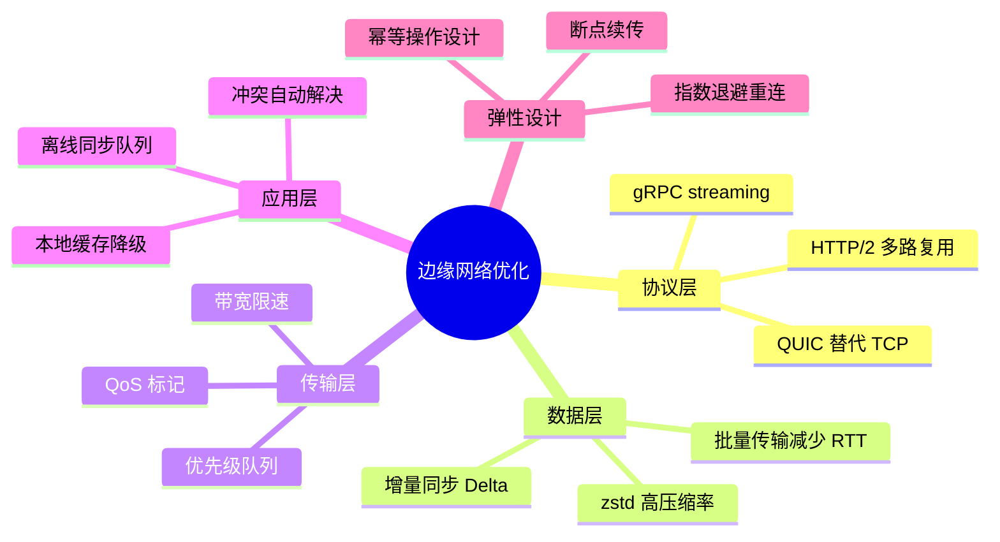

# 边缘存储与网络 (Edge Storage and Network)

## 概述 (Overview)

边缘计算场景下的存储与网络面临独特挑战：边缘设备存储容量有限、网络连接不稳定、带宽资源紧张。本文档深入探讨边缘存储解决方案（本地存储、分布式存储）、弱网络优化策略、离线数据同步机制、断线重连策略和带宽优化技术，为构建可靠的边缘存储网络系统提供完整指南。

Edge computing presents unique challenges for storage and networking: limited device storage capacity, unstable network connections, and constrained bandwidth. This document covers edge storage solutions (local and distributed), weak network optimization strategies, offline data sync mechanisms, reconnection strategies, and bandwidth optimization techniques.

---

## 目录 (Table of Contents)

1. [边缘存储架构总览](#1-边缘存储架构总览)
2. [本地存储方案](#2-本地存储方案)
3. [边缘分布式存储](#3-边缘分布式存储)
4. [Kubernetes 边缘存储](#4-kubernetes-边缘存储)
5. [弱网络优化策略](#5-弱网络优化策略)
6. [离线数据同步](#6-离线数据同步)
7. [断线重连机制](#7-断线重连机制)
8. [带宽优化技术](#8-带宽优化技术)
9. [边缘 CDN 与缓存](#9-边缘-cdn-与缓存)
10. [数据本地性优化](#10-数据本地性优化)
11. [存储监控与运维](#11-存储监控与运维)
12. [最佳实践总结](#12-最佳实践总结)

---

## 1. 边缘存储架构总览

### 1.1 边缘存储层次模型



### 1.2 边缘存储挑战与对策

| 挑战 | 具体表现 | 解决方案 |
|------|---------|---------|
| **容量限制** | 边缘节点 SSD 通常 <2TB | 数据分层、冷热分离、就地压缩 |
| **网络不稳定** | 丢包率高、延迟波动大 | 断线重传、本地缓存、异步同步 |
| **带宽受限** | 上行带宽通常 <100Mbps | 数据压缩、增量同步、优先级队列 |
| **离线操作** | 断网时需继续写入 | 本地日志缓存、Eventually Consistent |
| **数据一致性** | 多节点并发写入 | CRDT、向量时钟、冲突解决策略 |
| **存储可靠性** | 边缘设备硬件故障率高 | 本地 RAID、多副本、跨节点复制 |

---

## 2. 本地存储方案

### 2.1 嵌入式数据库选型



### 2.2 RocksDB 边缘存储实践

```python
# edge_rocksdb_storage.py
import rocksdb
import json
import time
import struct
from typing import Optional, Iterator, Tuple, Any
from datetime import datetime, timedelta
import threading
import logging

logger = logging.getLogger(__name__)


class EdgeTimeSeriesStorage:
    """基于 RocksDB 的边缘时序数据存储引擎"""
    
    # Column Family 定义
    CF_REALTIME = b"realtime"     # 实时数据（热数据，1天内）
    CF_HOURLY = b"hourly"         # 按小时聚合数据（7天内）
    CF_DAILY = b"daily"           # 按天聚合数据（30天内）
    CF_META = b"meta"             # 元数据
    
    def __init__(self, db_path: str, max_memory_mb: int = 256):
        """初始化边缘时序存储"""
        
        # RocksDB 配置（针对边缘设备优化）
        opts = rocksdb.Options()
        opts.create_if_missing = True
        opts.create_missing_column_families = True
        
        # 写缓冲区（减少写放大）
        opts.write_buffer_size = 32 * 1024 * 1024  # 32MB
        opts.max_write_buffer_number = 3
        
        # 压缩配置（减少存储占用）
        opts.compression = rocksdb.CompressionType.lz4_compression
        opts.bottommost_compression = rocksdb.CompressionType.zstd_compression
        
        # 块缓存（热数据读加速）
        block_cache = rocksdb.LRUCache(max_memory_mb * 1024 * 1024)
        table_opts = rocksdb.BlockBasedTableFactory(
            block_cache=block_cache,
            filter_policy=rocksdb.BloomFilterPolicy(10),
            block_size=16 * 1024  # 16KB 块（边缘 SSD 优化）
        )
        opts.table_factory = table_opts
        
        # 后台线程（边缘设备核数少，减少后台线程）
        opts.max_background_jobs = 2
        
        # 配置 Column Families
        cf_opts = rocksdb.ColumnFamilyOptions()
        cf_opts.compression = rocksdb.CompressionType.lz4_compression
        
        cf_descriptors = [
            rocksdb.ColumnFamilyDescriptor(b"default", cf_opts),
            rocksdb.ColumnFamilyDescriptor(self.CF_REALTIME, cf_opts),
            rocksdb.ColumnFamilyDescriptor(self.CF_HOURLY, cf_opts),
            rocksdb.ColumnFamilyDescriptor(self.CF_DAILY, cf_opts),
            rocksdb.ColumnFamilyDescriptor(self.CF_META, cf_opts),
        ]
        
        self.db, self.cfs = rocksdb.DB.open_column_families(
            db_path, opts, cf_descriptors
        )
        
        # 启动数据过期清理线程
        self._cleanup_thread = threading.Thread(
            target=self._cleanup_loop,
            daemon=True
        )
        self._cleanup_thread.start()
        
        logger.info(f"边缘存储初始化完成: {db_path}")
    
    def _encode_key(self, metric_name: str, timestamp: int) -> bytes:
        """
        编码时序 Key: metric_name + big-endian timestamp
        使用大端序时间戳确保按时间顺序存储
        """
        name_bytes = metric_name.encode('utf-8')
        ts_bytes = struct.pack('>Q', timestamp)  # big-endian uint64
        return name_bytes + b':' + ts_bytes
    
    def _decode_key(self, key: bytes) -> Tuple[str, int]:
        """解码时序 Key"""
        colon_pos = key.rfind(b':')
        metric_name = key[:colon_pos].decode('utf-8')
        timestamp = struct.unpack('>Q', key[colon_pos+1:])[0]
        return metric_name, timestamp
    
    def write(
        self,
        metric_name: str,
        value: float,
        timestamp: Optional[int] = None,
        tags: Optional[dict] = None
    ) -> None:
        """写入时序数据点"""
        if timestamp is None:
            timestamp = int(time.time() * 1000)  # 毫秒时间戳
        
        key = self._encode_key(metric_name, timestamp)
        
        data = {"v": value}
        if tags:
            data["t"] = tags
        
        value_bytes = json.dumps(data, separators=(',', ':')).encode()
        
        # 使用 WriteBatch 批量写入提高性能
        batch = rocksdb.WriteBatch()
        batch.put(self.cfs[self.CF_REALTIME], key, value_bytes)
        
        write_opts = rocksdb.WriteOptions()
        write_opts.sync = False  # 异步写（边缘场景允许少量丢失）
        self.db.write(batch, write_opts)
    
    def batch_write(
        self,
        points: list  # [{metric, value, timestamp, tags}, ...]
    ) -> None:
        """批量写入（高吞吐写入场景）"""
        batch = rocksdb.WriteBatch()
        
        for point in points:
            key = self._encode_key(
                point['metric'],
                point.get('timestamp', int(time.time() * 1000))
            )
            data = {"v": point['value']}
            if point.get('tags'):
                data["t"] = point['tags']
            
            value_bytes = json.dumps(data, separators=(',', ':')).encode()
            batch.put(self.cfs[self.CF_REALTIME], key, value_bytes)
        
        write_opts = rocksdb.WriteOptions()
        write_opts.sync = False
        self.db.write(batch, write_opts)
        
        logger.debug(f"批量写入 {len(points)} 条数据")
    
    def query_range(
        self,
        metric_name: str,
        start_ts: int,
        end_ts: int,
        max_points: int = 10000
    ) -> Iterator[Tuple[int, float, dict]]:
        """查询时间范围内的数据"""
        start_key = self._encode_key(metric_name, start_ts)
        end_key = self._encode_key(metric_name, end_ts)
        
        it = self.db.iteritems(self.cfs[self.CF_REALTIME])
        it.seek(start_key)
        
        count = 0
        for key, value in it:
            if key > end_key or count >= max_points:
                break
            
            name, timestamp = self._decode_key(key)
            if name != metric_name:
                break
            
            data = json.loads(value)
            tags = data.get('t', {})
            yield timestamp, data['v'], tags
            count += 1
    
    def get_latest(
        self,
        metric_name: str
    ) -> Optional[Tuple[int, float]]:
        """获取指标最新值"""
        # 使用最大时间戳作为起始搜索
        max_ts = int(time.time() * 1000) + 1000
        search_key = self._encode_key(metric_name, max_ts)
        
        it = self.db.iteritems(self.cfs[self.CF_REALTIME])
        it.seek_for_prev(search_key)
        
        try:
            key, value = next(it)
            name, timestamp = self._decode_key(key)
            if name == metric_name:
                data = json.loads(value)
                return timestamp, data['v']
        except StopIteration:
            pass
        
        return None
    
    def _cleanup_loop(self) -> None:
        """后台数据过期清理"""
        while True:
            try:
                now_ms = int(time.time() * 1000)
                retention_ms = 24 * 3600 * 1000  # 保留 24 小时
                cutoff_ts = now_ms - retention_ms
                
                # 删除过期数据
                deleted = 0
                it = self.db.iteritems(self.cfs[self.CF_REALTIME])
                it.seek_to_first()
                
                batch = rocksdb.WriteBatch()
                for key, _ in it:
                    try:
                        _, timestamp = self._decode_key(key)
                        if timestamp < cutoff_ts:
                            batch.delete(self.cfs[self.CF_REALTIME], key)
                            deleted += 1
                        else:
                            break  # 已按时间顺序，后面的都更新
                    except Exception:
                        continue
                
                if deleted > 0:
                    self.db.write(batch)
                    logger.info(f"清理过期数据: {deleted} 条")
                
                # 触发压缩（减少存储空间）
                if deleted > 10000:
                    self.db.compact_range(
                        self.cfs[self.CF_REALTIME],
                        None, None
                    )
            
            except Exception as e:
                logger.error(f"清理线程错误: {e}")
            
            time.sleep(3600)  # 每小时清理一次


class EdgeLocalCache:
    """边缘端 SQLite 缓存（适合结构化配置和状态数据）"""
    
    def __init__(self, db_path: str):
        import sqlite3
        
        self.conn = sqlite3.connect(
            db_path,
            check_same_thread=False,
            isolation_level=None  # 自动提交模式
        )
        
        # 性能优化 PRAGMA
        cursor = self.conn.cursor()
        cursor.executescript("""
            PRAGMA journal_mode = WAL;        -- 写前日志，提高并发
            PRAGMA synchronous = NORMAL;       -- 平衡安全与性能
            PRAGMA cache_size = -32000;        -- 32MB 页缓存
            PRAGMA temp_store = MEMORY;        -- 临时表存内存
            PRAGMA mmap_size = 268435456;      -- 256MB 内存映射
            PRAGMA page_size = 4096;           -- 4KB 页面（SSD 优化）
        """)
        
        # 创建核心表
        cursor.executescript("""
            CREATE TABLE IF NOT EXISTS kv_store (
                key TEXT PRIMARY KEY,
                value BLOB,
                type TEXT DEFAULT 'json',
                created_at INTEGER DEFAULT (strftime('%s', 'now') * 1000),
                updated_at INTEGER DEFAULT (strftime('%s', 'now') * 1000),
                expires_at INTEGER DEFAULT NULL
            );
            
            CREATE INDEX IF NOT EXISTS idx_kv_expires 
            ON kv_store(expires_at) WHERE expires_at IS NOT NULL;
            
            -- 待同步队列
            CREATE TABLE IF NOT EXISTS sync_queue (
                id INTEGER PRIMARY KEY AUTOINCREMENT,
                operation TEXT NOT NULL,  -- INSERT/UPDATE/DELETE
                table_name TEXT NOT NULL,
                record_key TEXT NOT NULL,
                payload BLOB,
                created_at INTEGER DEFAULT (strftime('%s', 'now') * 1000),
                retry_count INTEGER DEFAULT 0,
                status TEXT DEFAULT 'pending'  -- pending/syncing/done/failed
            );
            
            CREATE INDEX IF NOT EXISTS idx_sync_status 
            ON sync_queue(status, created_at);
        """)
        
        self._lock = threading.Lock()
    
    def set(
        self,
        key: str,
        value: Any,
        ttl_seconds: Optional[int] = None
    ) -> None:
        """设置键值"""
        expires_at = None
        if ttl_seconds:
            expires_at = int(time.time() * 1000) + ttl_seconds * 1000
        
        value_bytes = json.dumps(value).encode()
        
        with self._lock:
            self.conn.execute(
                """INSERT OR REPLACE INTO kv_store 
                   (key, value, expires_at, updated_at) 
                   VALUES (?, ?, ?, ?)""",
                (key, value_bytes, expires_at, int(time.time() * 1000))
            )
    
    def get(self, key: str, default=None) -> Any:
        """获取键值"""
        now_ms = int(time.time() * 1000)
        
        row = self.conn.execute(
            """SELECT value, expires_at FROM kv_store 
               WHERE key = ? AND (expires_at IS NULL OR expires_at > ?)""",
            (key, now_ms)
        ).fetchone()
        
        if row is None:
            return default
        
        return json.loads(row[0])
    
    def enqueue_sync(
        self,
        operation: str,
        table_name: str,
        record_key: str,
        payload: dict
    ) -> int:
        """将变更加入同步队列"""
        cursor = self.conn.execute(
            """INSERT INTO sync_queue 
               (operation, table_name, record_key, payload)
               VALUES (?, ?, ?, ?)""",
            (operation, table_name, record_key,
             json.dumps(payload).encode())
        )
        return cursor.lastrowid
    
    def get_pending_syncs(self, limit: int = 100) -> list:
        """获取待同步记录"""
        rows = self.conn.execute(
            """SELECT id, operation, table_name, record_key, payload, retry_count
               FROM sync_queue 
               WHERE status = 'pending'
               ORDER BY created_at ASC
               LIMIT ?""",
            (limit,)
        ).fetchall()
        
        return [
            {
                "id": r[0],
                "operation": r[1],
                "table_name": r[2],
                "record_key": r[3],
                "payload": json.loads(r[4]),
                "retry_count": r[5]
            }
            for r in rows
        ]
```

---

## 3. 边缘分布式存储

### 3.1 Longhorn 边缘存储

Longhorn 是 Rancher 开源的轻量级 Kubernetes 原生分布式块存储系统，特别适合边缘场景：



### 3.2 Longhorn 安装配置

```yaml
# longhorn-values.yaml - Helm Chart 配置
persistence:
  defaultClass: true
  defaultFsType: ext4
  defaultClassReplicaCount: 2  # 边缘场景使用 2 副本（节点数少）
  reclaimPolicy: Retain         # 边缘数据宝贵，不自动删除

defaultSettings:
  # 副本数
  defaultReplicaCount: 2
  
  # 存储路径（使用专用数据盘）
  defaultDataPath: /data/longhorn
  
  # 备份目标（同步到云端 S3）
  backupTarget: s3://edge-backup-bucket@us-east-1/
  backupTargetCredentialSecret: minio-secret
  
  # 空间回收
  storageMinimalAvailablePercentage: 15
  
  # 节点磁盘选择（避免占用系统盘）
  createDefaultDiskLabeledNodes: true
  
  # 快照控制（边缘节点空间有限）
  recurringJobMaxRetention: 3
  
  # 网络优化（弱网环境）
  replicaReplenishmentWaitInterval: 600  # 10分钟后才补充副本
  replicaAutoBalance: least-effort

longhornUI:
  replicas: 1

ingress:
  enabled: true
  ingressClassName: nginx
  host: longhorn.edge.local
```

```yaml
# StorageClass 定义 - 适合边缘不同场景
---
# 高性能本地存储（单副本，不跨节点）
apiVersion: storage.k8s.io/v1
kind: StorageClass
metadata:
  name: edge-local-fast
provisioner: driver.longhorn.io
parameters:
  numberOfReplicas: "1"
  staleReplicaTimeout: "30"
  diskSelector: "ssd"
  nodeSelector: ""
  fsType: ext4
reclaimPolicy: Delete
volumeBindingMode: Immediate

---
# 可靠性优先存储（2副本，跨节点）
apiVersion: storage.k8s.io/v1
kind: StorageClass
metadata:
  name: edge-replicated
provisioner: driver.longhorn.io
parameters:
  numberOfReplicas: "2"
  staleReplicaTimeout: "60"
  fsType: ext4
  dataLocality: "best-effort"  # 优先本地读取
reclaimPolicy: Retain
volumeBindingMode: WaitForFirstConsumer

---
# 数据库专用存储
apiVersion: storage.k8s.io/v1
kind: StorageClass
metadata:
  name: edge-database
provisioner: driver.longhorn.io
parameters:
  numberOfReplicas: "2"
  fsType: ext4
  dataLocality: "strict-local"  # 严格本地（低延迟）
reclaimPolicy: Retain
allowVolumeExpansion: true
```

### 3.3 MinIO 边缘对象存储

```yaml
# minio-edge-deployment.yaml
# 边缘端轻量级 MinIO 部署
apiVersion: apps/v1
kind: StatefulSet
metadata:
  name: minio-edge
  namespace: edge-storage
spec:
  serviceName: minio-edge
  replicas: 1  # 单节点边缘部署（节点数不足时）
  selector:
    matchLabels:
      app: minio-edge
  template:
    metadata:
      labels:
        app: minio-edge
    spec:
      containers:
        - name: minio
          image: minio/minio:RELEASE.2024-01-01T00-00-00Z
          command:
            - minio
            - server
            - /data
            - --console-address
            - ":9001"
          env:
            - name: MINIO_ROOT_USER
              valueFrom:
                secretKeyRef:
                  name: minio-secret
                  key: access-key
            - name: MINIO_ROOT_PASSWORD
              valueFrom:
                secretKeyRef:
                  name: minio-secret
                  key: secret-key
            # 开启压缩（节省边缘存储空间）
            - name: MINIO_COMPRESS
              value: "on"
            - name: MINIO_COMPRESS_EXTENSIONS
              value: ".log,.json,.csv,.txt"
            # 云端复制目标
            - name: MINIO_SITE_NAME
              value: "edge-site-1"
          ports:
            - containerPort: 9000
              name: api
            - containerPort: 9001
              name: console
          readinessProbe:
            httpGet:
              path: /minio/health/ready
              port: 9000
            initialDelaySeconds: 10
          livenessProbe:
            httpGet:
              path: /minio/health/live
              port: 9000
            initialDelaySeconds: 30
          volumeMounts:
            - name: data
              mountPath: /data
          resources:
            limits:
              cpu: "2"
              memory: "2Gi"
            requests:
              cpu: "200m"
              memory: "512Mi"
  volumeClaimTemplates:
    - metadata:
        name: data
      spec:
        accessModes: ["ReadWriteOnce"]
        storageClassName: edge-local-fast
        resources:
          requests:
            storage: 500Gi

---
# MinIO 云端复制配置 (Bucket Replication)
# 使用 mc 命令配置:
# mc alias set edge-site http://minio-edge:9000 access-key secret-key
# mc alias set cloud-site https://oss.example.com oss-key oss-secret
# mc replicate add edge-site/sensor-data \
#   --remote-bucket arn:minio:replication::cloud-site:sensor-data \
#   --priority 1 \
#   --bandwidth 50M  # 限速 50MB/s
```

---

## 4. Kubernetes 边缘存储

### 4.1 CSI 驱动适配

```yaml
# 边缘节点 local-path-provisioner 配置
# 适合资源受限节点，使用本地路径快速提供 PV

apiVersion: v1
kind: ConfigMap
metadata:
  name: local-path-config
  namespace: local-path-storage
data:
  config.json: |
    {
      "nodePathMap": [
        {
          "node": "DEFAULT_PATH_FOR_NON_LISTED_NODES",
          "paths": ["/data/local-path-storage"]
        }
      ]
    }
  
  setup: |
    #!/bin/sh
    set -eu
    mkdir -m 0777 -p "$VOL_DIR"
  
  teardown: |
    #!/bin/sh
    set -eu
    rm -rf "$VOL_DIR"
  
  helperPod.yaml: |
    apiVersion: v1
    kind: Pod
    spec:
      # 使用更小的镜像，节省边缘带宽
      initContainers:
        - name: helper
          image: busybox:1.35
          command: ["sh", "/script/setup"]
```

### 4.2 边缘 PV 管理

```yaml
# 边缘节点手动创建 Local PV（性能最优）
apiVersion: v1
kind: PersistentVolume
metadata:
  name: edge-node1-data-pv
  labels:
    node: edge-node-1
    type: local-ssd
spec:
  capacity:
    storage: 100Gi
  volumeMode: Filesystem
  accessModes:
    - ReadWriteOnce
  persistentVolumeReclaimPolicy: Retain
  storageClassName: local-ssd
  local:
    path: /data/edge-volumes/data-01
  # 节点亲和性确保 Pod 调度到有此 PV 的节点
  nodeAffinity:
    required:
      nodeSelectorTerms:
        - matchExpressions:
            - key: kubernetes.io/hostname
              operator: In
              values:
                - edge-node-1

---
# PVC 绑定到本地 PV
apiVersion: v1
kind: PersistentVolumeClaim
metadata:
  name: edge-timeseries-pvc
  namespace: edge-apps
spec:
  accessModes:
    - ReadWriteOnce
  storageClassName: local-ssd
  resources:
    requests:
      storage: 50Gi
  # 通过标签选择器绑定到特定 PV
  selector:
    matchLabels:
      node: edge-node-1
      type: local-ssd
```

---

## 5. 弱网络优化策略

### 5.1 弱网络特征分析



### 5.2 QUIC 协议应用

```python
# quic_edge_transport.py
# 使用 QUIC 协议优化弱网络数据传输
# QUIC 优势：内置重传、0-RTT 恢复、多路复用无队头阻塞

import asyncio
import aioquic
from aioquic.asyncio import connect, serve
from aioquic.asyncio.protocol import QuicConnectionProtocol
from aioquic.quic.configuration import QuicConfiguration
from aioquic.quic.events import StreamDataReceived, HandshakeCompleted
import json
import time
import logging
from typing import Optional, Callable

logger = logging.getLogger(__name__)


class EdgeQuicClient:
    """基于 QUIC 的边缘数据上传客户端"""
    
    def __init__(
        self,
        host: str,
        port: int,
        cert_file: str,
        key_file: str,
        ca_file: str
    ):
        self.host = host
        self.port = port
        
        # QUIC 配置
        self.config = QuicConfiguration(
            is_client=True,
            # mTLS 证书
            cafile=ca_file,
        )
        
        self._connection = None
        self._connected = False
    
    async def connect(self) -> None:
        """建立 QUIC 连接（支持 0-RTT 重连）"""
        try:
            self._connection = await connect(
                self.host,
                self.port,
                configuration=self.config,
                create_protocol=EdgeQuicProtocol,
                # QUIC 连接超时（弱网络下设置较长）
                timeout=30
            )
            self._connected = True
            logger.info(f"QUIC 连接建立: {self.host}:{self.port}")
        
        except Exception as e:
            logger.error(f"QUIC 连接失败: {e}")
            self._connected = False
    
    async def send_data(
        self,
        stream_id: int,
        data: bytes,
        retry_times: int = 3
    ) -> bool:
        """发送数据（带重试）"""
        for attempt in range(retry_times):
            try:
                if not self._connected:
                    await self.connect()
                
                # QUIC 多路复用：每个数据流独立，不影响其他流
                self._connection._quic.send_stream_data(
                    stream_id, data, end_stream=False
                )
                return True
            
            except Exception as e:
                logger.warning(f"发送失败 (第{attempt+1}次): {e}")
                self._connected = False
                if attempt < retry_times - 1:
                    await asyncio.sleep(2 ** attempt)  # 指数退避
        
        return False


class AdaptiveBandwidthController:
    """自适应带宽控制器"""
    
    def __init__(
        self,
        initial_bandwidth_bps: int = 10_000_000,  # 10Mbps
        min_bandwidth_bps: int = 100_000,          # 100Kbps
        max_bandwidth_bps: int = 100_000_000       # 100Mbps
    ):
        self.estimated_bw = initial_bandwidth_bps
        self.min_bw = min_bandwidth_bps
        self.max_bw = max_bandwidth_bps
        
        # 发送统计
        self._sent_bytes = 0
        self._rtt_samples = []
        self._loss_events = 0
        self._window_start = time.time()
    
    def record_rtt(self, rtt_ms: float) -> None:
        """记录 RTT 样本"""
        self._rtt_samples.append(rtt_ms)
        if len(self._rtt_samples) > 20:
            self._rtt_samples.pop(0)
    
    def record_loss(self) -> None:
        """记录丢包事件"""
        self._loss_events += 1
        # 丢包时立即降低带宽估计（如 TCP CUBIC）
        self.estimated_bw = int(self.estimated_bw * 0.7)
        self.estimated_bw = max(self.estimated_bw, self.min_bw)
    
    def update_bandwidth(self, bytes_sent: int, elapsed_s: float) -> None:
        """更新带宽估计"""
        if elapsed_s <= 0:
            return
        
        # 实测带宽
        measured_bw = int(bytes_sent * 8 / elapsed_s)
        
        # 指数移动平均
        alpha = 0.3
        self.estimated_bw = int(
            alpha * measured_bw + (1 - alpha) * self.estimated_bw
        )
        self.estimated_bw = max(self.min_bw,
                                min(self.max_bw, self.estimated_bw))
    
    @property
    def max_send_rate_bps(self) -> int:
        """获取当前最大发送速率"""
        return self.estimated_bw
    
    @property
    def send_window_bytes(self) -> int:
        """计算发送窗口大小"""
        if not self._rtt_samples:
            return 65536
        
        avg_rtt_s = sum(self._rtt_samples) / len(self._rtt_samples) / 1000
        # BDP (Bandwidth-Delay Product) = bandwidth * RTT
        bdp = int(self.estimated_bw * avg_rtt_s / 8)  # 字节
        return max(65536, min(bdp, 10 * 1024 * 1024))  # 64KB - 10MB
```

### 5.3 数据压缩策略

```python
# edge_compression.py
import zstd
import lz4.frame
import gzip
import snappy
import numpy as np
from typing import Tuple
import time


class EdgeDataCompressor:
    """边缘数据压缩器 - 根据数据类型选择最优压缩算法"""
    
    # 算法配置
    ALGORITHMS = {
        "zstd": {
            "compress": lambda d, level=3: zstd.compress(d, level),
            "decompress": zstd.decompress,
            # 压缩比高，速度均衡，推荐大部分场景
            "ratio": 4.0,
            "speed_mb_s": 400
        },
        "lz4": {
            "compress": lambda d, level=0: lz4.frame.compress(d),
            "decompress": lz4.frame.decompress,
            # 速度最快，压缩比一般，适合实时数据
            "ratio": 2.5,
            "speed_mb_s": 1500
        },
        "gzip": {
            "compress": lambda d, level=6: gzip.compress(d, level),
            "decompress": gzip.decompress,
            # 兼容性最好，速度较慢
            "ratio": 4.5,
            "speed_mb_s": 100
        },
    }
    
    @classmethod
    def compress_timeseries(
        cls,
        timestamps: np.ndarray,
        values: np.ndarray,
        precision_digits: int = 4
    ) -> bytes:
        """
        时序数据专用压缩
        使用 delta-of-delta 时间戳编码 + 浮点值压缩
        """
        # 时间戳 Delta-of-Delta 编码（Gorilla 压缩思想）
        ts_deltas = np.diff(timestamps.astype(np.int64), prepend=timestamps[0])
        
        # 值的变化量（对平滑时序数据效果好）
        val_diff = np.diff(values.astype(np.float32), prepend=values[0])
        
        # 限制精度
        val_diff = np.round(val_diff, precision_digits)
        
        # 序列化
        data = {
            "start_ts": int(timestamps[0]),
            "ts_deltas": ts_deltas.tolist(),
            "val_start": round(float(values[0]), precision_digits),
            "val_diffs": val_diff.tolist()
        }
        
        import json
        json_bytes = json.dumps(data, separators=(',', ':')).encode()
        
        # zstd 压缩（高训练字典效果更好）
        compressed = zstd.compress(json_bytes, level=9)
        
        orig_size = len(json_bytes)
        comp_size = len(compressed)
        
        return compressed
    
    @classmethod
    def select_algorithm(
        cls,
        data_type: str,
        network_state: str  # "good" / "poor" / "offline"
    ) -> str:
        """根据数据类型和网络状态选择压缩算法"""
        
        # 离线或弱网：优先压缩率
        if network_state in ["offline", "poor"]:
            if data_type in ["log", "config", "model"]:
                return "zstd"  # 高压缩率
            elif data_type == "timeseries":
                return "zstd"  # 时序数据压缩效果好
            else:
                return "lz4"   # 通用快速
        
        # 良好网络：优先速度
        else:
            if data_type in ["realtime", "video_frame"]:
                return "lz4"   # 最快
            else:
                return "zstd"  # 平衡
    
    @classmethod
    def benchmark(cls, data: bytes) -> dict:
        """压缩算法基准测试"""
        results = {}
        
        for name, algo in cls.ALGORITHMS.items():
            # 压缩
            start = time.perf_counter()
            compressed = algo["compress"](data)
            compress_time = (time.perf_counter() - start) * 1000
            
            # 解压
            start = time.perf_counter()
            _ = algo["decompress"](compressed)
            decompress_time = (time.perf_counter() - start) * 1000
            
            ratio = len(data) / len(compressed)
            
            results[name] = {
                "original_size_kb": len(data) / 1024,
                "compressed_size_kb": len(compressed) / 1024,
                "ratio": round(ratio, 2),
                "compress_ms": round(compress_time, 2),
                "decompress_ms": round(decompress_time, 2),
                "compress_speed_mbps": round(
                    len(data) / compress_time / 1000, 1
                )
            }
        
        return results
```

---

## 6. 离线数据同步

### 6.1 离线同步架构



### 6.2 冲突解决策略

```python
# sync_engine.py
import asyncio
import aiohttp
import sqlite3
import json
import hashlib
import time
from typing import List, Dict, Optional, Tuple
from enum import Enum
from dataclasses import dataclass, field
import logging

logger = logging.getLogger(__name__)


class ConflictResolutionStrategy(Enum):
    """冲突解决策略"""
    LAST_WRITE_WINS = "lww"           # 最后写入优先（时间戳）
    SERVER_WINS = "server_wins"       # 服务端优先
    CLIENT_WINS = "client_wins"       # 客户端优先
    MERGE = "merge"                   # 自动合并（CRDT）
    MANUAL = "manual"                 # 人工介入


@dataclass
class SyncRecord:
    """同步记录"""
    id: int
    operation: str  # INSERT/UPDATE/DELETE
    table_name: str
    record_key: str
    payload: dict
    timestamp_ms: int
    vector_clock: dict = field(default_factory=dict)
    checksum: str = ""
    retry_count: int = 0
    
    def __post_init__(self):
        if not self.checksum:
            self.checksum = self._compute_checksum()
    
    def _compute_checksum(self) -> str:
        data = json.dumps({
            "op": self.operation,
            "table": self.table_name,
            "key": self.record_key,
            "payload": self.payload,
            "ts": self.timestamp_ms
        }, sort_keys=True)
        return hashlib.sha256(data.encode()).hexdigest()[:16]


class EdgeSyncEngine:
    """边缘端数据同步引擎"""
    
    def __init__(
        self,
        device_id: str,
        cloud_api_url: str,
        local_db_path: str,
        conflict_strategy: ConflictResolutionStrategy = ConflictResolutionStrategy.LAST_WRITE_WINS,
        max_batch_size: int = 100,
        sync_interval_s: int = 30
    ):
        self.device_id = device_id
        self.cloud_api_url = cloud_api_url
        self.conflict_strategy = conflict_strategy
        self.max_batch_size = max_batch_size
        self.sync_interval_s = sync_interval_s
        
        self.db = sqlite3.connect(local_db_path, check_same_thread=False)
        self._init_sync_tables()
        
        # 网络状态
        self._online = False
        self._consecutive_failures = 0
        self._backoff_s = 5  # 初始退避时间
        
        # 向量时钟（设备 -> 逻辑时间）
        self._vector_clock = {device_id: 0}
    
    def _init_sync_tables(self) -> None:
        """初始化同步相关表"""
        self.db.executescript("""
            CREATE TABLE IF NOT EXISTS sync_log (
                id INTEGER PRIMARY KEY AUTOINCREMENT,
                device_id TEXT NOT NULL,
                operation TEXT NOT NULL,
                table_name TEXT NOT NULL,
                record_key TEXT NOT NULL,
                payload BLOB,
                timestamp_ms INTEGER NOT NULL,
                vector_clock TEXT DEFAULT '{}',
                checksum TEXT,
                status TEXT DEFAULT 'pending',
                retry_count INTEGER DEFAULT 0,
                last_attempt_at INTEGER,
                error_msg TEXT
            );
            
            CREATE INDEX IF NOT EXISTS idx_sync_log_status 
            ON sync_log(status, timestamp_ms);
            
            -- 冲突记录表
            CREATE TABLE IF NOT EXISTS sync_conflicts (
                id INTEGER PRIMARY KEY AUTOINCREMENT,
                record_key TEXT NOT NULL,
                local_payload BLOB,
                remote_payload BLOB,
                conflict_type TEXT,
                resolved_at INTEGER,
                resolution TEXT
            );
            
            -- 同步元数据（记录已同步到云端的最大序列号）
            CREATE TABLE IF NOT EXISTS sync_metadata (
                key TEXT PRIMARY KEY,
                value TEXT
            );
        """)
    
    def record_change(
        self,
        operation: str,
        table_name: str,
        record_key: str,
        payload: dict
    ) -> int:
        """记录数据变更到同步日志"""
        # 更新向量时钟
        self._vector_clock[self.device_id] = \
            self._vector_clock.get(self.device_id, 0) + 1
        
        timestamp_ms = int(time.time() * 1000)
        vector_clock_json = json.dumps(self._vector_clock)
        payload_json = json.dumps(payload)
        
        cursor = self.db.execute(
            """INSERT INTO sync_log 
               (device_id, operation, table_name, record_key, 
                payload, timestamp_ms, vector_clock)
               VALUES (?, ?, ?, ?, ?, ?, ?)""",
            (self.device_id, operation, table_name, record_key,
             payload_json, timestamp_ms, vector_clock_json)
        )
        self.db.commit()
        return cursor.lastrowid
    
    async def sync_to_cloud(self) -> Tuple[int, int]:
        """
        同步数据到云端
        
        Returns:
            (成功同步数, 失败数)
        """
        # 获取待同步记录
        pending = self.db.execute(
            """SELECT id, device_id, operation, table_name, record_key,
                      payload, timestamp_ms, vector_clock, checksum, retry_count
               FROM sync_log 
               WHERE status = 'pending' AND retry_count < 10
               ORDER BY timestamp_ms ASC
               LIMIT ?""",
            (self.max_batch_size,)
        ).fetchall()
        
        if not pending:
            return 0, 0
        
        # 构建批量请求
        batch = []
        record_ids = []
        
        for row in pending:
            rid, dev_id, op, table, key, payload, ts, vc, cksum, retry = row
            batch.append({
                "id": rid,
                "device_id": dev_id,
                "operation": op,
                "table_name": table,
                "record_key": key,
                "payload": json.loads(payload),
                "timestamp_ms": ts,
                "vector_clock": json.loads(vc or '{}'),
                "checksum": cksum
            })
            record_ids.append(rid)
        
        # 更新状态为 syncing
        placeholders = ','.join(['?' for _ in record_ids])
        self.db.execute(
            f"UPDATE sync_log SET status='syncing', "
            f"last_attempt_at=? WHERE id IN ({placeholders})",
            [int(time.time() * 1000)] + record_ids
        )
        self.db.commit()
        
        # 发送到云端
        try:
            async with aiohttp.ClientSession() as session:
                async with session.post(
                    f"{self.cloud_api_url}/v1/sync/batch",
                    json={
                        "device_id": self.device_id,
                        "records": batch,
                        "vector_clock": self._vector_clock
                    },
                    timeout=aiohttp.ClientTimeout(total=60),
                    headers={"Content-Encoding": "gzip"}
                ) as resp:
                    
                    if resp.status == 200:
                        result = await resp.json()
                        
                        # 处理服务端返回的结果
                        success_ids = result.get("success_ids", [])
                        conflicts = result.get("conflicts", [])
                        
                        # 标记成功同步的记录
                        if success_ids:
                            sph = ','.join(['?' for _ in success_ids])
                            self.db.execute(
                                f"UPDATE sync_log SET status='done' "
                                f"WHERE id IN ({sph})",
                                success_ids
                            )
                        
                        # 处理冲突
                        for conflict in conflicts:
                            await self._resolve_conflict(conflict)
                        
                        # 更新向量时钟
                        remote_vc = result.get("vector_clock", {})
                        for k, v in remote_vc.items():
                            self._vector_clock[k] = max(
                                self._vector_clock.get(k, 0), v
                            )
                        
                        self.db.commit()
                        
                        # 重置退避
                        self._consecutive_failures = 0
                        self._backoff_s = 5
                        self._online = True
                        
                        return len(success_ids), len(conflicts)
                    
                    else:
                        raise Exception(f"服务端错误: {resp.status}")
        
        except Exception as e:
            logger.error(f"同步失败: {e}")
            self._consecutive_failures += 1
            self._backoff_s = min(300, self._backoff_s * 2)  # 最大 5 分钟退避
            self._online = False
            
            # 将 syncing 恢复为 pending（等待重试）
            ph = ','.join(['?' for _ in record_ids])
            self.db.execute(
                f"""UPDATE sync_log 
                   SET status='pending', retry_count=retry_count+1,
                       error_msg=?
                   WHERE id IN ({ph}) AND status='syncing'""",
                [str(e)] + record_ids
            )
            self.db.commit()
            
            return 0, len(pending)
    
    async def _resolve_conflict(self, conflict: dict) -> None:
        """解决同步冲突"""
        strategy = self.conflict_strategy
        record_key = conflict.get("record_key")
        local_payload = conflict.get("local_payload")
        remote_payload = conflict.get("remote_payload")
        
        if strategy == ConflictResolutionStrategy.LAST_WRITE_WINS:
            # 比较时间戳，保留较新的版本
            local_ts = local_payload.get("updated_at", 0)
            remote_ts = remote_payload.get("updated_at", 0)
            
            if local_ts >= remote_ts:
                winner = "local"
                resolved_payload = local_payload
            else:
                winner = "remote"
                resolved_payload = remote_payload
            
            logger.info(f"冲突解决 (LWW): {record_key} -> {winner}")
        
        elif strategy == ConflictResolutionStrategy.MERGE:
            # 尝试自动合并（适合 Set/Counter 等 CRDT 类型）
            resolved_payload = self._crdt_merge(
                local_payload, remote_payload
            )
            winner = "merged"
        
        else:
            # 记录冲突，等待人工处理
            self.db.execute(
                """INSERT INTO sync_conflicts 
                   (record_key, local_payload, remote_payload, conflict_type)
                   VALUES (?, ?, ?, ?)""",
                (record_key,
                 json.dumps(local_payload),
                 json.dumps(remote_payload),
                 conflict.get("type", "unknown"))
            )
            return
        
        # 记录解决结果
        self.db.execute(
            """INSERT INTO sync_conflicts 
               (record_key, local_payload, remote_payload, 
                resolved_at, resolution)
               VALUES (?, ?, ?, ?, ?)""",
            (record_key,
             json.dumps(local_payload),
             json.dumps(remote_payload),
             int(time.time() * 1000),
             json.dumps({"winner": winner, "payload": resolved_payload}))
        )
    
    def _crdt_merge(self, local: dict, remote: dict) -> dict:
        """简单的 CRDT 合并（Last-Write-Wins Register + Grow-Only Set）"""
        merged = {}
        all_keys = set(local.keys()) | set(remote.keys())
        
        for key in all_keys:
            if key not in local:
                merged[key] = remote[key]
            elif key not in remote:
                merged[key] = local[key]
            else:
                # 对于简单数值，取最大值
                if isinstance(local[key], (int, float)) and \
                   isinstance(remote[key], (int, float)):
                    merged[key] = max(local[key], remote[key])
                # 对于列表，取并集
                elif isinstance(local[key], list) and \
                     isinstance(remote[key], list):
                    merged[key] = list(set(local[key]) | set(remote[key]))
                else:
                    # 默认：按时间戳
                    l_ts = local.get("updated_at", 0)
                    r_ts = remote.get("updated_at", 0)
                    merged[key] = local[key] if l_ts >= r_ts else remote[key]
        
        return merged
    
    async def run(self) -> None:
        """启动同步引擎主循环"""
        logger.info("同步引擎启动")
        
        while True:
            try:
                success, failed = await self.sync_to_cloud()
                if success > 0 or failed > 0:
                    logger.info(f"同步完成: 成功={success}, 失败={failed}")
            except Exception as e:
                logger.error(f"同步引擎错误: {e}")
            
            # 根据网络状态调整同步间隔
            if self._online:
                wait_s = self.sync_interval_s
            else:
                wait_s = min(300, self._backoff_s)
            
            await asyncio.sleep(wait_s)
```

---

## 7. 断线重连机制

### 7.1 指数退避重连

```python
# reconnect_manager.py
import asyncio
import time
import random
import logging
from typing import Callable, Optional, Awaitable
from dataclasses import dataclass
from enum import Enum

logger = logging.getLogger(__name__)


class ConnectionState(Enum):
    DISCONNECTED = "disconnected"
    CONNECTING = "connecting"
    CONNECTED = "connected"
    RECONNECTING = "reconnecting"
    BACKOFF = "backoff"


@dataclass
class ReconnectConfig:
    """重连配置"""
    # 初始退避时间（秒）
    initial_delay_s: float = 1.0
    # 最大退避时间（秒）
    max_delay_s: float = 300.0
    # 退避倍数
    multiplier: float = 2.0
    # 抖动（避免多节点同时重连）
    jitter_factor: float = 0.3
    # 连接超时（秒）
    connect_timeout_s: float = 30.0
    # 心跳间隔（秒）
    heartbeat_interval_s: float = 30.0
    # 心跳超时（秒）
    heartbeat_timeout_s: float = 10.0
    # 最大重试次数（0=无限）
    max_retries: int = 0


class EdgeReconnectManager:
    """边缘端智能断线重连管理器"""
    
    def __init__(
        self,
        config: ReconnectConfig,
        connect_fn: Callable[[], Awaitable[bool]],
        on_connected: Optional[Callable] = None,
        on_disconnected: Optional[Callable] = None,
        on_reconnecting: Optional[Callable[[int], None]] = None
    ):
        self.config = config
        self.connect_fn = connect_fn
        self.on_connected = on_connected
        self.on_disconnected = on_disconnected
        self.on_reconnecting = on_reconnecting
        
        self.state = ConnectionState.DISCONNECTED
        self._retry_count = 0
        self._current_delay = config.initial_delay_s
        self._last_connected_at = 0.0
        self._connection = None
    
    def _compute_delay(self) -> float:
        """计算下次重连延迟（指数退避 + 随机抖动）"""
        delay = min(
            self.config.initial_delay_s * (self.config.multiplier ** self._retry_count),
            self.config.max_delay_s
        )
        
        # 添加随机抖动（±jitter_factor * delay）
        jitter = delay * self.config.jitter_factor
        delay += random.uniform(-jitter, jitter)
        
        return max(self.config.initial_delay_s, delay)
    
    async def start(self) -> None:
        """启动连接管理器"""
        logger.info("启动边缘重连管理器")
        
        while True:
            if self.config.max_retries > 0 and \
               self._retry_count >= self.config.max_retries:
                logger.error(f"达到最大重试次数 {self.config.max_retries}，停止重连")
                break
            
            # 尝试连接
            self.state = ConnectionState.CONNECTING
            
            try:
                success = await asyncio.wait_for(
                    self.connect_fn(),
                    timeout=self.config.connect_timeout_s
                )
                
                if success:
                    self.state = ConnectionState.CONNECTED
                    self._last_connected_at = time.time()
                    self._retry_count = 0
                    self._current_delay = self.config.initial_delay_s
                    
                    if self.on_connected:
                        await self.on_connected()
                    
                    # 维持连接（心跳检测）
                    await self._maintain_connection()
                
                else:
                    raise Exception("连接返回 False")
            
            except asyncio.TimeoutError:
                logger.warning(f"连接超时 ({self.config.connect_timeout_s}s)")
            except Exception as e:
                logger.warning(f"连接失败: {e}")
            
            # 连接断开处理
            if self.state == ConnectionState.CONNECTED:
                self.state = ConnectionState.DISCONNECTED
                if self.on_disconnected:
                    await self.on_disconnected()
            
            # 计算退避延迟
            delay = self._compute_delay()
            self._retry_count += 1
            self.state = ConnectionState.BACKOFF
            
            if self.on_reconnecting:
                self.on_reconnecting(self._retry_count)
            
            logger.info(f"第 {self._retry_count} 次重连，等待 {delay:.1f}s")
            await asyncio.sleep(delay)
            
            self.state = ConnectionState.RECONNECTING
    
    async def _maintain_connection(self) -> None:
        """维持连接，通过心跳检测断线"""
        while self.state == ConnectionState.CONNECTED:
            await asyncio.sleep(self.config.heartbeat_interval_s)
            
            try:
                # 心跳检测
                await asyncio.wait_for(
                    self._send_heartbeat(),
                    timeout=self.config.heartbeat_timeout_s
                )
            except asyncio.TimeoutError:
                logger.warning("心跳超时，判断为断线")
                self.state = ConnectionState.DISCONNECTED
                break
            except Exception as e:
                logger.warning(f"心跳失败: {e}")
                self.state = ConnectionState.DISCONNECTED
                break
    
    async def _send_heartbeat(self) -> None:
        """发送心跳包（子类实现具体协议）"""
        pass  # 由具体实现类覆盖
    
    def get_stats(self) -> dict:
        """获取连接统计信息"""
        uptime = 0
        if self._last_connected_at > 0:
            uptime = time.time() - self._last_connected_at
        
        return {
            "state": self.state.value,
            "retry_count": self._retry_count,
            "current_backoff_s": self._current_delay,
            "last_connected_at": self._last_connected_at,
            "uptime_s": uptime if self.state == ConnectionState.CONNECTED else 0
        }
```

---

## 8. 带宽优化技术

### 8.1 数据分层传输

```yaml
# edge-bandwidth-management.yaml
# 边缘网络带宽管理策略

apiVersion: v1
kind: ConfigMap
metadata:
  name: edge-network-policy
  namespace: edge-system
data:
  bandwidth-policy.yaml: |
    # 流量分类与优先级
    traffic_classes:
      # 关键控制流量（最高优先级）
      - name: control
        dscp: EF                    # Expedited Forwarding
        max_bandwidth_pct: 20
        priority: 1
        patterns:
          - dest_port: 9000         # tunnel-cloud gRPC
          - dest_port: 6443         # kube-apiserver
          - protocol: ICMP          # 健康检查
      
      # 实时业务数据（高优先级）
      - name: realtime_data
        dscp: AF41
        max_bandwidth_pct: 40
        priority: 2
        patterns:
          - dest_port: 8080
          - label: priority=high
      
      # 批量同步数据（中等优先级）
      - name: batch_sync
        dscp: AF21
        max_bandwidth_pct: 30
        priority: 3
        patterns:
          - dest_port: 9000         # 数据同步
          - label: data-type=batch
      
      # 日志/遥测（低优先级）
      - name: telemetry
        dscp: BE                    # Best Effort
        max_bandwidth_pct: 10
        priority: 4
        patterns:
          - dest_port: 9090         # Prometheus
          - dest_port: 24224        # Fluentd
    
    # 上行带宽限速（保护云边链路）
    upload_limits:
      total_max_mbps: 50
      per_class:
        control: 10
        realtime_data: 20
        batch_sync: 15
        telemetry: 5
    
    # 弱网检测与降级
    degradation:
      # 检测弱网阈值
      detect_rtt_ms: 200
      detect_loss_pct: 2
      # 降级时暂停低优先级流量
      suspend_classes:
        - telemetry
        - batch_sync
```

### 8.2 增量数据传输

```python
# delta_sync.py
# 增量同步引擎 - 只传输变更部分

import hashlib
import difflib
import json
import zstd
from typing import Dict, Optional, Tuple


class DeltaSyncEngine:
    """增量同步引擎 - 减少带宽消耗"""
    
    def __init__(self):
        # 本地状态快照（用于计算 delta）
        self._snapshots: Dict[str, bytes] = {}
    
    def compute_delta(
        self,
        key: str,
        new_data: bytes,
        algorithm: str = "xdelta"
    ) -> Tuple[bytes, str]:
        """
        计算与上次快照的差量
        
        Returns:
            (delta_bytes, delta_type)
            delta_type: "full" (全量) 或 "delta" (增量)
        """
        old_data = self._snapshots.get(key)
        
        if old_data is None:
            # 无历史快照，发送全量
            compressed = zstd.compress(new_data, level=3)
            self._snapshots[key] = new_data
            return compressed, "full"
        
        # 计算内容哈希，相同则跳过
        new_hash = hashlib.md5(new_data).hexdigest()
        old_hash = hashlib.md5(old_data).hexdigest()
        
        if new_hash == old_hash:
            return b"", "unchanged"
        
        # 计算文本差量（适合 JSON/文本配置）
        if self._is_text(new_data):
            delta = self._text_delta(old_data, new_data)
        else:
            # 二进制差量（使用 xdelta3）
            try:
                import xdelta3
                delta = xdelta3.encode(old_data, new_data)
            except ImportError:
                # 降级为全量传输
                delta = new_data
        
        # 如果 delta 比全量还大，发送全量
        compressed_full = zstd.compress(new_data, level=3)
        compressed_delta = zstd.compress(delta, level=3)
        
        if len(compressed_delta) >= len(compressed_full) * 0.9:
            self._snapshots[key] = new_data
            return compressed_full, "full"
        
        # 更新快照
        self._snapshots[key] = new_data
        
        return compressed_delta, "delta"
    
    def apply_delta(
        self,
        key: str,
        delta_bytes: bytes,
        delta_type: str
    ) -> Optional[bytes]:
        """应用差量，重建完整数据"""
        if delta_type == "unchanged":
            return self._snapshots.get(key)
        
        decompressed = zstd.decompress(delta_bytes)
        
        if delta_type == "full":
            self._snapshots[key] = decompressed
            return decompressed
        
        elif delta_type == "delta":
            old_data = self._snapshots.get(key)
            if old_data is None:
                raise ValueError(f"无法应用 delta：缺少基础快照 {key}")
            
            # 应用文本或二进制差量
            if self._is_text(decompressed):
                new_data = self._apply_text_delta(old_data, decompressed)
            else:
                try:
                    import xdelta3
                    new_data = xdelta3.decode(old_data, decompressed)
                except ImportError:
                    raise RuntimeError("需要安装 xdelta3 处理二进制增量")
            
            self._snapshots[key] = new_data
            return new_data
        
        return None
    
    @staticmethod
    def _is_text(data: bytes) -> bool:
        """检测是否为文本数据"""
        try:
            data.decode('utf-8')
            return True
        except UnicodeDecodeError:
            return False
    
    @staticmethod
    def _text_delta(old: bytes, new: bytes) -> bytes:
        """生成文本差量（unified diff 格式）"""
        old_lines = old.decode('utf-8').splitlines(keepends=True)
        new_lines = new.decode('utf-8').splitlines(keepends=True)
        
        diff = list(difflib.unified_diff(
            old_lines, new_lines,
            n=0  # 上下文行数为 0，最小化 delta 大小
        ))
        
        return ''.join(diff).encode('utf-8')
    
    @staticmethod
    def _apply_text_delta(old: bytes, delta: bytes) -> bytes:
        """应用文本差量"""
        # 实际使用 patch 工具，此处为示意
        import subprocess
        import tempfile
        import os
        
        with tempfile.NamedTemporaryFile(delete=False) as old_f:
            old_f.write(old)
            old_path = old_f.name
        
        with tempfile.NamedTemporaryFile(delete=False) as delta_f:
            delta_f.write(delta)
            delta_path = delta_f.name
        
        try:
            result = subprocess.run(
                ['patch', '-o', '-', old_path, delta_path],
                capture_output=True
            )
            return result.stdout
        finally:
            os.unlink(old_path)
            os.unlink(delta_path)
```

---

## 9. 边缘 CDN 与缓存

### 9.1 边缘缓存架构



### 9.2 Nginx 边缘缓存配置

```nginx
# /etc/nginx/nginx.conf - 边缘 CDN 缓存配置

worker_processes auto;
worker_rlimit_nofile 65535;

events {
    worker_connections 4096;
    use epoll;
    multi_accept on;
}

http {
    # 缓存路径配置
    proxy_cache_path /data/nginx/cache
                     levels=1:2
                     keys_zone=edge_cache:100m    # 100MB 索引内存
                     max_size=50g                  # 最大磁盘占用 50GB
                     inactive=7d                   # 7天未访问则清除
                     use_temp_path=off;
    
    # 压缩配置
    gzip on;
    gzip_types text/plain application/json application/octet-stream;
    gzip_comp_level 4;
    brotli on;
    brotli_comp_level 6;
    
    upstream cloud_origin {
        server cloud.example.com:443;
        keepalive 32;
    }
    
    server {
        listen 80;
        listen 443 ssl;
        server_name edge.local;
        
        ssl_certificate /etc/ssl/edge.crt;
        ssl_certificate_key /etc/ssl/edge.key;
        
        # 模型文件缓存（长缓存时间）
        location /models/ {
            proxy_pass https://cloud_origin;
            proxy_cache edge_cache;
            proxy_cache_key "$uri$args";
            proxy_cache_valid 200 7d;       # 200 响应缓存 7 天
            proxy_cache_valid 404 1m;
            proxy_cache_use_stale error timeout updating;
            proxy_cache_background_update on;
            
            # 切片下载支持（大模型文件）
            slice 10m;
            proxy_cache_key "$uri$is_args$args$slice_range";
            proxy_set_header Range $slice_range;
            
            add_header X-Cache-Status $upstream_cache_status;
            add_header Cache-Control "public, max-age=604800";
        }
        
        # 配置文件缓存（较短缓存时间）
        location /configs/ {
            proxy_pass https://cloud_origin;
            proxy_cache edge_cache;
            proxy_cache_valid 200 1h;       # 配置缓存 1 小时
            proxy_cache_lock on;            # 防止缓存穿透
            proxy_cache_lock_timeout 5s;
            
            add_header X-Cache-Status $upstream_cache_status;
        }
        
        # API 代理（不缓存）
        location /api/ {
            proxy_pass https://cloud_origin;
            proxy_no_cache 1;
            proxy_cache_bypass 1;
        }
    }
}
```

---

## 10. 数据本地性优化

### 10.1 数据感知调度

```yaml
# 数据感知 Pod 调度：将计算调度到数据所在节点

apiVersion: apps/v1
kind: Deployment
metadata:
  name: data-processor
  namespace: edge-apps
spec:
  replicas: 3
  selector:
    matchLabels:
      app: data-processor
  template:
    metadata:
      labels:
        app: data-processor
    spec:
      # 拓扑分布约束：确保 Pod 跟随数据分布
      topologySpreadConstraints:
        - maxSkew: 1
          topologyKey: edge.computing/data-zone
          whenUnsatisfiable: DoNotSchedule
          labelSelector:
            matchLabels:
              app: data-processor
      
      # 节点亲和性：调度到有本地 SSD 的节点
      affinity:
        nodeAffinity:
          preferredDuringSchedulingIgnoredDuringExecution:
            - weight: 100
              preference:
                matchExpressions:
                  - key: storage.kubernetes.io/local-ssd
                    operator: In
                    values:
                      - "true"
        # Pod 亲和性：与数据 Pod 放在同一节点
        podAffinity:
          preferredDuringSchedulingIgnoredDuringExecution:
            - weight: 80
              podAffinityTerm:
                labelSelector:
                  matchLabels:
                    role: data-store
                topologyKey: kubernetes.io/hostname
      
      containers:
        - name: processor
          image: edge/data-processor:v1.0
          env:
            - name: DATA_PATH
              value: "/data/local"
            - name: NODE_ZONE
              valueFrom:
                fieldRef:
                  fieldPath: metadata.labels['edge.computing/data-zone']
          volumeMounts:
            - name: local-data
              mountPath: /data/local
          resources:
            limits:
              cpu: "2"
              memory: "4Gi"
      
      volumes:
        - name: local-data
          # 直接使用本地路径，最低延迟
          hostPath:
            path: /data/edge-processor
            type: DirectoryOrCreate
```

---

## 11. 存储监控与运维

### 11.1 存储监控配置

```yaml
# Prometheus 存储监控规则
apiVersion: monitoring.coreos.com/v1
kind: PrometheusRule
metadata:
  name: edge-storage-alerts
  namespace: monitoring
spec:
  groups:
    - name: edge.storage
      interval: 30s
      rules:
        # 磁盘空间告警
        - alert: EdgeDiskSpaceCritical
          expr: |
            (node_filesystem_avail_bytes{mountpoint="/data"} /
             node_filesystem_size_bytes{mountpoint="/data"}) < 0.10
          for: 5m
          labels:
            severity: critical
          annotations:
            summary: "边缘节点磁盘空间严重不足"
            description: "节点 {{ $labels.instance }} /data 分区可用空间低于 10%"
        
        # 同步队列积压
        - alert: SyncQueueBacklog
          expr: |
            edge_sync_queue_pending_count > 10000
          for: 15m
          labels:
            severity: warning
          annotations:
            summary: "数据同步队列积压"
            description: "设备 {{ $labels.device_id }} 待同步数据超过 10000 条，已积压 15 分钟"
        
        # Longhorn 副本不健康
        - alert: LonghornVolumeUnhealthy
          expr: |
            longhorn_volume_robustness != 2
          for: 5m
          labels:
            severity: warning
          annotations:
            summary: "Longhorn 卷不健康"
            description: "卷 {{ $labels.volume }} 健康状态异常"
        
        # 写入延迟告警
        - alert: EdgeStorageWriteLatencyHigh
          expr: |
            histogram_quantile(0.95,
              rate(edge_storage_write_duration_seconds_bucket[5m])
            ) > 0.1
          for: 5m
          labels:
            severity: warning
          annotations:
            summary: "边缘存储写入延迟过高"
            description: "P95 写入延迟超过 100ms"
```

### 11.2 存储巡检脚本

```bash
#!/bin/bash
# edge-storage-health-check.sh - 边缘存储健康巡检

NAMESPACE="edge-storage"
ALERT_THRESHOLD_PCT=85

echo "==============================="
echo " 边缘存储健康检查"
echo " $(date)"
echo "==============================="

# 1. 检查磁盘使用率
echo ""
echo "【磁盘使用率】"
echo "-----------------------------------"
df -h /data /var/lib/longhorn /var/lib/kubelet 2>/dev/null | while read line; do
    PCT=$(echo "${line}" | awk '{print $5}' | tr -d '%')
    if [ -n "${PCT}" ] && [ "${PCT}" -gt "${ALERT_THRESHOLD_PCT}" ] 2>/dev/null; then
        echo "⚠️  ${line} (超过${ALERT_THRESHOLD_PCT}%阈值!)"
    else
        echo "   ${line}"
    fi
done

# 2. 检查 Longhorn 卷状态
echo ""
echo "【Longhorn 卷状态】"
echo "-----------------------------------"
kubectl get volumes.longhorn.io -n longhorn-system \
  --no-headers 2>/dev/null | while read line; do
    ROBUSTNESS=$(echo "${line}" | awk '{print $4}')
    if [ "${ROBUSTNESS}" != "healthy" ]; then
        echo "⚠️  ${line}"
    else
        echo "✅  ${line}"
    fi
done

# 3. 检查同步队列积压
echo ""
echo "【同步队列状态】"
echo "-----------------------------------"
PENDING=$(kubectl exec -n edge-apps \
    $(kubectl get pods -n edge-apps -l app=sync-engine -o name | head -1) \
    -- sqlite3 /data/edge-cache.db \
    "SELECT COUNT(*) FROM sync_queue WHERE status='pending'" 2>/dev/null)

if [ -n "${PENDING}" ]; then
    if [ "${PENDING}" -gt 10000 ]; then
        echo "⚠️  待同步记录: ${PENDING} (超过阈值!)"
    else
        echo "✅  待同步记录: ${PENDING}"
    fi
fi

# 4. 检查 MinIO 状态
echo ""
echo "【MinIO 对象存储状态】"
echo "-----------------------------------"
MC_STATUS=$(mc admin info edge-site 2>/dev/null | head -5)
if [ -n "${MC_STATUS}" ]; then
    echo "${MC_STATUS}"
else
    echo "⚠️  MinIO 状态获取失败"
fi

echo ""
echo "巡检完成"
```

---

## 12. 最佳实践总结

### 12.1 边缘存储选型矩阵

| 场景 | 推荐存储 | 理由 |
|------|---------|------|
| 时序传感器数据 | RocksDB + MinIO | 高写吞吐，时序优化，对象存储归档 |
| 结构化业务数据 | SQLite WAL + 同步引擎 | 零运维，ACID 事务，离线友好 |
| 容器持久卷 | Longhorn (2副本) | K8s 原生，自动复制，快照支持 |
| 模型/大文件 | MinIO + 云端复制 | 对象存储，增量同步，版本管理 |
| 实时流数据 | Kafka + 本地 Partition | 持久化队列，断网缓冲 |
| 配置状态 | etcd (单节点) | K8s 兼容，强一致性 |

### 12.2 弱网络优化总结



### 12.3 生产环境检查清单

```markdown
## 边缘存储网络生产检查清单

### 存储配置
- [ ] 使用独立数据盘（不与系统盘共享）
- [ ] 配置存储配额，防止数据膨胀
- [ ] 设置数据保留策略（TTL 自动清理）
- [ ] Longhorn 卷副本数 ≥ 2（生产环境）
- [ ] 配置 MinIO 到云端的异步复制

### 同步配置  
- [ ] 实现幂等写入（支持重试不重复）
- [ ] 配置合理的同步间隔（实时数据 30s，批量数据 5min）
- [ ] 离线缓存容量 ≥ 断线预期时长内产生的数据量
- [ ] 冲突解决策略已明确定义

### 网络配置
- [ ] 配置 QoS 流量分类
- [ ] 上行带宽限速（避免影响控制面）
- [ ] 启用 QUIC 或 HTTP/2（弱网场景）
- [ ] 关键数据传输配置 TLS 1.3

### 监控配置
- [ ] 磁盘使用率告警（>85%）
- [ ] 同步队列积压告警
- [ ] 网络带宽利用率监控
- [ ] 存储 I/O 延迟基线建立
```

---

*文档版本: v1.0 | 适用环境: Kubernetes 1.24+, Longhorn 1.5+, MinIO RELEASE.2024+*
