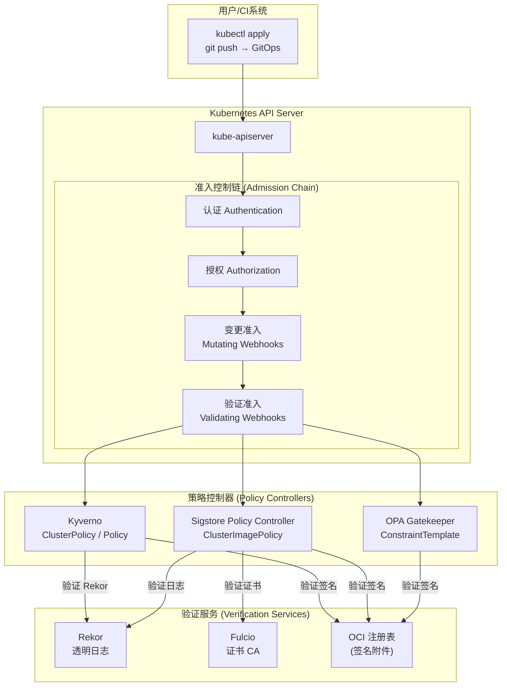
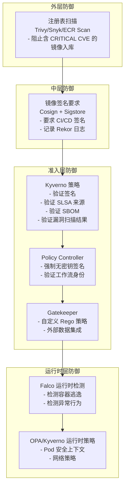

# Policy Controller 镜像验证 (Policy Controller Image Verification)

## 概述 (Overview)

Policy Controller 是 Kubernetes 准入控制层的核心组件，通过拦截 Pod 创建请求来验证容器镜像的签名、证明和安全策略。本文档涵盖 Kyverno 镜像验证、Sigstore Policy Controller、OPA Gatekeeper 签名验证等多种实现方案，以及多集群策略的最佳实践。

---

## 1. 镜像验证架构全景 (Image Verification Architecture Overview)

### 1.1 准入控制流程 (Admission Control Flow)



### 1.2 策略决策矩阵 (Policy Decision Matrix)

| 场景 | Kyverno | Sigstore Policy Controller | OPA Gatekeeper |
|------|---------|--------------------------|----------------|
| 镜像签名验证 | ✅ 原生支持 | ✅ 核心功能 | ✅ 通过外部数据 |
| SBOM 验证 | ✅ 支持 | ✅ 支持 | ⚠️ 需自定义 |
| SLSA 来源验证 | ✅ 支持 | ✅ 支持 | ⚠️ 需自定义 |
| 策略异常管理 | ✅ PolicyException | ✅ 通过命名空间选择器 | ✅ ConstraintExclusion |
| 多集群策略 | ✅ KyvCLI + GitOps | ✅ 支持 | ✅ 支持 |
| 审计模式 | ✅ Audit | ✅ Warn/Enforce | ✅ DryRun |
| 策略测试 | ✅ kyverno test | ⚠️ 有限支持 | ✅ Rego test |
| 学习曲线 | 中等（YAML） | 低（YAML） | 高（Rego） |

---

## 2. Kyverno 镜像验证 (Kyverno Image Verification)

### 2.1 安装 Kyverno (Installing Kyverno)

```bash
# 使用 Helm 安装 Kyverno
helm repo add kyverno https://kyverno.github.io/kyverno/
helm repo update

# 安装 Kyverno（生产配置）
helm install kyverno kyverno/kyverno \
  --namespace kyverno \
  --create-namespace \
  --version 3.1.4 \
  --set admissionController.replicas=3 \
  --set backgroundController.replicas=2 \
  --set cleanupController.replicas=1 \
  --set reportsController.replicas=1 \
  --set admissionController.resources.requests.cpu=500m \
  --set admissionController.resources.requests.memory=512Mi \
  --set admissionController.resources.limits.cpu=2000m \
  --set admissionController.resources.limits.memory=2Gi \
  --set features.policyExceptions.enabled=true \
  --set features.policyExceptions.namespace=kyverno \
  --set config.webhookMatchConditions=true

# 验证安装
kubectl get pods -n kyverno
kubectl get crd | grep kyverno
```

### 2.2 基础镜像签名验证策略 (Basic Image Signature Verification Policy)

```yaml
# kyverno-verify-image-basic.yaml
apiVersion: kyverno.io/v1
kind: ClusterPolicy
metadata:
  name: verify-image-signatures
  annotations:
    policies.kyverno.io/title: 验证镜像签名
    policies.kyverno.io/category: Software Supply Chain Security
    policies.kyverno.io/severity: high
    policies.kyverno.io/description: >-
      验证所有容器镜像必须由 GitHub Actions CI/CD 流水线签名，
      使用 Sigstore 无密钥签名机制。

spec:
  validationFailureAction: Enforce   # 强制执行（Audit 为审计模式）
  background: true                    # 扫描现有资源

  rules:
    # 规则 1: 验证生产镜像签名
    - name: verify-production-images
      match:
        any:
          - resources:
              kinds: [Pod]
              namespaces:
                - production
                - staging
      
      verifyImages:
        # 主容器
        - imageReferences:
            - "ghcr.io/your-org/*"
          
          # 无密钥验证配置
          attestors:
            - count: 1
              entries:
                - keyless:
                    url: https://fulcio.sigstore.dev
                    issuer: https://token.actions.githubusercontent.com
                    subject: >-
                      https://github.com/your-org/*/github/workflows/release.yml@refs/tags/*
                    # 可选：使用正则表达式
                    # subjectRegExp: "^https://github.com/your-org/.*/.github/workflows/.*@refs/tags/v[0-9]+\\.[0-9]+\\.[0-9]+$"
                    rekor:
                      url: https://rekor.sigstore.dev
                      ignoreTlog: false
                    ctlog:
                      ignoreSCT: false

          # 验证后变更镜像引用为摘要（防止标签变更）
          mutateDigest: true
          # 验证摘要必须存在
          required: true
          # 仅验证签名，不修改 Image
          verifyDigest: true
```

### 2.3 高级镜像验证策略 (Advanced Image Verification Policy)

```yaml
# kyverno-verify-image-advanced.yaml
apiVersion: kyverno.io/v1
kind: ClusterPolicy
metadata:
  name: verify-image-supply-chain
  annotations:
    policies.kyverno.io/title: 完整供应链验证
    policies.kyverno.io/category: Software Supply Chain Security
    policies.kyverno.io/severity: critical

spec:
  validationFailureAction: Enforce
  background: true

  rules:
    # ============================================================
    # 规则 1: 验证容器镜像签名
    # ============================================================
    - name: verify-image-signature
      match:
        any:
          - resources:
              kinds: [Pod]
              namespaces:
                - production
      
      exclude:
        any:
          - resources:
              namespaces:
                - kube-system
                - kyverno
      
      verifyImages:
        - imageReferences:
            - "ghcr.io/your-org/*"
          
          attestors:
            - count: 1
              entries:
                - keyless:
                    url: https://fulcio.sigstore.dev
                    issuer: https://token.actions.githubusercontent.com
                    subjectRegExp: "^https://github.com/your-org/[^/]+/.github/workflows/[^@]+@refs/tags/v[0-9]+\\.[0-9]+\\.[0-9]+$"
                    rekor:
                      url: https://rekor.sigstore.dev
          
          # 注解验证（确保镜像由生产流水线构建）
          attestations:
            - predicateType: https://cosign.sigstore.dev/attestation/v1
              conditions:
                - all:
                    - key: "{{ environment }}"
                      operator: Equals
                      value: "production"

          mutateDigest: true
          required: true

    # ============================================================
    # 规则 2: 验证 SLSA Level 3 来源证明
    # ============================================================
    - name: verify-slsa-provenance
      match:
        any:
          - resources:
              kinds: [Pod]
              namespaces:
                - production
      
      verifyImages:
        - imageReferences:
            - "ghcr.io/your-org/*"
          
          attestors:
            - count: 1
              entries:
                - keyless:
                    url: https://fulcio.sigstore.dev
                    issuer: https://token.actions.githubusercontent.com
                    subjectRegExp: "^https://github.com/slsa-framework/slsa-github-generator/.github/workflows/generator_container_slsa3.yml@refs/tags/v[0-9]+\\.[0-9]+\\.[0-9]+$"
                    rekor:
                      url: https://rekor.sigstore.dev
          
          attestations:
            - predicateType: https://slsa.dev/provenance/v0.2
              conditions:
                - all:
                    # 验证构建器 ID
                    - key: "{{ predicate.builder.id }}"
                      operator: Equals
                      value: "https://github.com/slsa-framework/slsa-github-generator/.github/workflows/generator_container_slsa3.yml@refs/tags/v1.10.0"
                    
                    # 验证源代码仓库
                    - key: "{{ predicate.invocation.configSource.uri }}"
                      operator: AnyIn
                      value:
                        - "git+https://github.com/your-org/app-one@refs/tags/v*"
                        - "git+https://github.com/your-org/app-two@refs/tags/v*"
                    
                    # 确保是从标签构建（非分支）
                    - key: "{{ predicate.invocation.environment.github_ref_type }}"
                      operator: Equals
                      value: "tag"

    # ============================================================
    # 规则 3: 验证 SBOM 证明存在
    # ============================================================
    - name: verify-sbom-attestation
      match:
        any:
          - resources:
              kinds: [Pod]
              namespaces:
                - production
      
      verifyImages:
        - imageReferences:
            - "ghcr.io/your-org/*"
          
          attestors:
            - count: 1
              entries:
                - keyless:
                    url: https://fulcio.sigstore.dev
                    issuer: https://token.actions.githubusercontent.com
                    subjectRegExp: "^https://github.com/your-org/.*"
                    rekor:
                      url: https://rekor.sigstore.dev
          
          attestations:
            - predicateType: https://spdx.dev/Document
              # 仅验证存在，不检查具体内容
              conditions: []

    # ============================================================
    # 规则 4: 验证漏洞扫描证明（无 CRITICAL 漏洞）
    # ============================================================
    - name: verify-no-critical-vulnerabilities
      match:
        any:
          - resources:
              kinds: [Pod]
              namespaces:
                - production
      
      verifyImages:
        - imageReferences:
            - "ghcr.io/your-org/*"
          
          attestors:
            - count: 1
              entries:
                - keyless:
                    url: https://fulcio.sigstore.dev
                    issuer: https://token.actions.githubusercontent.com
                    subjectRegExp: "^https://github.com/your-org/.*"
                    rekor:
                      url: https://rekor.sigstore.dev
          
          attestations:
            - predicateType: https://cosign.sigstore.dev/attestation/vuln/v1
              conditions:
                - all:
                    # 漏洞扫描结果中不能有 CRITICAL 漏洞
                    - key: "{{ predicate.scanner.result.Results[].Vulnerabilities[].Severity }}"
                      operator: NotIn
                      value: ["CRITICAL"]
```

### 2.4 基于公钥的验证策略 (Key-Based Verification Policy)

```yaml
# kyverno-verify-image-key.yaml
apiVersion: kyverno.io/v1
kind: ClusterPolicy
metadata:
  name: verify-image-with-key
  annotations:
    policies.kyverno.io/title: 使用公钥验证镜像签名
    policies.kyverno.io/severity: high

spec:
  validationFailureAction: Enforce
  background: true

  rules:
    - name: verify-with-cosign-key
      match:
        any:
          - resources:
              kinds: [Pod]
      
      verifyImages:
        - imageReferences:
            - "docker.io/your-org/*"
          
          attestors:
            - count: 1
              entries:
                # 使用静态公钥验证
                - keys:
                    publicKeys: |-
                      -----BEGIN PUBLIC KEY-----
                      MFkwEwYHKoZIzj0CAQYIKoZIzj0DAQcDQgAExxxxxxxxxxxxxxxxxxxxxxxxxx
                      xxxxxxxxxxxxxxxxxxxxxxxxxxxxxxxxxxxxxxxxxxxxxxxxxxxxxxxxxx
                      -----END PUBLIC KEY-----
                    
                    # 使用 KMS 密钥（AWS KMS）
                    # kms: "awskms:///arn:aws:kms:us-east-1:123456789:key/abc-def"
                    
                    # 签名算法
                    signatureAlgorithm: "sha256"
                    
                    # Rekor 配置
                    rekor:
                      url: https://rekor.sigstore.dev
                      pubkey: |-
                        -----BEGIN PUBLIC KEY-----
                        MFkwEwYHKoZIzj0CAQYIKoZIzj0DAQcDQgAE...
                        -----END PUBLIC KEY-----

          mutateDigest: true
          required: true

    # 使用证书验证（适用于企业 PKI）
    - name: verify-with-certificate
      match:
        any:
          - resources:
              kinds: [Pod]
              namespaces:
                - internal
      
      verifyImages:
        - imageReferences:
            - "registry.your-company.com/*"
          
          attestors:
            - count: 1
              entries:
                - certificates:
                    cert: |-
                      -----BEGIN CERTIFICATE-----
                      MIIBxxxxxxxxxxxxxxxxxxxxxxxxxxxxxxxxxxxxxxxxxxxxxx
                      -----END CERTIFICATE-----
                    
                    certChain: |-
                      -----BEGIN CERTIFICATE-----
                      MIIBxxxxxxxxxxxxxxxxxxxxxxxxxxxxxxxxxxxxxxxxxxxxxx
                      -----END CERTIFICATE-----
                    
                    rekor:
                      url: https://rekor.your-company.com
          
          mutateDigest: true
          required: true
```

### 2.5 Kyverno 策略异常 (Kyverno Policy Exceptions)

```yaml
# kyverno-policy-exception.yaml
apiVersion: kyverno.io/v2alpha1
kind: PolicyException
metadata:
  name: allow-legacy-app
  namespace: kyverno

spec:
  exceptions:
    - policyName: verify-image-signatures
      ruleNames:
        - verify-production-images
        - verify-slsa-provenance
  
  match:
    any:
      - resources:
          kinds: [Pod]
          namespaces:
            - legacy-namespace
          selector:
            matchLabels:
              app.kubernetes.io/name: legacy-app
  
  # 必填：异常原因和审批信息
  description: >-
    Legacy app in migration process to SLSA-compliant build.
    Exception valid until 2024-12-31.
    Approved by: security-team@company.com
    Ticket: SECURITY-1234

---
# 命名空间级别异常
apiVersion: kyverno.io/v2alpha1
kind: PolicyException
metadata:
  name: allow-dev-namespace
  namespace: kyverno

spec:
  exceptions:
    - policyName: verify-image-signatures
      ruleNames: ["*"]
  
  match:
    any:
      - resources:
          kinds: [Pod]
          namespaces:
            - development
            - dev-*
  
  conditions:
    any:
      # 只允许在工作时间内的开发命名空间
      - key: "{{ request.userInfo.username }}"
        operator: AnyIn
        value:
          - developer1
          - developer2
  
  description: "Development namespace exemption for developer testing"
```

---

## 3. Sigstore Policy Controller (Sigstore Policy Controller)

### 3.1 安装 Policy Controller (Installing Policy Controller)

```bash
# 使用 Helm 安装
helm repo add sigstore https://sigstore.github.io/helm-charts
helm repo update

helm install policy-controller sigstore/policy-controller \
  --namespace cosign-system \
  --create-namespace \
  --version 0.9.0 \
  --set webhook.replicaCount=3 \
  --set webhook.resources.requests.cpu=100m \
  --set webhook.resources.requests.memory=128Mi \
  --set webhook.resources.limits.cpu=1000m \
  --set webhook.resources.limits.memory=512Mi \
  --set cosign.timeout=10s

# 验证安装
kubectl get pods -n cosign-system
kubectl get clusterimagepolicy
kubectl get validatingwebhookconfiguration | grep cosign

# 检查 webhook 配置
kubectl describe validatingwebhookconfiguration policy.sigstore.dev
```

### 3.2 ClusterImagePolicy 基础配置 (ClusterImagePolicy Basic Configuration)

```yaml
# cluster-image-policy-basic.yaml
apiVersion: policy.sigstore.dev/v1beta1
kind: ClusterImagePolicy
metadata:
  name: require-signed-images

spec:
  # 匹配的镜像模式
  images:
    - glob: "ghcr.io/your-org/**"
    - glob: "registry.your-company.com/**"
  
  # 至少需要满足一个权威验证
  policy:
    # 匹配所有模式时可设置 fetchConfigFile: true
    fetchConfigFile: false
  
  # 验证权威列表
  authorities:
    # 权威 1: GitHub Actions 无密钥签名
    - name: github-actions-keyless
      keyless:
        url: https://fulcio.sigstore.dev
        identities:
          - issuer: https://token.actions.githubusercontent.com
            subject: "https://github.com/your-org/your-app/.github/workflows/release.yml@refs/tags/v1.0.0"
          - issuer: https://token.actions.githubusercontent.com
            subjectRegExp: "^https://github.com/your-org/[^/]+/.github/workflows/release\\.yml@refs/tags/v[0-9]+\\.[0-9]+\\.[0-9]+$"
      
      ctlog:
        url: https://rekor.sigstore.dev
        insecureIgnoreSCT: false

---
# cluster-image-policy-with-policy.yaml
apiVersion: policy.sigstore.dev/v1beta1
kind: ClusterImagePolicy
metadata:
  name: require-signed-with-attestation

spec:
  images:
    - glob: "ghcr.io/your-org/**"
  
  authorities:
    - name: keyless-with-attestation
      keyless:
        url: https://fulcio.sigstore.dev
        identities:
          - issuer: https://token.actions.githubusercontent.com
            subjectRegExp: "^https://github.com/your-org/.*"
      
      ctlog:
        url: https://rekor.sigstore.dev
      
      # 内联策略：使用 CUE 语言验证证明内容
      attestations:
        - name: must-have-sbom
          predicateType: https://spdx.dev/Document
          policy:
            type: cue
            data: |
              import "time"
              
              # 验证 SBOM 包含特定字段
              payload: {
                predicateType: "https://spdx.dev/Document"
                predicate: {
                  SPDXID: _
                  spdxVersion: =~"SPDX-[0-9]+\.[0-9]+"
                }
              }
        
        - name: must-have-slsa-provenance
          predicateType: https://slsa.dev/provenance/v0.2
          policy:
            type: cue
            data: |
              # 验证 SLSA 来源证明
              payload: {
                predicate: {
                  builder: {
                    id: =~"^https://github.com/slsa-framework/slsa-github-generator/.*@refs/tags/v[0-9]+\\.[0-9]+\\.[0-9]+"
                  }
                  invocation: {
                    environment: {
                      github_ref_type: "tag"
                    }
                  }
                }
              }
        
        - name: no-critical-vulns
          predicateType: https://cosign.sigstore.dev/attestation/vuln/v1
          policy:
            type: cue
            data: |
              # 验证无 CRITICAL 漏洞
              payload: {
                predicate: {
                  scanner: {
                    result: {
                      Results: [...{
                        Vulnerabilities: [...{
                          Severity: != "CRITICAL"
                        }]
                      }]
                    }
                  }
                }
              }
```

### 3.3 命名空间级别策略控制 (Namespace-Level Policy Control)

```yaml
# namespace-policy-opt-out.yaml
# 命名空间可以选择退出特定策略（需要有权限）

apiVersion: v1
kind: Namespace
metadata:
  name: development
  labels:
    # 禁用 Policy Controller 的验证
    policy.sigstore.dev/include: "false"

---
# 或者使用注解选择特定策略
apiVersion: v1
kind: Namespace
metadata:
  name: staging
  annotations:
    # 只在 staging 中启用警告模式（不阻止部署）
    policy.sigstore.dev/warn: "require-signed-images"

---
# 选择性启用：只有带有特定标签的命名空间才验证
apiVersion: policy.sigstore.dev/v1beta1
kind: ClusterImagePolicy
metadata:
  name: production-only-policy

spec:
  images:
    - glob: "ghcr.io/your-org/**"
  
  # 只在带有 env=production 标签的命名空间中执行
  match:
    namespaceSelector:
      matchLabels:
        environment: production
  
  authorities:
    - name: keyless
      keyless:
        url: https://fulcio.sigstore.dev
        identities:
          - issuer: https://token.actions.githubusercontent.com
            subjectRegExp: ".*"
      ctlog:
        url: https://rekor.sigstore.dev
```

---

## 4. OPA Gatekeeper 签名验证 (OPA Gatekeeper Signature Verification)

### 4.1 安装 Gatekeeper (Installing Gatekeeper)

```bash
# 使用 Helm 安装 OPA Gatekeeper
helm repo add gatekeeper https://open-policy-agent.github.io/gatekeeper/charts
helm repo update

helm install gatekeeper gatekeeper/gatekeeper \
  --namespace gatekeeper-system \
  --create-namespace \
  --version 3.15.0 \
  --set replicas=3 \
  --set auditInterval=60 \
  --set constraintViolationsLimit=20 \
  --set enableExternalData=true \
  --set externaldata.enabled=true

# 验证安装
kubectl get pods -n gatekeeper-system
kubectl get constrainttemplate
```

### 4.2 外部数据提供者配置 (External Data Provider Configuration)

```yaml
# gatekeeper-external-data-provider.yaml
# 部署自定义外部数据提供者，用于调用 cosign 验证

---
# ExternalData 提供者定义
apiVersion: externaldata.gatekeeper.sh/v1beta1
kind: Provider
metadata:
  name: cosign-verification-provider

spec:
  url: https://cosign-provider.gatekeeper-system.svc:8090/verify
  timeout: 30
  caBundle: <BASE64_CA_CERT>

---
# 部署 cosign 验证服务
apiVersion: apps/v1
kind: Deployment
metadata:
  name: cosign-provider
  namespace: gatekeeper-system

spec:
  replicas: 2
  selector:
    matchLabels:
      app: cosign-provider
  
  template:
    metadata:
      labels:
        app: cosign-provider
    spec:
      serviceAccountName: cosign-provider
      
      containers:
        - name: cosign-provider
          image: your-org/cosign-gatekeeper-provider:v1.0.0
          ports:
            - containerPort: 8090
          
          env:
            - name: COSIGN_OIDC_ISSUER
              value: "https://token.actions.githubusercontent.com"
            - name: COSIGN_SUBJECT_REGEXP
              value: "^https://github.com/your-org/.*"
            - name: REKOR_URL
              value: "https://rekor.sigstore.dev"
          
          volumeMounts:
            - name: tls
              mountPath: /tls
              readOnly: true
      
      volumes:
        - name: tls
          secret:
            secretName: cosign-provider-tls
```

### 4.3 Gatekeeper ConstraintTemplate (Gatekeeper ConstraintTemplate)

```yaml
# gatekeeper-constraint-template.yaml
apiVersion: templates.gatekeeper.sh/v1
kind: ConstraintTemplate
metadata:
  name: requiresignedimages

spec:
  crd:
    spec:
      names:
        kind: RequireSignedImages
      
      validation:
        openAPIV3Schema:
          type: object
          properties:
            allowedRegistries:
              type: array
              items:
                type: string
            exemptImages:
              type: array
              items:
                type: string
            signingAuthority:
              type: string

  targets:
    - target: admission.k8s.gatekeeper.sh
      rego: |
        package requiresignedimages
        
        import future.keywords.in
        import future.keywords.if
        
        # 违规消息
        violation[{"msg": msg, "details": {"image": image}}] {
          container := input.review.object.spec.containers[_]
          image := container.image
          
          # 检查是否在豁免列表中
          not is_exempt(image)
          
          # 检查镜像是否来自允许的注册表
          not is_allowed_registry(image)
          
          msg := sprintf("Image '%v' is not from an allowed registry", [image])
        }
        
        violation[{"msg": msg, "details": {"image": image}}] {
          container := input.review.object.spec.containers[_]
          image := container.image
          
          # 检查是否在豁免列表中
          not is_exempt(image)
          
          # 检查镜像是否通过签名验证
          not is_signed(image)
          
          msg := sprintf("Image '%v' is not signed or signature verification failed", [image])
        }
        
        # 检查镜像是否已签名（通过外部数据提供者）
        is_signed(image) {
          response := external_data({
            "provider": "cosign-verification-provider",
            "keys": [image]
          })
          response.responses[image].verified == true
        }
        
        # 检查是否在豁免列表
        is_exempt(image) {
          image in input.parameters.exemptImages
        }
        
        # 检查注册表是否被允许
        is_allowed_registry(image) {
          registry := input.parameters.allowedRegistries[_]
          startswith(image, registry)
        }
        
        # 检查 init 容器
        violation[{"msg": msg}] {
          container := input.review.object.spec.initContainers[_]
          image := container.image
          not is_exempt(image)
          not is_signed(image)
          msg := sprintf("Init container image '%v' is not signed", [image])
        }
        
        # 检查 ephemeral 容器
        violation[{"msg": msg}] {
          container := input.review.object.spec.ephemeralContainers[_]
          image := container.image
          not is_exempt(image)
          not is_signed(image)
          msg := sprintf("Ephemeral container image '%v' is not signed", [image])
        }

---
# 应用约束
apiVersion: constraints.gatekeeper.sh/v1beta1
kind: RequireSignedImages
metadata:
  name: require-signed-images-production

spec:
  enforcementAction: deny  # deny / warn / dryrun
  
  match:
    kinds:
      - apiGroups: [""]
        kinds: ["Pod"]
    namespaces:
      - production
      - staging
    excludedNamespaces:
      - kube-system
      - gatekeeper-system
  
  parameters:
    allowedRegistries:
      - "ghcr.io/your-org/"
      - "registry.your-company.com/"
    
    exemptImages:
      - "gcr.io/distroless/static-debian12:nonroot"
    
    signingAuthority: "github-actions-keyless"
```

---

## 5. 多集群策略管理 (Multi-Cluster Policy Management)

### 5.1 集中式策略仓库结构 (Centralized Policy Repository Structure)

```
policy-repo/
├── base/
│   ├── kyverno/
│   │   ├── cluster-policies/
│   │   │   ├── verify-signatures.yaml
│   │   │   ├── verify-slsa.yaml
│   │   │   └── verify-sbom.yaml
│   │   └── policy-exceptions/
│   │       └── legacy-apps.yaml
│   └── sigstore/
│       └── cluster-image-policies/
│           ├── production-policy.yaml
│           └── staging-policy.yaml
│
├── overlays/
│   ├── prod-us-east/
│   │   ├── kustomization.yaml
│   │   └── patches/
│   │       └── stricter-enforcement.yaml
│   ├── prod-eu-west/
│   │   ├── kustomization.yaml
│   │   └── patches/
│   │       └── eu-compliance.yaml
│   └── staging/
│       ├── kustomization.yaml
│       └── patches/
│           └── audit-mode.yaml
│
└── fleet/
    └── fleet.yaml  # Fleet 多集群配置
```

### 5.2 Kustomize 策略覆盖 (Kustomize Policy Overlays)

```yaml
# overlays/prod-us-east/kustomization.yaml
apiVersion: kustomize.config.k8s.io/v1beta1
kind: Kustomization

namespace: kyverno

resources:
  - ../../base/kyverno/cluster-policies/
  - ../../base/kyverno/policy-exceptions/

patches:
  # 增强生产环境的验证要求
  - path: patches/stricter-enforcement.yaml
    target:
      kind: ClusterPolicy
      name: verify-image-signatures

  # 特定于 US-East 的镜像仓库
  - patch: |-
      - op: add
        path: /spec/rules/0/verifyImages/0/imageReferences/-
        value: "us-east1-docker.pkg.dev/your-project/**"
    target:
      kind: ClusterPolicy
      name: verify-image-signatures

configMapGenerator:
  - name: policy-config
    literals:
      - region=us-east-1
      - environment=production
      - strictMode=true

---
# overlays/prod-us-east/patches/stricter-enforcement.yaml
apiVersion: kyverno.io/v1
kind: ClusterPolicy
metadata:
  name: verify-image-signatures
spec:
  # 严格模式：所有规则都必须通过
  validationFailureAction: Enforce
  failurePolicy: Fail
```

### 5.3 Argo CD 多集群策略同步 (Argo CD Multi-Cluster Policy Sync)

```yaml
# argocd-policy-app.yaml
apiVersion: argoproj.io/v1alpha1
kind: ApplicationSet
metadata:
  name: security-policies
  namespace: argocd

spec:
  generators:
    # 从集群列表生成应用
    - clusters:
        selector:
          matchLabels:
            security-policies: enabled
  
  template:
    metadata:
      name: "security-policies-{{name}}"
      namespace: argocd
      annotations:
        notifications.argoproj.io/subscribe.on-sync-succeeded.slack: security-channel
        notifications.argoproj.io/subscribe.on-sync-failed.pagerduty: security-oncall
    
    spec:
      project: security
      
      source:
        repoURL: https://github.com/your-org/policy-repo
        targetRevision: main
        path: "overlays/{{metadata.labels.environment}}"
        kustomize:
          version: v5.3.0
      
      destination:
        server: "{{server}}"
        namespace: kyverno
      
      syncPolicy:
        automated:
          prune: false    # 不自动删除策略
          selfHeal: true  # 自动修复策略漂移
        
        syncOptions:
          - CreateNamespace=true
          - ApplyOutOfSyncOnly=true
          - RespectIgnoreDifferences=true
        
        retry:
          limit: 5
          backoff:
            duration: 5s
            factor: 2
            maxDuration: 3m
      
      # 忽略运行时状态差异
      ignoreDifferences:
        - group: kyverno.io
          kind: ClusterPolicy
          jqPathExpressions:
            - .status
        - group: policy.sigstore.dev
          kind: ClusterImagePolicy
          jqPathExpressions:
            - .status

---
# RBAC 配置：允许 Argo CD 管理策略
apiVersion: rbac.authorization.k8s.io/v1
kind: ClusterRole
metadata:
  name: argocd-policy-manager

rules:
  - apiGroups: ["kyverno.io"]
    resources: ["clusterpolicies", "policies", "policyexceptions"]
    verbs: ["get", "list", "watch", "create", "update", "patch", "delete"]
  
  - apiGroups: ["policy.sigstore.dev"]
    resources: ["clusterimagepolicies"]
    verbs: ["get", "list", "watch", "create", "update", "patch", "delete"]
  
  - apiGroups: ["constraints.gatekeeper.sh", "templates.gatekeeper.sh"]
    resources: ["*"]
    verbs: ["get", "list", "watch", "create", "update", "patch", "delete"]
```

---

## 6. 策略测试与验证 (Policy Testing and Validation)

### 6.1 Kyverno CLI 测试 (Kyverno CLI Testing)

```bash
# 安装 Kyverno CLI
kubectl kyverno version  # 如果通过 kubectl plugin 安装
# 或
kyverno version

# 测试策略（不需要集群）
kyverno test . --test-case-selector "scenario=pass"

# 测试特定策略文件
kyverno apply verify-image-signatures.yaml \
  --resource test-pod.yaml \
  --verbose
```

```yaml
# test/kyverno-test.yaml - Kyverno CLI 测试配置
name: verify-image-signatures-test

policies:
  - ../../base/kyverno/cluster-policies/verify-signatures.yaml

resources:
  - test-pods/

results:
  # 测试 1: 来自受信任注册表的签名镜像应通过
  - policy: verify-image-signatures
    rule: verify-production-images
    resource: signed-image-pod
    namespace: production
    result: pass
  
  # 测试 2: 未签名镜像应被拒绝
  - policy: verify-image-signatures
    rule: verify-production-images
    resource: unsigned-image-pod
    namespace: production
    result: fail
  
  # 测试 3: 开发命名空间应通过（豁免）
  - policy: verify-image-signatures
    rule: verify-production-images
    resource: unsigned-image-pod
    namespace: development
    result: pass  # 因为开发命名空间被排除

---
# test/test-pods/signed-image-pod.yaml
apiVersion: v1
kind: Pod
metadata:
  name: signed-image-pod
  namespace: production
spec:
  containers:
    - name: app
      image: ghcr.io/your-org/your-app:v1.0.0

---
# test/test-pods/unsigned-image-pod.yaml
apiVersion: v1
kind: Pod
metadata:
  name: unsigned-image-pod
  namespace: production
spec:
  containers:
    - name: app
      image: docker.io/library/nginx:latest  # 未签名
```

### 6.2 策略评估工具 (Policy Evaluation Tools)

```bash
# 使用 kubectl dry-run 测试策略效果
kubectl apply \
  --dry-run=server \
  --validate=true \
  -f test-deployment.yaml

# 查看 Kyverno 策略报告
kubectl get policyreport --all-namespaces
kubectl get clusterpolicyreport
kubectl describe policyreport -n production

# 查看违规详情
kubectl get policyreport -n production -o json | \
  jq '.items[].results[] | select(.result == "fail") | {
    policy: .policy,
    rule: .rule,
    resource: .resources[].name,
    message: .message
  }'

# 检查 Policy Controller 状态
kubectl get clusterimagepolicy -o wide
kubectl describe clusterimagepolicy require-signed-images

# 测试 Policy Controller（需要实际集群）
# 尝试部署未签名镜像
kubectl run test-unsigned \
  --image=docker.io/library/nginx:latest \
  --namespace=production \
  --dry-run=server

# 应该收到类似以下错误：
# Error from server: admission webhook "policy.sigstore.dev" denied the request:
# image docker.io/library/nginx:latest not signed
```

---

## 7. 准入控制器调试与故障排查 (Admission Controller Debugging and Troubleshooting)

### 7.1 Kyverno 故障排查 (Kyverno Troubleshooting)

```bash
# 查看 Kyverno 准入控制器日志
kubectl logs -n kyverno \
  -l app.kubernetes.io/component=admission-controller \
  --tail=100 \
  -f

# 查看后台控制器日志
kubectl logs -n kyverno \
  -l app.kubernetes.io/component=background-controller \
  --tail=100

# 查看策略报告
kubectl get policyreport -A
kubectl get clusterpolicyreport

# 查看违规详情
kubectl get policyreport -n default -o yaml | \
  yq '.results[] | select(.result == "fail")'

# 检查 webhook 配置
kubectl get validatingwebhookconfiguration \
  kyverno-resource-validating-webhook-cfg \
  -o yaml

# 调试特定 Pod 的策略评估
kubectl kyverno apply policy.yaml \
  --resource pod.yaml \
  --detailed-results

# 查看策略条件评估
kubectl annotate pods my-pod \
  policies.kyverno.io/debug=true \
  -n production

# 强制重新评估所有资源
kubectl annotate ns production \
  policies.kyverno.io/resync=true

# 检查 Kyverno 配置
kubectl get cm kyverno -n kyverno -o yaml
```

### 7.2 Policy Controller 故障排查 (Policy Controller Troubleshooting)

```bash
# 查看 Policy Controller 日志
kubectl logs -n cosign-system \
  -l app=policy-controller-webhook \
  --tail=200 \
  -f

# 检查证书是否有效
kubectl get secret policy-controller-webhook-cert \
  -n cosign-system \
  -o jsonpath='{.data.tls\.crt}' | \
  base64 -d | \
  openssl x509 -text -noout | \
  grep -E "Not Before|Not After"

# 手动测试镜像验证
# 在 Policy Controller 容器中运行 cosign
kubectl exec -n cosign-system \
  -it $(kubectl get pods -n cosign-system -l app=policy-controller-webhook -o name | head -1) \
  -- cosign verify \
    --certificate-oidc-issuer "https://token.actions.githubusercontent.com" \
    --certificate-identity-regexp ".*" \
    ghcr.io/your-org/your-app:v1.0.0

# 查看 ClusterImagePolicy 状态
kubectl get clusterimagepolicy -o wide
kubectl describe clusterimagepolicy require-signed-images

# 检查 webhook 是否正常工作
kubectl get events --field-selector reason=PolicyViolation -n production

# 临时禁用 webhook（紧急情况）
kubectl patch validatingwebhookconfiguration \
  policy.sigstore.dev \
  --type='json' \
  -p='[{"op": "replace", "path": "/webhooks/0/failurePolicy", "value": "Ignore"}]'

# 恢复 webhook 策略
kubectl patch validatingwebhookconfiguration \
  policy.sigstore.dev \
  --type='json' \
  -p='[{"op": "replace", "path": "/webhooks/0/failurePolicy", "value": "Fail"}]'
```

### 7.3 常见问题解决方案 (Common Issue Solutions)

```bash
# 问题 1: webhook timeout
# 症状：Pod 创建超时
# 解决：
helm upgrade policy-controller sigstore/policy-controller \
  --namespace cosign-system \
  --set webhook.failurePolicy=Ignore  # 临时设置为 Ignore
  
# 优化：增加 webhook 超时时间
kubectl patch validatingwebhookconfiguration policy.sigstore.dev \
  --type='json' \
  -p='[{"op": "replace", "path": "/webhooks/0/timeoutSeconds", "value": 30}]'

# 问题 2: 私有注册表中的签名验证失败
# 症状：Error pulling signature from registry
# 解决：配置注册表认证
cat > registry-secret.yaml << 'EOF'
apiVersion: v1
kind: Secret
metadata:
  name: registry-credentials
  namespace: cosign-system
type: kubernetes.io/dockerconfigjson
data:
  .dockerconfigjson: <BASE64_DOCKER_CONFIG>
EOF

kubectl apply -f registry-secret.yaml

# 将 secret 添加到 Policy Controller serviceaccount
kubectl patch serviceaccount policy-controller \
  -n cosign-system \
  --patch '{"imagePullSecrets": [{"name": "registry-credentials"}]}'

# 问题 3: Kyverno 策略规则冲突
# 症状：Pod 创建失败，但错误消息不清晰
# 解决：启用详细日志
kubectl patch cm kyverno -n kyverno \
  --type merge \
  --patch '{"data":{"log.level":"5"}}'

# 重启 Kyverno
kubectl rollout restart deploy -n kyverno

# 查看详细日志
kubectl logs -n kyverno -l app.kubernetes.io/component=admission-controller \
  --tail=50 | grep -E "DENIED|ERROR|verifyImage"
```

---

## 8. 策略监控与报告 (Policy Monitoring and Reporting)

### 8.1 Prometheus 策略指标 (Prometheus Policy Metrics)

```yaml
# prometheus-kyverno-rules.yaml
apiVersion: monitoring.coreos.com/v1
kind: PrometheusRule
metadata:
  name: kyverno-policy-alerts
  namespace: monitoring

spec:
  groups:
    - name: kyverno.rules
      interval: 30s
      rules:
        # 记录违规数量
        - record: kyverno:policy_violations:count
          expr: sum(kyverno_policy_results_total{policy_result="fail"}) by (policy_name, rule_name, namespace)

        # 告警：违规数量突增
        - alert: KyvernoPolicyViolationSpike
          expr: |
            rate(kyverno_policy_results_total{policy_result="fail"}[5m]) > 10
          for: 5m
          labels:
            severity: warning
          annotations:
            summary: "Kyverno 策略违规数量突增"
            description: "策略 {{ $labels.policy_name }} 在过去 5 分钟内违规超过 10 次"

        # 告警：关键策略违规（供应链签名）
        - alert: SignatureVerificationFailure
          expr: |
            sum(kyverno_policy_results_total{
              policy_result="fail",
              policy_name=~"verify-image.*"
            }) > 0
          for: 1m
          labels:
            severity: critical
          annotations:
            summary: "镜像签名验证失败"
            description: "检测到未签名或签名无效的镜像部署尝试"
            runbook: "https://wiki.your-company.com/security/unsigned-image-runbook"

        # 告警：Kyverno webhook 不可用
        - alert: KyvernoWebhookDown
          expr: up{job="kyverno"} == 0
          for: 5m
          labels:
            severity: critical
          annotations:
            summary: "Kyverno webhook 不可用"
            description: "策略执行 webhook 已停止响应，安全控制可能失效"
```

### 8.2 策略合规性仪表板 (Policy Compliance Dashboard)

```yaml
# grafana-dashboard-kyverno.yaml
apiVersion: v1
kind: ConfigMap
metadata:
  name: grafana-kyverno-dashboard
  namespace: monitoring
  labels:
    grafana_dashboard: "1"

data:
  kyverno-compliance.json: |
    {
      "title": "Kyverno Policy Compliance",
      "panels": [
        {
          "title": "总体合规率",
          "type": "stat",
          "targets": [
            {
              "expr": "sum(kyverno_policy_results_total{policy_result='pass'}) / sum(kyverno_policy_results_total) * 100",
              "legendFormat": "Compliance Rate %"
            }
          ]
        },
        {
          "title": "镜像签名验证失败（按命名空间）",
          "type": "bargauge",
          "targets": [
            {
              "expr": "sum(kyverno_policy_results_total{policy_result='fail', policy_name=~'verify-image.*'}) by (namespace)",
              "legendFormat": "{{namespace}}"
            }
          ]
        },
        {
          "title": "策略违规时间线",
          "type": "graph",
          "targets": [
            {
              "expr": "rate(kyverno_policy_results_total{policy_result='fail'}[5m])",
              "legendFormat": "{{policy_name}} - {{rule_name}}"
            }
          ]
        }
      ]
    }
```

---

## 9. 零信任镜像准入架构 (Zero Trust Image Admission Architecture)

### 9.1 分层防御模型 (Defense-in-Depth Model)



### 9.2 完整准入控制配置示例 (Complete Admission Control Configuration)

```yaml
# zero-trust-admission.yaml
# 零信任完整策略套件

---
# 策略 1: 仅允许来自受信任注册表的镜像
apiVersion: kyverno.io/v1
kind: ClusterPolicy
metadata:
  name: allowed-image-registries
spec:
  validationFailureAction: Enforce
  background: true
  rules:
    - name: check-image-registry
      match:
        any:
          - resources:
              kinds: [Pod]
      exclude:
        any:
          - resources:
              namespaces: [kube-system, kyverno, cosign-system]
      validate:
        message: "Image must be from an approved registry"
        deny:
          conditions:
            any:
              - key: "{{ images.containers.*.registry }}"
                operator: AnyNotIn
                value:
                  - "ghcr.io/your-org"
                  - "registry.your-company.com"
                  - "gcr.io/distroless"
                  - "gcr.io/google-containers"

---
# 策略 2: 禁止使用 latest 标签
apiVersion: kyverno.io/v1
kind: ClusterPolicy
metadata:
  name: disallow-latest-tag
spec:
  validationFailureAction: Enforce
  background: true
  rules:
    - name: check-image-tag
      match:
        any:
          - resources:
              kinds: [Pod]
              namespaces: [production, staging]
      validate:
        message: "Using 'latest' tag is not allowed in production/staging"
        deny:
          conditions:
            any:
              - key: "{{ images.containers.*.tag }}"
                operator: AnyIn
                value: ["latest", ""]

---
# 策略 3: 要求使用镜像摘要（防止标签变更攻击）
apiVersion: kyverno.io/v1
kind: ClusterPolicy
metadata:
  name: require-image-digest
spec:
  validationFailureAction: Enforce
  background: true
  rules:
    - name: check-image-digest
      match:
        any:
          - resources:
              kinds: [Pod]
              namespaces: [production]
      validate:
        message: "Image must be referenced by digest in production"
        deny:
          conditions:
            any:
              - key: "{{ images.containers.*.digest }}"
                operator: AnyNotIn
                value:
                  - "?*"  # 必须非空

---
# 策略 4: 强制 Pod 安全上下文
apiVersion: kyverno.io/v1
kind: ClusterPolicy
metadata:
  name: require-pod-security-context
spec:
  validationFailureAction: Enforce
  background: true
  rules:
    - name: require-non-root
      match:
        any:
          - resources:
              kinds: [Pod]
              namespaces: [production]
      validate:
        message: "Containers must run as non-root user"
        deny:
          conditions:
            any:
              - key: "{{ request.object.spec.containers[].securityContext.runAsRoot || false }}"
                operator: AnyIn
                value: [true]
              - key: "{{ request.object.spec.securityContext.runAsNonRoot || true }}"
                operator: AnyIn
                value: [false]
```

---

## 10. 策略即代码最佳实践 (Policy-as-Code Best Practices)

### 10.1 策略版本管理 (Policy Version Management)

```bash
# Git 工作流用于策略变更

# 1. 创建策略分支
git checkout -b feature/add-sbom-verification

# 2. 编写策略
# ... 编辑 policy.yaml ...

# 3. 本地测试
kyverno test . --detailed-results

# 4. 在审计模式下测试
# 先设置为 Audit，观察违规情况
sed 's/Enforce/Audit/' policy.yaml | \
  kubectl apply -f - --dry-run=server

# 5. 代码审查 (PR)
git push origin feature/add-sbom-verification
gh pr create --title "Add SBOM verification policy" \
  --body "Required approvals from security-team"

# 6. 暂存环境测试
# GitOps 自动部署到 staging 集群

# 7. 生产部署
# 合并 PR 后，GitOps 自动部署到生产集群

# 8. 策略变更记录
git log --follow -p -- policies/verify-sbom.yaml
```

### 10.2 策略门控流水线 (Policy Gate Pipeline)

```yaml
# .github/workflows/policy-validation.yml
name: Policy Validation Pipeline

on:
  pull_request:
    paths:
      - 'policies/**'
      - 'test/**'

jobs:
  validate-policies:
    runs-on: ubuntu-latest
    steps:
      - uses: actions/checkout@v4

      - name: Install Kyverno CLI
        run: |
          curl -sSfL https://github.com/kyverno/kyverno/releases/latest/download/kyverno-cli_linux_x86_64.tar.gz | \
            tar xz && mv kyverno /usr/local/bin/

      - name: Lint policies
        run: |
          # 检查 YAML 语法
          find policies/ -name "*.yaml" -exec \
            kyverno apply {} --dry-run \;

      - name: Run policy tests
        run: |
          kyverno test ./test/ --detailed-results --fail-fast

      - name: Check policy coverage
        run: |
          # 确保每个策略都有对应的测试
          for POLICY in policies/*.yaml; do
            NAME=$(grep "name:" $POLICY | head -1 | awk '{print $2}')
            if ! ls test/cases/${NAME}* 2>/dev/null; then
              echo "❌ Missing test case for policy: $NAME"
              exit 1
            fi
          done
          echo "✅ All policies have test cases"

      - name: Validate against production resources
        run: |
          # 可选：从生产集群获取资源并验证（只读）
          kubectl get pods --all-namespaces -o yaml | \
            kyverno apply policies/ --resource - \
              --detailed-results \
              --audit-warn
```

---

## 11. 参考资料与扩展阅读 (References and Further Reading)

### 11.1 官方文档

| 资源 | URL |
|------|-----|
| Kyverno 文档 | https://kyverno.io/docs/ |
| Kyverno 镜像验证 | https://kyverno.io/docs/writing-policies/verify-images/ |
| Sigstore Policy Controller | https://docs.sigstore.dev/policy-controller/overview/ |
| OPA Gatekeeper | https://open-policy-agent.github.io/gatekeeper/website/ |
| Kubernetes 准入控制 | https://kubernetes.io/docs/reference/access-authn-authz/admission-controllers/ |

### 11.2 安全标准参考

- **NIST SP 800-204D**: DevSecOps 工具链安全指南
- **CIS Kubernetes Benchmark**: 包含镜像来源验证要求
- **SLSA Framework**: 供应链安全级别规范
- **OpenSSF Secure Supply Chain Consumption Framework (S2C2F)**

---

## 总结 (Summary)

Policy Controller 镜像验证是 Kubernetes 供应链安全的最后一道防线：

1. **Kyverno 镜像验证**: 灵活的 YAML 策略，支持无密钥/密钥/证书验证
2. **SLSA 来源证明验证**: 确保镜像来自 SLSA Level 3 构建器
3. **SBOM 证明验证**: 验证软件物料清单的存在
4. **漏洞扫描证明**: 阻止部署含已知漏洞的镜像
5. **Sigstore Policy Controller**: 专注于 Sigstore 生态的策略执行
6. **OPA Gatekeeper**: 灵活的 Rego 策略语言，适合复杂场景
7. **多集群管理**: 通过 GitOps (Argo CD) 统一管理多集群策略
8. **策略异常**: 灵活的豁免机制，兼顾安全与业务灵活性
9. **策略测试**: kyverno test 确保策略准确性
10. **监控告警**: Prometheus + Grafana 实现策略违规的实时监控

通过分层防御和策略即代码，组织可以：
- 防止未签名或恶意镜像部署到生产环境
- 建立可审计的镜像准入控制记录
- 实现供应链安全策略的自动化执行
- 在不同环境（开发/测试/生产）应用差异化策略
