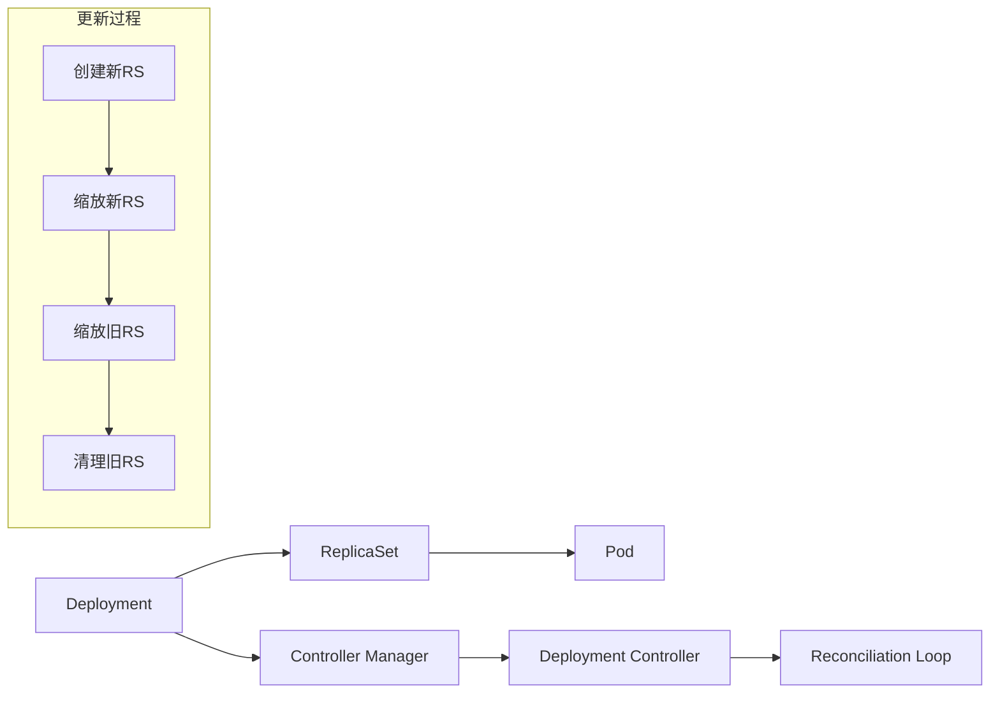

# 02 - Deployment 生产模式与最佳实践 (Deployment Production Patterns)

> **适用版本**: v1.25 - v1.32 | **最后更新**: 2026-02 | **参考**: [Kubernetes Deployment](https://kubernetes.io/docs/concepts/workloads/controllers/deployment/)

## Deployment 核心架构解析

### 1. Deployment 控制链路



### 2. 生产级 Deployment 模板库

#### 2.1 标准 Web 应用模板

```yaml
apiVersion: apps/v1
kind: Deployment
metadata:
  name: web-application
  namespace: production
  labels:
    app: web-application
    version: v1.2.3
    tier: frontend
    env: production
  annotations:
    kubernetes.io/change-cause: "Release v1.2.3 - 性能优化和安全补丁"
    deployment.kubernetes.io/revision: "15"
spec:
  # 基础配置
  replicas: 6
  revisionHistoryLimit: 20  # 保留更多历史版本用于回滚
  progressDeadlineSeconds: 600  # 10分钟部署超时
  
  # 更新策略
  strategy:
    type: RollingUpdate
    rollingUpdate:
      maxSurge: 2           # 允许超出2个副本(约33%)
      maxUnavailable: 1     # 最多1个不可用
  
  # 选择器
  selector:
    matchLabels:
      app: web-application
  
  # Pod 模板
  template:
    metadata:
      labels:
        app: web-application
        version: v1.2.3
        tier: frontend
        env: production
      annotations:
        prometheus.io/scrape: "true"
        prometheus.io/port: "9090"
        prometheus.io/path: "/metrics"
        checksum/config: "sha256:abcdef123456..."
    
    spec:
      # 服务账户
      serviceAccountName: web-app-sa
      
      # 优先级类
      priorityClassName: high-priority
      
      # 节点选择
      nodeSelector:
        node-type: web-server
        kubernetes.io/arch: amd64
      
      # 污点容忍
      tolerations:
      - key: dedicated
        operator: Equal
        value: web-tier
        effect: NoSchedule
      - key: node.kubernetes.io/not-ready
        operator: Exists
        effect: NoExecute
        tolerationSeconds: 300
      
      # 拓扑分布约束
      topologySpreadConstraints:
      - maxSkew: 1
        topologyKey: topology.kubernetes.io/zone
        whenUnsatisfiable: DoNotSchedule
        labelSelector:
          matchLabels:
            app: web-application
      - maxSkew: 1
        topologyKey: kubernetes.io/hostname
        whenUnsatisfiable: ScheduleAnyway
        labelSelector:
          matchLabels:
            app: web-application
      
      # Pod 反亲和性
      affinity:
        podAntiAffinity:
          requiredDuringSchedulingIgnoredDuringExecution:
          - labelSelector:
              matchExpressions:
              - key: app
                operator: In
                values: ["web-application"]
            topologyKey: kubernetes.io/hostname
          preferredDuringSchedulingIgnoredDuringExecution:
          - weight: 100
            podAffinityTerm:
              labelSelector:
                matchLabels:
                  app: web-application
              topologyKey: topology.kubernetes.io/zone
      
      # 容器配置
      containers:
      - name: web-app
        image: registry.prod.local/web-app:v1.2.3@sha256:abcdef123456...
        imagePullPolicy: IfNotPresent
        
        # 端口配置
        ports:
        - name: http
          containerPort: 8080
          protocol: TCP
        - name: metrics
          containerPort: 9090
          protocol: TCP
        
        # 环境变量
        env:
        - name: ENVIRONMENT
          value: "production"
        - name: LOG_LEVEL
          value: "INFO"
        - name: DATABASE_URL
          valueFrom:
            secretKeyRef:
              name: db-credentials
              key: url
        - name: REDIS_HOST
          valueFrom:
            configMapKeyRef:
              name: redis-config
              key: host
        
        # 资源管理
        resources:
          requests:
            cpu: "200m"
            memory: "256Mi"
            ephemeral-storage: "1Gi"
          limits:
            cpu: "1"
            memory: "1Gi"
            ephemeral-storage: "2Gi"
        
        # 健康检查
        livenessProbe:
          httpGet:
            path: /health
            port: 8080
            scheme: HTTP
          initialDelaySeconds: 60
          periodSeconds: 10
          timeoutSeconds: 5
          successThreshold: 1
          failureThreshold: 3
        
        readinessProbe:
          httpGet:
            path: /ready
            port: 8080
            scheme: HTTP
          initialDelaySeconds: 10
          periodSeconds: 5
          timeoutSeconds: 3
          successThreshold: 1
          failureThreshold: 3
        
        startupProbe:
          httpGet:
            path: /startup
            port: 8080
            scheme: HTTP
          initialDelaySeconds: 10
          periodSeconds: 5
          timeoutSeconds: 3
          successThreshold: 1
          failureThreshold: 60  # 最长5分钟启动时间
        
        # 生命周期钩子
        lifecycle:
          postStart:
            exec:
              command: ["/bin/sh", "-c", "echo $(date): App started >> /var/log/app.log"]
          preStop:
            httpGet:
              path: /shutdown
              port: 8080
              scheme: HTTP
        
        # 安全上下文
        securityContext:
          allowPrivilegeEscalation: false
          readOnlyRootFilesystem: true
          runAsNonRoot: true
          runAsUser: 1000
          runAsGroup: 3000
          capabilities:
            drop: ["ALL"]
            add: ["NET_BIND_SERVICE"]
        
        # 存储挂载
        volumeMounts:
        - name: tmp-storage
          mountPath: /tmp
        - name: logs-storage
          mountPath: /var/log
        - name: config-volume
          mountPath: /etc/app/config.yaml
          subPath: config.yaml
          readOnly: true
        - name: timezone
          mountPath: /etc/localtime
          readOnly: true
      
      # Init 容器
      initContainers:
      - name: wait-for-db
        image: busybox:1.35
        command: ['sh', '-c', 'until nc -z db-host 5432; do echo waiting for db; sleep 2; done']
        env:
        - name: DB_HOST
          valueFrom:
            configMapKeyRef:
              name: db-config
              key: host
      
      # 存储卷
      volumes:
      - name: tmp-storage
        emptyDir: {}
      - name: logs-storage
        emptyDir: {}
      - name: config-volume
        configMap:
          name: app-config
      - name: timezone
        hostPath:
          path: /usr/share/zoneinfo/Asia/Shanghai
```

#### 2.2 微服务部署模板

```yaml
apiVersion: apps/v1
kind: Deployment
metadata:
  name: microservice-user
  namespace: backend
  labels:
    app: user-service
    version: v2.1.0
    team: backend-team
spec:
  replicas: 4
  minReadySeconds: 30  # Pod 就绪后等待30秒再继续
  
  strategy:
    type: RollingUpdate
    rollingUpdate:
      maxSurge: 1
      maxUnavailable: 0  # 零停机更新
  
  selector:
    matchLabels:
      app: user-service
  
  template:
    metadata:
      labels:
        app: user-service
        version: v2.1.0
        team: backend-team
      annotations:
        prometheus.io/scrape: "true"
        prometheus.io/port: "8080"
    
    spec:
      terminationGracePeriodSeconds: 60  # 优雅终止时间
      
      containers:
      - name: user-service
        image: registry.prod.local/user-service:v2.1.0
        ports:
        - containerPort: 8080
        envFrom:
        - configMapRef:
            name: user-service-config
        - secretRef:
            name: user-service-secrets
        
        resources:
          requests:
            cpu: "300m"
            memory: "512Mi"
          limits:
            cpu: "1"
            memory: "1Gi"
        
        # 多路径健康检查
        livenessProbe:
          httpGet:
            path: /actuator/health/liveness
            port: 8080
          failureThreshold: 3
          periodSeconds: 10
        
        readinessProbe:
          httpGet:
            path: /actuator/health/readiness
            port: 8080
          failureThreshold: 3
          periodSeconds: 5
        
        # JVM 优化参数
        env:
        - name: JAVA_OPTS
          value: "-Xmx768m -Xms512m -XX:+UseG1GC -XX:MaxGCPauseMillis=200"
```

### 3. 部署策略详解

#### 3.1 蓝绿部署策略

```yaml
# 蓝色环境 (当前生产)
apiVersion: apps/v1
kind: Deployment
metadata:
  name: app-blue
  namespace: production
spec:
  replicas: 10
  selector:
    matchLabels:
      app: app
      color: blue
  template:
    metadata:
      labels:
        app: app
        color: blue
        version: v1.0.0

---
# 绿色环境 (新版本)
apiVersion: apps/v1
kind: Deployment
metadata:
  name: app-green
  namespace: production
spec:
  replicas: 0  # 初始为0
  selector:
    matchLabels:
      app: app
      color: green
  template:
    metadata:
      labels:
        app: app
        color: green
        version: v2.0.0

---
# 生产 Service (指向蓝色)
apiVersion: v1
kind: Service
metadata:
  name: app-service
  namespace: production
spec:
  selector:
    app: app
    color: blue  # 切换此标签即可实现蓝绿切换
  ports:
  - port: 80
    targetPort: 8080

---
# 切换脚本
#!/bin/bash
# 蓝绿切换脚本
kubectl patch service app-service -p '{"spec":{"selector":{"color":"green"}}}'
```

#### 3.2 金丝雀部署策略

```yaml
# 稳定版本 (90% 流量)
apiVersion: apps/v1
kind: Deployment
metadata:
  name: app-stable
  namespace: production
spec:
  replicas: 9
  selector:
    matchLabels:
      app: app
      track: stable
  template:
    metadata:
      labels:
        app: app
        track: stable
        version: v1.0.0

---
# 金丝雀版本 (10% 流量)
apiVersion: apps/v1
kind: Deployment
metadata:
  name: app-canary
  namespace: production
spec:
  replicas: 1
  selector:
    matchLabels:
      app: app
      track: canary
  template:
    metadata:
      labels:
        app: app
        track: canary
        version: v2.0.0

---
# 统一路由 Service
apiVersion: v1
kind: Service
metadata:
  name: app-service
  namespace: production
spec:
  selector:
    app: app  # 匹配所有 track
  ports:
  - port: 80
    targetPort: 8080

---
# Istio 金丝雀配置
apiVersion: networking.istio.io/v1alpha3
kind: VirtualService
metadata:
  name: app-virtualservice
  namespace: production
spec:
  hosts:
  - app.example.com
  http:
  - route:
    - destination:
        host: app-service
        subset: v1
      weight: 90  # 90% 流量到 v1
    - destination:
        host: app-service
        subset: v2
      weight: 10  # 10% 流量到 v2
```

### 4. 高级配置模式

#### 4.1 多环境配置管理

```yaml
# 使用 Kustomize 管理多环境
# base/deployment.yaml
apiVersion: apps/v1
kind: Deployment
metadata:
  name: app
spec:
  replicas: 3
  template:
    spec:
      containers:
      - name: app
        image: app:latest
        envFrom:
        - configMapRef:
            name: app-config

---
# overlays/production/deployment.yaml
apiVersion: apps/v1
kind: Deployment
metadata:
  name: app
spec:
  replicas: 10  # 生产环境更多副本
  template:
    spec:
      containers:
      - name: app
        resources:
          requests:
            cpu: "500m"
            memory: "1Gi"
          limits:
            cpu: "1"
            memory: "2Gi"

---
# overlays/staging/deployment.yaml
apiVersion: apps/v1
kind: Deployment
metadata:
  name: app
spec:
  replicas: 3  # 预发环境较少副本
  template:
    spec:
      containers:
      - name: app
        resources:
          requests:
            cpu: "100m"
            memory: "256Mi"
          limits:
            cpu: "500m"
            memory: "512Mi"
```

#### 4.2 滚动更新优化

```yaml
apiVersion: apps/v1
kind: Deployment
metadata:
  name: optimized-deployment
spec:
  # 精细化滚动更新控制
  strategy:
    type: RollingUpdate
    rollingUpdate:
      maxSurge: 25%         # 最大超出25%
      maxUnavailable: 25%   # 最大不可用25%
  
  # 分批更新配置
  minReadySeconds: 30     # Pod就绪后等待30秒
  
  template:
    spec:
      # 启动探针确保应用完全启动
      containers:
      - name: app
        startupProbe:
          httpGet:
            path: /health
            port: 8080
          failureThreshold: 60  # 最长5分钟启动时间
          periodSeconds: 5
      
      # 优雅终止配置
      terminationGracePeriodSeconds: 120
      
      # 预停止钩子实现优雅关闭
      containers:
      - name: app
        lifecycle:
          preStop:
            exec:
              # 先从负载均衡摘除，再等待连接处理完
              command: ["/bin/sh", "-c", "sleep 30"]
```

### 5. 监控与告警配置

#### 5.1 Deployment 状态监控

```yaml
# Prometheus 监控指标
groups:
- name: deployment_monitoring
  rules:
  # 部署不同步告警
  - alert: DeploymentReplicasMismatch
    expr: |
      kube_deployment_status_replicas_available != 
      kube_deployment_spec_replicas
    for: 10m
    labels:
      severity: warning
    annotations:
      summary: "Deployment {{ $labels.namespace }}/{{ $labels.deployment }} 副本数不匹配"
  
  # 滚动更新卡住
  - alert: DeploymentStuck
    expr: |
      kube_deployment_status_replicas_updated != 
      kube_deployment_spec_replicas
    for: 15m
    labels:
      severity: critical
    annotations:
      summary: "Deployment {{ $labels.namespace }}/{{ $labels.deployment }} 更新卡住"
  
  # 频繁重启
  - alert: DeploymentPodCrashLooping
    expr: |
      increase(kube_pod_container_status_restarts_total{container!="POD"}[10m]) > 5
    for: 5m
    labels:
      severity: critical
    annotations:
      summary: "Deployment {{ $labels.namespace }}/{{ $labels.deployment }} Pod频繁重启"
```

#### 5.2 性能监控仪表板

```yaml
# Grafana Dashboard 配置片段
dashboard:
  title: "Deployment Performance Overview"
  panels:
  - title: "副本状态"
    targets:
    - expr: kube_deployment_status_replicas{namespace="production"}
      legendFormat: "{{deployment}} desired"
    - expr: kube_deployment_status_replicas_available{namespace="production"}
      legendFormat: "{{deployment}} available"
  
  - title: "更新进度"
    targets:
    - expr: |
        kube_deployment_status_replicas_updated / 
        kube_deployment_spec_replicas * 100
      legendFormat: "{{deployment}} update progress %"
  
  - title: "资源使用率"
    targets:
    - expr: |
        sum(rate(container_cpu_usage_seconds_total{namespace="production", container!="POD"}[5m])) by (pod) /
        sum(container_spec_cpu_quota{namespace="production", container!="POD"}) by (pod) * 100
      legendFormat: "{{pod}} CPU %"
```

### 6. 故障排查与恢复

#### 6.1 常见问题诊断

```bash
# 1. 查看 Deployment 状态
kubectl describe deployment <deployment-name> -n <namespace>

# 2. 查看 ReplicaSet 状态
kubectl get rs -l app=<app-name> -n <namespace>
kubectl describe rs <rs-name> -n <namespace>

# 3. 查看 Pod 状态和事件
kubectl get pods -l app=<app-name> -n <namespace>
kubectl describe pod <pod-name> -n <namespace>

# 4. 查看滚动更新状态
kubectl rollout status deployment/<deployment-name> -n <namespace>

# 5. 查看历史版本
kubectl rollout history deployment/<deployment-name> -n <namespace>

# 6. 回滚到指定版本
kubectl rollout undo deployment/<deployment-name> --to-revision=3 -n <namespace>

# 7. 暂停/恢复滚动更新
kubectl rollout pause deployment/<deployment-name> -n <namespace>
kubectl rollout resume deployment/<deployment-name> -n <namespace>
```

#### 6.2 自动化恢复脚本

```bash
#!/bin/bash
# Deployment 自动恢复脚本

DEPLOYMENT_NAME=$1
NAMESPACE=${2:-default}

echo "检查 Deployment $DEPLOYMENT_NAME 状态..."

# 检查副本状态
AVAILABLE=$(kubectl get deployment $DEPLOYMENT_NAME -n $NAMESPACE -o jsonpath='{.status.availableReplicas}')
DESIRED=$(kubectl get deployment $DEPLOYMENT_NAME -n $NAMESPACE -o jsonpath='{.spec.replicas}')

if [ "$AVAILABLE" != "$DESIRED" ]; then
    echo "发现副本不匹配: available=$AVAILABLE, desired=$DESIRED"
    
    # 检查最近的事件
    kubectl get events -n $NAMESPACE --field-selector involvedObject.name=$DEPLOYMENT_NAME --sort-by='.lastTimestamp' | tail -5
    
    # 尝试重启
    echo "尝试重启 Deployment..."
    kubectl rollout restart deployment/$DEPLOYMENT_NAME -n $NAMESPACE
    
    # 等待恢复
    kubectl rollout status deployment/$DEPLOYMENT_NAME -n $NAMESPACE --timeout=300s
fi

# 检查 Pod 状态
kubectl get pods -l app=$DEPLOYMENT_NAME -n $NAMESPACE | grep -E "(CrashLoopBackOff|Error|Pending)"
```

### 7. 安全加固配置

#### 7.1 完整安全配置示例

```yaml
apiVersion: apps/v1
kind: Deployment
metadata:
  name: secure-app
  namespace: production
spec:
  replicas: 3
  template:
    metadata:
      labels:
        app: secure-app
    
    spec:
      # 服务账户和安全策略
      serviceAccountName: restricted-sa
      automountServiceAccountToken: false
      
      # 安全上下文
      securityContext:
        runAsNonRoot: true
        runAsUser: 10001
        runAsGroup: 30001
        fsGroup: 20001
        seccompProfile:
          type: RuntimeDefault
      
      containers:
      - name: app
        image: secure-registry.local/app:v1.0.0
        imagePullPolicy: Always
        
        # 容器安全上下文
        securityContext:
          allowPrivilegeEscalation: false
          readOnlyRootFilesystem: true
          runAsNonRoot: true
          runAsUser: 10001
          capabilities:
            drop: ["ALL"]
            add: ["NET_BIND_SERVICE"]
        
        # 资源限制
        resources:
          requests:
            cpu: "100m"
            memory: "128Mi"
          limits:
            cpu: "500m"
            memory: "512Mi"
        
        # 端口最小化
        ports:
        - containerPort: 8080
          protocol: TCP
        
        # 只读文件系统挂载
        volumeMounts:
        - name: tmp-storage
          mountPath: /tmp
        - name: logs-storage
          mountPath: /var/log
        
      volumes:
      - name: tmp-storage
        emptyDir: {}
      - name: logs-storage
        emptyDir: {}
```

### 8. 生产实践案例

#### 8.1 电商平台大促场景

```yaml
# 双十一促销活动部署配置
apiVersion: apps/v1
kind: Deployment
metadata:
  name: promotion-service
  namespace: ecommerce
  annotations:
    # 大促专用配置
    kubernetes.io/change-cause: "双十一促销活动部署 v2.1.0"
spec:
  replicas: 50  # 平时10个副本，大促期间50个
  strategy:
    type: RollingUpdate
    rollingUpdate:
      maxSurge: 10      # 快速扩容
      maxUnavailable: 0 # 零停机
  
  template:
    metadata:
      labels:
        app: promotion-service
        traffic-type: high-priority  # 高优先级流量
        campaign: double11
    
    spec:
      # 大促专用节点池
      nodeSelector:
        node-pool: promotion-high-performance
        instance-type: c6i.4xlarge  # 高性能实例
      
      # 资源超卖策略
      containers:
      - name: app
        image: registry.prod.local/promotion:v2.1.0
        resources:
          requests:
            cpu: "1"
            memory: "2Gi"
          limits:
            cpu: "2"
            memory: "4Gi"
        
        # 大促健康检查优化
        livenessProbe:
          httpGet:
            path: /health
            port: 8080
          initialDelaySeconds: 10   # 快速启动检查
          periodSeconds: 5          # 频繁检查
          timeoutSeconds: 2
          failureThreshold: 2
        
        # JVM 大促优化参数
        env:
        - name: JAVA_OPTS
          value: >
            -Xmx3g -Xms3g 
            -XX:+UseG1GC 
            -XX:MaxGCPauseMillis=100
            -XX:+HeapDumpOnOutOfMemoryError
            -XX:HeapDumpPath=/logs/heapdump.hprof
        - name: PROMOTION_MODE
          value: "ACTIVE"  # 大促模式开关
        
        # 大促专用配置
        volumeMounts:
        - name: promotion-config
          mountPath: /config/promotion.properties
          subPath: promotion.properties

---
# HPA 大促自动扩缩容配置
apiVersion: autoscaling/v2
kind: HorizontalPodAutoscaler
metadata:
  name: promotion-hpa
  namespace: ecommerce
spec:
  scaleTargetRef:
    apiVersion: apps/v1
    kind: Deployment
    name: promotion-service
  minReplicas: 10    # 平时最小副本
  maxReplicas: 200   # 大促最大副本
  metrics:
  - type: Resource
    resource:
      name: cpu
      target:
        type: Utilization
        averageUtilization: 60  # 60%触发扩容
  - type: Resource
    resource:
      name: memory
      target:
        type: Utilization
        averageUtilization: 70  # 70%触发扩容
  behavior:
    scaleUp:
      stabilizationWindowSeconds: 60    # 快速扩容
      policies:
      - type: Percent
        value: 100  # 每分钟最多扩容100%
        periodSeconds: 60
    scaleDown:
      stabilizationWindowSeconds: 300   # 缓慢缩容
      policies:
      - type: Percent
        value: 10   # 每5分钟最多缩容10%
        periodSeconds: 300
```

#### 8.2 金融行业合规部署

```yaml
# 金融行业合规部署模板
apiVersion: apps/v1
kind: Deployment
metadata:
  name: banking-service
  namespace: finance
  labels:
    app: banking-service
    compliance: pci-dss    # PCI-DSS合规标记
    data-classification: confidential
spec:
  replicas: 3
  strategy:
    type: RollingUpdate
    rollingUpdate:
      maxSurge: 1
      maxUnavailable: 0  # 金融业务零停机
  
  template:
    metadata:
      labels:
        app: banking-service
        compliance: pci-dss
        backup-required: "true"  # 必须备份
    
    spec:
      # 专用安全节点
      nodeSelector:
        security-level: high
        compliance-zone: finance
      
      # 安全上下文强化
      securityContext:
        runAsNonRoot: true
        runAsUser: 10001
        runAsGroup: 30001
        fsGroup: 20001
        seccompProfile:
          type: RuntimeDefault
      
      containers:
      - name: banking-app
        image: registry.secure.local/banking:v1.5.2
        imagePullPolicy: Always
        
        # 金融级安全配置
        securityContext:
          allowPrivilegeEscalation: false
          readOnlyRootFilesystem: true
          capabilities:
            drop: ["ALL"]
            add: ["NET_BIND_SERVICE"]
        
        # 合规监控配置
        env:
        - name: AUDIT_LOGGING
          value: "ENABLED"
        - name: DATA_ENCRYPTION
          value: "AES256"
        - name: SESSION_TIMEOUT
          value: "900"  # 15分钟会话超时
        
        # 健康检查满足合规要求
        livenessProbe:
          httpGet:
            path: /health
            port: 8443
            scheme: HTTPS
          initialDelaySeconds: 60
          periodSeconds: 30
          timeoutSeconds: 10
          failureThreshold: 3
        
        readinessProbe:
          httpGet:
            path: /ready
            port: 8443
            scheme: HTTPS
          initialDelaySeconds: 30
          periodSeconds: 10
          timeoutSeconds: 5
          failureThreshold: 3
        
        # 合规存储配置
        volumeMounts:
        - name: audit-logs
          mountPath: /var/log/audit
        - name: encryption-keys
          mountPath: /etc/ssl/private
          readOnly: true
        - name: tmp-storage
          mountPath: /tmp
        
      volumes:
      - name: audit-logs
        persistentVolumeClaim:
          claimName: audit-logs-pvc
      - name: encryption-keys
        secret:
          secretName: banking-encryption-keys
      - name: tmp-storage
        emptyDir: {}

---
# 网络策略 - 金融合规隔离
apiVersion: networking.k8s.io/v1
kind: NetworkPolicy
metadata:
  name: banking-isolation-policy
  namespace: finance
spec:
  podSelector:
    matchLabels:
      app: banking-service
  policyTypes:
  - Ingress
  - Egress
  
  # 严格入站控制
  ingress:
  - from:
    - namespaceSelector:
        matchLabels:
          name: frontend
    - namespaceSelector:
        matchLabels:
          name: api-gateway
    ports:
    - protocol: TCP
      port: 8443
  
  # 严格的出站控制
  egress:
  - to:
    - namespaceSelector:
        matchLabels:
          name: database
    ports:
    - protocol: TCP
      port: 5432  # PostgreSQL
  - to:
    - ipBlock:
        cidr: 10.0.0.0/8  # 内网访问
    ports:
    - protocol: TCP
      port: 53    # DNS
    - protocol: UDP
      port: 53    # DNS
```

#### 8.3 微服务治理最佳实践

```yaml
# 微服务治理配置示例
apiVersion: apps/v1
kind: Deployment
metadata:
  name: user-service
  namespace: microservices
  labels:
    app: user-service
    version: v2.3.1
    team: backend
    service-mesh: istio  # 服务网格标记
spec:
  replicas: 6
  selector:
    matchLabels:
      app: user-service
  
  template:
    metadata:
      labels:
        app: user-service
        version: v2.3.1
        team: backend
      annotations:
        # Istio 服务网格配置
        sidecar.istio.io/inject: "true"
        proxy.istio.io/config: |
          proxyMetadata:
            ISTIO_META_REQUEST_ID_HEADER: "x-request-id"
        
        # 监控配置
        prometheus.io/scrape: "true"
        prometheus.io/port: "8080"
        prometheus.io/path: "/metrics"
    
    spec:
      # 服务质量配置
      priorityClassName: high-priority
      
      containers:
      - name: user-service
        image: registry.microservices.local/user-service:v2.3.1
        ports:
        - containerPort: 8080
          name: http
        - containerPort: 9090
          name: metrics
        
        # 微服务资源配置
        resources:
          requests:
            cpu: "200m"
            memory: "256Mi"
          limits:
            cpu: "1"
            memory: "1Gi"
        
        # 微服务健康检查
        livenessProbe:
          httpGet:
            path: /actuator/health/liveness
            port: 8080
          failureThreshold: 3
          periodSeconds: 10
        
        readinessProbe:
          httpGet:
            path: /actuator/health/readiness
            port: 8080
          failureThreshold: 3
          periodSeconds: 5
        
        # 环境变量配置
        env:
        - name: SERVER_PORT
          value: "8080"
        - name: SPRING_PROFILES_ACTIVE
          value: "kubernetes"
        - name: MANAGEMENT_ENDPOINTS_WEB_EXPOSURE_INCLUDE
          value: "health,info,metrics,prometheus"
        - name: LOGGING_LEVEL_ROOT
          value: "INFO"
        
        # 配置文件挂载
        volumeMounts:
        - name: config-volume
          mountPath: /config/application.yml
          subPath: application.yml
        - name: secrets-volume
          mountPath: /secrets/database-password
          subPath: password
          readOnly: true
      
      volumes:
      - name: config-volume
        configMap:
          name: user-service-config
      - name: secrets-volume
        secret:
          secretName: user-service-secrets

---
# Service 配置
apiVersion: v1
kind: Service
metadata:
  name: user-service
  namespace: microservices
  labels:
    app: user-service
  annotations:
    # 服务网格配置
    metallb.universe.tf/address-pool: production
spec:
  selector:
    app: user-service
  ports:
  - name: http
    port: 80
    targetPort: 8080
  - name: metrics
    port: 9090
    targetPort: 9090
  type: ClusterIP
```

### 9. 成本优化实践

#### 8.1 资源优化配置

```yaml
apiVersion: apps/v1
kind: Deployment
metadata:
  name: cost-optimized-app
  namespace: staging
spec:
  replicas: 2
  
  # HPA 配置实现弹性伸缩
  template:
    spec:
      containers:
      - name: app
        resources:
          requests:
            # 降低请求值以提高调度成功率
            cpu: "50m"
            memory: "64Mi"
          limits:
            # 合理设置限制值防止单个Pod耗尽资源
            cpu: "500m"
            memory: "512Mi"
        
        # 启用垂直扩缩容建议
        env:
        - name: VPA_ENABLED
          value: "true"

---
# 配合 VPA 实现垂直扩缩容
apiVersion: autoscaling.k8s.io/v1
kind: VerticalPodAutoscaler
metadata:
  name: cost-optimized-app-vpa
spec:
  targetRef:
    apiVersion: apps/v1
    kind: Deployment
    name: cost-optimized-app
  updatePolicy:
    updateMode: "Off"  # 先观察建议，再手动调整
  resourcePolicy:
    containerPolicies:
    - containerName: app
      maxAllowed:
        cpu: "1"
        memory: "1Gi"
      minAllowed:
        cpu: "50m"
        memory: "64Mi"
```

---

**部署原则**: 零停机更新是底线，可观测性是保障，安全性是前提，成本优化是目标。

---

**文档维护**: Kusheet Project | **作者**: Allen Galler (allengaller@gmail.com)