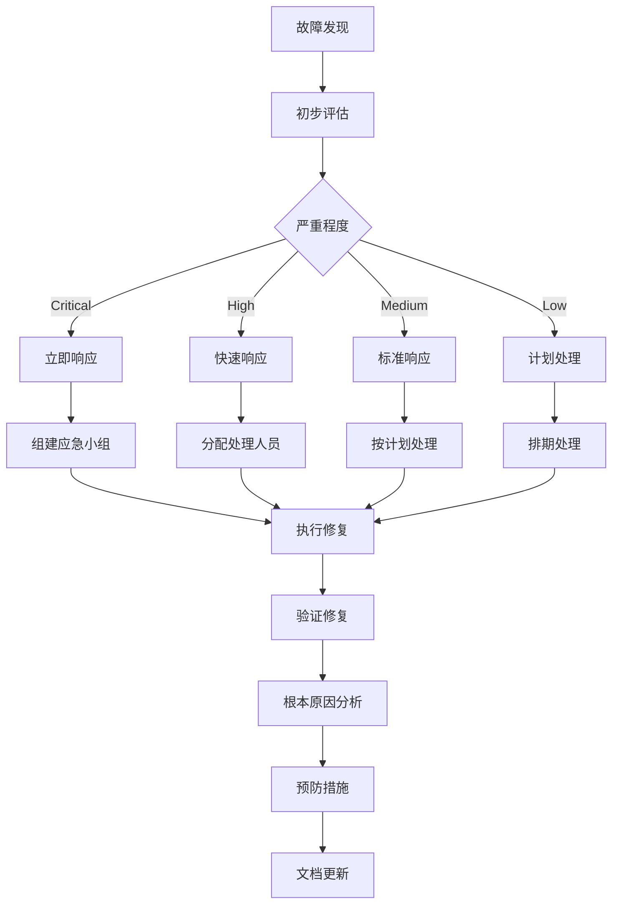

# 07 - 工作负载故障排查与应急响应手册 (Workload Troubleshooting & Incident Response Handbook)

> **适用版本**: v1.25 - v1.32 | **最后更新**: 2026-02 | **紧急程度**: ⚡ 高优先级

## 故障响应流程框架

### 1. INCIDENT 响应模型



### 2. 故障分类与优先级

#### 2.1 故障严重程度矩阵

| 严重级别 | 影响范围 | 响应时间 | 通知对象 | 处理团队 |
|----------|----------|----------|----------|----------|
| **P0-Critical** | 核心服务完全不可用 | 15分钟内 | 全体技术团队 | SRE + 开发负责人 |
| **P1-High** | 核心服务部分功能异常 | 1小时内 | 相关团队负责人 | 值班工程师 |
| **P2-Medium** | 非核心服务异常 | 4小时内 | 相关团队 | 一线支持 |
| **P3-Low** | 轻微问题或优化建议 | 24小时内 | 相关人员 | 计划处理 |

#### 2.2 常见故障类型识别

```bash
# 故障类型快速识别脚本
#!/bin/bash

CLUSTER_NAME=${1:-production}
NAMESPACE=${2:-default}

echo "🔍 开始故障诊断: ${CLUSTER_NAME}/${NAMESPACE}"

# 1. 检查集群整体状态
echo "📋 集群状态检查..."
kubectl get nodes --no-headers | grep -v "Ready" && echo "❌ 发现非Ready节点"

# 2. 检查Pod状态异常
echo "📦 Pod状态分析..."
kubectl get pods -n ${NAMESPACE} --no-headers | grep -E "(CrashLoopBackOff|Error|Pending|Unknown)" && echo "❌ 发现异常Pod"

# 3. 检查资源压力
echo "📊 资源使用情况..."
kubectl top nodes | awk '$3>85 || $5>85 {print "⚠️ 节点资源紧张: " $1}'

# 4. 检查控制器状态
echo "⚙️  控制器健康检查..."
kubectl get deployments,statefulsets,daemonsets -n ${NAMESPACE} | grep -E "0/[1-9]" && echo "❌ 控制器副本异常"

# 5. 检查事件日志
echo "📝 最近异常事件..."
kubectl get events -n ${NAMESPACE} --sort-by='.lastTimestamp' | tail -10 | grep -E "(Warning|Error)"
```

### 3. 系统性故障排查方法论

#### 3.1 LAYERED 分层诊断法

```bash
# 分层故障诊断脚本
diagnose_layer() {
    local layer=$1
    local resource=$2
    
    case $layer in
        "infrastructure")
            echo "🏗️ 基础设施层诊断..."
            check_nodes
            check_network
            ;;
        "platform")
            echo "🚀 平台层诊断..."
            check_control_plane
            check_etcd
            ;;
        "workload")
            echo "📦 工作负载层诊断..."
            check_pods "$resource"
            check_controllers "$resource"
            ;;
        "application")
            echo "🔧 应用层诊断..."
            check_app_health "$resource"
            check_dependencies
            ;;
    esac
}
```

#### 3.2 SMART 诊断原则

- **S**pecific (具体明确) - 准确描述问题现象
- **M**easurable (可测量) - 量化影响程度
- **A**ctionable (可行动) - 明确解决步骤
- **R**elevant (相关性) - 关注核心问题
- **T**ime-bound (时效性) - 设定解决时限

### 4. 具体故障场景处理

#### 4.1 Pod 相关故障

##### Pod Pending 状态

```bash
# 诊断Pending状态的Pod
debug_pending_pod() {
    local pod_name=$1
    local namespace=$2
    
    echo "🔍 诊断Pending Pod: ${pod_name}"
    
    # 1. 查看Pod详细信息
    kubectl describe pod ${pod_name} -n ${namespace}
    
    # 2. 检查资源配额
    kubectl describe quota -n ${namespace}
    
    # 3. 检查节点资源
    kubectl describe nodes | grep -A 5 "Allocated resources"
    
    # 4. 检查污点和容忍
    kubectl get nodes -o jsonpath='{.items[*].spec.taints}'
    
    # 5. 常见解决方案
    echo "💡 可能的解决方案:"
    echo "   - 调整资源请求值"
    echo "   - 添加节点容忍度"
    echo "   - 清理已完成的Jobs释放资源"
    echo "   - 扩展集群节点"
}

# 使用示例
debug_pending_pod "my-app-7d5b8c9f4-xl2v9" "production"
```

##### Pod CrashLoopBackOff

```bash
# 诊断崩溃重启的Pod
debug_crashloop_pod() {
    local pod_name=$1
    local namespace=$2
    
    echo "💥 诊断CrashLoopBackOff Pod: ${pod_name}"
    
    # 1. 查看重启次数和时间
    kubectl get pod ${pod_name} -n ${namespace} -o jsonpath='{.status.containerStatuses[*].restartCount}'
    
    # 2. 获取最后的日志
    kubectl logs ${pod_name} -n ${namespace} --previous
    
    # 3. 检查启动探针配置
    kubectl get pod ${pod_name} -n ${namespace} -o jsonpath='{.spec.containers[*].startupProbe}'
    
    # 4. 检查资源限制
    kubectl describe pod ${pod_name} -n ${namespace} | grep -A 10 "Limits"
    
    # 5. 常见根本原因
    echo "🔍 常见根本原因:"
    echo "   - 启动脚本错误"
    echo "   - 依赖服务不可用"
    echo "   - 资源限制过低"
    echo "   - 配置文件错误"
    echo "   - 权限问题"
}
```

#### 4.2 Deployment 相关故障

##### 滚动更新卡住

```bash
# 诊断卡住的滚动更新
debug_stuck_rollout() {
    local deployment_name=$1
    local namespace=$2
    
    echo "🔄 诊断卡住的滚动更新: ${deployment_name}"
    
    # 1. 检查滚动更新状态
    kubectl rollout status deployment/${deployment_name} -n ${namespace} --timeout=30s
    
    # 2. 查看ReplicaSet状态
    kubectl get rs -l app=${deployment_name} -n ${namespace}
    
    # 3. 检查Pod状态详情
    kubectl get pods -l app=${deployment_name} -n ${namespace} -o wide
    
    # 4. 查看Deployment事件
    kubectl describe deployment ${deployment_name} -n ${namespace}
    
    # 5. 强制重启方案
    echo "🔧 应急处理方案:"
    echo "   kubectl rollout restart deployment/${deployment_name} -n ${namespace}"
    echo "   kubectl rollout undo deployment/${deployment_name} -n ${namespace}"
    echo "   kubectl scale deployment/${deployment_name} --replicas=0 -n ${namespace} && sleep 10 && kubectl scale deployment/${deployment_name} --replicas=N -n ${namespace}"
}
```

##### 副本数不匹配

```bash
# 诊断副本数异常
debug_replica_mismatch() {
    local deployment_name=$1
    local namespace=$2
    
    echo "🔢 诊断副本数不匹配: ${deployment_name}"
    
    # 1. 对比期望与实际副本数
    DESIRED=$(kubectl get deployment ${deployment_name} -n ${namespace} -o jsonpath='{.spec.replicas}')
    AVAILABLE=$(kubectl get deployment ${deployment_name} -n ${namespace} -o jsonpath='{.status.availableReplicas}')
    
    echo "期望副本: ${DESIRED}, 可用副本: ${AVAILABLE}"
    
    # 2. 检查不可用的Pod
    kubectl get pods -l app=${deployment_name} -n ${namespace} | grep -E "(0/1|CrashLoopBackOff|Pending)"
    
    # 3. 检查节点调度问题
    kubectl describe pods -l app=${deployment_name} -n ${namespace} | grep -A 5 "Events"
    
    # 4. 解决方案
    echo "🛠️ 解决方案:"
    echo "   - 修复失败的Pod"
    echo "   - 调整资源配额"
    echo "   - 检查节点健康状态"
    echo "   - 重新调度Pod"
}
```

#### 4.3 资源相关故障

##### CPU/Memory 资源不足

```bash
# 诊断资源不足问题
debug_resource_pressure() {
    local namespace=$1
    
    echo "⚡ 诊断资源压力: ${namespace}"
    
    # 1. 检查节点资源使用
    kubectl top nodes
    
    # 2. 检查Pod资源使用
    kubectl top pods -n ${namespace}
    
    # 3. 查找资源消耗最高的Pod
    kubectl top pods -n ${namespace} --sort-by=cpu | head -10
    kubectl top pods -n ${namespace} --sort-by=memory | head -10
    
    # 4. 检查资源配额和限制
    kubectl describe quota -n ${namespace}
    kubectl describe limitrange -n ${namespace}
    
    # 5. 优化建议
    echo "📈 优化建议:"
    echo "   - 调整资源请求和限制"
    echo "   - 启用HPA自动扩缩容"
    echo "   - 实施VPA垂直扩缩容"
    echo "   - 优化应用内存使用"
}
```

### 5. 应急响应工具箱

#### 5.1 快速诊断脚本集合

```bash
#!/bin/bash
# emergency_toolkit.sh - 生产环境应急诊断工具

# 集群健康检查
cluster_health_check() {
    echo "🏥 集群健康检查报告"
    echo "==================="
    
    # 节点状态
    echo "🔹 节点状态:"
    kubectl get nodes | grep -v "STATUS"
    
    # 控制平面组件
    echo -e "\n🔹 控制平面:"
    kubectl get pods -n kube-system | grep -E "(apiserver|controller|scheduler|etcd)"
    
    # 核心组件
    echo -e "\n🔹 核心组件:"
    kubectl get pods -n monitoring,logging,ingress-nginx 2>/dev/null | head -20
    
    # 资源使用概况
    echo -e "\n🔹 资源使用:"
    kubectl top nodes | head -10
}

# 应用健康检查
app_health_check() {
    local namespace=${1:-default}
    
    echo "应用查看: ${namespace}"
    echo "=============="
    
    # Deployment状态
    kubectl get deployments -n ${namespace} -o wide
    
    # 异常Pod统计
    echo -e "\n异常Pod统计:"
    kubectl get pods -n ${namespace} --no-headers | \
        awk '{print $3}' | sort | uniq -c
    
    # 最近事件
    echo -e "\n最近警告事件:"
    kubectl get events -n ${namespace} --sort-by='.lastTimestamp' | \
        grep Warning | tail -5
}

# 性能瓶颈分析
performance_analysis() {
    local namespace=${1:-default}
    
    echo "性能分析: ${namespace}"
    echo "============"
    
    # CPU密集型Pod
    echo "CPU使用Top 5:"
    kubectl top pods -n ${namespace} --sort-by=cpu | head -6
    
    # 内存密集型Pod
    echo -e "\n内存使用Top 5:"
    kubectl top pods -n ${namespace} --sort-by=memory | head -6
    
    # 重启频繁的Pod
    echo -e "\n重启频繁的容器:"
    kubectl get pods -n ${namespace} -o jsonpath='{range .items[*]}{.metadata.name}{"\t"}{range .status.containerStatuses[*]}{.restartCount}{" "}{end}{"\n"}{end}' | \
        sort -k2 -nr | head -5
}
```

#### 5.2 应急响应检查清单

✅ **故障确认阶段**
- [ ] 确认故障现象和影响范围
- [ ] 评估业务影响程度
- [ ] 确定故障严重等级
- [ ] 通知相关人员和团队

✅ **诊断分析阶段**
- [ ] 收集相关日志和监控数据
- [ ] 使用分层诊断方法定位问题
- [ ] 验证假设和可能原因
- [ ] 确定根本原因

✅ **应急处理阶段**
- [ ] 制定临时解决方案
- [ ] 实施快速修复措施
- [ ] 验证修复效果
- [ ] 监控系统稳定性

✅ **根本解决阶段**
- [ ] 制定永久性修复方案
- [ ] 实施根本性改进措施
- [ ] 更新相关文档和流程
- [ ] 进行事后复盘总结

### 6. 预防性维护策略

#### 6.1 定期健康检查脚本

```bash
#!/bin/bash
# scheduled_health_check.sh - 定期健康检查

HEALTH_CHECK_TIME=$(date '+%Y-%m-%d %H:%M:%S')
LOG_FILE="/var/log/health-check-${HEALTH_CHECK_TIME}.log"

exec > >(tee -a ${LOG_FILE})
exec 2>&1

echo "⏱️  健康检查开始: ${HEALTH_CHECK_TIME}"

# 1. 集群组件检查
echo "🔍 检查控制平面组件..."
kubectl get componentstatuses

# 2. 节点健康检查
echo "🔍 检查节点状态..."
kubectl get nodes | grep -v "Ready"

# 3. 工作负载检查
echo "🔍 检查工作负载状态..."
for ns in $(kubectl get ns -o jsonpath='{.items[*].metadata.name}'); do
    echo "Namespace: ${ns}"
    kubectl get deployments,statefulsets,daemonsets -n ${ns} | grep -E "0/[1-9]"
done

# 4. 资源使用检查
echo "🔍 检查资源使用情况..."
kubectl top nodes | awk '$3>80 || $5>80 {print "⚠️ 资源使用警告: " $0}'

# 5. 事件检查
echo "🔍 检查最近异常事件..."
kubectl get events --all-namespaces --sort-by='.lastTimestamp' | \
    grep -E "(Warning|Error)" | tail -20

echo "✅ 健康检查完成: $(date '+%Y-%m-%d %H:%M:%S')"
```

#### 6.2 自动化巡检配置

```yaml
# Kubernetes CronJob 自动巡检
apiVersion: batch/v1
kind: CronJob
metadata:
  name: cluster-health-check
  namespace: monitoring
spec:
  schedule: "0 */4 * * *"  # 每4小时执行一次
  jobTemplate:
    spec:
      template:
        spec:
          serviceAccountName: health-checker
          containers:
          - name: health-check
            image: kubectl:latest
            command:
            - /bin/sh
            - -c
            - |
              # 执行健康检查脚本
              /scripts/health-check.sh
              
              # 检查结果分析
              if [ $? -ne 0 ]; then
                # 发送告警通知
                curl -X POST "https://hooks.slack.com/services/XXX/YYY/ZZZ" \
                  -H "Content-Type: application/json" \
                  -d '{"text":"集群健康检查发现异常，请及时处理"}'
              fi
            volumeMounts:
            - name: scripts
              mountPath: /scripts
          volumes:
          - name: scripts
            configMap:
              name: health-check-scripts
          restartPolicy: OnFailure
```

---

**应急原则**: 快速响应、准确诊断、有效处理、持续改进

---
**文档维护**: Kusheet Project | **作者**: Allen Galler (allengaller@gmail.com)