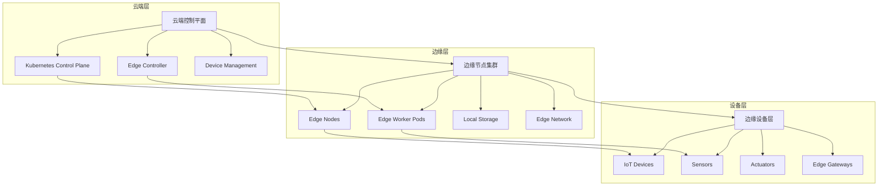

# 09 - 边缘计算工作负载部署模式 (Edge Computing Workload Deployment Patterns)

> **适用版本**: v1.25 - v1.32 | **最后更新**: 2026-02 | **参考**: [KubeEdge](https://kubeedge.io/), [OpenYurt](https://openyurt.io/)

## 边缘计算架构概览

### 1. 边缘计算分层架构



### 2. 边缘计算挑战与解决方案

#### 2.1 核心挑战矩阵

| 挑战类别 | 具体问题 | Kubernetes 解决方案 | 替代方案 |
|----------|----------|-------------------|----------|
| **网络不稳定** | 断连、高延迟、带宽限制 | KubeEdge、边缘缓存 | 本地自治、离线模式 |
| **资源受限** | CPU/内存有限、存储空间小 | 轻量级运行时、资源优化 | 容器精简、微服务拆分 |
| **设备异构** | 硬件多样化、OS不统一 | Device Plugin、CSI驱动 | 标准化抽象层 |
| **数据本地化** | 数据就近处理、隐私保护 | 边缘计算、联邦学习 | 本地存储、边缘AI |
| **运维复杂** | 分布式管理、故障诊断困难 | 边缘Operator、远程调试 | 自动化运维、AIOPS |

### 3. 边缘计算平台选型

#### 3.1 主流边缘平台对比

```yaml
# Edge Platform Comparison Matrix
platform_comparison:
  kubeedge:
    architecture: "云边协同"
    control_plane: "Kubernetes原生"
    edge_node: "轻量级Agent"
    device_support: "DeviceTwin, Mapper"
    network_features: "边缘自治, 断连恢复"
    use_cases: "IoT, 工业互联网"
  
  openyurt:
    architecture: "中心化管理"
    control_plane: "Kubernetes兼容"
    edge_node: "YurtHub代理"
    device_support: "标准K8s API"
    network_features: "节点池管理, 单元化部署"
    use_cases: "CDN, 边缘计算"
  
  k3s:
    architecture: "轻量级K8s"
    control_plane: "简化版API Server"
    edge_node: "单二进制部署"
    device_support: "标准工作负载"
    network_features: "Flannel网络, Traefik"
    use_cases: "小型边缘站点, 开发测试"
```

### 4. KubeEdge 边缘部署架构

#### 4.1 核心组件架构

```yaml
# KubeEdge 架构配置
apiVersion: v1
kind: Namespace
metadata:
  name: kubeedge-system

---
# CloudCore 部署 (云端)
apiVersion: apps/v1
kind: Deployment
metadata:
  name: cloudcore
  namespace: kubeedge-system
spec:
  replicas: 2
  selector:
    matchLabels:
      app: cloudcore
  template:
    metadata:
      labels:
        app: cloudcore
    spec:
      containers:
      - name: cloudcore
        image: kubeedge/cloudcore:v1.12.0
        ports:
        - containerPort: 10000
          name: cloudhub
        - containerPort: 10001
          name: edgecontroller
        volumeMounts:
        - name: config
          mountPath: /etc/kubeedge/config
        - name: certs
          mountPath: /etc/kubeedge/certs
      volumes:
      - name: config
        configMap:
          name: cloudcore-config
      - name: certs
        secret:
          secretName: cloudcore-certs
```

#### 4.2 EdgeCore 部署配置

```yaml
# EdgeCore 部署 (边缘节点)
apiVersion: apps/v1
kind: DaemonSet
metadata:
  name: edgecore
  namespace: kubeedge-system
spec:
  selector:
    matchLabels:
      app: edgecore
  template:
    metadata:
      labels:
        app: edgecore
    spec:
      hostNetwork: true
      hostPID: true
      containers:
      - name: edgecore
        image: kubeedge/edgecore:v1.12.0
        securityContext:
          privileged: true
        env:
        - name: NODE_NAME
          valueFrom:
            fieldRef:
              fieldPath: spec.nodeName
        volumeMounts:
        - name: etc-kubeedge
          mountPath: /etc/kubeedge
        - name: var-lib-kubeedge
          mountPath: /var/lib/kubeedge
        - name: var-lib-edged
          mountPath: /var/lib/edged
        - name: dockersock
          mountPath: /var/run/docker.sock
      volumes:
      - name: etc-kubeedge
        hostPath:
          path: /etc/kubeedge
      - name: var-lib-kubeedge
        hostPath:
          path: /var/lib/kubeedge
      - name: var-lib-edged
        hostPath:
          path: /var/lib/edged
      - name: dockersock
        hostPath:
          path: /var/run/docker.sock
```

#### 4.3 DeviceTwin 设备管理

```yaml
# Device Model 定义
apiVersion: devices.kubeedge.io/v1alpha2
kind: DeviceModel
metadata:
  name: temperature-sensor
  namespace: edge
spec:
  protocol: "modbus"
  propertyVisitors:
  - propertyName: temperature
    visitorConfig:
      register: "CoilRegister"
      offset: 0
      limit: 1
      scale: 0.1
      isSwap: true

---
# 具体设备实例
apiVersion: devices.kubeedge.io/v1alpha2
kind: Device
metadata:
  name: temp-sensor-01
  namespace: edge
  labels:
    model: temperature-sensor
    location: factory-floor-1
spec:
  deviceModelRef:
    name: temperature-sensor
  protocol:
    modbus:
      slaveID: 1
  nodeSelector:
    nodeSelectorTerms:
    - matchExpressions:
      - key: node-role.kubernetes.io/edge
        operator: Exists
```

### 5. 边缘工作负载优化策略

#### 5.1 资源优化配置

```yaml
# 边缘优化的Deployment配置
apiVersion: apps/v1
kind: Deployment
metadata:
  name: edge-optimized-app
  namespace: edge
spec:
  replicas: 1  # 边缘节点通常单副本
  selector:
    matchLabels:
      app: edge-app
  template:
    metadata:
      labels:
        app: edge-app
        edge-location: factory-a
    spec:
      # 节点选择器
      nodeSelector:
        node-role.kubernetes.io/edge: ""
        location: factory-a
      
      # 资源优化
      containers:
      - name: app
        image: edge-app:slim  # 使用精简镜像
        imagePullPolicy: IfNotPresent  # 减少网络依赖
        resources:
          requests:
            cpu: "50m"      # 极低CPU请求
            memory: "32Mi"  # 极低内存请求
          limits:
            cpu: "200m"     # 合理限制
            memory: "128Mi"
        
        # 健康检查优化
        livenessProbe:
          exec:
            command: ["/bin/sh", "-c", "ps aux | grep app"]
          initialDelaySeconds: 30
          periodSeconds: 60    # 延长检查间隔
          timeoutSeconds: 10
          failureThreshold: 3
        
        readinessProbe:
          tcpSocket:
            port: 8080
          initialDelaySeconds: 5
          periodSeconds: 30    # 延长检查间隔
        
        # 启动探针
        startupProbe:
          httpGet:
            path: /health
            port: 8080
          failureThreshold: 60   # 更长启动时间
          periodSeconds: 10
        
        # 优雅终止
        lifecycle:
          preStop:
            exec:
              command: ["/bin/sh", "-c", "sleep 5"]  # 短暂等待
        
        # 存储优化
        volumeMounts:
        - name: cache-storage
          mountPath: /cache
        - name: config-storage
          mountPath: /config
          
      volumes:
      - name: cache-storage
        emptyDir:
          sizeLimit: 100Mi    # 限制缓存大小
      - name: config-storage
        configMap:
          name: edge-app-config
```

#### 5.2 网络优化配置

```yaml
# 边缘网络策略
apiVersion: networking.k8s.io/v1
kind: NetworkPolicy
metadata:
  name: edge-network-policy
  namespace: edge
spec:
  podSelector:
    matchLabels:
      app: edge-app
  policyTypes:
  - Ingress
  - Egress
  
  # 入站规则 - 仅允许本地访问
  ingress:
  - from:
    - ipBlock:
        cidr: 192.168.1.0/24  # 本地网络段
    ports:
    - protocol: TCP
      port: 8080
  
  # 出站规则 - 限制外网访问
  egress:
  - to:
    - ipBlock:
        cidr: 10.0.0.0/8      # 内网访问
    - ipBlock:
        cidr: 192.168.0.0/16  # 本地网络
    ports:
    - protocol: TCP
      port: 53                # DNS
    - protocol: UDP
      port: 53                # DNS
```

### 6. 边缘数据管理策略

#### 6.1 本地存储配置

```yaml
# 边缘本地存储类
apiVersion: storage.k8s.io/v1
kind: StorageClass
metadata:
  name: edge-local-storage
provisioner: kubernetes.io/no-provisioner
volumeBindingMode: WaitForFirstConsumer
allowVolumeExpansion: false

---
# 本地持久卷
apiVersion: v1
kind: PersistentVolume
metadata:
  name: edge-pv-01
spec:
  capacity:
    storage: 10Gi
  accessModes:
  - ReadWriteOnce
  persistentVolumeReclaimPolicy: Retain
  storageClassName: edge-local-storage
  local:
    path: /mnt/disks/ssd1
  nodeAffinity:
    required:
      nodeSelectorTerms:
      - matchExpressions:
        - key: kubernetes.io/hostname
          operator: In
          values:
          - edge-node-01
```

#### 6.2 数据同步策略

```yaml
# RSync 边缘数据同步
apiVersion: batch/v1
kind: CronJob
metadata:
  name: edge-data-sync
  namespace: edge
spec:
  schedule: "*/30 * * * *"  # 每30分钟同步一次
  jobTemplate:
    spec:
      template:
        spec:
          containers:
          - name: rsync
            image: alpine:latest
            command:
            - /bin/sh
            - -c
            - |
              apk add --no-cache rsync
              # 同步到中心存储
              rsync -avz --delete /local/data/ user@central-server:/remote/data/
              # 清理旧数据
              find /local/data/ -type f -mtime +7 -delete
            volumeMounts:
            - name: data-volume
              mountPath: /local/data
          volumes:
          - name: data-volume
            persistentVolumeClaim:
              claimName: edge-data-pvc
          restartPolicy: OnFailure
```

### 7. 边缘AI推理部署模式

#### 7.1 AI模型部署配置

```yaml
# TensorFlow Serving 边缘部署
apiVersion: apps/v1
kind: Deployment
metadata:
  name: tf-serving-edge
  namespace: ai-edge
spec:
  replicas: 1
  selector:
    matchLabels:
      app: tf-serving
  template:
    metadata:
      labels:
        app: tf-serving
        model: image-classification
    spec:
      containers:
      - name: tf-serving
        image: tensorflow/serving:2.12.0
        args:
        - --model_config_file=/models/models.config
        - --rest_api_port=8501
        - --enable_batching=true
        - --batching_parameters_file=/models/batching_config.txt
        ports:
        - containerPort: 8500  # gRPC
        - containerPort: 8501  # REST
        resources:
          requests:
            cpu: "500m"
            memory: "1Gi"
            nvidia.com/gpu: "1"  # 如果有GPU
          limits:
            cpu: "1"
            memory: "2Gi"
            nvidia.com/gpu: "1"
        volumeMounts:
        - name: model-storage
          mountPath: /models
        env:
        - name: MODEL_NAME
          value: "image_classifier"
        - name: TENSORFLOW_INTER_OP_PARALLELISM
          value: "2"
        - name: TENSORFLOW_INTRA_OP_PARALLELISM
          value: "4"
      
      volumes:
      - name: model-storage
        persistentVolumeClaim:
          claimName: tf-models-pvc
      
      # GPU支持
      tolerations:
      - key: nvidia.com/gpu
        operator: Exists
        effect: NoSchedule
```

#### 7.2 模型更新策略

```yaml
# 模型热更新配置
apiVersion: apps/v1
kind: Deployment
metadata:
  name: model-update-manager
  namespace: ai-edge
spec:
  replicas: 1
  selector:
    matchLabels:
      app: model-updater
  template:
    metadata:
      labels:
        app: model-updater
    spec:
      initContainers:
      - name: model-downloader
        image: curlimages/curl:latest
        command:
        - /bin/sh
        - -c
        - |
          # 从模型仓库下载最新模型
          curl -o /models/latest.tar.gz ${MODEL_REGISTRY_URL}/models/latest.tar.gz
          tar -xzf /models/latest.tar.gz -C /models/
        volumeMounts:
        - name: model-storage
          mountPath: /models
      
      containers:
      - name: model-validator
        image: python:3.9-slim
        command:
        - python
        - /scripts/validate_model.py
        volumeMounts:
        - name: model-storage
          mountPath: /models
        - name: scripts
          mountPath: /scripts
      
      volumes:
      - name: model-storage
        persistentVolumeClaim:
          claimName: model-storage-pvc
      - name: scripts
        configMap:
          name: validation-scripts
```

### 8. 边缘运维管理

#### 8.1 远程诊断工具

```bash
#!/bin/bash
# edge_diagnostics.sh - 边缘节点诊断工具

NODE_NAME=$1
NAMESPACE=${2:-edge}

echo "🔍 边缘节点诊断: ${NODE_NAME}"
echo "=========================="

# 1. 节点基本信息
echo "📋 节点基本信息:"
kubectl get node ${NODE_NAME} -o wide

# 2. 资源使用情况
echo -e "\n📊 资源使用:"
kubectl describe node ${NODE_NAME} | grep -A 10 "Allocated resources"

# 3. 边缘组件状态
echo -e "\n⚙️ 边缘组件状态:"
kubectl get pods -n kubeedge-system -o wide | grep ${NODE_NAME}

# 4. 网络连通性检查
echo -e "\n🌐 网络状态:"
kubectl exec -n kubeedge-system deploy/cloudcore -- \
  ping -c 3 ${NODE_NAME} 2>/dev/null || echo "无法ping通边缘节点"

# 5. 应用健康检查
echo -e "\n🏥 应用健康状态:"
kubectl get pods -n ${NAMESPACE} -o wide --field-selector spec.nodeName=${NODE_NAME}

# 6. 日志分析
echo -e "\n📝 最近错误日志:"
kubectl logs -n kubeedge-system ds/edgecore --tail=50 | \
  grep -E "(error|Error|ERROR|warning|Warning|WARNING)" | tail -10

# 7. 存储使用情况
echo -e "\n💾 存储使用:"
kubectl exec -n kubeedge-system ds/edgecore -- df -h | grep -E "(Mounted|/dev/)"

# 8. 自动生成诊断报告
echo -e "\n📋 诊断摘要:"
echo "节点: ${NODE_NAME}"
echo "时间: $(date)"
echo "状态: $(kubectl get node ${NODE_NAME} -o jsonpath='{.status.conditions[?(@.type=="Ready")].status}')"
```

#### 8.2 自动化运维配置

```yaml
# 边缘节点自动维护
apiVersion: batch/v1
kind: CronJob
metadata:
  name: edge-node-maintenance
  namespace: kubeedge-system
spec:
  schedule: "0 2 * * *"  # 每天凌晨2点执行
  jobTemplate:
    spec:
      template:
        spec:
          containers:
          - name: maintenance
            image: maintenance-tool:latest
            command:
            - /bin/sh
            - -c
            - |
              # 清理docker镜像
              docker image prune -af --filter "until=168h"
              
              # 清理系统日志
              journalctl --vacuum-time=7d
              
              # 检查磁盘空间
              df -h | awk '$5 > 80 {print "⚠️ 磁盘使用警告: " $0}'
              
              # 重启边缘服务（如果需要）
              systemctl is-active edgecore || systemctl restart edgecore
            volumeMounts:
            - name: docker-sock
              mountPath: /var/run/docker.sock
            - name: journal-log
              mountPath: /var/log/journal
          volumes:
          - name: docker-sock
            hostPath:
              path: /var/run/docker.sock
          - name: journal-log
            hostPath:
              path: /var/log/journal
          restartPolicy: OnFailure
```

### 9. 边缘安全防护

#### 9.1 安全基线配置

```yaml
# 边缘节点安全策略
apiVersion: policy/v1beta1
kind: PodSecurityPolicy
metadata:
  name: edge-node-psp
spec:
  privileged: false
  allowPrivilegeEscalation: false
  requiredDropCapabilities:
  - ALL
  volumes:
  - configMap
  - emptyDir
  - projected
  - secret
  - downwardAPI
  - persistentVolumeClaim
  hostNetwork: false
  hostIPC: false
  hostPID: false
  runAsUser:
    rule: MustRunAsNonRoot
  seLinux:
    rule: RunAsAny
  supplementalGroups:
    rule: MustRunAs
    ranges:
    - min: 1
      max: 65535
  fsGroup:
    rule: MustRunAs
    ranges:
    - min: 1
      max: 65535
  readOnlyRootFilesystem: true
```

#### 9.2 网络安全配置

```yaml
# 边缘网络安全策略
apiVersion: cilium.io/v2
kind: CiliumNetworkPolicy
metadata:
  name: edge-security-policy
  namespace: edge
spec:
  endpointSelector:
    matchLabels:
      app: edge-app
  
  # 入站流量控制
  ingress:
  - fromEndpoints:
    - matchLabels:
        app: edge-gateway
    toPorts:
    - ports:
      - port: "8080"
        protocol: TCP
  
  # 出站流量控制
  egress:
  - toCIDR:
    - 10.0.0.0/8
    - 192.168.0.0/16
    toPorts:
    - ports:
      - port: "53"
        protocol: UDP
      - port: "53"
        protocol: TCP
  
  # 应用层策略
  l7Rules:
    http:
    - method: GET
      path: /api/*
    - method: POST
      path: /api/data
```

---

**边缘原则**: 就近计算、资源优化、自治运行、安全可靠

---
**文档维护**: Kusheet Project | **作者**: Allen Galler (allengaller@gmail.com)