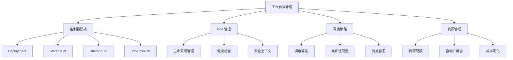

# Domain 4 - 工作负载管理 (Workloads Management)

> **领域概述**: Kubernetes 工作负载控制器的设计、部署、运维和优化的完整技术体系

## 📚 文档目录

### 🔧 核心控制器详解

| 序号 | 文档名称 | 内容概要 | 生产成熟度 |
|------|----------|----------|------------|
| **01** | [工作负载架构概览](./01-workload-overview-architecture.md) | 工作负载分类、生命周期、设计原则 | ⭐⭐⭐⭐⭐ |
| **02** | [Deployment 生产模式](./02-deployment-production-patterns.md) | 无状态应用部署、蓝绿/金丝雀发布 | ⭐⭐⭐⭐⭐ |
| **03** | [StatefulSet 高级运维](./03-statefulset-advanced-operations.md) | 有状态应用管理、数据持久化 | ⭐⭐⭐⭐ |
| **04** | [DaemonSet 管理策略](./04-daemonset-management.md) | 节点级守护进程、监控日志收集 | ⭐⭐⭐⭐⭐ |
| **05** | [Job/CronJob 高级用法](./05-job-cronjob-advanced.md) | 批处理任务、定时作业调度 | ⭐⭐⭐⭐ |

### 🔄 现有补充文档

| 序号 | 文档名称 | 内容概要 | 生产成熟度 |
|------|----------|----------|------------|
| **21** | [工作负载控制器概览](./21-workload-controllers-overview.md) | 控制器特性矩阵、基础配置 | ⭐⭐⭐⭐ |
| **22** | [Pod 生命周期事件](./22-pod-lifecycle-events.md) | Pod 状态转换、事件处理 | ⭐⭐⭐⭐ |
| **23** | [高级 Pod 模式](./23-advanced-pod-patterns.md) | Pod 设计模式、最佳实践 | ⭐⭐⭐ |
| **24** | [容器生命周期钩子](./24-container-lifecycle-hooks.md) | 启动/停止钩子、健康检查 | ⭐⭐⭐⭐⭐ |
| **25** | [Sidecar 容器模式](./25-sidecar-containers-patterns.md) | 边车模式、服务网格集成 | ⭐⭐⭐⭐⭐ |
| **26** | [容器运行时接口](./26-container-runtime-interfaces.md) | CRI 架构、运行时选型 | ⭐⭐⭐⭐ |
| **27** | [RuntimeClass 配置](./27-runtime-class-configuration.md) | 多运行时管理、资源配置 | ⭐⭐⭐ |
| **28** | [容器镜像与仓库](./28-container-images-registry.md) | 镜像管理、安全扫描 | ⭐⭐⭐⭐⭐ |
| **29** | [节点管理操作](./29-node-management-operations.md) | 节点维护、标签管理 | ⭐⭐⭐ |
| **30** | [调度器配置](./30-scheduler-configuration.md) | 调度策略、优先级配置 | ⭐⭐⭐⭐ |
| **31** | [Kubelet 配置](./31-kubelet-configuration.md) | 节点代理、资源配置 | ⭐⭐⭐⭐⭐ |
| **32** | [HPA/VPA 自动扩缩容](./32-hpa-vpa-autoscaling.md) | 水平/垂直扩缩容策略 | ⭐⭐⭐⭐ |
| **33** | [集群容量规划](./33-cluster-capacity-planning.md) | 资源规划、容量评估 | ⭐⭐⭐⭐⭐ |
| **34** | [资源管理](./34-resource-management.md) | 配额管理、资源限制 | ⭐⭐⭐⭐⭐ |

## 🎯 学习路径建议

### 🥇 初级阶段 (必学基础)
1. **01-工作负载架构概览** - 建立整体认知
2. **21-工作负载控制器概览** - 掌握基本概念
3. **24-容器生命周期钩子** - 理解健康检查机制
4. **31-Kubelet 配置** - 节点层面基础知识

### 🥈 中级阶段 (生产实践)
1. **02-Deployment 生产模式** - 无状态应用部署
2. **04-DaemonSet 管理策略** - 系统级组件管理
3. **25-Sidecar 容器模式** - 微服务架构实践
4. **32-HPA/VPA 自动扩缩容** - 弹性伸缩配置
5. **34-资源管理** - 多租户资源隔离

### 🥇 高级阶段 (专家技能)
1. **03-StatefulSet 高级运维** - 有状态应用管理
2. **05-Job/CronJob 高级用法** - 批处理任务调度
3. **33-集群容量规划** - 大规模集群管理
4. **30-调度器配置** - 高级调度策略

## 🔍 领域知识地图

## 📊 技术栈覆盖度

### ✅ 已完整覆盖的核心技术
- [x] Deployment 无状态部署
- [x] StatefulSet 有状态管理
- [x] DaemonSet 节点守护
- [x] Job/CronJob 批处理
- [x] Pod 生命周期管理
- [x] 容器运行时接口
- [x] 资源配额与限制
- [x] 自动扩缩容机制
- [x] 调度策略配置
- [x] 安全上下文配置

### 🚀 生产级最佳实践
- [x] 蓝绿部署/金丝雀发布
- [x] 零停机滚动更新
- [x] 健康检查与探针配置
- [x] 监控告警体系建设
- [x] 故障排查与恢复
- [x] 安全加固配置
- [x] 成本优化策略

## 🛠️ 实践工具推荐

### 部署工具
- **Helm** - 包管理器
- **Kustomize** - 配置管理
- **ArgoCD** - GitOps 部署
- **Flux** - 持续交付

### 监控工具
- **Prometheus** - 指标收集
- **Grafana** - 数据可视化
- **Alertmanager** - 告警管理
- **Kiali** - 服务网格监控

### 调试工具
- **kubectl** - 命令行工具
- **stern** - 多 Pod 日志查看
- **k9s** - 终端 UI 管理
- **Lens** - 桌面管理工具

## 📈 学习成果评估

### 技能掌握检查清单

**基础技能** ☐
- [ ] 理解各种控制器的使用场景
- [ ] 掌握 Pod 生命周期管理
- [ ] 配置健康检查和探针
- [ ] 实施基本的资源管理

**中级技能** ☐
- [ ] 设计生产级 Deployment
- [ ] 管理有状态应用部署
- [ ] 配置自动扩缩容策略
- [ ] 实施安全加固措施

**高级技能** ☐
- [ ] 设计复杂的部署策略
- [ ] 优化大规模集群性能
- [ ] 建立完整的监控体系
- [ ] 实施成本优化方案

## 📚 相关领域链接

- **Domain 1**: [架构基础](../domain-1-architecture-fundamentals/) - Kubernetes 核心架构
- **Domain 3**: [控制平面](../domain-3-control-plane/) - 控制组件深度解析
- **Domain 5**: [网络管理](../domain-5-networking/) - 网络策略与服务发现
- **Domain 6**: [存储管理](../domain-6-storage/) - 持久化存储方案

## 🆕 更新日志

### 2026年2月更新
- ✅ 新增 01-工作负载架构概览
- ✅ 新增 02-Deployment 生产模式
- ✅ 新增 03-StatefulSet 高级运维
- ✅ 新增 04-DaemonSet 管理策略
- ✅ 新增 05-Job/CronJob 高级用法
- ✅ 完善 README 目录结构

---

**维护说明**: 本文档定期更新，确保技术内容与 Kubernetes 最新版本保持同步。欢迎提交 Issue 和 PR 参与改进。

**项目地址**: [Kusheet Project](https://github.com/kudig-io/kudig-database)

**作者**: Allen Galler (allengaller@gmail.com)

**许可证**: MIT License