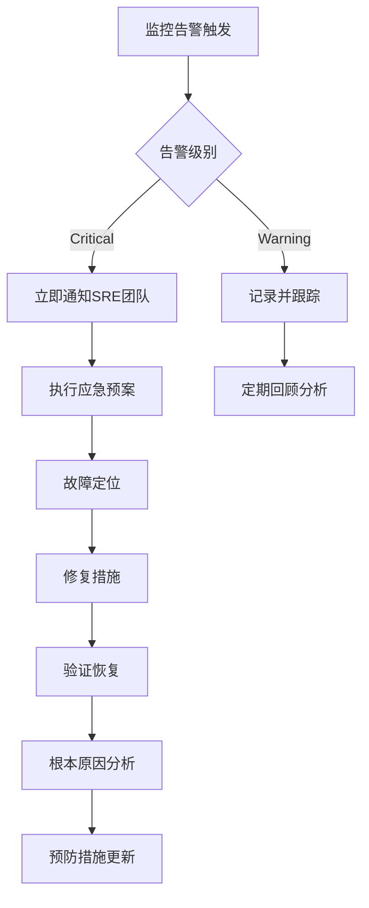

# 01 - 存储架构概览与核心组件

> **适用版本**: v1.25 - v1.32 | **最后更新**: 2026-02 | **运维重点**: 生产环境架构设计、性能优化、故障预防

## 目录

1. [存储架构概览](#存储架构概览)
2. [PV/PVC/StorageClass](#pvpvcstorageclass)
3. [访问模式与回收策略](#访问模式与回收策略)
4. [动态卷供给](#动态卷供给)
5. [CSI驱动生态](#csi驱动生态)
6. [卷扩容与快照](#卷扩容与快照)
7. [存储性能优化](#存储性能优化)
8. [存储故障排查](#存储故障排查)
9. [云原生存储方案](#云原生存储方案)
10. [数据持久化决策](#数据持久化决策)
11. [生产环境最佳实践](#生产环境最佳实践)
12. [成本优化策略](#成本优化策略)
13. [监控告警体系](#监控告警体系)

---

## 目录

1. [存储架构概览](#存储架构概览)
2. [PV/PVC/StorageClass](#pvpvcstorageclass)
3. [访问模式与回收策略](#访问模式与回收策略)
4. [动态卷供给](#动态卷供给)
5. [CSI驱动生态](#csi驱动生态)
6. [卷扩容与快照](#卷扩容与快照)
7. [存储性能优化](#存储性能优化)
8. [存储故障排查](#存储故障排查)
9. [云原生存储方案](#云原生存储方案)
10. [数据持久化决策](#数据持久化决策)

---

## 存储架构概览

### 存储抽象层次

```
应用层 (Application)
    ↓
PVC (PersistentVolumeClaim) - 命名空间级声明
    ↓
PV (PersistentVolume) - 集群级资源
    ↓
StorageClass - 动态供给模板
    ↓
CSI Driver - 存储插件接口
    ↓
底层存储 (云盘/NAS/Ceph/Local)
```

### 存储系统分类

| 存储类型 | 特点 | 访问模式 | 性能 | 适用场景 | 成本 |
|---------|------|---------|------|---------|------|
| **块存储 (Block)** | 高性能，独占 | RWO | 高IOPS | 数据库，高IO应用 | 中 |
| **文件存储 (File)** | 共享访问 | RWO/ROX/RWX | 中等 | 共享文件，日志 | 中-高 |
| **对象存储 (Object)** | 海量存储 | 应用API | 低延迟 | 静态资源，备份 | 低 |
| **本地存储 (Local)** | 最高性能 | RWO | 极高 | 缓存，临时数据 | 低 |

---

## PV/PVC/StorageClass

### PersistentVolume (PV) 完整配置

```yaml
apiVersion: v1
kind: PersistentVolume
metadata:
  name: data-pv
  labels:
    type: ssd
    zone: cn-hangzhou-h
spec:
  capacity:
    storage: 100Gi
  volumeMode: Filesystem  # 或 Block
  accessModes:
    - ReadWriteOnce
  persistentVolumeReclaimPolicy: Retain  # Delete/Recycle(已弃用)
  storageClassName: alicloud-disk-essd
  mountOptions:
    - hard
    - nfsvers=4.1
  nodeAffinity:  # 拓扑约束
    required:
      nodeSelectorTerms:
      - matchExpressions:
        - key: topology.kubernetes.io/zone
          operator: In
          values:
          - cn-hangzhou-h
  csi:
    driver: diskplugin.csi.alibabacloud.com
    volumeHandle: d-bp1234567890abcdef
    fsType: ext4
    volumeAttributes:
      performanceLevel: "PL1"
      type: "cloud_essd"
```

### PersistentVolumeClaim (PVC) 完整配置

```yaml
apiVersion: v1
kind: PersistentVolumeClaim
metadata:
  name: data-pvc
  namespace: production
  annotations:
    volume.beta.kubernetes.io/storage-provisioner: diskplugin.csi.alibabacloud.com
spec:
  accessModes:
    - ReadWriteOnce
  storageClassName: alicloud-disk-essd
  resources:
    requests:
      storage: 100Gi
  selector:  # 可选: 选择特定PV
    matchLabels:
      type: ssd
  volumeMode: Filesystem  # 或 Block
  dataSource:  # 可选: 从快照恢复
    name: data-snapshot
    kind: VolumeSnapshot
    apiGroup: snapshot.storage.k8s.io
```

### StorageClass 生产级配置

```yaml
apiVersion: storage.k8s.io/v1
kind: StorageClass
metadata:
  name: alicloud-disk-essd-pl1
  annotations:
    storageclass.kubernetes.io/is-default-class: "false"
provisioner: diskplugin.csi.alibabacloud.com
parameters:
  type: cloud_essd
  performanceLevel: PL1  # PL0/PL1/PL2/PL3
  encrypted: "true"  # 启用加密
  kmsKeyId: "key-id"  # KMS密钥
  resourceGroupId: "rg-xxx"  # 资源组
reclaimPolicy: Delete  # Retain/Delete
allowVolumeExpansion: true  # 允许扩容
volumeBindingMode: WaitForFirstConsumer  # 延迟绑定，确保拓扑匹配
mountOptions:
  - noatime
  - nodiratime
```

### 多StorageClass策略

| StorageClass名称 | 云盘类型 | 性能等级 | IOPS | 适用场景 | 月成本(100GB) |
|----------------|---------|---------|------|---------|--------------|
| **fast-ssd-pl3** | ESSD | PL3 | 1,000,000 | 核心数据库 | 350元 |
| **fast-ssd-pl2** | ESSD | PL2 | 100,000 | 一般数据库 | 210元 |
| **standard-ssd** | ESSD | PL1 | 50,000 | 应用存储 | 150元 |
| **economy-ssd** | ESSD | PL0 | 10,000 | 开发测试 | 105元 |
| **shared-nas** | NAS | 通用型 | - | 共享文件 | 120元 |
| **local-nvme** | 本地盘 | NVMe | 极高 | 缓存层 | 包含在ECS |

---

## 访问模式与回收策略

### 访问模式 (AccessModes)

| 模式 | 缩写 | 说明 | 支持存储类型 | 典型场景 |
|-----|------|------|------------|---------|
| **ReadWriteOnce** | RWO | 单节点读写 | 块存储，本地盘 | 数据库，应用状态 |
| **ReadOnlyMany** | ROX | 多节点只读 | 文件存储，对象存储 | 配置文件，静态资源 |
| **ReadWriteMany** | RWX | 多节点读写 | NAS，分布式文件系统 | 共享日志，媒体文件 |
| **ReadWriteOncePod** | RWOP | 单Pod独占 (v1.27+) | 块存储 | 严格单写场景 |

### 访问模式兼容性矩阵

| 存储类型 | RWO | ROX | RWX | RWOP |
|---------|-----|-----|-----|------|
| **阿里云云盘 (ESSD)** | ✓ | ✗ | ✗ | ✓ (v1.27+) |
| **阿里云NAS** | ✓ | ✓ | ✓ | ✓ (v1.27+) |
| **阿里云OSS (CSI)** | ✓ | ✓ | ✓ | ✗ |
| **Ceph RBD** | ✓ | ✗ | ✗ | ✓ (v1.27+) |
| **CephFS** | ✓ | ✓ | ✓ | ✓ (v1.27+) |
| **Local Path** | ✓ | ✗ | ✗ | ✓ (v1.27+) |
| **NFS** | ✓ | ✓ | ✓ | ✓ (v1.27+) |

### 回收策略 (ReclaimPolicy)

| 策略 | 行为 | 数据安全 | 适用场景 |
|-----|------|---------|---------|
| **Retain** | PVC删除后保留PV和数据 | 高 | 生产环境，关键数据 |
| **Delete** | PVC删除后删除PV和底层存储 | 低 | 临时数据，开发测试 |
| **Recycle** | 删除数据后重用PV (已弃用) | 不推荐 | 不推荐使用 |

#### 生产环境回收策略最佳实践

```yaml
# 方案1: StorageClass级别设置Retain
apiVersion: storage.k8s.io/v1
kind: StorageClass
metadata:
  name: production-disk
provisioner: diskplugin.csi.alibabacloud.com
reclaimPolicy: Retain  # 生产环境必须使用Retain
parameters:
  type: cloud_essd
  performanceLevel: PL1

---
# 方案2: 动态修改PV回收策略
# 在PVC创建后，将自动创建的PV的策略改为Retain
kubectl patch pv <pv-name> -p '{"spec":{"persistentVolumeReclaimPolicy":"Retain"}}'
```

---

## 动态卷供给

### 动态供给流程图

```
1. 用户创建PVC
    ↓
2. StorageClass定义供给器
    ↓
3. CSI Driver创建底层存储
    ↓
4. 自动创建PV并绑定到PVC
    ↓
5. Pod挂载PVC使用存储
```

### VolumeBindingMode 对比

| 模式 | 行为 | 优点 | 缺点 | 适用场景 |
|-----|------|------|------|---------|
| **Immediate** | PVC创建后立即供给 | 快速，简单 | 可能导致拓扑不匹配 | 无拓扑约束 |
| **WaitForFirstConsumer** | 等待Pod调度后供给 | 确保拓扑匹配 | 首次启动较慢 | 云环境，多可用区 |

### 延迟绑定配置示例

```yaml
apiVersion: storage.k8s.io/v1
kind: StorageClass
metadata:
  name: topology-aware-disk
provisioner: diskplugin.csi.alibabacloud.com
parameters:
  type: cloud_essd
volumeBindingMode: WaitForFirstConsumer  # 延迟绑定
allowedTopologies:
- matchLabelExpressions:
  - key: topology.kubernetes.io/zone
    values:
    - cn-hangzhou-h
    - cn-hangzhou-i
```

---

## CSI驱动生态

### CSI (Container Storage Interface) 架构

```
┌─────────────────────────────────────┐
│         Kubernetes                  │
│  ┌──────────────┐  ┌─────────────┐ │
│  │ API Server   │  │ Scheduler   │ │
│  └──────────────┘  └─────────────┘ │
└─────────────────────────────────────┘
           ↓ CSI API
┌─────────────────────────────────────┐
│     CSI Controller Plugin           │
│  (Provisioner, Attacher, Resizer)   │
└─────────────────────────────────────┘
           ↓
┌─────────────────────────────────────┐
│     CSI Node Plugin (DaemonSet)     │
│  (Node Driver Registrar, Mounter)   │
└─────────────────────────────────────┘
           ↓
┌─────────────────────────────────────┐
│     底层存储系统                     │
└─────────────────────────────────────┘
```

### 主流CSI驱动对比

| CSI驱动 | 存储类型 | 访问模式 | 快照 | 扩容 | 克隆 | 成熟度 |
|--------|---------|---------|------|------|------|-------|
| **阿里云云盘 CSI** | 块存储 | RWO | ✓ | ✓ | ✓ | 高 |
| **阿里云NAS CSI** | 文件存储 | RWX | ✓ | ✓ | ✓ | 高 |
| **阿里云OSS CSI** | 对象存储 | RWX | ✗ | ✓ | ✗ | 中 |
| **Ceph RBD CSI** | 块存储 | RWO | ✓ | ✓ | ✓ | 高 |
| **CephFS CSI** | 文件存储 | RWX | ✓ | ✓ | ✓ | 高 |
| **NFS CSI** | 文件存储 | RWX | ✗ | ✗ | ✗ | 中 |
| **Local Path** | 本地存储 | RWO | ✗ | ✗ | ✗ | 中 |
| **Longhorn** | 分布式块存储 | RWO/RWX | ✓ | ✓ | ✓ | 高 |

### 阿里云存储CSI配置

```yaml
# 云盘CSI驱动配置
apiVersion: storage.k8s.io/v1
kind: CSIDriver
metadata:
  name: diskplugin.csi.alibabacloud.com
spec:
  attachRequired: true
  podInfoOnMount: false
  volumeLifecycleModes:
  - Persistent
  - Ephemeral

---
# NAS CSI驱动配置
apiVersion: storage.k8s.io/v1
kind: CSIDriver
metadata:
  name: nasplugin.csi.alibabacloud.com
spec:
  attachRequired: false
  podInfoOnMount: false
  volumeLifecycleModes:
  - Persistent

---
# OSS CSI驱动配置
apiVersion: storage.k8s.io/v1
kind: CSIDriver
metadata:
  name: ossplugin.csi.alibabacloud.com
spec:
  attachRequired: false
  podInfoOnMount: false
  volumeLifecycleModes:
  - Persistent
```

---

## 卷扩容与快照

### 在线扩容 (Volume Expansion)

#### 扩容前提条件

1. StorageClass 设置 `allowVolumeExpansion: true`
2. CSI驱动支持扩容
3. 底层存储支持在线扩容

#### 扩容操作流程

```bash
# 1. 修改PVC大小
kubectl edit pvc data-pvc
# 修改 spec.resources.requests.storage: 200Gi

# 2. 观察扩容状态
kubectl get pvc data-pvc -w
# 状态: Resizing -> FileSystemResizePending -> Bound

# 3. 对于某些文件系统，需要重启Pod完成文件系统扩容
kubectl rollout restart deployment/myapp

# 4. 验证扩容
kubectl exec -it myapp-pod -- df -h
```

#### 扩容注意事项

| 注意事项 | 说明 |
|---------|------|
| **不支持缩容** | Kubernetes不支持PVC缩容，只能扩容 |
| **阿里云限制** | 云盘扩容后不能小于当前大小，每次扩容最少10GB |
| **文件系统扩容** | ext4/xfs等需要Pod重启，某些云盘支持在线扩容 |
| **停机时间** | 在线扩容可能需要几分钟，规划维护窗口 |

### 卷快照 (Volume Snapshot)

#### VolumeSnapshotClass 配置

```yaml
apiVersion: snapshot.storage.k8s.io/v1
kind: VolumeSnapshotClass
metadata:
  name: alicloud-disk-snapshot
driver: diskplugin.csi.alibabacloud.com
deletionPolicy: Retain  # Delete/Retain
parameters:
  forceDelete: "false"
  instantAccess: "true"  # 即时访问
  instantAccessRetentionDays: "1"
```

#### 创建快照

```yaml
apiVersion: snapshot.storage.k8s.io/v1
kind: VolumeSnapshot
metadata:
  name: data-snapshot-20260118
  namespace: production
spec:
  volumeSnapshotClassName: alicloud-disk-snapshot
  source:
    persistentVolumeClaimName: data-pvc
```

#### 从快照恢复

```yaml
apiVersion: v1
kind: PersistentVolumeClaim
metadata:
  name: data-pvc-restored
spec:
  storageClassName: alicloud-disk-essd
  dataSource:
    name: data-snapshot-20260118
    kind: VolumeSnapshot
    apiGroup: snapshot.storage.k8s.io
  accessModes:
    - ReadWriteOnce
  resources:
    requests:
      storage: 100Gi
```

#### 快照最佳实践

```yaml
# 定时快照CronJob
apiVersion: batch/v1
kind: CronJob
metadata:
  name: volume-snapshot-cronjob
spec:
  schedule: "0 2 * * *"  # 每天凌晨2点
  jobTemplate:
    spec:
      template:
        spec:
          serviceAccountName: snapshot-controller
          containers:
          - name: snapshot
            image: bitnami/kubectl:latest
            command:
            - /bin/sh
            - -c
            - |
              DATE=$(date +%Y%m%d-%H%M%S)
              cat <<EOF | kubectl apply -f -
              apiVersion: snapshot.storage.k8s.io/v1
              kind: VolumeSnapshot
              metadata:
                name: data-snapshot-$DATE
                namespace: production
              spec:
                volumeSnapshotClassName: alicloud-disk-snapshot
                source:
                  persistentVolumeClaimName: data-pvc
              EOF
              # 清理7天前的快照
              kubectl get volumesnapshot -n production -o json | \
                jq -r ".items[] | select(.metadata.creationTimestamp < \"$(date -d '7 days ago' --iso-8601)\") | .metadata.name" | \
                xargs -I {} kubectl delete volumesnapshot {} -n production
          restartPolicy: OnFailure
```

---

## 存储性能优化

### 块存储性能调优

#### IOPS与吞吐量关系

| 云盘类型 | 容量 | 基准IOPS | 最大IOPS | 吞吐量(MB/s) |
|---------|------|---------|---------|-------------|
| **ESSD PL0** | 40-32768GB | 10,000 | 10,000 | 180 |
| **ESSD PL1** | 20-32768GB | 1,800+50/GB | 50,000 | 350 |
| **ESSD PL2** | 461-32768GB | 4,000+50/GB | 100,000 | 750 |
| **ESSD PL3** | 1261-32768GB | 10,000+50/GB | 1,000,000 | 4,000 |

#### 性能优化配置

```yaml
# 高性能存储配置
apiVersion: storage.k8s.io/v1
kind: StorageClass
metadata:
  name: high-performance-disk
provisioner: diskplugin.csi.alibabacloud.com
parameters:
  type: cloud_essd
  performanceLevel: PL2
  provisionedIops: "100000"  # 预配置IOPS
  burstingEnabled: "true"  # 启用突发
mountOptions:
  - noatime  # 不更新访问时间，减少IO
  - nodiratime  # 目录不更新访问时间
  - discard  # 支持TRIM
  - barrier=0  # 禁用写屏障(提升性能，降低可靠性)
reclaimPolicy: Retain
allowVolumeExpansion: true
volumeBindingMode: WaitForFirstConsumer
```

### 文件系统选择

| 文件系统 | 优点 | 缺点 | 适用场景 |
|---------|------|------|---------|
| **ext4** | 稳定，兼容性好 | 性能中等 | 通用场景 |
| **xfs** | 大文件性能好 | 小文件性能差 | 大文件，日志 |
| **btrfs** | 快照，压缩 | 相对不成熟 | 高级特性需求 |

### NAS性能优化

```yaml
apiVersion: v1
kind: PersistentVolume
metadata:
  name: nas-pv
spec:
  capacity:
    storage: 100Gi
  accessModes:
    - ReadWriteMany
  mountOptions:
    - vers=4.1  # 使用NFSv4.1
    - noresvport  # 不使用保留端口
    - rsize=1048576  # 读取大小1MB
    - wsize=1048576  # 写入大小1MB
    - hard  # 硬挂载
    - timeo=600  # 超时时间
    - retrans=2  # 重试次数
    - nolock  # 禁用锁(提升性能)
  csi:
    driver: nasplugin.csi.alibabacloud.com
    volumeHandle: "nas-id:/path"
```

### 存储IO隔离

```yaml
# 使用不同的StorageClass实现IO隔离
---
# 核心业务使用高性能云盘
apiVersion: v1
kind: PersistentVolumeClaim
metadata:
  name: core-db-pvc
spec:
  storageClassName: fast-ssd-pl3
  accessModes: [ReadWriteOnce]
  resources:
    requests:
      storage: 500Gi

---
# 日志使用经济型云盘
apiVersion: v1
kind: PersistentVolumeClaim
metadata:
  name: logs-pvc
spec:
  storageClassName: economy-ssd
  accessModes: [ReadWriteOnce]
  resources:
    requests:
      storage: 200Gi
```

---

## 存储故障排查

### 常见问题诊断流程图

```
Pod无法启动
    ↓
检查Pod Events
    ↓
┌─────────────┬────────────────┬──────────────┐
│ FailedMount │ FailedAttach   │ FailedScheduling │
│             │                │                  │
│ 检查PVC状态 │ 检查Node上挂载 │ 检查拓扑约束     │
│ 检查权限    │ 检查设备数量   │ 检查资源配额     │
└─────────────┴────────────────┴──────────────┘
```

### 存储问题排查命令

```bash
# 1. 检查PVC状态
kubectl get pvc -A
kubectl describe pvc <pvc-name>

# 2. 检查PV状态
kubectl get pv
kubectl describe pv <pv-name>

# 3. 检查StorageClass
kubectl get sc
kubectl describe sc <sc-name>

# 4. 检查CSI驱动状态
kubectl get csidrivers
kubectl get csinodes
kubectl describe csinode <node-name>

# 5. 检查CSI Controller和Node Plugin
kubectl get pods -n kube-system | grep csi
kubectl logs -n kube-system csi-diskplugin-xxxx -c disk-plugin
kubectl logs -n kube-system csi-diskplugin-xxxx -c disk-provisioner

# 6. 检查VolumeAttachment
kubectl get volumeattachment
kubectl describe volumeattachment <va-name>

# 7. 查看节点上挂载的设备
kubectl debug node/<node-name> -it --image=busybox
chroot /host
lsblk
df -h
mount | grep /var/lib/kubelet
```

### 常见错误与解决方案

| 错误信息 | 原因 | 解决方案 |
|---------|------|---------|
| **waiting for a volume to be created** | PVC等待PV绑定 | 检查StorageClass和provisioner |
| **FailedAttachVolume** | 卷无法挂载到节点 | 检查CSI驱动，节点可用区，云盘配额 |
| **FailedMount** | 卷无法挂载到容器 | 检查权限，文件系统类型，mountOptions |
| **Multi-Attach error** | 云盘被多个节点挂载 | RWO卷只能被一个节点使用，等待旧Pod终止 |
| **Volume is already attached** | 云盘未正确卸载 | 手动detach云盘，或强制删除Node对象 |
| **Timeout expired waiting for volumes** | 调度超时 | 检查拓扑约束，增加节点或放宽约束 |

### 强制清理挂载卷

```bash
# 1. 删除Pod
kubectl delete pod <pod-name> --grace-period=0 --force

# 2. 删除VolumeAttachment
kubectl delete volumeattachment <va-name>

# 3. 在节点上手动umount
kubectl debug node/<node-name> -it --image=busybox
chroot /host
umount /var/lib/kubelet/pods/<pod-uid>/volumes/kubernetes.io~csi/<pvc-name>/mount

# 4. 阿里云控制台手动卸载云盘

# 5. 重新创建Pod
kubectl apply -f pod.yaml
```

---

## 云原生存储方案

### 方案一: 本地临时卷 (适合无状态应用)

```yaml
apiVersion: v1
kind: Pod
metadata:
  name: cache-pod
spec:
  containers:
  - name: app
    image: nginx
    volumeMounts:
    - name: cache
      mountPath: /cache
  volumes:
  - name: cache
    emptyDir:
      sizeLimit: 10Gi  # 限制大小
      medium: Memory  # 使用内存(tmpfs)，极高性能
```

### 方案二: 本地持久卷 (适合高性能需求)

```yaml
# 本地磁盘StorageClass
apiVersion: storage.k8s.io/v1
kind: StorageClass
metadata:
  name: local-storage
provisioner: kubernetes.io/no-provisioner
volumeBindingMode: WaitForFirstConsumer
reclaimPolicy: Delete

---
# 本地PV (需要手动创建)
apiVersion: v1
kind: PersistentVolume
metadata:
  name: local-pv-node1
spec:
  capacity:
    storage: 500Gi
  volumeMode: Filesystem
  accessModes:
  - ReadWriteOnce
  persistentVolumeReclaimPolicy: Delete
  storageClassName: local-storage
  local:
    path: /mnt/disks/ssd1
  nodeAffinity:
    required:
      nodeSelectorTerms:
      - matchExpressions:
        - key: kubernetes.io/hostname
          operator: In
          values:
          - node1
```

### 方案三: 云盘动态供给 (推荐生产方案)

```yaml
# 见前文StorageClass配置
# 优点: 自动化，灵活，可靠
# 缺点: 成本相对高，性能受云盘限制
```

### 方案四: Longhorn 分布式存储

```bash
# 安装Longhorn
kubectl apply -f https://raw.githubusercontent.com/longhorn/longhorn/master/deploy/longhorn.yaml

# 等待组件就绪
kubectl get pods -n longhorn-system -w

# 访问UI
kubectl port-forward -n longhorn-system svc/longhorn-frontend 8080:80
```

```yaml
# Longhorn StorageClass
apiVersion: storage.k8s.io/v1
kind: StorageClass
metadata:
  name: longhorn
provisioner: driver.longhorn.io
allowVolumeExpansion: true
parameters:
  numberOfReplicas: "3"  # 副本数
  staleReplicaTimeout: "2880"
  dataLocality: "disabled"  # best-effort/disabled
  fromBackup: ""
```

---

## 数据持久化决策

### 决策树

```
数据是否需要持久化?
    ├─ 否 → emptyDir (临时数据)
    └─ 是
        ├─ 是否需要多节点共享?
        │   ├─ 是 → NAS / CephFS (RWX)
        │   └─ 否
        │       ├─ 是否需要极高性能?
        │       │   ├─ 是 → 本地SSD (Local PV)
        │       │   └─ 否
        │       │       ├─ 云原生环境?
        │       │       │   ├─ 是 → 云盘CSI (ESSD)
        │       │       │   └─ 否 → Ceph RBD / Longhorn
        │       │       └─ 数据库场景?
        │       │           ├─ 是 → ESSD PL2/PL3
        │       │           └─ 否 → ESSD PL1
        └─ 是否需要对象存储?
            └─ 是 → OSS / S3 (应用直接对接)
```

### 存储选型对比表

| 场景 | 推荐方案 | 访问模式 | 性能 | 可靠性 | 成本 |
|-----|---------|---------|------|-------|------|
| **MySQL/PostgreSQL** | ESSD PL2/PL3 | RWO | 高 | 高 | 中-高 |
| **Redis缓存** | 本地NVMe + 主从 | RWO | 极高 | 中 | 低 |
| **MongoDB** | ESSD PL1 + 副本集 | RWO | 中-高 | 高 | 中 |
| **Elasticsearch** | ESSD PL1 | RWO | 中-高 | 高 | 中 |
| **Kafka** | ESSD PL1 / 本地盘 | RWO | 高 | 高 | 低-中 |
| **共享文件** | NAS通用型 | RWX | 中 | 高 | 中 |
| **日志存储** | NAS/本地盘 | RWO/RWX | 中 | 中 | 低 |
| **镜像仓库** | OSS + 缓存层 | - | 中 | 高 | 低 |
| **备份** | OSS | - | 低 | 高 | 低 |
| **AI训练数据** | CPFS / NAS极速 | RWX | 极高 | 高 | 高 |

### 成本优化建议

| 优化项 | 方法 | 节省比例 |
|-------|------|---------|
| **使用ESSD PL0** | 非关键应用降级 | 30% |
| **快照代替全量备份** | 使用CSI快照 | 70% |
| **冷数据归档OSS** | 生命周期管理 | 80% |
| **按需扩容** | 监控使用率，按需扩容 | 20-40% |
| **本地盘+远程备份** | 高性能+低成本备份 | 50% |

### 架构师视角: 存储分层策略

```
┌─────────────────────────────────────┐
│  热数据层 (Local NVMe)              │  极高性能，缓存
│  IOPS: 100K+  延迟: <0.1ms          │
└─────────────────────────────────────┘
            ↓ 降冷
┌─────────────────────────────────────┐
│  温数据层 (ESSD PL1/PL2)            │  高性能，主存储
│  IOPS: 10K-100K  延迟: <1ms         │
└─────────────────────────────────────┘
            ↓ 归档
┌─────────────────────────────────────┐
│  冷数据层 (ESSD PL0)                │  经济型，低频访问
│  IOPS: 10K  延迟: <5ms              │
└─────────────────────────────────────┘
            ↓ 备份
┌─────────────────────────────────────┐
│  归档层 (OSS Archive)               │  极低成本，长期保存
│  访问延迟: 分钟级                    │
└─────────────────────────────────────┘
```

### 产品经理视角: 存储需求模板

#### 需求收集清单

```markdown
1. 数据类型: □ 关系型数据库 □ NoSQL □ 文件 □ 对象 □ 缓存
2. 数据大小: ____ TB (预计增长: ____% /年)
3. 访问模式: □ 随机读写 □ 顺序读写 □ 读多写少 □ 写多读少
4. 性能要求:
   - IOPS: ____ (峰值: ____)
   - 吞吐量: ____ MB/s
   - 延迟: < ____ ms
5. 可靠性:
   - RPO: ____ (最多丢失多少数据)
   - RTO: ____ (多久恢复)
   - 副本数: ____
6. 共享需求: □ 单Pod独占 □ 多Pod共享只读 □ 多Pod共享读写
7. 数据生命周期:
   - 热数据保留: ____ 天
   - 冷数据归档: ____ 天
   - 备份保留: ____ 天
8. 合规要求: □ 加密 □ 审计 □ 地域限制
9. 预算: ____ 元/月
```

### 运维视角: 存储监控指标

```yaml
# Prometheus监控规则示例
groups:
- name: storage_alerts
  rules:
  # PVC使用率告警
  - alert: PVCUsageHigh
    expr: |
      (kubelet_volume_stats_used_bytes / kubelet_volume_stats_capacity_bytes) > 0.85
    for: 5m
    labels:
      severity: warning
    annotations:
      summary: "PVC {{ $labels.persistentvolumeclaim }} usage > 85%"
      
  # PVC即将满
  - alert: PVCAlmostFull
    expr: |
      (kubelet_volume_stats_used_bytes / kubelet_volume_stats_capacity_bytes) > 0.95
    for: 2m
    labels:
      severity: critical
    annotations:
      summary: "PVC {{ $labels.persistentvolumeclaim }} usage > 95%"
      
  # PV不可用
  - alert: PersistentVolumeUnavailable
    expr: |
      kube_persistentvolume_status_phase{phase!="Bound"} > 0
    for: 5m
    labels:
      severity: warning
    annotations:
      summary: "PV {{ $labels.persistentvolume }} is not Bound"
      
  # CSI驱动异常
  - alert: CSIDriverDown
    expr: |
      up{job="csi-driver"} == 0
    for: 3m
    labels:
      severity: critical
    annotations:
      summary: "CSI Driver {{ $labels.instance }} is down"
```

---

## 生产级存储配置示例

### MySQL StatefulSet + ESSD

```yaml
apiVersion: apps/v1
kind: StatefulSet
metadata:
  name: mysql
spec:
  serviceName: mysql
  replicas: 3
  selector:
    matchLabels:
      app: mysql
  template:
    metadata:
      labels:
        app: mysql
    spec:
      containers:
      - name: mysql
        image: mysql:8.0
        env:
        - name: MYSQL_ROOT_PASSWORD
          valueFrom:
            secretKeyRef:
              name: mysql-secret
              key: password
        ports:
        - containerPort: 3306
          name: mysql
        volumeMounts:
        - name: data
          mountPath: /var/lib/mysql
        resources:
          requests:
            cpu: 2
            memory: 4Gi
          limits:
            cpu: 4
            memory: 8Gi
  volumeClaimTemplates:
  - metadata:
      name: data
    spec:
      accessModes: ["ReadWriteOnce"]
      storageClassName: fast-ssd-pl2
      resources:
        requests:
          storage: 500Gi
```

### 共享文件存储 + NAS

```yaml
apiVersion: v1
kind: PersistentVolume
metadata:
  name: shared-files-pv
spec:
  capacity:
    storage: 1Ti
  accessModes:
    - ReadWriteMany
  persistentVolumeReclaimPolicy: Retain
  storageClassName: alicloud-nas
  mountOptions:
    - vers=4.1
    - noresvport
    - rsize=1048576
    - wsize=1048576
  csi:
    driver: nasplugin.csi.alibabacloud.com
    volumeHandle: "nas-xxx.cn-hangzhou.nas.aliyuncs.com:/share"

---
apiVersion: v1
kind: PersistentVolumeClaim
metadata:
  name: shared-files-pvc
spec:
  accessModes:
    - ReadWriteMany
  storageClassName: alicloud-nas
  resources:
    requests:
      storage: 1Ti

---
apiVersion: apps/v1
kind: Deployment
metadata:
  name: file-processor
spec:
  replicas: 5
  selector:
    matchLabels:
      app: file-processor
  template:
    metadata:
      labels:
        app: file-processor
    spec:
      containers:
      - name: processor
        image: processor:latest
        volumeMounts:
        - name: shared-files
          mountPath: /data
      volumes:
      - name: shared-files
        persistentVolumeClaim:
          claimName: shared-files-pvc
```

---
## 生产环境最佳实践

### 存储架构设计原则

#### 1. 分层存储策略

```yaml
# 企业级存储分层架构
storage_layers:
  hot_layer:
    purpose: "热数据层 - 高频访问，极致性能"
    storage_type: "本地NVMe SSD + Redis缓存"
    performance: "IOPS > 100K, 延迟 < 0.1ms"
    cost: "高"
    usage: "缓存层，临时计算结果"
    
  warm_layer:
    purpose: "温数据层 - 中频访问，平衡性能与成本"
    storage_type: "ESSD PL2/PL3云盘"
    performance: "IOPS 50K-100K, 延迟 < 1ms"
    cost: "中高"
    usage: "主数据库，核心应用数据"
    
  cold_layer:
    purpose: "冷数据层 - 低频访问，经济实用"
    storage_type: "ESSD PL0 + NAS"
    performance: "IOPS 10K, 延迟 < 5ms"
    cost: "低中"
    usage: "历史数据，日志归档"
    
  archive_layer:
    purpose: "归档层 - 极低频访问，最低成本"
    storage_type: "OSS Archive + Glacier"
    performance: "访问延迟分钟级"
    cost: "极低"
    usage: "备份数据，合规归档"
```

#### 2. 多可用区部署架构

```
┌─────────────────────────────────────────────────────────────┐
│                    多可用区存储架构                         │
│                                                             │
│  可用区A          可用区B          可用区C                 │
│  ┌─────────┐     ┌─────────┐     ┌─────────┐              │
│  │ Master  │     │ Slave   │     │ Slave   │              │
│  │ DB Pod  │◄───►│ DB Pod  │◄───►│ DB Pod  │              │
│  │ ESSD    │     │ ESSD    │     │ ESSD    │              │
│  └─────────┘     └─────────┘     └─────────┘              │
│       │               │               │                    │
│       └───────────────┼───────────────┘                    │
│                       │                                    │
│              ┌─────────────────┐                           │
│              │ Load Balancer   │                           │
│              └─────────────────┘                           │
└─────────────────────────────────────────────────────────────┘
```

#### 3. 存储资源配置标准化

```yaml
# 生产环境存储配置模板库
production_templates:
  database_storage:
    name: "db-production-template"
    storage_class: "fast-ssd-pl3"
    access_mode: "ReadWriteOnce"
    size_range: "500Gi-2Ti"
    mount_options:
      - noatime
      - nodiratime
      - discard
    backup_policy: "hourly-snapshot"
    monitoring:
      usage_threshold: 85%
      performance_threshold: 
        iops: 80000
        latency: 1ms
    
  application_storage:
    name: "app-standard-template"
    storage_class: "standard-ssd-pl1"
    access_mode: "ReadWriteOnce"
    size_range: "100Gi-500Gi"
    mount_options:
      - noatime
      - discard
    backup_policy: "daily-snapshot"
    monitoring:
      usage_threshold: 90%
      performance_threshold:
        iops: 30000
        latency: 3ms
        
  shared_storage:
    name: "shared-nas-template"
    storage_class: "shared-nas"
    access_mode: "ReadWriteMany"
    size_range: "1Ti-10Ti"
    mount_options:
      - vers=4.1
      - rsize=1048576
      - wsize=1048576
    backup_policy: "weekly-backup"
    monitoring:
      usage_threshold: 80%
      performance_threshold:
        throughput: 100MB/s
```

### 存储容量规划方法论

#### 1. 容量需求预测模型

```python
# 存储容量预测算法
def predict_storage_capacity(
    current_usage_gb,
    growth_rate_monthly_percent,
    forecast_months,
    safety_margin_percent=20
):
    """
    预测未来存储需求
    """
    projected_usage = current_usage_gb * ((1 + growth_rate_monthly_percent/100) ** forecast_months)
    recommended_capacity = projected_usage * (1 + safety_margin_percent/100)
    
    return {
        'current_usage': current_usage_gb,
        'projected_usage': round(projected_usage, 2),
        'recommended_capacity': round(recommended_capacity, 2),
        'buffer_space': round(recommended_capacity - projected_usage, 2)
    }

# 示例：数据库存储预测
result = predict_storage_capacity(
    current_usage_gb=500,
    growth_rate_monthly_percent=15,
    forecast_months=12,
    safety_margin_percent=25
)
print(f"建议容量: {result['recommended_capacity']} GB")
```

#### 2. 存储SLA定义

| SLA级别 | 可用性 | RTO | RPO | 存储类型 | 成本系数 |
|---------|--------|-----|-----|----------|----------|
| **Platinum** | 99.99% | 15分钟 | 1分钟 | ESSD PL3 + 同步复制 | 1.0 |
| **Gold** | 99.95% | 1小时 | 15分钟 | ESSD PL2 + 异步复制 | 0.7 |
| **Silver** | 99.9% | 4小时 | 1小时 | ESSD PL1 + 快照备份 | 0.5 |
| **Bronze** | 99.5% | 24小时 | 24小时 | ESSD PL0 + 每日备份 | 0.3 |

### 故障预防与自愈机制

#### 1. 存储健康检查自动化

```bash
#!/bin/bash
# storage-health-check.sh

HEALTH_CHECK_INTERVAL=300  # 5分钟检查一次
ALERT_THRESHOLD_CRITICAL=95
ALERT_THRESHOLD_WARNING=85

check_storage_health() {
    echo "$(date): 开始存储健康检查"
    
    # 1. 检查PVC使用率
    HIGH_USAGE_PVC=$(kubectl get pvc --all-namespaces -o json | \
        jq -r '.items[] | select(.status.capacity.storage and .spec.resources.requests.storage) | 
               {ns: .metadata.namespace, name: .metadata.name, 
                usage: (.status.capacity.storage | split("Gi")[0] | tonumber),
                request: (.spec.resources.requests.storage | split("Gi")[0] | tonumber)} | 
               select(.usage/.request > 0.95) | "\(.ns)/\(.name):\(.usage/\(.request)*100)%"
              ')
    
    if [ -n "$HIGH_USAGE_PVC" ]; then
        echo "🚨 高使用率PVC警告:"
        echo "$HIGH_USAGE_PVC"
        # 发送告警...
    fi
    
    # 2. 检查CSI驱动状态
    CSI_DOWN=$(kubectl get pods -n kube-system | grep csi | grep -v Running)
    if [ -n "$CSI_DOWN" ]; then
        echo "❌ CSI驱动异常:"
        echo "$CSI_DOWN"
        # 自动重启...
    fi
    
    # 3. 检查存储节点健康
    NODE_STORAGE_ISSUES=$(kubectl describe nodes | grep -A 10 "Conditions:" | grep -B 10 "DiskPressure")
    if [ -n "$NODE_STORAGE_ISSUES" ]; then
        echo "⚠️  节点存储压力:"
        echo "$NODE_STORAGE_ISSUES"
    fi
    
    echo "$(date): 健康检查完成"
}

# 定时执行
while true; do
    check_storage_health
    sleep $HEALTH_CHECK_INTERVAL
done
```

#### 2. 自动扩容策略

```yaml
# 基于使用率的自动扩容策略
apiVersion: autoscaling/v2
kind: HorizontalPodAutoscaler
metadata:
  name: storage-autoscaler
spec:
  scaleTargetRef:
    apiVersion: apps/v1
    kind: StatefulSet
    name: database
  minReplicas: 3
  maxReplicas: 10
  metrics:
  - type: Resource
    resource:
      name: storage
      target:
        type: Utilization
        averageUtilization: 80
  behavior:
    scaleUp:
      stabilizationWindowSeconds: 300
      policies:
      - type: Percent
        value: 100
        periodSeconds: 60
    scaleDown:
      stabilizationWindowSeconds: 300
      policies:
      - type: Percent
        value: 10
        periodSeconds: 120
```

---
## 成本优化策略

### 1. 存储成本分析框架

#### 成本构成分解

```yaml
storage_cost_breakdown:
  infrastructure_cost:
    cloud_disks: 60%  # 云盘费用
    network_bandwidth: 15%  # 网络传输费用
    snapshot_backup: 10%  # 快照和备份费用
    management_overhead: 15%  # 管理和运维成本
  
  optimization_opportunities:
    rightsizing: 25%  # 容量调整优化
    tier_migration: 30%  # 分层存储迁移
    lifecycle_management: 20%  # 生命周期管理
    compression_dedup: 15%  # 压缩去重技术
```

#### 成本监控仪表板

```yaml
# 存储成本监控指标
cost_monitoring_metrics:
  unit_cost_per_gb_month:
    essd_pl3: 3.5  # 元/GB/月
    essd_pl2: 2.1
    essd_pl1: 1.5
    essd_pl0: 1.05
    nas_general: 1.2
    oss_standard: 0.15
  
  cost_optimization_targets:
    - metric: "存储成本占比"
      target: "< 15% of total IT budget"
      current: "18%"
      gap: "3%"
      
    - metric: "闲置存储比率"
      target: "< 5%"
      current: "12%"
      gap: "7%"
      
    - metric: "快照保留成本"
      target: "< 8% of primary storage cost"
      current: "15%"
      gap: "7%"
```

### 2. 智能成本优化方案

#### 存储生命周期管理

```python
# 存储生命周期智能管理
class StorageLifecycleManager:
    def __init__(self):
        self.tier_mapping = {
            'hot': {'days': 30, 'tier': 'essd_pl3'},
            'warm': {'days': 90, 'tier': 'essd_pl1'},
            'cold': {'days': 365, 'tier': 'essd_pl0'},
            'archive': {'days': 1095, 'tier': 'oss_archive'}
        }
    
    def optimize_storage_costs(self, pvc_list):
        """基于访问模式自动优化存储层级"""
        optimization_plan = []
        
        for pvc in pvc_list:
            access_pattern = self.analyze_access_pattern(pvc)
            current_tier = pvc.spec.storage_class_name
            
            if access_pattern.frequency == 'rare' and access_pattern.age_days > 365:
                # 迁移到更经济的存储层
                recommended_tier = self.tier_mapping['cold']['tier']
                if current_tier != recommended_tier:
                    optimization_plan.append({
                        'pvc': pvc.metadata.name,
                        'current_tier': current_tier,
                        'recommended_tier': recommended_tier,
                        'estimated_savings': self.calculate_savings(current_tier, recommended_tier, pvc.size_gb)
                    })
        
        return optimization_plan
    
    def calculate_savings(self, from_tier, to_tier, size_gb):
        """计算迁移节省的成本"""
        cost_map = {
            'essd_pl3': 3.5,
            'essd_pl2': 2.1,
            'essd_pl1': 1.5,
            'essd_pl0': 1.05,
            'oss_archive': 0.03
        }
        
        monthly_savings = (cost_map[from_tier] - cost_map[to_tier]) * size_gb
        annual_savings = monthly_savings * 12
        
        return {
            'monthly': round(monthly_savings, 2),
            'annual': round(annual_savings, 2)
        }

# 使用示例
manager = StorageLifecycleManager()
optimization_plan = manager.optimize_storage_costs(active_pvcs)
```

#### 自动化成本控制脚本

```bash
#!/bin/bash
# cost-optimization-automation.sh

# 存储成本优化自动化脚本
optimize_storage_costs() {
    echo "💰 开始存储成本优化分析..."
    
    # 1. 识别闲置存储
    echo "🔍 识别闲置存储..."
    IDLE_PVC=$(kubectl get pvc --all-namespaces -o json | \
        jq -r '.items[] | select(.metadata.annotations."storage/idle-days" > 30) | 
               "\(.metadata.namespace)/\(.metadata.name)"')
    
    if [ -n "$IDLE_PVC" ]; then
        echo "发现闲置存储:"
        echo "$IDLE_PVC"
        # 发送清理建议...
    fi
    
    # 2. 分析存储使用效率
    echo "📊 分析存储使用效率..."
    LOW_UTILIZATION=$(kubectl get pvc --all-namespaces -o json | \
        jq -r '.items[] | select(.status.capacity.storage and .spec.resources.requests.storage) |
               .utilization = (.status.capacity.storage | split("Gi")[0] | tonumber) / 
                             (.spec.resources.requests.storage | split("Gi")[0] | tonumber) |
               select(.utilization < 0.3) | 
               "\(.metadata.namespace)/\(.metadata.name): \(.utilization*100)%"')
    
    if [ -n "$LOW_UTILIZATION" ]; then
        echo "低利用率存储 (<30%):"
        echo "$LOW_UTILIZATION"
        # 建议容量调整...
    fi
    
    # 3. 快照成本优化
    echo "📸 快照成本优化..."
    OLD_SNAPSHOTS=$(kubectl get volumesnapshot --all-namespaces -o json | \
        jq -r '[.items[] | select(.metadata.creationTimestamp < "'$(date -d '30 days ago' --iso-8601)'")] | length')
    
    echo "超过30天的快照数量: $OLD_SNAPSHOTS"
    if [ "$OLD_SNAPSHOTS" -gt 10 ]; then
        echo "建议清理旧快照以降低成本"
    fi
    
    echo "✅ 成本优化分析完成"
}

# 定期执行
optimize_storage_costs
```

---
## 监控告警体系

### 1. 核心监控指标体系

#### 存储性能指标

```yaml
# 存储性能监控指标定义
performance_metrics:
  iops:
    description: "每秒输入输出操作数"
    critical_threshold: 90
    warning_threshold: 80
    collection_interval: 30s
    
  throughput:
    description: "数据传输速率 (MB/s)"
    critical_threshold: 85
    warning_threshold: 70
    collection_interval: 30s
    
  latency:
    description: "存储访问延迟 (ms)"
    critical_threshold: 5
    warning_threshold: 2
    collection_interval: 30s
    
  utilization:
    description: "存储使用率 (%)"
    critical_threshold: 95
    warning_threshold: 85
    collection_interval: 60s
    
  error_rate:
    description: "存储错误率 (%)"
    critical_threshold: 1
    warning_threshold: 0.1
    collection_interval: 60s
```

#### 业务连续性指标

```yaml
# 业务连续性监控指标
business_continuity_metrics:
  pvc_provision_time:
    description: "PVC创建到可用时间"
    sla_target: "30秒"
    alert_threshold: "60秒"
    
  volume_attach_time:
    description: "卷挂载到Pod时间"
    sla_target: "10秒"
    alert_threshold: "30秒"
    
  backup_success_rate:
    description: "备份成功率"
    sla_target: "99.9%"
    alert_threshold: "99%"
    
  recovery_time:
    description: "数据恢复时间"
    sla_target: "15分钟"
    alert_threshold: "1小时"
```

### 2. 告警策略配置

```yaml
# Prometheus告警规则
apiVersion: monitoring.coreos.com/v1
kind: PrometheusRule
metadata:
  name: storage-alerts
  namespace: monitoring
spec:
  groups:
  - name: storage.rules
    rules:
    # PVC使用率告警
    - alert: PVCUsageCritical
      expr: |
        (kubelet_volume_stats_used_bytes / kubelet_volume_stats_capacity_bytes) * 100 > 95
      for: 5m
      labels:
        severity: critical
        team: sre
      annotations:
        summary: "PVC {{ $labels.persistentvolumeclaim }} 使用率过高 ({{ $value }}%)"
        description: "命名空间: {{ $labels.namespace }}, 建议立即扩容"
        
    - alert: PVCUsageWarning
      expr: |
        (kubelet_volume_stats_used_bytes / kubelet_volume_stats_capacity_bytes) * 100 > 85
      for: 10m
      labels:
        severity: warning
        team: sre
      annotations:
        summary: "PVC {{ $labels.persistentvolumeclaim }} 使用率达到警告阈值 ({{ $value }}%)"
        description: "命名空间: {{ $labels.namespace }}, 请关注容量规划"
    
    # 存储性能告警
    - alert: StorageHighLatency
      expr: |
        rate(storage_operation_duration_seconds_sum[5m]) / 
        rate(storage_operation_duration_seconds_count[5m]) > 0.005
      for: 5m
      labels:
        severity: warning
        team: sre
      annotations:
        summary: "存储延迟过高 ({{ $value }}s)"
        description: "检测到存储性能下降，请检查底层存储系统"
        
    # CSI驱动状态告警
    - alert: CSIDriverDown
      expr: |
        up{job="csi-driver"} == 0
      for: 3m
      labels:
        severity: critical
        team: sre
      annotations:
        summary: "CSI驱动服务不可用"
        description: "存储供给功能受影响，请立即检查CSI组件"
        
    # 存储节点健康告警
    - alert: StorageNodePressure
      expr: |
        kube_node_status_condition{condition="DiskPressure",status="true"} == 1
      for: 2m
      labels:
        severity: critical
        team: sre
      annotations:
        summary: "节点 {{ $labels.node }} 存储压力过大"
        description: "节点存储资源紧张，可能影响Pod调度和运行"
```

### 3. 监控仪表板设计

```json
{
  "dashboard": {
    "title": "Kubernetes存储监控总览",
    "panels": [
      {
        "title": "存储容量使用概览",
        "type": "graph",
        "targets": [
          "sum(kubelet_volume_stats_used_bytes) by (namespace)",
          "sum(kubelet_volume_stats_capacity_bytes) by (namespace)"
        ],
        "visualization": "area-stacked"
      },
      {
        "title": "PVC状态分布",
        "type": "piechart",
        "targets": [
          "count(kube_persistentvolumeclaim_status_phase) by (phase)"
        ]
      },
      {
        "title": "存储性能指标",
        "type": "timeseries",
        "targets": [
          "rate(storage_operation_duration_seconds_sum[5m])",
          "storage_iops_operations_total"
        ],
        "thresholds": {
          "critical": 90,
          "warning": 80
        }
      },
      {
        "title": "存储成本趋势",
        "type": "bar-gauge",
        "targets": [
          "sum by (storageclass) (storage_cost_monthly)"
        ]
      }
    ]
  }
}
```

### 4. 运维响应流程



---