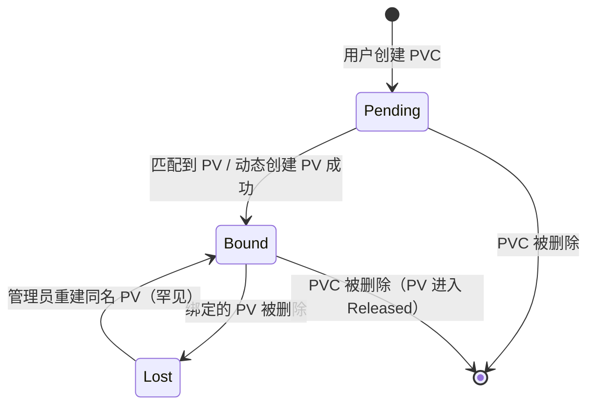

# 03 - PVC使用模式与最佳实践

> **适用版本**: Kubernetes v1.25 - v1.32 | **运维重点**: 使用模式、配置最佳实践、生产环境优化 | **最后更新**: 2026-02

## 目录

1. [PVC设计架构](#pvc设计架构)
2. [常见使用模式](#常见使用模式)
3. [配置最佳实践](#配置最佳实践)
4. [性能优化策略](#性能优化策略)
5. [故障预防措施](#故障预防措施)
6. [企业级配置模板](#企业级配置模板)
7. [监控与告警](#监控与告警)
8. [最佳实践清单](#最佳实践清单)

---

## 1. PVC 设计架构

```
┌────────────────────────────────────────────────────────────────┐
│                    开发者视角 (Developer)                       │
│  ┌──────────────────────────────────────────────────────────┐  │
│  │  PVC: "我需要 100Gi 存储，支持读写，性能要求高"          │  │
│  └──────────────────────────────────────────────────────────┘  │
└────────────────────────────────────────────────────────────────┘
                              │
                              ▼
┌────────────────────────────────────────────────────────────────┐
│                    平台视角 (Platform)                          │
│  ┌──────────────────────────────────────────────────────────┐  │
│  │  StorageClass: "high-performance → ESSD PL2 + 拓扑感知" │  │
│  └──────────────────────────────────────────────────────────┘  │
└────────────────────────────────────────────────────────────────┘
                              │
                              ▼
┌────────────────────────────────────────────────────────────────┐
│                    基础设施视角 (Infrastructure)                │
│  ┌──────────────────────────────────────────────────────────┐  │
│  │  CSI Driver → 云厂商 API → 创建/挂载/扩容/快照           │  │
│  └──────────────────────────────────────────────────────────┘  │
└────────────────────────────────────────────────────────────────┘
```

---

## 2. PVC 规格字段详解

| 字段 | 类型 | 必填 | 说明 |
|:---|:---|:---:|:---|
| `accessModes` | []string | 是 | 访问模式：RWO/ROX/RWX/RWOP |
| `resources.requests.storage` | Quantity | 是 | 请求的存储容量 |
| `resources.limits.storage` | Quantity | 否 | 存储容量上限（通常不设） |
| `storageClassName` | string | 否 | 指定 StorageClass，空字符串禁用动态供给 |
| `volumeMode` | string | 否 | Filesystem(默认) / Block |
| `volumeName` | string | 否 | 指定绑定的 PV 名称（静态绑定） |
| `selector` | LabelSelector | 否 | 通过标签选择 PV |
| `dataSource` | TypedLocalObjectReference | 否 | 克隆/恢复数据源 |
| `dataSourceRef` | TypedObjectReference | 否 | 跨命名空间数据源(v1.26+) |

### PVC 三种状态详解

| 状态 | 含义 | 触发条件 | 排查命令 |
|------|------|---------|---------|
| **Pending** | 等待绑定 | PVC 刚创建，尚未匹配到 PV 或 StorageClass 无法动态供给 | `kubectl describe pvc <name>` 查看 Events |
| **Bound** | 已绑定 | PVC 成功匹配到 PV（静态或动态） | `kubectl get pvc <name> -o jsonpath='{.spec.volumeName}'` 查看绑定的 PV |
| **Lost** | 丢失 | PVC 引用的 PV 被删除，绑定关系断裂 | `kubectl get pv` 确认 PV 是否存在 |



**Pending 常见原因速查**:

| 原因 | Events 关键词 | 解决方案 |
|------|-------------|---------|
| StorageClass 不存在 | `storageclass.storage.k8s.io "xxx" not found` | 创建 SC 或修正 PVC 中的名称 |
| CSI Provisioner 异常 | `failed to provision volume` | `kubectl get pods -n kube-system -l app=csi-controller` |
| 云商配额不足 | `quota exceeded` / `limit exceeded` | 申请提升配额 |
| 拓扑不匹配 | `node(s) had volume node affinity conflict` | 检查 `allowedTopologies` 和节点标签 |
| ResourceQuota 限制 | `exceeded quota` | `kubectl describe resourcequota -n <ns>` |
| 无可用 PV（静态） | `no persistent volumes available` | 创建匹配的 PV 或改用动态供给 |

### volumeMode 选择指南

| volumeMode | 行为 | Pod 中使用方式 | 适用场景 |
|------------|------|--------------|---------|
| **Filesystem**（默认） | PV 先被格式化为文件系统（ext4/xfs），再挂载到 Pod | `volumeMounts.mountPath` | 通用场景（日志、配置、应用数据） |
| **Block** | PV 作为原始块设备直接暴露给 Pod，不经过文件系统 | `volumeDevices.devicePath` | 数据库裸设备、高性能 I/O、自定义文件系统 |

```yaml
# Filesystem 模式（默认）
apiVersion: v1
kind: PersistentVolumeClaim
metadata:
  name: fs-pvc
spec:
  volumeMode: Filesystem
  accessModes: [ReadWriteOnce]
  resources:
    requests:
      storage: 100Gi
---
apiVersion: v1
kind: Pod
metadata:
  name: fs-pod
spec:
  containers:
  - name: app
    image: nginx
    volumeMounts:
    - name: data
      mountPath: /data
  volumes:
  - name: data
    persistentVolumeClaim:
      claimName: fs-pvc
```

```yaml
# Block 模式 — 数据库裸设备
apiVersion: v1
kind: PersistentVolumeClaim
metadata:
  name: block-pvc
spec:
  volumeMode: Block
  accessModes: [ReadWriteOnce]
  storageClassName: fast-ssd
  resources:
    requests:
      storage: 500Gi
---
apiVersion: v1
kind: Pod
metadata:
  name: db-pod
spec:
  containers:
  - name: mysql
    image: mysql:8.0
    volumeDevices:
    - name: data
      devicePath: /dev/xvda
    env:
    - name: MYSQL_ROOT_PASSWORD
      value: "password"
  volumes:
  - name: data
    persistentVolumeClaim:
      claimName: block-pvc
```

**选择决策**:

```
应用需要什么?
├─ 文件操作（读写文件、日志）→ Filesystem
├─ 共享目录（多 Pod 访问）→ Filesystem
├─ 数据库需要最高 I/O 性能 → Block（绕过文件系统开销）
├─ 自定义文件系统（如 ZFS/Btrfs）→ Block
└─ 不确定? → Filesystem（默认，99% 场景够用）
```

### 跨命名空间 PVC 使用限制

> **重要**: PVC 是 **命名空间级（namespace-scoped）** 资源，Pod 只能引用**同一命名空间**内的 PVC。PV 是集群级资源，但通过 PVC 间接访问。

```bash
# ❌ 错误：Pod 无法引用其他命名空间的 PVC
# Pod 在 namespace-A，PVC 在 namespace-B → 不可用

# ✅ 正确做法：
# 方案1: 在每个需要的命名空间中创建独立的 PVC
# 方案2: 使用共享文件存储（RWX 模式的 NFS/NAS），每个命名空间各创建 PVC 指向同一后端
# 方案3: 使用 CSI 的跨命名空间克隆（v1.26+ dataSourceRef）
```

```yaml
# 方案2 示例：多个命名空间共享同一 NFS 后端
# namespace: team-a
apiVersion: v1
kind: PersistentVolumeClaim
metadata:
  name: shared-data
  namespace: team-a
spec:
  accessModes: [ReadWriteMany]
  storageClassName: nfs-storage
  resources:
    requests:
      storage: 10Gi
---
# namespace: team-b（同一 NFS 后端，独立 PVC）
apiVersion: v1
kind: PersistentVolumeClaim
metadata:
  name: shared-data
  namespace: team-b
spec:
  accessModes: [ReadWriteMany]
  storageClassName: nfs-storage
  resources:
    requests:
      storage: 10Gi
```

```yaml
# 方案3 示例：跨命名空间卷克隆（v1.26+）
apiVersion: v1
kind: PersistentVolumeClaim
metadata:
  name: cloned-pvc
  namespace: team-b
spec:
  accessModes: [ReadWriteOnce]
  dataSourceRef:
    name: source-pvc
    namespace: team-a
    kind: PersistentVolumeClaim
  storageClassName: fast-ssd
  resources:
    requests:
      storage: 50Gi
```

---

## 3. PVC 使用模式

### 模式一：动态供给 (Dynamic Provisioning) - 推荐

```yaml
apiVersion: v1
kind: PersistentVolumeClaim
metadata:
  name: mysql-data
  namespace: production
spec:
  accessModes:
    - ReadWriteOnce
  storageClassName: alicloud-disk-essd  # 指定 StorageClass
  resources:
    requests:
      storage: 100Gi
```

### 模式二：静态绑定 (Static Binding)

```yaml
# 预先创建 PV
apiVersion: v1
kind: PersistentVolume
metadata:
  name: nfs-data-pv
spec:
  capacity:
    storage: 500Gi
  accessModes:
    - ReadWriteMany
  persistentVolumeReclaimPolicy: Retain
  storageClassName: ""  # 空字符串表示静态
  nfs:
    server: 10.0.0.100
    path: /exports/data
---
# PVC 绑定指定 PV
apiVersion: v1
kind: PersistentVolumeClaim
metadata:
  name: nfs-data
spec:
  accessModes:
    - ReadWriteMany
  storageClassName: ""  # 必须为空
  volumeName: nfs-data-pv  # 指定 PV
  resources:
    requests:
      storage: 500Gi
```

### 模式三：标签选择器绑定 (Selector Binding)

```yaml
# PV 带标签
apiVersion: v1
kind: PersistentVolume
metadata:
  name: fast-ssd-pv-01
  labels:
    storage-tier: fast
    region: cn-hangzhou
spec:
  capacity:
    storage: 200Gi
  accessModes:
    - ReadWriteOnce
  storageClassName: manual
  local:
    path: /mnt/ssd
  nodeAffinity:
    required:
      nodeSelectorTerms:
        - matchExpressions:
            - key: kubernetes.io/hostname
              operator: In
              values: ["node-1"]
---
# PVC 通过选择器匹配
apiVersion: v1
kind: PersistentVolumeClaim
metadata:
  name: app-data
spec:
  accessModes:
    - ReadWriteOnce
  storageClassName: manual
  selector:
    matchLabels:
      storage-tier: fast
    matchExpressions:
      - key: region
        operator: In
        values: ["cn-hangzhou", "cn-shanghai"]
  resources:
    requests:
      storage: 100Gi
```

---

## 4. PVC 与 Pod 绑定模式

### 方式一：直接挂载

```yaml
apiVersion: v1
kind: Pod
metadata:
  name: mysql
spec:
  containers:
    - name: mysql
      image: mysql:8.0
      volumeMounts:
        - name: data
          mountPath: /var/lib/mysql
  volumes:
    - name: data
      persistentVolumeClaim:
        claimName: mysql-data
```

### 方式二：StatefulSet volumeClaimTemplates (推荐有状态应用)

```yaml
apiVersion: apps/v1
kind: StatefulSet
metadata:
  name: mysql
spec:
  serviceName: mysql
  replicas: 3
  selector:
    matchLabels:
      app: mysql
  template:
    metadata:
      labels:
        app: mysql
    spec:
      containers:
        - name: mysql
          image: mysql:8.0
          volumeMounts:
            - name: data
              mountPath: /var/lib/mysql
  volumeClaimTemplates:  # 自动为每个 Pod 创建 PVC
    - metadata:
        name: data
      spec:
        accessModes: ["ReadWriteOnce"]
        storageClassName: alicloud-disk-essd
        resources:
          requests:
            storage: 100Gi
# 自动创建: data-mysql-0, data-mysql-1, data-mysql-2
```

### 方式三：多 Pod 共享 PVC (RWX)

```yaml
apiVersion: apps/v1
kind: Deployment
metadata:
  name: web-app
spec:
  replicas: 5
  selector:
    matchLabels:
      app: web
  template:
    metadata:
      labels:
        app: web
    spec:
      containers:
        - name: nginx
          image: nginx:1.24
          volumeMounts:
            - name: shared-data
              mountPath: /usr/share/nginx/html
      volumes:
        - name: shared-data
          persistentVolumeClaim:
            claimName: shared-nas  # 必须是 RWX
---
apiVersion: v1
kind: PersistentVolumeClaim
metadata:
  name: shared-nas
spec:
  accessModes:
    - ReadWriteMany  # 多 Pod 共享
  storageClassName: alicloud-nas
  resources:
    requests:
      storage: 100Gi
```

---

## 5. PVC 高级配置

### 5.1 基于快照创建 PVC (克隆)

```yaml
# 创建快照
apiVersion: snapshot.storage.k8s.io/v1
kind: VolumeSnapshot
metadata:
  name: mysql-snapshot-20260118
spec:
  volumeSnapshotClassName: alicloud-disk-snapshot
  source:
    persistentVolumeClaimName: mysql-data
---
# 从快照恢复
apiVersion: v1
kind: PersistentVolumeClaim
metadata:
  name: mysql-data-restored
spec:
  accessModes:
    - ReadWriteOnce
  storageClassName: alicloud-disk-essd
  resources:
    requests:
      storage: 100Gi  # 必须 >= 源 PVC
  dataSource:
    name: mysql-snapshot-20260118
    kind: VolumeSnapshot
    apiGroup: snapshot.storage.k8s.io
```

### 5.2 PVC 克隆 (Volume Cloning)

```yaml
apiVersion: v1
kind: PersistentVolumeClaim
metadata:
  name: mysql-data-clone
spec:
  accessModes:
    - ReadWriteOnce
  storageClassName: alicloud-disk-essd
  resources:
    requests:
      storage: 100Gi
  dataSource:
    name: mysql-data  # 源 PVC
    kind: PersistentVolumeClaim
```

### 5.3 临时卷 (Ephemeral Volumes) - v1.25+

```yaml
apiVersion: v1
kind: Pod
metadata:
  name: data-processor
spec:
  containers:
    - name: processor
      image: data-processor:v1
      volumeMounts:
        - name: scratch
          mountPath: /tmp/work
  volumes:
    - name: scratch
      ephemeral:  # 临时卷，Pod 删除时自动清理
        volumeClaimTemplate:
          spec:
            accessModes: ["ReadWriteOnce"]
            storageClassName: alicloud-disk-efficiency
            resources:
              requests:
                storage: 50Gi
```

---

## 6. PVC 容量管理

### 6.1 在线扩容 (Volume Expansion)

```yaml
# StorageClass 必须支持扩容
apiVersion: storage.k8s.io/v1
kind: StorageClass
metadata:
  name: expandable-essd
provisioner: diskplugin.csi.alibabacloud.com
allowVolumeExpansion: true  # 启用扩容
parameters:
  type: cloud_essd
```

```bash
# 扩容 PVC
kubectl patch pvc mysql-data -p '{"spec":{"resources":{"requests":{"storage":"200Gi"}}}}'

# 查看扩容状态
kubectl get pvc mysql-data -o jsonpath='{.status.conditions}'

# 等待扩容完成
kubectl wait --for=condition=FileSystemResizePending pvc/mysql-data --timeout=300s
```

### 6.2 扩容状态检查

| Condition | 含义 |
|:---|:---|
| `FileSystemResizePending` | 底层卷已扩容，等待文件系统扩展 |
| `Resizing` | 正在扩容中 |
| 无 condition | 扩容完成 |

### 6.3 扩容失败回滚

```bash
# 如果扩容失败，需要恢复原始大小
# 注意：不是所有存储都支持缩容

# 方案一：从备份恢复
kubectl apply -f mysql-snapshot-restore.yaml

# 方案二：手动清理（危险）
kubectl patch pvc mysql-data -p '{"spec":{"resources":{"requests":{"storage":"100Gi"}}}}'
```

### 6.4 离线扩容（需要停止 Pod）

部分场景下在线扩容不生效，必须执行离线扩容：

| 场景 | 原因 |
|------|------|
| CSI 驱动不支持在线文件系统扩容 | 需要卸载后执行 `xfs_growfs` / `resize2fs` |
| PVC 使用 Block volumeMode | 无文件系统层，需要应用自行管理 |
| 内核版本过低（< 4.2） | 不支持在线 resize |

```bash
# 离线扩容操作步骤:

# 1. 扩容 PVC（存储后端扩容）
kubectl patch pvc mysql-data -p '{"spec":{"resources":{"requests":{"storage":"200Gi"}}}}'

# 2. 等待底层卷扩容完成
kubectl get pvc mysql-data -o jsonpath='{.status.conditions[?(@.type=="FileSystemResizePending")]}'

# 3. 停止使用 PVC 的 Pod
kubectl scale statefulset mysql --replicas=0

# 4. 等待 Pod 终止和卷卸载
kubectl get pods -l app=mysql --watch

# 5. 删除 PVC 的 VolumeAttachment（如卡住）
kubectl get volumeattachment | grep mysql-data
kubectl delete volumeattachment <va-name>  # 仅在卡住时执行

# 6. 重新启动 Pod（触发文件系统扩容）
kubectl scale statefulset mysql --replicas=3

# 7. 验证扩容结果
kubectl exec mysql-0 -- df -h /var/lib/mysql
```

> **注意**: 离线扩容期间应用不可用。生产环境建议在维护窗口执行，并提前通知业务方。

---

## 7. 资源配额与限制

### 7.1 命名空间存储配额

```yaml
apiVersion: v1
kind: ResourceQuota
metadata:
  name: storage-quota
  namespace: team-a
spec:
  hard:
    requests.storage: "1Ti"                           # 总存储限制
    persistentvolumeclaims: "50"                      # PVC 数量限制
    alicloud-disk-essd.storageclass.storage.k8s.io/requests.storage: "500Gi"  # 指定 SC 限制
    alicloud-disk-essd.storageclass.storage.k8s.io/persistentvolumeclaims: "20"
```

### 7.2 LimitRange 限制单个 PVC

```yaml
apiVersion: v1
kind: LimitRange
metadata:
  name: storage-limits
  namespace: team-a
spec:
  limits:
    - type: PersistentVolumeClaim
      max:
        storage: 100Gi    # 单个 PVC 最大
      min:
        storage: 1Gi      # 单个 PVC 最小
      default:
        storage: 10Gi     # 默认值
```

---

## 8. 多场景 PVC 模板

### 8.1 MySQL 高可用集群

```yaml
apiVersion: apps/v1
kind: StatefulSet
metadata:
  name: mysql-cluster
spec:
  serviceName: mysql
  replicas: 3
  selector:
    matchLabels:
      app: mysql
  template:
    metadata:
      labels:
        app: mysql
    spec:
      affinity:
        podAntiAffinity:
          requiredDuringSchedulingIgnoredDuringExecution:
            - labelSelector:
                matchLabels:
                  app: mysql
              topologyKey: kubernetes.io/hostname
      containers:
        - name: mysql
          image: mysql:8.0
          resources:
            requests:
              memory: "4Gi"
              cpu: "2"
          volumeMounts:
            - name: data
              mountPath: /var/lib/mysql
            - name: log
              mountPath: /var/log/mysql
  volumeClaimTemplates:
    - metadata:
        name: data
      spec:
        accessModes: ["ReadWriteOnce"]
        storageClassName: alicloud-disk-essd-pl2  # 高性能
        resources:
          requests:
            storage: 200Gi
    - metadata:
        name: log
      spec:
        accessModes: ["ReadWriteOnce"]
        storageClassName: alicloud-disk-efficiency  # 日志用普通盘
        resources:
          requests:
            storage: 50Gi
```

### 8.2 Elasticsearch 冷热分离

```yaml
# Hot 节点 - 高性能 SSD
apiVersion: apps/v1
kind: StatefulSet
metadata:
  name: es-hot
spec:
  replicas: 3
  volumeClaimTemplates:
    - metadata:
        name: data
      spec:
        accessModes: ["ReadWriteOnce"]
        storageClassName: alicloud-disk-essd-pl2
        resources:
          requests:
            storage: 500Gi
---
# Warm 节点 - 普通 SSD
apiVersion: apps/v1
kind: StatefulSet
metadata:
  name: es-warm
spec:
  replicas: 2
  volumeClaimTemplates:
    - metadata:
        name: data
      spec:
        accessModes: ["ReadWriteOnce"]
        storageClassName: alicloud-disk-essd-pl0
        resources:
          requests:
            storage: 2Ti
---
# Cold 节点 - 高效云盘
apiVersion: apps/v1
kind: StatefulSet
metadata:
  name: es-cold
spec:
  replicas: 2
  volumeClaimTemplates:
    - metadata:
        name: data
      spec:
        accessModes: ["ReadWriteOnce"]
        storageClassName: alicloud-disk-efficiency
        resources:
          requests:
            storage: 10Ti
```

### 8.3 AI/ML 训练数据集

```yaml
# 共享训练数据集 (NAS)
apiVersion: v1
kind: PersistentVolumeClaim
metadata:
  name: training-dataset
  namespace: ml-platform
spec:
  accessModes:
    - ReadOnlyMany  # 多训练 Pod 只读共享
  storageClassName: alicloud-nas-extreme  # 极速 NAS
  resources:
    requests:
      storage: 10Ti
---
# 模型输出目录 (每个任务独立)
apiVersion: v1
kind: PersistentVolumeClaim
metadata:
  name: model-output-job-001
  namespace: ml-platform
spec:
  accessModes:
    - ReadWriteOnce
  storageClassName: alicloud-disk-essd-pl1
  resources:
    requests:
      storage: 100Gi
```

---

## 9. 故障排查

### 9.1 PVC 状态诊断流程

```
PVC Pending?
    │
    ├── StorageClass 存在? ──No──▶ 创建 StorageClass 或修正名称
    │
    ├── CSI Driver 就绪? ──No──▶ kubectl get pods -n kube-system | grep csi
    │
    ├── 配额充足? ──No──▶ kubectl describe quota -n <ns>
    │
    ├── 节点有符合拓扑? ──No──▶ 检查 allowedTopologies
    │
    └── 检查 Events ──▶ kubectl describe pvc <name>
```

### 9.2 常用诊断命令

```bash
# 查看 PVC 状态
kubectl get pvc -A -o wide

# 查看 PVC 详情
kubectl describe pvc <name> -n <namespace>

# 查看绑定的 PV
kubectl get pv $(kubectl get pvc <name> -o jsonpath='{.spec.volumeName}')

# 检查存储配额
kubectl describe resourcequota -n <namespace>

# 查看 CSI 驱动状态
kubectl get csidrivers
kubectl get csinodes

# 查看存储相关事件
kubectl get events --field-selector reason=ProvisioningFailed
kubectl get events --field-selector reason=FailedMount
```

### 9.3 常见问题与解决

| 问题 | 原因 | 解决方案 |
|:---|:---|:---|
| PVC 一直 Pending | StorageClass 不存在 | 检查 SC 名称拼写 |
| PVC 一直 Pending | CSI 驱动未就绪 | 检查 CSI Pod 状态 |
| PVC 一直 Pending | 存储配额不足 | 扩大配额或清理资源 |
| PVC Bound 但 Pod 挂载失败 | 跨可用区 | 使用 WaitForFirstConsumer |
| 扩容后容量未变 | 需要重启 Pod | 删除 Pod 触发重新挂载 |
| 删除 PVC 卡住 | 有 Pod 仍在使用 | 先删除使用该 PVC 的 Pod |

---
---
## 企业级配置模板

### 标准化PVC配置库

```yaml
# 企业级PVC配置模板
apiVersion: v1
kind: List
items:
# 数据库专用PVC模板
- apiVersion: v1
  kind: PersistentVolumeClaim
  metadata:
    name: database-pvc-template
    namespace: production
    labels:
      app: database
      tier: backend
      environment: production
    annotations:
      description: "生产环境数据库存储卷"
      backup-policy: "hourly-snapshot"
      retention-days: "30"
      sla-tier: "platinum"
  spec:
    accessModes:
      - ReadWriteOnce
    storageClassName: fast-ssd-pl3
    resources:
      requests:
        storage: 500Gi
    volumeMode: Filesystem

# 应用服务PVC模板
- apiVersion: v1
  kind: PersistentVolumeClaim
  metadata:
    name: application-pvc-template
    namespace: production
    labels:
      app: application
      tier: frontend
      environment: production
    annotations:
      description: "应用服务存储卷"
      backup-policy: "daily-snapshot"
      retention-days: "7"
      sla-tier: "gold"
  spec:
    accessModes:
      - ReadWriteOnce
    storageClassName: standard-ssd-pl1
    resources:
      requests:
        storage: 100Gi
    volumeMode: Filesystem

# 共享存储PVC模板
- apiVersion: v1
  kind: PersistentVolumeClaim
  metadata:
    name: shared-storage-pvc-template
    namespace: production
    labels:
      app: shared
      access-mode: rwx
      environment: production
    annotations:
      description: "共享文件存储卷"
      backup-policy: "weekly-backup"
      retention-days: "30"
  spec:
    accessModes:
      - ReadWriteMany
    storageClassName: shared-nas
    resources:
      requests:
        storage: 1Ti
    volumeMode: Filesystem
```

### PVC命名规范与标签策略

```yaml
# PVC命名和标签标准
pvc_naming_standards:
  format: "{application}-{component}-{environment}-{purpose}"
  examples:
    - "mysql-primary-prod-data"     # 主数据库生产数据
    - "redis-cache-staging-temp"    # Redis缓存测试临时数据
    - "nginx-logs-prod-archive"     # Nginx日志生产归档
    - "elasticsearch-data-dev-warm" # ES开发环境温数据
  
  required_labels:
    app: "应用名称"
    component: "组件类型(db/cache/logs)"
    environment: "环境(prod/staging/dev)"
    tier: "服务等级(platinum/gold/silver)"
    backup-required: "是否需要备份(true/false)"
    sla-tier: "SLA等级"
```

---
## 监控与告警配置

### PVC健康监控指标

```yaml
# PVC监控告警规则
pvc_monitoring_alerts:
  capacity_alerts:
    - name: "PVCUsageWarning"
      expr: "(kubelet_volume_stats_used_bytes / kubelet_volume_stats_capacity_bytes) * 100 > 80"
      severity: "warning"
      description: "PVC使用率超过80%"
      
    - name: "PVCUsageCritical"
      expr: "(kubelet_volume_stats_used_bytes / kubelet_volume_stats_capacity_bytes) * 100 > 95"
      severity: "critical"
      description: "PVC使用率超过95%"
      
  inode_alerts:
    - name: "PVCInodeWarning"
      expr: "(kubelet_volume_stats_inodes_used / kubelet_volume_stats_inodes) * 100 > 85"
      severity: "warning"
      description: "PVC inode使用率超过85%"
      
  status_alerts:
    - name: "PVCPendingTooLong"
      expr: "kube_persistentvolumeclaim_status_phase{phase='Pending'} > 0"
      severity: "warning"
      duration: "10m"
      description: "PVC长时间处于Pending状态"
```

### 自动化运维脚本

```bash
#!/bin/bash
# pvc-management-automation.sh

# PVC自动化管理脚本
manage_pvc_operations() {
    echo "🔧 执行PVC自动化管理..."
    
    # 1. 检查Pending状态的PVC
    echo "🔍 检查Pending PVC..."
    PENDING_PVC=$(kubectl get pvc --all-namespaces --field-selector=status.phase=Pending -o json | \
        jq -r '.items[] | "\(.metadata.namespace)/\(.metadata.name)"')
    
    if [ -n "$PENDING_PVC" ]; then
        echo "发现Pending PVC:"
        echo "$PENDING_PVC"
        # 可以在这里添加自动处理逻辑
    fi
    
    # 2. 检查高使用率PVC
    echo "📊 检查高使用率PVC..."
    HIGH_USAGE_PVC=$(kubectl get pvc --all-namespaces -o json | \
        jq -r '.items[] | select(.status.capacity.storage and .spec.resources.requests.storage) |
               .usage_ratio = (.status.capacity.storage | split("Gi")[0] | tonumber) /
                             (.spec.resources.requests.storage | split("Gi")[0] | tonumber) |
               select(.usage_ratio > 0.9) |
               "\(.metadata.namespace)/\(.metadata.name): \(.usage_ratio*100)%"')
    
    if [ -n "$HIGH_USAGE_PVC" ]; then
        echo "高使用率PVC (>90%):"
        echo "$HIGH_USAGE_PVC"
    fi
    
    # 3. 自动生成PVC报告
    echo "📋 生成PVC使用报告..."
    REPORT_FILE="/tmp/pvc-report-$(date +%Y%m%d).txt"
    cat > $REPORT_FILE <<EOF
PVC使用情况报告 - $(date)
==========================

总体统计:
- PVC总数: $(kubectl get pvc --all-namespaces | wc -l)
- Pending PVC: $(kubectl get pvc --all-namespaces --field-selector=status.phase=Pending | wc -l)
- Bound PVC: $(kubectl get pvc --all-namespaces --field-selector=status.phase=Bound | wc -l)

各命名空间PVC数量:
$(kubectl get pvc --all-namespaces --no-headers | awk '{print $1}' | sort | uniq -c)

高使用率PVC (>80%):
$HIGH_USAGE_PVC
EOF
    
    echo "报告已生成: $REPORT_FILE"
}

# 执行管理操作
manage_pvc_operations
```

---
## 最佳实践总结

### 🎯 核心原则

1. **明确需求优先**: 根据应用特性选择合适的存储类型和访问模式
2. **标准化配置**: 建立统一的命名规范、标签策略和配置模板
3. **监控预警**: 设置合理的监控指标和告警阈值
4. **容量规划**: 预留充足的安全边际，制定扩容策略
5. **备份保护**: 根据数据重要性制定差异化的备份策略

### 📋 实施检查清单

```markdown
## PVC部署前检查清单

### 配置规范性
- [ ] PVC命名符合标准格式
- [ ] 正确设置了必要的标签
- [ ] 选择了合适的StorageClass
- [ ] 容量请求合理（预留20-30%余量）
- [ ] 访问模式与应用需求匹配

### 安全合规性
- [ ] 生产环境使用Retain回收策略
- [ ] 敏感数据启用了加密
- [ ] 设置了适当的备份策略
- [ ] 符合数据分类和保护要求

### 监控完备性
- [ ] 配置了容量使用率监控
- [ ] 设置了inode使用率告警
- [ ] 建立了Pending状态检测
- [ ] 制定了性能基线指标

### 运维可维护性
- [ ] 文档化了PVC用途和配置
- [ ] 建立了变更管理流程
- [ ] 制定了应急处理预案
- [ ] 定期审查和优化配置
```

---

---

**表格底部标记**: Kusheet Project | 作者: Allen Galler (allengaller@gmail.com)
