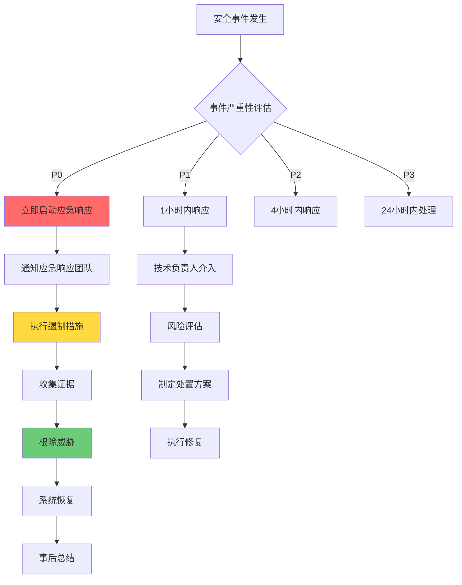

# 20 - 安全事件响应与应急处理流程

> **适用版本**: Kubernetes v1.25 - v1.32 | **难度**: 专家级 | **参考**: [NIST Computer Security Incident Handling Guide](https://csrc.nist.gov/publications/detail/sp/800-61/rev-2/final) | [SANS Incident Handling Process](https://www.sans.org/reading-room/whitepapers/incident/incident-handlers-handbook-33901)

## 一、安全事件响应体系架构

### 1.1 事件响应组织架构

```
┌─────────────────────────────────────────────────────────────────────────────────────┐
│                      Kubernetes Security Incident Response Team                      │
├─────────────────────────────────────────────────────────────────────────────────────┤
│                                                                                      │
│  ┌────────────────────────────────────────────────────────────────────────────────┐ │
│  │                           Incident Response Roles                              │ │
│  │  ┌──────────────┐  ┌──────────────┐  ┌──────────────┐  ┌──────────────┐       │ │
│  │  │  IR Manager  │  │  Technical   │  │   Forensic   │  │  Communic-   │       │ │
│  │  │   事件经理   │  │   技术负责人  │  │   取证专家   │  │   沟通协调   │       │ │
│  │  │              │  │              │  │              │  │              │       │ │
│  │  │ • 统筹指挥   │  │ • 技术决策   │  │ • 证据保全   │  │ • 内外沟通   │       │ │
│  │  │ • 资源调配   │  │ • 系统恢复   │  │ • 日志分析   │  │ • 报告撰写   │       │ │
│  │  └──────┬───────┘  └──────┬───────┘  └──────┬───────┘  └──────┬───────┘       │ │
│  │         │                 │                 │                 │                │ │
│  │         └─────────────────┼─────────────────┼─────────────────┘                │ │
│  │                           │                 │                                  │ │
│  │                    ┌──────▼─────────────────▼──────┐                          │ │
│  │                    │      Response Phases          │                          │ │
│  │                    │        响应阶段               │                          │ │
│  │                    └───────────────────────────────┘                          │ │
│  └────────────────────────────────────────────────────────────────────────────────┘ │
│                                    │                                                │
│  ┌─────────────────────────────────▼──────────────────────────────────────────────┐ │
│  │                           Response Process Flow                                │ │
│  │                                                                                 │ │
│  │  Preparation(准备) → Detection(检测) → Analysis(分析) → Containment(遏制)        │ │
│           ↑                                                                        │ │
│           │                                                                        │ │
│  Recovery(恢复) ← Eradication(根除) ← Lessons Learned(总结)                        │ │
│                                                                                 │ │
│  ┌────────────────────────────────────────────────────────────────────────────────┐ │
│  │                           Response Tools                                      │ │
│  │  ┌──────────────┐  ┌──────────────┐  ┌──────────────┐  ┌──────────────┐       │ │
│  │  │   SIEM       │  │   SOAR       │  │   EDR        │  │   Forensic   │       │ │
│  │  │   日志分析   │  │   编排响应   │  │   终端检测   │  │   取证工具   │       │ │
│  │  └──────────────┘  └──────────────┘  └──────────────┘  └──────────────┘       │ │
│  └────────────────────────────────────────────────────────────────────────────────┘ │
│                                                                                      │
└─────────────────────────────────────────────────────────────────────────────────────┘
```

### 1.2 事件分类与优先级

#### 事件严重性分级

| 级别 | 名称 | 响应时间 | 影响范围 | 通知对象 | 示例 |
|-----|------|---------|---------|---------|------|
| **P0** | 紧急事件 | 15分钟内 | 全系统瘫痪 | CTO、安全委员会 | 集群完全不可用 |
| **P1** | 高优先级 | 1小时内 | 核心业务中断 | 技术总监、运维团队 | 数据库被加密勒索 |
| **P2** | 中优先级 | 4小时内 | 部分功能异常 | 安全团队、相关团队 | 敏感数据泄露 |
| **P3** | 低优先级 | 24小时内 | 轻微安全问题 | 安全工程师 | 弱密码警告 |

#### 事件类型分类矩阵

```yaml
# 01-incident-classification.yaml
incidentTypes:
  unauthorizedAccess:
    category: "访问控制"
    examples:
    - "未授权的API访问"
    - "凭证泄露"
    - "权限提升攻击"
    severityMapping:
      attempted: "P3"
      successful: "P1"
      
  malwareActivity:
    category: "恶意软件"
    examples:
    - "挖矿软件感染"
    - "后门程序植入"
    - "Rootkit检测"
    severityMapping:
      detected: "P2"
      active: "P0"
      
  dataBreach:
    category: "数据泄露"
    examples:
    - "敏感配置泄露"
    - "客户数据外泄"
    - "密钥暴露"
    severityMapping:
      suspected: "P2"
      confirmed: "P0"
      
  denialOfService:
    category: "拒绝服务"
    examples:
    - "DDoS攻击"
    - "资源耗尽"
    - "服务不可用"
    severityMapping:
      partial: "P2"
      complete: "P0"
```

## 二、事件检测与告警机制

### 2.1 多层次监控体系

#### 核心监控指标配置

```yaml
# 02-security-monitoring-rules.yaml
apiVersion: monitoring.coreos.com/v1
kind: PrometheusRule
metadata:
  name: security-incident-rules
  namespace: monitoring
spec:
  groups:
  - name: security.incidents
    rules:
    # 1. 异常认证尝试
    - alert: UnusualAuthenticationAttempts
      expr: increase(kube_auth_user_requests_total{verb=~"create|update|delete"}[5m]) > 50
      for: 2m
      labels:
        severity: warning
        category: "unauthorizedAccess"
      annotations:
        summary: "异常认证请求检测"
        description: "用户 {{ $labels.user }} 在5分钟内发起 {{ $value }} 次敏感操作请求"
        
    # 2. 异常网络连接
    - alert: SuspiciousNetworkConnections
      expr: rate(container_network_transmit_packets_total{pod=~".+"}[5m]) > 10000
      for: 3m
      labels:
        severity: critical
        category: "malwareActivity"
      annotations:
        summary: "可疑网络连接"
        description: "Pod {{ $labels.pod }} 网络传输包速率异常: {{ $value }}/s"
        
    # 3. 文件系统异常修改
    - alert: FileSystemTampering
      expr: changes(container_fs_writes_total[10m]) > 100
      for: 5m
      labels:
        severity: critical
        category: "malwareActivity"
      annotations:
        summary: "文件系统篡改检测"
        description: "容器文件系统在10分钟内发生 {{ $value }} 次写入变化"
        
    # 4. CPU异常使用
    - alert: AbnormalCPUUsage
      expr: rate(container_cpu_usage_seconds_total[5m]) > 0.9
      for: 3m
      labels:
        severity: warning
        category: "malwareActivity"
      annotations:
        summary: "CPU使用率异常"
        description: "容器CPU使用率持续高于90%"
        
    # 5. 密钥相关操作
    - alert: SecretAccessAnomaly
      expr: increase(kube_secret_metadata_generation[10m]) > 5
      for: 2m
      labels:
        severity: critical
        category: "dataBreach"
      annotations:
        summary: "密钥访问异常"
        description: "密钥资源在10分钟内被修改 {{ $value }} 次"
```

### 2.2 威胁情报集成

#### 威胁情报平台对接

```yaml
# 03-threat-intel-integration.yaml
apiVersion: apps/v1
kind: Deployment
metadata:
  name: threat-intel-connector
  namespace: security
spec:
  replicas: 2
  selector:
    matchLabels:
      app: threat-intel-connector
  template:
    metadata:
      labels:
        app: threat-intel-connector
    spec:
      containers:
      - name: connector
        image: security/threat-intel-connector:latest
        env:
        - name: THREAT_INTEL_API_KEY
          valueFrom:
            secretKeyRef:
              name: threat-intel-secrets
              key: api-key
        - name: FEED_SOURCES
          value: "alienvault,virustotal,abuseipdb"
        - name: UPDATE_INTERVAL
          value: "300"  # 5分钟更新一次
        volumeMounts:
        - name: intel-cache
          mountPath: /var/cache/threat-intel
        readinessProbe:
          httpGet:
            path: /health
            port: 8080
          initialDelaySeconds: 30
        livenessProbe:
          httpGet:
            path: /health
            port: 8080
          initialDelaySeconds: 60
      volumes:
      - name: intel-cache
        emptyDir: {}
---
apiVersion: v1
kind: ConfigMap
metadata:
  name: threat-feeds-config
  namespace: security
data:
  feeds.yaml: |
    sources:
      alienvault:
        url: "https://reputation.alienvault.com/reputation.generic"
        format: "csv"
        indicators:
        - ip
        - domain
        - hash
        
      virustotal:
        url: "https://www.virustotal.com/api/v3/feeds/file-behaviors"
        format: "json"
        api_key_required: true
        indicators:
        - file_hash
        - url
        - domain
        
      abuseipdb:
        url: "https://api.abuseipdb.com/api/v2/blacklist"
        format: "plaintext"
        api_key_required: true
        indicators:
        - ip
```

## 三、事件分析与取证

### 3.1 数字取证工具链

#### 容器取证收集脚本

```bash
#!/bin/bash
# 04-container-forensics-collector.sh

set -euo pipefail

CONTAINER_ID=$1
INCIDENT_ID=${2:-$(date +%Y%m%d_%H%M%S)}
OUTPUT_DIR="/forensics/incident_${INCIDENT_ID}"

echo "=== Container Forensics Collection ==="
echo "Container: $CONTAINER_ID"
echo "Incident ID: $INCIDENT_ID"
echo "Output Directory: $OUTPUT_DIR"

mkdir -p "$OUTPUT_DIR"

# 1. 容器基本信息收集
echo "1. Collecting container metadata..."
docker inspect "$CONTAINER_ID" > "$OUTPUT_DIR/container_inspect.json"
docker ps --filter "id=$CONTAINER_ID" --format "table {{.ID}}\t{{.Image}}\t{{.Command}}\t{{.CreatedAt}}\t{{.Status}}" > "$OUTPUT_DIR/container_status.txt"

# 2. 文件系统快照
echo "2. Creating filesystem snapshot..."
docker export "$CONTAINER_ID" > "$OUTPUT_DIR/filesystem.tar"

# 3. 进程信息收集
echo "3. Collecting process information..."
docker top "$CONTAINER_ID" > "$OUTPUT_DIR/process_list.txt"
docker exec "$CONTAINER_ID" ps auxf > "$OUTPUT_DIR/process_tree.txt" 2>/dev/null || true

# 4. 网络连接信息
echo "4. Collecting network connections..."
docker exec "$CONTAINER_ID" netstat -tulnp > "$OUTPUT_DIR/network_connections.txt" 2>/dev/null || true
docker exec "$CONTAINER_ID" ss -tulnp > "$OUTPUT_DIR/socket_info.txt" 2>/dev/null || true

# 5. 日志收集
echo "5. Collecting logs..."
docker logs "$CONTAINER_ID" --timestamps > "$OUTPUT_DIR/container_logs.txt" 2>/dev/null || true

# 6. 环境变量收集
echo "6. Collecting environment variables..."
docker exec "$CONTAINER_ID" env > "$OUTPUT_DIR/environment_vars.txt" 2>/dev/null || true

# 7. 挂载点信息
echo "7. Collecting mount information..."
docker exec "$CONTAINER_ID" mount > "$OUTPUT_DIR/mount_points.txt" 2>/dev/null || true

# 8. 创建完整性校验
echo "8. Generating integrity checksums..."
find "$OUTPUT_DIR" -type f -exec sha256sum {} \; > "$OUTPUT_DIR/checksums.sha256"

echo "Forensics collection completed!"
echo "Results stored in: $OUTPUT_DIR"
```

### 3.2 日志分析与关联

#### 安全日志关联分析

```python
#!/usr/bin/env python3
# 05-log-correlation-analyzer.py

import json
import re
from datetime import datetime, timedelta
from collections import defaultdict
import argparse

class SecurityLogAnalyzer:
    def __init__(self):
        self.incidents = []
        self.correlation_window = timedelta(minutes=30)
        
    def parse_audit_log(self, log_line):
        """解析审计日志"""
        try:
            log_data = json.loads(log_line)
            return {
                'timestamp': datetime.fromisoformat(log_data['requestReceivedTimestamp']),
                'user': log_data.get('user', {}).get('username', 'unknown'),
                'verb': log_data.get('verb'),
                'resource': f"{log_data.get('objectRef', {}).get('resource')}/{log_data.get('objectRef', {}).get('name')}",
                'source_ips': log_data.get('sourceIPs', []),
                'user_agent': log_data.get('userAgent', ''),
                'response_code': log_data.get('responseStatus', {}).get('code')
            }
        except Exception as e:
            print(f"Error parsing log: {e}")
            return None
            
    def detect_anomalies(self, logs):
        """检测异常行为模式"""
        user_activities = defaultdict(list)
        ip_activities = defaultdict(list)
        
        # 按用户和IP分组活动
        for log in logs:
            if log:
                user_activities[log['user']].append(log)
                for ip in log['source_ips']:
                    ip_activities[ip].append(log)
                    
        # 检测异常用户行为
        suspicious_users = []
        for user, activities in user_activities.items():
            if len(activities) > 100:  # 高频操作
                suspicious_users.append({
                    'user': user,
                    'activity_count': len(activities),
                    'first_activity': min(a['timestamp'] for a in activities),
                    'last_activity': max(a['timestamp'] for a in activities),
                    'risk_level': 'HIGH'
                })
                
        # 检测可疑IP活动
        suspicious_ips = []
        for ip, activities in ip_activities.items():
            if len(set(a['user'] for a in activities)) > 5:  # 单IP多用户
                suspicious_ips.append({
                    'ip': ip,
                    'user_count': len(set(a['user'] for a in activities)),
                    'activity_count': len(activities),
                    'risk_level': 'MEDIUM'
                })
                
        return {
            'suspicious_users': suspicious_users,
            'suspicious_ips': suspicious_ips
        }

def main():
    parser = argparse.ArgumentParser(description='Security Log Correlation Analyzer')
    parser.add_argument('--input', required=True, help='Input audit log file')
    parser.add_argument('--output', default='correlation_report.json', help='Output report file')
    
    args = parser.parse_args()
    
    analyzer = SecurityLogAnalyzer()
    logs = []
    
    # 读取并解析日志
    with open(args.input, 'r') as f:
        for line in f:
            log_entry = analyzer.parse_audit_log(line.strip())
            if log_entry:
                logs.append(log_entry)
                
    # 执行关联分析
    results = analyzer.detect_anomalies(logs)
    
    # 输出结果
    with open(args.output, 'w') as f:
        json.dump(results, f, indent=2, default=str)
        
    print(f"Analysis completed. Report saved to {args.output}")
    print(f"Found {len(results['suspicious_users'])} suspicious users")
    print(f"Found {len(results['suspicious_ips'])} suspicious IPs")

if __name__ == "__main__":
    main()
```

## 四、事件遏制与处置

### 4.1 自动化响应动作

#### 应急响应Playbook

```yaml
# 06-incident-response-playbook.yaml
apiVersion: security.k8s.io/v1
kind: IncidentResponsePlaybook
metadata:
  name: standard-response-actions
spec:
  playbooks:
  - name: "compromised-pod-isolation"
    trigger:
      severity: "critical"
      category: "malwareActivity"
    actions:
    - name: "network-isolation"
      type: "network"
      script: |
        #!/bin/bash
        POD_NAME=$1
        NAMESPACE=$2
        
        # 创建隔离网络策略
        kubectl apply -f - <<EOF
        apiVersion: networking.k8s.io/v1
        kind: NetworkPolicy
        metadata:
          name: isolate-${POD_NAME}
          namespace: ${NAMESPACE}
        spec:
          podSelector:
            matchLabels:
              app: ${POD_NAME}
          policyTypes:
          - Ingress
          - Egress
          ingress: []
          egress: []
        EOF
        
        # 记录隔离操作
        echo "$(date): Isolated compromised pod ${NAMESPACE}/${POD_NAME}" >> /var/log/incident-response.log
        
    - name: "process-termination"
      type: "runtime"
      script: |
        #!/bin/bash
        POD_NAME=$1
        NAMESPACE=$2
        
        # 终止可疑进程
        kubectl exec -n ${NAMESPACE} ${POD_NAME} -- pkill -f "suspicious_process_pattern"
        
        # 收集内存转储
        kubectl exec -n ${NAMESPACE} ${POD_NAME} -- gcore $(pgrep -f "suspicious_process_pattern")
        
    - name: "image-analysis"
      type: "forensics"
      script: |
        #!/bin/bash
        POD_NAME=$1
        NAMESPACE=$2
        
        # 导出容器镜像进行离线分析
        CONTAINER_ID=$(kubectl get pod -n ${NAMESPACE} ${POD_NAME} -o jsonpath='{.status.containerStatuses[0].containerID}' | cut -d'/' -f3)
        docker save $(docker inspect --format='{{.Image}}' ${CONTAINER_ID}) -o /forensics/${POD_NAME}_image.tar
```

### 4.2 应急处置决策树



## 五、恢复与总结

### 5.1 系统恢复验证

#### 恢复后健康检查清单

```bash
#!/bin/bash
# 07-post-incident-health-check.sh

echo "=== Post-Incident Health Check ==="
INCIDENT_ID=$1
CHECK_TIME=$(date)

# 1. 基础设施状态检查
echo "1. Checking infrastructure status..."
kubectl get nodes -o wide | grep -v "Ready"

# 2. 核心服务可用性
echo "2. Checking core services..."
SERVICES=("kube-apiserver" "etcd" "kube-controller-manager" "kube-scheduler")
for svc in "${SERVICES[@]}"; do
    kubectl get pods -n kube-system -l tier=control-plane -l component=${svc} -o wide
done

# 3. 网络连通性验证
echo "3. Verifying network connectivity..."
kubectl run debug-pod --image=busybox --rm -it -- sh -c "ping -c 4 google.com"

# 4. 安全策略验证
echo "4. Validating security policies..."
kubectl get networkpolicies --all-namespaces | wc -l
kubectl get podsecuritypolicies 2>/dev/null | wc -l

# 5. 监控告警状态
echo "5. Checking monitoring alerts..."
kubectl get events --field-selector type=Warning --sort-by='.lastTimestamp' | tail -20

# 6. 性能基准测试
echo "6. Running performance benchmarks..."
kubectl top nodes
kubectl top pods --all-namespaces

# 7. 生成恢复报告
cat > /reports/incident_${INCIDENT_ID}_recovery_report.txt <<EOF
Incident Recovery Report
=======================
Incident ID: ${INCIDENT_ID}
Recovery Time: ${CHECK_TIME}
Check Status: $(if [ $? -eq 0 ]; then echo "PASSED"; else echo "FAILED"; fi)

Infrastructure Status: $(kubectl get nodes | grep -v "Ready" | wc -l) nodes unhealthy
Service Availability: $(kubectl get pods -n kube-system --no-headers | grep -v Running | wc -l) pods not running
Network Connectivity: $(timeout 5 ping -c 1 google.com >/dev/null 2>&1 && echo "OK" || echo "FAILED")

Next Steps:
1. Continue monitoring for 24-48 hours
2. Review and update security policies
3. Conduct lessons learned session
4. Update incident response procedures
EOF

echo "Health check completed. Report saved to /reports/incident_${INCIDENT_ID}_recovery_report.txt"
```

### 5.2 事后总结与改进

#### 事件复盘模板

```markdown
# 事件复盘报告模板

## 基本信息
- **事件编号**: SEC-2024-001
- **发生时间**: 2024-01-15 14:30:00 UTC
- **发现时间**: 2024-01-15 14:35:00 UTC
- **解决时间**: 2024-01-15 16:45:00 UTC
- **影响时长**: 2小时15分钟
- **影响范围**: Production API服务

## 事件详情
### 攻击向量
- 利用已知漏洞 (CVE-2023-XXXX)
- 通过未打补丁的组件入侵
- 横向移动至控制平面

### 影响评估
- **业务影响**: API服务中断，影响50万用户
- **数据影响**: 无数据泄露
- **财务影响**: 预估损失$50,000
- **声誉影响**: 媒体报道负面新闻

## 响应过程
### 时间线
```
14:30 - 异常流量检测告警
14:35 - 安全团队确认事件
14:40 - 启动P1级响应流程
15:00 - 隔离受影响节点
15:30 - 根除恶意进程
16:00 - 系统恢复验证
16:45 - 服务完全恢复正常
```

### 响应措施
1. 网络隔离受感染节点
2. 终止恶意进程和服务
3. 更新防火墙规则
4. 重新部署清理后的服务
5. 加强监控和告警

## 根本原因分析
### 直接原因
- 组件版本过旧，存在已知安全漏洞
- 自动更新机制失效

### 根本原因
- 补丁管理流程不完善
- 安全测试覆盖不足
- 监控盲点存在

## 改进措施
### 短期措施 (1-2周)
- [ ] 立即更新所有相关组件
- [ ] 加强实时监控覆盖
- [ ] 完善告警阈值设置

### 中期措施 (1-3月)
- [ ] 建立自动化补丁管理系统
- [ ] 实施零信任网络架构
- [ ] 增强安全培训和意识

### 长期措施 (3-12月)
- [ ] 建立安全开发生命周期(SDLC)
- [ ] 实施威胁建模和渗透测试
- [ ] 建立安全运营中心(SOC)

## 经验教训
### 做得好的方面
- 响应团队协作高效
- 预案执行到位
- 沟通及时透明

### 需要改进的方面
- 检测时间可以更早
- 自动化响应能力不足
- 跨团队协调有待加强

## 后续行动项
| 任务 | 负责人 | 截止日期 | 状态 |
|------|--------|----------|------|
| 更新补丁管理流程 | 安全团队 | 2024-01-22 | 进行中 |
| 部署自动化响应系统 | 运维团队 | 2024-02-15 | 计划中 |
| 完善安全培训计划 | HR部门 | 2024-03-01 | 待启动 |
```

这份安全事件响应与应急处理流程文档提供了完整的事件管理框架，从检测、分析到响应、恢复的全流程指导，特别适合生产环境的实战应用。