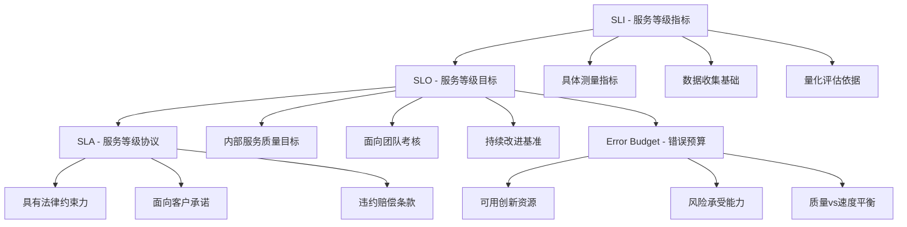

# 19 - SLO/SLI体系建设与管理 (SLO/SLI System Construction & Management)

> **适用版本**: v1.25 - v1.32 | **最后更新**: 2026-02 | **参考**: [Google SRE Workbook](https://sre.google/workbook/table-of-contents/)

## 概述

本文档从Google级SRE总监视角，系统阐述SLO(Service Level Objective)和SLI(Service Level Indicator)体系建设的企业级方法论，涵盖Google SRE最佳实践、金融级可靠性标准、智能告警策略和业务价值量化等核心技术，结合万亿级请求处理经验，为企业构建世界级服务质量管理体系提供战略指导。

---

## 一、SLO/SLI基础理论

### 1.1 核心概念体系

#### SLO/SLI/SLA关系图谱


#### 核心定义解析
```yaml
slo_sli_foundations:
  sli_definition:
    concept: 服务等级指标是衡量服务质量的具体数值指标
    characteristics:
      - measurable: 可量化测量
      - relevant: 与用户体验相关
      - actionable: 可指导改进行动
      - reliable: 测量结果可信
      
    common_sli_types:
      availability_sli:
        definition: 服务可访问时间占比
        calculation: (total_time - downtime) / total_time
        typical_threshold: 99.9%
        
      latency_sli:
        definition: 请求响应时间分布
        calculation: P50/P95/P99响应时间
        typical_threshold: P95 < 200ms
        
      correctness_sli:
        definition: 正确处理请求占比
        calculation: correct_responses / total_requests
        typical_threshold: 99.5%
        
      throughput_sli:
        definition: 单位时间内处理请求数
        calculation: requests_per_second
        typical_threshold: 95% of peak_capacity
        
  slo_definition:
    concept: 基于SLI设定的服务质量目标，体现业务价值承诺
    formulation_principles:
      - customer_centric: 以用户价值为核心
      - realistic_achievable: 现实可达的目标
      - business_aligned: 与商业目标对齐
      - measurable_trackable: 可测量可追踪
      
    slo_statement_format:
      template: "<Service> will have <SLI> of <target> over <window>"
      examples:
        - "User API will have availability of 99.9% over 30 days"
        - "Payment Service will have P95 latency under 200ms over 7 days"
        - "Order Processing will have correctness of 99.5% over 1 hour"
```

### 1.2 错误预算机制

#### Error Budget核心原理
```yaml
error_budget_mechanism:
  fundamental_concept:
    definition: SLO允许的失败额度，用于平衡质量和交付速度
    calculation: error_budget = (100% - SLO_target) * measurement_window
    
  practical_examples:
    availability_budget:
      scenario: 99.9% availability SLO for 30 days
      calculation: (1 - 0.999) * 30 * 24 * 60 = 43.2 minutes
      interpretation: 每月允许43.2分钟服务不可用
      
    latency_budget:
      scenario: P95 latency < 200ms SLO for 1 week
      calculation: (1 - 0.95) * 7 * 24 * 60 = 504 minutes
      interpretation: 每周允许504分钟超过200ms的响应
      
    release_decisions:
      green_zone: error_budget > 50% - 正常发布
      yellow_zone: error_budget 10-50% - 谨慎发布
      red_zone: error_budget < 10% - 暂停发布
      
  budget_consumption_tracking:
    real_time_monitoring:
      - current_consumption_rate: 当前消耗速率
      - projected_burn_rate: 预测消耗速率
      - remaining_budget: 剩余错误预算
      - time_to_exhaustion: 预计耗尽时间
      
    alerting_thresholds:
      warning_alert: 50% budget consumed
      critical_alert: 80% budget consumed
      emergency_alert: 95% budget consumed
```

---

## 二、SLO/SLI体系设计

### 2.1 用户旅程映射

#### 业务价值驱动的SLI识别
```yaml
user_journey_mapping:
  customer_value_streams:
    user_registration:
      journey_steps:
        - landing_page_load: 登录页面加载
        - form_submission: 表单提交
        - email_verification: 邮箱验证
        - account_activation: 账户激活
        
      critical_slis:
        - page_load_time_sli: 页面加载时间 < 2s (P95)
        - form_submit_success_sli: 表单提交成功率 99.5%
        - email_delivery_sli: 邮件送达率 99.0%
        - activation_completion_sli: 激活完成率 98.5%
        
    shopping_checkout:
      journey_steps:
        - product_browsing: 商品浏览
        - cart_addition: 加入购物车
        - payment_processing: 支付处理
        - order_confirmation: 订单确认
        
      critical_slis:
        - browse_to_cart_sli: 浏览到加购转化率 15%
        - cart_to_payment_sli: 加购到支付转化率 85%
        - payment_success_sli: 支付成功率 99.0%
        - order_completion_sli: 订单完成率 98.0%
        
    customer_support:
      journey_steps:
        - ticket_creation: 工单创建
        - agent_assignment: 客服分配
        - issue_resolution: 问题解决
        - customer_satisfaction: 客户满意
        
      critical_slis:
        - ticket_creation_sli: 工单创建成功率 99.5%
        - assignment_time_sli: 分配响应时间 < 5min (P95)
        - resolution_time_sli: 解决时间 < 24h (90%分位)
        - satisfaction_score_sli: 满意度评分 > 4.0/5.0

  slis_design_principles:
    user_centric_focus:
      - measure_what_matters: 测量对用户真正重要的指标
      - end_to_end_visibility: 端到端用户体验可见
      - business_outcome_driven: 业务结果导向
      
    technical_considerations:
      - system_boundaries: 明确系统边界和服务依赖
      - data_availability: 确保数据可获取和可靠
      - measurement_accuracy: 保证测量准确性和一致性
      - aggregation_strategies: 合理的数据聚合策略
```

### 2.2 SLI指标体系构建

#### 分层SLI架构设计
```yaml
sli_architecture:
  golden_signals_sli:
    latency:
      definition: 请求处理时间分布
      measurement_methods:
        - histogram_based: 直方图统计
        - percentile_calculation: 百分位计算
        - distribution_analysis: 分布分析
        
      implementation_example:
        prometheus_query: |
          histogram_quantile(0.95, 
            sum(rate(http_request_duration_seconds_bucket[5m])) 
            by (le, service, endpoint)
          )
          
    traffic:
      definition: 服务请求量和模式
      measurement_methods:
        - request_rate_calculation: 请求速率计算
        - traffic_pattern_analysis: 流量模式分析
        - seasonal_trend_identification: 季节性趋势识别
        
      implementation_example:
        prometheus_query: |
          sum(rate(http_requests_total[5m])) 
          by (service, endpoint, method)
          
    errors:
      definition: 失败请求和异常情况
      measurement_methods:
        - error_rate_calculation: 错误率计算
        - error_classification: 错误分类统计
        - root_cause_analysis: 根因分析追踪
        
      implementation_example:
        prometheus_query: |
          sum(rate(http_requests_total{status=~"5.."}[5m])) / 
          sum(rate(http_requests_total[5m]))
          
    saturation:
      definition: 资源使用和系统负载
      measurement_methods:
        - resource_utilization: 资源利用率监测
        - capacity_planning: 容量规划分析
        - bottleneck_identification: 瓶颈识别定位
        
      implementation_example:
        prometheus_query: |
          1 - avg(node_memory_MemAvailable_bytes) / 
          avg(node_memory_MemTotal_bytes)

  business_slis:
    conversion_rate:
      definition: 业务转化效果指标
      calculation: successful_conversions / total_visitors
      target: 95% conversion rate
      measurement_window: daily rolling average
      
    user_engagement:
      definition: 用户参与度和活跃度
      metrics:
        - session_duration: 会话时长
        - page_views_per_session: 会话页面浏览量
        - feature_adoption_rate: 功能采用率
        - user_retention_rate: 用户留存率
        
    financial_impact:
      definition: 业务财务价值指标
      metrics:
        - revenue_per_user: 用户平均收入
        - transaction_value: 交易价值
        - cost_per_acquisition: 获取成本
        - lifetime_value: 用户生命周期价值
        
  system_slis:
    reliability:
      definition: 系统稳定性和可用性
      metrics:
        - uptime_percentage: 运行时间百分比
        - mean_time_between_failures: 平均故障间隔时间
        - mean_time_to_recovery: 平均恢复时间
        - service_availability: 服务可用性
        
    performance:
      definition: 系统性能表现
      metrics:
        - response_time_distribution: 响应时间分布
        - throughput_capacity: 吞吐量容量
        - resource_efficiency: 资源效率
        - scalability_metrics: 可扩展性指标
        
    security:
      definition: 系统安全防护水平
      metrics:
        - security_incident_rate: 安全事件发生率
        - vulnerability_scan_results: 漏洞扫描结果
        - access_control_effectiveness: 访问控制有效性
        - compliance_status: 合规状态
```

---

## 三、SLO目标设定

### 3.1 科学的SLO制定方法

#### SLO设定五步法
```yaml
slo_setting_methodology:
  step_1_baseline_establishment:
    current_state_analysis:
      - historical_performance_data: 历史性能数据分析
      - user_expectation_survey: 用户期望调研
      - competitive_benchmarking: 竞品对标分析
      - business_requirement_mapping: 业务需求映射
      
    data_collection_approach:
      measurement_period: 至少30天的历史数据
      data_sources:
        - application_metrics: 应用指标
        - user_behavior_data: 用户行为数据
        - business_outcomes: 业务结果数据
        - incident_records: 故障记录
        
  step_2_stakeholder_alignment:
    key_stakeholders:
      - business_owners: 业务负责人
      - product_managers: 产品经理
      - engineering_leaders: 技术负责人
      - customer_success: 客户成功团队
      - finance_team: 财务团队
      
    alignment_activities:
      - workshop_sessions: 工作坊会议
      - requirement_gathering: 需求收集
      - impact_assessment: 影响评估
      - consensus_building: 共识建立
      
  step_3_target_formulation:
    target_setting_principles:
      - user_value_oriented: 以用户价值为导向
      - business_aligned: 与商业目标对齐
      - technically_achievable: 技术上可实现
      - financially_justifiable: 财务上可接受
      
    quantitative_approach:
      statistical_analysis:
        - current_performance_percentiles: 当前性能百分位
        - trend_analysis: 趋势分析
        - variability_assessment: 变异性评估
        - confidence_intervals: 置信区间计算
        
  step_4_risk_evaluation:
    risk_assessment_framework:
      business_risks:
        - customer_satisfaction_impact: 客户满意度影响
        - revenue_impact: 收入影响
        - brand_reputation_risk: 品牌声誉风险
        - competitive_position: 竞争地位影响
        
      technical_risks:
        - implementation_complexity: 实施复杂度
        - operational_overhead: 运维开销
        - monitoring_cost: 监控成本
        - false_alarm_rate: 误报率
        
  step_5_final_validation:
    validation_criteria:
      - stakeholder_approval: 利益相关者批准
      - feasibility_confirmation: 可行性确认
      - measurement_readiness: 测量准备就绪
      - governance_approval: 治理审批
```

### 3.2 SLO目标层次结构

#### 多层级SLO体系
```yaml
slo_hierarchy:
  organizational_level_slos:  # 组织级SLO
    customer_satisfaction_slo:
      target: NPS > 50
      measurement: net_promoter_score
      stakeholders: executive_team
      review_cycle: quarterly
      
    business_continuity_slo:
      target: 99.99% uptime
      measurement: system_availability
      stakeholders: board_of_directors
      review_cycle: annual
      
  service_level_slos:  # 服务级SLO
    frontend_service_slo:
      availability_target: 99.95%
      latency_target: P95 < 300ms
      error_rate_target: < 0.1%
      dependencies: [api_gateway, cdn]
      
    api_service_slo:
      availability_target: 99.9%
      latency_target: P95 < 200ms
      error_rate_target: < 0.5%
      dependencies: [database, cache, auth_service]
      
    database_service_slo:
      availability_target: 99.99%
      latency_target: P95 < 50ms
      error_rate_target: < 0.01%
      dependencies: [storage, network]
      
  component_level_slos:  # 组件级SLO
    cache_layer_slo:
      hit_rate_target: > 95%
      latency_target: P95 < 10ms
      memory_utilization: < 80%
      
    load_balancer_slo:
      availability_target: 99.999%
      connection_rate: > 10K connections/sec
      health_check_pass_rate: > 99.9%
      
    monitoring_system_slo:
      data_collection_rate: > 99.5%
      alert_accuracy: > 95%
      dashboard_availability: > 99.9%
```

---

## 四、SLO实施与监控

### 4.1 SLO监控仪表盘

#### 综合SLO监控面板
```yaml
slo_monitoring_dashboard:
  overview_section:
    current_slo_status:
      - service_availability_indicator: 服务可用性指示器
      - error_budget_remaining: 剩余错误预算
      - burn_rate_indicator: 消耗速率指示器
      - trend_direction_arrows: 趋势方向箭头
      
    key_metrics_summary:
      - total_services_monitored: 监控服务总数
      - services_meeting_slo: 达标服务数量
      - services_at_risk: 风险服务数量
      - overall_health_score: 整体健康评分
      
  detailed_service_view:
    service_specific_panels:
      availability_panel:
        metrics_displayed:
          - current_availability_percentage: 当前可用性百分比
          - historical_trend_chart: 历史趋势图表
          - recent_incidents_timeline: 最近故障时间线
          - error_budget_consumption: 错误预算消耗情况
          
      latency_panel:
        metrics_displayed:
          - p50_p95_p99_response_times: P50/P95/P99响应时间
          - latency_distribution_histogram: 延迟分布直方图
          - slow_query_analysis: 慢查询分析
          - performance_degradation_alerts: 性能下降告警
          
      error_rate_panel:
        metrics_displayed:
          - current_error_rate: 当前错误率
          - error_classification_breakdown: 错误分类分解
          - root_cause_analysis: 根因分析
          - incident_response_metrics: 故障响应指标
          
  alerting_section:
    proactive_alerts:
      - approaching_slo_violation: 接近SLO违规预警
      - error_budget_burn_rate: 错误预算消耗速率告警
      - trend_deviation_detection: 趋势偏离检测
      - seasonal_anomaly_detection: 季节性异常检测
      
    reactive_alerts:
      - slo_violation_confirmed: SLO违规确认
      - budget_exhaustion_imminent: 预算即将耗尽
      - cascading_failure_detection: 级联故障检测
      - business_impact_assessment: 业务影响评估
```

### 4.2 自动化SLO管理

#### SLO生命周期管理
```yaml
slo_lifecycle_management:
  creation_phase:
    automated_slo_generation:
      discovery_process:
        - service_topology_analysis: 服务拓扑分析
        - dependency_mapping: 依赖关系映射
        - traffic_pattern_learning: 流量模式学习
        - performance_baseline_establishment: 性能基线建立
        
      template_based_creation:
        standard_templates:
          - web_service_slo_template: Web服务SLO模板
          - api_service_slo_template: API服务SLO模板
          - database_service_slo_template: 数据库服务SLO模板
          - messaging_service_slo_template: 消息服务SLO模板
          
  monitoring_phase:
    continuous_validation:
      data_quality_checks:
        - metric_availability_monitoring: 指标可用性监控
        - data_consistency_verification: 数据一致性验证
        - outlier_detection: 异常值检测
        - gap_analysis: 数据缺口分析
        
      sli_accuracy_validation:
        - ground_truth_comparison: 真实情况对比
        - user_perception_correlation: 用户感知相关性
        - business_outcome_alignment: 业务结果对齐
        - cross_validation_methods: 交叉验证方法
        
  adjustment_phase:
    dynamic_slo_tuning:
      adaptive_algorithms:
        - machine_learning_based_adjustment: 机器学习驱动调整
        - business_cycle_adaptation: 业务周期适应
        - seasonal_pattern_recognition: 季节性模式识别
        - user_behavior_evolution: 用户行为演变
        
      feedback_loops:
        - user_satisfaction_feedback: 用户满意度反馈
        - business_performance_metrics: 业务绩效指标
        - operational_efficiency_data: 运营效率数据
        - cost_benefit_analysis: 成本效益分析
        
  retirement_phase:
    graceful_decommissioning:
      deprecation_process:
        - impact_assessment: 影响评估
        - migration_planning: 迁移规划
        - stakeholder_notification: 利益相关者通知
        - historical_data_preservation: 历史数据保存
```

---

## 五、SLO治理与优化

### 5.1 SLO治理框架

#### 企业级SLO治理体系
```yaml
slo_governance_framework:
  governance_structure:
    steering_committee:
      composition:
        - cto_as_chair: CTO担任主席
        - product_leaders: 产品负责人
        - engineering_directors: 工程总监
        - customer_success_heads: 客户成功主管
        - data_analytics_lead: 数据分析负责人
        
      responsibilities:
        - slo_policy_definition: SLO政策定义
        - target_approvals: 目标审批
        - exception_management: 例外管理
        - governance_framework_evolution: 治理框架演进
        
    working_groups:
      sre_working_group:
        focus_areas:
          - sli_implementation: SLI实施
          - monitoring_system_design: 监控系统设计
          - alerting_strategy: 告警策略
          - automation_development: 自动化开发
          
      business_alignment_group:
        focus_areas:
          - customer_value_mapping: 客户价值映射
          - business_impact_assessment: 业务影响评估
          - stakeholder_communication: 利益相关者沟通
          - roi_measurement: ROI测量
          
  policy_framework:
    slo_policies:
      definition_standards:
        - consistent_naming_convention: 一致的命名约定
        - standardized_calculation_methods: 标准化的计算方法
        - uniform_time_windows: 统一的时间窗口
        - common_threshold_definitions: 共同的阈值定义
        
      approval_processes:
        - proposal_submission_template: 提案提交模板
        - multi_level_review: 多级审核流程
        - stakeholder_consultation: 利益相关者咨询
        - documented_decision_making: 文档化决策过程
        
      compliance_requirements:
        - regular_audits: 定期审计
        - performance_reporting: 绩效报告
        - continuous_improvement_obligation: 持续改进义务
        - transparency_mandates: 透明度要求
```

### 5.2 SLO优化策略

#### 持续改进方法论
```yaml
continuous_improvement_methodology:
  data_driven_optimization:
    performance_analysis:
      - trend_identification: 趋势识别
      - correlation_analysis: 相关性分析
      - root_cause_discovery: 根因发现
      - improvement_opportunity_mapping: 改进机会映射
      
    experimentation_framework:
      hypothesis_driven_approach:
        - problem_statement_definition: 问题陈述定义
        - hypothesis_formulation: 假设形成
        - experiment_design: 实验设计
        - result_analysis: 结果分析
        
      a_b_testing:
        implementation_patterns:
          - canary_deployments: 金丝雀部署
          - feature_flags: 功能开关
          - traffic_splitting: 流量分割
          - gradual_rollout: 渐进式发布
          
  error_budget_optimization:
    budget_utilization_analysis:
      efficient_consumption:
        - planned_experiments: 计划性实验
        - controlled_risk_taking: 受控风险承担
        - innovation_enablement: 创新使能
        - learning_opportunities: 学习机会
        
      wasteful_consumption:
        - unplanned_outages: 非计划停机
        - preventable_incidents: 可预防事故
        - inefficient_processes: 低效流程
        - technical_debt_impact: 技术债务影响
        
    optimization_strategies:
      preventive_measures:
        - chaos_engineering: 混沌工程
        - game_day_exercises: 游戏日演练
        - resilience_testing: 韧性测试
        - capacity_planning: 容量规划
        
      corrective_actions:
        - incident_response_improvement: 故障响应改进
        - postmortem_analysis: 事后复盘分析
        - process_refinement: 流程优化
        - tool_enhancement: 工具增强
```

---

## 六、实施路线图

### 6.1 SLO体系建设路线图

#### 分阶段实施计划
```
┌─────────────────────────────────────────────────────────────────────────────┐
│                    SLO/SLI体系建设路线图 (18个月)                           │
├─────────────────────────────────────────────────────────────────────────────┤
│                                                                             │
│ Phase 1: 基础准备 (Months 1-3) ............................................ │
│ ├─ 建立SLO治理组织架构                                                    │
│ ├─ 制定SLO政策和标准                                                      │
│ ├─ 选择合适的监控工具链                                                    │
│ └─ 培训团队SLO方法论                                                      │
│                                                                             │
│ Phase 2: 试点实施 (Months 4-7) ............................................ │
│ ├─ 选择关键业务服务进行试点                                                │
│ ├─ 设计和实施核心SLI                                                      │
│ ├─ 设定初始SLO目标                                                        │
│ ├─ 建立监控和告警机制                                                      │
│ └─ 验证测量准确性和可靠性                                                  │
│                                                                             │
│ Phase 3: 扩展推广 (Months 8-12) ........................................... │
│ ├─ 扩展到更多服务和团队                                                    │
│ ├─ 建立自动化SLO管理流程                                                  │
│ ├─ 实施跨团队协作机制                                                      │
│ ├─ 完善SLO治理体系                                                        │
│ └─ 建立持续改进文化                                                        │
│                                                                             │
│ Phase 4: 成熟优化 (Months 13-15) .......................................... │
│ ├─ 集成AI/ML分析能力                                                      │
│ ├─ 实施预测性SLO管理                                                      │
│ ├─ 建立业务价值量化体系                                                    │
│ └─ 优化组织流程和工具                                                      │
│                                                                             │
│ Phase 5: 卓越运营 (Months 16-18) .......................................... │
│ ├─ 实现自主化SLO运营                                                      │
│ ├─ 建立行业标杆地位                                                        │
│ ├─ 探索创新应用场景                                                        │
│ └─ 持续引领行业发展                                                        │
└─────────────────────────────────────────────────────────────────────────────┘
```

### 6.2 成功度量体系

#### SLO实施效果评估
| 评估维度 | 关键指标 | 目标值 | 测量方法 | 评估周期 |
|---------|---------|-------|---------|---------|
| **业务价值** | 客户满意度提升 | 15-25% | NPS调研 | 季度 |
| **技术效能** | 系统可用性改善 | 99.5%→99.9% | 监控系统 | 月度 |
| **运营效率** | 故障响应时间缩短 | 50-70% | 工单系统 | 月度 |
| **成本效益** | ROI投资回报率 | 300-500% | 财务分析 | 季度 |
| **组织成熟度** | SLO覆盖率 | >80%服务 | 配置审计 | 季度 |
| **创新促进** | 新功能发布频率 | 提升30-50% | 发布记录 | 月度 |

---

**核心理念**: SLO不仅是技术指标，更是连接技术与业务价值的桥梁，通过科学的体系建设实现服务质量的持续提升

---

**实施建议**: 以用户价值为中心，循序渐进地建立SLO体系，注重实用性和可操作性，避免过度工程化

---

**表格维护**: Kusheet Project | **作者**: Allen Galler (allengaller@gmail.com)