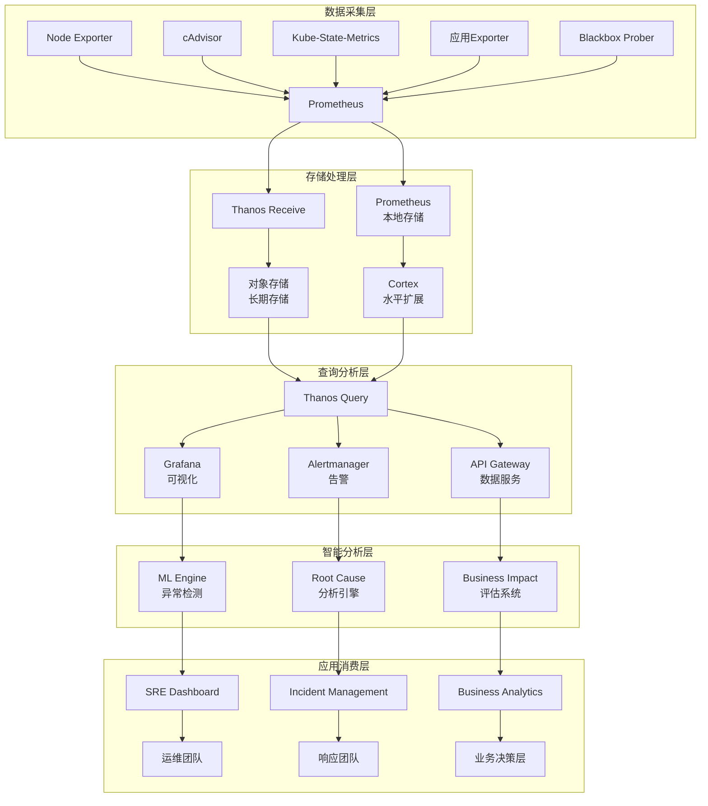

# 平台可观测性深度实践 (Platform Observability Deep Practice)

> **适用版本**: Kubernetes v1.25 - v1.32 | **文档版本**: v1.0 | **最后更新**: 2026-02
> **专业级别**: 企业级生产环境 | **作者**: Allen Galler

## 概述

# 平台可观测性深度实践 (Platform Observability Deep Practice)

> **适用版本**: Kubernetes v1.25 - v1.32 | **文档版本**: v1.0 | **最后更新**: 2026-02
> **专业级别**: 企业级生产环境 | **作者**: Allen Galler

## 概述

本文档从首席平台架构师视角，深入探讨Kubernetes平台级可观测性体系建设的深度实践，涵盖全栈监控架构、智能告警策略、性能分析优化、成本治理等核心内容，结合世界500强企业的平台可观测性建设经验，为企业构建世界级平台监控能力提供战略级指导。

---

## 一、平台级可观测性架构

### 1.1 企业级可观测性成熟度

#### 平台可观测性五级演进模型
```yaml
platform_observability_maturity:
  level_1_reactive_monitoring:  # 被动监控级
    characteristics:
      - 基础组件健康检查
      - 简单阈值告警
      - 事后问题分析
      - 手工故障排查
    capabilities:
      - 基础指标收集
      - 简单告警通知
      - 基础日志查询
    business_impact: "故障响应滞后，用户体验受损"
    
  level_2_proactive_monitoring:  # 主动监控级
    characteristics:
      - 全栈指标覆盖
      - 智能告警策略
      - 趋势分析预警
      - 标准化仪表板
    capabilities:
      - 多维度指标采集
      - 分级告警机制
      - 自动化根因分析
      - 性能基线建立
    business_impact: "提前发现问题，降低故障影响"
    
  level_3_predictive_analytics:  # 预测分析级
    characteristics:
      - 机器学习异常检测
      - 容量预测规划
      - 性能瓶颈预警
      - 业务影响评估
    capabilities:
      - AI驱动的异常识别
      - 资源需求预测
      - 业务指标关联分析
      - 智能容量优化
    business_impact: "预防性维护，优化资源配置"
    
  level_4_autonomous_operations:  # 自主运维级
    characteristics:
      - 自动故障修复
      - 动态资源调度
      - 智能容量伸缩
      - 自适应优化
    capabilities:
      - 自主问题解决
      - 智能弹性伸缩
      - 自动化容量管理
      - 持续性能优化
    business_impact: "无人值守运维，极致用户体验"
    
  level_5_intelligent_platform:  # 智能平台级
    characteristics:
      - 全栈AI治理
      - 业务价值驱动
      - 生态系统协同
      - 创新能力支撑
    capabilities:
      - 智能决策支持
      - 业务场景优化
      - 平台生态整合
      - 持续创新驱动
    business_impact: "战略竞争优势，业务价值最大化"
```

### 1.2 全栈可观测性架构设计

#### 企业级监控平台架构图


## 二、智能监控指标体系

### 2.1 四黄金信号扩展版

#### 平台级监控指标框架
```yaml
golden_signals_extended:
  reliability:  # 可靠性指标
    availability:
      service_availability: "服务可用时间占比"
      uptime_slo: "99.9% 目标值"
      calculation: "正常运行时间 / 总时间 × 100%"
      
    error_rate:
      http_error_rate: "HTTP 5xx错误占比"
      grpc_error_rate: "gRPC错误率"
      database_error_rate: "数据库错误率"
      business_error_rate: "业务逻辑错误率"
      
  performance:  # 性能指标
    latency:
      p50_response_time: "50%请求响应时间"
      p95_response_time: "95%请求响应时间"
      p99_response_time: "99%请求响应时间"
      tail_latency: "长尾延迟分析"
      
    throughput:
      requests_per_second: "每秒请求数(QPS)"
      transactions_per_second: "每秒事务数(TPS)"
      data_transfer_rate: "数据传输速率"
      
  saturation:  # 饱和度指标
    resource_utilization:
      cpu_utilization: "CPU使用率"
      memory_utilization: "内存使用率"
      disk_utilization: "磁盘使用率"
      network_utilization: "网络使用率"
      
    queue_depth:
      request_queue_length: "请求队列长度"
      database_connection_pool: "数据库连接池使用率"
      thread_pool_utilization: "线程池使用率"
      
  business_impact:  # 业务影响指标
    user_experience:
      page_load_time: "页面加载时间"
      transaction_success_rate: "交易成功率"
      user_satisfaction_score: "用户满意度评分"
      
    business_metrics:
      conversion_rate: "转化率"
      revenue_per_user: "单用户收入"
      customer_lifetime_value: "客户生命周期价值"
```

### 2.2 Kubernetes平台深度指标

#### 核心组件监控指标集
```yaml
kubernetes_platform_metrics:
  control_plane_metrics:
    api_server:
      - apiserver_request_total: "API请求总量"
      - apiserver_request_duration_seconds: "API请求延迟"
      - apiserver_current_inflight_requests: "当前并发请求数"
      - etcd_request_duration_seconds: "etcd请求延迟"
      
    etcd:
      - etcd_mvcc_db_total_size_in_bytes: "etcd数据库大小"
      - etcd_disk_backend_commit_duration_seconds: "磁盘提交延迟"
      - etcd_network_client_grpc_received_bytes_total: "网络接收字节数"
      - etcd_server_has_leader: "是否有leader"
      
    controller_manager:
      - workqueue_depth: "工作队列深度"
      - workqueue_queue_duration_seconds: "队列等待时间"
      - node_collector_evictions_total: "节点驱逐总数"
      
  node_metrics:
    kubelet:
      - kubelet_runtime_operations_errors_total: "运行时操作错误数"
      - kubelet_pod_worker_duration_seconds: "Pod工作器处理时间"
      - kubelet_running_pod_count: "运行中的Pod数量"
      
    container_runtime:
      - container_runtime_cri_operations_errors_total: "CRI操作错误数"
      - container_runtime_cri_operations_duration_seconds: "CRI操作延迟"
      
  networking_metrics:
    cni_plugin:
      - cni_add_network_duration_seconds: "网络添加延迟"
      - cni_del_network_duration_seconds: "网络删除延迟"
      - cni_network_errors_total: "网络错误总数"
      
    dns:
      - coredns_dns_request_duration_seconds: "DNS请求延迟"
      - coredns_dns_responses_total: "DNS响应总数"
      - coredns_dns_error_count: "DNS错误数"
```

## 三、智能告警策略体系

### 3.1 分层告警架构

#### 企业级告警分级管理
```yaml
alerting_hierarchy:
  business_level_alerts:  # 业务层告警
    severity: critical
    response_time: "< 5分钟"
    notification_channels:
      - phone_call_to_executives
      - emergency_pager
      - executive_dashboard_flash
    examples:
      - "核心业务收入下降 > 10%"
      - "用户注册转化率骤降 > 20%"
      - "支付成功率低于阈值"
      
  platform_level_alerts:  # 平台层告警
    severity: high
    response_time: "< 15分钟"
    notification_channels:
      - sre_team_slack
      - pagerduty_oncall
      - email_notification
    examples:
      - "API Server不可用"
      - "etcd集群异常"
      - "核心组件大面积故障"
      
  infrastructure_alerts:  # 基础设施告警
    severity: medium
    response_time: "< 1小时"
    notification_channels:
      - team_slack_channels
      - email_digest
      - ticket_system
    examples:
      - "节点资源使用率过高"
      - "存储空间不足预警"
      - "网络延迟异常"
      
  operational_alerts:  # 运维操作告警
    severity: low
    response_time: "< 4小时"
    notification_channels:
      - operational_slack
      - weekly_report
    examples:
      - "配置变更提醒"
      - "证书即将过期"
      - "备份任务完成状态"
```

### 3.2 智能告警降噪

#### 告警智能处理引擎
```yaml
intelligent_alerting:
  anomaly_detection:
    statistical_methods:
      - moving_average_analysis: "移动平均线分析"
      - standard_deviation_thresholds: "标准差阈值检测"
      - seasonal_trend_decomposition: "季节性趋势分解"
      
    machine_learning_approaches:
      - isolation_forest: "孤立森林异常检测"
      - lstm_neural_networks: "LSTM神经网络预测"
      - autoencoder_anomaly_detection: "自编码器异常识别"
      
  alert_correlation:
    temporal_correlation:
      - cascading_failure_detection: "级联故障识别"
      - correlated_alert_grouping: "相关告警分组"
      - root_cause_identification: "根本原因定位"
      
    contextual_correlation:
      - business_impact_scoring: "业务影响评分"
      - dependency_relationship_mapping: "依赖关系映射"
      - service_topology_analysis: "服务拓扑分析"
      
  dynamic_thresholds:
    adaptive_baselining:
      - historical_pattern_learning: "历史模式学习"
      - workload_characteristic_adaptation: "工作负载特征自适应"
      - time_of_day_adjustments: "时段调整策略"
      
    smart_suppression:
      - flapping_alert_filtering: "抖动告警过滤"
      - duplicate_alert_elimination: "重复告警消除"
      - noise_reduction_algorithms: "噪音减少算法"
```

## 四、深度性能分析

### 4.1 全链路性能剖析

#### 分布式追踪分析框架
```yaml
distributed_tracing_analysis:
  trace_collection:
    sampling_strategies:
      probabilistic_sampling:
        rate: "1%"  # 生产环境采样率
        priority_sampling: "关键路径100%采样"
        
      adaptive_sampling:
        load_based_adjustment: "根据系统负载动态调整"
        error_based_priority: "错误请求优先采样"
        
  performance_bottleneck_detection:
    latency_analysis:
      - span_duration_hotspots: "跨度持续时间热点分析"
      - call_graph_optimization: "调用图优化分析"
      - database_query_profiling: "数据库查询性能分析"
      
    resource_correlation:
      - cpu_memory_trace_correlation: "CPU内存轨迹关联"
      - network_io_impact_analysis: "网络IO影响分析"
      - storage_performance_tracing: "存储性能追踪"
      
  business_transaction_monitoring:
    transaction_flow_analysis:
      - user_journey_mapping: "用户旅程映射"
      - conversion_funnel_optimization: "转化漏斗优化"
      - business_value_attribution: "业务价值归因"
```

### 4.2 容量规划与预测

#### 智能力量预测模型
```yaml
capacity_planning_ai:
  demand_forecasting:
    time_series_models:
      - arima_modeling: "ARIMA时间序列模型"
      - exponential_smoothing: "指数平滑预测"
      - prophet_forecasting: "Facebook Prophet预测"
      
    machine_learning_approaches:
      - random_forest_regression: "随机森林回归"
      - gradient_boosting_machines: "梯度提升机"
      - neural_network_prediction: "神经网络预测"
      
  resource_optimization:
    utilization_analysis:
      - peak_load_pattern_recognition: "峰值负载模式识别"
      - idle_resource_identification: "闲置资源识别"
      - optimal_scaling_recommendations: "最优扩缩容建议"
      
    cost_performance_balance:
      - resource_efficiency_scoring: "资源效率评分"
      - cost_benefit_optimization: "成本效益优化"
      - sustainability_index_calculation: "可持续性指数计算"
```

## 五、成本治理与优化

### 5.1 平台成本可观测性

#### 多维度成本监控体系
```yaml
cost_observability:
  resource_cost_allocation:
    kubernetes_cost_modeling:
      compute_costs:
        cpu_cost_per_core_hour: "$0.02"
        memory_cost_per_gb_hour: "$0.01"
        gpu_cost_per_unit_hour: "$0.50"
        
      storage_costs:
        ssd_cost_per_gb_month: "$0.17"
        hdd_cost_per_gb_month: "$0.045"
        snapshot_cost_per_gb_month: "$0.05"
        
      network_costs:
        data_transfer_in: "$0.00"  # 免费
        data_transfer_out: "$0.09/GB"
        load_balancer_hours: "$0.025/hour"
        
  cost_analytics_dashboard:
    tenant_cost_breakdown:
      - per_tenant_resource_usage
      - cost_trend_analysis
      - budget_vs_actual_comparison
      - optimization_recommendations
      
    workload_cost_analysis:
      - per_application_cost_tracking
      - resource_efficiency_ratios
      - right_sizing_suggestions
      - reserved_instance_planning
```

### 5.2 智能成本优化

#### 成本优化AI引擎
```yaml
intelligent_cost_optimization:
  rightsizing_recommendations:
    container_optimization:
      - cpu_request_optimization: "CPU请求量优化建议"
      - memory_limit_adjustment: "内存限制调整建议"
      - pod_density_improvement: "Pod密度提升方案"
      
    node_pool_optimization:
      - instance_type_selection: "实例类型选择建议"
      - spot_instance_utilization: "抢占式实例利用率优化"
      - auto_scaling_policies: "自动扩缩策略优化"
      
  waste_identification:
    unused_resources:
      - orphaned_persistent_volumes: "孤立持久卷识别"
      - zombie_pods_detection: "僵尸Pod检测"
      - abandoned_namespaces: "废弃命名空间清理"
      
    over_provisioned_resources:
      - excessive_resource_requests: "过度资源配置识别"
      - underutilized_nodes: "低利用率节点发现"
      - redundant_replicas: "冗余副本优化"
```

## 六、平台治理与合规

### 6.1 安全可观测性

#### 安全事件监控体系
```yaml
security_observability:
  threat_detection:
    behavioral_analysis:
      - anomalous_user_activity: "异常用户行为检测"
      - privilege_escalation_attempts: "权限提升尝试监控"
      - lateral_movement_detection: "横向移动检测"
      
    vulnerability_monitoring:
      - container_image_scanning: "容器镜像漏洞扫描"
      - runtime_security_monitoring: "运行时安全监控"
      - compliance_policy_violations: "合规策略违规检测"
      
  incident_response:
    automated_response:
      - security_alert_triage: "安全告警分类"
      - containment_procedures: "遏制程序执行"
      - forensic_data_collection: "取证数据收集"
      
    compliance_reporting:
      - audit_trail_generation: "审计轨迹生成"
      - regulatory_compliance_dashboards: "监管合规仪表板"
      - incident_timeline_documentation: "事件时间线记录"
```

### 6.2 治理指标体系

#### 平台治理KPI监控
```yaml
governance_metrics:
  operational_excellence:
    slas_slos:
      - platform_uptime_sla: "平台可用性SLA"
      - incident_response_time_slo: "事件响应时间SLO"
      - change_failure_rate: "变更失败率"
      
    process_maturity:
      - deployment_frequency: "部署频率"
      - lead_time_for_changes: "变更前置时间"
      - mean_time_to_recovery: "平均恢复时间"
      
  quality_assurance:
    reliability_metrics:
      - error_budget_consumption: "错误预算消耗"
      - service_health_score: "服务健康评分"
      - customer_impact_assessment: "客户影响评估"
      
    performance_benchmarks:
      - platform_performance_index: "平台性能指数"
      - resource_efficiency_ratio: "资源效率比率"
      - user_experience_score: "用户体验评分"
```

## 七、最佳实践与实施指南

### 7.1 企业级实施路线图

#### 可观测性建设分阶段规划
```yaml
implementation_roadmap:
  phase_1_foundation:  # 基础建设阶段 (1-3个月)
    objectives:
      - 建立基础监控平台
      - 实现核心指标采集
      - 部署基本告警体系
    deliverables:
      - Prometheus监控集群
      - Grafana可视化平台
      - 基础告警规则集
      - 标准化仪表板
      
  phase_2_enhancement:  # 能力增强阶段 (4-6个月)
    objectives:
      - 完善全栈可观测性
      - 实施智能告警策略
      - 建立性能分析能力
    deliverables:
      - 分布式追踪系统
      - APM工具集成
      - ML驱动的异常检测
      - 自动化根因分析
      
  phase_3_optimization:  # 智能优化阶段 (7-12个月)
    objectives:
      - 构建预测性能力
      - 实现成本智能治理
      - 建立自主运维能力
    deliverables:
      - 智能容量规划
      - 成本优化引擎
      - 自主故障修复
      - 业务价值量化
      
  phase_4_innovation:  # 创新引领阶段 (12个月+)
    objectives:
      - 平台智能化升级
      - 业务场景深度融合
      - 生态系统协同创新
    deliverables:
      - AI驱动的平台治理
      - 业务场景优化引擎
      - 创新实验平台
      - 行业领先优势
```

### 7.2 运维团队能力建设

#### 可观测性专业人才培养
```yaml
team_capability_building:
  skill_domains:
    technical_skills:
      - monitoring_system_architecture
      - distributed_systems_troubleshooting
      - data_analytics_and_ml_basics
      - cloud_native_technologies
      
    analytical_skills:
      - root_cause_analysis_methods
      - statistical_analysis_techniques
      - business_impact_assessment
      - continuous_improvement_practices
      
    soft_skills:
      - cross_team_collaboration
      - communication_and_presentation
      - problem_solving_approaches
      - learning_and_adaptation
      
  training_approach:
    hands_on_practice:
      - sandbox_environment_setup
      - real_incident_simulation
      - tool_chain_deep_dive
      - best_practice_workshops
      
    knowledge_sharing:
      - internal_tech_talks
      - observability_office_hours
      - community_contributions
      - mentorship_programs
      
    certification_path:
      - prometheus_certified_associate
      - grafana_certification
      - kubernetes_cka/cks
      - cloud_provider_specializations
```

---
**维护**: Kusheet Project | **作者**: Allen Galler (allengaller@gmail.com)