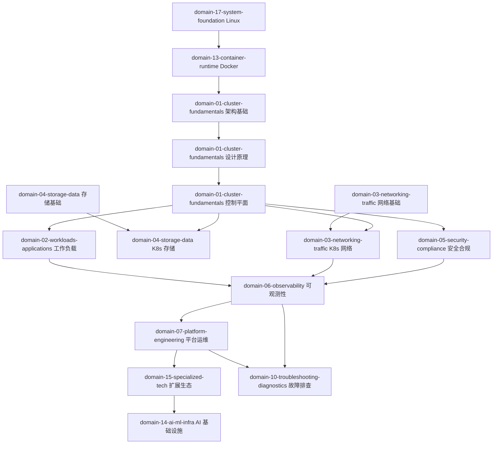
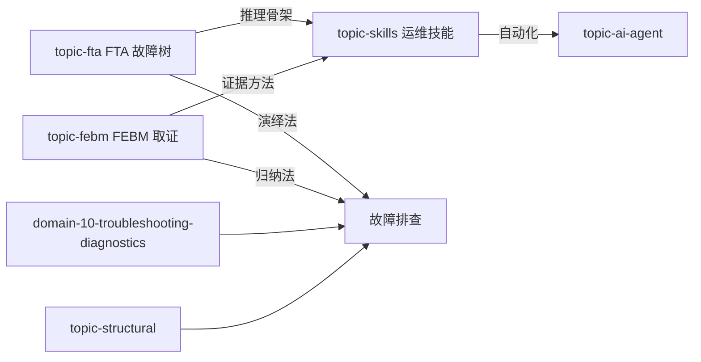
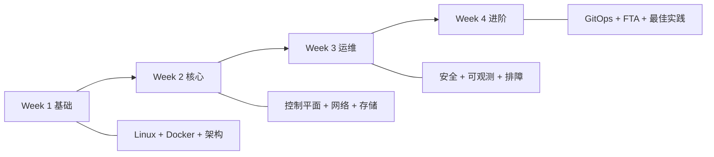

> **生产环境安全提示**
>
> 本文档包含可直接执行的运维命令。执行前请确认：当前目标集群与 Namespace 是否正确；是否具备足够的 RBAC 权限；是否已在非生产环境验证。命令风险等级标注：🔴 高风险（可能造成数据丢失或服务中断）、🟡 中风险（会修改集群状态，但通常可回滚）、🟢 低风险/只读（信息收集，无副作用）。

# Kubernetes Knowledge Map

> 知识模块间的依赖关系和学习路径

---

## 核心知识图谱

---

## 方法论关系

---

## 学习路径

---

## 模块间依赖矩阵

| 模块 | 前置依赖 | 推荐后续 |
|:---|:---|:---|
| domain-01-cluster-fundamentals 架构 | domain-13-container-runtime Docker | domain-01-cluster-fundamentals 设计原理 |
| domain-01-cluster-fundamentals 设计 | domain-01-cluster-fundamentals 架构 | domain-01-cluster-fundamentals 控制平面 |
| domain-01-cluster-fundamentals 控制平面 | domain-01-cluster-fundamentals 设计 | domain-02-workloads-applications/5/6/7 |
| domain-03-networking-traffic 网络 | domain-03-networking-traffic 网络基础 | domain-10-troubleshooting-diagnostics 排障 |
| domain-04-storage-data 存储 | domain-04-storage-data 存储基础 | domain-10-troubleshooting-diagnostics 排障 |
| domain-06-observability 可观测 | domain-01-cluster-fundamentals/4/5 | domain-07-platform-engineering 平台运维 |
| domain-14-ai-ml-infra AI | domain-02-workloads-applications 工作负载 | topic-ai-agent |
| domain-10-troubleshooting-diagnostics 排障 | domain-1~8 任一 | domain-10-troubleshooting-diagnostics/topic-fta/skills |
| topic-fta | domain-10-troubleshooting-diagnostics 排障基础 | topic-skills |
| topic-skills | topic-fta + domain-10-troubleshooting-diagnostics | topic-ai-agent |

---

## 相关索引

- [[entities/k8s-difficulty-index.md|难度分级索引]]
- [[MOC|学习路径导航]]
- [[entities/kubectl Scenario Quick Reference.md|kubectl 场景速查]]
- [[entities/KUDIG Cheat Sheet Index.md|KUDIG Cheat Sheet Index]]
- [[entities/KUDIG Scenario Taxonomy.md|KUDIG Scenario Taxonomy]]

## Related

- [[entities/k8s-difficulty-index.md|k8s-difficulty-index]] — Kubernetes Difficulty Index
- [[INDEX]] — Wiki Index
- [[docker]] — Docker
- [[kubernetes]] — Kubernetes (CNCF Graduated)

<!-- risk-assessed -->
