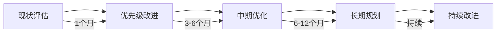

# Kubernetes 生产就绪性评估框架 (Production Readiness Assessment Framework)

> **作者**: Kubernetes SRE专家团队 | **版本**: v1.0 | **更新时间**: 2026-02-07
> **适用场景**: 企业级Kubernetes集群评估 | **复杂度**: ⭐⭐⭐⭐⭐

## 🎯 摘要

本文档提供了一套完整的Kubernetes生产就绪性评估框架，基于Google SRE理念和企业级运维实践经验，涵盖架构设计、安全性、可观测性、可靠性等12个核心维度，帮助组织系统性评估Kubernetes集群的生产就绪程度。

## 1. 评估框架概述

### 1.1 评估维度体系

```yaml
生产就绪性评估框架:
  核心维度:
    - 架构设计 (Architecture Design)
    - 安全合规 (Security & Compliance)
    - 可观测性 (Observability)
    - 可靠性 (Reliability)
    - 性能优化 (Performance Optimization)
    - 成本治理 (Cost Governance)
    - 运维自动化 (Operational Automation)
    - 灾难恢复 (Disaster Recovery)
    - 变更管理 (Change Management)
    - 容量规划 (Capacity Planning)
    - 供应链安全 (Supply Chain Security)
    - 治理策略 (Governance Policy)
```

### 1.2 评估等级定义

| 等级 | 描述 | 生产就绪度 | 建议行动 |
|------|------|------------|----------|
| **Level 1 - 基础** | 满足基本运行要求 | 60% | 立即改进关键缺陷 |
| **Level 2 - 标准** | 符合行业基本标准 | 80% | 持续优化提升 |
| **Level 3 - 良好** | 超越基础要求 | 90% | 精益求精 |
| **Level 4 - 优秀** | 业界领先水平 | 95%+ | 维持并分享经验 |

## 2. 详细评估标准

### 2.1 架构设计评估 (权重: 15%)

#### 控制平面评估
```bash
# 控制平面高可用检查清单
✓ API Server副本数 ≥ 3
✓ etcd集群节点数 ≥ 3 (奇数)
✓ 控制平面组件健康检查配置
✓ 负载均衡器配置正确
✓ 证书有效期管理机制
```

#### 网络架构评估
```yaml
网络设计标准:
  CNI插件选择:
    生产推荐: Calico, Cilium, CNI-Genie
    避免使用: Flannel (生产环境)
  
  网络策略:
    ✓ 默认拒绝策略实施
    ✓ 命名空间网络隔离
    ✓ Pod间通信最小权限原则
    ✓ 外部访问控制策略
```

#### 存储架构评估
```bash
# 存储类配置检查
kubectl get storageclass -o wide

# 关键指标
✓ 多存储类配置 (本地SSD、网络存储、对象存储)
✓ 存储容量规划 (预留20%缓冲)
✓ 备份策略配置
✓ 快照功能启用
```

### 2.2 安全合规评估 (权重: 20%)

#### 身份认证与授权
```yaml
RBAC最佳实践:
  角色分离:
    - cluster-admin (严格限制)
    - namespace-admin (团队负责人)
    - developer (开发人员)
    - viewer (只读用户)
  
  服务账户管理:
    ✓ 最小权限原则
    ✓ 自动轮换机制
    ✓ 审计日志记录
```

#### 网络安全
```bash
# 网络策略实施检查
kubectl get networkpolicy --all-namespaces

# 安全基线验证
kube-bench run --targets master,node,controlplane,policies
```

#### 镜像安全
```yaml
镜像安全策略:
  扫描要求:
    ✓ 漏洞扫描 (Trivy/Clair)
    ✓ 许可证合规检查
    ✓ 基础镜像更新监控
    ✓ 签名验证机制
  
  镜像仓库安全:
    ✓ 私有仓库部署
    ✓ 镜像拉取策略控制
    ✓ 敏感信息扫描
```

### 2.3 可观测性评估 (权重: 15%)

#### 监控体系
```yaml
监控栈配置:
  核心组件:
    Prometheus: 指标收集
    Grafana: 可视化展示
    Alertmanager: 告警管理
    Thanos: 长期存储
  
  关键指标覆盖:
    ✓ 控制平面健康状态
    ✓ 工作节点资源使用率
    ✓ 应用性能指标 (APM)
    ✓ 业务关键指标 (SLI/SLO)
```

#### 日志管理
```bash
# 日志架构检查
✓ 集中化日志收集 (Loki/ELK)
✓ 结构化日志格式
✓ 日志保留策略配置
✓ 敏感信息脱敏处理
```

#### 链路追踪
```yaml
分布式追踪配置:
  工具选择: Jaeger, Tempo, Zipkin
  采样策略:
    - 生产环境: 1-10% 采样率
    - 问题排查: 100% 采样率
    - 告警触发: 动态采样
```

### 2.4 可靠性评估 (权重: 15%)

#### 高可用设计
```bash
# 多区域部署检查
✓ 控制平面跨可用区部署
✓ 工作节点区域分布
✓ 数据存储多副本
✓ 负载均衡器冗余配置
```

#### 故障恢复能力
```yaml
故障恢复指标:
  RTO (恢复时间目标):
    - 关键业务: < 30分钟
    - 重要业务: < 2小时
    - 一般业务: < 4小时
  
  RPO (恢复点目标):
    - 核心数据: < 5分钟
    - 重要数据: < 15分钟
    - 一般数据: < 1小时
```

#### 自愈能力
```bash
# 自动修复配置检查
✓ 节点自动修复 (Cluster Autoscaler)
✓ Pod故障自动重启
✓ 应用健康检查配置
✓ 资源限制和请求设置
```

### 2.5 性能优化评估 (权重: 10%)

#### 资源调度优化
```yaml
调度器配置优化:
  资源请求设置:
    ✓ CPU请求/限制比值: 1:1.5
    ✓ 内存请求/限制比值: 1:2
    ✓ QoS等级合理分配
  
  亲和性策略:
    ✓ 节点亲和性配置
    ✓ Pod反亲和性设置
    ✓ 拓扑分布约束
```

#### 网络性能优化
```bash
# CNI性能调优
✓ MTU设置优化
✓ 网络策略规则数量控制 (< 100条/命名空间)
✓ 服务发现性能优化
✓ DNS缓存配置
```

### 2.6 成本治理评估 (权重: 10%)

#### 资源利用率分析
```bash
# 资源使用效率检查
kubectl top nodes
kubectl top pods --all-namespaces

# 关键指标
✓ CPU平均利用率: 60-80%
✓ 内存平均利用率: 70-85%
✓ 存储空间利用率: < 80%
✓ 网络带宽利用率: < 70%
```

#### 成本优化策略
```yaml
成本控制措施:
  资源回收:
    ✓ 僵尸资源清理
    ✓ 未使用PV/PVC回收
    ✓ 过期证书清理
  
  优化建议:
    ✓ 节点池规格优化
    ✓ Spot实例合理使用
    ✓ 存储类型优化选择
```

### 2.7 运维自动化评估 (权重: 5%)

#### GitOps实施程度
```bash
# GitOps成熟度检查
✓ 声明式配置管理
✓ 自动化部署流水线
✓ 配置变更审计追踪
✓ 回滚机制完善
```

#### 基础设施即代码
```yaml
IaC实施检查:
  工具栈:
    Terraform: 基础设施配置
    Helm: 应用部署配置
    Kustomize: 配置定制化
  
  实施标准:
    ✓ 版本控制全覆盖
    ✓ 代码审查流程
    ✓ 自动化测试集成
    ✓ 安全扫描集成
```

### 2.8 灾难恢复评估 (权重: 5%)

#### 备份策略
```bash
# 备份完整性检查
✓ etcd完整备份 (每日+实时)
✓ 应用数据备份策略
✓ 配置备份机制
✓ 备份验证流程
```

#### 恢复演练
```yaml
DR演练要求:
  频率:
    ✓ 关键系统: 每季度演练
    ✓ 重要系统: 每半年演练
    ✓ 一般系统: 每年演练
  
  演练内容:
    ✓ 完整恢复流程
    ✓ 数据一致性验证
    ✓ 业务连续性测试
    ✓ 恢复时间记录
```

## 3. 评估工具和方法

### 3.1 自动化评估工具

```bash
# 生产就绪性检查脚本
#!/bin/bash

echo "=== Kubernetes Production Readiness Assessment ==="

# 1. 控制平面健康检查
echo "1. Control Plane Health Check"
kubectl get componentstatuses
kubectl get nodes -l node-role.kubernetes.io/control-plane

# 2. 安全配置检查
echo "2. Security Configuration Check"
kubectl get clusterrolebindings | grep cluster-admin
kubectl get podsecuritypolicies 2>/dev/null || echo "PSP not enabled"

# 3. 监控告警检查
echo "3. Monitoring & Alerting Check"
kubectl get pods -n monitoring 2>/dev/null || echo "Monitoring namespace not found"

# 4. 备份配置检查
echo "4. Backup Configuration Check"
kubectl get cronjobs -n backup 2>/dev/null || echo "Backup jobs not configured"
```

### 3.2 评估问卷模板

```yaml
评估问卷结构:
  基础信息:
    - 集群规模 (节点数、Pod数)
    - 使用版本
    - 部署环境 (云/本地)
  
  技术评估:
    - 架构设计合理性
    - 安全配置完整性
    - 监控覆盖度
    - 自动化程度
  
  运营评估:
    - 运维流程成熟度
    - 团队技能水平
    - 应急响应能力
```

## 4. 评估报告模板

### 4.1 总体评分报告

```yaml
生产就绪性评估报告:
  基本信息:
    评估时间: 2026-02-07
    评估人员: SRE团队
    集群信息: 
      版本: v1.28.5
      节点数: 15
      命名空间数: 23
  
  综合评分: 85/100 (Level 3 - 良好)
  
  各维度得分:
    架构设计: 13/15 (87%)
    安全合规: 16/20 (80%)
    可观测性: 12/15 (80%)
    可靠性: 13/15 (87%)
    性能优化: 8/10 (80%)
    成本治理: 9/10 (90%)
    运维自动化: 4/5 (80%)
    灾难恢复: 4/5 (80%)
```

### 4.2 改进建议清单

```markdown
## 🔧 优先级改进项 (P0)

1. **安全加固**
   - [ ] 启用Pod安全策略(PSP)
   - [ ] 实施网络策略默认拒绝
   - [ ] 配置镜像扫描策略

2. **监控完善**
   - [ ] 部署应用级APM监控
   - [ ] 建立业务关键指标告警
   - [ ] 实施日志结构化处理

## 📈 中期优化项 (P1)

1. **性能优化**
   - [ ] 调整节点资源分配策略
   - [ ] 优化CNI网络配置
   - [ ] 实施HPA/VPA自动扩缩容

2. **成本控制**
   - [ ] 建立资源使用分析报表
   - [ ] 实施未使用资源回收机制
   - [ ] 优化存储类型选择策略

## 🚀 长期规划项 (P2)

1. **架构演进**
   - [ ] 多集群管理方案
   - [ ] 边缘计算节点部署
   - [ ] AI/ML工作负载优化
```

## 5. 实施建议

### 5.1 分阶段实施路线图



### 5.2 团队能力建设

```yaml
技能提升计划:
  基础技能:
    - Kubernetes核心概念深入理解
    - 容器技术原理掌握
    - Linux系统管理技能
  
  进阶技能:
    - SRE理念和实践
    - 监控系统设计和实施
    - 安全合规最佳实践
  
  专家技能:
    - 大规模集群架构设计
    - 性能调优和故障排查
    - 成本优化和治理策略
```

## 6. 附录

### 6.1 参考标准和规范

- **Google SRE Workbook** - 可靠性工程实践指南
- **CNCF Kubernetes Security Special Interest Group** - 安全最佳实践
- **CIS Kubernetes Benchmark** - 安全配置基线
- **ISO/IEC 27001** - 信息安全管理标准

### 6.2 相关工具推荐

```bash
# 评估和监控工具
kube-bench          # 安全合规检查
kube-hunter         # 安全漏洞扫描
prometheus-operator # 监控系统部署
loki-stack          # 日志收集方案
trivy               # 镜像安全扫描
```

---
*本文档由Kubernetes生产运维专家团队编写，基于真实企业环境实践经验。建议每季度进行一次完整的生产就绪性评估。*