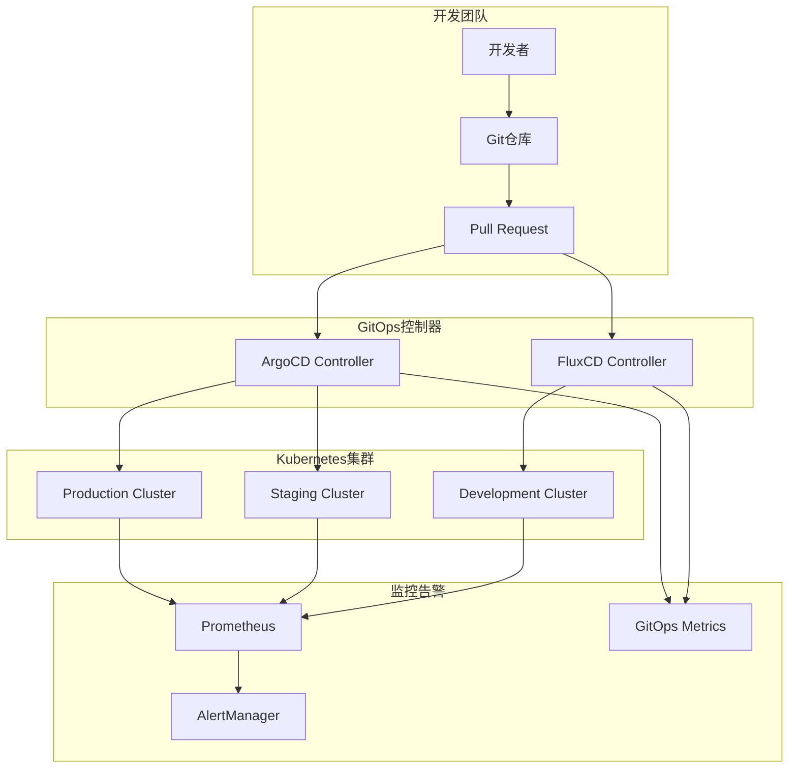
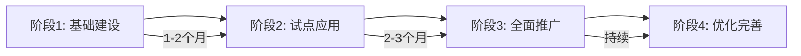

# Kubernetes GitOps 完整实践指南 (GitOps Complete Practice Guide)

> **作者**: GitOps实践专家 | **版本**: v2.0 | **更新时间**: 2026-02-07
> **适用场景**: 企业级CI/CD流水线 | **复杂度**: ⭐⭐⭐⭐

## 🎯 摘要

本文档提供了一套完整的GitOps实践指南，涵盖从基础概念到高级应用的全方位内容，基于ArgoCD和FluxCD两大主流GitOps工具的生产实践经验，帮助企业建立声明式、自动化、可审计的现代化运维体系。

## 1. GitOps 核心理念

### 1.1 GitOps 基本原则

```yaml
GitOps四大原则:
  1. 声明式配置 (Declarative)
     - 系统状态通过代码描述
     - 版本控制所有配置
     - 声明期望状态而非过程
  
  2. 自动化同步 (Automated)
     - 自动检测配置变更
     - 自动应用到目标环境
     - 最小化人工干预
  
  3. 版本控制 (Versioned)
     - Git作为唯一事实来源
     - 完整的变更历史记录
     - 可追溯的审计轨迹
  
  4. 拉取模式 (Pull-based)
     - 环境主动拉取配置
     - 减少安全暴露面
     - 增强系统安全性
```

### 1.2 传统运维 vs GitOps 对比

```markdown
## 🔄 运维模式对比

### 传统命令式运维
```bash
# 手动执行部署命令
kubectl apply -f deployment.yaml
helm install myapp ./charts/myapp
terraform apply -auto-approve
```
*痛点: 无版本控制、难追溯、易出错*

### GitOps声明式运维
```yaml
# 声明期望状态，GitOps工具自动同步
# 配置存储在Git仓库中，自动部署到集群
# 通过Pull Request触发变更流程
```
*优势: 自动化、可追溯、一致性强*

```

## 2. 工具选择与架构设计

### 2.1 主流GitOps工具对比

```yaml
工具选型对比:

  ArgoCD:
    优势:
      - GUI界面友好
      - ApplicationSet支持复杂场景
      - 丰富的插件生态
      - 强大的可视化能力
    适用场景: 企业级应用、复杂部署需求
    
    劣势:
      - 资源消耗相对较高
      - 学习曲线较陡峭

  FluxCD:
    优势:
      - 轻量级设计
      - 原生Kubernetes CRD
      - 优秀的GitOps原生体验
      - 良好的可扩展性
    适用场景: 云原生应用、轻量级部署
    
    劣势:
      - GUI功能相对较弱
      - 社区生态在发展中

  Tekton:
    优势:
      - 强大的CI/CD能力
      - Kubernetes原生任务编排
      - 灵活的流水线定义
    适用场景: 复杂CI/CD流程、任务编排
```

### 2.2 企业级架构设计



## 3. ArgoCD 深度实践

### 3.1 核心组件配置

#### ArgoCD Server 部署
```yaml
# ArgoCD完整部署配置
apiVersion: v1
kind: Namespace
metadata:
  name: argocd
---
apiVersion: apps/v1
kind: Deployment
metadata:
  name: argocd-server
  namespace: argocd
spec:
  replicas: 2
  selector:
    matchLabels:
      app.kubernetes.io/name: argocd-server
  template:
    metadata:
      labels:
        app.kubernetes.io/name: argocd-server
    spec:
      containers:
      - name: argocd-server
        image: quay.io/argoproj/argocd:v2.9.3
        command:
        - argocd-server
        - --staticassets
        - /shared/app
        - --dex-server
        - http://argocd-dex-server:5556
        - --repo-server
        - argocd-repo-server:8081
        - --redis
        - argocd-redis:6379
        ports:
        - containerPort: 8080
        - containerPort: 8083
        readinessProbe:
          httpGet:
            path: /healthz
            port: 8080
          initialDelaySeconds: 3
          periodSeconds: 30
        resources:
          requests:
            cpu: 100m
            memory: 256Mi
          limits:
            cpu: 500m
            memory: 512Mi
```

#### 应用定义配置
```yaml
# ArgoCD Application配置
apiVersion: argoproj.io/v1alpha1
kind: Application
metadata:
  name: ecommerce-app
  namespace: argocd
spec:
  project: default
  source:
    repoURL: https://github.com/company/ecommerce-manifests.git
    targetRevision: HEAD
    path: overlays/production
    helm:
      valueFiles:
      - values-production.yaml
      parameters:
      - name: replicaCount
        value: "10"
      - name: image.tag
        value: "v1.2.3"
  destination:
    server: https://kubernetes.default.svc
    namespace: ecommerce-production
  syncPolicy:
    automated:
      prune: true
      selfHeal: true
    syncOptions:
    - CreateNamespace=true
    - ApplyOutOfSyncOnly=true
    retry:
      limit: 5
      backoff:
        duration: 5s
        factor: 2
        maxDuration: 3m
```

### 3.2 高级功能应用

#### ApplicationSet 多环境管理
```yaml
# ApplicationSet配置 - 多环境批量部署
apiVersion: argoproj.io/v1alpha1
kind: ApplicationSet
metadata:
  name: microservices-appset
  namespace: argocd
spec:
  generators:
  - list:
      elements:
      - cluster: production
        url: https://production-cluster.example.com
        namespace: microservices-prod
        replicaCount: 20
      - cluster: staging
        url: https://staging-cluster.example.com
        namespace: microservices-staging
        replicaCount: 5
      - cluster: development
        url: https://dev-cluster.example.com
        namespace: microservices-dev
        replicaCount: 2
  template:
    metadata:
      name: '{{cluster}}-microservice-{{name}}'
    spec:
      project: microservices
      source:
        repoURL: https://github.com/company/microservices.git
        targetRevision: HEAD
        path: charts/{{name}}
        helm:
          parameters:
          - name: replicaCount
            value: '{{replicaCount}}'
          - name: environment
            value: '{{cluster}}'
      destination:
        server: '{{url}}'
        namespace: '{{namespace}}'
```

#### 蓝绿部署策略
```yaml
# ArgoCD蓝绿部署配置
apiVersion: argoproj.io/v1alpha1
kind: Application
metadata:
  name: blue-green-app
  namespace: argocd
spec:
  project: default
  source:
    repoURL: https://github.com/company/app-manifests.git
    targetRevision: HEAD
    path: blue-green
  destination:
    server: https://kubernetes.default.svc
    namespace: production
  syncPolicy:
    syncOptions:
    - CreateNamespace=true
  strategy:
    blueGreen:
      activeService: app-service
      previewService: app-preview-service
      autoPromotionEnabled: false
      autoPromotionSeconds: 600
```

## 4. FluxCD 实践指南

### 4.1 核心组件配置

#### FluxCD完整部署
```yaml
# FluxCD安装配置
apiVersion: v1
kind: Namespace
metadata:
  name: flux-system
---
apiVersion: source.toolkit.fluxcd.io/v1beta2
kind: GitRepository
metadata:
  name: flux-system
  namespace: flux-system
spec:
  interval: 1m0s
  url: https://github.com/company/infrastructure-manifests
  ref:
    branch: main
  secretRef:
    name: git-credentials
---
apiVersion: kustomize.toolkit.fluxcd.io/v1beta2
kind: Kustomization
metadata:
  name: infrastructure
  namespace: flux-system
spec:
  interval: 10m0s
  path: ./clusters/production
  prune: true
  sourceRef:
    kind: GitRepository
    name: flux-system
  validation: client
  healthChecks:
    - apiVersion: apps/v1
      kind: Deployment
      name: app-deployment
      namespace: production
```

#### HelmRelease配置
```yaml
# FluxCD HelmRelease配置
apiVersion: helm.toolkit.fluxcd.io/v2beta1
kind: HelmRelease
metadata:
  name: nginx-ingress
  namespace: flux-system
spec:
  interval: 5m
  chart:
    spec:
      chart: ingress-nginx
      version: "4.8.3"
      sourceRef:
        kind: HelmRepository
        name: ingress-nginx
        namespace: flux-system
  values:
    controller:
      replicaCount: 3
      service:
        type: LoadBalancer
      resources:
        limits:
          cpu: 500m
          memory: 512Mi
        requests:
          cpu: 100m
          memory: 128Mi
  valuesFrom:
    - kind: ConfigMap
      name: nginx-values
  install:
    remediation:
      retries: 3
  upgrade:
    remediation:
      retries: 3
      remediateLastFailure: true
```

### 4.2 高级部署策略

#### 金丝雀发布
```yaml
# FluxCD金丝雀发布配置
apiVersion: flagger.app/v1beta1
kind: Canary
metadata:
  name: app-canary
  namespace: production
spec:
  provider: nginx
  targetRef:
    apiVersion: apps/v1
    kind: Deployment
    name: app-deployment
  progressDeadlineSeconds: 60
  service:
    port: 80
    targetPort: 8080
    gateways:
    - istio-system/ingressgateway
    hosts:
    - app.example.com
  analysis:
    interval: 1m
    threshold: 5
    maxWeight: 50
    stepWeight: 10
    metrics:
    - name: request-success-rate
      thresholdRange:
        min: 99
      interval: 1m
    - name: request-duration
      thresholdRange:
        max: 500
      interval: 1m
```

#### 多租户管理
```yaml
# FluxCD多租户配置
apiVersion: v1
kind: Namespace
metadata:
  name: team-a-flux
---
apiVersion: source.toolkit.fluxcd.io/v1beta2
kind: GitRepository
metadata:
  name: team-a-repo
  namespace: team-a-flux
spec:
  interval: 1m0s
  url: https://github.com/company/team-a-manifests
  secretRef:
    name: team-a-git-credentials
---
apiVersion: kustomize.toolkit.fluxcd.io/v1beta2
kind: Kustomization
metadata:
  name: team-a-apps
  namespace: team-a-flux
spec:
  interval: 5m0s
  path: ./apps
  prune: true
  sourceRef:
    kind: GitRepository
    name: team-a-repo
  targetNamespace: team-a-production
  decryption:
    provider: sops
    secretRef:
      name: team-a-sops-gpg
```

## 5. CI/CD 流水线集成

### 5.1 完整流水线设计

```yaml
# GitHub Actions GitOps流水线
name: GitOps CI/CD Pipeline

on:
  push:
    branches: [ main, develop ]
  pull_request:
    branches: [ main ]

jobs:
  build-and-test:
    runs-on: ubuntu-latest
    steps:
    - uses: actions/checkout@v4
    
    - name: Set up Docker Buildx
      uses: docker/setup-buildx-action@v3
    
    - name: Build and push Docker image
      uses: docker/build-push-action@v5
      with:
        context: .
        push: true
        tags: |
          ghcr.io/company/app:${{ github.sha }}
          ghcr.io/company/app:latest
        cache-from: type=gha
        cache-to: type=gha,mode=max
    
    - name: Run tests
      run: |
        make test
        make integration-test
    
    - name: Security scan
      uses: aquasecurity/trivy-action@master
      with:
        image-ref: 'ghcr.io/company/app:${{ github.sha }}'
        format: 'sarif'
        output: 'trivy-results.sarif'
    
    - name: Upload scan results
      uses: github/codeql-action/upload-sarif@v2
      with:
        sarif_file: 'trivy-results.sarif'

  deploy-to-staging:
    needs: build-and-test
    if: github.ref == 'refs/heads/develop'
    runs-on: ubuntu-latest
    steps:
    - uses: actions/checkout@v4
      with:
        repository: company/infrastructure-manifests
        token: ${{ secrets.GITOPS_TOKEN }}
    
    - name: Update staging manifests
      run: |
        yq eval '.spec.source.helm.parameters[0].value = "${{ github.sha }}"' \
          -i apps/staging/app.yaml
    
    - name: Create Pull Request
      uses: peter-evans/create-pull-request@v5
      with:
        token: ${{ secrets.GITOPS_TOKEN }}
        commit-message: "chore: update app image to ${{ github.sha }}"
        title: "Staging deployment - ${{ github.sha }}"
        branch: staging-deploy-${{ github.sha }}
```

### 5.2 自动化测试集成

```yaml
# 自动化测试配置
apiVersion: v1
kind: ConfigMap
metadata:
  name: test-configuration
  namespace: testing
data:
  integration-tests.yaml: |
    tests:
    - name: health-check
      type: http
      endpoint: http://app-service.production.svc.cluster.local/health
      expectedStatus: 200
      timeout: 10s
    
    - name: database-connection
      type: tcp
      endpoint: postgres.production.svc.cluster.local:5432
      timeout: 5s
    
    - name: api-endpoint
      type: http
      endpoint: http://app-service.production.svc.cluster.local/api/users
      method: GET
      expectedStatus: 200
      timeout: 15s
```

## 6. 安全与权限管理

### 6.1 访问控制配置

#### RBAC权限管理
```yaml
# GitOps RBAC配置
apiVersion: rbac.authorization.k8s.io/v1
kind: Role
metadata:
  name: gitops-operator
  namespace: argocd
rules:
- apiGroups: ["argoproj.io"]
  resources: ["applications", "appprojects"]
  verbs: ["get", "list", "watch", "create", "update", "patch", "delete"]
- apiGroups: [""]
  resources: ["secrets", "configmaps"]
  verbs: ["get", "list", "watch"]
---
apiVersion: rbac.authorization.k8s.io/v1
kind: RoleBinding
metadata:
  name: team-a-gitops
  namespace: argocd
subjects:
- kind: User
  name: team-a-developer
  apiGroup: rbac.authorization.k8s.io
roleRef:
  kind: Role
  name: gitops-operator
  apiGroup: rbac.authorization.k8s.io
```

#### SOPS密钥管理
```bash
# SOPS加密配置
#!/bin/bash
# setup-sops.sh

# 生成GPG密钥对
gpg --gen-key

# 获取密钥指纹
GPG_FINGERPRINT=$(gpg --list-keys --with-fingerprint | grep -A 1 pub | tail -1 | tr -d ' ')

# 创建.sops.yaml配置文件
cat > .sops.yaml << EOF
creation_rules:
  - pgp: '${GPG_FINGERPRINT}'
    path_regex: \.yaml$
EOF

# 加密敏感文件
sops -e secrets.yaml > secrets.enc.yaml

# 在CI/CD中解密使用
sops -d secrets.enc.yaml > secrets.yaml
```

### 6.2 安全最佳实践

```yaml
GitOps安全检查清单:
  身份认证:
    ☐ 启用多因素认证
    ☐ 定期轮换访问令牌
    ☐ 实施最小权限原则
    ☐ 审计所有访问日志
  
  代码安全:
    ☐ 代码扫描集成
    ☐ 依赖安全检查
    ☐ 签名验证机制
    ☐ 漏洞扫描自动化
  
  配置安全:
    ☐ 敏感信息加密存储
    ☐ 环境变量安全处理
    ☐ 网络策略实施
    ☐ 安全上下文配置
```

## 7. 监控与可观测性

### 7.1 GitOps指标监控

```yaml
# Prometheus监控配置
apiVersion: monitoring.coreos.com/v1
kind: ServiceMonitor
metadata:
  name: argocd-metrics
  namespace: monitoring
spec:
  selector:
    matchLabels:
      app.kubernetes.io/name: argocd-metrics
  endpoints:
  - port: metrics
    path: /metrics
    interval: 30s
    relabelings:
    - sourceLabels: [__name__]
      regex: 'argocd_(.*)'
      targetLabel: __name__
---
apiVersion: v1
kind: Service
metadata:
  name: argocd-metrics
  namespace: argocd
  labels:
    app.kubernetes.io/name: argocd-metrics
spec:
  ports:
  - name: metrics
    port: 8082
    protocol: TCP
    targetPort: 8082
  selector:
    app.kubernetes.io/name: argocd-server
```

### 7.2 关键指标定义

```prometheus
# GitOps关键监控指标
# 应用同步状态
argocd_app_info{sync_status="Synced"} == 1
argocd_app_info{sync_status="OutOfSync"} == 1
argocd_app_info{health_status="Healthy"} == 1
argocd_app_info{health_status="Degraded"} == 1

# 同步操作统计
increase(argocd_app_sync_total[5m])
increase(argocd_app_sync_failure_total[5m])

# GitOps控制器性能
argocd_redis_request_duration_seconds_bucket
argocd_git_request_duration_seconds_bucket

# 部署成功率
sum(increase(argocd_app_sync_total{phase="Succeeded"}[1h])) 
/ sum(increase(argocd_app_sync_total[1h])) * 100
```

## 8. 故障排除与最佳实践

### 8.1 常见问题诊断

```bash
# GitOps故障诊断脚本
#!/bin/bash
# gitops-troubleshooting.sh

echo "=== GitOps故障诊断 ==="

# 1. 检查ArgoCD应用状态
echo "1. 检查应用状态:"
kubectl get applications -n argocd -o wide

# 2. 检查同步历史
echo "2. 检查同步历史:"
for app in $(kubectl get applications -n argocd -o name); do
  echo "=== $app ==="
  kubectl describe $app -n argocd
done

# 3. 检查控制器日志
echo "3. 检查控制器日志:"
kubectl logs -n argocd -l app.kubernetes.io/name=argocd-application-controller

# 4. 检查Git仓库连接
echo "4. 检查Git仓库连接:"
kubectl get gitrepositories -A
kubectl describe gitrepository <repository-name> -n <namespace>

# 5. 检查资源状态
echo "5. 检查资源状态:"
kubectl get events --sort-by='.lastTimestamp' -n production
```

### 8.2 最佳实践总结

```markdown
## 📋 GitOps最佳实践

### 配置管理
1. **单一事实来源** - 所有配置存储在Git仓库
2. **环境分离** - 不同环境使用不同分支或路径
3. **版本标签** - 使用语义化版本控制
4. **配置模板** - 使用Helm或Kustomize管理配置

### 安全实践
1. **密钥加密** - 使用SOPS或Sealed Secrets
2. **权限最小化** - 实施RBAC最小权限原则
3. **审计日志** - 完整的操作审计记录
4. **安全扫描** - 集成安全扫描工具

### 运维实践
1. **渐进部署** - 使用蓝绿或金丝雀发布
2. **自动回滚** - 配置失败自动回滚机制
3. **监控告警** - 建立完整的监控体系
4. **文档完善** - 维护详细的运维文档
```

## 9. 企业级实施路线图

### 9.1 分阶段实施计划



### 9.2 成熟度评估模型

```yaml
GitOps成熟度等级:
  Level 1 - 基础应用:
    ✓ 基本GitOps工具部署
    ✓ 简单应用自动化部署
    ✓ 基础监控告警
    成熟度: 60-70%
  
  Level 2 - 标准实践:
    ✓ 完整CI/CD流水线
    ✓ 多环境管理
    ✓ 安全合规实施
    ✓ 团队协作流程
    成熟度: 80-85%
  
  Level 3 - 高级应用:
    ✓ 智能化运维
    ✓ 自适应部署策略
    ✓ 预测性故障处理
    ✓ 全面可观测性
    成熟度: 90-95%
```

## 10. 未来发展趋势

### 10.1 技术演进方向

```yaml
GitOps发展趋势:
  1. AI驱动的智能运维
     - 自动化问题诊断
     - 智能部署决策
     - 预测性维护
  
  2. 边缘计算集成
     - 边缘GitOps支持
     - 离线部署能力
     - 分布式状态同步
  
  3. 服务网格深度融合
     - 流量管理自动化
     - 安全策略GitOps化
     - 服务发现配置化
```

---
*本文档基于企业级GitOps实践经验编写，持续更新最新技术和最佳实践。*