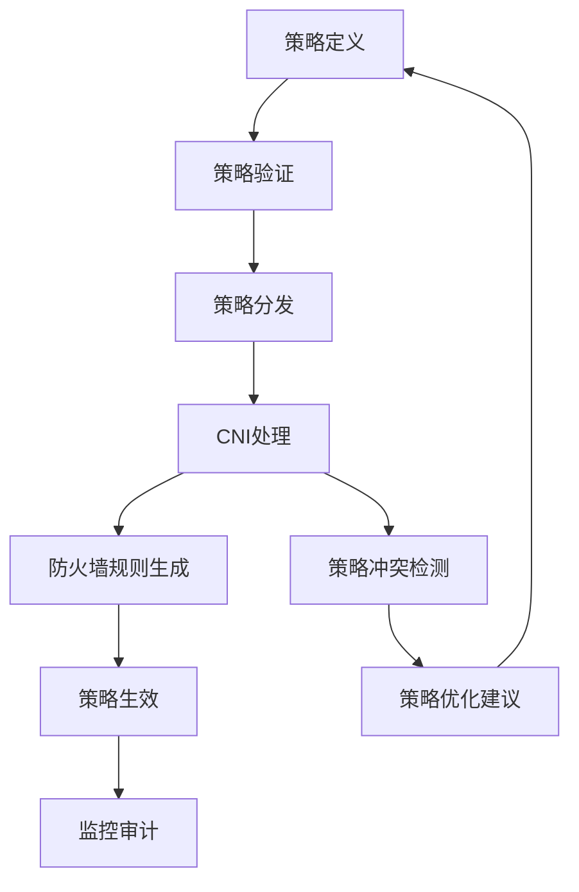

# Kubernetes 网络策略与安全微隔离实践 (Network Policies and Security Micro-Segmentation Practice)

> **作者**: 网络安全架构专家 | **版本**: v1.3 | **更新时间**: 2026-02-07
> **适用场景**: 企业级网络安全防护 | **复杂度**: ⭐⭐⭐⭐⭐

## 🎯 摘要

本文档深入探讨了Kubernetes网络策略与安全微隔离的实现原理、配置方法和最佳实践，基于大规模生产环境的网络安全实践经验，提供从基础网络策略到高级微隔离的完整技术指南，帮助企业构建零信任网络架构。

## 1. 网络策略基础概念

### 1.1 网络策略核心原理

```yaml
网络策略工作原理:
  1. 选择器匹配
     - Pod选择器 (podSelector)
     - 命名空间选择器 (namespaceSelector)
     - IP块选择器 (ipBlock)
  
  2. 规则类型
     - Ingress: 入站流量控制
     - Egress: 出站流量控制
  
  3. 策略执行
     - 默认拒绝 (Default Deny)
     - 白名单模式 (Allow-list)
     - 逐层叠加 (Layered Application)
```

### 1.2 网络策略生命周期



## 2. 高级网络策略配置

### 2.1 默认拒绝策略

```yaml
# 默认拒绝所有流量策略
apiVersion: networking.k8s.io/v1
kind: NetworkPolicy
metadata:
  name: default-deny-all
  namespace: production
spec:
  podSelector: {}
  policyTypes:
  - Ingress
  - Egress
---
# 允许集群内部DNS查询
apiVersion: networking.k8s.io/v1
kind: NetworkPolicy
metadata:
  name: allow-dns
  namespace: production
spec:
  podSelector: {}
  policyTypes:
  - Egress
  egress:
  - to:
    - namespaceSelector:
        matchLabels:
          name: kube-system
    ports:
    - protocol: UDP
      port: 53
    - protocol: TCP
      port: 53
---
# 允许健康检查和监控
apiVersion: networking.k8s.io/v1
kind: NetworkPolicy
metadata:
  name: allow-health-check
  namespace: production
spec:
  podSelector: {}
  policyTypes:
  - Ingress
  ingress:
  - from:
    - namespaceSelector:
        matchLabels:
          name: monitoring
    ports:
    - protocol: TCP
      port: 8080
```

### 2.2 微服务间通信策略

```yaml
# 电商应用微服务网络策略
apiVersion: networking.k8s.io/v1
kind: NetworkPolicy
metadata:
  name: frontend-policy
  namespace: ecommerce
spec:
  podSelector:
    matchLabels:
      app: frontend
  policyTypes:
  - Ingress
  - Egress
  ingress:
  - from:
    - namespaceSelector:
        matchLabels:
          name: ingress-nginx
    ports:
    - protocol: TCP
      port: 8080
  egress:
  - to:
    - podSelector:
        matchLabels:
          app: api-gateway
    ports:
    - protocol: TCP
      port: 8080
  - to:
    - namespaceSelector:
        matchLabels:
          name: monitoring
    ports:
    - protocol: TCP
      port: 8080
---
apiVersion: networking.k8s.io/v1
kind: NetworkPolicy
metadata:
  name: api-gateway-policy
  namespace: ecommerce
spec:
  podSelector:
    matchLabels:
      app: api-gateway
  policyTypes:
  - Ingress
  - Egress
  ingress:
  - from:
    - podSelector:
        matchLabels:
          app: frontend
    ports:
    - protocol: TCP
      port: 8080
  egress:
  - to:
    - podSelector:
        matchLabels:
          app: user-service
    ports:
    - protocol: TCP
      port: 8080
  - to:
    - podSelector:
        matchLabels:
          app: order-service
    ports:
    - protocol: TCP
      port: 8080
  - to:
    - podSelector:
        matchLabels:
          app: payment-service
    ports:
    - protocol: TCP
      port: 8080
```

## 3. CNI网络插件深度集成

### 3.1 Calico高级配置

```yaml
# Calico网络策略高级配置
apiVersion: projectcalico.org/v3
kind: GlobalNetworkPolicy
metadata:
  name: security-defaults
spec:
  selector: all()
  order: 100
  ingress:
  - action: Allow
    protocol: ICMP
  - action: Allow
    protocol: TCP
    source:
      selector: has(projectcalico.org/namespace)
    destination:
      ports: [22, 80, 443, 6443, 2379, 2380, 10250, 10251, 10252]
  - action: Deny
    source:
      nets: ["0.0.0.0/0"]
  egress:
  - action: Allow
    protocol: ICMP
  - action: Allow
    protocol: TCP
    destination:
      selector: has(projectcalico.org/namespace)
  - action: Allow
    protocol: UDP
    destination:
      ports: [53]
      selector: has(projectcalico.org/namespace)
  - action: Deny
    destination:
      nets: ["0.0.0.0/0"]
---
# Calico网络集成功约
apiVersion: projectcalico.org/v3
kind: NetworkPolicy
metadata:
  name: allow-external-api
  namespace: api-services
spec:
  selector: app == 'external-api'
  types:
  - Ingress
  - Egress
  ingress:
  - action: Allow
    protocol: TCP
    source:
      nets:
      - 10.0.0.0/8
      - 172.16.0.0/12
      - 192.168.0.0/16
    destination:
      ports:
      - 443
  egress:
  - action: Allow
    protocol: TCP
    destination:
      nets:
      - 130.211.0.0/22
      - 35.191.0.0/16
      - 146.148.0.0/20
      ports:
      - 443
```

### 3.2 Cilium eBPF策略

```yaml
# Cilium eBPF网络策略
apiVersion: cilium.io/v2
kind: CiliumNetworkPolicy
metadata:
  name: advanced-security-policy
  namespace: secure-app
spec:
  endpointSelector:
    matchLabels:
      app: secure-service
  ingress:
  - fromEndpoints:
    - matchLabels:
        app: trusted-client
    toPorts:
    - ports:
      - port: "8080"
        protocol: TCP
      rules:
        http:
        - method: "GET"
          path: "/api/v1/.*"
        - method: "POST"
          path: "/api/v1/users"
    - ports:
      - port: "9090"
        protocol: TCP
      rules:
        http:
        - method: "GET"
          path: "/metrics"
  egress:
  - toCIDR:
    - "10.0.0.0/8"
    toPorts:
    - ports:
      - port: "5432"
        protocol: TCP
  - toEntities:
    - world
    - cluster
    toPorts:
    - ports:
      - port: "443"
        protocol: TCP
---
# Cilium L7策略 - HTTP/HTTPS
apiVersion: cilium.io/v2
kind: CiliumNetworkPolicy
metadata:
  name: http-security-policy
  namespace: web-app
spec:
  endpointSelector:
    matchLabels:
      app: web-service
  ingress:
  - fromEndpoints:
    - matchLabels:
        app: api-client
    toPorts:
    - ports:
      - port: "8080"
        protocol: TCP
      rules:
        http:
        - method: "GET"
          path: "/public/.*"
        - method: "POST"
          path: "/api/.*"
          headers:
          - "X-API-Key: .*"
        - method: "PUT"
          path: "/api/users/.*"
          headers:
          - "Authorization: Bearer .*"
```

## 4. 安全微隔离架构

### 4.1 零信任网络架构

```yaml
# 零信任网络策略框架
apiVersion: networking.k8s.io/v1
kind: NetworkPolicy
metadata:
  name: zero-trust-framework
  namespace: security-zone
spec:
  podSelector: {}
  policyTypes:
  - Ingress
  - Egress
  ingress:
  - from:
    - namespaceSelector:
        matchLabels:
          security-level: trusted
      podSelector:
        matchLabels:
          role: authenticated
    ports:
    - protocol: TCP
      port: 8080
  egress:
  - to:
    - namespaceSelector:
        matchLabels:
          security-level: trusted
      podSelector:
        matchLabels:
          role: authorized
    ports:
    - protocol: TCP
      port: 8080
---
# 基于角色的访问控制
apiVersion: networking.k8s.io/v1
kind: NetworkPolicy
metadata:
  name: role-based-access
  namespace: rbac-zone
spec:
  podSelector:
    matchLabels:
      role: admin
  policyTypes:
  - Egress
  egress:
  - to:
    - podSelector:
        matchLabels:
          protected: true
    ports:
    - protocol: TCP
      port: 9090
    - protocol: TCP
      port: 9093
  - to:
    - namespaceSelector:
        matchLabels:
          name: admin-tools
---
apiVersion: networking.k8s.io/v1
kind: NetworkPolicy
metadata:
  name: developer-access
  namespace: rbac-zone
spec:
  podSelector:
    matchLabels:
      role: developer
  policyTypes:
  - Egress
  egress:
  - to:
    - podSelector:
        matchLabels:
          environment: development
    ports:
    - protocol: TCP
      port: 8080
```

### 4.2 安全域隔离

```yaml
# 安全域隔离策略
apiVersion: networking.k8s.io/v1
kind: NetworkPolicy
metadata:
  name: dmz-zone-policy
  namespace: dmz
spec:
  podSelector:
    matchLabels:
      zone: dmz
  policyTypes:
  - Ingress
  - Egress
  ingress:
  - from:
    - ipBlock:
        cidr: 0.0.0.0/0
    ports:
    - protocol: TCP
      port: 80
    - protocol: TCP
      port: 443
  egress:
  - to:
    - namespaceSelector:
        matchLabels:
          name: internal
    ports:
    - protocol: TCP
      port: 8080
---
apiVersion: networking.k8s.io/v1
kind: NetworkPolicy
metadata:
  name: internal-zone-policy
  namespace: internal
spec:
  podSelector:
    matchLabels:
      zone: internal
  policyTypes:
  - Ingress
  - Egress
  ingress:
  - from:
    - namespaceSelector:
        matchLabels:
          name: dmz
    ports:
    - protocol: TCP
      port: 8080
  egress:
  - to:
    - namespaceSelector:
        matchLabels:
          name: database
    ports:
    - protocol: TCP
      port: 5432
---
apiVersion: networking.k8s.io/v1
kind: NetworkPolicy
metadata:
  name: database-zone-policy
  namespace: database
spec:
  podSelector:
    matchLabels:
      zone: database
  policyTypes:
  - Ingress
  ingress:
  - from:
    - namespaceSelector:
        matchLabels:
          name: internal
    - namespaceSelector:
        matchLabels:
          name: monitoring
    ports:
    - protocol: TCP
      port: 5432
```

## 5. 网络策略验证与测试

### 5.1 策略验证工具

```python
#!/usr/bin/env python3
# network-policy-validator.py

import yaml
import json
from kubernetes import client, config
from kubernetes.client.rest import ApiException
import ipaddress
import re

class NetworkPolicyValidator:
    def __init__(self):
        config.load_incluster_config()
        self.v1 = client.NetworkingV1Api()
        self.core_v1 = client.CoreV1Api()
    
    def validate_network_policy(self, policy):
        """验证网络策略配置"""
        errors = []
        
        # 验证选择器
        if 'podSelector' in policy.spec:
            if 'matchLabels' in policy.spec.podSelector:
                errors.extend(self._validate_match_labels(policy.spec.podSelector.matchLabels))
        
        # 验证策略类型
        if hasattr(policy.spec, 'policyTypes'):
            errors.extend(self._validate_policy_types(policy.spec.policyTypes))
        
        # 验证入站规则
        if hasattr(policy.spec, 'ingress'):
            errors.extend(self._validate_ingress_rules(policy.spec.ingress))
        
        # 验证出站规则
        if hasattr(policy.spec, 'egress'):
            errors.extend(self._validate_egress_rules(policy.spec.egress))
        
        return errors
    
    def _validate_match_labels(self, match_labels):
        """验证匹配标签"""
        errors = []
        
        for key, value in match_labels.items():
            # 验证标签键格式
            if not re.match(r'^([A-Za-z0-9][-A-Za-z0-9_.]*)?[A-Za-z0-9]$', key):
                errors.append(f"无效的标签键: {key}")
            
            # 验证标签值格式
            if not re.match(r'^(([A-Za-z0-9][-A-Za-z0-9_.]*)?[A-Za-z0-9])?$', str(value)):
                errors.append(f"无效的标签值: {value}")
        
        return errors
    
    def _validate_policy_types(self, policy_types):
        """验证策略类型"""
        errors = []
        
        for policy_type in policy_types:
            if policy_type not in ['Ingress', 'Egress']:
                errors.append(f"无效的策略类型: {policy_type}")
        
        return errors
    
    def _validate_ingress_rules(self, ingress_rules):
        """验证入站规则"""
        errors = []
        
        for rule in ingress_rules:
            if hasattr(rule, 'from'):
                for from_rule in rule.from_:
                    if hasattr(from_rule, 'ipBlock'):
                        errors.extend(self._validate_ip_block(from_rule.ipBlock))
            
            if hasattr(rule, 'ports'):
                errors.extend(self._validate_ports(rule.ports))
        
        return errors
    
    def _validate_egress_rules(self, egress_rules):
        """验证出站规则"""
        errors = []
        
        for rule in egress_rules:
            if hasattr(rule, 'to'):
                for to_rule in rule.to:
                    if hasattr(to_rule, 'ipBlock'):
                        errors.extend(self._validate_ip_block(to_rule.ipBlock))
            
            if hasattr(rule, 'ports'):
                errors.extend(self._validate_ports(rule.ports))
        
        return errors
    
    def _validate_ip_block(self, ip_block):
        """验证IP块"""
        errors = []
        
        try:
            ipaddress.IPv4Network(ip_block.cidr, strict=False)
        except ValueError:
            errors.append(f"无效的CIDR: {ip_block.cidr}")
        
        return errors
    
    def _validate_ports(self, ports):
        """验证端口配置"""
        errors = []
        
        for port in ports:
            if hasattr(port, 'port'):
                port_val = port.port
                if isinstance(port_val, str):
                    # 端口名称
                    if not re.match(r'^[a-zA-Z0-9]([-a-zA-Z0-9]*[a-zA-Z0-9])?$', port_val):
                        errors.append(f"无效的端口名称: {port_val}")
                else:
                    # 端口号
                    if not (1 <= port_val <= 65535):
                        errors.append(f"端口号超出范围: {port_val}")
        
        return errors
    
    def analyze_policy_conflicts(self, namespace=None):
        """分析策略冲突"""
        conflicts = []
        
        # 获取所有网络策略
        if namespace:
            policies = self.v1.list_namespaced_network_policy(namespace).items
        else:
            policies = self.v1.list_network_policy_for_all_namespaces().items
        
        # 检查策略重叠
        for i, policy1 in enumerate(policies):
            for j, policy2 in enumerate(policies[i+1:], i+1):
                if self._policies_overlap(policy1, policy2):
                    conflicts.append({
                        'policy1': policy1.metadata.name,
                        'policy2': policy2.metadata.name,
                        'namespace1': policy1.metadata.namespace,
                        'namespace2': policy2.metadata.namespace,
                        'type': 'overlap'
                    })
        
        return conflicts
    
    def _policies_overlap(self, policy1, policy2):
        """检查策略是否重叠"""
        # 简化的重叠检查
        selector1 = getattr(policy1.spec, 'podSelector', {})
        selector2 = getattr(policy2.spec, 'podSelector', {})
        
        # 如果两个策略应用于相同的Pod集合，则可能存在冲突
        return selector1 == selector2

if __name__ == "__main__":
    validator = NetworkPolicyValidator()
    
    # 验证所有网络策略
    try:
        all_policies = validator.v1.list_network_policy_for_all_namespaces()
        for policy in all_policies.items:
            errors = validator.validate_network_policy(policy)
            if errors:
                print(f"策略 {policy.metadata.namespace}/{policy.metadata.name} 存在错误:")
                for error in errors:
                    print(f"  - {error}")
    except ApiException as e:
        print(f"API调用失败: {e}")
```

### 5.2 网络连通性测试

```bash
#!/bin/bash
# network-connectivity-test.sh

# 网络连通性测试脚本
NAMESPACE="test-namespace"
SOURCE_POD="client-pod"
TARGET_POD="server-pod"
TARGET_PORT=8080

echo "=== 网络连通性测试 ==="

# 1. 创建测试Pod
cat <<EOF | kubectl apply -f -
apiVersion: v1
kind: Pod
metadata:
  name: connectivity-tester
  namespace: $NAMESPACE
spec:
  containers:
  - name: tester
    image: nicolaka/netshoot:latest
    command: ["/bin/sh", "-c", "sleep 3600"]
EOF

# 2. 等待Pod就绪
echo "等待测试Pod就绪..."
kubectl wait --for=condition=Ready pod/connectivity-tester -n $NAMESPACE --timeout=60s

# 3. 执行连通性测试
echo "执行连通性测试..."

# 测试TCP连接
echo "1. TCP连接测试:"
kubectl exec -n $NAMESPACE connectivity-tester -- timeout 10 bash -c "echo >/dev/tcp/$TARGET_POD/$TARGET_PORT && echo '连接成功' || echo '连接失败'"

# 测试HTTP请求
echo "2. HTTP请求测试:"
kubectl exec -n $NAMESPACE connectivity-tester -- timeout 10 curl -I http://$TARGET_POD:$TARGET_PORT/health 2>/dev/null || echo "HTTP请求失败"

# 测试DNS解析
echo "3. DNS解析测试:"
kubectl exec -n $NAMESPACE connectivity-tester -- nslookup $TARGET_POD.$NAMESPACE.svc.cluster.local

# 测试网络延迟
echo "4. 网络延迟测试:"
kubectl exec -n $NAMESPACE connectivity-tester -- ping -c 3 $TARGET_POD.$NAMESPACE.svc.cluster.local

# 5. 清理测试Pod
echo "清理测试资源..."
kubectl delete pod connectivity-tester -n $NAMESPACE

echo "=== 网络连通性测试完成 ==="
```

## 6. 监控与审计

### 6.1 网络策略监控

```yaml
# 网络策略监控配置
apiVersion: monitoring.coreos.com/v1
kind: ServiceMonitor
metadata:
  name: network-policy-monitor
  namespace: monitoring
spec:
  selector:
    matchLabels:
      app: calico-kube-controllers
  endpoints:
  - port: metrics
    path: /metrics
    interval: 30s
    metricRelabelings:
    - sourceLabels: [__name__]
      regex: 'calico_(.*)'
      targetLabel: __name__
---
# 网络流量监控
apiVersion: v1
kind: ConfigMap
metadata:
  name: network-metrics-config
  namespace: monitoring
data:
  config.yaml: |
    # 网络指标配置
    metrics:
      - name: calico_policy_evaluation_seconds
        help: "Policy evaluation time"
        type: histogram
      
      - name: calico_active_policies
        help: "Number of active policies"
        type: gauge
      
      - name: calico_connections_allowed_total
        help: "Total allowed connections"
        type: counter
      
      - name: calico_connections_denied_total
        help: "Total denied connections"
        type: counter
```

### 6.2 网络审计策略

```yaml
# 网络审计配置
apiVersion: audit.k8s.io/v1
kind: Policy
rules:
- level: RequestResponse
  resources:
  - group: "networking.k8s.io"
    resources: ["networkpolicies"]
  verbs: ["create", "update", "delete", "patch"]

- level: Metadata
  resources:
  - group: ""
    resources: ["pods", "services", "endpoints"]
  verbs: ["create", "update", "delete"]
  omitStages:
  - RequestReceived

- level: Request
  userGroups: ["system:authenticated"]
  verbs: ["create", "update"]
  omitStages:
  - RequestReceived
```

## 7. 高级安全策略

### 7.1 威胁检测策略

```yaml
# 威胁检测网络策略
apiVersion: cilium.io/v2
kind: CiliumNetworkPolicy
metadata:
  name: threat-detection-policy
  namespace: security
spec:
  endpointSelector:
    matchLabels:
      app: monitored-service
  ingress:
  - fromEndpoints:
    - {}
    toPorts:
    - ports:
      - port: "8080"
        protocol: TCP
      rules:
        http:
        - method: "GET"
          path: "/.*"
          # 检测SQL注入
          headersMatch:
          - headerName: "User-Agent"
            regex: "sqlmap|nikto|nessus"
        - method: "POST"
          path: "/.*"
          headersMatch:
          - headerName: "Content-Type"
            regex: "application/x-www-form-urlencoded"
          # 检测恶意请求体
          bodyMatch:
          - regex: "union.*select|drop.*table|exec.*sp_|alert\\(|\\<script"
  egress:
  - toCIDR:
    - "0.0.0.0/0"
    toPorts:
    - ports:
      - port: "443"
        protocol: TCP
      rules:
        http:
        - method: "GET"
          path: "/.*"
          # 检测C&C通信特征
          headersMatch:
          - headerName: "User-Agent"
            regex: "curl|wget|python-urllib|Go-http-client"
```

### 7.2 异常行为检测

```yaml
# 异常行为检测策略
apiVersion: networking.k8s.io/v1
kind: NetworkPolicy
metadata:
  name: anomaly-detection
  namespace: monitoring
spec:
  podSelector:
    matchLabels:
      security: monitored
  policyTypes:
  - Egress
  egress:
  - to:
    - ipBlock:
        cidr: 0.0.0.0/0
    ports:
    - protocol: TCP
      port: 80
    - protocol: TCP
      port: 443
    # 限制出站连接频率
    # 通过外部监控系统实现
---
# 通过自定义控制器实现的高级策略
apiVersion: security.example.com/v1
kind: AnomalyDetectionPolicy
metadata:
  name: advanced-anomaly-detection
spec:
  selectors:
    matchLabels:
      app: critical-service
  detectionRules:
  - name: connection-rate-limit
    type: rate
    threshold: 100
    window: 60s
    action: alert
  - name: port-scan-detection
    type: pattern
    pattern: "multiple-destinations"
    threshold: 10
    window: 30s
    action: block
  - name: data-exfiltration
    type: volume
    threshold: 10485760  # 10MB
    window: 300s
    action: alert
```

## 8. 最佳实践与实施指南

### 8.1 网络策略设计原则

```markdown
## 🛡️ 网络策略设计原则

### 1. 最小权限原则
- 只允许必需的网络连接
- 从拒绝所有开始，逐步开放
- 定期审查和清理策略

### 2. 分层安全架构
- 实现网络分段隔离
- 建立安全域边界
- 实施深度防御策略

### 3. 可观测性优先
- 启用详细的网络日志
- 实施实时监控告警
- 建立审计追踪机制

### 4. 自动化管理
- 使用IaC管理网络策略
- 实施策略验证流水线
- 建立自动修复机制
```

### 8.2 实施检查清单

```yaml
网络策略实施检查清单:
  策略设计:
    ☐ 网络拓扑分析完成
    ☐ 服务依赖关系映射
    ☐ 安全需求评估完成
    ☐ 默认拒绝策略制定
  
  策略部署:
    ☐ 测试环境验证完成
    ☐ 策略分阶段部署
    ☐ 连通性测试通过
    ☐ 性能影响评估
  
  监控告警:
    ☐ 网络指标监控配置
    ☐ 异常行为告警设置
    ☐ 审计日志收集配置
    ☐ 告警响应流程建立
  
  运维管理:
    ☐ 策略变更管理流程
    ☐ 定期审查机制建立
    ☐ 应急响应预案制定
    ☐ 团队培训完成
```

## 9. 未来发展趋势

### 9.1 智能化网络策略

```yaml
智能化网络策略趋势:
  1. AI驱动的策略生成
     - 基于流量分析自动生成策略
     - 智能异常检测和响应
     - 预测性安全防护
  
  2. 零信任网络演进
     - 身份感知的网络策略
     - 动态访问控制决策
     - 行为分析驱动的策略
  
  3. 服务网格集成
     - 网络策略与服务网格协同
     - 统一的策略管理平台
     - L4-L7策略统一控制
```

---
*本文档基于企业级网络安全实践经验编写，持续更新最新技术和最佳实践。*