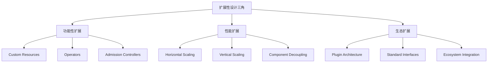
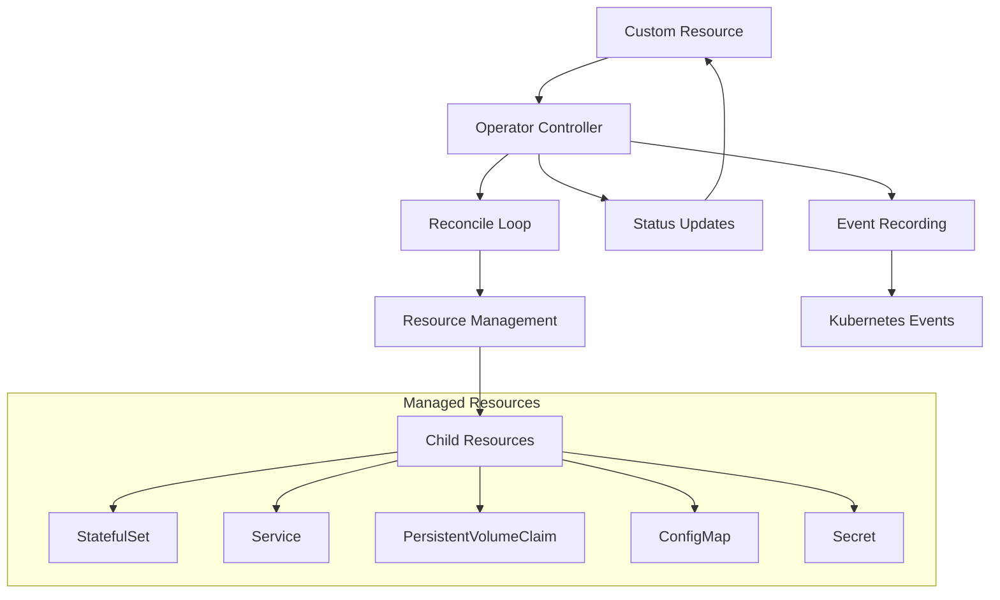

# 11 - 扩展性设计模式 (Extensibility)

## 资深视点：CEL (Common Expression Language) 的革命

在 K8s 1.25+ 中，**CEL** 正在改变扩展开发的范式。

### 为什么 CEL 至关重要？
1. **去 Webhook 化**: 以前复杂的验证必须写 Mutating/Validating Webhooks，现在直接在 CRD YAML 中通过 CEL 表达式即可完成。
2. **性能与安全**: CEL 运行在 API Server 进程内，消除了跨网络调用 Webhook 的延迟和潜在的安全风险。
3. **低运维成本**: 无需维护额外的 Webhook Server 镜像和证书。

> **专家建议**: 新开发的 CRD 验证逻辑应首选 CEL，仅在需要访问外部数据源时才使用 Webhook。

## 概述

本文档深入探讨 Kubernetes 扩展性设计的核心模式，涵盖 CRD、Operator、插件机制等关键技术，为企业级扩展开发提供架构指导和最佳实践。

---

## 一、扩展性设计核心理念

### 1.1 扩展性三角模型



### 1.2 扩展性设计原则

#### 核心设计原则
```yaml
extensibility_principles:
  loose_coupling:
    description: "组件间松耦合，通过标准接口交互"
    implementation: "API-driven, Interface-based"
    
  backward_compatibility:
    description: "保持向后兼容，平滑演进"
    implementation: "Versioned APIs, Deprecation policy"
    
  declarative_extension:
    description: "扩展也采用声明式模式"
    implementation: "CRDs, Declarative Operators"
    
  composability:
    description: "小而美的组件可组合"
    implementation: "Modular design, Plugin system"
    
  observability:
    description: "扩展组件可监控可调试"
    implementation: "Metrics, Logs, Events"
```

#### 扩展点分类矩阵
```yaml
extension_points_matrix:
  api_extension:
    mechanism: "CRD + Aggregated API Server"
    complexity: "High"
    use_case: "全新资源类型"
    
  controller_extension:
    mechanism: "Custom Controller/Operator"
    complexity: "Medium"
    use_case: "自动化运维逻辑"
    
  webhook_extension:
    mechanism: "Admission Webhooks"
    complexity: "Low-Medium"
    use_case: "请求拦截和修改"
    
  plugin_extension:
    mechanism: "CRI/CNI/CSI"
    complexity: "High"
    use_case: "基础设施集成"
    
  scheduler_extension:
    mechanism: "Scheduler Framework Plugins"
    complexity: "Medium"
    use_case: "自定义调度策略"
```

---

## 二、CRD (Custom Resource Definition) 设计模式

### 2.1 CRD 架构设计

#### CRD 资源结构
```yaml
# CRD 定义示例
apiVersion: apiextensions.k8s.io/v1
kind: CustomResourceDefinition
metadata:
  name: mysqlclusters.database.example.com
spec:
  group: database.example.com
  versions:
  - name: v1
    served: true
    storage: true
    schema:
      openAPIV3Schema:
        type: object
        properties:
          spec:
            type: object
            properties:
              replicas:
                type: integer
                minimum: 1
                maximum: 10
              storage:
                type: object
                properties:
                  size:
                    type: string
                    pattern: '^[0-9]+[MGTP]i$'
                  className:
                    type: string
              version:
                type: string
                enum:
                - "5.7"
                - "8.0"
          status:
            type: object
            properties:
              readyReplicas:
                type: integer
              phase:
                type: string
                enum:
                - Creating
                - Running
                - Failed
                - Terminating
  scope: Namespaced
  names:
    plural: mysqlclusters
    singular: mysqlcluster
    kind: MySQLCluster
    listKind: MySQLClusterList
    shortNames:
    - mysql
    categories:
    - all
    - database
```

### 2.2 CRD 版本管理策略

#### 版本演进最佳实践
```yaml
version_evolution_strategy:
  v1alpha1:
    stability: "Experimental"
    support: "No SLA"
    breaking_changes: "Allowed"
    upgrade_path: "None"
    
  v1beta1:
    stability: "Beta"
    support: "Best effort"
    breaking_changes: "Minimized"
    upgrade_path: "Automated conversion"
    
  v1:
    stability: "Stable"
    support: "GA support"
    breaking_changes: "Prohibited"
    upgrade_path: "Guaranteed"

conversion_webhook:
  implementation: "Webhook server"
  purpose: "Version间数据转换"
  deployment: "Separate deployment"
  security: "Mutual TLS required"
```

#### 转换 Webhook 实现
```go
// Conversion Webhook 示例
type MySQLClusterConversion struct{}

func (c *MySQLClusterConversion) Convert(in, out runtime.Object, context interface{}) error {
    switch in.(type) {
    case *v1alpha1.MySQLCluster:
        return c.convertAlphaToBeta(in.(*v1alpha1.MySQLCluster), out.(*v1beta1.MySQLCluster))
    case *v1beta1.MySQLCluster:
        return c.convertBetaToAlpha(in.(*v1beta1.MySQLCluster), out.(*v1alpha1.MySQLCluster))
    default:
        return fmt.Errorf("unsupported conversion")
    }
}

func (c *MySQLClusterConversion) convertAlphaToBeta(alpha *v1alpha1.MySQLCluster, beta *v1beta1.MySQLCluster) error {
    // 字段映射和转换逻辑
    beta.Spec.Replicas = alpha.Spec.Replicas
    beta.Spec.Storage.Size = alpha.Spec.Storage.Size
    
    // 新增字段的默认值
    if beta.Spec.Backup == nil {
        beta.Spec.Backup = &v1beta1.BackupSpec{
            Enabled: false,
            Schedule: "0 2 * * *",
        }
    }
    
    return nil
}
```

### 2.3 CRD 验证与默认值

#### OpenAPI v3 Schema 验证
```yaml
validation_schema:
  spec:
    type: object
    required:
    - replicas
    - storage
    properties:
      replicas:
        type: integer
        minimum: 1
        maximum: 10
        default: 3
        
      storage:
        type: object
        required:
        - size
        properties:
          size:
            type: string
            pattern: '^[0-9]+[MGTP]i$'
            example: "100Gi"
          className:
            type: string
            minLength: 1
            
      resources:
        type: object
        properties:
          requests:
            type: object
            properties:
              cpu:
                type: string
                pattern: '^[0-9]+m?$'
              memory:
                type: string
                pattern: '^[0-9]+[MGTP]i$'
```

#### 程序化验证 (ValidatingAdmissionWebhook)
```go
// Validating Webhook 实现
func (v *MySQLClusterValidator) Handle(ctx context.Context, req admission.Request) admission.Response {
    obj := &databasev1.MySQLCluster{}
    if err := v.decoder.Decode(req, obj); err != nil {
        return admission.Errored(http.StatusBadRequest, err)
    }
    
    // 业务逻辑验证
    if obj.Spec.Replicas < 1 {
        return admission.Denied("replicas must be at least 1")
    }
    
    if obj.Spec.Replicas > 10 {
        return admission.Denied("replicas cannot exceed 10")
    }
    
    // 资源配额检查
    if err := v.checkResourceQuota(obj); err != nil {
        return admission.Denied(err.Error())
    }
    
    return admission.Allowed("")
}
```

---

## 三、Operator 模式设计

### 3.1 Operator 架构模式

#### 标准 Operator 架构


#### Operator 生命周期管理
```go
// Operator 主控制器结构
type MySQLClusterReconciler struct {
    client.Client
    Scheme *runtime.Scheme
    Recorder record.EventRecorder
    Config   MySQLClusterConfig
}

// Reconcile 主循环
func (r *MySQLClusterReconciler) Reconcile(ctx context.Context, req ctrl.Request) (ctrl.Result, error) {
    log := log.FromContext(ctx)
    
    // 1. 获取自定义资源
    cluster := &databasev1.MySQLCluster{}
    if err := r.Get(ctx, req.NamespacedName, cluster); err != nil {
        return ctrl.Result{}, client.IgnoreNotFound(err)
    }
    
    // 2. 检查删除标记
    if cluster.DeletionTimestamp != nil {
        return r.reconcileDelete(ctx, cluster)
    }
    
    // 3. 设置 Finalizers
    if !controllerutil.ContainsFinalizer(cluster, mysqlFinalizer) {
        controllerutil.AddFinalizer(cluster, mysqlFinalizer)
        return ctrl.Result{Requeue: true}, r.Update(ctx, cluster)
    }
    
    // 4. 执行主要调谐逻辑
    result, err := r.reconcileNormal(ctx, cluster)
    if err != nil {
        r.Recorder.Event(cluster, "Warning", "ReconcileError", err.Error())
        return result, err
    }
    
    // 5. 更新状态
    if err := r.Status().Update(ctx, cluster); err != nil {
        log.Error(err, "unable to update status")
        return ctrl.Result{Requeue: true}, err
    }
    
    return result, nil
}
```

### 3.2 子资源管理策略

#### 依赖资源协调
```go
// 子资源管理器模式
type ResourceManager struct {
    client.Client
    scheme *runtime.Scheme
}

func (rm *ResourceManager) ReconcileStatefulSet(ctx context.Context, cluster *databasev1.MySQLCluster) error {
    desired := rm.buildStatefulSet(cluster)
    
    // 服务器端应用 (Server-Side Apply)
    if err := rm.Patch(ctx, desired, client.Apply, client.ForceOwnership, client.FieldOwner("mysql-operator")); err != nil {
        return fmt.Errorf("failed to apply StatefulSet: %w", err)
    }
    
    return nil
}

func (rm *ResourceManager) buildStatefulSet(cluster *databasev1.MySQLCluster) *appsv1.StatefulSet {
    return &appsv1.StatefulSet{
        ObjectMeta: metav1.ObjectMeta{
            Name:      cluster.Name + "-mysql",
            Namespace: cluster.Namespace,
            Labels:    rm.getLabels(cluster),
        },
        Spec: appsv1.StatefulSetSpec{
            Replicas: &cluster.Spec.Replicas,
            Selector: &metav1.LabelSelector{
                MatchLabels: rm.getSelectorLabels(cluster),
            },
            Template: corev1.PodTemplateSpec{
                ObjectMeta: metav1.ObjectMeta{
                    Labels: rm.getLabels(cluster),
                },
                Spec: corev1.PodSpec{
                    Containers: []corev1.Container{
                        {
                            Name:  "mysql",
                            Image: fmt.Sprintf("mysql:%s", cluster.Spec.Version),
                            Ports: []corev1.ContainerPort{
                                {ContainerPort: 3306, Name: "mysql"},
                            },
                            Env: []corev1.EnvVar{
                                {
                                    Name: "MYSQL_ROOT_PASSWORD",
                                    ValueFrom: &corev1.EnvVarSource{
                                        SecretKeyRef: &corev1.SecretKeySelector{
                                            LocalObjectReference: corev1.LocalObjectReference{
                                                Name: cluster.Name + "-auth",
                                            },
                                            Key: "password",
                                        },
                                    },
                                },
                            },
                            VolumeMounts: []corev1.VolumeMount{
                                {
                                    Name:      "data",
                                    MountPath: "/var/lib/mysql",
                                },
                            },
                        },
                    },
                    Volumes: []corev1.Volume{
                        {
                            Name: "data",
                            VolumeSource: corev1.VolumeSource{
                                PersistentVolumeClaim: &corev1.PersistentVolumeClaimVolumeSource{
                                    ClaimName: cluster.Name + "-data",
                                },
                            },
                        },
                    },
                },
            },
            VolumeClaimTemplates: []corev1.PersistentVolumeClaim{
                {
                    ObjectMeta: metav1.ObjectMeta{
                        Name: "data",
                    },
                    Spec: corev1.PersistentVolumeClaimSpec{
                        AccessModes: []corev1.PersistentVolumeAccessMode{
                            corev1.ReadWriteOnce,
                        },
                        Resources: corev1.ResourceRequirements{
                            Requests: corev1.ResourceList{
                                corev1.ResourceStorage: resource.MustParse(cluster.Spec.Storage.Size),
                            },
                        },
                        StorageClassName: &cluster.Spec.Storage.ClassName,
                    },
                },
            },
        },
    }
}
```

### 3.3 状态管理与可观测性

#### 复杂状态聚合
```go
// 状态聚合器
type StatusAggregator struct{}

func (sa *StatusAggregator) Aggregate(ctx context.Context, cluster *databasev1.MySQLCluster, 
    sts *appsv1.StatefulSet, svc *corev1.Service) *databasev1.MySQLClusterStatus {
    
    status := &databasev1.MySQLClusterStatus{
        ObservedGeneration: cluster.Generation,
        Phase:              sa.determinePhase(sts, cluster),
        ReadyReplicas:      sts.Status.ReadyReplicas,
        CurrentReplicas:    sts.Status.CurrentReplicas,
        UpdatedReplicas:    sts.Status.UpdatedReplicas,
        Conditions:         sa.aggregateConditions(cluster, sts, svc),
    }
    
    return status
}

func (sa *StatusAggregator) determinePhase(sts *appsv1.StatefulSet, cluster *databasev1.MySQLCluster) databasev1.ClusterPhase {
    if sts.Status.ReadyReplicas == cluster.Spec.Replicas {
        return databasev1.ClusterPhaseRunning
    }
    
    if sts.Status.CurrentReplicas < cluster.Spec.Replicas {
        return databasev1.ClusterPhaseCreating
    }
    
    return databasev1.ClusterPhaseFailed
}

func (sa *StatusAggregator) aggregateConditions(cluster *databasev1.MySQLCluster, 
    sts *appsv1.StatefulSet, svc *corev1.Service) []metav1.Condition {
    
    conditions := []metav1.Condition{}
    
    // Pod 就绪条件
    readyCondition := metav1.Condition{
        Type:   "Ready",
        Status: metav1.ConditionTrue,
        Reason: "PodsReady",
    }
    if sts.Status.ReadyReplicas < cluster.Spec.Replicas {
        readyCondition.Status = metav1.ConditionFalse
        readyCondition.Reason = "PodsNotReady"
        readyCondition.Message = fmt.Sprintf("Only %d/%d pods are ready", 
            sts.Status.ReadyReplicas, cluster.Spec.Replicas)
    }
    conditions = append(conditions, readyCondition)
    
    return conditions
}
```

---

## 四、插件化架构设计

### 4.1 CNI (容器网络接口) 扩展

#### CNI 插件架构
```yaml
# CNI 配置示例
cni_plugin_config:
  name: "kudig-network"
  type: "kudig-cni"
  capabilities:
    portMappings: true
    dns: true
    bandwidth: true
    
  # 插件特定配置
  kudig_config:
    network_policy: "calico"
    encryption: "wireguard"
    qos_class: "guaranteed"
    monitoring: true
```

#### CNI 插件实现框架
```go
// CNI 插件接口定义
type CNIPlugin interface {
    AddNetwork(netConf *NetConf, args *skel.CmdArgs) error
    DelNetwork(netConf *NetConf, args *skel.CmdArgs) error
    CheckNetwork(netConf *NetConf, args *skel.CmdArgs) error
}

// 具体插件实现
type KudigCNI struct {
    config *KudigConfig
    client kubernetes.Interface
}

func (c *KudigCNI) AddNetwork(netConf *NetConf, args *skel.CmdArgs) error {
    // 1. 解析网络配置
    kudigConf := &KudigConfig{}
    if err := json.Unmarshal(netConf.Bytes, kudigConf); err != nil {
        return err
    }
    
    // 2. 创建网络命名空间
    ns, err := ns.GetNS(args.Netns)
    if err != nil {
        return fmt.Errorf("failed to open netns %q: %v", args.Netns, err)
    }
    defer ns.Close()
    
    // 3. 配置网络接口
    if err := c.setupInterface(ns, args); err != nil {
        return err
    }
    
    // 4. 应用网络策略
    if err := c.applyNetworkPolicy(args); err != nil {
        return err
    }
    
    // 5. 返回网络配置结果
    result := &current.Result{
        CNIVersion: netConf.CNIVersion,
        Interfaces: []*current.Interface{{
            Name:    args.IfName,
            Mac:     "00:11:22:33:44:55",
            Sandbox: args.Netns,
        }},
    }
    
    return types.PrintResult(result, netConf.CNIVersion)
}
```

### 4.2 CSI (容器存储接口) 扩展

#### CSI 驱动架构
```go
// CSI 驱动接口
type CSIDriver interface {
    // Identity Service
    GetPluginInfo(ctx context.Context, req *csi.GetPluginInfoRequest) (*csi.GetPluginInfoResponse, error)
    GetPluginCapabilities(ctx context.Context, req *csi.GetPluginCapabilitiesRequest) (*csi.GetPluginCapabilitiesResponse, error)
    Probe(ctx context.Context, req *csi.ProbeRequest) (*csi.ProbeResponse, error)
    
    // Controller Service
    CreateVolume(ctx context.Context, req *csi.CreateVolumeRequest) (*csi.CreateVolumeResponse, error)
    DeleteVolume(ctx context.Context, req *csi.DeleteVolumeRequest) (*csi.DeleteVolumeResponse, error)
    ControllerPublishVolume(ctx context.Context, req *csi.ControllerPublishVolumeRequest) (*csi.ControllerPublishVolumeResponse, error)
    ControllerUnpublishVolume(ctx context.Context, req *csi.ControllerUnpublishVolumeRequest) (*csi.ControllerUnpublishVolumeResponse, error)
    
    // Node Service
    NodeStageVolume(ctx context.Context, req *csi.NodeStageVolumeRequest) (*csi.NodeStageVolumeResponse, error)
    NodeUnstageVolume(ctx context.Context, req *csi.NodeUnstageVolumeRequest) (*csi.NodeUnstageVolumeResponse, error)
    NodePublishVolume(ctx context.Context, req *csi.NodePublishVolumeRequest) (*csi.NodePublishVolumeResponse, error)
    NodeUnpublishVolume(ctx context.Context, req *csi.NodeUnpublishVolumeRequest) (*csi.NodeUnpublishVolumeResponse, error)
}
```

#### CSI Sidecar 容器模式
```yaml
# CSI Driver Deployment
apiVersion: apps/v1
kind: Deployment
metadata:
  name: kudig-csi-driver
  namespace: kube-system
spec:
  selector:
    matchLabels:
      app: kudig-csi-driver
  template:
    metadata:
      labels:
        app: kudig-csi-driver
    spec:
      serviceAccountName: kudig-csi-driver
      containers:
      # CSI Driver 主容器
      - name: driver
        image: kudig/csi-driver:v1.0.0
        args:
        - "--endpoint=$(CSI_ENDPOINT)"
        - "--nodeid=$(NODE_ID)"
        env:
        - name: CSI_ENDPOINT
          value: unix:///csi/csi.sock
        - name: NODE_ID
          valueFrom:
            fieldRef:
              fieldPath: spec.nodeName
        volumeMounts:
        - name: socket-dir
          mountPath: /csi
        - name: kubelet-dir
          mountPath: /var/lib/kubelet
          mountPropagation: "Bidirectional"
          
      # External Provisioner Sidecar
      - name: csi-provisioner
        image: k8s.gcr.io/sig-storage/csi-provisioner:v3.1.0
        args:
        - "--csi-address=$(ADDRESS)"
        - "--leader-election"
        env:
        - name: ADDRESS
          value: /csi/csi.sock
        volumeMounts:
        - name: socket-dir
          mountPath: /csi
          
      # External Attacher Sidecar
      - name: csi-attacher
        image: k8s.gcr.io/sig-storage/csi-attacher:v3.4.0
        args:
        - "--csi-address=$(ADDRESS)"
        - "--leader-election"
        env:
        - name: ADDRESS
          value: /csi/csi.sock
        volumeMounts:
        - name: socket-dir
          mountPath: /csi
          
      volumes:
      - name: socket-dir
        emptyDir: {}
      - name: kubelet-dir
        hostPath:
          path: /var/lib/kubelet
          type: Directory
```

---

## 五、扩展性最佳实践

### 5.1 扩展开发框架选择

#### 开发工具链对比
```yaml
development_frameworks:
  kubebuilder:
    language: "Go"
    maturity: "High"
    features:
      - scaffolding
      - webhook_generation
      - conversion_generation
      - testing_utilities
    learning_curve: "Medium"
    
  operator_sdk:
    language: "Multi (Go/Ansible/Helm)"
    maturity: "High"
    features:
      - multiple_runtimes
      - scorecard_testing
      - olm_integration
      - hybrid_operators
    learning_curve: "Low-Medium"
    
  controller_runtime:
    language: "Go"
    maturity: "High"
    features:
      - low_level_abstractions
      - flexible_design
      - production_ready
    learning_curve: "High"
    
  kopf:
    language: "Python"
    maturity: "Medium"
    features:
      - python_native
      - simple_api
      - rapid_prototyping
    learning_curve: "Low"
```

### 5.2 扩展部署与运维

#### Helm Chart 最佳实践
```yaml
# Operator Helm Chart 结构
operator-chart/
├── Chart.yaml
├── values.yaml
├── templates/
│   ├── crds/
│   │   └── mysqlclusters.yaml
│   ├── rbac/
│   │   ├── role.yaml
│   │   ├── role_binding.yaml
│   │   └── service_account.yaml
│   ├── deployment.yaml
│   ├── webhook/
│   │   ├── mutating_webhook.yaml
│   │   └── validating_webhook.yaml
│   └── metrics/
│       └── service_monitor.yaml
└── crds/
    └── mysqlclusters.database.example.com.yaml
```

#### Operator Lifecycle Manager (OLM) 集成
```yaml
# CSV (ClusterServiceVersion) 配置
apiVersion: operators.coreos.com/v1alpha1
kind: ClusterServiceVersion
metadata:
  name: mysql-operator.v1.0.0
  namespace: operators
spec:
  displayName: MySQL Operator
  description: Kubernetes Operator for MySQL clusters
  version: 1.0.0
  maturity: stable
  replaces: mysql-operator.v0.9.0
  
  install:
    strategy: deployment
    spec:
      permissions:
      - serviceAccountName: mysql-operator
        rules:
        - apiGroups:
          - database.example.com
          resources:
          - mysqlclusters
          - mysqlclusters/status
          verbs:
          - "*"
          
  customresourcedefinitions:
    owned:
    - name: mysqlclusters.database.example.com
      version: v1
      kind: MySQLCluster
      displayName: MySQL Cluster
      description: Represents a MySQL database cluster
      
  webhookdefinitions:
  - type: ValidatingAdmissionWebhook
    admissionReviewVersions: ["v1"]
    clientConfig:
      service:
        name: mysql-operator-webhook
        namespace: operators
        path: /validate-database-example-com-v1-mysqlcluster
```

### 5.3 扩展安全性设计

#### RBAC 权限最小化
```yaml
# Operator RBAC 最小权限配置
apiVersion: rbac.authorization.k8s.io/v1
kind: Role
metadata:
  name: mysql-operator-role
  namespace: {{ .Release.Namespace }}
rules:
# CRD 资源权限
- apiGroups: ["database.example.com"]
  resources: ["mysqlclusters", "mysqlclusters/status"]
  verbs: ["get", "list", "watch", "update", "patch"]

# 子资源权限
- apiGroups: [""]
  resources: ["pods", "services", "persistentvolumeclaims", "configmaps", "secrets"]
  verbs: ["get", "list", "watch", "create", "update", "patch", "delete"]

- apiGroups: ["apps"]
  resources: ["statefulsets"]
  verbs: ["get", "list", "watch", "create", "update", "patch", "delete"]

# 事件记录权限
- apiGroups: [""]
  resources: ["events"]
  verbs: ["create", "patch"]

# Leader 选举权限
- apiGroups: ["coordination.k8s.io"]
  resources: ["leases"]
  verbs: ["get", "list", "watch", "create", "update", "patch"]
```

#### Webhook 安全配置
```yaml
# 安全的 Webhook 配置
apiVersion: admissionregistration.k8s.io/v1
kind: ValidatingWebhookConfiguration
metadata:
  name: mysql-operator-validating-webhook
webhooks:
- name: validate.mysqlcluster.database.example.com
  clientConfig:
    service:
      name: mysql-operator-webhook
      namespace: operators
      path: /validate-mysqlcluster
    caBundle: {{ .Values.webhook.caBundle }}
  rules:
  - apiGroups: ["database.example.com"]
    apiVersions: ["v1"]
    operations: ["CREATE", "UPDATE"]
    resources: ["mysqlclusters"]
    scope: "Namespaced"
  admissionReviewVersions: ["v1"]
  sideEffects: None
  timeoutSeconds: 10
  
  # 安全配置
  matchPolicy: Equivalent
  reinvocationPolicy: Never
  failurePolicy: Fail  # 关键验证失败时拒绝请求
  
  # 命名空间选择器
  namespaceSelector:
    matchLabels:
      mysql-operator-enabled: "true"
```

---

## 六、扩展性演进路线图

### 6.1 技术成熟度模型

```yaml
extensibility_maturity_model:
  level_1_basic:
    characteristics:
      - manual_deployment
      - basic_crd
      - simple_controller
    metrics:
      development_time: "weeks"
      maintenance_effort: "high"
      
  level_2_standardized:
    characteristics:
      - helm_deployment
      - validated_webhooks
      - proper_status_management
    metrics:
      development_time: "days"
      maintenance_effort: "medium"
      
  level_3_production_ready:
    characteristics:
      - olm_integration
      - comprehensive_testing
      - monitoring_and_alerting
    metrics:
      development_time: "hours"
      maintenance_effort: "low"
      
  level_4_enterprise_grade:
    characteristics:
      - multi_cluster_support
      - advanced_scheduling
      - ai_assisted_operations
    metrics:
      development_time: "rapid"
      maintenance_effort: "minimal"
```

### 6.2 未来扩展方向

#### 新兴技术集成
```yaml
future_extensions:
  wasm_plugins:
    description: "WebAssembly 插件支持"
    benefits:
      - sandboxed_execution
      - multi_language_support
      - fast_startup
    integration_points:
      - admission_webhooks
      - scheduler_plugins
      - cri_extensions
      
  service_mesh_integration:
    description: "服务网格原生支持"
    benefits:
      - builtin_security
      - traffic_management
      - observability
    implementation:
      - istio_addons
      - linkerd_extensions
      - envoy_filters
      
  serverless_extensions:
    description: "无服务器扩展能力"
    benefits:
      - event_driven_scaling
      - pay_per_use
      - rapid_deployment
    patterns:
      - knative_integration
      - faas_frameworks
      - event_sources
```

---