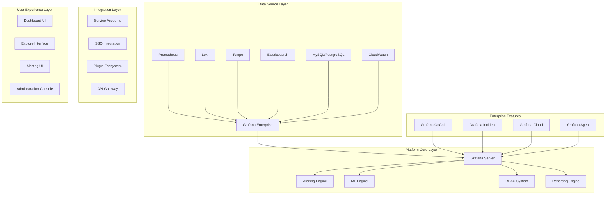

# Grafana Enterprise Observability Platform 深度实践

> **Author**: Monitoring Platform Architect | **Version**: v1.0 | **Update Time**: 2026-02-07
> **Scenario**: Enterprise-grade observability platform architecture | **Complexity**: ⭐⭐⭐⭐⭐

## 🎯 Abstract

This document provides in-depth exploration of Grafana Enterprise observability platform architecture design, deployment practices, and operational management. Based on large-scale production environment experience, it offers comprehensive technical guidance from dashboard design to distributed tracing, helping enterprises build unified, intelligent observability platforms.

## 1. Grafana Enterprise Architecture Deep Dive

### 1.1 Core Component Architecture



### 1.2 Enterprise Feature Matrix

```yaml
enterprise_features:
  grafana_enterprise:
    licensing: "Per-user subscription model"
    advanced_authentication:
      - SAML 2.0 support
      - LDAP/Active Directory integration
      - OAuth2/OpenID Connect
      - JWT token authentication
      - Certificate-based authentication
    
    enhanced_security:
      - Role-based access control (RBAC)
      - Fine-grained permissions
      - Audit logging
      - Data source proxy
      - Secure data transfer
    
    enterprise_plugins:
      - Enterprise data sources
      - Advanced panel types
      - Custom branding
      - White labeling
      - Premium support
  
  grafana_oncall:
    incident_management:
      - Escalation chains
      - On-call scheduling
      - Integration with communication tools
      - Automated incident response
      - Performance analytics
    
    notification_channels:
      - Slack integration
      - Microsoft Teams
      - SMS notifications
      - Phone calls
      - Email alerts
      - Webhooks
```

## 2. Enterprise Deployment Architecture

### 2.1 High Availability Deployment

```yaml
# grafana-enterprise-values.yaml
grafana:
  image:
    repository: grafana/grafana-enterprise
    tag: 10.2.0
    pullPolicy: IfNotPresent
  
  replicas: 3
  revisionHistoryLimit: 10
  
  # Persistence configuration
  persistence:
    type: pvc
    enabled: true
    storageClassName: fast-ssd
    size: 10Gi
    accessModes:
      - ReadWriteOnce
  
  # Resource configuration
  resources:
    limits:
      cpu: 2
      memory: 4Gi
    requests:
      cpu: 500m
      memory: 1Gi
  
  # Service configuration
  service:
    type: ClusterIP
    port: 80
    targetPort: 3000
  
  # Ingress configuration
  ingress:
    enabled: true
    annotations:
      kubernetes.io/ingress.class: nginx
      nginx.ingress.kubernetes.io/ssl-redirect: "true"
      cert-manager.io/cluster-issuer: "letsencrypt-prod"
    hosts:
      - grafana.example.com
    tls:
      - secretName: grafana-tls
        hosts:
          - grafana.example.com
  
  # Admin user configuration
  admin:
    existingSecret: grafana-admin-secret
    userKey: admin-user
    passwordKey: admin-password
  
  # Configuration
  grafana.ini:
    server:
      domain: grafana.example.com
      root_url: %(protocol)s://%(domain)s:%(http_port)s/
      serve_from_sub_path: false
    
    database:
      type: postgres
      host: postgres-grafana.grafana.svc.cluster.local:5432
      name: grafana
      user: grafana
      password: $__file{/etc/secrets/database/password}
    
    security:
      admin_user: admin
      admin_password: $__file{/etc/secrets/admin/password}
      secret_key: $__file{/etc/secrets/security/secret_key}
      disable_gravatar: true
      cookie_secure: true
      cookie_samesite: strict
    
    auth:
      disable_login_form: false
      disable_signout_menu: false
      signout_redirect_url: https://idp.example.com/logout
    
    auth.generic_oauth:
      enabled: true
      name: OAuth
      icon: signin
      client_id: $__file{/etc/secrets/oauth/client_id}
      client_secret: $__file{/etc/secrets/oauth/client_secret}
      scopes: openid profile email groups
      auth_url: https://idp.example.com/oauth2/authorize
      token_url: https://idp.example.com/oauth2/token
      api_url: https://idp.example.com/oauth2/userinfo
      role_attribute_path: contains(groups[*], 'grafana-admin') && 'Admin' || contains(groups[*], 'grafana-editor') && 'Editor' || 'Viewer'
    
    users:
      allow_sign_up: false
      auto_assign_org: true
      auto_assign_org_id: 1
      auto_assign_org_role: Viewer
      viewers_can_edit: false
      editors_can_admin: false
    
    auth.proxy:
      enabled: true
      header_name: X-WEBAUTH-USER
      header_property: username
      auto_sign_up: true
      ldap_sync_ttl: 60
      whitelist: 192.168.1.1, 192.168.2.1
      headers: Email:X-WEBAUTH-EMAIL, Name:X-WEBAUTH-NAME
```

### 2.2 External Database Configuration

```yaml
# postgresql-grafana.yaml
apiVersion: apps/v1
kind: StatefulSet
metadata:
  name: postgresql-grafana
  namespace: grafana
spec:
  serviceName: postgresql-grafana
  replicas: 1
  selector:
    matchLabels:
      app: postgresql-grafana
  template:
    metadata:
      labels:
        app: postgresql-grafana
    spec:
      containers:
      - name: postgresql
        image: postgres:15-alpine
        env:
        - name: POSTGRES_DB
          value: grafana
        - name: POSTGRES_USER
          value: grafana
        - name: POSTGRES_PASSWORD
          valueFrom:
            secretKeyRef:
              name: grafana-db-secret
              key: password
        - name: PGDATA
          value: /var/lib/postgresql/data/pgdata
        ports:
        - containerPort: 5432
        volumeMounts:
        - name: postgresql-data
          mountPath: /var/lib/postgresql/data
        resources:
          requests:
            memory: 512Mi
            cpu: 250m
          limits:
            memory: 1Gi
            cpu: 500m
        livenessProbe:
          exec:
            command:
            - pg_isready
            - -U
            - grafana
          initialDelaySeconds: 30
          periodSeconds: 10
        readinessProbe:
          exec:
            command:
            - pg_isready
            - -U
            - grafana
          initialDelaySeconds: 5
          periodSeconds: 5
  volumeClaimTemplates:
  - metadata:
      name: postgresql-data
    spec:
      accessModes: [ "ReadWriteOnce" ]
      storageClassName: "fast-ssd"
      resources:
        requests:
          storage: 20Gi
```

## 3. Dashboard Design Best Practices

### 3.1 Dashboard Structure Design

```json
{
  "dashboard": {
    "id": null,
    "uid": "enterprise-observability-dashboard",
    "title": "Enterprise Observability Overview",
    "tags": ["enterprise", "observability", "overview"],
    "timezone": "browser",
    "schemaVersion": 38,
    "version": 1,
    "refresh": "30s",
    "templating": {
      "list": [
        {
          "name": "datasource",
          "type": "datasource",
          "pluginId": "prometheus",
          "label": "Prometheus"
        },
        {
          "name": "environment",
          "type": "custom",
          "query": "production,staging,development",
          "label": "Environment",
          "multi": false,
          "includeAll": false
        }
      ]
    },
    "panels": [
      {
        "type": "stat",
        "title": "Overall System Health",
        "gridPos": {
          "h": 6,
          "w": 4,
          "x": 0,
          "y": 0
        },
        "targets": [
          {
            "expr": "sum(up{job=~\"$job\"}) / count(up{job=~\"$job\"}) * 100",
            "instant": true,
            "refId": "A"
          }
        ],
        "options": {
          "orientation": "auto",
          "textMode": "value_and_name",
          "colorMode": "background",
          "graphMode": "none",
          "justifyMode": "auto"
        },
        "fieldConfig": {
          "defaults": {
            "unit": "percent",
            "thresholds": {
              "mode": "absolute",
              "steps": [
                { "color": "red", "value": null },
                { "color": "orange", "value": 80 },
                { "color": "green", "value": 95 }
              ]
            }
          }
        }
      },
      {
        "type": "timeseries",
        "title": "Request Rate by Service",
        "gridPos": {
          "h": 8,
          "w": 12,
          "x": 4,
          "y": 0
        },
        "targets": [
          {
            "expr": "sum(rate(http_requests_total{environment=\"$environment\"}[5m])) by (service)",
            "legendFormat": "{{service}}",
            "refId": "A"
          }
        ],
        "options": {
          "tooltip": {
            "mode": "multi",
            "sort": "desc"
          }
        },
        "fieldConfig": {
          "defaults": {
            "unit": "req/s"
          }
        }
      },
      {
        "type": "heatmap",
        "title": "Response Time Distribution",
        "gridPos": {
          "h": 8,
          "w": 8,
          "x": 16,
          "y": 0
        },
        "targets": [
          {
            "expr": "http_request_duration_seconds_bucket{environment=\"$environment\"}",
            "format": "heatmap",
            "legendFormat": "{{le}}",
            "refId": "A"
          }
        ],
        "options": {
          "calculate": false,
          "color": {
            "exponent": 0.5,
            "fill": "dark-orange",
            "mode": "scheme",
            "reverse": false,
            "scale": "exponential",
            "scheme": "Oranges",
            "steps": 64
          }
        }
      }
    ]
  }
}
```

### 3.2 Alert Rule Configuration

```yaml
# grafana-alert-rules.yaml
apiVersion: grizzly.grafana.com/v1alpha1
kind: RuleGroup
metadata:
  name: enterprise-alerts
  folder: Production
spec:
  name: enterprise-alerts
  folder: Production
  interval: 60s
  rules:
    - name: High CPU Usage
      condition: B
      data:
        - refId: A
          relativeTimeRange:
            from: 600
            to: 0
          datasourceUid: prometheus-default
          model:
            expr: avg(rate(node_cpu_seconds_total{mode!="idle"}[5m])) by (instance) * 100
            intervalMs: 1000
            maxDataPoints: 43200
            refId: A
        - refId: B
          relativeTimeRange:
            from: 0
            to: 0
          datasourceUid: __expr__
          model:
            conditions:
              - evaluator:
                  params:
                    - 80
                  type: gt
                operator:
                  type: and
                query:
                  params:
                    - B
                reducer:
                  params: []
                  type: last
                type: query
            datasource:
              type: __expr__
              uid: __expr__
            expression: A
            intervalMs: 1000
            maxDataPoints: 43200
            refId: B
            type: classic_conditions
      dashboardUid: enterprise-observability-dashboard
      panelId: 2
      noDataState: "NoData"
      execErrState: "Error"
      for: 5m
      annotations:
        summary: High CPU usage detected
        description: CPU usage on {{ $labels.instance }} is above 80%
      labels:
        severity: warning
        team: sre

    - name: Service Down
      condition: B
      data:
        - refId: A
          relativeTimeRange:
            from: 600
            to: 0
          datasourceUid: prometheus-default
          model:
            expr: up{job=~"service.*"} == 0
            intervalMs: 1000
            maxDataPoints: 43200
            refId: A
        - refId: B
          relativeTimeRange:
            from: 0
            to: 0
          datasourceUid: __expr__
          model:
            conditions:
              - evaluator:
                  params: []
                  type: gt
                operator:
                  type: and
                query:
                  params:
                    - B
                reducer:
                  params: []
                  type: last
                type: query
            datasource:
              type: __expr__
              uid: __expr__
            expression: A
            intervalMs: 1000
            maxDataPoints: 43200
            refId: B
            type: classic_conditions
      for: 1m
      annotations:
        summary: Service is down
        description: Service {{ $labels.job }} is not responding
      labels:
        severity: critical
        team: sre
```

## 4. Distributed Tracing Integration

### 4.1 Tempo Configuration

```yaml
# tempo-config.yaml
server:
  http_listen_port: 3200

distributor:
  receivers:
    otlp:
      protocols:
        grpc:
          endpoint: 0.0.0.0:4317
        http:
          endpoint: 0.0.0.0:4318

ingester:
  max_block_duration: 5m

compactor:
  compaction:
    block_retention: 168h

storage:
  trace:
    backend: s3
    s3:
      bucket: tempo-traces
      endpoint: s3.amazonaws.com
      access_key: ${S3_ACCESS_KEY}
      secret_key: ${S3_SECRET_KEY}
```

### 4.2 Application Instrumentation

```python
# python-opentelemetry-example.py
from opentelemetry import trace
from opentelemetry.exporter.otlp.proto.grpc.trace_exporter import OTLPSpanExporter
from opentelemetry.sdk.resources import SERVICE_NAME, Resource
from opentelemetry.sdk.trace import TracerProvider
from opentelemetry.sdk.trace.export import BatchSpanProcessor
from opentelemetry.instrumentation.flask import FlaskInstrumentor
from flask import Flask

# Set up tracing
resource = Resource(attributes={
    SERVICE_NAME: "user-service"
})

provider = TracerProvider(resource=resource)
processor = BatchSpanProcessor(OTLPSpanExporter(endpoint="tempo:4317"))
provider.add_span_processor(processor)
trace.set_tracer_provider(provider)

tracer = trace.get_tracer(__name__)

# Flask application
app = Flask(__name__)
FlaskInstrumentor().instrument_app(app)

@app.route('/users/<user_id>')
def get_user(user_id):
    with tracer.start_as_current_span("get_user") as span:
        span.set_attribute("user.id", user_id)
        
        # Simulate database query
        with tracer.start_as_current_span("database_query") as db_span:
            db_span.set_attribute("db.statement", "SELECT * FROM users WHERE id = ?")
            # Database operation here
            
        return {"user_id": user_id, "name": "John Doe"}

if __name__ == '__main__':
    app.run(host='0.0.0.0', port=8000)
```

## 5. Machine Learning and Anomaly Detection

### 5.1 ML Alert Configuration

```yaml
# ml-alerts.yaml
apiVersion: grizzly.grafana.com/v1alpha1
kind: RuleGroup
metadata:
  name: ml-anomaly-detection
  folder: ML Alerts
spec:
  name: ml-anomaly-detection
  folder: ML Alerts
  interval: 60s
  rules:
    - name: CPU Anomaly Detection
      condition: B
      data:
        - refId: A
          relativeTimeRange:
            from: 3600
            to: 0
          datasourceUid: prometheus-default
          model:
            expr: rate(node_cpu_seconds_total{mode!="idle"}[5m])
            intervalMs: 1000
            maxDataPoints: 43200
            refId: A
        - refId: B
          relativeTimeRange:
            from: 0
            to: 0
          datasourceUid: grafana-ml
          model:
            algorithm: isolation_forest
            contamination: 0.1
            features:
              - "cpu_usage"
            prediction_field: "anomaly_score"
            threshold: 0.8
            refId: B
      for: 5m
      annotations:
        summary: CPU usage anomaly detected
        description: Unusual CPU usage pattern detected with score {{ $value }}
      labels:
        severity: warning
        team: ml-team

    - name: Memory Leak Detection
      condition: B
      data:
        - refId: A
          relativeTimeRange:
            from: 86400
            to: 0
          datasourceUid: prometheus-default
          model:
            expr: node_memory_Active_bytes
            intervalMs: 1000
            maxDataPoints: 43200
            refId: A
        - refId: B
          relativeTimeRange:
            from: 0
            to: 0
          datasourceUid: grafana-ml
          model:
            algorithm: linear_regression
            trend_threshold: 0.05
            prediction_window: "24h"
            refId: B
      for: 30m
      annotations:
        summary: Potential memory leak detected
        description: Memory usage showing increasing trend over time
      labels:
        severity: critical
        team: sre
```

## 6. Enterprise Governance and Compliance

### 6.1 RBAC Configuration

```yaml
# grafana-rbac.yaml
apiVersion: grizzly.grafana.com/v1alpha1
kind: Role
metadata:
  name: enterprise-viewer
spec:
  name: Enterprise Viewer
  description: Read-only access to enterprise dashboards
  permissions:
    - action: dashboards:read
      scope: dashboards:*:*
    - action: folders:read
      scope: folders:*:*
    - action: datasources:query
      scope: datasources:*:*

---
apiVersion: grizzly.grafana.com/v1alpha1
kind: Role
metadata:
  name: enterprise-editor
spec:
  name: Enterprise Editor
  description: Edit access to enterprise dashboards
  permissions:
    - action: dashboards:create
      scope: folders:uid:enterprise
    - action: dashboards:write
      scope: dashboards:*:*
    - action: dashboards:delete
      scope: dashboards:*:*
    - action: folders:create
      scope: folders:*:*
    - action: folders:write
      scope: folders:*:*

---
apiVersion: grizzly.grafana.com/v1alpha1
kind: Team
metadata:
  name: sre-team
spec:
  name: SRE Team
  email: sre@example.com
  members:
    - user: alice@example.com
    - user: bob@example.com
  roles:
    - role: enterprise-editor
      builtin: false

---
apiVersion: grizzly.grafana.com/v1alpha1
kind: Team
metadata:
  name: operations-team
spec:
  name: Operations Team
  email: ops@example.com
  members:
    - user: charlie@example.com
    - user: diana@example.com
  roles:
    - role: enterprise-viewer
      builtin: false
```

### 6.2 Audit Logging Configuration

```yaml
# audit-logging-config.yaml
grafana.ini:
  log:
    mode: console file
    level: info
  
  audit:
    enabled: true
    log_format: json
    log_path: /var/log/grafana/audit.log
    max_age: 30
    max_backups: 10
    max_size: 100
  
  security:
    audit_filters: 
      - path: /api/dashboards/db/*
        methods: [POST, PUT, DELETE]
        log_request_body: true
      - path: /api/users/*
        methods: [POST, PUT, DELETE]
        log_request_body: true
      - path: /api/admin/users/*
        methods: [POST, PUT, DELETE]
        log_request_body: true
```

## 7. Performance Optimization

### 7.1 Caching Strategy

```yaml
# grafana-caching.yaml
grafana.ini:
  caching:
    enabled: true
    backend: redis
    redis_url: redis://redis-cache:6379/0
    ttl: 300
    cleanup_interval: 3600
  
  panels:
    enable_alpha: false
    disable_sanitize_html: false
  
  rendering:
    concurrent_render_request_limit: 30
    rendering_timezone: browser
  
  unified_alerting:
    enabled: true
    ha_peers: grafana-0.grafana-headless:9094,grafana-1.grafana-headless:9094,grafana-2.grafana-headless:9094
    ha_listen_address: "0.0.0.0:9094"
    ha_advertise_address: "${POD_IP}:9094"
```

### 7.2 Query Optimization

```sql
-- Optimized PromQL examples

# 1. Use recording rules for expensive queries
# Recording rule
record: job:node_cpu_utilization:avg5m
expr: avg(rate(node_cpu_seconds_total{mode!="idle"}[5m])) by (job)

# Usage in dashboard
- expr: job:node_cpu_utilization:avg5m > 0.8

# 2. Avoid high cardinality labels
# Bad practice
rate(http_requests_total{instance=~".+"}[5m])

# Good practice
rate(http_requests_total[5m])

# 3. Use appropriate time ranges
# For real-time dashboards
rate(http_requests_total[1m])

# For trend analysis
rate(http_requests_total[1h])

# 4. Leverage subqueries for complex calculations
# 95th percentile over time
quantile_over_time(0.95, rate(http_request_duration_seconds_bucket[5m])[1h:])

# 5. Use offset for comparing with historical data
# Compare current with yesterday
rate(http_requests_total[5m]) / rate(http_requests_total[5m] offset 1d)
```

## 8. Disaster Recovery and Backup

### 8.1 Backup Strategy

```bash
#!/bin/bash
# grafana-backup.sh

BACKUP_DIR="/backup/grafana"
DATE=$(date +%Y%m%d_%H%M%S)
BACKUP_NAME="grafana_backup_${DATE}"

# Create backup directory
mkdir -p ${BACKUP_DIR}/${BACKUP_NAME}

# 1. Backup database
echo "Backing up Grafana database..."
pg_dump -h postgres-grafana.grafana.svc.cluster.local -U grafana grafana > ${BACKUP_DIR}/${BACKUP_NAME}/grafana.sql

# 2. Backup configuration
echo "Backing up Grafana configuration..."
kubectl get configmap -n grafana -o yaml > ${BACKUP_DIR}/${BACKUP_NAME}/configmaps.yaml
kubectl get secret -n grafana -o yaml > ${BACKUP_DIR}/${BACKUP_NAME}/secrets.yaml

# 3. Backup dashboards
echo "Backing up dashboards..."
curl -s -u admin:${GRAFANA_PASSWORD} \
  "http://grafana.grafana.svc.cluster.local/api/search?query=&" | \
  jq -r '.[].uid' | while read uid; do
    curl -s -u admin:${GRAFANA_PASSWORD} \
      "http://grafana.grafana.svc.cluster.local/api/dashboards/uid/${uid}" | \
      jq '.dashboard' > ${BACKUP_DIR}/${BACKUP_NAME}/dashboard_${uid}.json
  done

# 4. Backup data sources
echo "Backing up data sources..."
curl -s -u admin:${GRAFANA_PASSWORD} \
  "http://grafana.grafana.svc.cluster.local/api/datasources" | \
  jq '.' > ${BACKUP_DIR}/${BACKUP_NAME}/datasources.json

# 5. Create backup manifest
cat > ${BACKUP_DIR}/${BACKUP_NAME}/manifest.json << EOF
{
  "backup_name": "${BACKUP_NAME}",
  "created_at": "$(date -Iseconds)",
  "grafana_version": "$(curl -s -u admin:${GRAFANA_PASSWORD} http://grafana.grafana.svc.cluster.local/api/health | jq -r '.version')",
  "components": ["database", "configuration", "dashboards", "datasources"],
  "checksum": "$(sha256sum ${BACKUP_DIR}/${BACKUP_NAME}/* | sha256sum | cut -d' ' -f1)"
}
EOF

# 6. Compress backup
tar -czf ${BACKUP_DIR}/${BACKUP_NAME}.tar.gz -C ${BACKUP_DIR} ${BACKUP_NAME}

# 7. Cleanup temporary directory
rm -rf ${BACKUP_DIR}/${BACKUP_NAME}

# 8. Upload to remote storage
if [ -n "$REMOTE_STORAGE" ]; then
    echo "Uploading to remote storage..."
    aws s3 cp ${BACKUP_DIR}/${BACKUP_NAME}.tar.gz s3://$REMOTE_STORAGE/backups/
fi

echo "Backup completed: ${BACKUP_DIR}/${BACKUP_NAME}.tar.gz"
```

## 9. Monitoring and Maintenance

### 9.1 Health Check Configuration

```yaml
# grafana-health-check.yaml
apiVersion: v1
kind: ConfigMap
metadata:
  name: grafana-health-check
  namespace: grafana
data:
  health-check.sh: |
    #!/bin/bash
    set -e
    
    GRAFANA_URL="http://localhost:3000"
    ADMIN_USER="${GF_SECURITY_ADMIN_USER:-admin}"
    ADMIN_PASSWORD="${GF_SECURITY_ADMIN_PASSWORD}"
    
    # Check Grafana health endpoint
    health_status=$(curl -s -o /dev/null -w "%{http_code}" ${GRAFANA_URL}/api/health)
    if [ "$health_status" != "200" ]; then
      echo "Grafana health check failed: HTTP $health_status"
      exit 1
    fi
    
    # Check database connectivity
    db_status=$(curl -s -u ${ADMIN_USER}:${ADMIN_PASSWORD} ${GRAFANA_URL}/api/health/database | jq -r '.status')
    if [ "$db_status" != "ok" ]; then
      echo "Database connectivity check failed: $db_status"
      exit 1
    fi
    
    # Check data source connectivity
    datasources=$(curl -s -u ${ADMIN_USER}:${ADMIN_PASSWORD} ${GRAFANA_URL}/api/datasources)
    echo "$datasources" | jq -c '.[]' | while read datasource; do
      ds_name=$(echo "$datasource" | jq -r '.name')
      ds_uid=$(echo "$datasource" | jq -r '.uid')
      
      ds_health=$(curl -s -u ${ADMIN_USER}:${ADMIN_PASSWORD} ${GRAFANA_URL}/api/datasources/uid/${ds_uid}/health | jq -r '.status')
      if [ "$ds_health" != "OK" ]; then
        echo "Data source ${ds_name} health check failed: $ds_health"
      fi
    done
    
    echo "All health checks passed"
```

## 10. Future Trends and Roadmap

### 10.1 Emerging Technologies

```yaml
future_trends:
  ai_enhanced_observability:
    - automated_dashboard_generation
    - intelligent_alert_correlation
    - predictive failure analysis
    - natural_language querying
  
  cloud_native_integration:
    - kubernetes_native_operations
    - service mesh observability
    - serverless monitoring
    - edge computing telemetry
  
  unified_platform_evolution:
    - single pane of glass
    - cross-domain correlation
    - business context integration
    - executive reporting automation
```

---
*This document is based on enterprise-level observability platform practice experience and continuously updated with the latest technologies and best practices.*