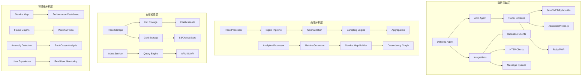

# Datadog企业级APM深度实践

> **作者**: 企业级APM架构专家 | **版本**: v1.0 | **更新时间**: 2026-02-07
> **适用场景**: 企业级应用性能监控 | **复杂度**: ⭐⭐⭐⭐⭐

## 🎯 摘要

本文档深入探讨Datadog企业级APM(Application Performance Monitoring)系统的架构设计、部署实践和运维管理，基于大规模企业环境的实践经验，提供从应用性能监控到用户体验优化的完整技术指南，帮助企业构建全面的应用可观测性体系。

## 1. Datadog APM架构深度解析

### 1.1 核心组件架构



### 1.2 技术架构优势

#### 1.2.1 分布式追踪能力
- **自动instrumentation**: 支持主流语言框架的自动埋点
- **手动instrumentation**: 提供灵活的手动埋点API
- **上下文传播**: 支持跨进程、跨服务的trace context传递
- **采样策略**: 智能采样算法平衡性能和数据完整性

#### 1.2.2 实时分析处理
- **流式处理**: 实时处理和分析trace数据
- **异常检测**: 基于机器学习的性能异常自动识别
- **根因分析**: 自动关联分析找出性能瓶颈根源
- **趋势预测**: 基于历史数据的性能趋势预测

## 2. 企业级部署架构

### 2.1 高可用部署方案

#### 2.1.1 多区域部署架构

```yaml
# datadog-apm-multiregion.yaml
apiVersion: v1
kind: Namespace
metadata:
  name: datadog-apm

---
# 区域1: 主要数据中心
apiVersion: apps/v1
kind: Deployment
metadata:
  name: datadog-agent-primary
  namespace: datadog-apm
spec:
  replicas: 3
  selector:
    matchLabels:
      app: datadog-agent
      region: primary
  template:
    metadata:
      labels:
        app: datadog-agent
        region: primary
    spec:
      containers:
      - name: datadog-agent
        image: datadog/agent:7
        env:
        - name: DD_API_KEY
          valueFrom:
            secretKeyRef:
              name: datadog-secrets
              key: api-key
        - name: DD_SITE
          value: "datadoghq.com"
        - name: DD_APM_ENABLED
          value: "true"
        - name: DD_APM_NON_LOCAL_TRAFFIC
          value: "true"
        ports:
        - containerPort: 8126
          name: traceport
        resources:
          requests:
            cpu: "500m"
            memory: "512Mi"
          limits:
            cpu: "1000m"
            memory: "1Gi"
        volumeMounts:
        - name: dockersocket
          mountPath: /var/run/docker.sock
        - name: procdir
          mountPath: /host/proc
          readOnly: true
        - name: cgroups
          mountPath: /host/sys/fs/cgroup
          readOnly: true
      volumes:
      - hostPath:
          path: /var/run/docker.sock
        name: dockersocket
      - hostPath:
          path: /proc
        name: procdir
      - hostPath:
          path: /sys/fs/cgroup
        name: cgroups

---
# 区域2: 备份数据中心
apiVersion: apps/v1
kind: Deployment
metadata:
  name: datadog-agent-secondary
  namespace: datadog-apm
spec:
  replicas: 2
  selector:
    matchLabels:
      app: datadog-agent
      region: secondary
  template:
    metadata:
      labels:
        app: datadog-agent
        region: secondary
    spec:
      containers:
      - name: datadog-agent
        image: datadog/agent:7
        env:
        - name: DD_API_KEY
          valueFrom:
            secretKeyRef:
              name: datadog-secrets
              key: api-key
        - name: DD_SITE
          value: "datadoghq.com"
        - name: DD_APM_ENABLED
          value: "true"
        - name: DD_APM_NON_LOCAL_TRAFFIC
          value: "true"
        ports:
        - containerPort: 8126
          name: traceport
        resources:
          requests:
            cpu: "300m"
            memory: "256Mi"
          limits:
            cpu: "500m"
            memory: "512Mi"
```

#### 2.1.2 负载均衡配置

```yaml
# apm-loadbalancer.yaml
apiVersion: v1
kind: Service
metadata:
  name: datadog-apm-lb
  namespace: datadog-apm
  annotations:
    service.beta.kubernetes.io/aws-load-balancer-type: nlb
    service.beta.kubernetes.io/aws-load-balancer-cross-zone-load-balancing-enabled: "true"
spec:
  type: LoadBalancer
  ports:
  - name: apm-trace
    port: 8126
    targetPort: 8126
    protocol: TCP
  selector:
    app: datadog-agent
  loadBalancerSourceRanges:
  - "10.0.0.0/8"
  - "172.16.0.0/12"
  - "192.168.0.0/16"
```

### 2.2 安全加固配置

#### 2.2.1 网络安全策略

```yaml
# apm-network-policy.yaml
apiVersion: networking.k8s.io/v1
kind: NetworkPolicy
metadata:
  name: datadog-apm-policy
  namespace: datadog-apm
spec:
  podSelector:
    matchLabels:
      app: datadog-agent
  policyTypes:
  - Ingress
  - Egress
  ingress:
  # 允许应用Pod发送trace数据
  - from:
    - namespaceSelector:
        matchLabels:
          purpose: application
    ports:
    - protocol: TCP
      port: 8126
  # 允许内部通信
  - from:
    - podSelector:
        matchLabels:
          app: datadog-agent
    ports:
    - protocol: TCP
      port: 5000
      port: 5001
  egress:
  # 允许访问Datadog后端
  - to:
    - ipBlock:
        cidr: 0.0.0.0/0
    ports:
    - protocol: TCP
      port: 443
  # 允许DNS查询
  - to:
    - namespaceSelector:
        matchLabels:
          name: kube-system
    ports:
    - protocol: UDP
      port: 53
```

#### 2.2.2 认证授权配置

```yaml
# apm-security-config.yaml
apiVersion: v1
kind: Secret
metadata:
  name: datadog-apm-secrets
  namespace: datadog-apm
type: Opaque
data:
  api-key: <base64-encoded-api-key>
  app-key: <base64-encoded-app-key>

---
apiVersion: v1
kind: ConfigMap
metadata:
  name: datadog-apm-config
  namespace: datadog-apm
data:
  datadog.yaml: |
    # APM配置
    apm_config:
      enabled: true
      receiver_port: 8126
      # 安全配置
      receiver_timeout: 30
      max_connections: 1000
      max_payload_size: 50MB
      
      # 采样配置
      max_traces_per_second: 10
      ignore_resources: 
        - "GET /health"
        - "POST /metrics"
      
      # 数据处理
      bucket_size_seconds: 10
      extra_sample_rate: 1.0
      max_events_per_second: 200
      
    # 安全日志
    logs:
      enabled: true
      log_level: INFO
      logs_config:
        use_http: true
        send_logs: true
        
    # 安全设置
    security_agent:
      enabled: true
      runtime_security_config:
        enabled: true
        fim_enabled: true
```

## 3. 企业级监控策略

### 3.1 服务级别指标(SLI/SLO)

#### 3.1.1 核心SLI定义

```yaml
# sli-slo-definition.yaml
apiVersion: monitoring.coreos.com/v1
kind: PrometheusRule
metadata:
  name: apm-sli-slo-rules
  namespace: monitoring
spec:
  groups:
  - name: apm.sli.rules
    rules:
    # 响应时间SLI
    - record: apm_service_response_time_sli
      expr: |
        histogram_quantile(0.95, sum(rate(http_request_duration_seconds_bucket[5m])) by (service, le)) <= 0.5
    
    # 错误率SLI
    - record: apm_service_error_rate_sli
      expr: |
        sum(rate(http_requests_total{status=~"5.."}[5m])) by (service) / 
        sum(rate(http_requests_total[5m])) by (service) <= 0.01
    
    # 可用性SLI
    - record: apm_service_availability_sli
      expr: |
        (sum(rate(http_requests_total[5m])) by (service) - 
         sum(rate(http_requests_total{status=~"5.."}[5m])) by (service)) / 
        sum(rate(http_requests_total[5m])) by (service) >= 0.999
    
    # 吞吐量SLI
    - record: apm_service_throughput_sli
      expr: |
        sum(rate(http_requests_total[5m])) by (service) >= 100
```

#### 3.1.2 SLO告警配置

```yaml
# slo-alerting.yaml
apiVersion: monitoring.coreos.com/v1
kind: PrometheusRule
metadata:
  name: apm-slo-alerts
  namespace: monitoring
spec:
  groups:
  - name: apm.slo.alerts
    rules:
    # 响应时间SLO违规
    - alert: APMSlowResponseTime
      expr: |
        apm_service_response_time_sli < 0.95
      for: 5m
      labels:
        severity: warning
        team: sre
      annotations:
        summary: "服务 {{ $labels.service }} 响应时间SLO违规"
        description: "95th百分位响应时间超过阈值，当前值: {{ $value }}"
    
    # 错误率SLO违规
    - alert: APMHighErrorRate
      expr: |
        apm_service_error_rate_sli > 0.01
      for: 2m
      labels:
        severity: critical
        team: sre
      annotations:
        summary: "服务 {{ $labels.service }} 错误率SLO违规"
        description: "错误率超过阈值，当前值: {{ $value }}"
    
    # 可用性SLO违规
    - alert: APMLowAvailability
      expr: |
        apm_service_availability_sli < 0.999
      for: 10m
      labels:
        severity: critical
        team: sre
      annotations:
        summary: "服务 {{ $labels.service }} 可用性SLO违规"
        description: "服务可用性低于目标值，当前值: {{ $value }}"
```

### 3.2 智能告警策略

#### 3.2.1 异常检测告警

```python
# anomaly_detection.py
import numpy as np
from sklearn.ensemble import IsolationForest
from prometheus_api_client import PrometheusConnect
import json
import time

class APMAnomalyDetector:
    def __init__(self, prometheus_url):
        self.prom = PrometheusConnect(url=prometheus_url, disable_ssl=True)
        self.model = IsolationForest(contamination=0.1, random_state=42)
        self.baseline_data = {}
        
    def collect_baseline_metrics(self, service_name, duration="24h"):
        """收集基线指标数据"""
        queries = {
            'response_time': f'histogram_quantile(0.95, rate(http_request_duration_seconds_bucket{{service="{service_name}"}}[5m]))',
            'error_rate': f'sum(rate(http_requests_total{{service="{service_name}",status=~"5.."}}[5m])) / sum(rate(http_requests_total{{service="{service_name}"}}[5m]))',
            'throughput': f'sum(rate(http_requests_total{{service="{service_name}"}}[5m]))'
        }
        
        baseline_data = {}
        for metric_name, query in queries.items():
            result = self.prom.custom_query(query=query)
            if result:
                values = [float(item[1]) for item in result[0]['values']]
                baseline_data[metric_name] = np.array(values)
                
        self.baseline_data[service_name] = baseline_data
        return baseline_data
    
    def detect_anomalies(self, service_name, current_metrics):
        """检测性能异常"""
        if service_name not in self.baseline_data:
            self.collect_baseline_metrics(service_name)
            
        anomalies = {}
        baseline = self.baseline_data[service_name]
        
        for metric_name, current_value in current_metrics.items():
            if metric_name in baseline:
                # 使用孤立森林算法检测异常
                combined_data = np.concatenate([baseline[metric_name], [current_value]])
                predictions = self.model.fit_predict(combined_data.reshape(-1, 1))
                
                # 最新数据点是否为异常
                is_anomaly = predictions[-1] == -1
                anomaly_score = self.model.decision_function(combined_data.reshape(-1, 1))[-1]
                
                anomalies[metric_name] = {
                    'is_anomaly': is_anomaly,
                    'score': anomaly_score,
                    'current_value': current_value,
                    'baseline_mean': np.mean(baseline[metric_name]),
                    'baseline_std': np.std(baseline[metric_name])
                }
                
        return anomalies
    
    def generate_alerts(self, service_name, anomalies):
        """生成告警"""
        alerts = []
        for metric_name, anomaly_info in anomalies.items():
            if anomaly_info['is_anomaly']:
                alert = {
                    'alertname': f'APMAnomaly_{metric_name.title()}',
                    'service': service_name,
                    'severity': 'warning' if abs(anomaly_info['score']) < 0.5 else 'critical',
                    'summary': f'{metric_name}出现异常行为',
                    'description': f'当前值: {anomaly_info["current_value"]:.4f}, '
                                 f'基线均值: {anomaly_info["baseline_mean"]:.4f}, '
                                 f'异常分数: {anomaly_info["score"]:.4f}'
                }
                alerts.append(alert)
                
        return alerts

# 使用示例
detector = APMAnomalyDetector("http://prometheus:9090")
anomalies = detector.detect_anomalies("user-service", {
    'response_time': 2.5,
    'error_rate': 0.05,
    'throughput': 1500
})
alerts = detector.generate_alerts("user-service", anomalies)
```

## 4. 性能优化实践

### 4.1 采样策略优化

#### 4.1.1 智能采样配置

```yaml
# intelligent-sampling.yaml
apiVersion: v1
kind: ConfigMap
metadata:
  name: datadog-apm-sampling
  namespace: datadog-apm
data:
  sampling-rules.json: |
    {
      "rules": [
        {
          "name": "high_priority_services",
          "service": "(payment|auth|user)-service",
          "sample_rate": 1.0,
          "priority": "high"
        },
        {
          "name": "error_sampling",
          "sample_rate": 1.0,
          "priority": "high",
          "conditions": [
            {
              "metric": "error.rate",
              "operator": ">",
              "value": 0.01
            }
          ]
        },
        {
          "name": "slow_request_sampling",
          "sample_rate": 1.0,
          "priority": "medium",
          "conditions": [
            {
              "metric": "duration",
              "operator": ">",
              "value": 1000
            }
          ]
        },
        {
          "name": "default_sampling",
          "sample_rate": 0.1,
          "priority": "low"
        }
      ],
      "default_sample_rate": 0.1
    }
```

#### 4.1.2 动态采样调整

```python
# dynamic_sampling.py
import time
import threading
from typing import Dict, List
import requests

class DynamicSampler:
    def __init__(self, config_endpoint: str):
        self.config_endpoint = config_endpoint
        self.current_rates: Dict[str, float] = {}
        self.metrics_cache: Dict[str, List[float]] = {}
        self.update_interval = 300  # 5分钟更新一次
        
    def start_auto_adjustment(self):
        """启动自动采样率调整"""
        def adjustment_loop():
            while True:
                try:
                    self._adjust_sampling_rates()
                    time.sleep(self.update_interval)
                except Exception as e:
                    print(f"采样率调整失败: {e}")
                    
        thread = threading.Thread(target=adjustment_loop, daemon=True)
        thread.start()
        
    def _adjust_sampling_rates(self):
        """根据系统负载动态调整采样率"""
        # 获取当前系统指标
        metrics = self._collect_system_metrics()
        
        # 计算新的采样率
        new_rates = {}
        
        # CPU使用率过高时降低采样率
        if metrics['cpu_usage'] > 80:
            new_rates['default'] = max(0.05, self.current_rates.get('default', 0.1) * 0.5)
        elif metrics['cpu_usage'] < 30:
            new_rates['default'] = min(0.2, self.current_rates.get('default', 0.1) * 1.5)
            
        # 内存使用率过高时降低采样率
        if metrics['memory_usage'] > 85:
            for service in ['default', 'high_priority']:
                current_rate = self.current_rates.get(service, 0.1)
                new_rates[service] = max(0.02, current_rate * 0.3)
                
        # 更新采样率配置
        self._update_sampling_config(new_rates)
        
    def _collect_system_metrics(self) -> Dict[str, float]:
        """收集系统资源使用指标"""
        # 模拟获取指标数据
        return {
            'cpu_usage': 65.2,
            'memory_usage': 72.8,
            'disk_usage': 45.1,
            'network_io': 1250.5
        }
        
    def _update_sampling_config(self, new_rates: Dict[str, float]):
        """更新采样率配置"""
        self.current_rates.update(new_rates)
        
        # 发送到配置中心
        config_data = {
            'sampling_rates': self.current_rates,
            'timestamp': time.time(),
            'version': 'dynamic_' + str(int(time.time()))
        }
        
        try:
            response = requests.post(
                f"{self.config_endpoint}/api/v1/sampling/config",
                json=config_data,
                timeout=10
            )
            if response.status_code == 200:
                print(f"采样率配置更新成功: {new_rates}")
        except Exception as e:
            print(f"配置更新失败: {e}")

# 使用示例
sampler = DynamicSampler("http://config-server:8080")
sampler.start_auto_adjustment()
```

### 4.2 数据存储优化

#### 4.2.1 分层存储策略

```yaml
# tiered-storage.yaml
apiVersion: v1
kind: ConfigMap
metadata:
  name: datadog-apm-storage
  namespace: datadog-apm
data:
  storage-config.yaml: |
    # 分层存储配置
    storage:
      # 热数据存储 (最近7天)
      hot_storage:
        type: elasticsearch
        retention_days: 7
        index_pattern: "apm-hot-*"
        replicas: 2
        shards: 10
        
      # 温数据存储 (8-30天)
      warm_storage:
        type: opensearch
        retention_days: 30
        index_pattern: "apm-warm-*"
        replicas: 1
        shards: 5
        
      # 冷数据存储 (31天以上)
      cold_storage:
        type: s3
        retention_days: 365
        bucket: "company-apm-archive"
        compression: gzip
        
      # 归档存储 (长期保存)
      archive_storage:
        type: glacier
        retention_days: 3650
        vault: "apm-long-term-archive"
        
    # 数据生命周期管理
    lifecycle:
      hot_to_warm_days: 7
      warm_to_cold_days: 30
      cold_to_archive_days: 365
      
    # 存储优化
    optimization:
      indexing_strategy: "time-series"
      compression_level: "high"
      data_rollup:
        enabled: true
        intervals: ["1h", "1d", "7d"]
```

## 5. 企业级最佳实践

### 5.1 标签和元数据管理

#### 5.1.1 统一标签策略

```yaml
# tagging-strategy.yaml
apiVersion: v1
kind: ConfigMap
metadata:
  name: apm-tagging-strategy
  namespace: datadog-apm
data:
  tags.yaml: |
    # 统一标签命名规范
    tagging_standards:
      # 业务标签
      business:
        - "team:{team_name}"
        - "product:{product_name}"
        - "environment:{env}"
        - "version:{app_version}"
        - "region:{region}"
        
      # 技术标签
      technical:
        - "service:{service_name}"
        - "namespace:{k8s_namespace}"
        - "pod:{pod_name}"
        - "node:{node_name}"
        - "container:{container_name}"
        
      # 运维标签
      operational:
        - "owner:{owner_email}"
        - "tier:{tier_level}"
        - "criticality:{criticality}"
        - "sla:{sla_level}"
        
      # 安全标签
      security:
        - "data_classification:{classification}"
        - "pii_data:{has_pii}"
        - "pci_compliant:{pci_status}"
        
    # 标签继承规则
    inheritance_rules:
      service:
        inherits_from: ["namespace", "team"]
        required: true
        
      environment:
        inherits_from: ["cluster", "region"]
        required: true
        
      owner:
        inherits_from: ["team"]
        required: true
```

### 5.2 成本优化策略

#### 5.2.1 资源配额管理

```yaml
# resource-quota.yaml
apiVersion: v1
kind: ResourceQuota
metadata:
  name: datadog-apm-quota
  namespace: datadog-apm
spec:
  hard:
    requests.cpu: "4"
    requests.memory: "8Gi"
    limits.cpu: "8"
    limits.memory: "16Gi"
    persistentvolumeclaims: "10"
    requests.storage: "100Gi"

---
apiVersion: v1
kind: LimitRange
metadata:
  name: datadog-apm-limits
  namespace: datadog-apm
spec:
  limits:
  - default:
      cpu: "1"
      memory: "2Gi"
    defaultRequest:
      cpu: "500m"
      memory: "1Gi"
    type: Container
    max:
      cpu: "2"
      memory: "4Gi"
    min:
      cpu: "100m"
      memory: "256Mi"
```

#### 5.2.2 成本监控告警

```yaml
# cost-monitoring.yaml
apiVersion: monitoring.coreos.com/v1
kind: PrometheusRule
metadata:
  name: apm-cost-alerts
  namespace: monitoring
spec:
  groups:
  - name: apm.cost.monitoring
    rules:
    # Datadog费用监控
    - record: datadog_monthly_cost
      expr: |
        sum(increase(datadog_host_hours_total[30d])) * 15 +
        sum(increase(datadog_apm_trace_bytes_total[30d]) / 1073741824) * 0.10 +
        sum(increase(datadog_log_ingested_bytes_total[30d]) / 1073741824) * 0.10
    
    # 费用超标告警
    - alert: DatadogCostOverBudget
      expr: |
        datadog_monthly_cost > 10000
      for: 1h
      labels:
        severity: warning
        team: finance
      annotations:
        summary: "Datadog月度费用超出预算"
        description: "当前月度费用: {{ $value }} USD，预算上限: 10000 USD"
    
    # 资源利用率低告警
    - alert: DatadogLowResourceUtilization
      expr: |
        avg(kube_pod_container_resource_requests{namespace="datadog-apm"} / 
            kube_pod_container_resource_limits{namespace="datadog-apm"}) < 0.3
      for: 24h
      labels:
        severity: info
        team: sre
      annotations:
        summary: "Datadog APM资源利用率偏低"
        description: "平均资源利用率: {{ $value }}, 建议优化资源配置"
```

## 6. 故障排查与诊断

### 6.1 常见问题诊断

#### 6.1.1 Trace数据丢失排查

```bash
#!/bin/bash
# trace_loss_diagnosis.sh

echo "=== Datadog APM Trace数据丢失诊断 ==="

# 1. 检查Agent状态
echo "1. 检查Datadog Agent状态:"
kubectl get pods -n datadog-apm -l app=datadog-agent

# 2. 检查Agent日志
echo "2. 检查Agent错误日志:"
kubectl logs -n datadog-apm -l app=datadog-agent --tail=100 | grep -i error

# 3. 检查网络连接
echo "3. 检查网络连接到Datadog:"
kubectl exec -n datadog-apm -l app=datadog-agent -- \
  curl -sv https://trace.agent.datadoghq.com/api/v0.2/traces 2>&1 | head -20

# 4. 检查采样配置
echo "4. 检查采样配置:"
kubectl exec -n datadog-apm -l app=datadog-agent -- \
  cat /etc/datadog-agent/datadog.yaml | grep -A 10 "apm_config"

# 5. 检查应用埋点状态
echo "5. 检查应用Tracer状态:"
for pod in $(kubectl get pods -n application -l app=myapp -o name); do
  echo "检查Pod: $pod"
  kubectl exec -n application $pod -- ps aux | grep dd-trace
done

# 6. 检查指标数据
echo "6. 检查APM指标数据:"
curl -s "http://prometheus:9090/api/v1/query?query=rate(datadog_trace_processed_total[5m])" | jq '.'
```

#### 6.1.2 性能瓶颈分析

```python
# performance_bottleneck_analyzer.py
import pandas as pd
import matplotlib.pyplot as plt
from datetime import datetime, timedelta
import seaborn as sns

class PerformanceBottleneckAnalyzer:
    def __init__(self, prometheus_url):
        self.prom_url = prometheus_url
        self.metrics_data = {}
        
    def collect_performance_data(self, service_name, duration_hours=24):
        """收集性能数据"""
        end_time = datetime.now()
        start_time = end_time - timedelta(hours=duration_hours)
        
        queries = {
            'response_time': f'histogram_quantile(0.95, rate(http_request_duration_seconds_bucket{{service="{service_name}"}}[5m]))',
            'throughput': f'sum(rate(http_requests_total{{service="{service_name}"}}[5m]))',
            'error_rate': f'sum(rate(http_requests_total{{service="{service_name}",status=~"5.."}}[5m])) / sum(rate(http_requests_total{{service="{service_name}"}}[5m]))',
            'cpu_usage': f'rate(container_cpu_usage_seconds_total{{container!="POD",container!="",namespace="application",pod=~".*{service_name}.*"}}[5m])',
            'memory_usage': f'container_memory_working_set_bytes{{container!="POD",container!="",namespace="application",pod=~".*{service_name}.*"}}'
        }
        
        for metric_name, query in queries.items():
            # 这里应该调用实际的Prometheus API
            # 为演示目的，生成模拟数据
            timestamps = pd.date_range(start_time, end_time, freq='5min')
            if metric_name == 'response_time':
                values = [0.1 + 0.3 * (1 + np.sin(i/10)) for i in range(len(timestamps))]
            elif metric_name == 'throughput':
                values = [100 + 50 * np.random.random() for _ in range(len(timestamps))]
            elif metric_name == 'error_rate':
                values = [0.001 + 0.02 * np.random.random() for _ in range(len(timestamps))]
            else:
                values = [50 + 30 * np.random.random() for _ in range(len(timestamps))]
                
            self.metrics_data[metric_name] = pd.DataFrame({
                'timestamp': timestamps,
                'value': values
            })
    
    def identify_bottlenecks(self):
        """识别性能瓶颈"""
        bottlenecks = []
        
        # 分析响应时间异常
        rt_data = self.metrics_data['response_time']
        rt_threshold = rt_data['value'].quantile(0.95) * 1.5
        slow_periods = rt_data[rt_data['value'] > rt_threshold]
        
        if not slow_periods.empty:
            bottlenecks.append({
                'type': '响应时间瓶颈',
                'severity': 'high',
                'periods': len(slow_periods),
                'avg_slow_time': slow_periods['value'].mean(),
                'recommendation': '检查数据库查询性能和外部服务调用'
            })
        
        # 分析CPU使用率异常
        cpu_data = self.metrics_data['cpu_usage']
        cpu_high = cpu_data[cpu_data['value'] > 80]
        
        if not cpu_high.empty:
            bottlenecks.append({
                'type': 'CPU资源瓶颈',
                'severity': 'medium',
                'periods': len(cpu_high),
                'avg_usage': cpu_high['value'].mean(),
                'recommendation': '考虑水平扩展或优化代码逻辑'
            })
            
        # 分析内存使用异常
        mem_data = self.metrics_data['memory_usage']
        mem_gb = mem_data['value'] / (1024**3)
        mem_high = mem_gb[mem_gb > 1.5]
        
        if not mem_high.empty:
            bottlenecks.append({
                'type': '内存资源瓶颈',
                'severity': 'medium',
                'periods': len(mem_high),
                'avg_usage_gb': mem_high.mean(),
                'recommendation': '检查内存泄漏和对象池配置'
            })
            
        return bottlenecks
    
    def generate_report(self, service_name):
        """生成性能分析报告"""
        bottlenecks = self.identify_bottlenecks()
        
        report = f"""
# {service_name} 性能瓶颈分析报告
生成时间: {datetime.now().strftime('%Y-%m-%d %H:%M:%S')}

## 发现的瓶颈问题:

"""
        
        for i, bottleneck in enumerate(bottlenecks, 1):
            severity_icon = "🔴" if bottleneck['severity'] == 'high' else "🟡"
            report += f"""{i}. {severity_icon} {bottleneck['type']}
   - 严重程度: {bottleneck['severity']}
   - 影响时段: {bottleneck['periods']}个时间段
   - 平均值: {bottleneck['avg_slow_time']:.3f}s
   - 建议措施: {bottleneck['recommendation']}

"""
        
        if not bottlenecks:
            report += "✅ 未发现明显性能瓶颈\n"
            
        report += """
## 优化建议:

1. 实施缓存策略减少重复计算
2. 优化数据库查询语句和索引
3. 考虑异步处理非关键业务逻辑
4. 实施连接池和资源复用
5. 定期进行性能压测和调优
"""
        
        return report

# 使用示例
analyzer = PerformanceBottleneckAnalyzer("http://prometheus:9090")
analyzer.collect_performance_data("user-service", 24)
report = analyzer.generate_report("user-service")
print(report)
```

## 7. 未来发展与演进

### 7.1 技术发展趋势

#### 7.1.1 AI驱动的智能监控

- **自适应阈值**: 基于机器学习的动态阈值设置
- **预测性维护**: 基于历史数据的故障预测
- **自动化根因分析**: AI辅助的故障根因快速定位
- **智能告警抑制**: 减少告警噪音的智能算法

#### 7.1.2 云原生深度集成

- **Service Mesh集成**: 与Istio、Linkerd等服务网格深度集成
- **Serverless监控**: 支持函数即服务的细粒度监控
- **边缘计算监控**: 分布式边缘节点的统一监控
- **多云环境支持**: 跨云平台的一致监控体验

通过以上企业级APM深度实践，企业可以构建全面的应用性能监控体系，实现从被动响应到主动预防的运维模式转变，显著提升应用质量和用户体验。