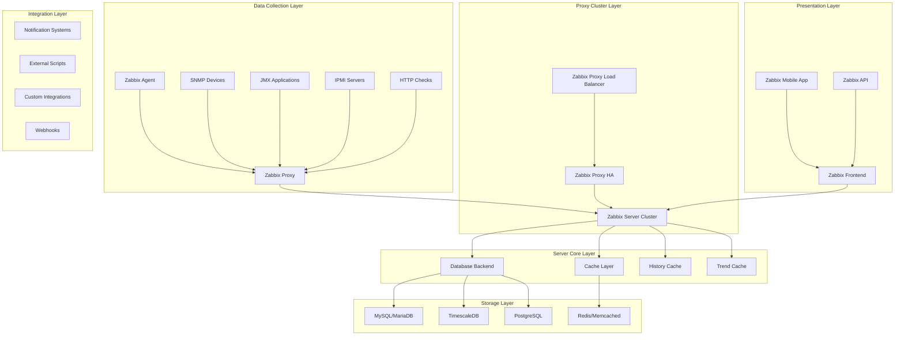

# Zabbix Enterprise Monitoring Platform 深度实践

> **Author**: Monitoring Platform Architect | **Version**: v1.0 | **Update Time**: 2026-02-07
> **Scenario**: Enterprise-grade infrastructure monitoring | **Complexity**: ⭐⭐⭐⭐

## 🎯 Abstract

This document provides comprehensive exploration of Zabbix enterprise monitoring platform architecture design, deployment practices, and operational management. Based on large-scale production environment experience, it offers complete technical guidance from infrastructure monitoring to business service level monitoring, helping enterprises build unified, intelligent monitoring platforms.

## 1. Zabbix Enterprise Architecture Deep Dive

### 1.1 Core Component Architecture



### 1.2 High Availability Architecture

```yaml
zabbix_ha_architecture:
  server_cluster:
    primary_server:
      hostname: zabbix-server-primary
      role: active
      components:
        - zabbix_server
        - zabbix_web
        - zabbix_java_gateway
      
    standby_servers:
      - hostname: zabbix-server-standby-1
        role: passive
        replication: mysql_gtid
        
      - hostname: zabbix-server-standby-2
        role: passive
        replication: mysql_gtid
  
  database_ha:
    master_db:
      hostname: mysql-master
      engine: percona_xtradb_cluster
      replication: galera_cluster
    
    slave_dbs:
      - hostname: mysql-slave-1
        replication: async_replication
      - hostname: mysql-slave-2
        replication: async_replication
  
  load_balancing:
    web_lb:
      type: nginx/haproxy
      ssl_termination: true
      session_stickiness: cookie_based
    
    database_lb:
      type: proxysql/maxscale
      read_write_splitting: enabled
      connection_pooling: enabled
```

## 2. Enterprise Deployment Strategy

### 2.1 Multi-Tier Proxy Architecture

```bash
#!/bin/bash
# Zabbix Proxy 部署脚本

# 1. 安装Zabbix Proxy
yum install -y zabbix-proxy-mysql zabbix-sql-scripts

# 2. 数据库初始化
mysql -uroot -p << EOF
CREATE DATABASE zabbix_proxy CHARACTER SET utf8mb4 COLLATE utf8mb4_bin;
CREATE USER 'zabbix'@'localhost' IDENTIFIED BY 'proxy_password';
GRANT ALL PRIVILEGES ON zabbix_proxy.* TO 'zabbix'@'localhost';
FLUSH PRIVILEGES;
EOF

# 3. 导入Schema
zcat /usr/share/doc/zabbix-proxy-mysql*/schema.sql.gz | mysql -uzabbix -p zabbix_proxy

# 4. 配置Proxy
cat > /etc/zabbix/zabbix_proxy.conf << 'EOF'
ProxyMode=0
Server=zabbix-server.company.com
Hostname=zabbix-proxy-dc1
LogFile=/var/log/zabbix/zabbix_proxy.log
LogFileSize=100
PidFile=/var/run/zabbix/zabbix_proxy.pid
SocketDir=/var/run/zabbix
DBName=zabbix_proxy
DBUser=zabbix
DBPassword=proxy_password
ConfigFrequency=60
DataSenderFrequency=1
StartPollers=100
StartPollersUnreachable=20
StartTrappers=20
StartPingers=10
StartDiscoverers=10
CacheSize=128M
HistoryCacheSize=64M
HistoryIndexCacheSize=32M
TrendCacheSize=32M
ValueCacheSize=128M
Timeout=30
TrapperTimeout=300
UnreachablePeriod=45
UnavailableDelay=60
UnreachableDelay=15
HeartbeatFrequency=60
EOF

# 5. 启动服务
systemctl enable zabbix-proxy
systemctl start zabbix-proxy
```

### 2.2 Database Optimization Configuration

```sql
-- MySQL/Zabbix 性能优化配置

-- 1. InnoDB配置优化
SET GLOBAL innodb_buffer_pool_size = 4G;
SET GLOBAL innodb_log_file_size = 512M;
SET GLOBAL innodb_flush_log_at_trx_commit = 2;
SET GLOBAL innodb_flush_method = 'O_DIRECT';

-- 2. Zabbix特定优化
ALTER TABLE history_text DROP PRIMARY KEY, ADD INDEX (id), DROP INDEX history_text_2;
ALTER TABLE history_log DROP PRIMARY KEY, ADD INDEX (id), DROP INDEX history_log_2;

-- 3. 分区表优化
ALTER TABLE history PARTITION BY RANGE (clock)(
    PARTITION p202401 VALUES LESS THAN (UNIX_TIMESTAMP('2024-02-01 00:00:00')),
    PARTITION p202402 VALUES LESS THAN (UNIX_TIMESTAMP('2024-03-01 00:00:00')),
    PARTITION p202403 VALUES LESS THAN (UNIX_TIMESTAMP('2024-04-01 00:00:00'))
);

-- 4. 索引优化
CREATE INDEX idx_history_clock_itemid ON history (clock, itemid);
CREATE INDEX idx_history_uint_clock_itemid ON history_uint (clock, itemid);
CREATE INDEX idx_trends_clock_itemid ON trends (clock, itemid);
```

## 3. Advanced Monitoring Configuration

### 3.1 Template Design Best Practices

```xml
<?xml version="1.0" encoding="UTF-8"?>
<zabbix_export>
    <version>6.0</version>
    <templates>
        <template>
            <template>Template App MySQL Enterprise</template>
            <name>MySQL Enterprise Database Monitoring</name>
            <groups>
                <group>
                    <name>Templates/Databases</name>
                </group>
            </groups>
            
            <!-- Discovery Rules -->
            <discovery_rules>
                <discovery_rule>
                    <name>MySQL Database Discovery</name>
                    <key>mysql.db.discovery</key>
                    <delay>1h</delay>
                    <item_prototypes>
                        <item prototype="">
                            <name>MySQL DB {#DATABASE} Size</name>
                            <key>mysql.db.size[{#DATABASE}]</key>
                            <delay>10m</delay>
                            <units>B</units>
                            <applications>
                                <application>
                                    <name>MySQL Databases</name>
                                </application>
                            </applications>
                        </item>
                    </item_prototypes>
                    
                    <trigger_prototypes>
                        <trigger prototype="">
                            <expression>{Template App MySQL Enterprise:mysql.db.size[{#DATABASE}].last()}&gt;100G</expression>
                            <name>MySQL database {#DATABASE} size exceeds 100GB</name>
                            <priority>WARNING</priority>
                        </trigger>
                    </trigger_prototypes>
                </discovery_rule>
            </discovery_rules>
            
            <!-- Items -->
            <items>
                <item>
                    <name>MySQL Connections Used %</name>
                    <key>mysql.connections.pct</key>
                    <delay>1m</delay>
                    <history>7d</history>
                    <trends>365d</trends>
                    <units>%</units>
                    <applications>
                        <application>
                            <name>MySQL Performance</name>
                        </application>
                    </applications>
                </item>
                
                <item>
                    <name>MySQL Query Cache Hit Ratio</name>
                    <key>mysql.qcache.hit.ratio</key>
                    <delay>5m</delay>
                    <history>30d</history>
                    <trends>365d</trends>
                    <units>%</units>
                    <applications>
                        <application>
                            <name>MySQL Performance</name>
                        </application>
                    </applications>
                </item>
            </items>
            
            <!-- Triggers -->
            <triggers>
                <trigger>
                    <expression>{Template App MySQL Enterprise:mysql.connections.pct.last()}&gt;85</expression>
                    <name>MySQL connection usage is high (&gt;85%)</name>
                    <priority>HIGH</priority>
                    <description>MySQL connection pool utilization is approaching limit</description>
                    <dependencies>
                        <dependency>
                            <name>MySQL service is down</name>
                        </dependency>
                    </dependencies>
                </trigger>
            </triggers>
        </template>
    </templates>
</zabbix_export>
```

### 3.2 Custom Script Monitoring

```python
#!/usr/bin/env python3
# custom_mysql_monitor.py
import pymysql
import json
import sys

def get_mysql_metrics():
    """获取MySQL自定义指标"""
    try:
        connection = pymysql.connect(
            host='localhost',
            user='monitor_user',
            password='monitor_password',
            database='information_schema',
            charset='utf8mb4'
        )
        
        cursor = connection.cursor()
        
        # 获取数据库大小
        cursor.execute("""
            SELECT table_schema AS database_name,
                   SUM(data_length + index_length) AS size_bytes
            FROM tables 
            GROUP BY table_schema
        """)
        
        db_sizes = {}
        for row in cursor.fetchall():
            db_sizes[row[0]] = int(row[1])
        
        # 获取慢查询统计
        cursor.execute("SHOW GLOBAL STATUS LIKE 'Slow_queries'")
        slow_queries = int(cursor.fetchone()[1])
        
        # 获取连接数
        cursor.execute("SHOW STATUS LIKE 'Threads_connected'")
        connections = int(cursor.fetchone()[1])
        
        cursor.close()
        connection.close()
        
        return {
            'db_sizes': db_sizes,
            'slow_queries': slow_queries,
            'connections': connections
        }
        
    except Exception as e:
        print(f"Error: {str(e)}", file=sys.stderr)
        return None

if __name__ == "__main__":
    metrics = get_mysql_metrics()
    if metrics:
        print(json.dumps(metrics))
    else:
        sys.exit(1)
```

## 4. Alerting and Notification System

### 4.1 Advanced Alert Configuration

```yaml
# zabbix_alert_rules.yaml
alert_rules:
  infrastructure_alerts:
    - name: "Critical Host Unreachable"
      expression: "{HOSTNAME:icmpping.nodata(5m)}=1"
      severity: DISASTER
      notification:
        media_types: [email, sms, webhook]
        escalation: 5m
        recovery: true
      
    - name: "High CPU Usage"
      expression: "{HOSTNAME:system.cpu.util[,idle].avg(5m)}<15"
      severity: HIGH
      notification:
        media_types: [email, slack]
        escalation: 10m
        recovery: true
      
    - name: "Disk Space Critical"
      expression: "{HOSTNAME:vfs.fs.size[/,pfree].last()}<5"
      severity: HIGH
      notification:
        media_types: [email, pagerduty]
        escalation: 15m
        recovery: true
  
  application_alerts:
    - name: "Web Service Response Time"
      expression: "{WEB_SERVER:web.test.time[Homepage].avg(5m)}>3"
      severity: AVERAGE
      notification:
        media_types: [email, teams]
        escalation: 30m
        recovery: true
      
    - name: "Database Connection Pool Exhausted"
      expression: "{MYSQL_SERVER:mysql.connections.pct.last()}>95"
      severity: HIGH
      notification:
        media_types: [email, webhook]
        escalation: 5m
        recovery: true
```

### 4.2 Notification Media Configuration

```bash
#!/bin/bash
# Zabbix Webhook通知脚本

WEBHOOK_URL="https://hooks.slack.com/services/YOUR/SLACK/WEBHOOK"
PAGERDUTY_API_KEY="YOUR_PAGERDUTY_API_KEY"

send_slack_notification() {
    local subject="$1"
    local message="$2"
    local severity="$3"
    
    local color
    case "$severity" in
        "DISASTER") color="#FF0000" ;;
        "HIGH") color="#FF6600" ;;
        "AVERAGE") color="#FFFF00" ;;
        *) color="#00FF00" ;;
    esac
    
    curl -X POST -H 'Content-type: application/json' \
         --data "{
             \"attachments\": [
                 {
                     \"color\": \"$color\",
                     \"title\": \"$subject\",
                     \"text\": \"$message\",
                     \"footer\": \"Zabbix Alert\",
                     \"ts\": $(date +%s)
                 }
             ]
         }" "$WEBHOOK_URL"
}

send_pagerduty_alert() {
    local subject="$1"
    local message="$2"
    local incident_key="$3"
    
    curl -X POST \
         -H "Authorization: Token token=$PAGERDUTY_API_KEY" \
         -H "Content-Type: application/json" \
         -d "{
             \"service_key\": \"$PAGERDUTY_API_KEY\",
             \"incident_key\": \"$incident_key\",
             \"event_type\": \"trigger\",
             \"description\": \"$subject\",
             \"details\": {
                 \"message\": \"$message\"
             }
         }" \
         "https://events.pagerduty.com/generic/2010-04-15/create_event.json"
}

# 主函数
case "$1" in
    "slack")
        send_slack_notification "$2" "$3" "$4"
        ;;
    "pagerduty")
        send_pagerduty_alert "$2" "$3" "$4"
        ;;
    *)
        echo "Usage: $0 {slack|pagerduty} <subject> <message> [severity/incident_key]"
        exit 1
        ;;
esac
```

## 5. Performance Optimization and Scaling

### 5.1 Horizontal Scaling Strategy

```yaml
zabbix_scaling_strategy:
  proxy_scaling:
    regional_proxies:
      - region: us-east
        proxies:
          - zabbix-proxy-us-east-1
          - zabbix-proxy-us-east-2
        load_balancer: internal_lb_us_east
      
      - region: eu-west
        proxies:
          - zabbix-proxy-eu-west-1
          - zabbix-proxy-eu-west-2
        load_balancer: internal_lb_eu_west
  
  server_scaling:
    active_passive:
      active_server: zabbix-server-primary
      passive_servers:
        - zabbix-server-standby-1
        - zabbix-server-standby-2
      failover_time: 30s
    
    database_sharding:
      shard_1:
        servers: [zabbix-server-1, zabbix-server-2]
        databases: [zabbix_shard_1]
        responsible_for: hosts_1_10000
      
      shard_2:
        servers: [zabbix-server-3, zabbix-server-4]
        databases: [zabbix_shard_2]
        responsible_for: hosts_10001_20000
```

### 5.2 Caching and Performance Tuning

```bash
#!/bin/bash
# Zabbix性能优化脚本

# 1. 系统级别优化
echo 'net.core.somaxconn = 65535' >> /etc/sysctl.conf
echo 'net.ipv4.tcp_max_syn_backlog = 65535' >> /etc/sysctl.conf
echo 'vm.swappiness = 1' >> /etc/sysctl.conf
sysctl -p

# 2. MySQL优化
cat >> /etc/my.cnf << 'EOF'
[mysqld]
innodb_buffer_pool_size = 8G
innodb_log_file_size = 1G
innodb_flush_log_at_trx_commit = 2
innodb_flush_method = O_DIRECT
query_cache_type = 1
query_cache_size = 256M
tmp_table_size = 256M
max_heap_table_size = 256M
thread_cache_size = 100
table_open_cache = 4000
EOF

# 3. Zabbix Server优化
cat >> /etc/zabbix/zabbix_server.conf << 'EOF'
StartPollers=200
StartPollersUnreachable=50
StartTrappers=100
StartPingers=50
StartDiscoverers=20
CacheSize=2G
HistoryCacheSize=1G
HistoryIndexCacheSize=512M
TrendCacheSize=512M
ValueCacheSize=1G
Timeout=30
TrapperTimeout=300
UnreachablePeriod=45
UnavailableDelay=60
UnreachableDelay=15
EOF

# 重启服务
systemctl restart mysqld zabbix-server
```

## 6. Security and Compliance

### 6.1 Security Hardening Configuration

```bash
#!/bin/bash
# Zabbix安全加固脚本

# 1. 创建专用用户
useradd -r -s /sbin/nologin zabbix

# 2. 文件权限设置
chown -R zabbix:zabbix /etc/zabbix
chmod 600 /etc/zabbix/zabbix_server.conf
chmod 600 /etc/zabbix/web/zabbix.conf.php

# 3. SSL/TLS配置
cat > /etc/zabbix/web/ssl.conf << 'EOF'
<VirtualHost *:443>
    SSLEngine on
    SSLCertificateFile /etc/ssl/certs/zabbix.crt
    SSLCertificateKeyFile /etc/ssl/private/zabbix.key
    SSLProtocol all -SSLv2 -SSLv3
    SSLCipherSuite ECDHE-RSA-AES128-GCM-SHA256:ECDHE-RSA-AES256-GCM-SHA384
</VirtualHost>
EOF

# 4. 数据库安全
mysql -uroot -p << 'EOF'
DELETE FROM mysql.user WHERE User='';
DELETE FROM mysql.user WHERE User='root' AND Host NOT IN ('localhost', '127.0.0.1', '::1');
DROP DATABASE IF EXISTS test;
DELETE FROM mysql.db WHERE Db='test' OR Db='test\\_%';
FLUSH PRIVILEGES;

CREATE USER 'zabbix_monitor'@'%' IDENTIFIED BY 'strong_password';
GRANT SELECT ON zabbix.* TO 'zabbix_monitor'@'%';
FLUSH PRIVILEGES;
EOF
```

### 6.2 Audit and Compliance

```sql
-- 合规性审计查询

-- 1. 用户活动审计
SELECT 
    audit.userid,
    users.alias,
    audit.clock,
    audit.action,
    audit.resourcetype,
    audit.details
FROM auditlog audit
JOIN users ON audit.userid = users.userid
WHERE audit.clock > UNIX_TIMESTAMP(NOW() - INTERVAL 30 DAY)
ORDER BY audit.clock DESC;

-- 2. 配置变更历史
SELECT 
    logs.clock,
    logs.message,
    users.alias
FROM alerts logs
JOIN users ON logs.userid = users.userid
WHERE logs.message LIKE '%Configuration%'
AND logs.clock > UNIX_TIMESTAMP(NOW() - INTERVAL 7 DAY)
ORDER BY logs.clock DESC;

-- 3. 安全相关触发器状态
SELECT 
    h.host,
    t.description,
    t.priority,
    t.status,
    t.lastchange
FROM triggers t
JOIN functions f ON t.triggerid = f.triggerid
JOIN items i ON f.itemid = i.itemid
JOIN hosts h ON i.hostid = h.hostid
WHERE t.description LIKE '%security%' 
OR t.description LIKE '%unauthorized%'
OR t.description LIKE '%intrusion%'
ORDER BY t.lastchange DESC;
```

## 7. Integration and Automation

### 7.1 API Integration Examples

```python
#!/usr/bin/env python3
# zabbix_api_integration.py
import requests
import json
from datetime import datetime, timedelta

class ZabbixAPI:
    def __init__(self, url, username, password):
        self.url = f"{url}/api_jsonrpc.php"
        self.auth_token = None
        self.login(username, password)
    
    def login(self, username, password):
        payload = {
            "jsonrpc": "2.0",
            "method": "user.login",
            "params": {
                "user": username,
                "password": password
            },
            "id": 1
        }
        
        response = requests.post(self.url, json=payload)
        result = response.json()
        
        if 'result' in result:
            self.auth_token = result['result']
        else:
            raise Exception(f"Login failed: {result}")
    
    def get_hosts(self, group_name=None):
        payload = {
            "jsonrpc": "2.0",
            "method": "host.get",
            "params": {
                "output": ["hostid", "host", "name", "status"],
                "selectGroups": ["name"]
            },
            "auth": self.auth_token,
            "id": 2
        }
        
        if group_name:
            payload["params"]["groupids"] = self.get_group_id(group_name)
        
        response = requests.post(self.url, json=payload)
        return response.json().get('result', [])
    
    def create_maintenance(self, host_ids, maintenance_name, duration_hours=2):
        start_time = int(datetime.now().timestamp())
        end_time = start_time + (duration_hours * 3600)
        
        payload = {
            "jsonrpc": "2.0",
            "method": "maintenance.create",
            "params": {
                "name": maintenance_name,
                "active_since": start_time,
                "active_till": end_time,
                "hostids": host_ids,
                "timeperiods": [{
                    "timeperiod_type": 0,
                    "period": duration_hours * 3600
                }]
            },
            "auth": self.auth_token,
            "id": 3
        }
        
        response = requests.post(self.url, json=payload)
        return response.json()

# 使用示例
if __name__ == "__main__":
    zapi = ZabbixAPI("https://zabbix.company.com", "admin", "password")
    
    # 获取所有主机
    hosts = zapi.get_hosts()
    for host in hosts[:5]:  # 显示前5个
        print(f"Host: {host['host']}, Name: {host['name']}")
    
    # 为特定主机组创建维护窗口
    web_servers = zapi.get_hosts("Web Servers")
    web_host_ids = [host['hostid'] for host in web_servers]
    
    maintenance = zapi.create_maintenance(
        web_host_ids, 
        "Weekly Maintenance Window",
        duration_hours=4
    )
    print(f"Maintenance created: {maintenance}")
```

## 8. Best Practices and Troubleshooting

### 8.1 Performance Troubleshooting

```bash
#!/bin/bash
# Zabbix性能问题诊断脚本

echo "=== Zabbix Performance Diagnosis ==="
echo "Timestamp: $(date)"

# 1. 检查Zabbix Server进程
echo -e "\n1. Zabbix Server Processes:"
ps aux | grep zabbix_server | grep -v grep

# 2. 检查队列状态
echo -e "\n2. Queue Status:"
echo "select count(*) as delayed from triggers where value=1 and lastchange < unix_timestamp() - 300;" | mysql -uzabbix -p zabbix

# 3. 检查数据库性能
echo -e "\n3. Database Performance:"
mysql -uzabbix -p zabbix -e "
SELECT 
    table_name,
    ROUND(((data_length + index_length) / 1024 / 1024), 2) AS 'Size (MB)',
    table_rows
FROM information_schema.tables 
WHERE table_schema = 'zabbix' 
ORDER BY (data_length + index_length) DESC 
LIMIT 10;"

# 4. 检查慢查询
echo -e "\n4. Slow Queries:"
mysql -uzabbix -p zabbix -e "
SHOW VARIABLES LIKE 'slow_query_log';
SHOW VARIABLES LIKE 'long_query_time';"

# 5. 检查Zabbix缓存使用情况
echo -e "\n5. Cache Usage:"
echo "select * from trends where clock > unix_timestamp() - 3600 limit 10;" | mysql -uzabbix -p zabbix

echo -e "\n=== Diagnosis Complete ==="
```

### 8.2 Capacity Planning Guidelines

```yaml
capacity_planning:
  sizing_guidelines:
    small_deployment:
      hosts: "< 1000"
      items_per_host: "< 100"
      server_specs:
        cpu: "4 cores"
        ram: "8GB"
        disk: "100GB SSD"
      
    medium_deployment:
      hosts: "1000-5000"
      items_per_host: "100-300"
      server_specs:
        cpu: "8-16 cores"
        ram: "16-32GB"
        disk: "500GB SSD"
      
    large_deployment:
      hosts: "5000-20000"
      items_per_host: "300-500"
      server_specs:
        cpu: "16-32 cores"
        ram: "32-64GB"
        disk: "1TB+ SSD"
  
  scaling_indicators:
    warning_signs:
      - "Queue size > 1000 items"
      - "Server processes utilization > 75%"
      - "Database query response time > 1 second"
      - "Frontend page load time > 3 seconds"
    
    critical_signs:
      - "Queue size > 10000 items"
      - "Server processes maxed out"
      - "Database connections exhausted"
      - "Frontend unresponsive"
```

---
*This document is based on enterprise-level Zabbix monitoring platform practice experience and continuously updated with the latest technologies and best practices.*